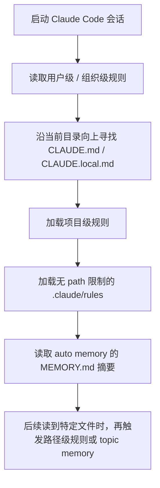

# Claude Code 记忆设计

## 资料来源地图

1. 来源类型：官方文档  
   为什么可信：Claude Code 的记忆机制、CLAUDE.md、auto memory、rules、/memory 都是产品行为，必须以官方文档为准。  
   本文主要参考：记忆类型、加载顺序、作用范围、auto memory 存储位置与限制。  
   链接：[Claude Code Docs - How Claude remembers your project](https://docs.anthropic.com/en/docs/claude-code/memory)

2. 来源类型：Agent 设计实践  
   为什么可信：Deep Research Skill / Policy 的设计经验中涉及”状态、策略、工具、评估”的工程化思路，可迁移到记忆设计题的作答结构。  
   本文主要参考：把记忆设计讲成 Agent 工程能力，而不是只背文件路径。

## 这篇解决什么问题

- 原始面经问题：
  - Claude Code 记忆设计。

- 你需要掌握的核心能力：
  - 区分“人工写入的持久指令”和“系统自动沉淀的经验”。
  - 能说明作用域：用户级、项目级、本地级、组织级、路径级。
  - 能解释为什么 memory 不是强制配置，而是上下文。
  - 能设计一个类 Claude Code 的记忆系统。

## 先讲人话版

Claude Code 的记忆不是“模型参数真的变了”，而是“每次会话开始时，把一些持久化 Markdown 内容重新塞进上下文”。

它大体有两类：

1. **CLAUDE.md / rules**：人写的说明书，比如项目结构、测试命令、代码规范。
2. **Auto memory**：Claude 自己在工作中总结的经验，比如“这个项目测试要先启动 Redis”、“用户喜欢 pnpm”。

面试时可以用一句话回答：

> Claude Code 的 memory 本质是分层持久上下文系统：人工规则负责稳定约束，auto memory 负责从交互中沉淀项目经验；启动时按作用域加载，工作时按需读取细分 topic，但它们只是提示上下文，不是硬约束。

## 必备前置知识

| 概念 | 短定义 | 为什么重要 |
|---|---|---|
| context window | 模型本轮可看到的上下文 | 记忆最终要进入上下文才能影响回答 |
| persistent instruction | 跨会话保留的指令 | 解决每次重复解释项目背景的问题 |
| scope | 记忆生效范围 | 决定用户级、项目级、目录级规则如何组合 |
| on-demand loading | 按需加载 | 大项目不能把所有记忆一次塞满上下文 |
| hard enforcement | 强制执行 | memory 不是强制策略，需要 hooks/settings 做硬约束 |

## 核心原理

### 1. 两套互补记忆

| 维度 | CLAUDE.md / rules | Auto memory |
|---|---|---|
| 谁写 | 人 | Claude |
| 内容 | 指令、规范、工作流、架构事实 | 调试经验、偏好、项目模式 |
| 作用域 | 用户、项目、目录、组织 | 通常按 repository/project |
| 加载方式 | 会话开始加载，路径规则可按需触发 | `MEMORY.md` 开头加载，topic 文件按需读 |
| 适合放什么 | “每次都要遵守”的事实 | “未来可能有用”的经验 |
| 风险 | 太长会占上下文、规则冲突 | 自动记录可能过时或不完整 |

### 2. CLAUDE.md 的分层作用域

官方文档把 CLAUDE.md 分成几类：

| 作用域 | 位置 | 典型用途 |
|---|---|---|
| 组织级 | macOS: `/Library/Application Support/ClaudeCode/CLAUDE.md` 等 | 公司安全规范、统一代码标准 |
| 用户级 | `~/.claude/CLAUDE.md` | 个人偏好、常用工具习惯 |
| 项目级 | `./CLAUDE.md` 或 `./.claude/CLAUDE.md` | 项目架构、构建命令、测试方式 |
| 本地级 | `./CLAUDE.local.md` | 不提交到仓库的个人配置 |
| 路径级 rules | `.claude/rules/*.md` | 只对某些目录或文件类型生效的规则 |

面试关键点：

> 越靠近当前项目/目录的规则越具体。更具体的规则通常应该覆盖更泛化的偏好，但如果内容冲突，模型不一定严格按优先级执行，所以规则要尽量无冲突、可验证。

### 3. 加载机制

简化理解：



官方文档强调：CLAUDE.md 是上下文，不是系统级强约束。如果一定要禁止某个动作，应该用 settings、permissions 或 hooks。

### 4. Auto memory 怎么设计

官方文档描述的 auto memory 设计很像“索引 + topic 文件”：

```text
~/.claude/projects/<project>/memory/
├── MEMORY.md          # 简短索引，启动时加载前 200 行或 25KB
├── debugging.md       # 调试经验
├── api-conventions.md # API 设计约定
└── ...
```

关键设计点：

- `MEMORY.md` 不应该越来越大，而应该像目录索引。
- 详细内容放到 topic 文件。
- 启动只加载摘要，工作中再按需读取。
- 用户可以通过 `/memory` 审计、编辑、删除。

### 5. 为什么 memory 不是无限塞上下文

上下文窗口是稀缺资源。记忆越多：

- 当前任务相关信息被挤压。
- 模型更容易注意力分散。
- 指令冲突概率变大。
- 长规则反而降低遵循率。

所以好的 memory 设计要做三件事：

1. **压缩**：只保存稳定、可复用、未来有价值的信息。
2. **分层**：全局规则、项目规则、目录规则分开。
3. **检索**：详细经验按 topic 存储，用到时再读。

## 面试怎么答

### 30 秒版

> Claude Code 的记忆可以分成手动记忆和自动记忆。手动记忆主要是 CLAUDE.md 和 `.claude/rules/`，用于保存项目规范、构建命令、代码风格；自动记忆是 Claude 在工作中总结的项目经验，按 repo 存在 memory 目录里，启动时只加载 MEMORY.md 的摘要，详细 topic 按需读取。它们本质都是持久化上下文，不是模型参数更新，也不是硬约束；如果要强制禁止行为，需要 permissions 或 hooks。

### 2 分钟版

> 我会把 Claude Code memory 设计成一个分层持久上下文系统。第一层是人工维护的规则，比如组织级、用户级、项目级 CLAUDE.md 和路径级 `.claude/rules/`，它们适合放稳定事实：项目结构、测试命令、代码规范。第二层是 auto memory，由 Agent 根据用户纠正和调试过程自动沉淀经验，比如某个测试需要本地服务、某个模块有特殊约定。
>
> 加载上不能把所有东西都塞进上下文，所以入口文件要短。以 auto memory 为例，`MEMORY.md` 更像索引，只加载前几百行或固定大小，详细内容放到 topic 文件，等 Agent 需要时再用文件工具读取。路径级 rules 也是类似思想，只在处理匹配文件时加载。
>
> 我还会强调 memory 不是强制配置，它影响模型行为但不能保证执行。如果是安全边界，比如禁止写某些目录、提交前必须跑检查，应该用 settings、permissions 或 hooks 做硬约束。

## 常见追问

### Q1：CLAUDE.md 和 auto memory 有什么区别？

CLAUDE.md 是人写的“稳定规则”，auto memory 是 Claude 自己总结的“经验”。前者适合放明确规范，后者适合放从交互中学到的项目模式。

### Q2：为什么不把所有历史对话都保存？

历史对话噪声大、长、容易过时。Memory 应该保存“可复用事实”，不是保存原始流水账。否则会浪费上下文并引入冲突。

### Q3：如何防止错误记忆污染后续会话？

- 用户可通过 `/memory` 审计和编辑。
- 自动写入前做价值判断，只保存稳定事实。
- 记忆加时间戳或来源。
- 对易变信息写成“截至某日期”。
- 冲突时优先更具体、更新、更权威的规则。

### Q4：如何设计项目级记忆内容？

推荐结构：

```markdown
# Project Memory

## Build
- Use `pnpm test` for unit tests.

## Architecture
- API handlers live under `src/api/handlers`.

## Conventions
- Use 2-space indentation.

## Pitfalls
- Integration tests require local Redis.
```

每条都要具体、可验证、短。

### Q5：Memory 和 Skill 有什么区别？

Memory 是跨会话保存的事实和偏好，默认会影响当前项目；Skill 是可复用任务流程，通常在特定任务需要时加载。比如“项目用 pnpm”适合 memory；“如何做 deep research 并生成报告”更适合 skill。

## 容易踩坑

- 说 memory 等于微调模型参数。错，它只是持久上下文。
- 说 CLAUDE.md 是硬约束。错，它会影响行为但不能保证强制执行。
- 把所有内容都放进一个巨大的 CLAUDE.md。太长会占上下文，遵循率变差。
- Auto memory 不做审计。错误记忆会持续污染后续会话。
- 用户隐私和敏感信息随便记。记忆系统必须考虑权限、审计和删除。

## 例子

### 一个好的项目 CLAUDE.md 片段

```markdown
# Project Instructions

## Commands
- Run `pnpm test` before opening a PR.
- Run `pnpm lint` after editing TypeScript files.

## Architecture
- API routes live in `src/api`.
- Shared UI components live in `src/components`.

## Conventions
- Prefer existing helper functions in `src/lib`.
- Do not introduce new state libraries without discussion.
```

### 一个不好的片段

```markdown
Be careful. Write good code. Understand the project deeply.
```

问题是不可验证、不可执行、没有具体上下文。

## 复习清单

- Claude Code 记忆 = 持久上下文，不是模型参数。
- 两类核心：CLAUDE.md/rules 和 auto memory。
- CLAUDE.md 适合稳定规则；auto memory 适合经验沉淀。
- 作用域：组织、用户、项目、本地、路径。
- Auto memory：`MEMORY.md` 做索引，topic 文件按需读取。
- `/memory` 用于查看、编辑、开关 auto memory。
- 硬约束要用 settings/permissions/hooks，不靠记忆。
- 好记忆要短、具体、可验证、少冲突。

## 参考资料

1. [Claude Code Docs - How Claude remembers your project](https://docs.anthropic.com/en/docs/claude-code/memory) - 官方文档；记忆机制最权威来源。
2. [Claude Code Docs - Settings](https://docs.anthropic.com/en/docs/claude-code/settings) - 官方文档；settings 与强制配置相关。

