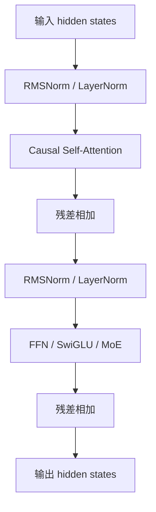

# Transformer 八股速记

## 资料来源地图

1. 来源类型：原始论文  
   为什么可信：Transformer、LayerNorm、RMSNorm、MoE、LoRA、GQA 等概念的定义源头。  
   本文主要参考：组件定义、公式、设计动机。  
   链接：[Attention Is All You Need](https://arxiv.org/abs/1706.03762)、[Layer Normalization](https://arxiv.org/abs/1607.06450)、[RMSNorm](https://arxiv.org/abs/1910.07467)、[Switch Transformer](https://arxiv.org/abs/2101.03961)、[LoRA](https://arxiv.org/abs/2106.09685)、[GQA](https://arxiv.org/abs/2305.13245)

2. 来源类型：已有 Obsidian 专题笔记  
   为什么可信：已经针对面试场景整理过 MHA、GQA、LoRA、Qwen3。  
   本文主要参考：面试表达、易错点、与 Qwen 系列的联系。  
   链接：[[01-MHA-多头注意力]]、[[02-GQA-分组查询注意力]]、[[04-LoRA微调与量化技术]]、[[07-Qwen3-模型架构]]

## 这篇解决什么问题

- 原始面经问题：
  - Transformer 八股集合：attention、除以 $\sqrt{d_k}$、LayerNorm、RMSNorm、FFN、SwiGLU、MoE、LoRA 和初始化、GQA。

- 你需要掌握的核心能力：
  - 能把一个 Transformer block 的数据流讲顺。
  - 能用“解决什么问题”的方式解释每个组件，而不是背公式。
  - 能应对常见追问：为什么缩放、为什么 RMSNorm、为什么 GQA、LoRA 怎么初始化。

## 先讲人话版

Transformer block 可以理解成两步：

1. Attention：每个 token 去看上下文里哪些 token 重要，把相关信息聚合回来。
2. FFN / MoE：对每个 token 自己做更复杂的非线性变换，提升表达能力。

中间夹着 Norm 和 Residual：

- Residual 让信息和梯度更容易穿过很多层。
- Norm 控制数值尺度，避免深层训练不稳定。

现代 LLM 里的常见升级：

- LayerNorm -> RMSNorm：少一步减均值，更省计算。
- MHA -> GQA：减少 K/V 头数，省 KV Cache。
- ReLU/GELU FFN -> SwiGLU：门控 FFN，效果更好。
- Dense FFN -> MoE：总参数更多，但每个 token 只激活少量专家。
- Full fine-tuning -> LoRA：冻结原模型，只训练低秩增量。

## 必备前置知识

| 概念 | 短定义 | 为什么重要 |
|---|---|---|
| token | 文本切分后的基本单位 | Transformer 每一步处理的是 token 序列 |
| embedding | token id 查表得到的向量 | 把离散文字变成可计算向量 |
| hidden state | 每层输出的 token 表示 | 后续 attention 和 FFN 都处理它 |
| residual | 子层输出加回原输入 | 深层模型稳定训练的关键 |
| causal mask | 禁止看未来 token | decoder-only 自回归生成必须满足 |
| KV Cache | 推理时缓存历史 K/V | 长文本推理显存瓶颈，GQA 的主要动机 |

## 核心原理

### 1. 一个 decoder-only block 的数据流



面试一句话：

> 一个 block 先用 attention 做上下文信息聚合，再用 FFN 做逐 token 的非线性变换；Norm 保证数值稳定，Residual 保证信息和梯度流动。

### 2. Attention

公式：

$$
\text{Attention}(Q,K,V)=\text{softmax}\left(\frac{QK^T}{\sqrt{d_k}}\right)V
$$

直觉：

- Q：当前 token 想找什么信息。
- K：每个 token 提供的“索引标签”。
- V：每个 token 真正要贡献的内容。
- $QK^T$：查询和索引的匹配程度。
- softmax：把匹配程度变成权重。
- 乘 V：按权重汇总内容。

### 3. 为什么除以 $\sqrt{d_k}$

如果 $q_i$ 和 $k_i$ 均值约为 0、方差约为 1，那么点积：

$$
q \cdot k = \sum_{i=1}^{d_k} q_i k_i
$$

方差大约随 $d_k$ 增长。$d_k$ 越大，attention logits 的幅度越大，softmax 越容易变成接近 one-hot，梯度会变小，训练不稳定。

除以 $\sqrt{d_k}$ 的作用是把标准差拉回稳定范围。

面试 30 秒版：

> 不缩放时，$QK^T$ 的方差会随 head 维度 $d_k$ 增大而增大，softmax 输入过大后会饱和成 one-hot，梯度接近 0。除以 $\sqrt{d_k}$ 可以把点积的标准差拉回 1 附近，让 softmax 的温度合适，训练更稳定。

易错点：

- 分母是每个 head 的维度 $d_k$，不是 $d_{model}$。
- LayerNorm 不能完全替代这个缩放，因为 softmax 饱和发生在 attention 内部的 logits 上。

### 4. LayerNorm vs RMSNorm

LayerNorm：

$$
\text{LN}(x)=\frac{x-\mu}{\sqrt{\sigma^2+\epsilon}}\gamma+\beta
$$

RMSNorm：

$$
\text{RMSNorm}(x)=\frac{x}{\sqrt{\frac{1}{d}\sum_i x_i^2+\epsilon}}\gamma
$$

对比：

| 维度 | LayerNorm | RMSNorm |
|---|---|---|
| 是否减均值 | 是 | 否 |
| 是否除尺度 | 是 | 是 |
| 参数 | $\gamma,\beta$ | 通常只有 $\gamma$ |
| 计算量 | 稍大 | 更小 |
| LLM 使用 | 早期 Transformer 常见 | LLaMA/Qwen/DeepSeek 常见 |

面试表达：

> RMSNorm 可以看作去掉 re-centering 的 LayerNorm，只保留 re-scaling。很多 LLM 发现控制向量尺度比强制均值为 0 更关键，所以 RMSNorm 以更小计算量获得足够稳定性。

### 5. FFN

标准 FFN 对每个 token 独立做两层 MLP：

$$
\text{FFN}(x)=W_2 \cdot \phi(W_1x+b_1)+b_2
$$

它不混合 token 之间的信息，只增强每个 token 的非线性表达。token 间交互主要由 attention 完成。

常见追问：

- 问：FFN 为什么维度先升后降？  
  答：升维提供更大的中间特征空间，激活函数在高维里做非线性组合，再降回模型维度，方便残差连接。

### 6. SwiGLU

SwiGLU 是门控 FFN，常见形式：

$$
\text{SwiGLU}(x)=W_{down}\left(\text{SiLU}(W_{gate}x)\odot W_{up}x\right)
$$

其中：

- `up_proj` 提供候选信息。
- `gate_proj` 经过 SiLU 后当门控。
- 两者逐元素相乘，让模型决定哪些维度通过。

面试表达：

> 普通 FFN 是“全部特征一起过激活”，SwiGLU 多了一条门控分支，可以动态选择哪些中间特征更重要，因此在大模型中通常比 ReLU/GELU FFN 效果更好。

### 7. MoE

MoE 把 FFN 换成多个专家：

```text
token hidden state
  -> router/gate 打分
  -> 选择 top-k experts
  -> 只计算被选中的专家
  -> 加权合并输出
```

核心矛盾：

- 总参数可以非常大，容量更高。
- 每个 token 只激活少量专家，计算量可控。

常见追问：

- 问：MoE 为什么需要 load balancing？  
  答：如果路由器总把 token 分给少数专家，这些专家会过载，其他专家学不到东西。load balancing loss 用来鼓励 token 分布更均匀。

- 问：MoE 的缺点？  
  答：通信复杂、路由不均衡、训练更难、推理部署要处理专家并行和负载波动。

### 8. LoRA 与初始化

LoRA 冻结原权重 $W$，只训练低秩增量：

$$
W' = W + \Delta W,\quad \Delta W = BA
$$

如果原矩阵是 $d_{out}\times d_{in}$，LoRA 用：

- $A \in \mathbb{R}^{r \times d_{in}}$
- $B \in \mathbb{R}^{d_{out} \times r}$
- $r \ll d$

参数量从 $d_{out}d_{in}$ 变成 $r(d_{in}+d_{out})$。

初始化常见做法：

- $A$ 随机初始化。
- $B$ 初始化为 0。

为什么？

> 这样训练开始时 $\Delta W = BA = 0$，模型输出与原模型完全一致，不会一开始就破坏预训练能力；随后训练逐步学习低秩更新。

也有实现会把 B 随机、A 为 0，本质目标一样：让初始增量为 0。

### 9. GQA

MHA 中，每个 Q head 都有自己的 K/V head；GQA 中，多组 Q head 共享较少的 K/V head。

| 机制 | Q 头数 | KV 头数 | KV Cache | 质量 |
|---|---:|---:|---:|---|
| MHA | h | h | 最大 | 高 |
| MQA | h | 1 | 最小 | 可能下降 |
| GQA | h | g，1 < g < h | 中等 | 接近 MHA |

面试表达：

> GQA 是 MHA 和 MQA 的折中。它让多个 query heads 共享一组 key/value heads，主要节省推理阶段的 KV Cache，同时比 MQA 保留更多表达能力。

## 面试怎么答

### 30 秒版

> Transformer block 主要由 self-attention 和 FFN 两部分组成。Attention 用 Q/K/V 计算 token 间相关性，除以 $\sqrt{d_k}$ 是为了控制点积方差，避免 softmax 饱和。Norm 用来稳定深层训练，现代 LLM 常用 RMSNorm 替代 LayerNorm。FFN 做逐 token 非线性变换，SwiGLU 是更强的门控 FFN。MoE 把 FFN 换成多个专家，每个 token 只激活 top-k 专家。LoRA 冻结原权重，只训练低秩增量，常用零初始化保证初始不扰动模型。GQA 则通过减少 KV heads 来节省 KV Cache。

### 2 分钟版

> 我会按一个 decoder-only block 的数据流讲：输入先做 Norm，再进入 causal self-attention。Attention 中 Q 表示当前 token 想找什么，K 表示每个 token 的索引，V 表示内容；$QK^T$ 得到相似度，softmax 后对 V 加权求和。这里要除以 $\sqrt{d_k}$，因为点积方差会随 head 维度增大，softmax 容易饱和。
>
> Attention 输出后做残差，再进入第二个 Norm 和 FFN。FFN 不混合 token，只对每个 token 做非线性变换。现代 LLM 常用 SwiGLU，用 gate 分支筛选特征；更大模型还会用 MoE，把 FFN 替换成多个专家，router 给每个 token 选 top-k 专家。
>
> 工程上，RMSNorm 比 LayerNorm 少减均值，计算更轻；GQA 让多个 Q head 共享 K/V，主要减少推理的 KV Cache；LoRA 则用于微调，冻结原权重，只训练低秩增量，初始化时让增量为 0，保证一开始不破坏原模型。

## 常见追问

### Q1：Pre-Norm 和 Post-Norm 区别？

Pre-Norm 是先 Norm 再进子层，Post-Norm 是子层和残差相加后再 Norm。现代深层 LLM 多用 Pre-Norm，因为梯度更容易穿过残差路径，训练更稳定。

### Q2：FFN 和 Attention 谁更耗参数？

通常 FFN 参数占比很大。以标准 Transformer 为例，FFN 中间维度常是 $4d_{model}$，两层线性参数约 $8d^2$，attention 的 Q/K/V/O 约 $4d^2$。

### Q3：MoE 增加总参数后为什么计算不同比例增加？

因为每个 token 只走 top-k 专家，而不是所有专家。总参数增加的是模型容量，实际计算主要取决于激活专家数。

### Q4：GQA 会不会损失效果？

会有潜在损失，因为 K/V 表达变少了。但相对 MQA，GQA 保留多个 KV 组，通常质量接近 MHA，同时显著节省 KV Cache。

## 容易踩坑

- 把 $d_k$ 说成 $d_{model}$。
- 说 LayerNorm 能替代 attention scaling。
- 说 RMSNorm “没有归一化”，其实它做尺度归一化，只是不减均值。
- 说 FFN 混合 token 信息，实际上 FFN 是逐 token 的。
- 说 MoE 每次所有专家都参与，实际上只激活 top-k。
- 说 LoRA 随机初始化会一开始改变原模型，正确目标是让初始 $\Delta W=0$。
- 说 GQA 是训练加速，主要收益其实在推理 KV Cache 和带宽。

## 例子

### LoRA 初始化最小例子

```python
import torch

d_in, d_out, r = 4096, 4096, 8
A = torch.randn(r, d_in) * 0.01
B = torch.zeros(d_out, r)

delta_w = B @ A
print(delta_w.abs().max())  # tensor(0.)
```

因为 `B` 全 0，所以初始 `delta_w` 是 0，模型行为不变。

## 复习清单

- Attention：Q/K/V、softmax、加权汇总。
- $\sqrt{d_k}$：控制点积方差，防止 softmax 饱和。
- LayerNorm：减均值、除标准差、仿射变换。
- RMSNorm：只按 RMS 缩放，更轻。
- FFN：逐 token 非线性变换。
- SwiGLU：gate 分支筛选特征。
- MoE：router 选择 top-k experts，容量大但计算可控。
- LoRA：冻结 W，训练 $\Delta W=BA$，初始增量为 0。
- GQA：多个 Q head 共享较少 K/V head，省 KV Cache。

## 参考资料

1. [Vaswani et al., Attention Is All You Need](https://arxiv.org/abs/1706.03762) - Transformer 原始论文。
2. [Ba et al., Layer Normalization](https://arxiv.org/abs/1607.06450) - LayerNorm 原始论文。
3. [Zhang and Sennrich, Root Mean Square Layer Normalization](https://arxiv.org/abs/1910.07467) - RMSNorm 原始论文。
4. [Shazeer, GLU Variants Improve Transformer](https://arxiv.org/abs/2002.05202) - SwiGLU/GLU 变体来源。
5. [Fedus et al., Switch Transformers](https://arxiv.org/abs/2101.03961) - 大规模稀疏 MoE 代表论文。
6. [Hu et al., LoRA](https://arxiv.org/abs/2106.09685) - LoRA 原始论文。
7. [Ainslie et al., GQA](https://arxiv.org/abs/2305.13245) - Grouped-Query Attention 论文。

