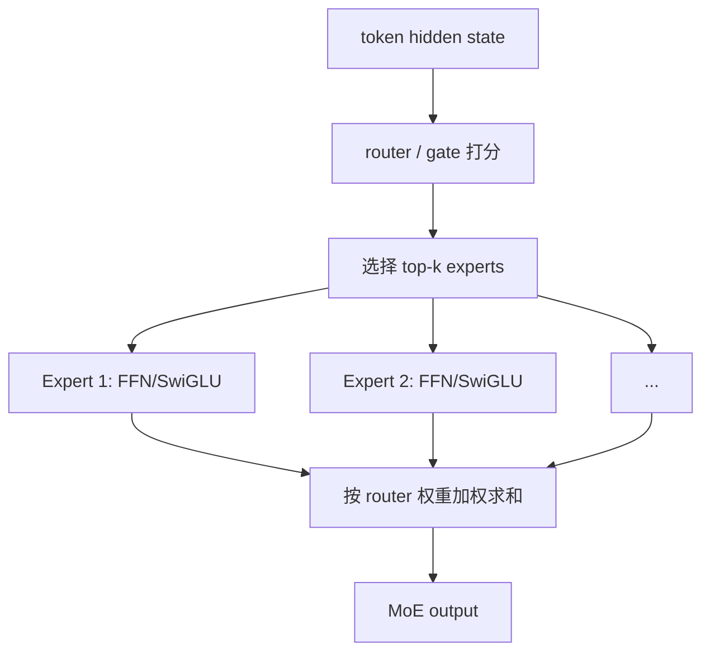

# LayerNorm、RMSNorm、FFN、SwiGLU、MoE、LoRA、GQA

## 资料来源地图

1. 来源类型：原始论文  
   为什么可信：这些概念的定义和设计动机主要来自论文，是面试中最本源的依据。  
   本文主要参考：LayerNorm / RMSNorm / SwiGLU / MoE / LoRA / GQA 的公式、直觉和改进动机。  
   链接：[Layer Normalization](https://arxiv.org/abs/1607.06450)、[RMSNorm](https://arxiv.org/abs/1910.07467)、[GLU Variants Improve Transformer](https://arxiv.org/abs/2002.05202)、[Switch Transformer](https://arxiv.org/abs/2101.03961)、[LoRA](https://arxiv.org/abs/2106.09685)、[GQA](https://arxiv.org/abs/2305.13245)

2. 来源类型：已有 Obsidian 专题笔记  
   为什么可信：本地已有 MHA、GQA、LoRA、Qwen3 架构长文，本文把截图里点名的零散组件合并成一篇面试速答专题。  
   本文主要参考：[[01-MHA-多头注意力]]、[[02-GQA-分组查询注意力]]、[[04-LoRA微调与量化技术]]、[[07-Qwen3-模型架构]]、[[09-Transformer八股速记]]。  
   链接：本地 Obsidian 笔记。

## 这篇解决什么问题

- 原始面经问题：
  - `layernorm, rmsnorm, ffn, swiglu, moe, lora和初始化, gqa`

- 你需要掌握的核心能力：
  - 能把这些组件放回 Transformer block 的位置里。
  - 能说明它们分别解决什么问题。
  - 能用 30 秒说清每个概念。
  - 能应对常见追问：RMSNorm 和 LayerNorm 差别、SwiGLU 为什么强、MoE 为什么省算力、LoRA 为什么这样初始化、GQA 为什么省 KV Cache。

## 先讲人话版

这一串其实不是孤立知识点，而是现代 LLM 的一个标准 decoder layer 里常见的组件：

```text
输入 hidden state
  -> RMSNorm / LayerNorm      # 先把数值尺度稳定住
  -> Attention / GQA          # token 之间互相看
  -> 残差
  -> RMSNorm / LayerNorm      # 再稳定一次
  -> FFN / SwiGLU / MoE       # 每个 token 自己做非线性变换
  -> 残差
```

LoRA 不属于模型原始 forward 的一个固定层，而是微调时插到 Linear 层上的低秩增量。

一句话总览：

> LayerNorm/RMSNorm 负责稳定训练，FFN/SwiGLU/MoE 负责提升每个 token 的表达能力，GQA 负责降低推理 KV Cache，LoRA 负责低成本微调。

## 必备前置知识

| 概念 | 短定义 | 为什么重要 |
|---|---|---|
| hidden state | token 在某层里的向量表示 | Norm、Attention、FFN 都处理它 |
| 维度 d | hidden state 的长度 | Norm 在这个维度上统计均值/方差/RMS |
| residual | 子层输出加回输入 | 深层 Transformer 稳定训练的关键 |
| attention head | 注意力的一个子空间 | GQA 讨论的是 Q head 和 KV head 的数量关系 |
| Linear 层 | 矩阵乘 $`y = xW`$ | LoRA 通常加在 attention/FFN 的 Linear 上 |
| KV Cache | 推理时缓存历史 Key/Value | GQA 的主要收益点 |

## 核心原理

### 1. LayerNorm：对每个 token 的特征维度做归一化

LayerNorm 公式：

```math
\mu = \frac{1}{d}\sum_{i=1}^{d}x_i
```

```math
\sigma^2 = \frac{1}{d}\sum_{i=1}^{d}(x_i-\mu)^2
```

```math
\text{LayerNorm}(x)=\frac{x-\mu}{\sqrt{\sigma^2+\epsilon}}\cdot\gamma+\beta
```

直觉：

> 对一个 token 的 hidden vector，把它拉成“均值接近 0、方差接近 1”的稳定尺度，再用可学习的 $`\gamma,\beta`$ 允许模型恢复需要的尺度和平移。

为什么 Transformer 用 LayerNorm 而不是 BatchNorm：

- NLP 序列长度不固定，batch 内 token 数和 padding 复杂。
- Transformer 更关心每个 token 自己的特征尺度。
- 自回归推理时 batch 统计不稳定，BatchNorm 不方便。

面试 30 秒：

> LayerNorm 是对单个 token 的 hidden dimension 做归一化，减均值、除标准差，再乘可学习缩放和平移。它不依赖 batch 统计，所以适合变长序列和自回归生成，主要作用是稳定深层网络的激活尺度和梯度。

### 2. RMSNorm：只做尺度归一化，不减均值

RMSNorm 公式：

```math
\text{RMS}(x)=\sqrt{\frac{1}{d}\sum_{i=1}^{d}x_i^2+\epsilon}
```

```math
\text{RMSNorm}(x)=\frac{x}{\text{RMS}(x)}\cdot\gamma
```

和 LayerNorm 对比：

| 维度 | LayerNorm | RMSNorm |
|---|---|---|
| 减均值 | 是 | 否 |
| 除尺度 | 标准差 | RMS |
| 参数 | $`\gamma,\beta`$ | 通常只有 $`\gamma`$ |
| 计算量 | 稍大 | 更小 |
| 现代 LLM | 可用 | LLaMA、Qwen、DeepSeek 等常见 |

为什么 RMSNorm 在 LLM 里常见：

- 大模型里控制向量尺度通常比强行把均值变成 0 更关键。
- 少一步均值计算，训练和推理更省。
- 在很多 Transformer LLM 中经验效果足够好。

面试 30 秒：

> RMSNorm 可以看作去掉“减均值”的 LayerNorm，只保留按 RMS 缩放。它主要控制 hidden state 的尺度，计算更省。现代 LLM 常用 RMSNorm，是因为深层训练最关键的是控制激活模长，未必一定要做 re-centering。

### 3. LayerNorm vs RMSNorm 的本质区别

核心区别不是“一个归一化，一个不归一化”，而是：

```text
LayerNorm = re-centering + re-scaling
RMSNorm   =              re-scaling
```

面试追问版：

> LayerNorm 同时控制均值和方差，RMSNorm 只控制尺度。RMSNorm 少了减均值，所以速度更快、实现更简单；但它不保证输出均值为 0。LLM 中残差流和 Pre-Norm 结构更需要稳定尺度，因此 RMSNorm 往往够用。

容易踩坑：

- 不要说 RMSNorm 没有归一化，它有尺度归一化。
- 不要说 RMSNorm 永远更好，它是工程和效果的折中。

### 4. FFN：逐 token 的非线性变换

标准 Transformer FFN：

```math
\text{FFN}(x)=W_2\cdot \phi(W_1x+b_1)+b_2
```

常见形状：

```text
d_model -> d_ff -> d_model
```

其中 $`d_{ff}`$ 常比 $`d_{model}`$ 大，例如 4 倍。

FFN 的位置：

```text
Attention 负责 token 和 token 之间的信息交换
FFN 负责每个 token 内部的非线性特征变换
```

为什么需要 FFN：

- 只有 attention 的加权平均不够表达复杂函数。
- FFN 通过升维、激活、降维增强每个 token 的表示能力。
- 参数量很大，很多 LLM 的 FFN 参数占比甚至超过 attention。

面试 30 秒：

> FFN 是 Transformer block 里的逐 token MLP。Attention 负责混合不同 token 的信息，FFN 不混 token，而是对每个 token 的 hidden state 做升维、非线性激活、再降维，增强表达能力。

### 5. SwiGLU：带门控的 FFN

普通 FFN：

```math
\text{FFN}(x)=W_{down}\phi(W_{up}x)
```

SwiGLU：

```math
\text{SwiGLU}(x)=W_{down}\left(\text{SiLU}(W_{gate}x)\odot W_{up}x\right)
```

拆开：

- `up_proj(x)`：生成候选特征。
- `gate_proj(x)`：生成门控信号。
- `SiLU(gate)`：平滑门控。
- `⊙`：逐元素相乘，决定哪些特征通过。
- `down_proj`：投回 $`d_{model}`$。

直觉：

> 普通 FFN 像“所有特征一起过激活”，SwiGLU 像“先生成候选特征，再用一个门决定每个维度放行多少”。

为什么大模型喜欢 SwiGLU：

- 门控机制表达能力更强。
- SiLU 平滑、无硬截断，梯度更友好。
- LLaMA、Qwen 等现代 LLM 常用 SwiGLU 风格 FFN。

面试 30 秒：

> SwiGLU 是一种 gated FFN。它有 up 和 gate 两条支路，gate 经过 SiLU 后和 up 的结果逐元素相乘，再 down projection。相比普通 FFN，它能动态选择哪些中间特征通过，表达能力更强。

### 6. MoE：把 FFN 换成多个专家

MoE 全称 Mixture of Experts，常用于替换 Transformer 的 FFN 部分。

基本流程：



核心思想：

> 模型可以有很多专家参数，但每个 token 只激活少数专家，所以总容量大，单 token 计算量相对可控。

Dense FFN vs MoE：

| 维度 | Dense FFN | MoE FFN |
|---|---|---|
| 每个 token 走哪些参数 | 全部 FFN 参数 | top-k 专家 |
| 总参数 | 相对小 | 可以很大 |
| 激活参数 | 等于总参数 | 远小于总参数 |
| 训练难度 | 较简单 | 更难，需要路由和负载均衡 |
| 推理特点 | 延迟稳定 | 吞吐潜力高，但部署复杂 |

为什么 MoE 不等于显存也省：

- 计算时只激活 top-k 专家。
- 但部署时通常仍要把所有专家权重加载到 GPU 或分布式设备上。
- 所以 MoE 省的是每 token FLOPs，不一定省总显存。

面试 30 秒：

> MoE 通常把 Transformer 里的 FFN 换成多个专家。Router 给每个 token 打分，只选 top-k 专家计算，然后按权重合并输出。这样模型总参数和容量可以很大，但每个 token 激活参数较少，计算量可控。难点是路由均衡、通信开销和部署复杂度。

### 7. LoRA：低秩增量微调

LoRA 解决的问题：

> 全量微调大模型太贵。LoRA 冻结原模型权重，只训练一个低秩增量矩阵。

原始 Linear：

```math
y = xW
```

LoRA 后：

```math
y = x(W + \Delta W)
```

其中：

```math
\Delta W = BA
```

如果 $`W \in \mathbb{R}^{d_{out}\times d_{in}}`$：

- $`A \in \mathbb{R}^{r\times d_{in}}`$
- $`B \in \mathbb{R}^{d_{out}\times r}`$
- $`r \ll d`$

参数量：

```text
全量微调: d_out * d_in
LoRA: r * d_in + d_out * r
```

### 8. LoRA 初始化为什么常用 A 随机、B 为 0

常见初始化：

```text
A: 随机初始化
B: 初始化为 0
```

这样：

```math
\Delta W = BA = 0
```

训练一开始：

```text
W + ΔW = W
```

模型输出和原模型完全一致，不会一上来破坏预训练能力。

为什么不是 A 和 B 都初始化为 0：

- 如果 A 和 B 都是 0，梯度流动会有问题，两个矩阵可能无法有效打破对称。
- A 随机、B 为 0 时，初始输出不变，但 B 可以先获得梯度；B 更新后，A 也会逐步获得有效梯度。

也有实现会反过来：

```text
A: 0
B: 随机
```

本质目标一样：初始 $`\Delta W=0`$。

面试 30 秒：

> LoRA 冻结原权重，只训练低秩增量 $`\Delta W=BA`$。因为 $`r`$ 很小，训练参数和显存都少。初始化时常用 A 随机、B 为 0，让初始 $`\Delta W=0`$，模型一开始等价于原模型，不破坏预训练能力，同时又能在训练中逐步学习低秩更新。

### 9. GQA：Grouped Query Attention

先看 MHA：

```text
num_q_heads = num_kv_heads
```

每个 Q head 都有自己的 K/V head。

MQA：

```text
num_q_heads = h
num_kv_heads = 1
```

所有 Q heads 共享同一组 K/V。

GQA：

```text
num_q_heads = h
num_kv_heads = g, 1 < g < h
```

多个 Q heads 分组共享 K/V。

对比：

| 机制 | Q heads | KV heads | KV Cache | 质量 |
|---|---:|---:|---:|---|
| MHA | h | h | 最大 | 通常最好 |
| MQA | h | 1 | 最小 | 可能损失明显 |
| GQA | h | g | 中等 | 接近 MHA |

为什么 GQA 省推理显存：

自回归 decode 时，每层都要缓存历史 token 的 K/V：

```math
\text{KV Cache} \propto 2 \times L \times n_{kv\_heads} \times d_{head}
```

GQA 把 $`n_{kv\_heads}`$ 从 $`h`$ 降到 $`g`$，KV Cache 近似按比例下降。

例如：

```text
MHA: Q heads = 32, KV heads = 32
GQA: Q heads = 32, KV heads = 4
KV Cache 约变成 1/8
```

面试 30 秒：

> GQA 是 MHA 和 MQA 的折中。MHA 每个 Q head 都有自己的 K/V，KV Cache 大；MQA 所有 Q head 共享一个 K/V，省但可能掉效果；GQA 让一组 Q heads 共享一组 K/V，在显著降低 KV Cache 的同时尽量保持接近 MHA 的质量。

## 面试怎么答

### 30 秒总答

> 这几个组件可以按 Transformer block 来讲：LayerNorm/RMSNorm 是归一化，稳定深层训练；现代 LLM 常用 RMSNorm，因为它只做尺度归一化，计算更轻。FFN 是逐 token 的 MLP，负责非线性表达；SwiGLU 是带门控的 FFN，能选择哪些中间特征通过。MoE 把 FFN 换成多个专家，每个 token 只激活 top-k 专家，增加总容量但控制计算。LoRA 是微调方法，冻结原权重，只训练低秩增量，初始化时让增量为 0。GQA 是注意力优化，让多个 Q heads 共享 K/V heads，主要节省推理 KV Cache。

### 2 分钟版

> 我会先把它们放到 Transformer block 里。Attention 前后通常会有 Norm，早期常用 LayerNorm，对每个 token 的 hidden dimension 减均值除标准差；现代 LLM 常用 RMSNorm，只按 RMS 做尺度归一化，不减均值，所以更省计算。然后 Attention 负责 token 间信息交互。为了降低推理时 KV Cache，很多模型会用 GQA，让多个 query heads 共享较少的 key/value heads。
>
> Attention 后是 FFN。FFN 不混合 token，而是对每个 token 自己做升维、激活、降维。SwiGLU 是现代常见 FFN 变体，多了 gate 分支，用 SiLU 后和 up 分支逐元素相乘，表达能力更强。MoE 则进一步把 FFN 换成多个专家，router 给每个 token 选 top-k 专家，所以总参数可以很大，但每 token 计算量较小。
>
> LoRA 是微调阶段的技术，不是基础 block 必须有的层。它冻结原权重，只训练低秩矩阵 A、B，让 $`\Delta W=BA`$。常见初始化是 A 随机、B 为 0，使初始增量为 0，保证一开始不改变原模型输出。

### 深入追问版

> 如果追问工程取舍，我会说：RMSNorm 是用更少计算换足够的训练稳定性；GQA 是用少量质量折中换 KV Cache 和带宽下降；SwiGLU 是用更多 FFN 参数换更强表达；MoE 是用路由和部署复杂度换参数容量；LoRA 是用低秩假设换参数高效微调。

## 常见追问

### Q1：LayerNorm 和 RMSNorm 最大区别是什么？

LayerNorm 做减均值和除标准差，RMSNorm 只按 RMS 除尺度。RMSNorm 不保证均值为 0，但能稳定向量模长，计算更省。

### Q2：为什么 FFN 不处理 token 间关系？

FFN 对每个位置独立应用同一组 MLP。token 间交互发生在 attention，FFN 只是增强每个 token 的非线性表示。

### Q3：SwiGLU 比 GELU FFN 强在哪里？

SwiGLU 有**门控分支**，可以动态控制特征通过，而不是所有中间特征统一过激活。经验上在大模型中效果更好。

### Q4：MoE 是不是每次只加载 top-k 专家，所以显存很小？

不是。计算时只激活 top-k，但部署通常要存所有专家权重。MoE 主要**省每 token 计算，不必然省总显存。**

### Q5：LoRA 为什么低秩是合理的？

直觉是微调任务对**模型权重的改变量往往落在较低维的子空间**，不需要更新完整大矩阵。低秩增量可以捕捉主要变化方向。

### Q6：LoRA 插在哪些层？

常见插在 attention 的 `q_proj`、`v_proj`，也可插 `k_proj`、`o_proj`、FFN 的 up/down/gate projection。具体取决于任务和显存预算。

### Q7：GQA 和 MQA 区别？

MQA 只有一组 K/V heads，所有 Q heads 共享；GQA 有多组 K/V heads，每组服务一部分 Q heads。GQA 是质量和效率的折中。

## 容易踩坑

- 把 RMSNorm 说成“不归一化”。它是不减均值，但仍做尺度归一化。
- 说 FFN 负责 token 间交互。错，token 间交互主要靠 attention。
- 说 SwiGLU 只是换了激活函数。更准确是 gated FFN。
- 说 MoE 显存一定小。它省计算，不一定省权重存储。
- 说 LoRA 的 A、B 都初始化为 0。常见做法是一个随机、一个为 0。
- 说 LoRA 初始化随机会改变原模型。正确初始化目标是初始 $`\Delta W=0`$。
- 说 GQA 提升训练速度是主因。它的核心收益通常是推理 KV Cache 和带宽。
- 混淆 Q heads 和 KV heads。GQA 是减少 KV heads，不是减少 Q heads。

## 例子

### 1. RMSNorm PyTorch 极简实现

```python
import torch


def rms_norm(x, weight, eps=1e-6):
    rms = torch.sqrt(torch.mean(x * x, dim=-1, keepdim=True) + eps)
    return x / rms * weight


x = torch.randn(2, 4, 8)       # [batch, seq_len, hidden]
weight = torch.ones(8)
y = rms_norm(x, weight)
print(y.shape)                 # torch.Size([2, 4, 8])
```

关键点：

- `dim=-1` 表示沿 hidden dimension 做归一化。
- 没有减均值。
- `weight` 是可学习缩放参数。

### 2. SwiGLU 极简实现

```python
import torch
import torch.nn as nn
import torch.nn.functional as F


class SwiGLUFFN(nn.Module):
    def __init__(self, d_model, d_ff):
        super().__init__()
        self.gate_proj = nn.Linear(d_model, d_ff, bias=False)
        self.up_proj = nn.Linear(d_model, d_ff, bias=False)
        self.down_proj = nn.Linear(d_ff, d_model, bias=False)

    def forward(self, x):
        gated = F.silu(self.gate_proj(x)) * self.up_proj(x)
        return self.down_proj(gated)
```

### 3. LoRA 初始化极简实现

```python
import torch

d_in, d_out, r = 4096, 4096, 8
A = torch.randn(r, d_in) * 0.01
B = torch.zeros(d_out, r)

delta_w = B @ A
print(delta_w.abs().max())  # tensor(0.)
```

因为 `B` 是 0，所以初始 $`\Delta W=0`$。

### 4. GQA 的 head 关系

```text
Q heads:  0  1  2  3  4  5  6  7
KV heads: 0        1        2        3

每 2 个 Q heads 共享 1 个 KV head
```

如果 MHA 是 8 个 KV heads，GQA 变成 4 个 KV heads，KV Cache 约减半。

## 复习清单

- LayerNorm：减均值、除标准差、乘 $`\gamma`$ 加 $`\beta`$。
- RMSNorm：不减均值，只按 RMS 缩放，常见于现代 LLM。
- FFN：逐 token MLP，升维、激活、降维。
- SwiGLU：gate + up 两支路，SiLU 后逐元素相乘。
- MoE：router 选 top-k experts，总容量大、每 token 计算可控。
- MoE 坑点：省 FLOPs，不一定省总显存；需要负载均衡。
- LoRA：冻结 W，只训练低秩 $`\Delta W=BA`$。
- LoRA 初始化：一个矩阵随机、一个矩阵为 0，保证初始 $`\Delta W=0`$。
- GQA：减少 KV heads，让多个 Q heads 分组共享 K/V，主要省 KV Cache。
- 面试顺序：Norm -> FFN/SwiGLU/MoE -> LoRA -> GQA。

## 参考资料

1. [Ba et al., Layer Normalization](https://arxiv.org/abs/1607.06450) - LayerNorm 原始论文。
2. [Zhang and Sennrich, Root Mean Square Layer Normalization](https://arxiv.org/abs/1910.07467) - RMSNorm 原始论文。
3. [Shazeer, GLU Variants Improve Transformer](https://arxiv.org/abs/2002.05202) - SwiGLU/GLU 变体来源。
4. [Fedus et al., Switch Transformers](https://arxiv.org/abs/2101.03961) - 稀疏 MoE 代表论文。
5. [Hu et al., LoRA](https://arxiv.org/abs/2106.09685) - LoRA 原始论文。
6. [Ainslie et al., GQA](https://arxiv.org/abs/2305.13245) - Grouped-Query Attention 论文。
7. [[02-GQA-分组查询注意力]] - 本地 GQA 专题。
8. [[04-LoRA微调与量化技术]] - 本地 LoRA 专题。
9. [[07-Qwen3-模型架构]] - 本地 Qwen3 架构专题。

