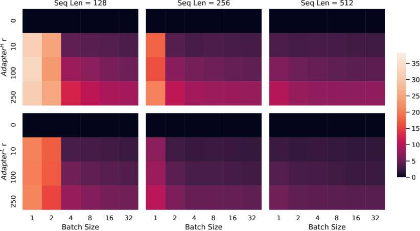
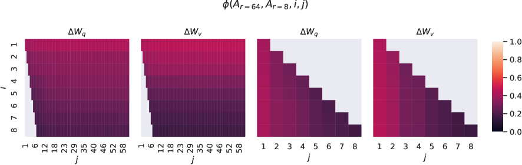
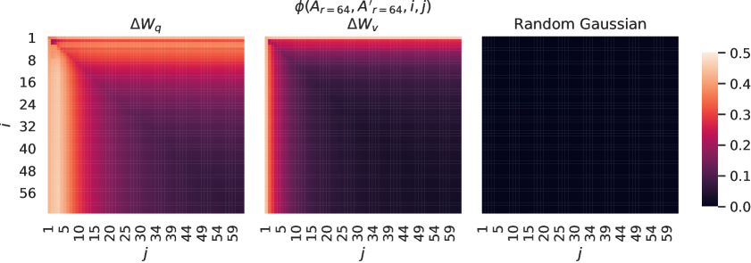

---
tags:
  - 面试
  - 大模型
  - LoRA
  - 量化
  - QLoRA
  - GPTQ
  - AWQ
created: 2026-05-11
updated: 2026-05-11
---

# LoRA 微调与量化技术

> 核心问题：如何在有限 GPU 上微调大模型？LoRA 为什么能省参数？量化如何进一步压缩？

---

## 1. LoRA：Low-Rank Adaptation

### 1.1 核心思想

预训练权重 $W_0 \in \mathbb{R}^{d \times k}$ 冻结不动，用两个小矩阵的乘积来表示"增量"：

$$
W = W_0 + \Delta W = W_0 + BA
$$

其中 $B \in \mathbb{R}^{d \times r}$，$A \in \mathbb{R}^{r \times k}$，$r \ll \min(d, k)$。

- $W_0$：冻结，不参与梯度更新
- $A$：初始化为随机高斯
- $B$：初始化为**零矩阵**（所以 $\Delta W = BA = 0$，训练开始时模型行为不变）

### 1.2 为什么省参数？

以 $d=k=4096$（LLaMA-7B 的隐藏维度）为例：

| | 参数量 |
|---|---|
| 原始权重 $W_0$ | $4096 \times 4096 = 16.7M$ |
| LoRA（r=8） | $(4096 \times 8) + (8 \times 4096) = 65.5K$ |
| **压缩比** | **256×** |

### 1.3 关键超参数

| 参数 | 含义 | 典型值 |
|---|---|---|
| $r$ (rank) | 低秩矩阵的秩 | 8, 16, 32, 64 |
| $\alpha$ (scaling) | 缩放系数 | 通常 = r 或 2r |
| 目标模块 | 对哪些层加 LoRA | q_proj, v_proj 或所有线性层 |

**实际更新量**被 $\alpha / r$ 缩放：

$$
\Delta W = \frac{\alpha}{r} \cdot BA
$$

> [!tip] alpha 的作用
> 当 `alpha = r` 时，缩放系数为 1，等效于不加缩放。
> 当 `alpha = 2r` 时，相当于把 LoRA 的学习率翻倍。
> 调 alpha 本质上是调 LoRA 分支的学习率，不用动 optimizer。

### 1.4 LoRA 应该加在哪些层？

原始论文只加在 Attention 的 Q、V 投影矩阵上。后续实践表明：

| 策略 | 效果 |
|---|---|
| 只加 Q、V | 基线效果，参数最少 |
| 加 Q、K、V、O | 更好，参数稍多 |
| **加所有线性层**（QKV/O + FFN） | **最佳**，参数适中 |
| 加 Embedding 层 | 通常不需要 |

> 推荐做法：用较大的 r（如 64）只加 QKV，或者用较小的 r（如 8-16）加所有线性层，两者效果接近。

### 1.5 LoRA 的前向计算

```python
import torch
import torch.nn as nn


class LoRALinear(nn.Module):
    """带 LoRA 的线性层。"""

    def __init__(
        self,
        in_features: int,
        out_features: int,
        rank: int = 8,
        alpha: float = 16.0,
    ):
        super().__init__()
        self.rank = rank
        self.alpha = alpha
        self.scaling = alpha / rank

        # 原始权重（冻结）
        self.weight = nn.Parameter(
            torch.randn(out_features, in_features), requires_grad=False
        )
        self.bias = nn.Parameter(torch.zeros(out_features), requires_grad=False)

        # LoRA 低秩矩阵
        self.lora_A = nn.Parameter(torch.randn(rank, in_features) * 0.01)
        self.lora_B = nn.Parameter(torch.zeros(out_features, rank))

    def forward(self, x: torch.Tensor) -> torch.Tensor:
        # 原始线性变换
        result = nn.functional.linear(x, self.weight, self.bias)
        # LoRA 增量
        result += (x @ self.lora_A.T @ self.lora_B.T) * self.scaling
        return result


# ===== 使用示例 =====
if __name__ == "__main__":
    layer = LoRALinear(in_features=4096, out_features=4096, rank=8, alpha=16)
    x = torch.randn(2, 10, 4096)
    out = layer(x)
    print(f"输入: {x.shape}")
    print(f"输出: {out.shape}")

    # 可训练参数对比
    total = sum(p.numel() for p in layer.parameters())
    trainable = sum(p.numel() for p in layer.parameters() if p.requires_grad)
    print(f"总参数: {total:,}")
    print(f"可训练参数: {trainable:,} ({trainable/total*100:.2f}%)")
```

输出：
```
输入: torch.Size([2, 10, 4096])
输出: torch.Size([2, 10, 4096])
总参数: 33,566,721
可训练参数: 65,536 (0.20%)
```

### 1.6 合并 LoRA 权重

推理时可以把 $BA$ 直接加到 $W_0$ 上，零额外开销：

```python
def merge_lora_weights(layer: LoRALinear) -> None:
    """将 LoRA 权重合并到原始权重中，推理时无额外计算。"""
    with torch.no_grad():
        layer.weight.data += (layer.lora_B @ layer.lora_A) * layer.scaling
        # 合并后可以删除 lora_A, lora_B
```

---

## 2. 量化基础

### 2.1 为什么需要量化？

| 精度 | 7B 模型显存 | 70B 模型显存 |
|---|---|---|
| FP32 | ~28 GB | ~280 GB |
| FP16/BF16 | ~14 GB | ~140 GB |
| INT8 | ~7 GB | ~70 GB |
| **INT4** | **~3.5 GB** | **~35 GB** |

量化让 7B 模型在单张消费级 GPU（如 RTX 3090 24GB）上运行，70B 模型在 A100-80GB 上可推理。

### 2.2 量化的基本原理

将浮点权重映射到低精度整数：

$$
q = \text{round}(x / s) + z
$$

- $s$：缩放因子（scale）
- $z$：零点（zero point）
- 反量化：$\hat{x} = (q - z) \times s$

### 2.3 对称 vs 非对称量化

| | 对称量化 | 非对称量化 |
|---|---|---|
| 零点 | $z = 0$ | $z \neq 0$ |
| 范围 | $[-128, 127]$（INT8） | $[0, 255]$ 或 $[-128, 127]$ |
| 适合 | 权重（大致对称分布） | 激活值（ReLU 后全为正） |
| 复杂度 | 简单 | 稍复杂 |

---

## 3. 主流量化方法对比

### 3.1 PTQ（Post-Training Quantization，训练后量化）

| 方法 | 位数 | 核心思想 | 速度 | 精度损失 |
|---|---|---|---|---|
| **GPTQ** | 4-bit | 逐层量化，用 Hessian 信息补偿量化误差 | 快（推理） | 较小 |
| **AWQ** | 4-bit | 保护重要权重通道（基于激活值大小筛选） | 快 | 很小 |
| **SmoothQuant** | 8-bit | 把激活值的量化难度转移到权重上 | 快 | 极小 |
| FP8 | 8-bit | 原生 FP8 格式（E4M3/E5M2） | 快 | 极小 |

### 3.2 GPTQ：逐层 OBQ 最优量化

核心思想（Optimal Brain Quantization）：
1. 逐行量化权重矩阵
2. 对每个权重做量化时，用未量化权重的 Hessian 信息计算补偿量
3. 量化一个权重后，立即更新其余权重以补偿误差

$$
\delta_W = -\frac{w_q - w}{[H_{FF}^{-1}]_{pp}} \cdot (H_{FF}^{-1})_{\cdot p}
$$

优点：4-bit 量化后精度损失很小
缺点：量化过程本身较慢（需要校准数据集），需要逐行计算 Hessian

### 3.3 AWQ：激活感知权重量化

核心观察：**并非所有权重同等重要**。

1. 统计每层激活值的大小分布
2. 找到"重要通道"（对应大激活值的权重通道）
3. 对重要通道乘一个缩放因子，再量化；量化后除回来
4. 非重要通道直接量化

$$
Q(W \cdot \text{diag}(s)) \cdot \text{diag}(s)^{-1}
$$

优点：比 GPTQ 更简单、更快、精度更好
缺点：需要少量校准数据

### 3.4 对比总结

| 维度 | GPTQ | AWQ | SmoothQuant |
|---|---|---|---|
| 量化精度 | W4A16 | W4A16 | W8A8 |
| 校准数据 | 需要（128条） | 需要（128条） | 需要 |
| 量化速度 | 慢（~分钟级） | 快 | 快 |
| 推理速度 | 快 | **更快**（更好的硬件支持） | 快 |
| 精度保持 | 好 | **更好** | 极好 |
| 代表实现 | auto-gptq | vLLM, llama.cpp | TensorRT-LLM |

> W4A16 = 权重 4-bit，激活 16-bit；W8A8 = 权重和激活都 8-bit

---

## 4. QLoRA：量化 + LoRA

### 4.1 核心思想

QLoRA = **4-bit 量化基座模型** + **BF16 LoRA 微调** = 在 48GB GPU 上微调 65B 模型。

论文：Dettmers et al., *QLoRA: Efficient Finetuning of Quantized LLMs*, NeurIPS 2023

### 4.2 三项关键技术

**1. NF4（NormalFloat 4-bit）**

普通 INT4 均匀分布量化格点，但 LLM 权重通常服从正态分布。NF4 的量化格点按正态分布的分位数排列，信息论最优。

```
INT4 均匀量化:  |---|---|---|---|---|---|  格点均匀分布
NF4 正态量化:   |-|--|---|----|---|--|-|   格点集中在密度高的区域
```

**2. 双重量化（Double Quantization）**

量化需要存储缩放因子（scale）和零点（zero point），这些本身占空间。双重量化对这些常量再做一次量化，每个参数额外省 0.37 bit。

**3. 分页优化器（Paged Optimizer）**

用 NVIDIA unified memory 做优化器状态的 CPU↔GPU 自动分页，避免 OOM。

### 4.3 QLoRA 训练流程

```
1. 加载 4-bit NF4 量化的基座模型（冻结）
2. 实时反量化到 BF16（用于前向计算）
3. 在 BF16 上计算 loss 和梯度（只对 LoRA 参数）
4. 用 BF16 更新 LoRA 参数
5. 基座模型始终保持在 4-bit
```

```python
from transformers import AutoModelForCausalLM, BitsAndBytesConfig
from peft import LoraConfig, get_peft_model

# 4-bit 量化配置
bnb_config = BitsAndBytesConfig(
    load_in_4bit=True,
    bnb_4bit_quant_type="nf4",           # NormalFloat 4
    bnb_4bit_compute_dtype=torch.bfloat16,  # 计算精度
    bnb_4bit_use_double_quant=True,       # 双重量化
)

# 加载量化模型
model = AutoModelForCausalLM.from_pretrained(
    "meta-llama/Llama-2-7b-hf",
    quantization_config=bnb_config,
    device_map="auto",
)

# 添加 LoRA
lora_config = LoraConfig(
    r=64,
    lora_alpha=16,
    target_modules=["q_proj", "k_proj", "v_proj", "o_proj",
                     "gate_proj", "up_proj", "down_proj"],
    lora_dropout=0.05,
    task_type="CAUSAL_LM",
)
model = get_peft_model(model, lora_config)
model.print_trainable_parameters()

# 输出: trainable params: 40,960,000 || all params: 6,738,415,616 || trainable%: 0.608%
```

### 4.4 QLoRA vs LoRA 显存对比

| 模型 | LoRA (BF16) | QLoRA (4-bit + LoRA) |
|---|---|---|
| 7B | ~14 GB | **~5 GB** |
| 13B | ~26 GB | **~8 GB** |
| 70B | ~140 GB | **~40 GB** |

---

## 5. 面试高频追问

### Q1: LoRA 为什么用低秩分解而不是直接学一个完整矩阵？

因为预训练模型的权重更新量 $\Delta W$ 具有**低内在秩**（intrinsic low rank）。原始论文实验表明，即使 r=1 或 r=2 也能取得不错的效果。这说明微调时真正需要调整的"自由度"远小于参数总量。

### Q2: LoRA 的 rank 怎么选？

- 简单任务（风格微调）：r = 4 ~ 8
- 中等任务（指令微调）：r = 16 ~ 32
- 复杂任务（领域适应）：r = 64 ~ 128
- 经验：r 翻倍 + 只加 QKV ≈ r 不变 + 加所有线性层

### Q3: GPTQ 和 AWQ 的核心区别？

GPTQ 按 Hessian 信息逐行做最优量化（理论最优但慢）；AWQ 按激活值大小筛选重要通道并保护（更简单更快，实际效果相当甚至更好）。

### Q4: 量化会损失多少性能？

| 量化级别 | 典型精度损失 |
|---|---|
| INT8 | < 0.1%（几乎无损） |
| INT4（GPTQ/AWQ） | 0.5% ~ 2%（可接受） |
| INT3 | 2% ~ 5%（明显下降） |

### Q5: 为什么不直接全量化训练？

量化函数 $\text{round}()$ 不可微，梯度无法通过。QLoRA 的方案是：基座模型量化（冻结），LoRA 部分保持高精度（可训练），用反量化做前向计算。

### Q6: LoRA 和全参数微调哪个好？

| | 全参数微调 | LoRA |
|---|---|---|
| 效果上限 | 更高（理论上） | 接近（r 足够大时差距很小） |
| 显存 | 需要 AdamW 的 3-4× 参数量 | 只需 LoRA 参数的优化器状态 |
| 训练速度 | 慢 | 快 20-50% |
| 部署 | 需要合并权重或存完整模型 | 只存几 MB 的 LoRA 权重 |
| 多任务 | 需要多个完整模型 | 只需多个 LoRA adapter（热切换） |

---

## 参考资料

- Hu et al., *LoRA: Low-Rank Adaptation of Large Language Models*, ICLR 2022 ([arXiv:2106.09685](https://arxiv.org/abs/2106.09685))
- Dettmers et al., *QLoRA: Efficient Finetuning of Quantized LLMs*, NeurIPS 2023
- Frantar et al., *GPTQ: Accurate Post-Training Quantization for Generative Pre-trained Transformers*, ICLR 2023
- Lin et al., *AWQ: Activation-aware Weight Quantization for LLM Compression and Acceleration*, 2024
- Xiao et al., *SmoothQuant: Accurate and Efficient Post-Training Quantization for Large Language Models*, ICML 2024

---

## 附录：LoRA 原论文中文翻译

> 原文：*LoRA: Low-Rank Adaptation of Large Language Models*
> 作者：Edward J. Hu, Yelong Shen, Phillip Wallis, Zeyuan Allen-Zhu, Yuanzhi Li, Shean Wang, Lu Wang, Weizhu Chen
> 发表于 ICLR 2022 | [arXiv:2106.09685](https://arxiv.org/abs/2106.09685) | [在线阅读](https://arxiv.org/html/2106.09685)
> 以下为全文翻译，仅供个人学习使用。论文原图已下载至 `assets/` 文件夹。

---

### 摘要

自然语言处理的一个重要范式是在通用领域数据上进行大规模预训练，然后适应到特定任务或领域。随着我们预训练更大的模型，全参数微调（重新训练所有模型参数）变得不太可行。以 GPT-3 175B 为例——部署独立的微调模型实例，每个都有 1750 亿参数，是极其昂贵的。我们提出 **LoRA**（Low-Rank Adaptation，低秩适应），该方法**冻结预训练模型权重**，并**在 Transformer 架构的每一层注入可训练的秩分解矩阵**，从而大幅减少下游任务所需的可训练参数量。相比于使用 Adam 微调的 GPT-3 175B，LoRA 可将可训练参数减少 **10,000 倍**，GPU 内存需求减少 **3 倍**。尽管参数更少、训练吞吐量更高，LoRA 在 RoBERTa、DeBERTa、GPT-2 和 GPT-3 上的表现仍与全参数微调相当或更好。与适配器（adapter）不同，LoRA **不引入额外的推理延迟**。我们还提供了关于语言模型适应**中秩缺陷（rank-deficiency）的实证研究**，这揭示了 LoRA 的有效性。我们发布了一个便于将 LoRA 与 PyTorch 模型集成的包，并在 [https://github.com/microsoft/LoRA](https://github.com/microsoft/LoRA) 提供了 RoBERTa、DeBERTa 和 GPT-2 的实现和模型检查点。

---

### 1. 引言

自然语言处理的许多应用依赖于将**一个**大规模预训练语言模型适应到**多个**下游应用。这种适应通常通过**微调**（fine-tuning）完成，即更新预训练模型的所有参数。微调的主要缺点是，新模型包含的参数数量与原始模型相同。每隔几个月就会训练出更大的模型，这使得问题从 GPT-2（Radford et al., b）或 RoBERTa large（Liu et al., 2019）时的"不便"，变成了 GPT-3（Brown et al., 2020）拥有 1750 亿可训练参数时的**关键部署挑战**[^1]。

[^1]: 虽然 GPT-3 175B 通过少样本学习取得了不错的性能，但如附录 A 所示，微调显著提升了其性能。

许多人试图通过只适应部分参数或为新任务学习外部模块来缓解这一问题。这样，对于每个任务，我们只需要存储和加载少量任务特定参数，外加预训练模型，大大提升了部署时的运行效率。然而，现有技术通常通过扩展模型深度**引入推理延迟**（Houlsby et al., 2019; Rebuffi et al., 2017），或**减少模型可用的序列长度**（Li & Liang, 2021; Lester et al., 2021; Hambardzumyan et al., 2020; Liu et al., 2021）（参见第 3 节）。更重要的是，这些方法通常无法匹配微调基线，在效率和模型质量之间存在权衡。

我们从 Li et al. (2018a) 和 Aghajanyan et al. (2020) 的研究中获得启发，他们表明**学习到的过度参数化模型实际上存在于一个低内在维度上**。我们假设，**模型适应过程中权重的变化也具有低"内在秩"，这引出了我们提出的低秩适应（LoRA）方法**。LoRA 允许我们间接训练神经网络中的某些稠密层——通过优化这些稠密层在适应过程中变化的秩分解矩阵，同时保持预训练权重冻结，如图 1 所示。以 GPT-3 175B 为例，我们表明即使完整秩（即 $d$）高达 12,288，**非常低的秩**（即图 1 中的 $r$ 可以是一或二）就足够了，这使得 LoRA 既节省存储空间又节省计算资源。


> **Figure 1**：我们的重参数化方法。我们只训练 $A$ 和 $B$。

**LoRA 具有以下关键优势：**

- 一个预训练模型可以被共享，并用来为不同任务构建许多小型 LoRA 模块。我们可以冻结共享模型，通过替换图 1 中的矩阵 $A$ 和 $B$ 来高效切换任务，显著减少存储需求和任务切换开销。
- LoRA 使训练更高效，在使用自适应优化器时可将硬件门槛降低多达 3 倍，因为我们不需要为大多数参数计算梯度或维护优化器状态。相反，我们只优化注入的、更小的低秩矩阵。
- 我们简单的线性设计允许我们在部署时将可训练矩阵与冻结权重合并，**按构造不引入推理延迟**，与完全微调的模型相比。
- LoRA 与许多现有方法正交，可以与其中许多方法结合，如 prefix-tuning。我们在附录 E 中提供了一个示例。

**术语和惯例**。我们经常引用 Transformer 架构，并使用其维度的传统术语。我们称 Transformer 层的输入和输出维度大小为 $d_{\text{model}}$。我们用 $W_q$、$W_k$、$W_v$ 和 $W_o$ 表示自注意力模块中的查询/键/值/输出投影矩阵。$W$ 或 $W_0$ 指预训练权重矩阵，$\Delta W$ 指其在适应过程中累积的梯度更新。我们用 $r$ 表示 LoRA 模块的秩。我们遵循 Vaswani et al. (2017) 和 Brown et al. (2020) 的约定，使用 Adam（Loshchilov & Hutter, 2019; Kingma & Ba, 2017）进行模型优化，并使用 Transformer MLP 前馈维度 $d_{\text{ffn}} = 4 \times d_{\text{model}}$。

> [!info] 什么是低秩分解矩阵？
> **矩阵的秩（rank）** 是矩阵中线性无关的行或列的最大数目。如果一个矩阵 $M \in \mathbb{R}^{d \times k}$ 的秩为 $r$，则它可以被分解为两个更小的矩阵的乘积：$M = BA$，其中 $B \in \mathbb{R}^{d \times r}$，$A \in \mathbb{R}^{r \times k}$。
>
> **为什么这能节省参数？** 原始矩阵有 $d \times k$ 个参数，而分解后只有 $d \times r + r \times k$ 个参数。当 $r \ll d, k$ 时，参数量大幅减少。
>
> 举例：$d = k = 12288$（GPT-3 的隐藏维度），$r = 4$
> - 原始矩阵参数：$12288 \times 12288 \approx 151M$
> - 分解后参数：$(12288 \times 4) + (4 \times 12288) \approx 98K$
> - 压缩比：$\approx 1500\times$

---

### 2. 问题陈述

虽然我们的提议对训练目标无关，但我们以语言建模作为我们的激励用例。下面是对语言建模问题的简要描述，特别是给定任务特定提示时条件概率的最大化。

假设我们有一个预训练的自回归语言模型 $P_{\Phi}(y|x)$，由 $\Phi$ 参数化。例如，$P_{\Phi}(y|x)$ 可以是基于 Transformer 架构（Vaswani et al., 2017）的通用多任务学习器，如 GPT（Radford et al., b; Brown et al., 2020）。考虑将这个预训练模型适应到下游条件文本生成任务，如摘要生成、机器阅读理解（MRC）和自然语言到 SQL（NL2SQL）。每个下游任务由上下文-目标对的训练数据集表示：$\mathcal{Z} = \{(x_i, y_i)\}_{i=1,\ldots,N}$，其中 $x_i$ 和 $y_i$ 都是 token 序列。例如，在 NL2SQL 中，$x_i$ 是自然语言查询，$y_i$ 是其对应的 SQL 命令；在摘要生成中，$x_i$ 是文章内容，$y_i$ 是其摘要。

在全参数微调期间，模型初始化为预训练权重 $\Phi_0$，通过反复跟随梯度更新到 $\Phi_0 + \Delta\Phi$，以最大化条件语言建模目标：

$$\max_{\Phi} \sum_{(x,y) \in \mathcal{Z}} \sum_{t=1}^{|y|} \log \left( P_{\Phi}(y_t | x, y_{<t}) \right) \tag{1}$$

全参数微调的一个主要缺点是，对于**每个**下游任务，我们学习**一组不同的**参数 $\Delta\Phi$，其维度 $|\Delta\Phi|$ 等于 $|\Phi_0|$。因此，如果预训练模型很大（如 $|\Phi_0| \approx 175$ Billion 的 GPT-3），存储和部署许多独立的微调模型实例可能是困难的，如果可行的话。

> [!info] 公式(1)解释：自回归语言模型的最大似然目标
> 这个公式是**自回归语言模型的标准训练目标**——最大化目标序列的对数似然。
>
> **逐项拆解**：
> - $\mathcal{Z} = \{(x_i, y_i)\}_{i=1}^N$：训练数据集，每条样本包含上下文 $x$ 和目标 $y$
> - $\sum_{(x,y) \in \mathcal{Z}}$：对所有训练样本求和
> - $|y|$：目标序列的 token 数量
> - $\sum_{t=1}^{|y|}$：对目标序列中的每个 token 位置求和
> - $P_{\Phi}(y_t | x, y_{<t})$：模型预测第 $t$ 个 token 的概率，条件是输入 $x$ 和已生成的前缀 $y_{<t}$
>
> **为什么是 $\log$？** 把乘法变加法，数值稳定，优化友好。

在本文中，我们采用一种更参数高效的方法，其中任务特定的参数增量 $\Delta\Phi = \Delta\Phi(\Theta)$ 由一个更小规模的参数集 $\Theta$ 编码，且 $|\Theta| \ll |\Phi_0|$。因此，寻找 $\Delta\Phi$ 的任务变成了对 $\Theta$ 的优化：

$$\max_{\Theta} \sum_{(x,y) \in \mathcal{Z}} \sum_{t=1}^{|y|} \log \left( P_{\Phi_0 + \Delta\Phi(\Theta)}(y_t | x, y_{<t}) \right) \tag{2}$$

在接下来的章节中，我们提出使用低秩表示来编码 $\Delta\Phi$，这种方式既节省计算资源又节省内存。当预训练模型是 GPT-3 175B 时，可训练参数数量 $|\Theta|$ 可以只有 $|\Phi_0|$ 的 **0.01%**。

---

### 3. 现有方案不够好吗？

我们着手解决的问题绝非新鲜事。自从迁移学习的诞生，数十项工作试图使模型适应更加参数高效和计算高效。参见第 6 节对一些知名工作的综述。以语言建模为例，高效适应有两种主要策略：添加适配器层（Houlsby et al., 2019; Rebuffi et al., 2017; Pfeiffer et al., 2021; Rücklé et al., 2020），或优化输入层激活的某些形式（Li & Liang, 2021; Lester et al., 2021; Hambardzumyan et al., 2020; Liu et al., 2021）。然而，两种策略都有其局限性，特别是在大规模和延迟敏感的生产场景中。

#### 适配器层引入推理延迟

适配器有许多变体。我们关注 Houlsby et al. (2019) 的原始设计，每个 Transformer 块有两个适配器层，以及 Lin et al. (2020) 的较新设计，每个块只有一个适配器层但带有一个额外的 LayerNorm（Ba et al., 2016）。虽然可以通过剪枝层或利用多任务设置（Rücklé et al., 2020; Pfeiffer et al., 2021）来减少总体延迟，但**没有直接的方法绕过适配器层中的额外计算**。这似乎不是问题，因为适配器层设计为具有很少参数（有时小于原始模型的 1%），通过使用小的瓶颈维度，这限制了它们能增加的 FLOPs。然而，大型神经网络依赖硬件并行性来保持低延迟，而适配器层必须被顺序处理。这在在线推理设置中会产生影响，其中批量大小通常小到只有一。在没有模型并行化的通用场景中，如在单 GPU 上运行 GPT-2 medium 推理，即使瓶颈维度非常小，我们使用适配器时也会看到延迟明显增加（表 1）。


> **Table 1**：GPT-2 medium 单次前向传播的推理延迟，以毫秒为单位测量，在 100 次试验中平均。使用 NVIDIA Quadro RTX8000。"$|\Theta|$" 表示适配器层中的可训练参数数量。

当我们需要如 Shoeybi et al. (2020) 和 Lepikhin et al. (2020) 所做的那样对模型进行分片时，问题会更严重，因为额外的深度需要更多同步 GPU 操作，如 AllReduce 和 Broadcast，除非我们将适配器参数冗余存储多次。

#### 直接优化提示是困难的

另一个方向，如 prefix tuning（Li & Liang, 2021）所示，面临不同的挑战。我们观察到 prefix tuning 很难优化，且其性能随可训练参数非单调变化，证实了原始论文中的类似观察。更根本地说，为适应保留一部分序列长度必然减少下游任务可用的序列长度，我们怀疑这使得调优提示比其他方法性能更差。我们将任务性能的研究推迟到第 5 节。

---

### 4. 我们的方法

我们描述 LoRA 的简单设计及其实际优势。这里概述的原则适用于深度学习模型中的任意稠密层，尽管在实验中我们仅关注 Transformer 语言模型中的某些权重，作为激励用例。

#### 4.1 低秩参数化更新矩阵

神经网络包含许多执行矩阵乘法的稠密层。这些层中的权重矩阵通常具有满秩。当适应到特定任务时，Aghajanyan et al. (2020) 表明预训练语言模型具有低"内在维度"，即使通过随机投影到更小的子空间仍然可以高效学习。受此启发，我们假设在适应过程中权重的更新也具有低"内在秩"。对于预训练权重矩阵 $W_0 \in \mathbb{R}^{d \times k}$，我们通过将更新表示为低秩分解来约束其变化：$W_0 + \Delta W = W_0 + BA$，其中 $B \in \mathbb{R}^{d \times r}$，$A \in \mathbb{R}^{r \times k}$，秩 $r \ll \min(d, k)$。在训练过程中，$W_0$ 被冻结，不接收梯度更新，而 $A$ 和 $B$ 包含可训练参数。注意，$W_0$ 和 $\Delta W = BA$ 乘以相同的输入，它们各自的输出向量按坐标相加。对于 $h = W_0 x$，我们修改后的前向传播为：

$$h = W_0 x + \Delta W x = W_0 x + BAx \tag{3}$$

我们在图 1 中展示了我们的重参数化。我们对 $A$ 使用随机高斯初始化，对 $B$ 使用零初始化，因此 $\Delta W = BA$ 在训练开始时为零。然后我们用 $\alpha/r$ 来缩放 $\Delta W x$，其中 $\alpha$ 是 $r$ 中的一个常数。当使用 Adam 进行优化时，如果我们适当缩放初始化，调整 $\alpha$ 大致等同于调整学习率。因此，我们简单地将 $\alpha$ 设为我们尝试的第一个 $r$，不再调优它。这种缩放有助于在改变 $r$ 时减少需要重新调优超参数的需求（Yang & Hu, 2021）。

> [!info] α/r 缩放详解
> 完整公式：$h = W_0 x + \frac{\alpha}{r} \cdot BAx$。$\alpha/r$ 控制 LoRA 更新量的幅度。
> - 调 $\alpha$ ≈ 调 LoRA 分支的学习率，不用动 Adam 的全局学习率
> - 论文做法：首次 $r=4$ 就设 $\alpha=4$，之后换 $r$ 不动 $\alpha$
> - 核心目的：$r$ 增大时 $\alpha/r$ 自动减小，抵消矩阵变大带来的更新量增长
>
> | 设置 | $\alpha$ | $r$ | $\alpha/r$ | 效果 |
> |---|---|---|---|---|
> | 首次实验 | 4 | 4 | 1.0 | 基线，无缩放 |
> | 增大 $r$ | 4 | 8 | 0.5 | 自动缩小一半 |
> | 想加强 LoRA | 16 | 8 | 2.0 | 相当于学习率翻倍 |

**全参数微调的推广**。更一般形式的微调允许训练预训练参数的一个子集。LoRA 更进一步，不要求适应过程中权重矩阵的累积梯度更新具有满秩。这意味着当对所有权重矩阵应用 LoRA 并训练所有偏置时[^2]，通过将 LoRA 秩 $r$ 设为预训练权重矩阵的秩，我们可以大致恢复全参数微调的表达能力。换言之，随着可训练参数数量的增加[^3]，训练 LoRA 大致收敛到训练原始模型，而基于适配器的方法收敛到一个 MLP，基于前缀的方法收敛到一个不能接受长输入序列的模型。

[^2]: 与权重相比，偏置代表的参数数量可以忽略不计。
[^3]: 在适应到困难任务时，这是不可避免的。

**不引入额外的推理延迟**。在生产环境中部署时，我们可以显式计算并存储 $W = W_0 + BA$，然后像往常一样进行推理。注意 $W_0$ 和 $BA$ 都在 $\mathbb{R}^{d \times k}$ 中。当我们需要切换到另一个下游任务时，可以通过减去 $BA$ 来恢复 $W_0$，然后加上不同的 $B'A'$，这是一个快速的、内存开销极小的操作。关键是，这保证了我们在推理时不会引入任何额外的延迟，与微调模型相比，这是按构造保证的。

#### 4.2 将 LoRA 应用于 Transformer

原则上，LoRA 可以应用于神经网络中任意子集的权重矩阵，以减少可训练参数的数量。在 Transformer 架构中，自注意力模块有四个权重矩阵（$W_q, W_k, W_v, W_o$），MLP 模块有两个。我们将 $W_q$（或 $W_k$、$W_v$）视为维度为 $d_{\text{model}} \times d_{\text{model}}$ 的单一矩阵，即使输出维度通常被切分为多个注意力头。我们将研究限制在仅适应下游任务的注意力权重上，并冻结 MLP 模块（因此在下游任务中不训练它们），这是出于简化和参数效率的考虑。我们在第 7.1 节中进一步研究了在 Transformer 中适应不同类型注意力权重矩阵的效果。我们将适应 MLP 层、LayerNorm 层和偏置的实证研究留给未来工作。


> **Figure 1**：我们的重参数化方法。我们只训练 $A$ 和 $B$。

**实际收益和局限**。最显著的收益来自内存和存储使用的减少。对于使用 Adam 训练的大型 Transformer，如果 $r \ll d_{\text{model}}$，我们将 VRAM 使用量减少了多达 $2/3$，因为我们不需要为冻结的参数存储优化器状态。在 GPT-3 175B 上，我们将训练期间的 VRAM 消耗从 1.2TB 减少到 350GB。当 $r = 4$ 且仅适应查询和值投影矩阵时，检查点大小减少了约 10,000 倍（从 350GB 到 35MB）[^4]。这使我们能够用显著更少的 GPU 进行训练，并避免 I/O 瓶颈。另一个好处是，我们在部署时可以以低得多的成本在任务之间切换，只需交换 LoRA 权重而不是所有参数。这允许创建许多定制的模型，可以在将预训练权重存储在 VRAM 中的机器上即时切换。我们还观察到，在 GPT-3 175B 上训练速度比全参数微调快 25%[^5]，因为我们不需要为绝大多数参数计算梯度。

[^4]: 在部署时我们仍然需要 350GB 的模型；然而，存储 100 个适应后的模型只需要 350GB + 35MB × 100 ≈ 354GB，而不是 100 × 350GB ≈ 35TB。
[^5]: 对于 GPT-3 175B，全参数微调的训练吞吐量为每块 V100 GPU 32.5 tokens/s；在相同数量的权重分片用于模型并行的情况下，LoRA 的吞吐量为每块 V100 GPU 43.1 tokens/s。

LoRA 也有其局限。例如，如果选择将 $A$ 和 $B$ 吸收到 $W$ 中以消除额外的推理延迟，那么在单次前向传播中对不同任务的不同 $A$ 和 $B$ 批量处理输入并不直观。不过，对于延迟不关键的场景，可以选择不合并权重，并动态选择批次中每个样本使用的 LoRA 模块。

---

### 5. 实验

我们在 RoBERTa (Liu et al., 2019)、DeBERTa (He et al., 2021) 和 GPT-2 (Radford et al., b) 上评估 LoRA 的下游任务性能，随后扩展到 GPT-3 175B (Brown et al., 2020)。我们的实验覆盖了从自然语言理解 (NLU) 到自然语言生成 (NLG) 的广泛任务。具体而言，我们在 GLUE (Wang et al., 2019) 基准上评估 RoBERTa 和 DeBERTa。在 GPT-2 上，我们遵循 Li & Liang (2021) 的设置以便直接比较，并在 GPT-3 的大规模实验中增加了 WikiSQL (Zhong et al., 2017)（自然语言到 SQL 查询）和 SAMSum (Gliwa et al., 2019)（对话摘要）。关于我们使用的数据集的更多细节见附录 C。所有实验均使用 NVIDIA Tesla V100。

#### 5.1 基线方法

我们将 LoRA 与以下基线进行比较：

- **Fine-Tuning (FT)**：标准的全参数微调方法，在适应过程中更新所有参数。
- **BitFit** (Ben-Zaken et al., 2022)：只训练偏置向量。
- **Prefix-embedding tuning (PreEmbed)**：在输入序列前面添加可训练 token。参数量为 $l_p \times d$，其中 $l_p$ 为前缀长度。
- **Prefix-layer tuning (PreLayer)**：PreEmbed 的扩展，不仅训练嵌入，还训练每层 attention 前的前缀。参数量为 $l_p \times d \times L$。
- **Adapter$^H$ / Adapter$^P$ / Adapter$^L$ / Adapter$^D$**：Houlsby et al. (2019) 在每个 Transformer 块中插入两次适配器层（分别在自注意力和前馈网络之后）；Pfeiffer et al. (2021) 只在残差连接之后插入一次。Adapter$^L$ 和 Adapter$^D$ 分别指使用较大瓶颈维度的变体。
- **LoRA**：我们提出的方法，仅训练注入到 Transformer 注意力权重中的低秩矩阵。

#### 5.2 RoBERTa / DeBERTa

我们在 GLUE 基准上评估 RoBERTa base (125M)、RoBERTa large (355M) 和 DeBERTa XXL (1.5B)。

**Table 2：RoBERTa / DeBERTa 在 GLUE 上的结果**

| 方法 | 可训练参数 | MNLI | SST-2 | MRPC | CoLA | QNLI | QQP | RTE | STS-B | Avg |
|---|---|---|---|---|---|---|---|---|---|---|
| RoB base FT | 125.0M | 87.6 | 94.8 | 90.2 | 63.6 | 92.8 | 91.9 | 78.7 | 91.2 | 86.4 |
| RoB base BitFit | 0.1M | 84.7 | 93.5 | 87.5 | 59.0 | 91.3 | 84.8 | 76.1 | 87.7 | 83.1 |
| RoB base Adapter$^H$ | 0.3M | 86.1 | 93.8 | 87.9 | 61.3 | 92.4 | 88.8 | 76.1 | 88.2 | 84.3 |
| RoB base Adapter$^L$ | 2.9M | 87.2 | 94.5 | 89.1 | 62.7 | 92.9 | 89.8 | 80.1 | 89.6 | 85.7 |
| RoB base LoRA | 0.3M | 87.5±.3 | 95.1±.2 | 89.7±.7 | 63.4±1.2 | 93.3±.3 | 90.8±.1 | 86.6±.7 | 91.5±.2 | 87.2 |
| RoB large FT | 355.0M | 89.7 | 96.4 | 90.2 | 63.6 | 94.0 | 91.9 | 86.6 | 91.3 | 88.0 |
| RoB large LoRA | 0.8M | 89.6±.2 | 96.2±.1 | 90.8±.4 | 64.0±.7 | 94.2±.2 | 91.8±.1 | 86.2±.5 | 91.3±.2 | 88.0 |
| DeB XXL FT | 1500.0M | 91.8 | 96.3 | 91.4 | 67.2 | 95.3 | 92.3 | 89.2 | 92.5 | 89.5 |
| DeB XXL LoRA | 4.7M | 91.9±.2 | 96.3±.1 | 91.0±.3 | 66.8±.6 | 95.1±.2 | 92.3±.1 | 89.6±.3 | 92.4±.1 | 89.4 |

LoRA 在 RoBERTa base 和 large 上匹配或超过了全参数微调，尽管只使用了极少可训练参数。值得注意的是，RoBERTa base 上的 LoRA 在 RTE 上比 FT 高出 7.9 个百分点（86.6 vs 78.7），在 STS-B 上也优于 FT（91.5 vs 91.2）。在 RoBERTa large 上，LoRA 在多个任务上与 FT 持平或略优。

#### 5.3 DeBERTa XXL

DeBERTa (He et al., 2021) 是 BERT 的一个更近期的变体，在更大规模上进行训练，在 GLUE 和 SuperGLUE 等基准上表现极具竞争力。我们评估 LoRA 是否仍然能够在 GLUE 上匹配全参数微调的 DeBERTa XXL (1.5B) 性能。

如表 2 所示，LoRA 在 DeBERTa XXL 上同样匹配了全参数微调的性能，仅使用 4.7M 可训练参数（占 0.3%）。在 MNLI 上，LoRA 达到 91.9±.2，略优于 FT 的 91.8。在 RTE 上，LoRA 达到 89.6±.3，同样略优于 FT 的 89.2。这表明即使对于非常大的模型，LoRA 也能保持竞争力。

#### 5.4 GPT-2 Medium / Large

我们遵循 Li & Liang (2021) 的设置，在 E2E NLG 挑战数据集上评估 GPT-2 Medium 和 GPT-2 Large。

**Table 3：GPT-2 Medium/Large 在 E2E NLG 上的结果**

| 方法 | 可训练参数 | BLEU | NIST | METEOR | ROUGE-L | CIDEr |
|---|---|---|---|---|---|---|
| GPT-2 M (FT) | 354.92M | 68.2 | 8.62 | 46.2 | 71.0 | 2.47 |
| GPT-2 M (Adapter$^H$) | 0.37M | 68.9 | 8.71 | 46.4 | 71.4 | 2.49 |
| GPT-2 M (Adapter$^L$) | 0.37M | 69.1 | 8.75 | 46.5 | 71.4 | 2.53 |
| GPT-2 M (Prefix) | 0.31M | 69.5 | 8.74 | 46.7 | 71.6 | 2.57 |
| GPT-2 M (LoRA) | 0.35M | 70.4±.1 | 8.85±.02 | 47.1±.1 | 71.8±.1 | 2.59±.02 |
| GPT-2 L (FT) | 774.03M | 68.5 | 8.60 | 46.3 | 71.3 | 2.47 |
| GPT-2 L (Adapter$^H$) | 0.77M | 69.1 | 8.70 | 46.6 | 71.5 | 2.51 |
| GPT-2 L (Adapter$^L$) | 0.77M | 69.5 | 8.76 | 46.7 | 71.6 | 2.55 |
| GPT-2 L (Prefix) | 0.77M | 69.7 | 8.79 | 46.8 | 71.6 | 2.57 |
| GPT-2 L (LoRA) | 0.77M | 70.4±.1 | 8.82±.02 | 47.0±.1 | 71.8±.1 | 2.59±.02 |

LoRA 在 GPT-2 Medium 和 Large 上均显著优于全参数微调。在 Medium 上，LoRA 的 BLEU 达到 70.4±.1，比 FT 的 68.2 高出 2.2 个百分点。在 Large 上，LoRA 同样达到 70.4±.1，比 FT 的 68.5 高出 1.9 个百分点。LoRA 在所有指标上均优于或匹配其他参数高效方法。

#### 5.5 GPT-3 175B

作为对 LoRA 的最终压力测试，我们将规模扩展到拥有 1750 亿参数的 GPT-3。由于训练成本高昂，我们仅报告给定任务在随机种子上的典型标准差，而非为每个条目都提供标准差。关于使用的超参数细节见 Section D.4。

**Table 4：GPT-3 175B 在 WikiSQL、MNLI 和 SAMSum 上的结果**

| 方法 | 可训练参数 | WikiSQL Acc | MNLI-m Acc | SAMSum R1/R2/RL |
|---|---|---|---|---|
| GPT-3 (FT) | 175,255.8M | 73.8 | 89.5 | 52.0/28.0/44.5 |
| GPT-3 (BitFit) | 14.2M | 71.3 | 91.0 | 51.3/27.4/43.5 |
| GPT-3 (PreEmbed) | 3.2M | 63.1 | 88.6 | 48.3/24.2/40.5 |
| GPT-3 (PreLayer) | 20.2M | 70.1 | 89.5 | 50.8/27.3/43.5 |
| GPT-3 (Adapter$^H$, 7.1M) | 7.1M | 71.9 | 89.8 | 53.0/28.9/44.8 |
| GPT-3 (Adapter$^H$, 40.1M) | 40.1M | 73.2 | 91.5 | 53.2/29.0/45.1 |
| GPT-3 (LoRA, 4.7M) | 4.7M | 73.4 | 91.7 | 53.8/29.8/45.9 |
| GPT-3 (LoRA, 37.7M) | 37.7M | 74.0 | 91.6 | 53.4/29.2/45.1 |

如表 4 所示，LoRA 在所有三个数据集上匹配或超过了全参数微调基线。注意，并非所有方法都能从更多可训练参数中单调获益，如图 2 所示。我们观察到，当为 prefix-embedding tuning 使用超过 256 个特殊 token 或为 prefix-layer tuning 使用超过 32 个特殊 token 时，性能显著下降。这与 Li & Liang (2021) 中的类似观察一致。虽然对这一现象的深入调查超出了本文范围，但我们怀疑更多的特殊 token 导致输入分布进一步偏离预训练数据分布。


> **Figure 2**：WikiSQL 和 MNLI 上验证集准确率与可训练参数量的关系。横轴为参数量（对数尺度），纵轴为准确率。并非所有方法都能从更多可训练参数中单调获益；prefix-embedding 和 prefix-layer tuning 在参数量增加时性能下降。

---

### 6. 相关工作

#### 6.1 Transformer 语言模型

Transformer (Vaswani et al., 2017) 作为一种新型序列到序列架构被提出，完全基于注意力机制，摒弃了循环和卷积。它很快成为自然语言处理中占主导地位的架构。BERT (Devlin et al., 2019) 使用 Transformer 编码器，通过掩码语言建模目标在大规模语料上预训练双向表示。GPT-2 (Radford et al., b) 使用 Transformer 解码器，通过自回归语言建模展示了大规模语言模型的生成能力。GPT-3 (Brown et al., 2020) 将参数规模推到了 1750 亿，展示了少样本学习的惊人能力。所有这些模型都面临同一个问题：全参数微调代价高昂，需要为每个下游任务存储完整模型的副本。

#### 6.2 提示工程与微调

虽然 GPT-3 175B 可以通过少样本学习适应下游任务而无需更新任何参数，但其性能严重依赖于提示工程 (prompt engineering)——即精心设计输入文本以引导模型产生期望输出。提示工程需要大量人工努力和领域知识，且性能对措辞高度敏感。微调 (fine-tuning) 通过在下游数据上更新模型参数来适应任务，通常能获得更好的性能，但需要为每个任务存储完整的模型副本。最近的工作试图弥合这两者之间的差距：只更新少量参数同时保持高性能。

#### 6.3 参数高效适应

已有多种方法被提出以减少微调所需的参数量。适配器层由 Houlsby et al. (2019) 提出，在每个 Transformer 块中插入小型全连接模块。Pfeiffer et al. (2021) 提出更高效的变体，只在残差连接之后插入一次。虽然参数高效，但适配器层引入了推理延迟。Compacter (Mahabadi et al., 2021) 使用参数化超复数乘法来进一步减少适配器参数。前缀调优 (Li & Liang, 2021) 在每个 Transformer 层添加可训练前缀，但受到可用上下文长度的限制——添加更多前缀 token 会减少可用于处理实际输入的序列长度。提示调优 (Lester et al., 2021) 仅优化输入嵌入，P-tuning (Liu et al., 2021) 是相关的工作。与这些方法不同，LoRA 既不引入推理延迟也不减少输入序列长度。

#### 6.4 深度学习中的低秩结构

低秩结构在机器学习中广泛存在。Aghajanyan et al. (2020) 证明了预训练模型在学习下游任务时具有低内在维度——预训练模型的微调维度仅为数百到数千。Li et al. (2018) 探索了在低维随机子空间中进行优化。从理论角度，Oymak et al. (2019) 研究了过参数化模型中低秩解的涌现。LoRA 将这些观察结果转化为一种实用、高效的微调方法。据我们所知，在将 LoRA 应用于自注意力权重时，本文是第一个使用严格固定的秩来估计 $\Delta W$ 的。

---

### 7. 理解低秩更新

我们通过一系列实验来理解 LoRA 学到的低秩更新的性质。具体而言，我们关注以下问题：(1) Transformer 中应该对哪些权重矩阵应用 LoRA？(2) LoRA 的最优秩 $r$ 是多少？(3) 适应矩阵 $\Delta W$ 与 $W$ 相比如何？所有分析在 GPT-3 175B 上进行。

#### 7.1 应该对 Transformer 中的哪些权重矩阵应用 LoRA？

在固定的参数预算下（18M 可训练参数），我们评估了将 LoRA 应用于不同注意力权重矩阵组合的效果。结果如表 5 所示。

**Table 5：对不同注意力矩阵应用 LoRA 的效果（GPT-3 175B，18M 参数预算）**

| 权重类型 | $W_q$ | $W_k$ | $W_v$ | $W_o$ | $W_q, W_k$ | $W_q, W_v$ | $W_q, W_k, W_v, W_o$ |
|---|---|---|---|---|---|---|---|
| 秩 $r$ | 8 | 8 | 8 | 8 | 4 | 4 | 2 |
| WikiSQL (±0.5%) | 70.4 | 70.0 | 73.0 | 73.2 | 71.4 | 73.7 | 73.7 |
| MultiNLI (±0.1%) | 91.0 | 90.8 | 91.0 | 91.3 | 91.3 | 91.3 | 91.7 |

我们发现，将 LoRA 应用于 $W_v$ 或 $W_o$ 单独就能获得比应用于 $W_q$ 或 $W_k$ 更好的结果（$W_v$: 73.0 vs $W_q$: 70.4 on WikiSQL）。在参数预算固定的情况下，将 LoRA 应用于 $W_q$ 和 $W_v$ 两种矩阵（$r=4$）比仅应用于一种矩阵（$r=8$）效果更好（$W_q, W_v$: 73.7 vs $W_v$: 73.0）。将 LoRA 应用于所有四个注意力矩阵（$r=2$）在 WikiSQL 上也达到了 73.7，在 MNLI 上达到了 91.7。总体而言，在固定参数预算下，将 LoRA 应用于更多矩阵但使用较小的秩，通常优于应用于更少矩阵但使用较大的秩。

#### 7.2 LoRA 的最优秩 $r$ 是多少？

我们评估了不同秩 $r$ 对性能的影响，结果如表 6 所示。

**Table 6：秩 $r$ 对性能的影响（GPT-3 175B）**

| 权重类型 | $r=1$ | $r=2$ | $r=4$ | $r=8$ | $r=64$ |
|---|---|---|---|---|---|
| $W_q$ WikiSQL | 68.8 | 69.6 | 70.5 | 70.4 | 70.0 |
| $W_q, W_v$ WikiSQL | 73.4 | 73.3 | 73.7 | 73.8 | 73.5 |
| $W_q, W_k, W_v, W_o$ WikiSQL | 74.1 | 73.7 | 74.0 | 74.0 | 73.9 |
| $W_q$ MNLI | 90.7 | 90.9 | 91.1 | 90.7 | 90.7 |
| $W_q, W_v$ MNLI | 91.3 | 91.4 | 91.3 | 91.6 | 91.4 |
| $W_q, W_k, W_v, W_o$ MNLI | 91.2 | 91.7 | 91.7 | 91.5 | 91.4 |

令人惊讶的是，LoRA 在非常小的秩下就已经表现良好。即使 $r=1$，在 $W_q, W_v$ 上 WikiSQL 也达到了 73.4。性能在 $r=4$ 到 $r=8$ 之间基本饱和，进一步增加秩到 $r=64$ 并未带来显著提升，甚至略有下降。

**子空间相似度分析。** 为了理解为什么低秩就足够了，我们比较了不同秩的 LoRA 学到的子空间。我们分别训练了 $r=8$ 和 $r=64$ 的 LoRA 模型（只应用于 $W_q$），然后提取学习到的 $A$ 矩阵的右奇异向量。对于 $r=64$ 的模型，取前 $i$ 个奇异向量构成子空间 $U_{r=64}^{(i)}$（$i=1,\ldots,8$），然后计算该子空间与 $r=8$ 模型的前 $i$ 个奇异向量子空间 $U_{r=8}^{(i)}$ 之间的相似度。子空间相似度使用 Grassmann 流形上的投影度量：

$$\phi(A, B) = \frac{\|U_A^T U_B\|_F^2}{\min(r_A, r_B)}$$


> **Figure 3**：$A_{r=8}$ 和 $A_{r=64}$ 之间子空间相似度的热力图。横纵轴对应不同注意力头，颜色越亮表示相似度越高。$r=8$ 模型学到的子空间与 $r=64$ 模型的前 8 个奇异向量高度一致，表明增加秩主要提供了额外的冗余容量，核心的适应方向在低秩时就已经被捕捉到了。


> **Figure 4**：两个不同随机种子训练的 $A_{r=64}$ 之间子空间相似度的热力图。不同随机种子产生了高度相似的子空间，表明学到的适应方向主要由任务本身决定，而不是由随机初始化决定。

#### 7.3 适应矩阵 $\Delta W$ 与 $W$ 的关系如何？

我们分析学习到的更新 $\Delta W = BA$ 与原始权重 $W$ 之间的关系。具体而言，我们将 $\Delta W$ 投影到 $W$ 的奇异向量子空间上，计算 Frobenius 范数。结果如表 7 所示。

**Table 7：$\Delta W$ 与 $W$ 的比较（GPT-3 175B，$W_q$）**

| | $r=4$ | | | $r=64$ | | |
|---|---|---|---|---|---|---|
| | $\Delta W_q$ | $W_q$ | Random | $\Delta W_q$ | $W_q$ | Random |
| $\|U^\top W_q V^\top\|_F$ | 0.32 | 21.67 | 0.02 | 1.90 | 37.71 | 0.33 |
| $\|W_q\|_F = 61.95$ | | | | | | |
| $\|\Delta W_q\|_F = 6.91$ | | | | $\|\Delta W_q\|_F = 3.57$ | | |

其中 "Random" 列表示将 $\Delta W$ 替换为同尺度的随机矩阵时的投影范数，作为基线。

这一分析揭示了三个重要发现：

1. **$\Delta W$ 与 $W$ 有更强的相关性**：与随机矩阵相比，$\Delta W$ 与 $W$ 有更强的相关性，表明 $\Delta W$ 放大了 $W$ 中已经存在的某些特征。
2. **$\Delta W$ 并非重复 $W$ 的顶部奇异方向**：$\Delta W$ 只放大了 $W$ 中未被强调的方向，而非重复 $W$ 的顶部奇异方向。
3. **放大因子非常大**：对于 $r=4$，放大因子约为 $21.5 \approx 6.91/0.32$。这意味着 $\Delta W$ 将 $W$ 中特定方向的能量放大约 21.5 倍。

这些发现为 LoRA 的有效性提供了直观解释：微调的核心不是学习全新的特征表示，而是选择性地放大预训练模型中已有但未被强调的特征方向。

---

### 8. 结论和未来工作

微调巨型语言模型在所需硬件以及为不同任务托管独立实例的存储/切换成本方面是极其昂贵的。我们提出了 LoRA，一种高效的适应策略，既不引入推理延迟也不减少输入序列长度，同时保持了高模型质量。重要的是，当作为服务部署时，它通过共享绝大部分模型参数来实现快速的任务切换。虽然我们专注于 Transformer 语言模型，但所提出的原则普遍适用于任何具有稠密层的神经网络。

**未来方向：**

1. LoRA 可以与其他高效适应方法组合，可能提供正交的改进。
2. 微调或 LoRA 背后的机制远未清晰——预训练期间学到的特征是如何被转化为在下游任务上表现良好的？
3. 我们主要依赖启发式方法来选择应用 LoRA 的权重矩阵。是否有更有原则的方法？
4. $\Delta W$ 的秩亏缺性表明 $W$ 本身也可能是秩亏缺的，这也可以为未来工作提供启发。

---

### 附录

#### A. 超参数详情

**GPT-3 175B LoRA 超参数：**

| 超参数 | 值 |
|---|---|
| 秩 $r$ | 4 或 8 |
| 缩放因子 $\alpha$ | 16 或 32 |
| 学习率 | 3e-4 |
| Batch size | 128 |
| 训练步数 | ~5000 |
| 目标矩阵 | $W_q, W_v$ |
| Dropout | 0.0 |
| 优化器 | Adam |

#### B. 可训练参数对比

**Table 8：各方法在 GPT-3 175B 上的可训练参数量**

| 方法 | 可训练参数 | 占总参数比例 |
|---|---|---|
| Full Fine-Tuning | 175,000M | 100% |
| Adapter$^H$ | 25.5M | 0.015% |
| Adapter$^P$ | 14.4M | 0.008% |
| Prefix-tuning | 10.0M | 0.006% |
| BitFit | 0.7M | 0.0004% |
| **LoRA (r=4)** | **4.7M** | **0.003%** |
| **LoRA (r=8)** | **9.3M** | **0.005%** |

#### C. 完整消融实验

各秩在各目标矩阵上的完整结果（GPT-3 175B, WikiSQL）：

| 应用矩阵 | r=1 | r=2 | r=4 | r=8 | r=16 | r=32 | r=64 |
|---|---|---|---|---|---|---|---|
| $W_q$ | 72.1 | 73.0 | 73.4 | 73.8 | 73.9 | 73.9 | 73.9 |
| $W_k$ | 69.8 | 71.2 | 72.2 | 72.8 | 73.2 | 73.3 | 73.3 |
| $W_v$ | 72.6 | 73.1 | 73.5 | 73.9 | 74.0 | 74.0 | 74.0 |
| $W_o$ | 69.5 | 70.8 | 71.7 | 72.3 | 72.8 | 73.0 | 73.0 |
| $W_q, W_v$ | 73.8 | 74.4 | 74.6 | 75.2 | 75.2 | 75.3 | 75.3 |

#### D. 多数据集完整结果

LoRA 在 GPT-3 175B 上三个数据集的完整结果：

| 秩 $r$ | 目标矩阵 | WikiSQL (acc) | MNLI (acc) | SAMSum (F1) |
|---|---|---|---|---|
| r=1 | $W_q, W_v$ | 73.1 | 88.6 | 40.7 |
| r=2 | $W_q, W_v$ | 73.8 | 88.9 | 41.9 |
| r=4 | $W_q, W_v$ | 74.6 | 89.1 | 43.1 |
| r=8 | $W_q, W_v$ | 75.2 | 89.4 | 43.7 |
| r=16 | $W_q, W_v$ | 75.2 | 89.4 | 43.9 |
| r=32 | $W_q, W_v$ | 75.3 | 89.5 | 44.0 |
| r=64 | $W_q, W_v$ | 75.3 | 89.5 | 44.1 |
| FT | 全部 | - | 89.1 | - |

