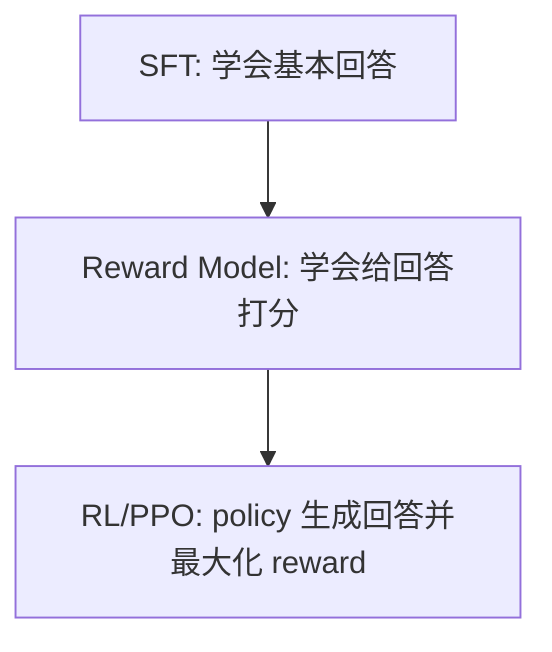

# SFT 和 RL 区别：顺带讲清 DPO 相比 PPO 的改进

## 资料来源地图

1. 来源类型：原始论文 / 技术论文  
   为什么可信：PPO、InstructGPT/RLHF、DPO 的目标函数和训练范式来自这些论文。  
   本文主要参考：SFT/RM/RLHF 三阶段、PPO 的 actor-critic + clip、DPO 的偏好优化思想。  
   链接：[PPO](https://arxiv.org/abs/1707.06347)、[InstructGPT](https://arxiv.org/abs/2203.02155)、[DPO](https://arxiv.org/abs/2305.18290)

2. 来源类型：已有 Obsidian 专题笔记  
   为什么可信：本地已有 PPO/DPO/GRPO/DAPO/GSPO 演进长文和 PPO 损失函数细节。  
   本文主要参考：面试表达、PPO 组件、DPO 优缺点。  
   链接：[[05-PPO-DPO-GRPO-DAPO-GSPO演进对比]]、[[06-PPO损失函数详解]]

## 这篇解决什么问题

- 原始面经问题：
  - SFT 和 RL 区别。
  - DPO 相比 PPO 的改进。

- 你需要掌握的核心能力：
  - 能用“数据来源、训练目标、是否采样、是否需要 reward model”区分 SFT 和 RL。
  - 能解释 PPO 为什么重。
  - 能解释 DPO 简化了什么，同时知道它不是无脑替代 PPO。

## 先讲人话版

SFT 像“照着标准答案学”：

> 给模型很多 `(prompt, answer)`，让它最大化标准答案的 token 概率。

RL 像“自己答题，然后根据得分调整策略”：

> 模型先生成回答，再由 reward model、规则 verifier 或人类偏好给分，模型优化高分回答的概率。

DPO 像“直接看两份答案谁更好”：

> 不再显式训练 reward model，也不跑 PPO rollout，而是用偏好对 `(chosen, rejected)` 直接训练模型更偏向 chosen。

## 必备前置知识

| 概念 | 短定义 | 为什么重要 |
|---|---|---|
| policy | 当前要训练的语言模型 | RL 里 LLM 被看成策略 |
| SFT dataset | 人工或模型生成的高质量答案 | SFT 的监督信号 |
| preference pair | 同一 prompt 下 chosen/rejected 两个回答 | DPO/RM 的数据形式 |
| reward model | 给回答打分的模型 | 经典 RLHF 中 PPO 的优化目标来自它 |
| reference model | 冻结的 SFT 模型 | 限制 policy 不要偏离太远 |
| KL penalty | 限制新旧模型分布差异 | 防止 RL 把模型训歪 |
| on-policy | 用当前策略采样数据再训练当前策略 | PPO/GRPO 常见 |
| off-policy / offline | 用已有数据训练，不现场采样 | DPO 更接近这种范式 |

## 核心原理

### 1. SFT：监督微调

SFT 数据长这样：

```text
prompt: "解释一下 attention"
answer: "Attention 可以理解为..."
```

训练目标就是 next-token cross entropy：

```math
\mathcal{L}_{SFT} = - \sum_t \log \pi_\theta(y_t | x, y_{<t})
```

含义：

> 标准答案里的每个 token，模型都应该给更高概率。

优点：

- 简单稳定。
- 训练像普通语言模型微调。
- 很适合教模型格式、风格、领域知识、基本指令跟随。

缺点：

- 只能模仿数据里的答案。
- 数据质量上限决定模型上限。
- 很难直接优化“人更喜欢哪个回答”“数学答案是否正确”“工具调用结果是否成功”。

### 2. RL：用奖励优化行为

RLHF 经典三阶段：



RL 数据不是固定标准答案，而是模型自己采样：

```text
prompt -> policy 生成 response -> reward/verifier 打分 -> 更新 policy
```

目标不再是“模仿某个答案”，而是：

> 让高 reward 的回答概率上升，同时用 KL 防止模型偏离 reference model 太远。

### 3. SFT vs RL 对比

| 维度 | SFT | RL / RLHF |
|---|---|---|
| 数据 | `(prompt, answer)` 标准答案 | prompt + policy 采样 response + reward |
| 训练目标 | 最大化标准答案 token 概率 | 最大化 reward，同时限制 KL |
| 是否探索 | 基本没有，只模仿数据 | 有，模型会采样新回答 |
| 是否需要 RM/verifier | 不需要 | 通常需要 |
| 稳定性 | 高 | 更难调 |
| 适合 | 格式、风格、基础能力、领域适配 | 偏好对齐、推理强化、工具结果优化 |
| 风险 | 过拟合示范答案 | reward hacking、训练不稳、模式坍塌 |

### 4. PPO 为什么重

PPO 在 LLM RLHF 里通常涉及 4 个模型：

| 模型 | 作用 | 是否训练 |
|---|---|---|
| Actor / Policy | 生成回答 | 是 |
| Critic / Value Model | 估计每个 token 位置的价值 | 是 |
| Reward Model | 给整段回答打分 | 否，RL 阶段冻结 |
| Reference Model | 计算 KL，防止偏离 SFT | 否，冻结 |

PPO 的简化目标：

```math
\mathcal{L}^{PPO} = \mathbb{E}\left[\min(r_t A_t, \text{clip}(r_t,1-\epsilon,1+\epsilon)A_t)\right]
```

其中：

- $`r_t`$：新旧 policy 生成同一个 token 的概率比。
- $`A_t`$：这个 token 的 advantage。
- clip：限制单次更新幅度。

PPO 的痛点：

- 工程复杂：rollout、reward、critic、KL、clip 都要配合。
- 显存大：多个模型同时存在。
- 调参难：reward scale、KL 系数、clip、采样温度等都会影响结果。
- 容易 reward hacking：模型学会钻 reward model 空子。

### 5. DPO 做了什么改进

DPO 的数据是偏好对：

```text
prompt x
chosen response y_w
rejected response y_l
```

DPO 不显式训练 reward model，也不跑 PPO rollout，而是直接优化：

> 在 reference model 约束下，让 policy 更偏向 chosen，而不是 rejected。

常见公式：

```math
\mathcal{L}_{DPO} =
-\mathbb{E}
\left[
\log \sigma
\left(
\beta \log \frac{\pi_\theta(y_w|x)}{\pi_{ref}(y_w|x)}
-
\beta \log \frac{\pi_\theta(y_l|x)}{\pi_{ref}(y_l|x)}
\right)
\right]
```

直觉：

- 如果 chosen 相对 reference 的概率提升更大，loss 变小。
- 如果 rejected 被提升得更多，loss 变大。
- $`\beta`$ 控制偏离 reference 的强度，类似 KL 温度。

### 6. DPO 相比 PPO 的改进

| 维度 | PPO | DPO |
|---|---|---|
| 是否需要 Reward Model | 需要显式 RM | 不需要显式 RM |
| 是否需要 Critic | 需要 | 不需要 |
| 是否需要在线 rollout | 需要 | 不需要，使用离线偏好对 |
| 训练复杂度 | 高 | 接近 SFT |
| 显存压力 | 大 | 小很多 |
| 稳定性 | 难调 | 更稳定 |
| 探索能力 | 更强 | 较弱 |
| 适合场景 | 在线探索、verifier 强的推理任务 | 偏好数据充足、追求简单稳定的对齐 |

一句话：

> DPO 把“先学 reward，再用 PPO 优化 reward”的两步，压缩成“直接用偏好对训练 policy”的一步。

## 面试怎么答

### SFT vs RL：30 秒版

> SFT 是监督学习，数据是人工或高质量模型生成的标准答案，目标是最大化这些答案的 token 概率，所以它更像模仿学习。RL 是让模型自己采样回答，再用 reward model、规则 verifier 或人类偏好给分，目标是提高高 reward 回答的概率，同时用 KL 限制模型不要偏离 SFT reference 太远。SFT 简单稳定，适合教格式和基础能力；RL 更复杂，但能优化偏好、推理正确性和工具使用结果。

### DPO vs PPO：30 秒版

> PPO 是经典 RLHF 做法，需要 reward model、critic、reference model 和在线 rollout，工程复杂、显存大、调参难。DPO 利用 RLHF 最优策略和 reward 之间的闭式关系，直接用偏好对 `(chosen, rejected)` 优化 policy，不需要显式 reward model、critic 和 PPO 采样，所以训练更像 SFT，更简单稳定。但 DPO 主要依赖离线偏好数据，探索能力弱于 PPO/GRPO 这类在线 RL。

### 深入追问版

> 我不会说 DPO 完全替代 PPO。DPO 的优势是工程简单和稳定，适合偏好数据覆盖比较好的场景，比如回答风格、安全偏好、通用 helpfulness。但如果任务需要模型在线探索，比如数学、代码、工具调用，有 verifier 可以给生成结果打分，那么 PPO/GRPO/GSPO 这类在线 RL 仍然有价值，因为模型可以生成新轨迹并从结果中学习。

## 常见追问

### Q1：SFT 能不能做对齐？

能做一部分。SFT 可以让模型学会遵循指令、输出安全格式、模仿偏好回答。但它没有显式比较“哪个回答更好”，也不能有效探索，所以复杂偏好对齐通常还需要 DPO/RLHF。

### Q2：DPO 为什么不需要 reward model？

DPO 从 KL-constrained RLHF 的最优解推导出 reward 和 policy/reference 概率比之间的关系，于是可以把偏好学习直接写成 policy 的分类式损失，不必单独训练显式 reward model。

### Q3：DPO 的 reference model 为什么还需要？

Reference model 提供“不要偏离原模型太远”的基准。没有 reference，模型可能为了偏好对过度放大 chosen 概率，导致语言质量或泛化能力下降。

### Q4：PPO 的 Critic 是干什么的？

Critic 给每个 token 位置估计 value，用来计算 advantage，降低策略梯度方差。代价是多一个大模型级别的 value model，显存和训练复杂度都增加。

### Q5：什么时候用 SFT、DPO、RL？

- 先用 SFT：教基础格式、领域知识、指令跟随。
- 有偏好对但不想复杂 RL：用 DPO。
- 有可自动验证的任务、需要探索：用 RL/GRPO/GSPO。

## 容易踩坑

- 说 SFT 和 RL 都只是“微调”，但不区分训练信号。
- 说 DPO 不需要 reference model。常见 DPO 公式里仍然用 reference。
- 说 DPO 一定比 PPO 好。它只是更简单稳定，探索能力不一定更强。
- 说 PPO 的 reward 是每个 token 都有人工分。LLM RLHF 中通常 reward 是句子级，token-level advantage 依赖 critic/GAE。
- 忽略 KL 控制，导致回答里说 RL 只要最大化 reward。

## 例子

### SFT 数据

```json
{
  "prompt": "用一句话解释 GQA",
  "answer": "GQA 让多个 Query 头共享较少的 Key/Value 头，从而减少推理时的 KV Cache。"
}
```

训练时模型只学标准答案 token。

### DPO 数据

```json
{
  "prompt": "用一句话解释 GQA",
  "chosen": "GQA 让多个 Query 头共享较少的 Key/Value 头，主要降低 KV Cache。",
  "rejected": "GQA 是一种让模型更大的训练方法。"
}
```

DPO 学的是 chosen 相对 rejected 更好。

## 复习清单

- SFT：标准答案监督学习，目标是 next-token CE。
- RL：模型采样输出，用 reward/verifier 评价，再优化 policy。
- RLHF 三阶段：SFT -> RM -> PPO/RL。
- PPO：actor、critic、reference、reward model，on-policy，复杂但能探索。
- DPO：偏好对直接优化 policy，无显式 RM/Critic/rollout，简单稳定。
- DPO 不等于万能：离线数据覆盖有限，探索能力弱。
- 面试主线：先讲训练信号，再讲工程代价，最后讲适用场景。

## 参考资料

1. [Schulman et al., Proximal Policy Optimization Algorithms](https://arxiv.org/abs/1707.06347) - PPO 原始论文。
2. [Ouyang et al., Training language models to follow instructions with human feedback](https://arxiv.org/abs/2203.02155) - InstructGPT/RLHF 经典论文。
3. [Rafailov et al., Direct Preference Optimization](https://arxiv.org/abs/2305.18290) - DPO 原始论文。
4. [[05-PPO-DPO-GRPO-DAPO-GSPO演进对比]] - 本地算法演进长文。
5. [[06-PPO损失函数详解]] - 本地 PPO 损失函数细节。

