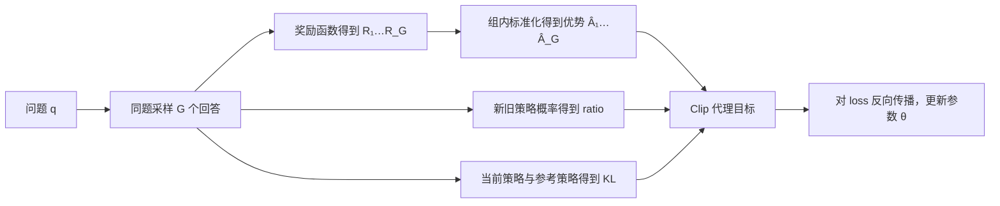
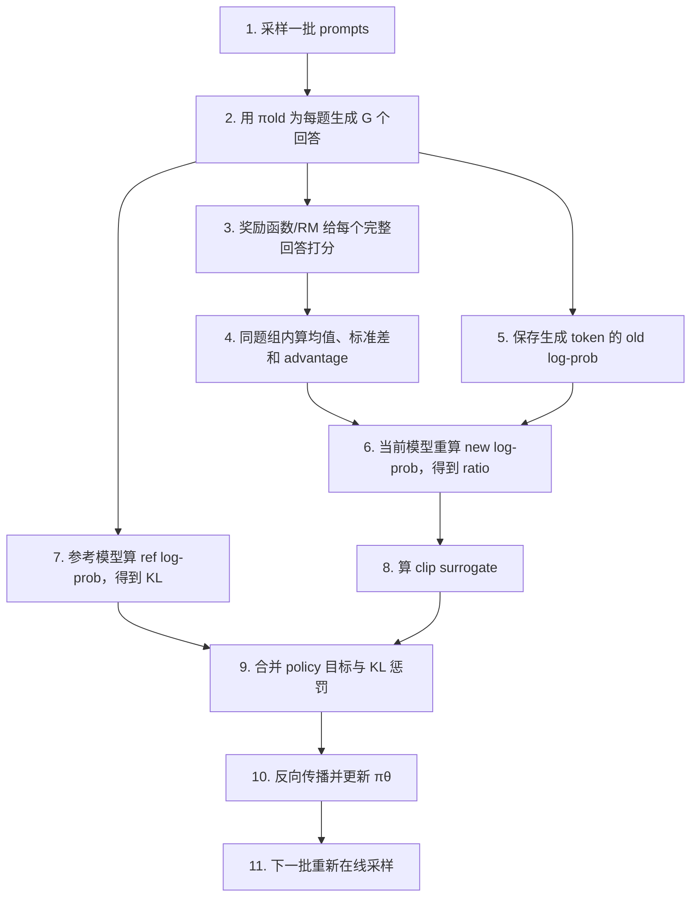

---
tags:
  - 面试
  - 大模型
  - 强化学习
  - GRPO
  - DeepSeek
created: 2026-07-28
updated: 2026-07-28
aliases:
  - GRPO
  - Group Relative Policy Optimization
---

# GRPO 从零入门：奖励、优势与损失函数逐步算清楚

> **适合谁**：完全没接触过 GRPO，甚至分不清 reward、return、advantage 和 loss 的读者。
>
> **读完目标**：能从“一道题生成多个回答”开始，亲手算出每个回答的奖励、组内优势、概率比、裁剪目标、KL 惩罚和最终 loss，并能说清 GRPO 为什么不需要 Critic。

---

## 0. 资料来源地图

### 1. DeepSeekMath 原始论文

- **来源类型**：GRPO 原始论文
- **为什么可信**：GRPO 由该论文正式提出，算法定义和原始目标函数都来自这里
- **本文主要参考**：GRPO 相对 PPO 的变化、组内相对优势、目标函数、KL 估计
- **链接**：[DeepSeekMath: Pushing the Limits of Mathematical Reasoning in Open Language Models](https://arxiv.org/abs/2402.03300)

### 2. DeepSeek-R1 论文

- **来源类型**：DeepSeek 官方研究论文
- **为什么可信**：说明了 GRPO 如何用于 R1-Zero 和 R1 的推理强化学习
- **本文主要参考**：规则奖励、准确性奖励、格式奖励、GRPO 在推理模型中的实际位置
- **链接**：[DeepSeek-R1: Incentivizing Reasoning Capability in LLMs via Reinforcement Learning](https://arxiv.org/abs/2501.12948)

### 3. Hugging Face TRL 官方文档与源码文档

- **来源类型**：主流开源实现的官方文档
- **为什么可信**：展示了工程实现中如何生成一组回答、调用 reward function、计算优势、KL 和 loss
- **本文主要参考**：自定义奖励函数、训练参数、GRPO/BNPO/Dr.GRPO 等实现差异
- **链接**：[TRL GRPOTrainer](https://huggingface.co/docs/trl/main/en/grpo_trainer)

> [!warning] 版本口径
> “GRPO”在今天有时泛指一整类“同题多采样 + 组内相对优势 + PPO 式更新”的算法。原始 GRPO、TRL 的不同 `loss_type`、DAPO 和 Dr.GRPO 在 token 聚合、长度归一化、奖励缩放等细节上并不完全相同。本文先讲 **DeepSeekMath 原始思想和最常见的 outcome-level GRPO**，最后再单独列出实现差异。

---

## 1. 先讲人话版：GRPO 到底在做什么

假设老师出了一道题：

> 小明有 3 个苹果，又买了 2 个，现在有几个？

模型不要只答一次，而是对**同一道题**生成 4 个不同回答：

1. “$3+2=5$，答案是 5。”
2. “答案是 5。”
3. “$3+2=6$，答案是 6。”
4. “我不知道。”

奖励规则给它们打分后，GRPO 不只问“这个回答得了几分”，而是问：

> **这个回答相对于同一道题的其他回答，表现高于还是低于组内平均水平？**

- 比组内平均好：优势为正，增大这个回答中已生成 token 的概率；
- 比组内平均差：优势为负，减小这些 token 的概率；
- 恰好等于平均：优势接近 0，基本不更新。

这就是名字的含义：

> **Group Relative Policy Optimization = 组内相对策略优化**

它和 PPO 的关键区别不是“完全抛弃 PPO”，而是：

> **保留 PPO 式的概率比率和 clip，但不用单独训练 Critic，而是用同一道题的多个回答互相比较来构造 baseline 和 advantage。**

---

## 2. 开始前必须分清的 8 个角色

### 2.1 Prompt、Completion 与 Token

- **Prompt / 问题** $q$：输入给模型的题目；
- **Completion / Response / 输出** $o_i$：模型对题目的一个完整回答；
- **Token** $o_{i,t}$：回答 $i$ 中第 $t$ 个 token。

一个回答由多个 token 组成：

```text
问题 q：  3 + 2 等于多少？
回答 o₁：  ["3", "+", "2", "=", "5"]
            t=1  t=2  t=3  t=4  t=5
```

LLM 每生成一个 token，都相当于执行一次“动作”：

```math
\pi_\theta(o_{i,t}\mid q,o_{i,<t})
```

表示：给定问题 $q$ 和此前已经生成的 token $o_{i,<t}$，当前策略选择 token $o_{i,t}$ 的概率。

### 2.2 Policy：正在训练的模型

$\pi_\theta$ 是当前要训练的 LLM，参数是 $\theta$。训练的本质是改变 $\theta$，从而改变各 token 的生成概率。

### 2.3 Old Policy：采样数据时的旧策略

$\pi_{\theta_{\text{old}}}$ 是生成本批回答时使用的策略快照。

为什么要保存旧概率？因为回答是由旧策略采样出来的，更新参数后策略已经变成 $\pi_\theta$。GRPO 要计算：

```math
r_{i,t}(\theta)
=
\frac{
\pi_\theta(o_{i,t}\mid q,o_{i,<t})
}{
\pi_{\theta_{\text{old}}}(o_{i,t}\mid q,o_{i,<t})
}.
```

这个量叫 **probability ratio，概率比率**。

### 2.4 Reference Policy：限制模型别跑太远的参考模型

$\pi_{\text{ref}}$ 通常是冻结的 SFT 模型。它不负责采样校正，而负责充当“语言能力锚点”：

- 离参考模型太远，可能出现胡言乱语或 reward hacking；
- 所以训练目标中加入 KL 惩罚，限制当前策略不要偏离参考策略太多。

> [!warning] Old policy 和 reference policy 不是一回事
> - $\pi_{\text{old}}$：回答由谁采出来，用于算 PPO/GRPO ratio；
> - $\pi_{\text{ref}}$：希望模型别偏离谁太远，用于算 KL；
> - 某次训练刚开始时二者可能参数恰好相同，但职责仍不同，后续通常也会分开。

### 2.5 Reward：完整回答得了多少分

奖励 $R_i$ 是对第 $i$ 个完整回答打出的标量，例如：

```text
回答 1：1.2 分
回答 2：1.0 分
回答 3：0.2 分
回答 4：0.0 分
```

奖励可以来自：

- 可验证规则：数学答案是否正确、代码是否通过测试；
- 格式规则：是否包含指定标签、JSON 是否可解析；
- 奖励模型：对有用性、安全性、风格等打分；
- 多个奖励的加权和；
- 过程奖励：对推理中的中间步骤逐步打分。

### 2.6 Baseline：比较时的基准

如果只看到“奖励是 0.8”，并不知道它到底算好还是坏：

- 简单题大家都得 1.0，0.8 可能偏差；
- 难题大家都得 0，0.8 可能非常好。

因此需要 baseline。PPO 常用 Critic 估计 $V(s)$ 作为 baseline；GRPO 用**同题这一组回答的平均奖励**：

```math
b(q)=\operatorname{mean}(R_1,\ldots,R_G).
```

### 2.7 Advantage：比基准好多少

最简形式：

```math
A_i=R_i-b(q).
```

原始 GRPO 常进一步除以组内标准差：

```math
\hat A_i
=
\frac{R_i-\operatorname{mean}(\mathbf R)}
{\operatorname{std}(\mathbf R)+\varepsilon_{\text{num}}}.
```

这里的 $\varepsilon_{\text{num}}$ 是防止除以 0 的极小数，不是 PPO clip 的 $\epsilon$。

### 2.8 Loss：模型真正反向传播的量

Reward 不是 loss，advantage 也不是 loss。

完整链条是：



---

## 3. 奖励到底怎么算

### 3.1 GRPO 本身不规定唯一奖励公式

GRPO 规定的是“**有了每个回答的奖励之后，怎样在组内比较并更新策略**”。至于奖励如何产生，要由任务设计者决定。

一个常见的推理任务奖励可以写成：

```math
R_i
=
w_{\text{acc}}R_i^{\text{acc}}
+w_{\text{fmt}}R_i^{\text{fmt}}
+w_{\text{style}}R_i^{\text{style}}
-w_{\text{len}}P_i^{\text{length}}.
```

例如：

| 奖励项 | 规则 | 权重 |
|---|---|---:|
| 准确性 $R^{\text{acc}}$ | 最终答案正确得 1，否则得 0 | 1.0 |
| 格式 $R^{\text{fmt}}$ | 符合 `<think>...</think><answer>...</answer>` 得 1 | 0.2 |
| 风格 $R^{\text{style}}$ | 清晰、无语言混杂，由 RM 给 $[0,1]$ 分 | 0.2 |
| 长度惩罚 $P^{\text{length}}$ | 超过阈值的冗余程度，取 $[0,1]$ | 0.1 |

那么某回答：

```text
答案正确：        1
格式正确：        1
风格得分：        0.5
冗余惩罚：        1
```

总奖励为：

```math
R=1.0\times1+0.2\times1+0.2\times0.5-0.1\times1=1.2.
```

> [!note] 加权奖励不一定要落在 0 到 1
> GRPO 只需要奖励“越大通常越好”。但奖励尺度会影响训练，所以必须监控各分量分布，避免某一项凭数值范围压倒其余奖励。

### 3.2 DeepSeek-R1 为什么偏爱规则奖励

数学和代码任务常有可验证答案：

- 数学：把模型答案解析后与标准答案比较；
- 代码：编译并运行测试用例；
- 格式：用解析器或正则检查输出结构。

规则奖励的优点：

- 结果客观，通常比主观 RM 更难误判；
- 不需要额外训练奖励模型；
- 可以规模化自动评测。

但它只判断“有没有满足规则”，不一定知道：

- 推理过程是否真实可靠；
- 是否碰巧猜对；
- 是否利用了判题漏洞；
- 表达是否有帮助、是否安全。

因此真实系统常混合规则奖励、奖励模型和安全检查。

### 3.3 Outcome reward 与 process reward

#### Outcome-level：只给整个回答一个分

```math
R_i=R(q,o_i).
```

最常见的 GRPO 教程都采用这个版本。回答 $o_i$ 中的所有 token 通常共享同一个 $\hat A_i$。

#### Process-level：中间步骤也有分

例如一段推理有三个步骤，过程奖励模型分别给：

```text
步骤 1：正确，+1
步骤 2：正确，+1
步骤 3：错误，-1
```

此时可以把步骤奖励转成每一段 token 的优势。它能提供更细的 credit assignment，但要求可靠的过程标注或过程奖励模型，成本更高，也更容易因过程判分错误引入噪声。

本文后续算例使用最常见的 **outcome-level reward**。

---

## 4. 优势到底怎么算

### 4.1 为什么不能直接拿 reward 乘 log probability

如果直接用：

```math
R_i\nabla_\theta\log\pi_\theta(o_i\mid q),
```

只要奖励全是正数，所有采样回答都可能被提高概率，只是提高得多少不同。训练信号方差也会很大。

减去 baseline 后：

```math
(R_i-b)\nabla_\theta\log\pi_\theta(o_i\mid q),
```

组内高于平均的回答得到正信号，低于平均的回答得到负信号。于是模型学习的是“同题候选中哪些更值得生成”。

### 4.2 组均值

一个 prompt 生成 $G$ 个回答，奖励向量为：

```math
\mathbf R=[R_1,R_2,\ldots,R_G].
```

均值：

```math
\mu_R=\frac{1}{G}\sum_{i=1}^{G}R_i.
```

### 4.3 组标准差

为保持数值例子直观，本文使用总体标准差：

```math
\sigma_R
=
\sqrt{
\frac{1}{G}
\sum_{i=1}^{G}(R_i-\mu_R)^2
}.
```

不同框架可能使用略有差异的方差估计或跨设备统计口径，因此最后几位小数可能不同，但思想不变。

### 4.4 标准化优势

```math
\hat A_i=\frac{R_i-\mu_R}{\sigma_R+\varepsilon_{\text{num}}}.
```

它同时完成两件事：

1. **中心化**：减均值，决定方向；
2. **缩放**：除标准差，让不同组的数值尺度更接近。

> [!important] 符号和大小分别表示什么
> - $\hat A_i>0$：回答优于组内平均，要提高其 token 概率；
> - $\hat A_i<0$：回答劣于组内平均，要降低其 token 概率；
> - $|\hat A_i|$ 越大：相对组内平均越突出，更新信号通常越强。

### 4.5 完整数值例子：从奖励算到优势

对同一道题采样 4 个回答，总奖励为：

| 回答 | 总奖励 $R_i$ |
|---|---:|
| $o_1$ | 1.2 |
| $o_2$ | 1.0 |
| $o_3$ | 0.2 |
| $o_4$ | 0.0 |

**第一步：算均值**

```math
\mu_R=\frac{1.2+1.0+0.2+0.0}{4}=0.6.
```

**第二步：算每个奖励与均值的差**

```text
o₁：1.2 - 0.6 =  0.6
o₂：1.0 - 0.6 =  0.4
o₃：0.2 - 0.6 = -0.4
o₄：0.0 - 0.6 = -0.6
```

**第三步：算总体标准差**

```math
\begin{aligned}
\sigma_R
&=\sqrt{\frac{0.6^2+0.4^2+(-0.4)^2+(-0.6)^2}{4}}\\
&=\sqrt{\frac{0.36+0.16+0.16+0.36}{4}}\\
&=\sqrt{0.26}\\
&\approx0.5099.
\end{aligned}
```

**第四步：算优势**

```math
\begin{aligned}
\hat A_1&=(1.2-0.6)/0.5099\approx 1.1767,\\
\hat A_2&=(1.0-0.6)/0.5099\approx 0.7845,\\
\hat A_3&=(0.2-0.6)/0.5099\approx-0.7845,\\
\hat A_4&=(0.0-0.6)/0.5099\approx-1.1767.
\end{aligned}
```

| 回答 | 奖励 | 优势 | 学习方向 |
|---|---:|---:|---|
| $o_1$ | 1.2 | +1.1767 | 明显提高概率 |
| $o_2$ | 1.0 | +0.7845 | 提高概率 |
| $o_3$ | 0.2 | -0.7845 | 降低概率 |
| $o_4$ | 0.0 | -1.1767 | 明显降低概率 |

可以验证：

```math
\frac{1}{G}\sum_i\hat A_i\approx0.
```

### 4.6 如果一组回答奖励全相同怎么办

假设：

```math
\mathbf R=[1,1,1,1].
```

此时：

```math
\mu_R=1,\qquad \sigma_R=0.
```

所有回答都和平均值相同，无法知道谁更好，优势应视为 0。这组样本几乎不提供策略梯度信号。

工程上会：

- 分母加极小数避免 NaN；
- 将该组 advantage 置 0；
- 记录“零方差组比例”；
- 提高采样多样性或改进奖励，让组内能拉开差异。

> [!warning] 二元正确性奖励的常见退化
> 如果一题的 $G$ 个回答全对，或者全错，组内准确性奖励完全相同，这一组就没有相对信号。增加 $G$、适当提高采样温度、设计更细粒度奖励或调整题目难度，都可能改善这个问题。

### 4.7 除以标准差并非没有代价

组内 z-score 会让不同题目的优势尺度接近，但也可能造成**题目难度偏置**。

例如：

- 难题只有一个回答偶然正确，其余全错；
- 简单题大多数回答正确，只有一个回答错。

标准差缩放后，少数派回答可能得到很大的绝对优势。后续研究和实现因此提供：

- 只减组均值，不除组标准差；
- 组内减均值，但用整个 batch 的标准差；
- Dr.GRPO 等其他归一化方式。

所以“优势一定等于组内 z-score”是对原始常见形式的概括，不是所有现代实现唯一不变的规定。

---

## 5. 为什么一个序列优势会作用到每个 token

假设回答 $o_i$ 得到一个序列级优势 $\hat A_i$。整段回答的概率是：

```math
\pi_\theta(o_i\mid q)
=
\prod_{t=1}^{|o_i|}
\pi_\theta(o_{i,t}\mid q,o_{i,<t}).
```

取对数后，乘积变成求和：

```math
\log\pi_\theta(o_i\mid q)
=
\sum_{t=1}^{|o_i|}
\log\pi_\theta(o_{i,t}\mid q,o_{i,<t}).
```

因此序列级策略梯度近似为：

```math
\hat A_i
\nabla_\theta\log\pi_\theta(o_i\mid q)
=
\sum_t
\hat A_i
\nabla_\theta\log\pi_\theta(o_{i,t}\mid q,o_{i,<t}).
```

这就是为什么在 outcome-level GRPO 中：

> **同一回答的所有 token 可以共享一个序列级 advantage，但 loss 仍然逐 token 计算概率和梯度。**

它的优点是简单、不需要 Critic；缺点是 credit assignment 粗糙：

- 一个最终正确的回答里可能有冗余或错误后自我修正，所有 token 仍得到正优势；
- 一个最终错误的回答前面可能有许多正确推理，所有 token 仍得到负优势。

过程奖励可以缓解这个问题，但会增加奖励设计成本。

---

## 6. 概率比 ratio 到底怎么算

对回答 $i$ 的第 $t$ 个 token：

```math
r_{i,t}(\theta)
=
\frac{
\pi_\theta(o_{i,t}\mid q,o_{i,<t})
}{
\pi_{\theta_{\text{old}}}(o_{i,t}\mid q,o_{i,<t})
}.
```

实际代码通常使用 log probability：

```math
r_{i,t}(\theta)
=
\exp\left(
\log\pi_\theta(o_{i,t}\mid\cdot)
-
\log\pi_{\text{old}}(o_{i,t}\mid\cdot)
\right).
```

它的含义：

| ratio | 含义 |
|---:|---|
| $r=1$ | 新旧策略给该 token 的概率相同 |
| $r>1$ | 新策略提高了该 token 的概率 |
| $r<1$ | 新策略降低了该 token 的概率 |

### 数值例子

某个已生成 token 在旧策略下概率是 0.20，更新后的当前策略下是 0.25：

```math
r=\frac{0.25}{0.20}=1.25.
```

表示当前策略把这个 token 的概率提高了 25%。

> [!note] 为什么刚生成完时 ratio 常等于 1
> 如果当前模型刚用自己的参数完成 rollout，还没有做任何更新，那么 $\pi_\theta=\pi_{\text{old}}$，第一遍计算时 ratio 就是 1。对同一批 rollout 做第一次梯度更新后，当前策略发生变化；若继续对这批数据做后续 update iteration，ratio 才会偏离 1，clip 也才更可能真正生效。即使只更新一遍，保留 ratio 形式也能统一算法与实现。

---

## 7. Clip 为什么存在，min 为什么不会写反

若只最大化：

```math
r_{i,t}\hat A_i,
```

正优势 token 的概率可能被一次推得过高，负优势 token 的概率可能被一次压得过低，训练容易不稳定。

因此像 PPO 一样使用：

```math
\min\left(
r_{i,t}\hat A_i,\;
\operatorname{clip}(r_{i,t},1-\epsilon,1+\epsilon)\hat A_i
\right).
```

典型直觉范围是 $[0.8,1.2]$，即 $\epsilon=0.2$。

### 7.1 正优势时

沿用 $\hat A_1=1.1767$，假设 $r=1.25$：

```math
\begin{aligned}
r\hat A_1&=1.25\times1.1767=1.4709,\\
\operatorname{clip}(1.25,0.8,1.2)\hat A_1
&=1.2\times1.1767=1.4120.
\end{aligned}
```

取较小值：

```math
\min(1.4709,1.4120)=1.4120.
```

含义：这个好 token 的概率已经提高得够多了，超出 1.2 的额外收益不再计入。

### 7.2 负优势时

沿用 $\hat A_4=-1.1767$，假设 $r=0.75$：

```math
\begin{aligned}
r\hat A_4&=0.75\times(-1.1767)=-0.8825,\\
\operatorname{clip}(0.75,0.8,1.2)\hat A_4
&=0.8\times(-1.1767)=-0.9414.
\end{aligned}
```

注意负数比较大小时，$-0.9414$ 更小：

```math
\min(-0.8825,-0.9414)=-0.9414.
```

含义：坏 token 的概率已经下降超过允许范围，继续下降不再获得更好的代理目标。

> [!tip] 记忆法
> - 优势为正：限制 ratio 的**上升**；
> - 优势为负：限制 ratio 的**下降**；
> - `min` 构造的是一个悲观代理目标，不让策略从过度变化中继续“占便宜”。

---

## 8. KL 惩罚怎么算

### 8.1 它在限制什么

Clip 限制的是：

```text
当前策略 πθ  vs  采样时旧策略 πold
```

KL 限制的是：

```text
当前策略 πθ  vs  冻结参考策略 πref
```

二者不是重复功能。

### 8.2 原始 GRPO 常见的逐 token KL 估计

令：

```math
x_{i,t}
=
\frac{
\pi_{\text{ref}}(o_{i,t}\mid q,o_{i,<t})
}{
\pi_\theta(o_{i,t}\mid q,o_{i,<t})
}.
```

使用非负近似：

```math
\widehat D_{\text{KL},i,t}
=x_{i,t}-\log x_{i,t}-1.
```

因为对任意 $x>0$ 都有 $x-\log x-1\ge0$，当 $x=1$ 时等于 0。

### 8.3 数值例子

假设同一个 token：

```text
参考策略概率：0.18
当前策略概率：0.25
```

先算：

```math
x=\frac{0.18}{0.25}=0.72.
```

再算：

```math
\widehat D_{\text{KL}}
=0.72-\log(0.72)-1
\approx0.0485.
```

若 KL 系数 $\beta=0.04$：

```math
\beta\widehat D_{\text{KL}}
=0.04\times0.0485
\approx0.00194.
```

它会从要最大化的策略目标中扣掉。

> [!note] 为什么不是简单写成 `log πθ - log πref`
> 单个采样 token 上，`log πθ - log πref` 可能为负；它只有在对正确分布取期望后才对应 KL。上面的 $x-\log x-1$ 是常见的低方差、逐样本非负估计形式。

---

## 9. 把所有部分合起来：GRPO 完整目标

对每个问题 $q$ 采样 $G$ 个回答 $o_1,\ldots,o_G$。一种常见的原始 GRPO 最大化目标可写成：

```math
\begin{aligned}
J_{\text{GRPO}}(\theta)
=\mathbb E\Bigg[
\frac{1}{G}\sum_{i=1}^{G}
\frac{1}{|o_i|}\sum_{t=1}^{|o_i|}
\Big(
&\min(
r_{i,t}(\theta)\hat A_i,\;
\operatorname{clip}(r_{i,t}(\theta),1-\epsilon,1+\epsilon)\hat A_i
)\\
&-\beta\widehat D_{\text{KL},i,t}
\Big)
\Bigg].
\end{aligned}
```

逐项翻译：

| 符号 | 人话 |
|---|---|
| $\frac1G\sum_i$ | 对同题的 $G$ 个回答取平均 |
| $\frac1{|o_i|}\sum_t$ | 对回答中的 token 聚合 |
| $r_{i,t}$ | 当前策略相对采样旧策略改变了多少 |
| $\hat A_i$ | 这个回答相对同题其他回答好多少 |
| $\operatorname{clip}$ | 不让新旧策略一步偏离过大 |
| $\widehat D_{\text{KL}}$ | 当前策略相对参考模型偏离多少 |
| $\beta$ | 对偏离参考模型的惩罚强度 |

优化器通常做**梯度下降**，所以代码中的 loss 是最大化目标的相反数：

```math
\mathcal L_{\text{GRPO}}(\theta)=-J_{\text{GRPO}}(\theta).
```

### 9.1 延续数值例子算一个 token 的 loss

对回答 $o_1$ 的某个 token，已知：

```text
优势 Â₁：          1.1767
ratio：            1.25
clip ε：           0.2
裁剪代理目标：      1.4120
KL 估计：           0.0485
KL 系数 β：         0.04
```

最大化目标中的该 token 贡献：

```math
j_{1,t}
=1.4120-0.04\times0.0485
\approx1.4101.
```

对应要最小化的 loss 贡献：

```math
\ell_{1,t}\approx-1.4101.
```

loss 为负完全正常。优化器关心的是梯度方向，不要求损失必须大于 0。

---

## 10. GRPO 的一次完整训练循环



简化伪代码：

```python
for prompts in dataloader:
    # 1. 每个问题生成 G 个回答；此刻的 policy 就是 π_old
    completions, old_logps = generate_group(policy, prompts, G=8)

    # 2. 每个完整回答得到一个或多个奖励
    reward_parts = [
        accuracy_reward(prompts, completions),
        format_reward(completions),
    ]
    rewards = 1.0 * reward_parts[0] + 0.2 * reward_parts[1]

    # 3. 只在同一 prompt 的 G 个回答内部计算优势
    grouped = rewards.reshape(num_prompts, G)
    mean = grouped.mean(dim=1, keepdim=True)
    std = grouped.std(dim=1, keepdim=True, unbiased=False)
    advantages = (grouped - mean) / (std + 1e-8)

    # 4. 序列级优势广播到该回答所有有效 completion token
    token_advantages = broadcast_to_completion_tokens(advantages)

    # 5. 当前策略和参考策略重新计算这些已采样 token 的 log-prob
    new_logps = policy.log_probs(prompts, completions)
    ref_logps = reference.log_probs(prompts, completions)

    ratio = torch.exp(new_logps - old_logps)
    unclipped = ratio * token_advantages
    clipped = ratio.clamp(1 - eps, 1 + eps) * token_advantages
    surrogate = torch.minimum(unclipped, clipped)

    # x = π_ref / π_theta
    x = torch.exp(ref_logps - new_logps)
    kl = x - torch.log(x) - 1

    # 只平均 completion 的有效 token；padding token 必须 mask
    objective = masked_mean(surrogate - beta * kl, completion_mask)
    loss = -objective

    optimizer.zero_grad()
    loss.backward()
    optimizer.step()
```

> [!warning] 伪代码省略了分布式聚合、梯度累积、多个 update iteration、长度归一化变体和数值稳定处理，目的是显示数据流，而不是直接作为生产训练器。

---

## 11. GRPO 为什么不需要 Critic

### 11.1 PPO 的做法

PPO 常训练一个价值模型：

```math
V_\phi(s_t)\approx
\text{从状态 }s_t\text{ 出发的预期未来回报}.
```

再通过 GAE 等方法估计：

```math
\hat A_t^{\text{PPO}}.
```

这需要：

- Critic 模型参数；
- Critic 的前向与反向；
- value optimizer state；
- value loss 和更多训练稳定性调参。

### 11.2 GRPO 的替代

GRPO 不预测 $V(s_t)$，而是直接用同题组均值：

```math
b(q)=\frac1G\sum_iR_i.
```

于是：

```math
\hat A_i
\approx
\frac{R_i-b(q)}{\operatorname{std}(\mathbf R)}.
```

可以把它理解为：

> “我不知道这道题理论上应该得多少分，但我让当前模型答很多次，用同题其他答案的平均表现当作临时基准。”

### 11.3 省掉 Critic 不等于训练只保留一个模型

GRPO 训练时仍可能需要：

- 当前 policy；
- rollout/old policy 的概率或权重快照；
- reference policy；
- 优化器状态；
- 生成时的 KV cache 和训练激活。

因此更准确的说法是：

> **GRPO 去掉了 PPO 中单独学习 value 的 Critic 及其训练开销，通常显著节省内存与计算，但并不意味着整个训练只有一份模型。**

---

## 12. Reward、Return、Advantage、Loss 到底什么关系

| 概念 | 回答的问题 | GRPO 中的典型形式 |
|---|---|---|
| Reward $R_i$ | 这个完整回答得多少分？ | 规则/RM/多奖励加权后的标量 |
| Return $G_t$ | 从时刻 $t$ 往后的累计奖励是多少？ | outcome-only 且 $\gamma=1$ 时可与最终序列奖励紧密对应 |
| Baseline $b$ | 拿什么标准比较？ | 同题 $G$ 个回答的平均奖励 |
| Advantage $\hat A_i$ | 这个回答比基准好多少？ | $(R_i-\mu_R)/(\sigma_R+\varepsilon)$ |
| Ratio $r_{i,t}$ | 当前策略把该 token 概率改了多少？ | $\pi_\theta/\pi_{\text{old}}$ |
| KL | 当前模型偏离参考模型多少？ | $\pi_{\text{ref}}/\pi_\theta-\log(\pi_{\text{ref}}/\pi_\theta)-1$ |
| Objective $J$ | 想最大化什么？ | clip surrogate 减 KL penalty |
| Loss $\mathcal L$ | 反向传播最小化什么？ | $-J$ |

> [!important] 最短记忆链
> **奖励负责评价，优势负责比较，ratio 负责校正，clip 负责限步，KL 负责拴绳，loss 负责反传。**

---

## 13. GRPO 与 PPO 的核心对比

| 维度 | PPO | GRPO |
|---|---|---|
| Baseline 来源 | Critic 的 $V(s_t)$ | 同题一组回答的奖励统计 |
| Advantage | 常用 GAE，通常是 token-level | 常见 outcome 版是 sequence-level，再广播到 token |
| 是否训练 Critic | 是 | 否 |
| 同题采样多个回答 | 非核心要求 | 核心要求 |
| Policy ratio + clip | 有 | 有 |
| Reference KL | LLM RLHF 中常有 | 常有 |
| 优点 | 价值估计更细，通用 RL 框架成熟 | 结构简单，省去 Critic，适合可验证推理奖励 |
| 缺点 | 模型与训练状态更重，value 训练可能不稳 | 需要组内多次生成，序列级 credit assignment 较粗 |

GRPO 不是“任何场景都比 PPO 好”。它特别适合：

- 同一问题能生成多个候选；
- 回答能得到相对可靠的序列级奖励；
- 数学、代码等结果容易验证；
- Critic 太昂贵或 value 学习不稳定。

---

## 14. 工程实现中最容易忽略的细节

### 14.1 一定要按 prompt 分组，不能把整个 batch 混在一起减均值

正确做法：

```text
题目 A 的 8 个回答互相比较
题目 B 的 8 个回答互相比较
```

错误做法：

```text
题目 A 和题目 B 的 16 个回答混在一起算一个均值
```

否则难题和简单题会直接互相污染 baseline。

### 14.2 Padding token 不能进入 loss

不同回答长度不同，batch 会补 padding。只应对 completion 的真实 token 计算目标：

```math
\frac{\sum_t m_{i,t}\ell_{i,t}}{\sum_t m_{i,t}},
```

其中真实 token 的 mask $m_{i,t}=1$，padding 为 0。

Prompt token 通常也不进入 completion policy loss。

### 14.3 被最大长度截断的回答要谨慎处理

回答达到 `max_completion_length` 而没自然结束时：

- 最终答案可能尚未出现；
- 奖励可能被错误判低；
- 长推理样本因此受到系统性惩罚。

一些实现会 mask 掉截断回答，或单独设计超长惩罚。

### 14.4 组大小 $G$ 的权衡

$G$ 越大：

- 组均值和标准差估计通常更稳定；
- 更可能同时采到好答案和坏答案；
- 但 rollout 生成成本和显存/吞吐压力更高。

$G$ 太小则相对排名噪声大，二元奖励也更容易全同。

### 14.5 温度会影响训练信号

- 温度太低：多个回答几乎相同，奖励零方差；
- 温度太高：输出多样，但可能大量无意义；
- 训练需要在“可探索”和“仍有质量”之间平衡。

### 14.6 奖励必须防 hacking

模型优化的是你实际写出的奖励，不是你心里想要的“好答案”：

- 只奖励长度，模型会灌水；
- 只检查格式，模型会输出漂亮格式但错误内容；
- 判题器有漏洞，模型可能学会利用漏洞；
- RM 有偏差，模型可能生成高分但低质量文本。

必须持续查看真实 completion，而不只看平均 reward 曲线。

### 14.7 多奖励要分别监控

若：

```math
R=w_1R^{\text{acc}}+w_2R^{\text{fmt}}+w_3R^{\text{style}},
```

至少记录：

- 每个 reward component 的均值、方差和分位数；
- 加权后的总奖励；
- 每组 reward std；
- 零方差组比例；
- 答案正确率、格式通过率；
- completion 长度；
- KL、clip fraction。

只看总奖励上涨，无法判断模型究竟学会了正确推理，还是只学会了格式投机。

### 14.8 长度归一化不是无关紧要的代码细节

原始形式常对每个回答先除以 $|o_i|$。后续工作指出，这可能引入长度偏置。现代实现可能提供：

- **GRPO**：每个序列按自身长度归一化；
- **BNPO/DAPO 风格**：按 batch 中有效 token 总数归一化；
- **Dr.GRPO**：用固定常数（如最大生成长度）归一化。

这些版本的核心“组内相对优势”相同，但梯度对长短回答的权重不同。阅读代码或论文时必须确认分母是什么。

---

## 15. 常见误解

### 误解 1：GRPO 的 reward 就是 advantage

错误。reward 是原始评分；advantage 是减去组内 baseline，通常再做缩放后的相对评分。

### 误解 2：优势为负代表奖励一定小于 0

错误。奖励可以是 0.8，但如果组均值是 0.9，优势仍为负。

### 误解 3：GRPO 完全不需要 PPO

不准确。GRPO 通常仍沿用 PPO 的 old-policy ratio 和 clipped surrogate，只是替换了优势估计方式并去掉 Critic。

### 误解 4：GRPO 没有 token-level loss

错误。常见 outcome GRPO 的 advantage 是 sequence-level，但 ratio、KL 和梯度通常仍逐 completion token 计算。

### 误解 5：KL 和 clip 是同一件事

错误。clip 约束 current 与 old；KL 约束 current 与 reference。

### 误解 6：省掉 Critic 就一定更省总计算

不一定。GRPO 要为同一 prompt 生成 $G$ 个回答，rollout 成本可能非常高。它省的是 Critic 相关成本，而不是让生成免费。

### 误解 7：奖励越复杂越好

不一定。奖励越复杂，冲突、尺度失衡和漏洞也可能越多。可验证、可解释、可监控通常比“堆很多分数”更重要。

---

## 16. 面试怎么答

### 16.1 30 秒版

> GRPO 是 DeepSeekMath 提出的一种 PPO 变体。它对同一个 prompt 采样一组回答，分别计算奖励，再用组内奖励的均值和标准差构造相对优势，例如 $\hat A_i=(R_i-\mu)/(\sigma+\varepsilon)$。这样就不需要 PPO 中单独的 Critic 和 GAE。策略更新仍保留 old-policy probability ratio、PPO clip 和相对 reference model 的 KL 惩罚。直觉上，高于同题组平均的回答被提高概率，低于平均的回答被降低概率。

### 16.2 2 分钟版

> GRPO 的完整流程是：先采一批 prompt，每个 prompt 用旧策略生成 $G$ 个回答；通过规则或奖励模型给每个完整回答一个 reward；只在同一 prompt 的组内计算平均奖励和标准差，得到标准化 advantage。常见 outcome-level 实现会让一个回答的所有 completion token 共享同一个 sequence advantage。
>
> 更新时，对每个已生成 token 计算当前策略和采样旧策略的概率比 $r=\pi_\theta/\pi_{\text{old}}$，然后使用 $\min(rA,\operatorname{clip}(r,1-\epsilon,1+\epsilon)A)$ 防止一步更新过大。同时计算当前策略相对冻结 reference policy 的 KL，加上系数 $\beta$ 作为惩罚。
>
> 它相对 PPO 的最大变化，是用组内相对奖励代替 Critic 的 value baseline，因此省去了 value model、value loss 和 GAE；代价是同题必须多次采样，而且序列级 advantage 的 credit assignment 更粗。

### 16.3 深入追问版核心句

> GRPO 不是简单的“reward 归一化”。它是一套在线策略优化流程：group sampling 提供相对 baseline，advantage 决定梯度方向，old-policy ratio 修正采样分布，clip 控制近端更新，reference KL 约束语言策略漂移。现代实现还要特别关注组内零方差、reward hacking、长度偏置和分布式归一化口径。

---

## 17. 高频追问

### Q1：为什么组内减均值不会让学习目标失效？

策略梯度中减去与具体动作无关的 baseline，期望上不改变真实梯度方向，却能降低方差。GRPO 的组均值是通过同题多个样本估计出的 baseline。

### Q2：为什么必须是同一道题的回答互相比较？

不同题的奖励难度和尺度可能不同。同题比较更接近“在相同条件下，这个回答是否比其他候选更好”。

### Q3：GRPO 还需要 GAE 吗？

常见 outcome-level GRPO 不需要。GAE 依赖 value function 来做 token-level 时序优势估计；GRPO 正是用组内相对奖励绕开 Critic。若引入过程奖励或其他 value 结构，则可能出现更复杂变体。

### Q4：为什么 advantage 要 stop gradient？

奖励和优势在本次策略更新中被当作固定训练信号。若不 detach，梯度可能错误地流入奖励计算或组统计，改变策略梯度估计的含义。

### Q5：一次 rollout 能更新几次？

取决于实现中的 update iterations。更新多次可提高样本利用率，但当前策略会逐渐远离采样旧策略，所以更依赖 ratio、clip 和 off-policy 稳定性控制。

### Q6：如果 $\beta=0$ 会怎样？

不再对 reference KL 施加惩罚，有时可节省 reference model 的计算与显存，但长时间训练更容易发生策略漂移、语言质量下降或 reward hacking。

### Q7：GRPO 是 on-policy 还是 off-policy？

经典 GRPO 通常视为 online、近似 on-policy：持续使用当前/近期策略生成新回答。对同一 rollout 做多轮更新后会产生一定 off-policy 程度，ratio 用来进行修正和约束。

### Q8：奖励模型是否必须？

不必须。数学正确性、代码测试、格式检查等都可以直接写成 reward function。主观偏好、安全性等较难规则化的目标才更依赖奖励模型。

### Q9：为什么不能只选组内最好回答做 SFT？

只对最好答案做 SFT 会丢弃其他候选提供的相对负信号，也不再是在线策略优化。GRPO 会同时利用高于和低于 baseline 的回答，并通过 ratio、clip、KL 控制更新。

### Q10：GRPO 最适合什么任务？

能对多个候选可靠打分，尤其是结果可验证的任务，如数学推理、代码生成、结构化输出和部分工具调用任务。

---

## 18. 复习清单

- [ ] 能解释 GRPO 全称中的 Group 和 Relative 分别指什么
- [ ] 能区分 policy、old policy、reference policy
- [ ] 能区分 reward、baseline、advantage、ratio、KL 和 loss
- [ ] 能写出组内优势 $\hat A_i=(R_i-\mu)/(\sigma+\varepsilon)$
- [ ] 能用一组数字手算均值、标准差和优势
- [ ] 能解释为什么序列级 advantage 会广播给该回答的 token
- [ ] 能写出 ratio $\pi_\theta/\pi_{\text{old}}$
- [ ] 能分别解释正优势和负优势下 clip 的作用
- [ ] 能解释 KL 为什么比较 current 与 reference
- [ ] 能说明 GRPO 为什么不需要 Critic，以及它省了什么
- [ ] 能说出全对/全错组的零方差问题
- [ ] 能说出 reward hacking、长度偏置、截断回答和 padding mask
- [ ] 能用 30 秒和 2 分钟版本回答面试题

---

## 19. 一张纸速记

```text
对每个 prompt：
  1. 用 π_old 生成 G 个回答
  2. 每个回答算总奖励 R_i
  3. 组内算 μ、σ
  4. A_i = (R_i - μ) / (σ + eps)
  5. A_i 广播给回答 i 的 completion tokens
  6. ratio = exp(logπ_new - logπ_old)
  7. surrogate = min(ratio*A, clip(ratio)*A)
  8. KL 约束 π_new 不要偏离 π_ref
  9. objective = surrogate - β*KL
 10. loss = -objective，反向传播

一句话：
  同题多答 → 组内比高低 → 好答案升概率 → 坏答案降概率
  + clip 防止一步改太猛
  + KL 防止模型偏离参考模型太远
```

---

## 关联阅读

- [[07-策略梯度-Policy-Gradient-基础]] —— 先理解策略梯度、baseline 和 advantage 为什么成立
- [[09-PPO损失函数详解]] —— 对比 PPO 的 Critic、return 和 GAE
- [[08-PPO-DPO-GRPO-DAPO-GSPO演进对比]] —— 把 GRPO 放回整条 RLHF 算法演进路线
- [[06-SFT和RL区别]] —— 分清模仿标准答案与根据奖励探索

## 参考资料

1. [DeepSeekMath: Pushing the Limits of Mathematical Reasoning in Open Language Models](https://arxiv.org/abs/2402.03300) - GRPO 原始论文，算法定义的第一来源
2. [DeepSeek-R1: Incentivizing Reasoning Capability in LLMs via Reinforcement Learning](https://arxiv.org/abs/2501.12948) - DeepSeek 官方论文，说明规则奖励与 GRPO 在推理训练中的使用
3. [Hugging Face TRL: GRPO Trainer](https://huggingface.co/docs/trl/main/en/grpo_trainer) - 主流开源实现文档，包含奖励函数、优势、KL、loss 和工程变体
4. [Proximal Policy Optimization Algorithms](https://arxiv.org/abs/1707.06347) - PPO 原始论文，用于理解 ratio 与 clipped surrogate
