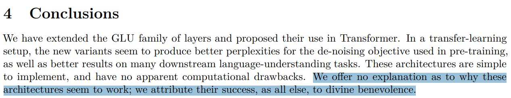
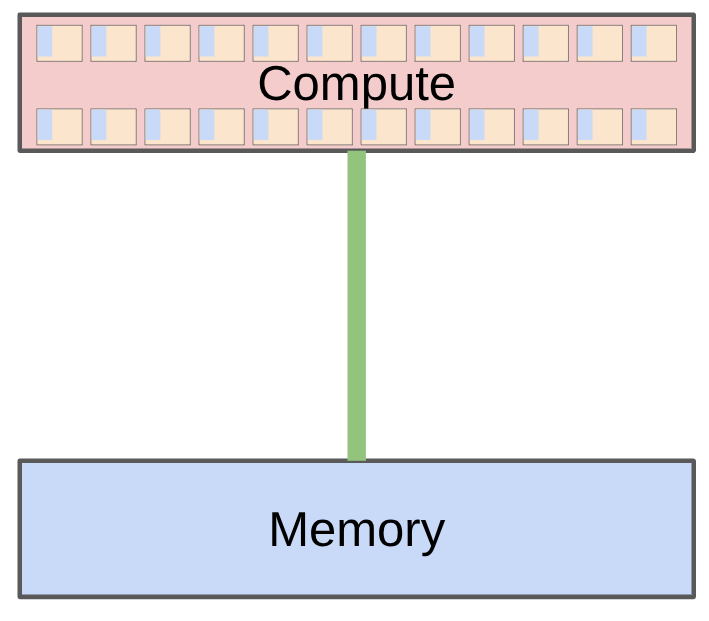

# Lecture 1: Language Models From Scratch 深度笔记

本笔记基于斯坦福 CS336 (Language Modeling from Scratch) 第一讲的课堂内容整理，涵盖课程介绍、语言模型发展历史、课程大纲以及分词（Tokenization）技术的详细讲解。笔记力求详尽，适合复习和传阅。

> **课程信息**：CS336 · Spring 2026 · 主题：Introduction & Tokenization

---

# Part 1: 课程介绍 — 为什么需要这门课

## Slide 1: 课程概览


### 讲解

这是 CS336 课程的第三次开课（Spring 2026），由斯坦福大学开设。课程的核心理念是 **"from scratch"**——从零开始构建语言模型，不依赖任何现成的框架或预训练模型。

**与往届课程相比的新变化：**
- 保持"从零构建"的核心哲学
- 优先讲授高价值、高时间效率的概念，不迷失在细节中
- 增加了现代语言模型关键组件的覆盖：混合专家（Mixture of Experts）、长上下文（Long-Context）、智能体（Agents）

**为什么要学这门课？**

问题的核心在于：**研究人员正在与底层技术脱节**。

- **2016年**：研究人员自己实现并训练模型
- **2018年**：研究人员下载模型（如 BERT）并微调
- **今天**：研究人员提示 API 模型（如 GPT/Claude/Gemini）

虽然抽象层次的提升确实提高了生产力，但这些抽象是**有漏洞的**（leaky abstractions），与编程语言或操作系统不同。仍然存在需要深入底层才能完成的基础研究。

**课程哲学：通过构建来理解（understanding via building）。**

---

## Slide 2: 语言模型的工业化


### 讲解

课程面临一个现实挑战：**前沿模型（Frontier Models）极其昂贵**。

- **2023年**：GPT-4 的训练成本据传高达 **1亿美元**
- **2025年**：xAI 建造了包含 **23万块 GPU** 的集群来训练 Grok

前沿模型的构建没有任何公开细节。正如 GPT-4 技术报告中所说：


前沿模型对我们来说是遥不可及的。我们可以构建小型语言模型（<1B参数），但这可能不能代表大型语言模型的特性。

**两个关键例证：**

**例1：注意力与MLP的FLOPs占比随规模变化**


随着模型规模增大，注意力机制和MLP层消耗的FLOPs比例会发生变化。这意味着小型模型的优化策略不一定适用于大型模型。

**例2：行为随规模涌现**


某些能力只在模型达到特定规模后才会突然出现（emergence）。这种涌现行为使得小型模型的研究结果难以直接推广到大型模型。

---

## Slide 3: 这门课能学到什么？

### 讲解

虽然我们无法直接训练前沿模型，但这门课教授的三类知识是**可以迁移**的：

| 知识类型 | 描述 | 可迁移性 |
|---------|------|---------|
| **Mechanics（机制）** | 事物如何工作（Transformer是什么，模型并行如何运作） | 完全可迁移 |
| **Mindset（思维模式）** | 最大化硬件利用率，认真对待规模化 | 完全可迁移 |
| **Intuitions（直觉）** | 哪些数据和建模决策能带来好精度 | 部分可迁移（不一定跨规模适用） |

**关于直觉的说明：**

有些设计决策目前还无法完全解释，只能通过实验获得。例如，Noam Shazeer 在引入 SwiGLU 激活函数的论文中写道：



> "I have no idea why this works, but it just does."（我不知道为什么这有效，但它就是有效。）

---

## Slide 4: 苦涩的教训（The Bitter Lesson）

### 讲解

Rich Sutton 在2019年提出的"苦涩的教训"经常被误解：

- **错误解读**：规模就是一切，算法不重要
- **正确解读**：**能够规模化的算法**才是重要的

核心公式：

```math
\text{accuracy} = \text{efficiency} \times \text{resources}
```

实际上，在更大规模下，**效率更加重要**——因为无法承担浪费。

[This paper](https://arxiv.org/abs/2005.04305) 显示，2012-2019年间 ImageNet 上的算法效率提升了 **44倍**。

**课程框架**：给定一定的计算和数据预算，如何构建最好的模型？
换句话说，**最大化效率**！

---

# Part 2: 语言模型发展历史

## Slide 5: 前神经网络时代（2010年代之前）

### 讲解

**Shannon (1950)**：使用语言模型测量英语的熵

**N-gram 语言模型**：用于机器翻译和语音识别系统

---

## Slide 6: 神经网络成分（2010年代）

### 讲解

这一时期奠定了现代语言模型的基础：

| 技术 | 年份 | 重要性 |
|-----|------|--------|
| **LSTM** | 1997 | 长短期记忆网络，解决梯度消失问题 |
| **第一种神经语言模型** | 2003 | Bengio et al. 提出的前馈神经网络语言模型 |
| **Seq2Seq** | 2014 | 序列到序列建模，用于机器翻译 |
| **Adam 优化器** | 2014 | 自适应学习率优化器，至今仍广泛使用 |
| **注意力机制** | 2015 | Bahdanau et al. 提出，用于机器翻译 |
| **Transformer** | 2017 | Vaswani et al. 提出，彻底改变了NLP |
| **混合专家（MoE）** | 2017 | 条件计算，提高模型容量而不增加计算量 |
| **模型并行** | 2018-2019 | GPipe, ZeRO, Megatron-LM，使大规模训练成为可能 |

---

## Slide 7: 早期基础模型（2010年代末）

### 讲解

**ELMo (2018)**：使用LSTM进行预训练，微调改善下游任务

**BERT (2018)**：使用Transformer进行预训练，微调改善下游任务

**T5 (2019)**：Google的11B参数模型，将所有任务统一为文本到文本的格式

---

## Slide 8: 拥抱规模化

### 讲解

这一时期标志着语言模型进入"规模化"时代：

**GPT-2 (2019)**：1.5B参数，流畅的文本生成，首次展现零样本能力

**Scaling Laws (2020)**：Kaplan et al. 发现模型性能与计算量之间存在可预测的幂律关系

**GPT-3 (2020)**：175B参数，展示了上下文学习（in-context learning）能力

**PaLM (2022)**：540B参数，巨大规模但训练不足

**Chinchilla (2022)**：70B参数，提出了计算最优的缩放定律

---

## Slide 9: 开源模型

### 讲解

**早期尝试（复制GPT-3）：**
- **The Pile (2020) / GPT-J (2021)**：EleutherAI的开源数据集和模型
- **OPT (2022)**：Meta的175B参数GPT-3复制，遇到了很多硬件问题
- **BLOOM (2022)**：Hugging Face / BigScience的176B参数模型，专注于数据来源

**可信的开放权重模型（权重+论文）：**

| 模型系列 | 机构 | 代表模型 |
|---------|------|---------|
| **Llama** | Meta | Llama, Llama 2, Llama 3 |
| **Mistral** | Mistral | Mistral-7B, Mixtral |
| **DeepSeek** | DeepSeek | DeepSeek-67B, V2, V3, R1, V3-2 |
| **Qwen** | Alibaba | Qwen2.5, Qwen3 |
| **Kimi** | Moonshot | Kimi-1.5, Kimi-K2.5 |
| **GLM** | Z.ai | GLM-4.5, GLM-5 |
| **Minimax** | Minimax | Minimax-M2.5 |
| **MIMO** | Xiaomi | MIMO-V2 |

这些模型正在接近闭源模型（GPT、Claude、Gemini等）的水平。

**开源模型（权重+论文+代码+数据）：**
- **OLMo**：AI2的模型
- **Nemotron**：NVIDIA的模型
- **Marin**：开放开发的模型

**开放性对于信任和创新非常重要。**

---

## Slide 10: 什么是语言模型？

### 讲解

语言模型的定义在不断演变：

| 年份 | 定义 | 代表 |
|-----|------|-----|
| 2018 | 你需要微调的东西 | BERT |
| 2020 | 你需要提示的东西 | GPT-3 |
| 2022 | 你与之对话的东西 | ChatGPT |
| 2026 | 自主行动的东西 | Agents |

**基础技术是相同的**（注意力、内核、优化），但**规格不同**（更长的上下文、推理效率更加重要）。

---

# Part 3: 课程大纲

## Slide 11: 可执行讲座（Executable Lecture）

### 讲解

这是一个**可执行讲座**——一个程序，其执行过程就是讲座内容的呈现。

可执行讲座的优势：
- 可以查看和运行代码（因为一切都是代码！）
- 可以看到讲座的层次结构

---

## Slide 12: 课程后勤

### 讲解

**课程信息：**
- 所有信息在线：[课程网站](https://stanford-cs336.github.io/spring2026/)
- 5学分课程

**课程评价（Spring 2024）：**
> "整个作业的工作量大约相当于 CS 224n 的所有5个作业加上最终项目。而这只是第一个家庭作业。"

**为什么要选这门课：**
- 你有一种强迫症般的需求去理解事物如何工作
- 你想建立你的研究工程能力

**为什么要不选这门课：**
- 你实际上想在这个季度完成研究
- 你对AI的最新技术感兴趣（如多模态、RAG等）
- 你想在自己的应用领域获得好结果

---

## Slide 13-18: 课程大纲详解

### Assignment 1: 基础（Basics）

**目标**：能够训练基本的语言模型

**组件**：分词、模型架构、训练

#### 分词（Tokenization）

模型操作的原子是什么？

形式上：分词器在原始输入（字节）和整数序列（token）之间转换


**流行的分词器：字节对编码（BPE）**

直觉：将输入分解为频繁出现的块

**效率视角：**
- 减少上下文长度（1000字节 → ~250个token）
- 自适应计算（对输入的有趣部分分配更多建模能力）

**梦想**：无分词器的模型架构，直接在字节上操作（ByT5, MegaByte, BLT, T-FREE, HNet）
这些很有希望，但尚未扩展到前沿。

#### 模型架构（Model Architecture）

**起点**：原始Transformer


**改进：**
- **激活函数**：ReLU, SwiGLU
- **位置编码**：正弦编码, RoPE
- **归一化**：LayerNorm, RMSNorm, QK norm, pre-norm vs post-norm
- **注意力**：全注意力, 稀疏/局部注意力, 分组查询注意力（GQA）, 多头潜在注意力（MLA）
- **循环/状态空间模型/线性注意力**：Mamba, Gated DeltaNet
- **MLP**：密集, 混合专家
- **形状**：隐藏维度, 深度, 头数, 专家数

#### 训练（Training）

如何设置模型参数？

- **损失函数**：多token预测
- **优化器**：AdamW, SOAP, Muon
- **初始化规模**：Xavier初始化, muP
- **学习率调度**：余弦调度, WSD
- **正则化**：dropout, 权重衰减
- **批量大小**：临界批量大小
- **MoE特定**：负载均衡（如aux-free）

#### Assignment 1详情

[GitHub](https://github.com/stanford-cs336/assignment1-basics) | [PDF](https://github.com/stanford-cs336/assignment1-basics/blob/main/cs336_spring2026_assignment1_basics.pdf)

- 实现BPE分词器
- 实现Transformer、交叉熵损失、AdamW优化器、训练循环
- 进行资源核算
- 在TinyStories和OpenWebText上训练
- 排行榜：在B200上45分钟内最小化OpenWebText困惑度

**高层原则：平衡以下三者：**
- **表达能力**（能表示数据中的复杂依赖）
- **稳定性**（保持参数和梯度范数在适中范围）
- **效率**（在硬件上快速运行，训练和推理都快）

---

### Assignment 2: 系统（Systems）

**目标**：最大化硬件利用率（GPU或TPU）

**组件**：内核、并行、推理

#### 基础

- 资源核算：模型的内存和计算特性
- 模型参数必须从内存（HBM）移动到计算单元（SM）
- 示例：B200可以执行2.25 PFLOP/sec（bf16），内存带宽为8TB/sec
- Roofline分析：理解是计算受限还是内存受限
- 基准测试和分析（nsight）：查看实际情况



#### 内核（Kernels）

- 内核是在GPU上运行的函数
- 使用PyTorch时，每个基本操作都会启动一个标准内核
- 可以编写自定义内核来让GPU全速运转
- 原则：组织计算以最小化数据移动
  - 朴素：读HBM；计算A；写HBM；读HBM；计算B；写HBM
  - 融合：读HBM；计算A和B；写HBM
- 策略：算子融合（matmul + 激活），分块（FlashAttention）
- Warp分歧、内存合并、bank冲突、占用率、批量异步内存传输
- 用CUDA/**Triton**/CUTLASS/ThunderKittens编写内核

#### 并行（Parallelism）

- 如果我们有1024个GPU怎么办？
- GPU之间的数据移动更慢，但同样的"最小化数据移动"原则仍然适用
- 使用经典的集合操作（如gather, reduce, all-reduce）
- 跨GPU分片内存（参数、激活、梯度、优化器状态）
- 如何分割计算：数据、张量、流水线、序列、专家并行

#### 推理（Inference）

**目标**：给定提示生成token（实际使用模型所需！）
推理也需要用于强化学习、测试时计算、评估

**两个阶段：预填充和解码**


- **预填充**（类似训练）：token已知，可以一次性处理所有（计算受限）
- **解码**：需要一次生成一个token（内存受限）

**加速解码的方法：**
- 使用更便宜的模型（通过模型剪枝、量化、蒸馏）
- 推测解码：使用更便宜的"草稿"模型生成多个token，然后用完整模型并行评分（精确解码！）
- 系统优化：融合内核、连续批处理

#### Assignment 2详情

[GitHub](https://github.com/stanford-cs336/assignment2-systems) | [PDF from Spring 2025](https://github.com/stanford-cs336/assignment2-systems/blob/spring2025/cs336_spring2025_assignment2_systems.pdf)

- 实现融合的RMSNorm内核（Triton）
- 实现分布式数据并行训练
- 实现优化器状态分片
- 基准测试和分析实现

**推荐书籍**：[How to Scale Your Model](https://jax-ml.github.io/scaling-book/)

---

### Assignment 3: 缩放定律（Scaling Laws）

**场景**：如果你有1e25 FLOPs的计算预算，你会使用什么超参数来训练一个好的模型？

在全规模下进行超参数调整太昂贵了！

**关键概念转变**：不是单一规模，而是思考**缩放配方**（FLOPs → 超参数）

**缩放配方的步骤：**
1. 在较小规模（如高达1e24 FLOPs）运行实验计算损失
2. 拟合缩放定律以预测目标规模（如1e25 FLOPs）的损失

**现在你可以：**
1. 使用小规模实验优化大规模的缩放配方
2. 在实际运行实验之前预测目标规模的损失！

**缩放定律不会自动发生，它们需要仔细构建缩放配方。**
参数化模型以获得**超参数迁移**。
**可预测性至少与最优性同样重要！**

**问题**：给定FLOPs预算（C = 6 N D），使用更大的模型（N）还是在更多token（D）上训练？

**经典的计算最优缩放定律：**
- ISOFLOP曲线：对于多个小FLOPs预算，找到最优N
- 然后拟合缩放定律以推断到大FLOPs预算


**TL;DR**：D = 20 N 大致最优（例如，70B参数模型应该在~1.4T token上训练）
**注意**：这没有考虑推理成本（想要更小的模型）

#### Assignment 3详情

[GitHub](https://github.com/stanford-cs336/assignment3-scaling) | [PDF from Spring 2025](https://github.com/stanford-cs336/assignment3-scaling/blob/master/cs336_spring2025_assignment3_scaling.pdf)

- 定义训练API（超参数 → 损失）基于之前的运行
- 提交"训练作业"（在FLOPs预算下）并收集数据点
- 拟合缩放定律到数据点
- 提交推断的超参数和损失预测
- 排行榜：在FLOPs预算下最小化损失

---

### Assignment 4: 数据（Data）

**问题**：我们希望模型具有什么能力？
多语言？擅长对话？智能体编码能力？

#### 评估（Evaluation）

评估的目的是什么？
1. **内部**：指导模型开发（跨规模的平滑性，相对性能重要）
2. **外部**：衡量真实用例的绝对质量（生态效度重要）

**评估示例：**
1. **困惑度**：最好在私人文档上运行，不在互联网上（避免污染）
2. **高级用例**：GPQA, HLE, SWE-Bench, Terminal-Bench

**语言模型是通用的，需要多样化的评估！**

#### 数据策展（Data Curation）

- 数据不是从天而降的
- 来源：从互联网爬取的网页、书籍、arXiv论文、GitHub代码等

- 对版权数据训练诉诸合理使用？[Paper](https://arxiv.org/pdf/2303.15715.pdf)
- 可能需要授权数据（如Google与Reddit数据）[Article](https://www.reuters.com/technology/reddit-ai-content-licensing-deal-with-google-sources-say-2024-02-22/)
- 原始数据是HTML、PDF、目录（不是文本），需要处理

#### 数据处理（Data Processing）

- **转换**：将HTML/PDF转换为文本（提取主要内容）
- **过滤**：保留高质量数据，移除有害内容（通过分类器）
- **去重**：节省计算，避免记忆；使用Bloom过滤器或MinHash
- **数据混合**：如何上采样/下采样每个来源？[RegMix, OLMix]
- **重写/合成数据**：使用LM增强真实数据，更接近下游任务

**数据类型：**
- **预训练数据**：大规模且多样化
- **中训练数据**：高质量，包括长上下文
- **后训练数据**：监督微调（对话、带工具调用的智能体轨迹）

#### Assignment 4详情

[GitHub](https://github.com/stanford-cs336/assignment4-data) | [PDF from Spring 2025](https://github.com/stanford-cs336/assignment4-data/blob/spring2025/cs336_spring2025_assignment4_data.pdf)

- 将Common Crawl HTML转换为文本
- 训练分类器过滤质量和有害内容
- 使用MinHash去重
- 排行榜：在token预算下最小化困惑度

---

### Assignment 5: 对齐（Alignment）

到目前为止，我们已经在完整监督下训练了模型（预测下一个token）。
现在模型应该已经合理了，我们可以从**弱监督**进一步改进它。

**为什么用弱监督？** 当批评比生成更容易时。

**基本模板：**
1. 从模型生成响应
2. 用{人类, 验证器, LM评判}评分响应
3. 更新模型以偏好更好的响应

**算法：**
- **PPO**（近端策略优化）：来自强化学习
- **DPO**（直接策略优化）：用于偏好数据，更简单
- **GRPO**（组相对策略优化）：移除价值函数

**挑战：**
- RL算法不稳定，难以调整
- 在大规模下，需要大量新基础设施（异步rollout的推理）
- 不断在系统效率和在线策略性之间权衡

#### Assignment 5详情

[GitHub](https://github.com/stanford-cs336/assignment5-alignment) | [PDF from Spring 2025](https://github.com/stanford-cs336/assignment5-alignment/blob/spring2025/cs336_spring2025_assignment5_alignment.pdf)

- 实现直接偏好优化（DPO）
- 实现组相对策略优化（GRPO）

---

## Slide 19: 课程核心思想 — 效率

### 讲解

记住，一切都是关于**效率**：

- **资源**：数据 + 硬件（计算、内存、通信带宽）
- **核心问题**：给定固定资源集，如何训练最好的模型？

**今天的计算约束**：设计决策反映了从给定硬件中挤出最多性能

| 领域 | 与效率的关系 |
|-----|------------|
| **系统** | 显然关于效率 |
| **分词** | 使用原始字节很优雅，但在今天的模型架构中计算效率低 |
| **模型架构** | 许多更改由减少内存或FLOPs驱动（如共享KV缓存、滑动窗口注意力） |
| **数据过滤** | 避免浪费宝贵的计算在糟糕/不相关的数据上 |
| **缩放定律** | 在较小模型上使用较少计算进行超参数调整 |

**明天，我们将成为数据受限的...**

---

# Part 4: 分词（Tokenization）深度讲解

## Slide 20: 分词简介

### 讲解

本单元受 Andrej Karpathy 的分词视频启发。[Video](https://www.youtube.com/watch?v=zduSFxRajkE)

**核心概念：**

原始文本通常表示为Unicode字符串。

```python
string = "Hello, 🌍! 你好!"
```

语言模型对token序列（通常表示为整数索引）施加概率分布。

```python
indices = [15496, 11, 995, 0]
```

因此，我们需要一个程序将字符串**编码**为token。
我们还需要一个程序将token**解码**回字符串。
`Tokenizer`是实现encode和decode方法的类。

```python
class Tokenizer(ABC):
    """Abstract interface for a tokenizer."""
    def encode(self, string: str) -> list[int]:
        raise NotImplementedError

    def decode(self, indices: list[int]) -> str:
        raise NotImplementedError
```

**Tokenizer接口**：在字符串和token索引之间转换

---

## Slide 21: 分词示例

### 讲解

要了解分词器的工作方式，请玩这个[交互式网站](https://tiktokenizer.vercel.app/?encoder=gpt2)

**观察：**
- 一个单词及其前面的空格是同一个token的一部分（例如" world"）
- 单词在开头和中间的表示不同（例如"hello hello"）
- 数字每几位数字被分词一次

**GPT-5分词器演示：**

```python
import tiktoken

tokenizer = tiktoken.get_encoding("o200k_base")
string = "Hello, 🌍! 你好!"

# 检查encode()和decode()是否往返
indices = tokenizer.encode(string)
reconstructed_string = tokenizer.decode(indices)
assert string == reconstructed_string
```

**压缩率** = 每个token的字节数。压缩率越大，序列越短（好，因为注意力与序列长度的平方成正比）。

可以通过增加**词汇表大小**来增加压缩率（可能的token值数量增加），导致稀疏性。

```python
vocabulary_size = tokenizer.n_vocab
```

---

## Slide 22: 字符分词器（Character Tokenizer）

### 讲解

Unicode字符串是Unicode字符的序列。
每个字符可以通过`ord`转换为码点（整数）。

```python
assert ord("a") == 97
assert ord("🌍") == 127757
```

可以通过`chr`转换回来。

```python
assert chr(97) == "a"
assert chr(127757) == "🌍"
```

**实现：**

```python
class CharacterTokenizer(Tokenizer):
    """Represent a string as a sequence of Unicode code points."""
    def encode(self, string: str) -> list[int]:
        return list(map(ord, string))

    def decode(self, indices: list[int]) -> str:
        return "".join(map(chr, indices))
```

**测试：**

```python
tokenizer = CharacterTokenizer()
string = "Hello, 🌍! 你好!"
indices = tokenizer.encode(string)  # 调用ord
reconstructed_string = tokenizer.decode(indices)  # 调用chr
assert string == reconstructed_string
```

**问题：**
- 大约有150K个Unicode字符。[Wikipedia](https://en.wikipedia.org/wiki/List_of_Unicode_characters)
- **问题1**：这是一个非常大的词汇表
- **问题2**：许多字符相当罕见（如🌍），这是词汇表的低效使用

```python
vocabulary_size = max(indices) + 1  # 这是下界
compression_ratio = get_compression_ratio(string, indices)
```

**这个分词器是两者的最差组合（大词汇表，低压缩率）。**

---

## Slide 23: 字节分词器（Byte Tokenizer）

### 讲解

Unicode字符串可以表示为字节序列，可以用0到255之间的整数表示。
最常见的Unicode编码是[UTF-8](https://en.wikipedia.org/wiki/UTF-8)。

**一些Unicode字符用一个字节表示：**

```python
assert bytes("a", encoding="utf-8") == b"a"
```

**其他需要多个字节：**

```python
assert bytes("🌍", encoding="utf-8") == b"\xf0\x9f\x8c\x8d"
```

**实现：**

```python
class ByteTokenizer(Tokenizer):
    """Represent a string as a sequence of bytes."""
    def encode(self, string: str) -> list[int]:
        string_bytes = string.encode("utf-8")
        indices = list(map(int, string_bytes))
        return indices

    def decode(self, indices: list[int]) -> str:
        string_bytes = bytes(indices)
        string = string_bytes.decode("utf-8")
        return string
```

**测试：**

```python
tokenizer = ByteTokenizer()
string = "Hello, 🌍! 你好!"
indices = tokenizer.encode(string)
reconstructed_string = tokenizer.decode(indices)
assert string == reconstructed_string
```

**词汇表很小**：一个字节可以表示256个值

```python
vocabulary_size = 256
```

**压缩率如何？**

```python
compression_ratio = get_compression_ratio(string, indices)
assert compression_ratio == 1
```

**压缩率 = 1** → 压缩率很差，这意味着序列会太长。
考虑到Transformer的上下文长度有限（因为注意力与序列长度的平方成正比），这看起来不太好...

---

## Slide 24: 词分词器（Word Tokenizer）

### 讲解

另一种方法（更接近经典NLP的做法）是将字符串分割成单词。

```python
string = "I'll say supercalifragilisticexpialidocious!"
chunks = regex.findall(r"\w+|.", string)
# -> ["I", "'", "ll", " ", "say", " ", "supercalifragilisticexpialidocious", "!"]
```

这个正则表达式将所有字母数字字符保持在一起（单词）。

**优点**：每个token是有意义的（因为人类发明了单词）。

```python
compression_ratio = get_compression_ratio(string, chunks)
```

**问题**：压缩率很好，但词汇表可能很大。
- 许多单词很罕见，模型不会学到很多
- 这没有明显提供固定的词汇表大小
- 训练期间未见过的新单词获得特殊的UNK token，这很丑陋且会搞乱困惑度计算

---

## Slide 25: 字节对编码（BPE）简介

### 讲解

**BPE算法**由Philip Gage在1994年引入用于数据压缩。[Article](http://www.pennelynn.com/Documents/CUJ/HTML/94HTML/19940045.HTM)
它被改编用于神经机器翻译。[Sennrich et al. (2016)](https://arxiv.org/abs/1508.07909)
BPE随后被GPT-2使用。[Radford et al. (2019)](https://d4mucfpksywv.cloudfront.net/better-language-models/language_models_are_unsupervised_multitask_learners.pdf)

**基本思想**：在原始文本上**训练**分词器，构建针对数据量身定制的词汇表。
**直觉**：常见的字节序列由单个token表示，罕见的序列由多个token表示。

**概要**：从每个字节作为一个token开始，连续合并最常见的相邻token对。

---

## Slide 26: BPE合并函数

### 讲解

**合并函数**是BPE的核心操作：

```python
def merge(indices: list[int], pair: tuple[int, int], new_index: int) -> list[int]:
    """Return `indices`, but with all instances of `pair` replaced with `new_index`."""
    new_indices = []
    i = 0
    while i < len(indices):
        if i + 1 < len(indices) and indices[i] == pair[0] and indices[i + 1] == pair[1]:
            new_indices.append(new_index)
            i += 2
        else:
            new_indices.append(indices[i])
            i += 1
    return new_indices
```

**工作原理：**
1. 遍历索引列表
2. 当找到相邻对`(pair[0], pair[1])`时，用`new_index`替换
3. 跳过已合并的token

---

## Slide 27: BPE分词器参数

### 讲解

**BPETokenizerParams**包含指定BPE分词器所需的所有信息：

```python
@dataclass(frozen=True)
class BPETokenizerParams:
    """All you need to specify a BPETokenizer."""
    vocab: dict[int, bytes]                  # index -> bytes
    merges: dict[tuple[int, int], int]       # index1, index2 -> new_index
```

- **vocab**：从索引到字节的映射
- **merges**：从token对到新索引的映射

---

## Slide 28: BPE分词器实现

### 讲解

**BPE分词器实现：**

```python
class BPETokenizer(Tokenizer):
    """BPE tokenizer given a set of merges and a vocabulary."""
    def __init__(self, params: BPETokenizerParams):
        self.params = params

    def encode(self, string: str) -> list[int]:
        indices = list(map(int, string.encode("utf-8")))
        # 注意：这是一个非常慢的实现
        for pair, new_index in self.params.merges.items():
            indices = merge(indices, pair, new_index)
        return indices

    def decode(self, indices: list[int]) -> str:
        bytes_list = list(map(self.params.vocab.get, indices))
        string = b"".join(bytes_list).decode("utf-8")
        return string
```

**encode过程：**
1. 将字符串转换为UTF-8字节
2. 按顺序应用所有合并规则
3. 返回最终的token索引列表

**decode过程：**
1. 将索引映射回字节
2. 连接所有字节
3. 解码为UTF-8字符串

---

## Slide 29: BPE训练算法

### 讲解

**统计相邻对：**

```python
def count_adjacent_pairs(indices: list[int]) -> dict[tuple[int, int], int]:
    """Return a dictionary mapping each adjacent pair of tokens in `indices` to the number of times it occurs."""
    counts = defaultdict(int)
    for index1, index2 in zip(indices, indices[1:]):
        counts[(index1, index2)] += 1
    return counts
```

**BPE训练算法：**

```python
def train_bpe(string: str, num_merges: int) -> BPETokenizerParams:
    # 从字符串的字节列表开始
    indices = list(map(int, string.encode("utf-8")))
    merges: dict[tuple[int, int], int] = {}   # index1, index2 => merged index
    vocab: dict[int, bytes] = {x: bytes([x]) for x in range(256)}  # index -> bytes

    for i in range(num_merges):
        # 计算每对token的出现次数
        counts = count_adjacent_pairs(indices)

        # 找到最常见的对
        pair = max(counts, key=counts.get)

        # 合并该对
        new_index = 256 + i
        merges[pair] = new_index
        vocab[new_index] = vocab[pair[0]] + vocab[pair[1]]
        indices = merge(indices, pair, new_index)

    return BPETokenizerParams(vocab=vocab, merges=merges)
```

**训练步骤：**
1. 初始化：256个基础字节token
2. 循环`num_merges`次：
   - 统计所有相邻对的出现次数
   - 找到最常见的对
   - 为该对分配新索引
   - 更新词汇表和合并规则
   - 应用合并到索引列表

---

## Slide 30: BPE分词器使用示例

### 讲解

**训练分词器：**

```python
string = "the cat in the hat"
params = train_bpe(string, num_merges=3)
```

**使用分词器：**

```python
tokenizer = BPETokenizer(params)
string = "the quick brown fox"
indices = tokenizer.encode(string)
reconstructed_string = tokenizer.decode(indices)
assert string == reconstructed_string
```

**Assignment 1的扩展：**

在Assignment 1中，你将在此基础上更进一步：
- encode()当前循环遍历所有合并。只循环遍历重要的合并
- 检测并保留特殊token（如）
- 使用预分词（如GPT-2分词器正则表达式）
- 尝试使实现尽可能快

---

# Part 5: 分词总结

## Slide 31: 分词总结

### 讲解

**核心要点：**

- **Tokenizer**：字符串 ↔ token（索引）
- 基于字符、基于字节、基于词的分词高度次优
- **BPE**是有效的启发式方法，由数据驱动
- 分词是一个单独的步骤，也许有一天会从字节端到端进行...

**但无论什么解决方案都需要满足：**
1. 模型（如Transformer）应该操作序列（文本、视频、DNA等）的块（抽象）
2. 块应该是可变的（对有趣的部分分配更多建模能力）

---

> **Next time: resource accounting**（下次：资源核算）
