# Lecture 3: LM 架构与超参数——你可能不想知道的一切 深度笔记

本笔记基于斯坦福 CS336 (Language Modeling from Scratch) 第三讲的课堂内容整理。在完成前两讲的分词（Tokenization）与基础 Transformer 实现后，本讲将深入大语言模型（LLM）的架构细节与超参数设计，探讨工业界在模型结构、规范化（Normalization）、激活函数、位置编码、缩放定律及训练稳定性等方面的最佳实践与底层逻辑。

> **课程信息**：CS336 · Spring 2026 · 主讲人：Tatsu Hashimoto · 主题：LM Architecture and Hyperparameters

---

# Part 1: 架构变体概述与归一化

## Slide 1


### 讲解

本讲是斯坦福 CS336 课程的第三讲，主题为 **LM Architecture and Hyperparameters（语言模型架构与超参数）**。在前面的课程中，我们已经学习了最基础的 Transformer 模型设计与实现。然而，当真正进入工业界或进行大规模模型训练时，你会发现很少有模型会一字不差地照抄 2017 年 Attention is All You Need 论文中的原始结构。

本讲的副标题非常有趣——“Everything You Didn't Want to Know”（你可能不想知道的一切），这暗示了在语言模型架构演进的过程中，存在大量琐碎、细节但又至关重要的“暗黑知识”与工程直觉。主讲人 Tatsu Hashimoto 将带领我们梳理这些看似枯燥实则决定模型训练成败的关键变体。

---

## Slide 2


### 讲解

本页展示了本节课的**大纲与学习目标**（Outline and goals）。
我们在 CS336 的作业和实验中实现了一个现代的 Transformer 变体，但我们必须思考：
1. 我们实现的这个版本与现在主流的大语言模型（LLM）相比，有哪些异同？
2. 为什么大多数主流 LLM 会在某些架构设计上达成高度共识？
3. 常见的架构和训练超参数变体有哪些？它们是如何影响模型性能和训练稳定性的？

Tatsu 强调了一个核心理念：**学习系统与架构的最佳方式是“动手实践”（hands-on），而第二好的方式则是“从他人的经验与失败中学习”（learning from others' experience）**。大模型领域的许多架构微调并不是在理论上有多么精妙的突破，而是在数万卡级别算力下，工程师们用真金白银试错总结出来的经验法则。

---

## Slide 3


### 讲解

这一页回顾了我们的**起点：原始 Transformer（The original transformer）**。
在 2017 年 Vaswani 等人的原始论文中，模型做出了一些经典的设计选择：
- **位置编码（Position embedding）**：采用正弦和余弦函数（Sine and Cosine）的绝对位置编码。
- **前馈网络（FFN）**：使用简单的 ReLU 激活函数，即 $`\text{FFN}(x) = \max(0, xW_1 + b_1)W_2 + b_2`$。
- **规范化位置（Norm type）**：采用后置规范化（Post-LN），即 LayerNorm 置于残差连接（Residual Connection）之后：$`x_{l+1} = \text{LayerNorm}(x_l + F(x_l))`$。
- **规范化方法**：标准的 LayerNorm，包含均值归一化和方差归一化，以及可学习的缩放因子 $`\gamma`$ 和偏置 $`\beta`$。

了解这些初始设定有助于我们对比现代模型是如何一步步对其进行修改和优化的。

---

## Slide 4


### 讲解

在 CS336 课程中，学生们被要求实现一个**简单但现代的 Transformer 变体**。这个变体与原始 Transformer 相比，有以下几个核心改动：
1. **前置规范化（Pre-LN）**：将 LayerNorm 移到残差连接的前面，即 $`x_{l+1} = x_l + F(\text{LayerNorm}(x_l))`$。这样可以使梯度直接在残差通道中传播，大大提高了深层网络训练的稳定性。
2. **旋转位置编码（RoPE）**：摒弃了绝对位置编码，改用旋转位置编码，使注意力计算能够天然地编码相对位置信息。
3. **SwiGLU 激活函数**：前馈网络（FFN）抛弃了 ReLU，改用 Gated Linear Unit 变体中的 SwiGLU，从而带来显著的语言模型困惑度（Perplexity）提升。
4. **无偏置项（Bias-free）**：移除了线性层和 LayerNorm 中的偏置项（Bias terms），仅保留权重矩阵。

为什么我们要做出这些改变？这些改变是否能放之四海而皆准？本节课接下来的内容将深入解答这些问题。

### 补充图片

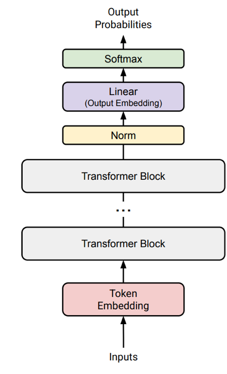


---

## Slide 5


### 讲解

面对眼花缭乱的模型架构，我们应当**如何思考和看待它们？**
仅在 2024 年至 2025 年之间，学术界和工业界就发布了超过 19 个新的稠密（Dense）语言模型结构。对于一个从业者来说，很容易迷失在这片由各种模型名字（如 LLaMA-3, Mistral, Qwen, Gemma, OLMo 等）组成的汪洋大海中。

这些模型或多或少都包含了一些细微的架构调整（Minor architecture tweaks）。面对这些令人应接不暇的变化，我们的任务不是去死记硬背每一个模型，而是要学会透过现象看本质：这些模型有哪些共同点？哪些部分是百川归海的共识？哪些又是具有争议的变体？

### 补充图片


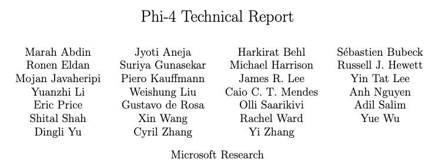
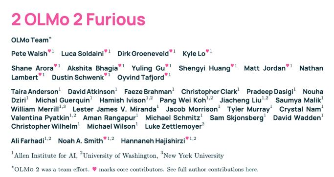
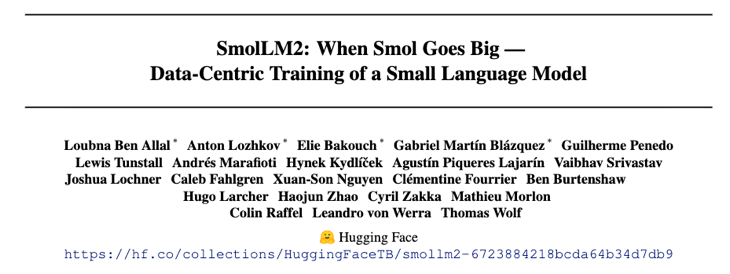

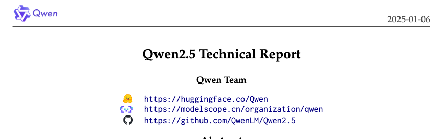
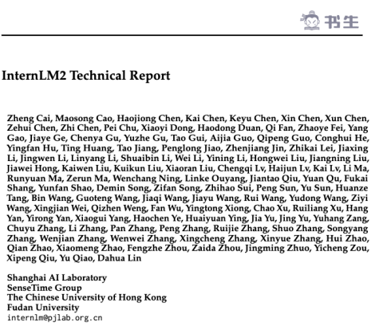


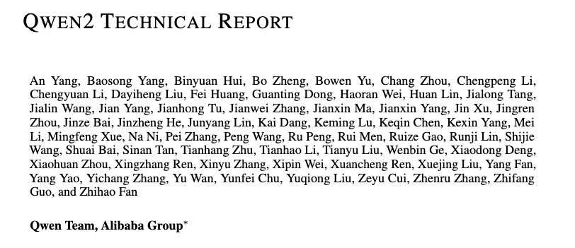
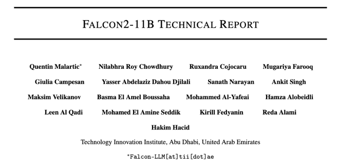

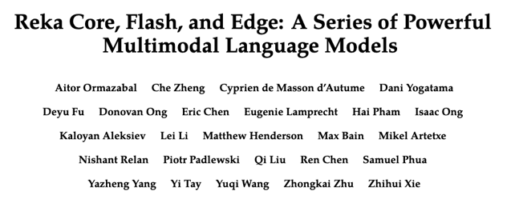

---

## Slide 6


### 讲解

为了让大家直观地感受大模型“动物园”的拥挤程度，幻灯片展示了这一时期发布的各类 LLM。我们可以看到 Gemma, DeepSeek-V3, LLaMA-3.1, Command-R, Qwen-2.5, Mistral Large 2, OLMo-2 等名字赫然在列。

面对如此之多的模型，研究者们通过整理大规模的数据来寻找规律。通过对几十个主流稠密模型的架构进行横向对比，我们可以挖掘出隐藏在数据背后的架构演进路线图。

### 补充图片

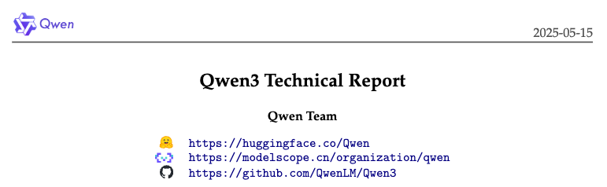


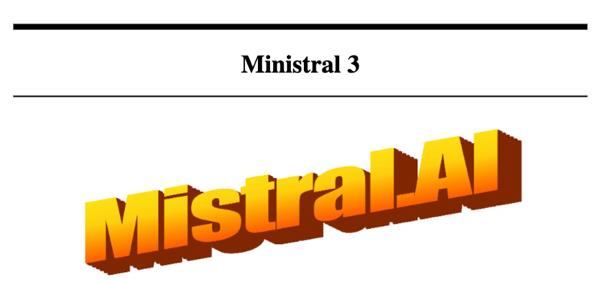
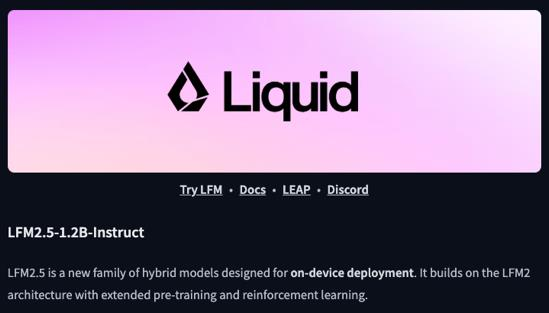
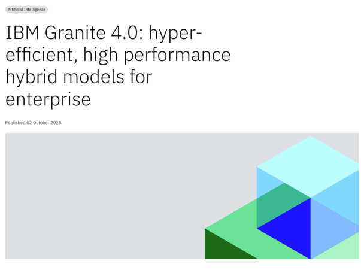
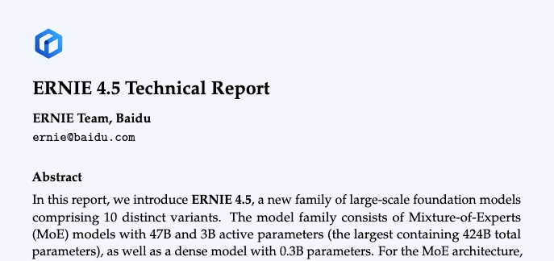
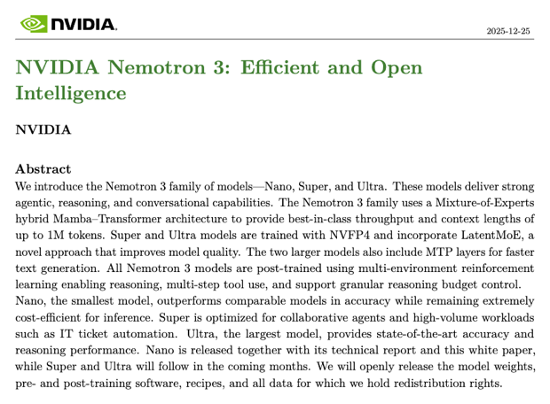
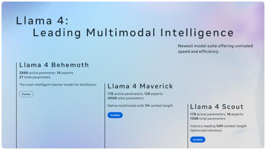
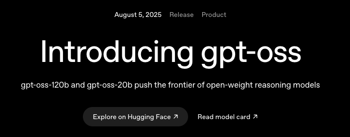
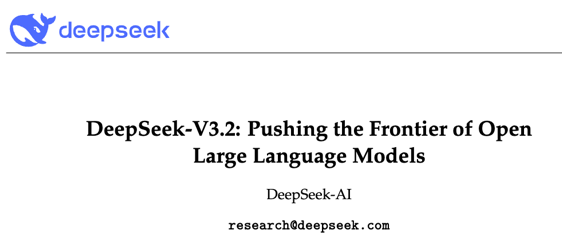
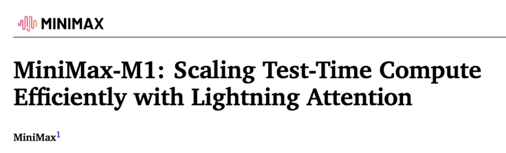
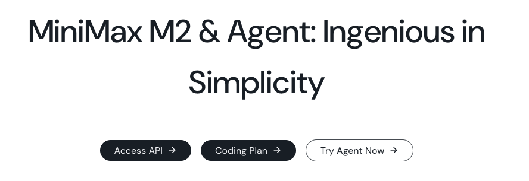
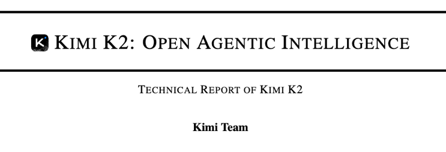
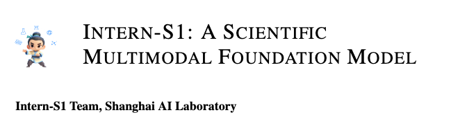
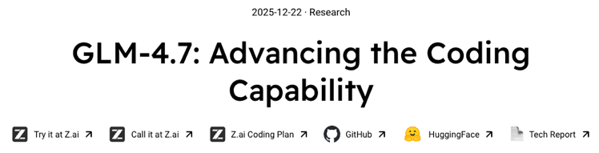
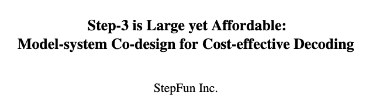

---

## Slide 7


### 讲解

本页提出“**让我们看一看关于稠密架构的数据**”（Let's look at the data）。
通过系统的横向对比，我们的目标是搞清楚：
- 为什么现有的模型长成这样？它们有哪些演进逻辑？
- 我们将讨论许多主流的架构和超参数变体。
- 最终厘清：这些模型之间到底有哪些不可动摇的共通点（What do all these models have in common）？哪些是可以灵活变通的？我们能从中学到什么？

### 补充图片

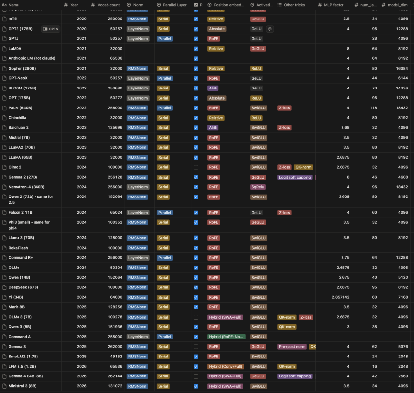

---

## Slide 8


### 讲解

本页明确了本节课将要覆盖的具体主题：
1. **常见架构变体（Common architecture variations）**：
   - **激活函数/前馈网络（Activations/FFN）**：从 ReLU/GeLU 到 GLU 及其门控变体。
   - **注意力机制变体（Attention variants）**：MQA（Multi-Query Attention）与 GQA（Grouped-Query Attention）等。
   - **位置嵌入（Position embeddings）**：正弦、绝对位置编码、相对位置编码及 RoPE。
2. **真正起作用的超参数（Hyperparameters that matter）**：
   - 前馈网络的隐藏层维度 `ff_dim`（或叫 `d_ff`）。
   - 注意力头维度 `head_dim` 与多头注意力隐藏维度的比例。
   - 词表大小（Vocab size）。
3. **训练稳定性技巧（Stability tricks）**：这是大规模预训练的命门，如 QK-Norm、z-loss 以及 Logit Soft-capping。

---

## Slide 9


### 讲解

本页对**架构变体**进行了概述。一个非常明显的趋势是：**类 LLaMA 架构（LLaMA-like architectures）在当前开源和闭源大模型中占据了绝对的主导地位**。
无论是 Mistral、Qwen、Gemma 还是 OLMo，几乎都在一定程度上继承了 LLaMA 的核心设计（Pre-LN、RMSNorm、RoPE、SwiGLU 等）。

同时，近年来也出现了一些值得关注的新趋势：
- **QK-Norm**：为了防止大规模训练中的注意力熵溢出（Entropy collapse）和不稳定性，对 Query 和 Key 进行规范化。
- **混合注意力机制（Hybrid Attention）**：交替使用全局自注意力和局部/滑动窗口注意力（Sliding Window Attention），以节省显存。

### 补充图片

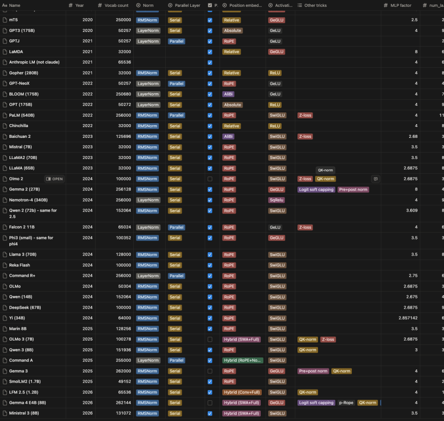

---

## Slide 10


### 讲解

接下来深入讨论第一个核心设计：**前置归一化（Pre-LN）还是后置归一化（Post-LN）**。
原始 Transformer 使用的是 Post-LN，其结构为：
```math
x_{l+1} = \text{LayerNorm}(x_l + F(x_l))
```
这里的 LayerNorm 放在了残差相加之后，这意味着 LayerNorm 直接位于主残差通道上。

而现代模型几乎全部倒向了 Pre-LN：
```math
x_{l+1} = x_l + F(\text{LayerNorm}(x_l))
```
如图所示，LayerNorm 被放在了子层（如 Self-Attention 或 FFN）的输入端，而主残差通道（即最下方的水平直线）是一条不受 LayerNorm 阻碍的恒等映射通道。

几乎所有现代大模型（如 LLaMA, Mistral, Qwen, Gemma）都使用 Pre-LN。唯一的例外是一些早期或较小的模型（如 BERT 使用 Post-LN，Meta 早期开源的 OPT-350M 在复现 GPT-3 时遇到了严重的训练不稳定问题，部分原因正是 Post-LN 导致梯度在浅层被严重削弱）。

### 补充图片

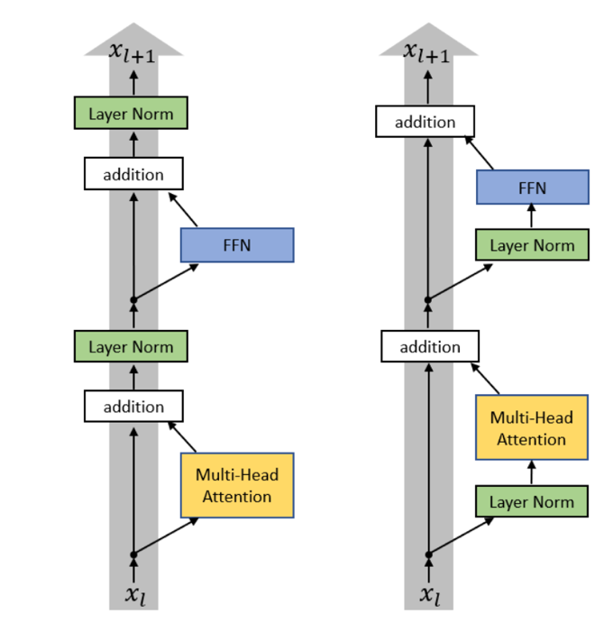
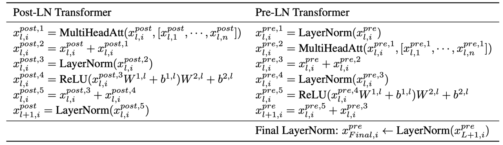

---

## Slide 11


### 讲解

这一页展示了 Xiong 等人（2020）以及 Salazar 与 Nguyen 等人（2019）论文中的**实验数据**，对比了 Pre-LN 与 Post-LN 在不同层数和不同学习率下的训练表现。

从左图可以看出，随着模型层数加深，Post-LN 极易出现梯度消失（Gradient Attenuation）或不稳定性，使得模型在没有精细调节的 Warmup 策略下甚至无法收敛。而 Pre-LN 在不同深度（甚至达到数十层）都能保持非常平稳的收敛曲线。

右侧柱状图展示了不同规范化位置对模型困惑度（Perplexity）的影响，数据进一步佐证了 Pre-LN 极佳的鲁棒性。

### 补充图片


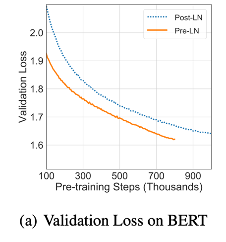

---

## Slide 12


### 讲解

如何从理论上解释 **Pre-LN vs Post-LN** 的差异？
根据 Xiong 2020 等人的梯度分析：
在 **Post-LN** 中，由于 LayerNorm 的级联效应，最后一层的梯度传回第一层时，会乘以一个与层数 $`L`$ 成反比的缩放因子。这意味着，靠近输入层的参数梯度会随着模型变深而急剧衰减（即“梯度衰减”）。为了让 Post-LN 收敛，必须使用极长且非常小心调节的学习率预热期（Warmup），使得在训练初期参数更新幅度极小，防止网络彻底崩溃。

而在 **Pre-LN** 中，因为主通道是纯粹的恒等映射，梯度可以毫无阻碍地从输出端回传到任何一层。参数梯度的大小基本与模型的总层数 $`L`$ 无关，这使得我们可以：
1. **彻底摆脱对严苛 Warmup 策略的依赖**。
2. **在训练极深的网络时保持极高的数值稳定性**。
3. **允许使用更大的学习率（Learning Rate）**，从而加速收敛并找到更好的局部最优解。

### 补充图片

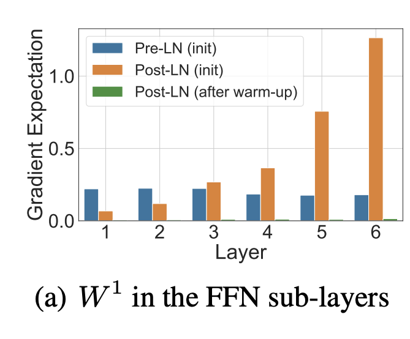


---

## Slide 13


### 讲解

尽管 Pre-LN 已经成为了行业共识，但近年来出现了一些**新变化：双重归一化（Double Norm）或非残差后置归一化（Non-residual Post-Norm）**。
工程师们提出：如果直接在残差通道上放置 LayerNorm 会阻碍梯度传播并引发不稳定，那么我们为什么不能在残差通道**之外**，在输出之前再额外加一层 Norm 呢？

例如，最近的一些前沿模型（如 Grok-1、Gemma-2、OLMo-2）就在标准的 Pre-LN 变体上，在子模块输出后、与主通道相加前，又加上了一层 Norm。这种设计被称为 Double Norm，虽然增加了一点微不足道的计算量，但能有效防止深层模型在极大规模训练（例如数万亿 Token）中后期由于隐藏层特征范数不断膨胀而带来的溢出问题。

### 补充图片


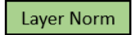

---

## Slide 14


### 讲解

规范化方法上的另一个重大飞跃是 **LayerNorm vs RMSNorm**。
传统的 **LayerNorm**（LN）对输入向量 $`x \in \mathbb{R}^d`$ 的均值和方差同时进行归一化：
```math
\mu = \frac{1}{d} \sum_{i=1}^d x_i, \quad \sigma^2 = \frac{1}{d} \sum_{i=1}^d (x_i - \mu)^2
```
```math
y = \frac{x - \mu}{\sqrt{\sigma^2 + \epsilon}} \odot \gamma + \beta
```
其中包含均值计算和方差计算，并且带有可学习的缩放向量 $`\gamma`$ 和偏置向量 $`\beta`$。

而 Zhang 和 Sennrich 在 2019 年提出的 **RMSNorm**（Root Mean Square Normalization）做了一个大胆的简化：它认为 LayerNorm 的成功主要源于其**缩放不变性（Scale Invariance）**，而减去均值这一操作对于神经网络的稳定性和表征能力是没有必要的。因此，RMSNorm 丢弃了均值计算，也丢弃了偏置 $`\beta`$，只对方差（均方根）进行归一化：
```math
\text{RMS}(x) = \sqrt{\frac{1}{d} \sum_{i=1}^d x_i^2}
```
```math
y = \frac{x}{\text{RMS}(x) + \epsilon} \odot \gamma
```

- **使用 LayerNorm 的经典模型**：GPT-1, GPT-2, GPT-3, OPT, GPT-J, BLOOM。
- **使用 RMSNorm 的现代模型**：LLaMA 系列, PaLM, Chinchilla, T5。现代大模型几乎全员抛弃 LayerNorm，转向 RMSNorm。

---

## Slide 15


### 讲解

**为什么 RMSNorm 会成为绝对主流？**
最直接的解释是：**速度更快，而且效果完全一样好**。
从公式可以看出，RMSNorm 相比 LayerNorm 少了计算均值 $`\mu`$ 的步骤，这意味着更少的算术操作（例如减法和平方差累加）。此外，由于去掉了偏置项 $`\beta`$，它减少了需要维护的可学习参数量。

在 GPU 计算中，虽然矩阵乘法（Matrix Multiplies）占据了绝大部分的 FLOPs（浮点运算数），但在实际的运行耗时（Runtime）中，像 LayerNorm 这样的逐元素（Element-wise）操作由于受限于内存带宽（Memory-bandwidth bound），其数据读取与写入的时间开销非常显著。RMSNorm 大幅减少了元素级操作的计算数和临时变量存取，有助于提升 GPU 的实际执行效率。

### 补充图片

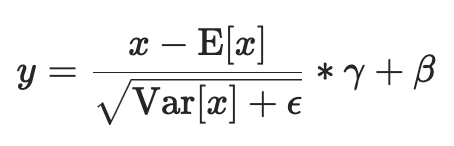
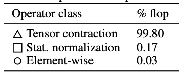

---

## Slide 16


### 讲解

我们需要牢记一个至关重要的工程常识：**算术运算量（FLOPs）不等于实际运行时间（Runtime）！**
这一页引用了 Ivanov 等人（2023）的研究。在左上角图表中，我们可以看到虽然像 LayerNorm/RMSNorm 这种归一化操作在整个 Transformer block 里的 FLOPs 占比极低（大约仅占矩阵乘法的万分之一），但它的“算术强度”（FLOP-to-memory ratio）极低，只有 153，而矩阵乘法的算术强度通常在几万以上。

这意味着，归一化操作是一个典型的**内存受限（Memory-bound）**操作。GPU 大量的时间被浪费在把数据从全局显存（HBM）搬运到片上寄存器，做个简单的加减法，然后再搬运回显存的过程中。通过用 RMSNorm 替换 LayerNorm，我们精简了访存逻辑，减少了临时存储，能带来真刀真枪的吞吐量（Throughput）提升。

### 补充图片


---

## Slide 17


### 讲解

这一页给出了 Narang 等人（2020）关于 RMSNorm 的消融实验数据。实验结果有力地佐证了：在机器翻译、文本生成等多项语言建模任务中，使用 RMSNorm 在保持甚至微幅提升模型精度（如 BLEU 值或 Perplexity）的同时，实现了可观的训练速度提升。这让 RMSNorm 成为了性价比极高且几乎无副作用的替代方案。

### 补充图片

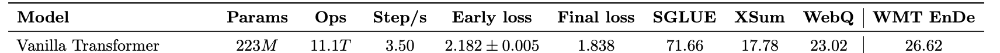


---

## Slide 18


### 讲解

在简化的道路上，现代 Transformer 更进一步：**全面丢弃偏置项（Dropping bias terms）**。
在原始的 Transformer 块中，所有的线性变换都有偏置项：
```math
y = xW + b
```
而在前馈网络中也是如此：$`\text{FFN}(x) = \sigma(xW_1 + b_1)W_2 + b_2`$。

但在以 LLaMA、PaLM 为代表的现代 Transformer 中，绝大多数模型都选择将所有线性层中的偏置项 $`b`$ 以及 LayerNorm/RMSNorm 中的偏置 $`\beta`$ 设为 None：
```math
y = xW
```
为什么我们要丢弃偏置项？
1. **节省内存与显存**：虽然偏置向量本身的参数量不大，但在分布式训练中，梯度和优化器状态（如 Adam 中的 $`m`$ 和 $`v`$）需要为每个偏置项分配显存，去掉它们可以减少显存碎片并小幅降低通信带宽需求。
2. **提升训练稳定性**：在极深的网络中，累积的偏置项可能会使激活值产生不期望的整体偏移（Offset），增加梯度爆炸或数值溢出的风险。因此，去掉偏置通常会让网络在大规模训练中更加稳健。

### 补充图片

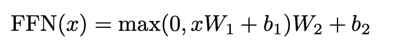

---

## Slide 19


### 讲解

本页是 **Normalization 部分的总结与回顾**（LayerNorm: recap）：
- **前置归一化（Pre-LN）是绝对共识**：没有人再将 Norm 放在主残差通道上。前置归一化的核心直觉是保持残差路径通畅，这能带来极佳的梯度传播性质，并消除了对极限 Warmup 的依赖。
- **第二层 Norm 崭露头角**：为了进一步增强超深模型的稳定性，部分模型在残差分支内部引入了双重归一化（Double Norm）。
- **RMSNorm 代替 LayerNorm**：由于舍弃了均值计算和偏置项，RMSNorm 减少了硬件层面的内存带宽瓶颈，实现了效率与效果的双赢。
- **全面无偏置（Bias-free）**：主流模型移除了几乎所有线性层和规范化层中的偏置，降低了显存开销，提升了大规模训练的稳定性。

# Part 2: 激活函数与前馈网络变体

## Slide 20


### 讲解

激活函数（Activation Functions）是神经网络引入非线性表征能力的核心组件。在 Transformer 的演进史上，前馈网络（FFN）子层中所使用的激活函数经历了一场令人瞩目的“物种大爆发”。

从最初简单的 ReLU，到 GPT 时代引入的 GeLU，再到如今几乎一统天下的 SwiGLU 及其各种门控变体（GLU family），各种激活函数在公式设计上层出不穷：ReLU、GeLU、Swish、ELU、GLU、GeGLU、ReGLU、SwiGLU 等。本节将详细探讨：这些激活函数究竟是什么？它们之间有何异同？它们对大模型的性能有何实际影响？我们又该如何做出合理的选择？

---

## Slide 21


### 讲解

我们首先来看最基础、最传统的两个激活函数：**ReLU** 与 **GELU**。

1. **ReLU (Rectified Linear Unit)**：
   ```math
   \text{ReLU}(x) = \max(0, x)
   ```
   前馈网络的形式为：
   ```math
   \text{FFN}_{\text{ReLU}}(x) = \max(0, xW_1)W_2
   ```
   作为深度学习中最经典的激活函数，ReLU 简单且计算高效。原始 Transformer 论文、T5、Gopher、Chinchilla 以及 Meta 的 OPT 等模型都选用了 ReLU 作为基准。然而，ReLU 在 $`x < 0`$ 时导数为 0，容易导致神经元“坏死”（Dying ReLU 问题）。

2. **GELU (Gaussian Error Linear Unit)**：
   ```math
   \text{GELU}(x) = x \Phi(x)
   ```
   其中 $`\Phi(x)`$ 是标准正态分布的累积分布函数（CDF）：
   ```math
   \Phi(x) = P(X \le x), \quad X \sim \mathcal{N}(0, 1)
   ```
   在实际工程中，GELU 通常使用如下的高精度近似公式来加速计算：
   ```math
   \text{GELU}(x) \approx 0.5x \left(1 + \tanh\left(\sqrt{\frac{2}{\pi}} \left(x + 0.044715 x^3\right)\right)\right)
   ```
   与 ReLU 在 0 处坚硬的“折角”不同，GELU 在 0 附近是平滑且非单调的。它将输入 $`x`$ 与其输入大小的概率分布相结合，直观上相当于对输入进行了随机的门控（Stochastic Gating）。
   - **使用 GELU 的模型**：GPT-1, GPT-2, GPT-3, GPT-J, GPT-NeoX, BLOOM。在 2020 年到 2022 年间，GELU 是最主流的选择。

### 补充图片

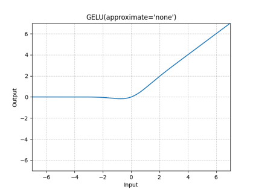
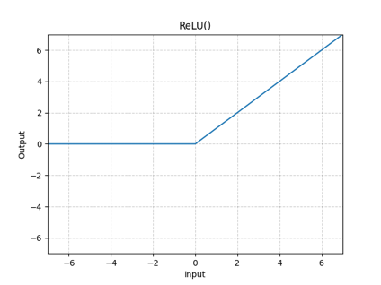

---

## Slide 22


### 讲解

既然“门控”的思想在激活函数中如此有效，那我们能否将其推而广之，应用到前馈网络的结构设计中？
Dauphin 等人在 2016 年提出了 **GLU (Gated Linear Units，门控线性单元)**。GLU 的核心思想是对 FFN 块的第一部分进行改造：不再是单纯的“线性变换 + 激活函数”，而是并行地进行两次线性变换，然后将其中一路的激活值作为“门控信号”，去逐元素相乘（Hadamard Product, $`\otimes`$）另一路通道：
```math
\text{GLU}(x) = (xW_1 + b) \otimes \sigma(xV + c)
```
其中 $`\sigma`$ 通常是 Sigmoid 激活函数，而 $`W_1`$ 和 $`V`$ 是两个独立的权重矩阵。

如果我们把这种门控结构与传统的激活函数结合，就可以得到一整套 **Gated Activation Units**：
- **ReGLU**（使用 ReLU 门控）：
  ```math
  \text{ReGLU}(x) = \left(\max(0, xW_1) \otimes xV\right) W_2
  ```
- **GeGLU**（使用 GELU 门控）：
  ```math
  \text{GeGLU}(x) = \left(\text{GELU}(xW_1) \otimes xV\right) W_2
  ```

在这种设计下，原本的线性映射被替换成了两个参数量相同（$`W_1`$ 和 $`V`$）的并行分支。这种双通道交互极大地增强了模型的非线性拟合能力。

---

## Slide 23


### 讲解

在众多门控变体中，当前最耀眼的明星当属 **SwiGLU**。
SwiGLU 使用了 **Swish** 激活函数（也常被称为 SiLU，即 $`x \cdot \text{sigmoid}(\beta x)`$，在 LLM 中通常取固定参数 $`\beta = 1`$）作为门控分支的激活函数：
```math
\text{Swish}(x) = x \cdot \text{sigmoid}(x) = \frac{x}{1 + e^{-x}}
```
由此衍生出的 SwiGLU 前馈网络结构为：
```math
\text{SwiGLU}(x) = \left(\text{Swish}(xW_1) \otimes xV\right) W_2
```

- **GeGLU 的代表模型**：T5 v1.1, mT5, LaMDA, Phi-3, Gemma-2/3/4 等谷歌系模型。
- **SwiGLU 的代表模型**：LLaMA-1/2/3, PaLM, Mistral, OLMo 等绝大多数 2023 年后发布的开源大模型。

> [!NOTE]
> **关于隐藏维度的重要调整**：
> 由于 GLU 引入了额外的分支矩阵 $`V`$，这使得 FFN 层的参数量直接翻了 1.5 倍（由原先的两个矩阵 $`W_1, W_2`$ 变为了三个矩阵 $`W_1, V, W_2`$）。
> 为了在保持模型总参数量和 FLOPs 与传统 FFN（隐藏维度为 $`4 \cdot d_{\text{model}}`$）相同的情况下进行公平对比，工程师们通常会**将 GLU 模型的隐藏层维度 $`d_{\text{ff}}`$ 缩小为原来的 $`\frac{2}{3}`$ 左右**（通常设为 $`\approx \frac{8}{3} \cdot d_{\text{model}}`$ 或更小）。

### 补充图片

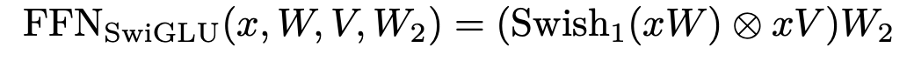
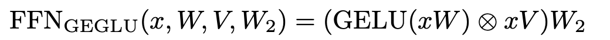

---

## Slide 24


### 讲解

**门控线性单元（GLU）真的能提升语言模型性能吗？**
答案是：**确实可以，而且非常稳定**。

本页引用了 Noam Shazeer 在 2020 年发表的经典论文 *"GLU Variants Improve Transformer"* 中的消融实验数据。实验在 T5-like 架构上进行，对比了传统 FFN 激活函数（如 ReLU、GELU、Swish）与门控变体（如 ReGLU、GeGLU、SwiGLU）的收敛速度和损失（Loss）。

图中的曲线清晰地展示了：在相同的训练步数和可比的计算资源下，所有使用门控变体（图中下方的虚线和实线）的模型的验证集 Loss 都显著低于非门控模型。这证明了门控机制对于建模自然语言中复杂的依赖关系具有天然的优势。

### 补充图片


---

## Slide 25


### 讲解

除了 Noam Shazeer 的开创性工作外，Narang 等人（2020）的消融实验也独立证实了这一结论。

在各种不同的 NLP 下游微调任务中，无论是 ReGLU 还是 GeGLU/SwiGLU，相比原始的 FFN 结构都取得了极其稳定的性能提升。尽管门控机制在底层的 PyTorch/CUDA 实现中需要多执行一次 Tensor 的乘法和切片操作，但由于性能增益明显且可以通过算子融合（Operator Fusion）消除额外的访存开销，它已成为现代大模型的必选组件。

### 补充图片

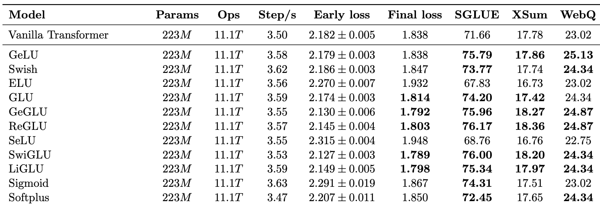

---

## Slide 26


### 讲解

总结当前激活函数的工业界现状：
- **门控结构是绝对的主流**：虽然 GPT-3 等老一代模型依赖经典的 GELU，但在现代开源社区，几乎很难见到不使用 SwiGLU 或 GeGLU 的新模型。
- **特立独行的例外**：尽管如此，依然存在一些有趣的“非主流”选择。例如，NVIDIA 的 Nemotron-340B 使用了 **Squared ReLU**（即 $`\max(0, x)^2`$）。Squared ReLU 曾在 Google 的 PaLM-2 中被用于提高特定算子的硬件友好度，但后续并没有在社区中大面积流行。
- **总而言之**：如果你要从头构建一个大语言模型，选用 **SwiGLU** 配合约 $`8/3 \cdot d_{\text{model}}`$ 的隐藏维度，是性价比最高且最不容易出错的安全牌。

---

## Slide 27


### 讲解

在讨论完 Normalization 和 FFN 内部的激活函数后，本页引入了一个极具启发性的架构设计：**串行模块与并行模块（Serial vs Parallel layers）**。

在标准的 Transformer 模块中，Attention 子层和 FFN 子层是以**串行（Serial）**的方式进行排列的。即数据先进入 Attention 计算，经过残差连接和归一化后，再进入 FFN 进行计算：
```math
x' = x + \text{Attention}(\text{LN}(x))
```
```math
x'' = x' + \text{FFN}(\text{LN}(x'))
```

那么，我们是否能够把这两个子层**并行化（Parallelize）**呢？也就是让它们并排摆放，同时输入相同的原始表征，最后统一进行残差相加：
```math
x' = x + \text{Attention}(\text{LN}_1(x)) + \text{FFN}(\text{LN}_2(x))
```

### 补充图片


---

## Slide 28


### 讲解

**并行架构（Parallel Layers）有什么好处？**
核心优势在于**计算效率与系统优化**：
1. **输入归一化共享**：由于 Attention 和 FFN 共享相同的输入，我们可以只计算一次 LayerNorm/RMSNorm（即令 $`\text{LN}_1 = \text{LN}_2`$），省去了一次归一化操作。
2. **算子融合与并行矩阵乘法**：最关键的是，在 GPU 计算中，Attention 里的投影矩阵（$`W_q, W_k, W_v`$）和 FFN 里的映射矩阵（如 SwiGLU 中的 $`W_1, V`$）可以合并成一个巨大的超大矩阵乘法（Fused GEMM）。这样可以极大提升 GPU 的 Tensor Core 利用率，并减少核函数启动（Kernel Launch）的延迟。

- **早期探索者**：GPT-J 率先尝试了这一结构。谷歌的 PaLM、EleutherAI 的 GPT-NeoX 随后也采用了并行设计。
- **最新趋势**：虽然很多经典模型（如 LLaMA 系列）依然保留了传统的串行设计，但在高吞吐、低延迟导向的生产模型中（如 Cohere Command-R/R+、Falcon-2 11B），并行设计正在重新流行。

### 补充图片


---

## Slide 29


### 讲解

本页对**前两部分（Architecture）进行了阶段性总结**：
- **前置还是后置归一化**：行业达成了 100% 的共识，即使用 Pre-LN，以确保梯度能够畅通无阻地流动，使得深层模型稳定收敛。
- **LayerNorm 还是 RMSNorm**：为了削减元素级操作对显存带宽的占用，RMSNorm 取得了明显的压倒性胜利。
- **门控结构（GLU）**：成为了前馈网络（FFN）的黄金标准。通过在门控分支使用 Swish/GELU，模型在相同计算量下能够获得更低的困惑度。
- **串行与并行结构**：虽然串行依然是多数模型的选择，但并行结构由于其极佳的硬件加速友好性（如共享 Norm、合并算子），在很多注重推理效率的生产模型中扮演着重要角色。

### 补充图片


# Part 3: 位置编码与外推技术

## Slide 30


### 讲解

在 Transformer 中，自注意力机制（Self-Attention）本身是置换等变（Permutation Equivariant）的。也就是说，如果我们不引入位置信息，模型将无法区分词语在句子中的先后顺序。因此，**位置编码（Position Embeddings）**是 Transformer 架构中必不可少的基础组件。

在过去的几年里，位置编码方案经历了显著的演进：
1. **正弦/余弦绝对位置编码（Sine/Cosine Absolute）**：原始 Transformer 使用的固定正弦曲线编码。
2. **可学习绝对位置编码（Learned Absolute）**：将每个位置（如 0 到 2047）视为一个可学习的向量，与 Token Embedding 直接相加。代表模型有 GPT-1、GPT-2、GPT-3 和 OPT。它的致命缺点是无法直接泛化到训练时未曾见过的更长序列。
3. **相对位置编码（Relative Position Embeddings）**：不显式向 Token 注入绝对位置，而是在计算 Attention 权重时，根据 Query 和 Key 的相对距离注入偏置。代表模型有 T5、Gopher 和 Chinchilla。
4. **旋转位置编码（RoPE, Rotary Position Embedding）**：2021 年由 Su 等人提出，通过旋转矩阵将绝对位置与相对注意力巧妙结合，目前已成为 LLaMA、PaLM、Qwen、Gemma 等几乎所有 2024 年后大模型的标准配置。

---

## Slide 31


### 讲解

**旋转位置编码（RoPE）的核心直觉是什么？**
我们希望设计一个映射函数 $`f(x, i)`$，它能将第 $`i`$ 个位置的向量 $`x`$ 进行编码。我们要求编码后的 Query 和 Key 进行内积计算时，其结果**仅取决于两者的相对距离 $`i - j`$**：
```math
\langle f(x_q, i), f(x_k, j) \rangle = g(x_q, x_k, i - j)
```

Su 等人提出，可以通过在二维空间中将向量旋转一个正比于位置 $`i`$ 的角度 $`\theta_i`$ 来满足这一性质。
在二维平面中，如果我们将向量旋转一个角度，内积的大小不会改变，但两个向量旋转角度的差值决定了它们的新夹角。因此，两个经过旋转的向量的内积，天然地就包含了它们旋转角度差（即相对距离 $`i - j`$）的信息。

### 补充图片

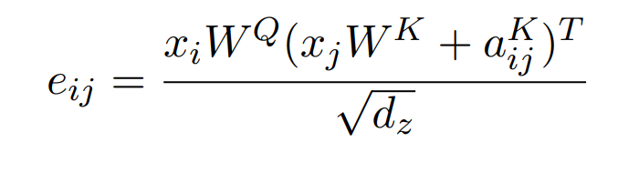

---

## Slide 32


### 讲解

在具体数学实现上，**RoPE 是如何工作的？**
对于一个 $`d`$ 维的隐藏层向量，我们将其两两分组，拆成 $`\frac{d}{2}`$ 个二维向量。对于每个二维向量，我们乘以一个旋转矩阵 $`R_{\Theta, i}^d`$：
```math
R_{\Theta, i}^d = \begin{pmatrix} \cos i\theta_1 & -\sin i\theta_1 \\ \sin i\theta_1 & \cos i\theta_1 \end{pmatrix}
```
其中 $`\theta_m = 10000^{-2(m-1)/d}`$。通过对这 $`\frac{d}{2}`$ 个二维平面分别进行角度为 $`i\theta_m`$ 的旋转，我们将位置 $`i`$ 编码进了高维空间中。

如果采用复数表示，这一过程可以极高雅地写为复数乘法：
```math
f(x, i) = x \cdot e^{i \theta_i}
```
而对应的注意力计算为：
```math
\langle f(x_q, i), f(x_k, j) \rangle = \text{Re} \left[ (x_q e^{i \theta_i}) (x_k e^{j \theta_j})^* \right] = \text{Re} \left[ x_q x_k^* e^{i\theta_i - j\theta_j} \right] = \text{Re} \left[ x_q x_k^* e^{(i-j)\theta_m} \right]
```

这表明，两个向量的注意力权重确实只与它们的相对距离 $`i-j`$ 相关。RoPE 的优势在于：
1. 它将绝对位置编码的简便性（可以直接应用于 Query/Key 投影之后）与相对位置编码的泛化性完美融合。
2. 它在计算中不需要像传统相对位置编码那样去查一个巨大的相对位置偏差表，对 GPU 上算子融合和高效求导非常友好。

---

## Slide 33


### 讲解

另一个备受瞩目的相对位置编码方案是 **ALiBi (Attention with Linear Biases)**，由 Press 等人在 2022 年提出。
ALiBi 的设计哲学是“**Train Short, Test Long**”（在短上下文上训练，在长上下文上测试与外推）。与 RoPE 不同，ALiBi 甚至不修改 Query 和 Key 本身的值，而是直接在自注意力机制的 Softmax 输入（Logits）上施加一个与相对距离成正比的负向线性偏置：
```math
a_{i, j} = \frac{q_i k_j^T}{\sqrt{d}} - m \cdot |i - j|
```
其中 $`|i - j|`$ 是 Query $`i`$ 与 Key $`j`$ 之间的绝对距离，$`m`$ 是一个针对不同注意力头预先设定的非零缩放斜率（Slope）。对于 $`h`$ 个注意力头，第 $`i`$ 个头的斜率通常取 $`m = 2^{-8i/h}`$。

由于斜率 $`m`$ 随着距离的增加而对注意力权重产生线性的惩罚，模型能够自适应地学会更加关注局部上下文，同时保留远距离的信息。ALiBi 的主要优势在于其近乎完美的零样本外推能力（Zero-shot extrapolation）——用 2048 长度训练的模型可以直接在 8192 甚至更长长度上进行生成，而不会像绝对位置编码那样由于超出训练长度而导致输出彻底崩坏。

### 补充图片

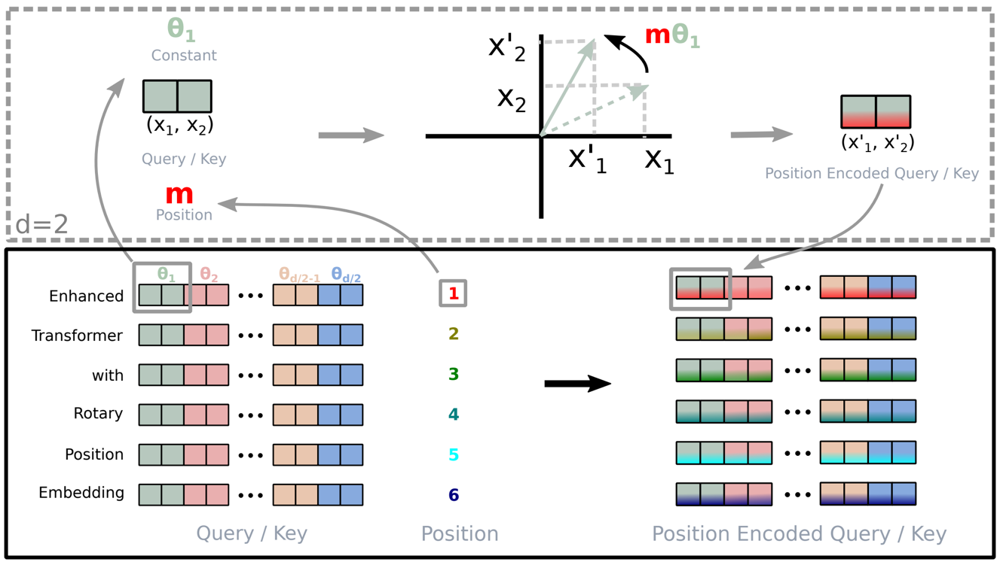


---

## Slide 34


### 讲解

**ALiBi 和 RoPE 的外推能力真的无懈可击吗？**
来自 Allen Institute for AI 的开源大模型项目 **OLMo (2024)** 给出了一组非常令人沮丧的真实评测消融数据。

从图中可以看出，尽管 ALiBi（图中绿色虚线）在短上下文外推时的表现略好于标准的 RoPE（蓝色虚线），但无论是 ALiBi 还是 RoPE，当测试序列长度显著超出预训练时设定的窗口大小（例如从 2K 外推到 4K 甚至 8K）时，两者的困惑度（Perplexity）都会出现急剧攀升（甚至直接发散到无穷大）。

这证明了：**在没有额外算法微调的前提下，单靠 RoPE 或 ALiBi 原始的数学公式，是无法实现真正高质量的长文本外推的。**

### 补充图片


---

## Slide 35


### 讲解

为了解决 RoPE 在超出预训练长度时的外推失效问题，研究者们提出了 **NTK-aware Scaled RoPE**。
其核心洞察在于：在 RoPE 中，高频维度（对应公式中较小的 $`\theta_m`$）旋转速度极快，编码的是局部细节位置；而低频维度旋转速度极慢，编码的是宏观的远距离相对位置。

如果模型在超出训练长度时表现变差，是因为如果直接将位置索引 $`i`$ 线性按比例缩小（即所谓的 Linear Scaling），会导致所有高频维度的信息被“模糊化”，模型丧失对近距离精细结构的分辨率。

NTK-aware 缩放则反其道而行之：它不对位置索引 $`i`$ 进行粗暴的线性缩放，而是**修改 RoPE 的基底（Base）**。通过将基底常数从 10000 提升到一个更大的数（例如 100000 或更大），从而等价地拉伸低频维度（拉长宏观位置的感受野），同时几乎不改变高频维度的旋转步长（保留局部微调精度）。这一巧妙的设计使得模型在不经过任何长文本微调的情况下，就能在外推后的长序列中依然保持极低的 PPL。

### 补充图片

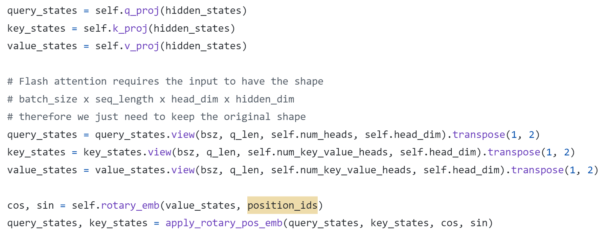

---

## Slide 36


### 讲解

一个更有意思的极端是：**NoPE（No Position Embedding，无位置编码）**。
我们真的需要位置编码吗？
在 2024 年的研究中（如 Kazemnejad 等人的论文），研究者发现：在某些混合架构（如交替使用滑动窗口注意力 SWA 和全局注意力）或包含因果掩码（Causal Masking）的模型中，即使**完全不添加任何位置编码**，模型依然能够通过因果注意力矩阵天然引入的下三角特征，隐式地学习到词语的顺序和局域性。

例如，在 Cohere 发布的 Command-A 模型中，部分注意力层就采用了 NoPE 的设计。NoPE 能够让模型在极长上下文生成时，完全摆脱由于位置编码越界而带来的数值溢出或分布漂移，是一种值得关注的前沿探索。

---

## Slide 37


### 讲解

本页是 **Position Embeddings 部分的总结与回顾**：
- **ALiBi 逐渐淡出主流**：虽然它在短序列训练、长序列推理上展示了惊艳的启发式外推性质，但由于在真实的大规模评测中，其外推极限依然受限，且在极长文本中性能衰减明显，当前大模型几乎不再采用它。
- **RoPE 是绝对的行业统治者**：通过引入 NTK-aware、YaRN 以及 RoPE-scaling 等插值扩展技术，RoPE 已经能够极其平稳地支持百万（1M+）级别的超长上下文，是构建现代 LLM 的不二之选。
- **NoPE 的启示**：无位置编码方案在特定混合注意力模型中表现良好，这启示我们注意力掩码（Mask）和模型本身可能蕴含着比我们想象中更强的隐式位置建模能力。


# Part 4: 超参数与缩放选择

## Slide 38


### 讲解

在大语言模型的预训练实践中，选择合适的超参数至关重要。令人惊讶的是，尽管各大模型团队各自为战，但在经过数年的实践后，他们在很多核心超参数上达成了高度的**行业共识**。

第一个高度共识的超参数是 **前馈网络维度比例（`ff_dim` to `d_model` ratio）**。
在标准的 Transformer 中，`ff_dim`（即前馈网络隐藏层维度 $`d_{\text{ff}}`$）与 `d_model`（模型隐藏维度）的比例通常固定为 **4 倍**（即 $`d_{\text{ff}} = 4 \cdot d_{\text{model}}`$）。对于使用门控线性单元（GLU，如 SwiGLU）的模型，由于引入了第三个矩阵，为了保持参数量一致，该比例通常调整为 **$`\frac{8}{3} \approx 2.67`$ 倍**（即 $`d_{\text{ff}} = 2.67 \cdot d_{\text{model}}`$）。

当然，历史上也存在一些有趣的“特立独行者”。例如，早期的 Google T5 (11B) 模型，其 $`d_{\text{model}} = 1024`$，但 $`d_{\text{ff}}`$ 却达到了惊人的 $`65536`$，相当于 **64 倍**的超大比例。而最近的一些模型如 Gemma 2 则反其道而行之，使用了 **8 倍** 的超宽 FFN 比例；SmolLM 和 Gemma 3/4 在使用 GLU 的情况下也探索了 4 倍的比例。

---

## Slide 39


### 讲解

**为什么大家都默认选择 4 倍（或者 GLU 下的 2.67 倍）作为黄金比例呢？**
本页引用了 OpenAI 关于缩放定律的奠基性论文 Kaplan et al. (2020) 中的实验数据。

图表展示了在固定模型总计算量（Compute budget）的前提下，调整不同超参数对语言模型验证集 Loss 的影响。横轴是 $`d_{\text{ff}} / d_{\text{model}}`$ 的比例，纵轴是损失。

从曲线可以看出，Loss 的低谷（即性能最优区间）形成了一个非常宽泛的“盆地”（Basin），这个盆地基本落在 **1 到 10** 之间。在这个区间内，Loss 的差别微乎其微。既然 4 倍（或 2.67 倍）刚好处于这个盆地的中心，且在矩阵运算的维度对齐和硬件优化（如 NVIDIA Tensor Core 喜好的 8/16/32 对齐）上最为方便，它自然就成为了行业约定俗成的最安全选择。

### 补充图片

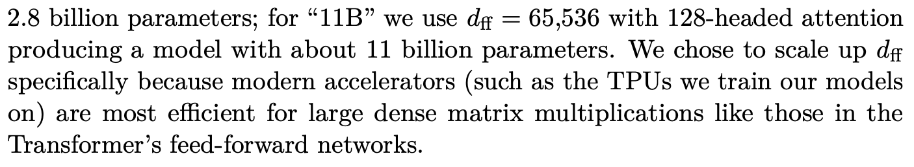

---

## Slide 40


### 讲解

本页继续深入探讨 T5 (11B) 这一特例。
T5 (11B) 采用的 $`d_{\text{ff}} = 65,536`$, $`d_{\text{model}} = 1024`$（64倍比例）在计算上存在极其严重的瓶颈。
在深度神经网络的并行计算中，极宽的前馈网络会导致以下问题：
1. **显存占用剧增**：第一层激活值维度太大，导致反向传播时需要缓存的中间状态（Activations）占据大量显存。
2. **系统并行化困难**：当采用张量并行（Tensor Parallelism）切分线性层时，过大的隐藏维度会大幅增加多卡之间 All-Reduce 通信的负担。

因此，极端的超参数比例在实际工程中是极其低效的。

### 补充图片

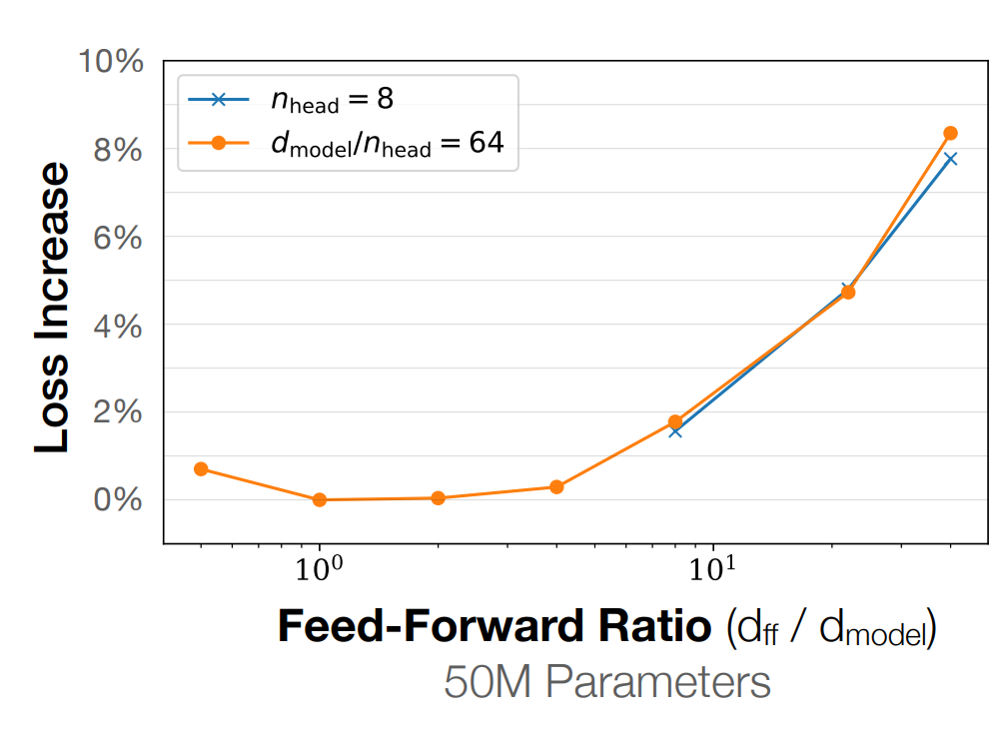

---

## Slide 41


### 讲解

从 `model-dim` 与 FFN 维度的比例中，我们可以学到什么？
- **默认选择非常鲁棒**：经典的 $`d_{\text{ff}} = 4 \cdot d_{\text{model}}`$ 和 GLU 下的 $`d_{\text{ff}} = 2.67 \cdot d_{\text{model}}`$ 在绝大多数情况下都是近乎最优的。
- **极端设计的黄昏**：T5 团队在后续改进的 T5 v1.1 版本中，果断抛弃了原先 64 倍的奇葩设计，回归到了配合 GeGLU 的标准 2.5 倍至 2.67 倍比例。这用事实证明，过大的偏离不仅无法带来性能收益，反而会给工程实现带来极大的灾难。

---

## Slide 42


### 讲解

第二个达成高度共识的超参数是 **多头注意力头维度之和与模型隐藏维度的比例（`head_dim * num_heads` to `d_model` ratio）**。
在原始的 Multi-Head Attention (MHA) 设计中，我们有 $`h`$ 个注意力头，每个头的维度为 $`d_{\text{head}}`$（通常为 64 或 128）。几乎所有的现代大模型都会严格遵循以下恒等式：
```math
d_{\text{head}} \times h = d_{\text{model}}
```
这意味着，多头注意力投影后的特征拼接起来，其维度刚好等于模型的主隐藏维度，两者的比例为 **1**。

如图所示，这保证了自注意力子层的输入和输出通道数一致，使得特征在经过多头机制分流后，能够完美地与残差路径进行对齐和融合，无需额外的线性投影层来转换维度。

### 补充图片


---

## Slide 43


### 讲解

本页给出了具体模型的参数对比表格：

| 模型 | 注意力头数 $`h`$ | 单头维度 $`d_{\text{head}}`$ | 模型隐藏维度 $`d_{\text{model}}`$ | 比例（Ratio） |
| :--- | :---: | :---: | :---: | :---: |
| **GPT-3** | 96 | 128 | 12288 | 1.0 |
| **T5 (11B)** | 128 | 128 | 1024 | 16.0 |
| **T5 v1.1** | 64 | 64 | 4096 | 1.0 |
| **LaMDA** | 128 | 128 | 8192 | 2.0 |
| **PaLM** | 48 | 256 | 18432 | 1.48 |
| **LLaMA-2** | 64 | 128 | 8192 | 1.0 |

从表中可以看出，除了早期的 T5 以及谷歌的部分模型外，现在几乎所有顶尖模型（如 GPT-3, LLaMA-2 及其后续的 LLaMA-3）都死死地咬合在 **1.0** 的比例上。而单头维度 $`d_{\text{head}}`$ 也基本统一在 **128**（少部分为 64 或 256），因为 128 维非常符合 GPU 在执行 FlashAttention 等矩阵乘法算子时的对齐偏好。

---

## Slide 44


### 讲解

下一个令人深思的参数是模型的**宽高比/纵横比（Aspect Ratio）**，即模型的深度（层数 $`L`$）与宽度（模型隐藏维度 $`d_{\text{model}}`$）的关系。
面对相同的参数量预算，我们应当将模型设计得“深而窄”还是“浅而宽”？

我们来看看主流模型的实际选择：
- **较深的模型**（层数 $`>100`$）：
  - **BLOOM**：205 层
  - **T5 v1.1**：171 层
  - **PaLM**：156 层
  - **GPT-3 / OPT / Qwen / OLMo-3**：128 层
  - **LLaMA / LLaMA-2**：102 层
- **较浅的模型**（层数 $`<100`$）：
  - **Gemma 3**：87 层
  - **Gemma 4**：61 层
  - **T5 (11B)**：33 层

那么，到底哪一种设计是性能和计算的“甜点”（Sweet spot）？

---

## Slide 45


### 讲解

在做决策时，必须权衡**系统和硬件层面的考虑**。
正如 Tay 等人在 2021 年发表的 *"Scale Efficiently"* 论文所指出的：**极深的模型在实际并行训练和推理中极其低效，延迟（Latency）非常高**。

1. **流水线并行（Pipeline Parallelism）限制**：当模型层数极深时，如果我们采用流水线并行将不同层分配到不同 GPU 上，由于不同 GPU 之间的前向传播和反向传播存在串行依赖，会导致严重的流水线气泡（Pipeline Bubble），降低 GPU 的整体利用率。
2. **推理延迟**：在自回归解码（Generation）阶段，每生成一个 Token 都需要完整通过所有的层。层数越深，意味着自回归循环的串行步数越多，即使单层计算很快，累积的内核启动延迟也会导致推理响应变慢。
3. **梯度消失与稳定性**：尽管有 Pre-LN 保护，过深的网络依然更容易在训练后期出现特征范数失控。

因此，现代大模型在层数设计上达成了一种妥协，大部分大模型都把层数限制在 **100 到 200** 之间。

### 补充图片

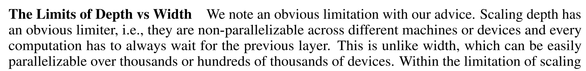
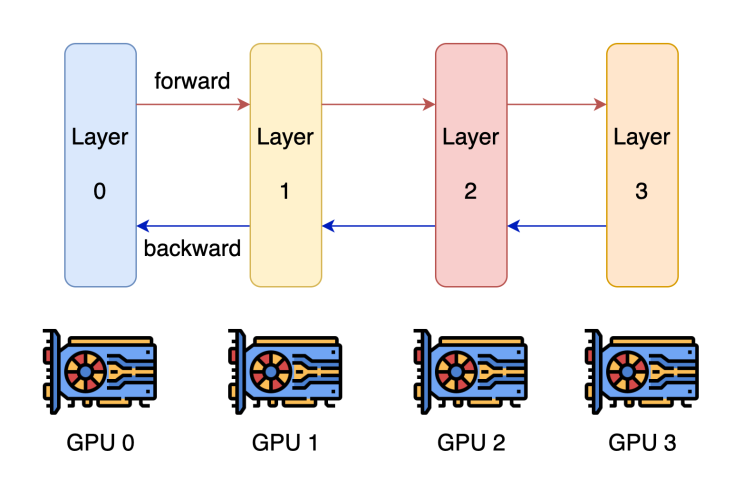

---

## Slide 46


### 讲解

本页进一步展示了 Kaplan 等人（2020）和 Tay 等人（2021）关于模型宽高比缩放的实验数据。

结果表明，在理论上，只要宽高比处于一个合理的范围内，模型的验证集 Loss 变化并不大。然而，如果为了追求模型性能而把模型设计得过深（例如层数接近 300），其实际运行速度（Runtime speed / throughput）会因为硬件瓶颈而急剧下降。因此，工程上的最优解往往偏向于“适当宽、适度深”的平衡结构。

### 补充图片


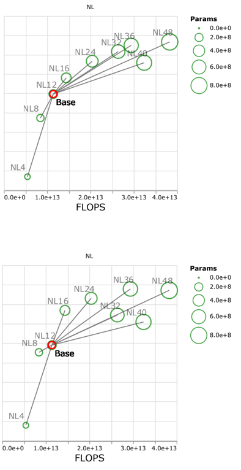


---

## Slide 47


### 讲解

另一个直接影响大模型参数量和计算开销的参数是 **词表大小（Vocabulary Size）**。
不同模型在词表大小的选择上分化极其严重：

1. **单语言/早期模型**（词表较小，约 30k - 50k）：
   - **原始 Transformer**：37,000
   - **GPT-2 / GPT-3**：50,257
   - **T5**：32,128
   - **LLaMA-1 / LLaMA-2**：32,000
2. **多语言/现代生产模型**（词表极大，约 100k - 250k+）：
   - **mT5**：250,000
   - **PaLM**：256,000
   - **GPT-4**：100,276
   - **Gemma 4**：262,144
   - **Qwen-15B**：152,064
   - **LLaMA-3**：128,256

**为什么现代模型的词表越来越大？**
大词表可以压缩输入文本的 Token 长度（即一个 Token 能代表更多的字符/单词）。这在多语言场景下尤为明显，能极大减少推理时需要处理的上下文长度。
然而，大词表意味着模型的 **Embedding 矩阵和输出投影矩阵（LM Head）** 变得巨大。在小参数模型中，过大的词表会“窃取”本应属于 Transformer 层（代表逻辑表征能力）的参数。因此，词表大小也是一个需要精心平衡的超参数。

---

## Slide 48


### 讲解

接下来探讨正则化策略：**我们在预训练大语言模型时，真的需要 Dropout 等正则化手段吗？**

传统的深度学习经验告诉我们，为了防止模型过拟合，应该在网络中加入 Dropout。但在大语言模型预训练阶段，情况发生了变化：
- **数据海量**：现代 LLM 预训练动辄使用数万亿（Trillions）的 Token。相较之下，模型的参数量（如 7B, 13B）远远小于数据量。
- **单单单次遍历（Single-pass）**：在大模型训练中，我们几乎总是只对预训练语料进行单次遍历（Single epoch）。模型几乎没有机会反复看到相同的数据，因此几乎不可能在预训练阶段产生过拟合（Memorization）。

既然没有过拟合风险，Dropout 是否还有存在的必要？

---

## Slide 49


### 讲解

本页给出了各大主流模型在**预训练中是否使用 Dropout 和权重衰减（Weight Decay）** 的实际配置对比：

| 模型 | 预训练 Dropout | 权重衰减（Weight Decay） |
| :--- | :---: | :---: |
| **Original Transformer** | 0.1 | 0.0 |
| **GPT-2 / GPT-3** | 0.1 | 0.1 |
| **T5** | 0.1 | 0.0 |
| **T5 v1.1 / PaLM / LLaMA**| **0.0** | **0.1** |
| **Qwen-14B** | 0.1 | 0.1 |

我们可以清晰地看到一条演进分水岭：**较新的顶尖模型（如 PaLM、LLaMA 系列）在预训练时都果断将 Dropout 设为了 0.0，而仅保留 0.1 的权重衰减**。
在极大规模的训练中，Dropout 不仅由于引入随机性而导致模型收敛变慢、损失偏高，还会破坏算子融合（因为需要保存额外的随机掩码以用于反向传播），严重降低 GPU 训练吞吐量。因此，**预训练不加 Dropout 已成共识**。

---

## Slide 50


### 讲解

既然大模型不会过拟合，且我们去掉了 Dropout，那么**为什么还要在预训练中加入权重衰减（Weight Decay）呢？**
根据 Andriushchenko 等人 2023 年发表的 *"SGD with Weight Decay in Deep Learning"* 等最新研究，大模型中的 Weight Decay 已经不再是为了传统的“防止过拟合”，而是为了**调控优化器的训练动力学（Optimization Dynamics）**。

在大模型使用的 Cosine 学习率退火衰减过程中，Weight Decay 与学习率（LR）之间存在着微妙的耦合作用。权重衰减能够防止模型权重范数（Norm）在训练过程中无节制地膨胀，从而确保参数梯度不会随着迭代步数增加而变得过小。这能使得梯度更新在整个漫长的预训练周期中始终保持高效的激活状态。

### 补充图片

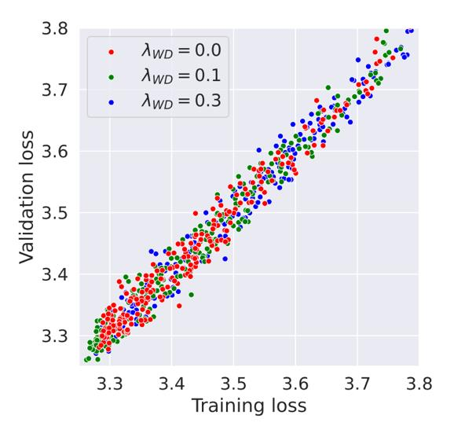
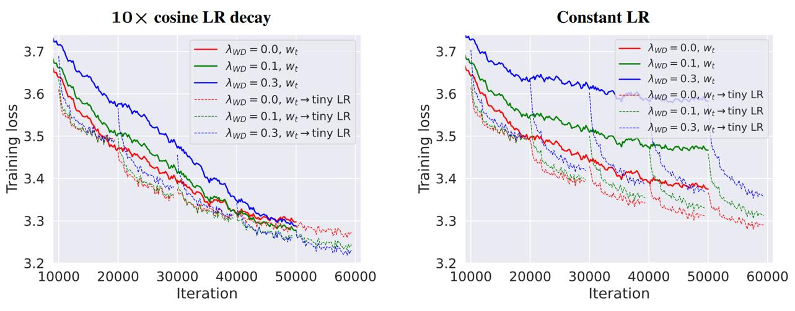

---

## Slide 51


### 讲解

本页是 **Hyperparameters 部分的总结与回顾**：
- **前馈网络比例**：4 倍比例（GLU 为 2.67 倍）是最安全、最稳健的行业共识。
- **注意力头对齐**：$`d_{\text{head}} \times h = d_{\text{model}}`$ 的比例基本锁定在 1.0 左右。
- **宽高比**：系统和通信延迟限制了模型的最大深度，100-200 层是当前的最佳平衡点。
- **正则化变迁**：大模型预训练抛弃了 Dropout，转而仅使用 Weight Decay。其核心目标已经从“防过拟合”演变成了“稳定和优化训练动力学”。

### 补充图片

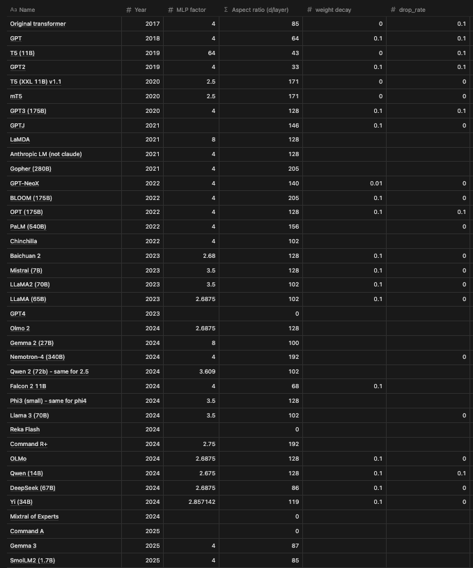


# Part 5: 训练稳定性技巧

## Slide 52


### 讲解

在大模型预训练的工程实践中，**训练稳定性（Training Stability）**甚至比架构微调更让工程师抓狂。在成百上千张 GPU 组成的集群上持续训练数周，最令人沮丧的莫过于突然看到 Loss 暴涨（Loss Spike）或直接溢出变为 NaN（如蓝色曲线所示）。

一旦发生 Loss 暴涨，工程师就必须回滚到上一个 Checkpoint，微调超参数或者剔除有毒数据，这会浪费极大的算力和宝贵的时间。因此，寻找能够保证大模型在超大规模、长周期训练下保持稳定的“稳流器”成为了学术界和工业界共同的研究热点。

### 补充图片

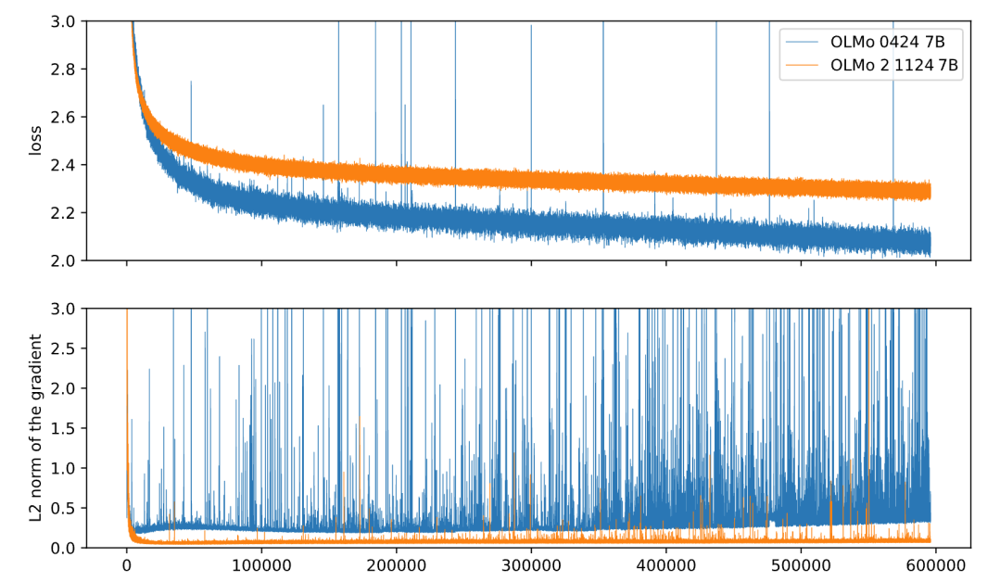

---

## Slide 53


### 讲解

**不稳定性到底来自哪里？答案是：Softmax 算子！**
在大模型架构中，有两个地方用到了 Softmax：
1. **注意力机制中的 Softmax**：$`\text{softmax}\left(\frac{QK^T}{\sqrt{d}}\right)`$
2. **输出预测层的 Softmax**：$`\text{softmax}(xW_{\text{vocab}})`$

Softmax 本身包含指数函数（Exponentiation）和除法：
```math
\text{softmax}(x)_i = \frac{e^{x_i}}{\sum_j e^{x_j}}
```
如果输入 $`x`$ 的数值（Logits）过大，由于指数爆炸效应，极易在硬件（尤其是使用 FP16 半精度训练时）上产生数值溢出。

更糟糕的是，如果某个注意力的 Query 和 Key 投影向量的幅度在训练中不断膨胀，其点积 $`QK^T`$ 的值也会跟着变大。当 Logits 的最大值与其它值差距过大时，Softmax 的输出会发生“熵坍缩”（Entropy Collapse）——即注意力概率几乎完全集中在某一个 Token 上，输出退化为 One-hot 向量。此时，Softmax 的导数会趋近于 0，但瞬间产生的数值截断和特征跳变会导致反向传播时出现巨大的“梯度尖峰”（Gradient Spikes），彻底毁掉优化器的稳定更新轨迹。

### 补充图片


---

## Slide 54


### 讲解

为了解决模型最终输出层 Softmax 的不稳定性，谷歌在 PaLM 模型中引入了 **z-loss（或称 $`\log^2 Z`$ 辅助损失）**。
标准的交叉熵损失为：
```math
\mathcal{L}_{\text{CE}} = -\log \left( \frac{e^{x_{y}}}{\sum_j e^{x_j}} \right) = -x_{y} + \log Z
```
其中 $`Z = \sum_j e^{x_j}`$ 是 Softmax 的分母（配分函数 Partition Function）。

z-loss 的做法是：在原有的交叉熵损失函数中，添加一项惩罚项（由分母的对数平方组成），并乘以一个极小的系数 $`\alpha`$（通常取 $`10^{-4}`$ 到 $`10^{-5}`$）：
```math
\mathcal{L} = \mathcal{L}_{\text{CE}} + \alpha \log^2 Z
```

**z-loss 的直觉是什么？**
它直接惩罚了过大的分母 $`\log Z`$。为了让辅助损失变小，模型在训练时会被迫将最终输出的 Logits（即 $`x_i`$）限制在一个靠近 0 的合理数值区间内，防止它们的绝对值随着训练不断漂移和变大。
- **代表模型**：PaLM 系列、Baichuan-2、DCLM、OLMo-2/3 等。实践表明，这一项辅助损失对于防止几十 B 级别以上的超大模型在训练中后期的崩盘有立竿见影的效果。

### 补充图片

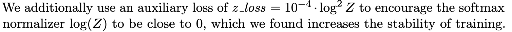
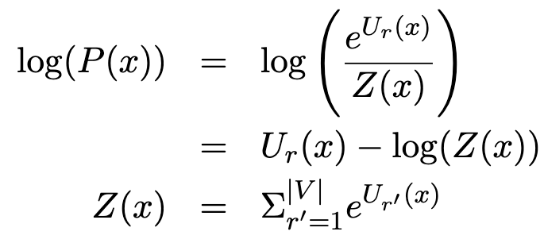
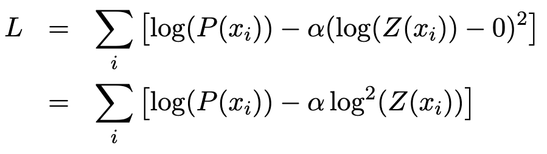

---

## Slide 55


### 讲解

对于注意力机制内部 Softmax 的稳定性问题，目前主流的解决方案是 **QK-Norm (Query-Key Normalization)**。
在标准的注意力机制中，Query 和 Key 在投影后直接计算点积。而在 QK-Norm 中，Query 和 Key 在进行点积前，会先分别通过一个归一化层（通常是 RMSNorm）：
```math
\text{Attention}(Q, K, V) = \text{softmax}\left( \frac{\text{RMSNorm}(Q) \cdot \text{RMSNorm}(K)^T}{\sqrt{d_{\text{head}}}} \right) V
```

这一方案最早由 Dehghani 等人在 2023 年的多模态大模型（如 ViT-22B）中采用，因为多模态训练混杂了图像和文本特征，极易导致注意力点积失控。
由于直接对 Q 和 K 进行了归一化，它们的特征范数被强制限定在 $`\approx \sqrt{d_{\text{head}}}`$ 附近，这使得计算出来的自注意力 Logits 永远不会无限制地膨胀，从而从根本上杜绝了注意力 Softmax 的熵坍缩和不稳定性。
- **代表模型**：DCLM、OLMo-2/3、Gemma-2/3/4、Qwen-3 等。随着 2024-2025 年多模态和百 B 稠密模型的普及，QK-Norm 已逐步成为现代大模型的标配。

### 补充图片


---

## Slide 56

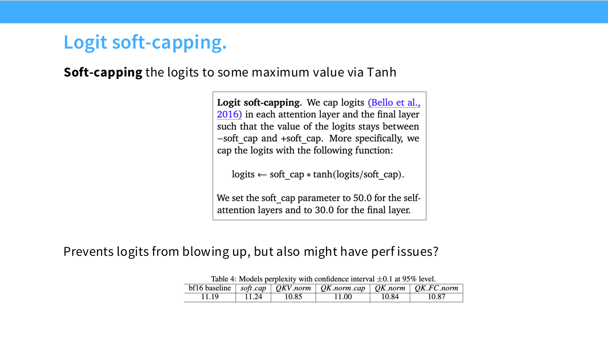

### 讲解

另一个非常简单粗暴但效果显著的技巧是 **Logit Soft-capping（Logit 软截断）**。
这一方法在谷歌的 Gemma 2 模型中被大量推广。其核心思想是：与其眼睁睁看着 Logits 变大并引发溢出，不如在计算 Softmax 之前，强行用一个双曲正切函数（Tanh）将 Logits 限制在一定的上下界 $`[-C, C]`$ 之间：
```math
\text{logits}_{\text{capped}} = C \cdot \tanh\left( \frac{\text{logits}}{C} \right)
```
其中 $`C`$ 是预先设定的阈值。例如，Gemma 2 将注意力机制的 Logits 阈值设为 $`C = 50.0`$，而将最终输出的 Vocabulary Logits 阈值设为 $`C = 30.0`$。

因为 $`\tanh(x)`$ 的值域被严格限制在 $`[-1, 1]`$ 内，经过 $`C`$ 乘积后，Logits 的值绝对不会超过 $`[-C, C]`$。即使未经过归一化的输入极大，经过软截断后也会平滑地渐近于 $`C`$ 或 $`-C`$，而不会像硬截断（Hard Clamping）那样在边界处引入不连续的导数。

> [!WARNING]
> **软截断的代价**：
> Tanh 算子在 GPU 上的计算开销相对较高，如果对所有注意力层和 Vocabulary 层的每一个元素都频繁调用 Tanh，会对推理和训练的速度（Througput）产生一定的负面影响。因此，在使用时需要权衡数值安全性与算子效率。

### 补充图片

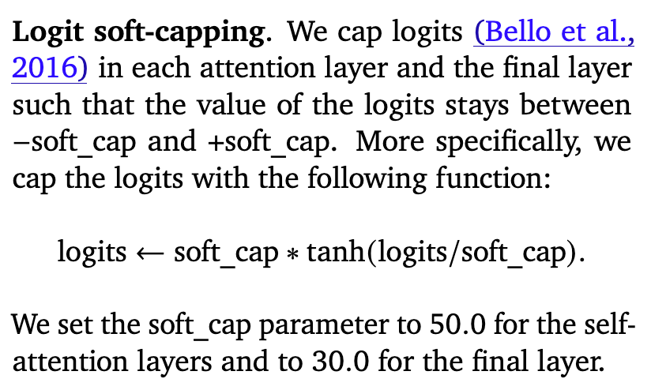
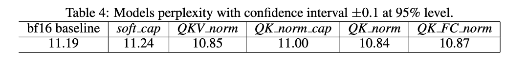


# Part 6: 注意力头变体与推理优化

## Slide 57

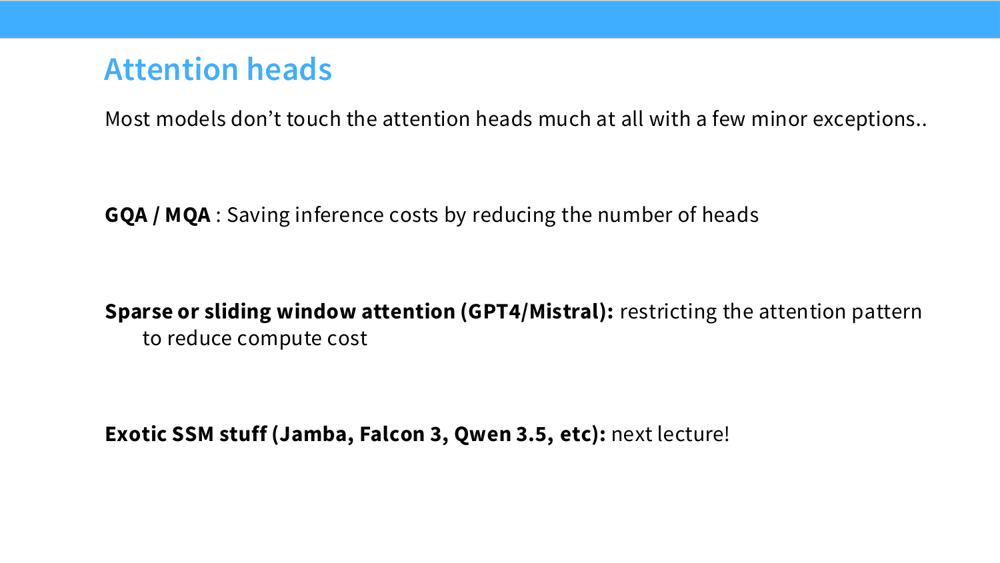

### 讲解

尽管注意力机制（Self-Attention）是 Transformer 的皇冠，但在大规模实际推理部署中，它遇到了一个极其棘手的物理限制——**推理带宽瓶颈与 KV Cache 开销**。

本节将探讨为了降低推理成本、提高并发吞吐量而设计的注意力头变体。主要的优化方向包括：
1. **多查询注意力（MQA, Multi-Query Attention）**：极端压缩 Key 和 Value 的头数，使其在所有查询头之间共享。
2. **分组查询注意力（GQA, Grouped-Query Attention）**：介于 MHA 和 MQA 之间的折衷方案，将查询头分组，每组共享一对 KV 头。
3. **稀疏/滑动窗口注意力（Sparse/Sliding Window Attention）**：限制注意力作用范围，从二次方复杂度降为线性。
4. **混合/交错注意力（Interleaved Attention）**：交替使用全局注意力和滑动窗口注意力，实现效果与效率的最佳平衡。

---

## Slide 58

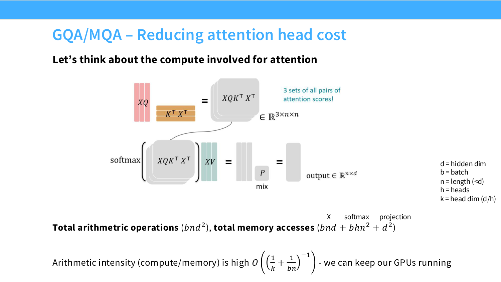

### 讲解

为了理解为什么需要 MQA/GQA，我们首先要分析自回归生成（Autoregressive Generation）时的**算术强度（Arithmetic Intensity）**。

在预训练（前向传播与反向传播）阶段，由于输入的是整个完整的序列（Parallel Processing），我们可以将数据打包成大规模的矩阵乘法，这非常契合 GPU 的计算架构，属于**计算受限（Compute-bound）**任务。

然而，在自回归推理（Generation）阶段，模型必须根据已有序列**一个 Token 一个 Token 地**往后预测。在生成第 $`t`$ 个 Token 时，我们需要计算当前 Query 与之前所有 Token 的 Key 之间的注意力权重，并与相应的 Value 结合。
- **算术运算量（FLOPs）**：每个 Token 的运算量为 $`O(bnd^2)`$，其中 $`b`$ 是 Batch size，$`n`$ 是当前序列长度，$`d`$ 是模型隐藏维度。
- **内存访问量（Memory Accesses）**：我们需要从全局显存中读取之前的每一层的所有 Key 和 Value。总访存开销为 $`O(bnd + bhn^2 + d^2)`$。

这使得自回归推理成为了一个极度**内存带宽受限（Memory-bandwidth bound）**的任务。GPU 的大部分时间都花在了“等待 KV 矩阵从全局显存加载到寄存器中”，而算术计算单元（ALU）则大量处于闲置状态。

### 补充图片

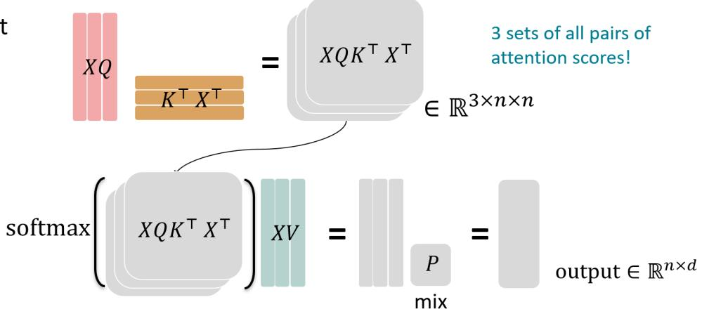

---

## Slide 59

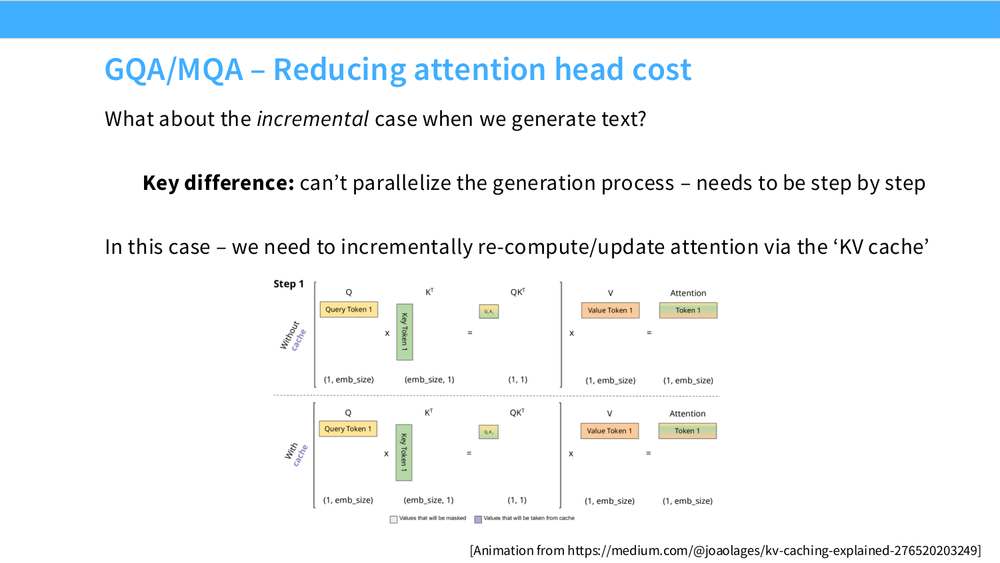

### 讲解

**自回归生成的增量更新（Incremental case）**。
为了避免在生成每个新 Token 时都重新计算历史 Token 的 Key 和 Value，现代推理引擎（如 vLLM）使用了一种名为 **KV Cache** 的缓存技术。

如图所示，每次生成一个新 Token 时，我们只为当前这一个 Token 计算 $`q_t, k_t, v_t`$。然后，我们将新计算出的 $`k_t`$ 和 $`v_t`$ 拼接到之前的 KV Cache 中：
```math
\text{KV\_Cache}_{t} = \text{Concat}(\text{KV\_Cache}_{t-1}, [k_t, v_t])
```

这样，虽然我们在每次迭代中避免了重复的 Matmul 运算，但为了计算自注意力，我们每次都必须将所有历史 Token 的 KV Cache 从 GPU 显存读取到 SRAM 中。随着序列长度 $`n`$ 的增长和 Batch Size $`b`$ 的增加，KV Cache 占用的内存空间以惊人的速度膨胀，成为了并发服务（Serving）的最大瓶颈。

### 补充图片

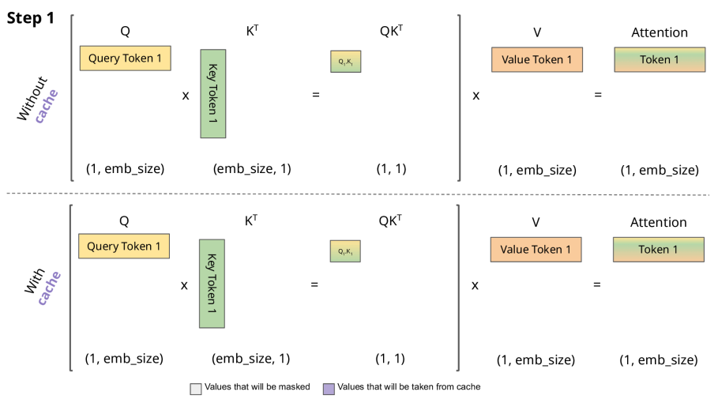

---

## Slide 60

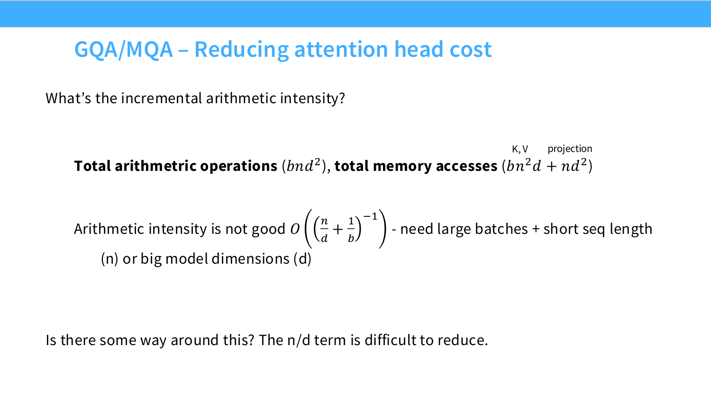

### 讲解

在增量生成阶段，随着 KV Cache 越来越大，其**算术强度急剧下降**。
对于每一个生成的 Token：
- 计算运算量约为 $`O(bd^2)`$。
- 访存开销则由于要加载完整的 KV Cache，正比于 $`O(bnd)`$（当序列非常长时，这一项甚至远大于参数权重本身的访存）。
因此，自回归推理的算术强度公式通常退化为：
```math
\text{Arithmetic Intensity} \approx O\left( \left( \frac{n}{d} + \frac{1}{b} \right)^{-1} \right)
```

为了让算术强度提高（即让 GPU 的 Tensor Core 跑满），我们必须使用超大的 Batch Size $`b`$ 或者极短的序列长度 $`n`$。但在高并发的生产环境中，大 Batch Size 会导致显存瞬间溢出（OOM），而超长序列则是用户的刚性需求。因此，减少 KV Cache 本身的大小是唯一的出路。

---

## Slide 61

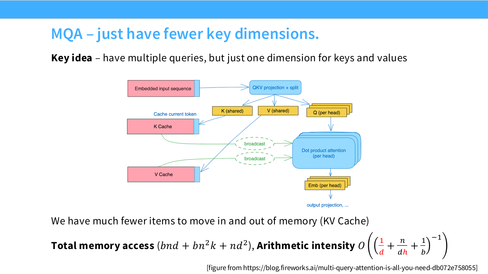

### 讲解

Noam Shazeer 在 2019 年提出了 **MQA (Multi-Query Attention)**。
其核心思想极其彻底：在多头注意力机制中，我们保持 Query 的头数不变（依然为 $`h_q`$ 个头），但是**将 Key 和 Value 的头数全部强行压缩为 1**（即 $`h_k = h_v = 1`$）。

这意味着，无论模型有多少个注意力头，在进行点积计算时，所有的 Query 头都共享同一对 Key 和 Value 矩阵。
- **KV Cache 缩减**：KV Cache 的显存占用直接缩小到了原来的 $`\frac{1}{h_q}`$（在 LLaMA 等模型中通常为 $`\frac{1}{32}`$ 或 $`\frac{1}{62}`$）。
- **访存带宽释放**：在自回归推理中，我们需要从全局显存读取的 KV 数据量暴跌了数十倍。这极大地提高了算术强度，允许我们在相同的显存限制下使用大得多的 Batch Size，从而让服务吞吐量获得数倍的跨越式提升。

### 补充图片


---

## Slide 62

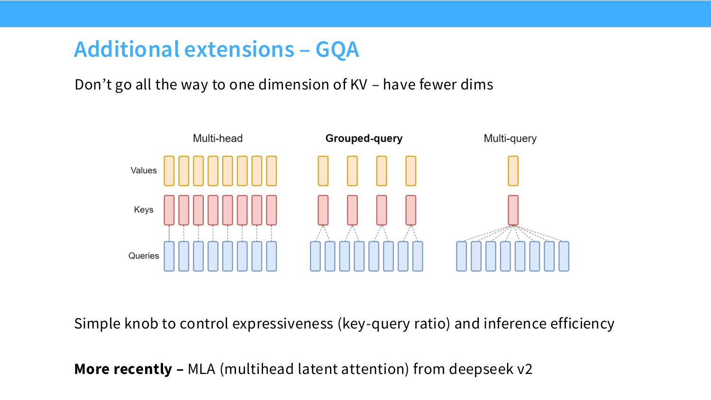

### 讲解

虽然 MQA 带来了极大的推理吞吐增益，但将所有的 KV 头强行压缩为 1，会导致模型提取不同空间维度特征的能力下降，引起模型困惑度（Perplexity）和表达能力的受损。

为了在“模型效果”与“推理效率”之间找到最佳平衡点，Ainslie 等人在 2023 年提出了 **GQA (Grouped-Query Attention，分组查询注意力)**。

GQA 引入了一个可以自由调节的分组常数 $`g`$：
我们将 $`h_q`$ 个 Query 头均匀分成 $`g`$ 个组。在每个组内，所有的 Query 头共享同一对 Key 和 Value 头。
- **MHA**（多头注意力）：每个 Query 拥有独立的 KV，相当于 $`g = h_q`$。
- **MQA**（多查询注意力）：所有 Query 共享一个 KV，相当于 $`g = 1`$。
- **GQA**（分组查询注意力）：目前主流的选择是令 $`g = 8`$（例如 LLaMA-3 和 Mistral 都是 8 个 KV 头对 32 或 64 个 Query 头），这意味着 KV Cache 减小为原来的 $`\frac{1}{4}`$ 或 $`\frac{1}{8}`$。这在几乎不损害模型表达能力的前提下，基本继承了 MQA 的大部分推理加速增益。

近年来，DeepSeek 等团队更进一步，提出了 **MLA (Multi-head Latent Attention)**，通过低秩投影（Low-rank Projection）将 KV 压缩进一个共享的隐空间，在推理时再动态解压，实现了甚至比 GQA 更极致的显存压缩与精度保持。

### 补充图片

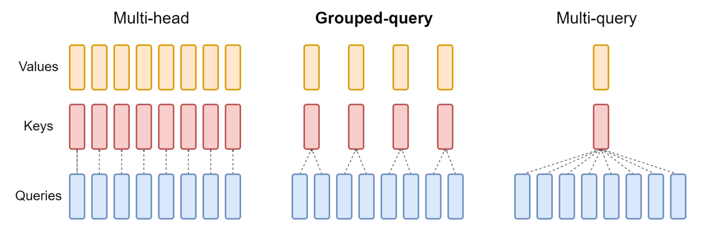

---

## Slide 63

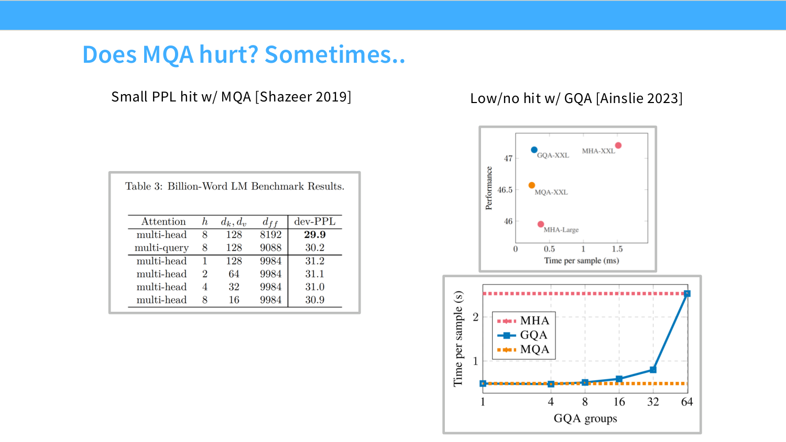

### 讲解

**MQA 和 GQA 会损害模型精度吗？**
本页引用了 Shazeer (2019) 和 Ainslie (2023) 论文中的实验评测图表。

左图展示了使用 MQA 对比标准 MHA 时，模型在不同任务上的困惑度变化。我们可以看到，使用 MQA 确实会在某些任务上带来轻微的困惑度上升（PPL 升高），这意味着模型表达能力存在微幅受损。

而右侧图表对比了 MHA、MQA 以及 GQA 的表现。结果表明，**GQA-8（图中橙色柱状图）几乎可以在所有评测指标上与标准的 MHA（蓝色柱状图）打平，而其推理吞吐量（Tokens/sec）却远超 MHA，近乎逼近 MQA 的极限**。这种“高性价比”的优秀表现，使得 GQA 迅速成为了 2024 年至今中大型语言模型的标准注意力架构。

### 补充图片


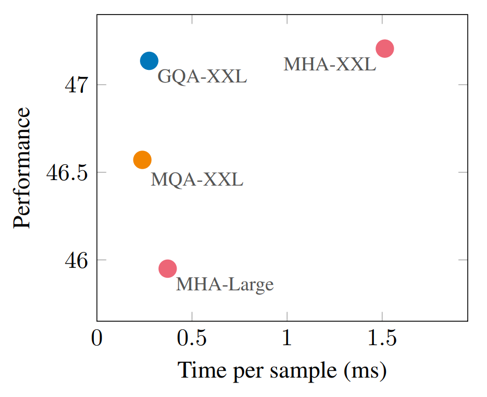

---

## Slide 64

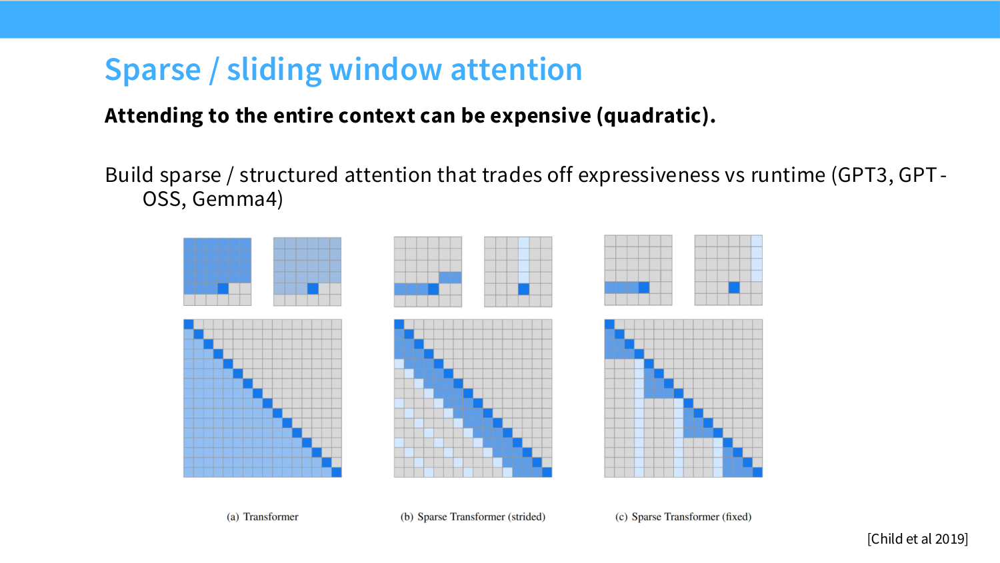

### 讲解

除了压缩通道数（MQA/GQA）外，另一个降低自注意力开销的经典维度是**空间稀疏化（Spatial Sparsity）**。
标准的自注意力需要计算所有 Token 之间的两两交互，计算复杂度和显存占用是序列长度的二次方（Quadratic, $`O(n^2)`$）。

**滑动窗口注意力（SWA, Sliding Window Attention / Local Attention）**通过设置一个窗口大小 $`w`$，规定每个 Token 只能关注自身及其左侧相邻的 $`w`$ 个 Token。
这样，注意力的计算范围被限制在对角线附近的一条窄带上，计算和显存复杂度直接降为了线性（Linear, $`O(n \cdot w)`$）。虽然单层只关注局部，但通过多层堆叠，上层网络依然能隐式地建立起远距离的感受野（Receptive Field）。
- **代表模型**：GPT-3 中的部分层、GPT-OSS、Mistral、Gemma 4 等。

### 补充图片


---

## Slide 65

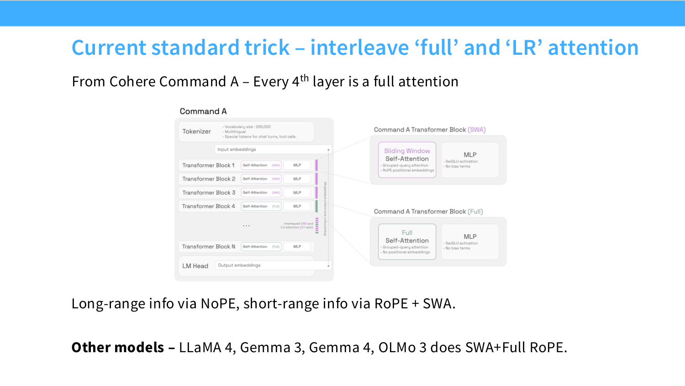

### 讲解

当前在大模型上下文设计上，一个极其流行的共识是 **交错使用全局自注意力和局部注意力（Interleave Full and Local/Sliding Window Attention）**。

在 Cohere Command-A 等模型的消融研究中，研究者发现：不需要每一层都计算全局自注意力。例如，我们可以**每 4 层设计 1 个全局注意力层（Full Attention），而其余 3 层全部使用计算开销极低的局部滑动窗口注意力（SWA）**。
- **长程信息流**：局部层负责快速提取邻近词语的局部语法和短语特征，而全局层则在关键节点上汇总长程信息。
- **位置编码搭配**：通常，全局层使用无位置编码（NoPE）或较长外推的 RoPE；而局部层则使用普通的 RoPE 配合滑动窗口。
- **代表模型**：LLaMA-4、Gemma-3/4、OLMo-3 等。这种设计在大规模预训练中表现出了惊人的性价比。

### 补充图片

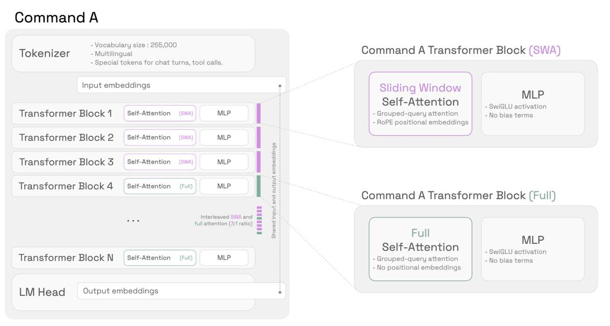

---

## Slide 66

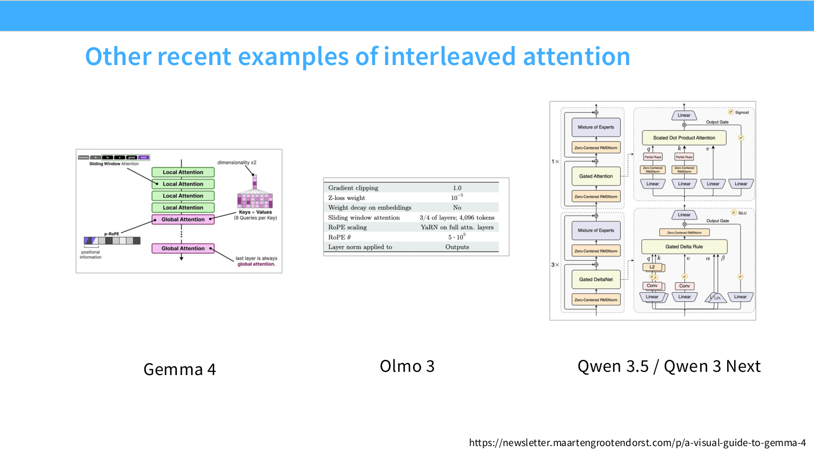

### 讲解

本页继续展示了交错注意力在最新顶尖模型中的应用实例，包括 Google Gemma 4、Allen Institute OLMo 3 以及阿里巴巴的 Qwen 3.5。

例如，Qwen 3.5 在其长文本版本中交替堆叠了全局自注意力层和滑动窗口层，这使得它不仅能够在 GPU 显存限制内轻松处理长达 128K 以上的上下文，还比全全局注意力的原生实现节省了近 50% 的推理阶段 KV Cache 开销。这证明了交错注意力不仅是学术界的新星，更是工业界落地大模型的重要工程武器。

### 补充图片


---

## Slide 67

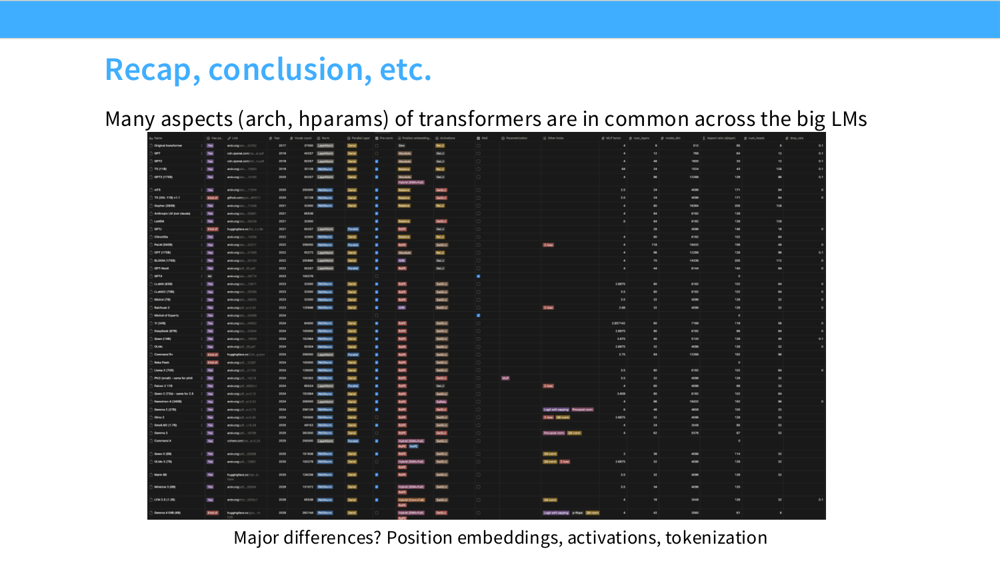

### 讲解

本页是对**整个第三讲的全文总结与回顾**（Recap, conclusion, etc.）：

1. **Transformer 架构已经高度趋同**：尽管市面上的 LLM 名字繁多，但底层在规范化位置（Pre-LN）、规范化层（RMSNorm）、无偏置项（Bias-free）等核心设计上已经达成了惊人的行业共识。
2. **最大的差异化在于三个维度**：
   - **位置嵌入（Position Embeddings）**：RoPE 是一统天下的方案，但各种外推插值技术依然在快速演进。
   - **激活函数（Activations）**：SwiGLU 及其门控变体（GLUs）是标配，隐藏维度通常做相应的缩减（如 2.67 倍）。
   - **分词器与分词策略（Tokenization）**：词表大小从 32k 演进到 100k+，极大影响了模型的跨语言表示效率和推理吞吐量。
3. **推理稳定性与推理性能的工程细节决定成败**：z-loss、QK-norm 和 Logit Soft-capping 保证了模型能跑完漫长的训练周期，而 MQA/GQA 和交错注意力则让模型在推理部署时具有低延迟与高吞吐的竞争优势。

这些看似细微的魔鬼细节，正是构建现代高性能大语言模型所必不可少的基石。

### 补充图片


