# Lecture 4: 注意力替代方案与混合专家模型 深度笔记

本笔记基于斯坦福 CS336 (Language Modeling from Scratch) 第四讲的课堂内容整理。在学习了 Transformer 的主流架构和超参数后，本讲将目光投向更前沿的两个领域：首先是**注意力的替代方案（Attention Alternatives）**，旨在解决注意力机制二次方复杂度的缺陷，涵盖线性注意力、状态空间模型（SSM）以及 Mamba 架构；其次是**混合专家模型（MoE, Mixture of Experts）**，这是一种实现“稀疏激活”的核心技术，能够大幅扩展模型容量而不成比例地增加计算开销。

> **课程信息**：CS336 · Spring 2026 · 主讲人：Tatsu Hashimoto · 主题：Attention Alternatives and Mixtures of Experts

---

# Part 1: 注意力的替代方案（线性注意力、SSM、Mamba）

## Slide 1

### 讲解

本讲是 CS336 的第四讲，由 Tatsu Hashimoto 主讲，主题为 **Attention Alternatives and Mixtures of Experts（注意力替代方案与混合专家模型）**。

在深度学习的黄金时代，Transformer 已经成为了自然语言处理的“世界主宰”。然而，没有任何模型是完美的。Transformer 最核心的瓶颈在于自注意力机制在序列长度上高达 $O(n^2)$ 的时间与空间复杂度。这使得我们处理超长文本（如整本书、超长代码库或高分辨率多模态输入）的成本极其高昂。

本讲前半部分将探讨：除了传统的点积注意力，我们还有哪些具有线性复杂度（$O(n)$）的序列建模方案？后半部分将探讨当前支撑起像 Mixtral、DeepSeek 等超强开源模型的核心架构——混合专家模型（MoE）。

---

## Slide 2

### 讲解

本页给出了本讲的**大纲与学习目标**（Outline and goals）。
本讲的内容主要分为两大核心模块：
1. **注意力替代方案（Attention alternatives）**：
   - 从传统的循环神经网络（RNN）切入，理解线性复杂度的优势与经典 RNN 的痛点。
   - 学习**线性注意力（Linear attention）**：如何利用数学性质将注意力复杂度从二次方降为线性。
   - 深入**状态空间模型（SSMs / State Space Models）**与 **Mamba** 架构，理解其如何通过选择性机制（Selectivity）和关联扫描（Associative Scan）实现训练并行化和极佳的推理效率。
2. **混合专家模型（Mixture of experts）**：
   - 理解 MoE 的基本原理、路由算法、训练损失和稳定性技巧，探讨如何让 MoE 走出实验室在工业界落地。

Tatsu 提到，本讲的目标是**“Make RNNs and MoEs less magic”**——消除循环神经网络和混合专家模型的神秘感，就像我们在 GPU 课上揭开 CUDA 优化的神秘面纱一样，从第一性原理理解它们的数学本质与底层硬件实现。

### 补充图片

---

## Slide 3

### 讲解

本页正式拉开了**注意力替代方案**的序幕。
自注意力机制（Self-Attention）最致命的硬伤在于其物理开销：**二次方的计算开销（Quadratic Compute）与二次方的显存开销（Quadratic Memory）**。当序列长度从 2K 暴涨到 128K 时，计算量和显存占用了膨胀了 4000 多倍。

为了打破这道二次方的物理铁律，我们迫切需要寻找能够实现**线性复杂度 $O(n)$** 的序列处理方案。而在这个方向上，最经典的起点莫过于历史悠久的 **循环神经网络（RNNs）**。

---

## Slide 4

### 讲解

本页回顾了**我们目前所处的位置：Transformer 模型**。
在自注意力层中，每个 Token 都需要向历史上的所有 Token 发送查询，计算注意力分数：
$$\text{Attention}(Q, K, V) = \text{softmax}\left(\frac{QK^T}{\sqrt{d}}\right)V$$
这种完全两两相交的网状计算逻辑，在逻辑上完美且能够捕获任意距离的跳跃依赖，但付出的代价是在时间和空间复杂度上双双达到了序列长度 $n$ 的二次方。

---

## Slide 5

### 讲解

我们回到最初的经典结构：**原始循环神经网络（RNN）**。
RNN 处理序列的方式是非常符合人类直觉的“流式处理”。在每个时间步 $t$，模型读取当前输入 $x_t$，并结合上一步维护的隐藏状态 $h_{t-1}$，通过非线性变换更新为当前隐藏状态 $h_t$：
$$h_t = \sigma(W_h h_{t-1} + W_x x_t)$$
$$y_t = W_y h_t$$

这种结构在推理（Inference）时拥有无与伦比的物理优势：
1. **线性时间复杂度（$O(n)$）**：生成或处理 $n$ 个 Token 只需要执行 $n$ 次循环步。
2. **常数级空间复杂度（$O(1)$ 临时显存）**：我们只需要在内存中保留当前的隐藏状态向量 $h_t$，而不需要像 Transformer 那样随着生成序列拉长而缓存越来越庞大的整个 KV Cache。

然而，经典的 RNN 从 2018 年起迅速被 Transformer 打得溃不成军，主要是因为其存在的两个致命伤：
- **无法并行训练**：由于 $h_t$ 严格依赖于 $h_{t-1}$，在训练阶段，模型必须像跑接力赛一样沿着时间轴串行向前推进，无法发挥 GPU 上数万核心的并行计算优势。
- **梯度消失与爆炸（Vanishing/Exploding Gradients）**：误差信息沿着长长的串行链反向传播时，会发生因指数级相乘而导致的数值毁灭。

---

## Slide 6

### 讲解

本页详细剖析了 RNN 在**反向传播（BPTT, Backpropagation Through Time）中的梯度衰减问题**。
根据导数的链式法则，如果我们要计算第 $T$ 步的隐藏状态对第 1 步隐藏状态的导数：
$$\frac{\partial h_T}{\partial h_1} = \prod_{t=2}^T \frac{\partial h_t}{\partial h_{t-1}} = \prod_{t=2}^T W_h^T \text{diag}(\sigma'(W_h h_{t-1} + W_x x_t))$$

在简化情况下，这个乘积项的大小基本由权重矩阵 $W_h$ 的特征值决定：
- 如果 $W_h$ 的谱半径（最大特征值绝对值）小于 1，随着传播步数 $T$ 增加，梯度会呈**指数级衰减至 0**（梯度消失），模型彻底丧失长期记忆能力。
- 如果 $W_h$ 的谱半径大于 1，梯度则会**指数级暴涨到无穷大**（梯度爆炸），导致模型参数更新瞬间溢出崩溃。

这就是为什么传统的循环网络极其难以训练和优化的理论核心。

### 补充图片

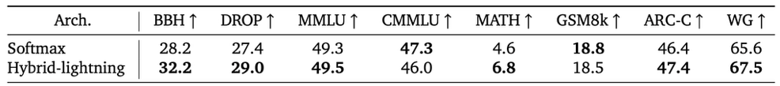

---

## Slide 7

### 讲解

为了克服非线性 RNN 的反向传播灾难，研究者们提出了**线性 RNN（Linear RNNs）**的形式。
其核心思想是：将传统状态更新公式中的非线性激活函数 $\sigma$ 移除，使状态转移过程变得完全**线性化**：
$$h_t = A_t h_{t-1} + B_t x_t$$

一旦更新公式变为纯线性：
1. **梯度传播完美**：因为没有非线性激活函数在每次迭代中压缩或扭曲导数，梯度的传递变得非常直接。
2. **求解封闭性**：我们可以直接展开这个递归公式，得到任意时间步的封闭解析解。

本节的后续内容将展示，这种线性循环形式如何为我们打破无法并行训练的死结提供理论钥匙。

### 补充图片

---

## Slide 8

### 讲解

我们首先看如何从“自注意力”的公式改造中得到一种线性复杂度网络，即 **线性注意力（Linear Attention）** 的诞生。

在标准的 Dot-Product Attention 中，计算公式为：
$$\text{Attention}_i = \frac{\sum_{j=1}^n e^{q_i^T k_j / \sqrt{d}} v_j}{\sum_{j=1}^n e^{q_i^T k_j / \sqrt{d}}}$$

Noam Shazeer、Katharopoulos 等人提出：自注意力之所以达到二次方复杂度，是因为我们在进行求和前，对 Query 和 Key 的乘积施加了非线性的 Softmax 变换（其本质是 $e^{q_i^T k_j}$）。这强行将 Query 和 Key 绑定在了一起，必须先计算出两两相交的 $n \times n$ 注意力得分矩阵。

如果我们能用一个普通的非负特征映射（Feature Map）$\phi(\cdot)$ 来近似或替换 Softmax 中的指数项：
$$\text{Sim}(q_i, k_j) = \phi(q_i)^T \phi(k_j)$$
那么，注意力的公式就可以重写为：
$$\text{Attention}_i = \frac{\sum_{j=1}^n (\phi(q_i)^T \phi(k_j)) v_j}{\sum_{j=1}^n \phi(q_i)^T \phi(k_j)}$$

利用矩阵乘法的**结合律（Associative Law）**，由于 $\phi(q_i)^T$ 只与求和指标 $i$ 相关，我们可以将它从关于 $j$ 的累加求和号中提取出来：
$$\text{Attention}_i = \frac{\phi(q_i)^T \left( \sum_{j=1}^n \phi(k_j) v_j^T \right)}{\phi(q_i)^T \left( \sum_{j=1}^n \phi(k_j) \right)}$$

这一步数学变换具有划时代的意义！如果我们定义一个累积状态矩阵 $Z = \sum_{j=1}^n \phi(k_j)v_j^T$，自注意力的计算就变成了先计算状态矩阵 $Z$，再让每一行 Query 与 $Z$ 相乘。整个计算复杂度瞬间从 $O(n^2)$ 降到了 **线性复杂度 $O(n)$**。

### 补充图片

---

## Slide 9

### 讲解

**线性注意力的循环视角（Linear attention – recurrent view）**。
通过结合律变换后，我们会惊奇地发现：线性注意力与 RNN 的状态更新公式具有完全相同的数学同构性！

我们可以定义一个随时间迭代的动态状态矩阵 $Z_t \in \mathbb{R}^{d \times d}$：
$$Z_t = Z_{t-1} + \phi(k_t) v_t^T$$
分母的归一化因子也可以写成累加向量 $s_t \in \mathbb{R}^d$：
$$s_t = s_{t-1} + \phi(k_t)$$
在每个时刻 $t$，我们只需执行一次常数级的状态更新，就能计算出当前步的注意力输出：
$$y_t = \frac{\phi(q_t)^T Z_t}{\phi(q_t)^T s_t}$$

这证明了：**线性注意力在推理时，可以完美地退化为一个无须 KV Cache 的 RNN**！它同时具备了 Transformer 的并行训练优势（训练时使用全局展开形式）与 RNN 的线性推理优势（推理时使用循环状态形式）。

### 补充图片

---

## Slide 10

### 讲解

既然线性注意力在理论上如此优美，那么**什么是最好的特征映射 $\phi(x)$？**
为了逼近原始 Transformer 的表达能力，研究者们尝试了许多不同的特征映射函数：
- **ELU + 1**：$\phi(x) = \text{ELU}(x) + 1$，这是 Katharopoulos 等人提出的基础变体，保证特征始终非负。
- **Identity (恒等变换)**：直接令 $\phi(x) = x$，但没有任何物理约束。
- **随机特征投影（Random Features）**：Performer 模型（Choromanski 等人 2020）利用正交随机特征（Orthogonal Random Features）在数学上严格地无偏近似 Softmax 算子。

然而，尽管数学推导非常漂亮，线性注意力在实际落地中遇到了一个巨大的物理屏障：**性能精度鸿沟（Quality Gap）**。
在实际的大规模预训练中，所有纯线性注意力的模型在语言建模困惑度（Perplexity）和下游任务评测中，其表现都显著落后于标准的 Softmax Transformer。原因在于 Softmax 具有极强的“聚焦”和“离散化”能力（能非常干净地筛除掉无关噪声），而线性近似由于感受野过于平滑，极易在处理长程复杂依赖时发生信息的“稀释”与模糊。

### 补充图片

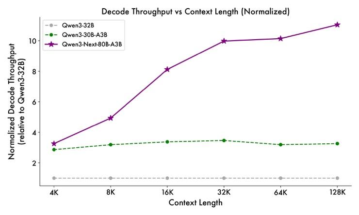

---

## Slide 11

### 讲解

这一页展示了线性注意力与标准注意力在**模型质量（Quality）**上的对比评测数据。

从实验表格中可以清晰地看出，尽管 Performer 等模型在推理速度上占优，但在实际自然语言生成的准确率（如 Wikitext-103 PPL、GLUE 得分）上，相比原始 Transformer 依然存在着难以忽视的精度下滑。这种精度上的“缩水”使得线性注意力一直难以在工业界真正取代标准 Transformer。

### 补充图片

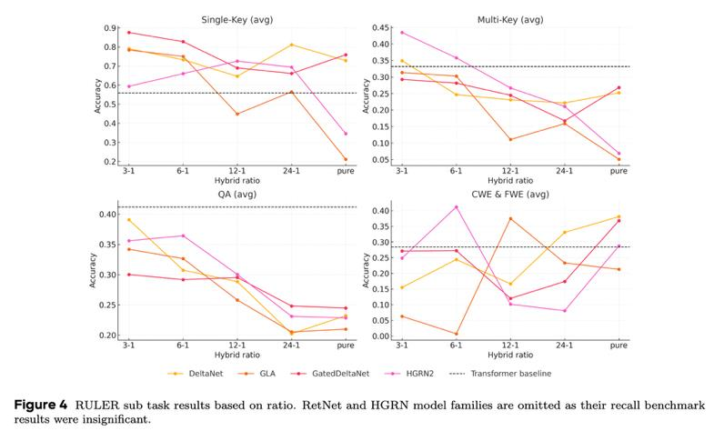

---

## Slide 12

### 讲解

在线性注意力的探索受阻后，2023-2024 年，序列建模领域爆发了一次新的革命：**选择性状态空间模型（Selective SSMs / Mamba）**，由 Gu 和 Dao 提出。
Mamba 的横空出世彻底打破了“线性模型精度不行”的刻板印象。

SSM 本质上起源于控制理论中的连续线性时不变系统（LTI），但在 Mamba 中，作者引入了**选择性机制（Selectivity）**。
选择性机制的核心直觉是：像经典 RNN 或普通线性注意力那样，不管输入是什么，状态转移矩阵 $A$ 和输入控制矩阵 $B$ 都是固定不变的（即与输入 Token 无关），这使得模型无法自主决定过滤哪些无用信息或强力记住哪些核心关键词。

Mamba 则让更新步的 $A, B, C$ 以及离散化步长 $\Delta$ 全部变为了**输入的函数**。模型能够像自注意力中的门控那样，根据当前的 Token 动态决定如何压缩和丢弃记忆状态。

### 补充图片

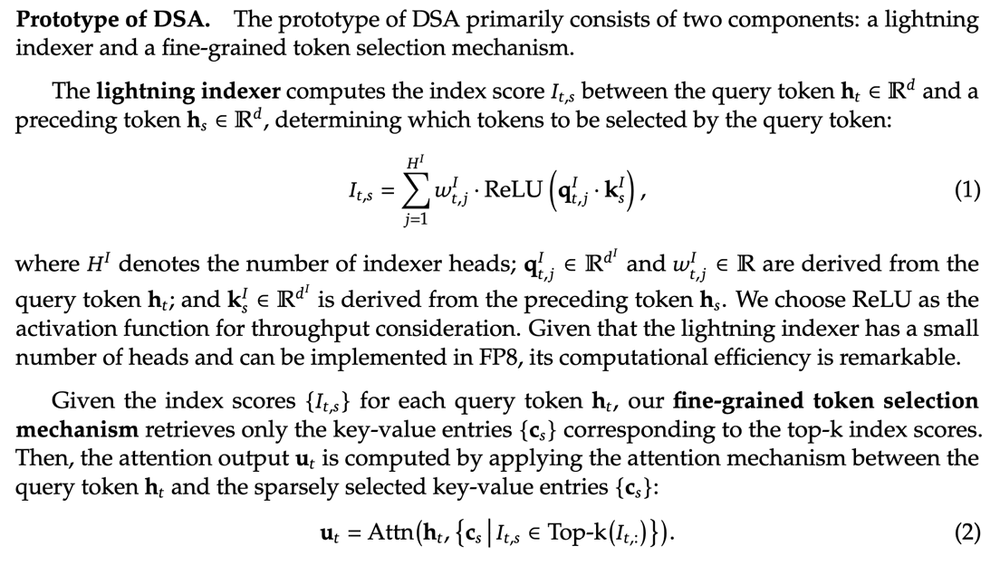

---

## Slide 13

### 讲解

本页给出了 **状态空间模型（SSM）的离散化公式推导**。
连续时间下的 SSM 定义为一个一阶常微分方程：
$$h'(t) = A h(t) + B x(t)$$
$$y(t) = C h(t)$$

由于计算机处理的是离散的 Token 序列，必须使用零阶保持（Zero-Order Hold, ZOH）等方法对其进行**离散化（Discretization）**。在引入离散化时间步长 $\Delta$ 后，公式转化为：
$$h_t = \bar{A} h_{t-1} + \bar{B} x_t$$
$$y_t = C h_t$$
其中，离散化状态转移矩阵 $\bar{A}$ 和离散化输入控制矩阵 $\bar{B}$ 满足：
$$\bar{A} = e^{\Delta A}$$
$$\bar{B} = (\bar{A} - I) A^{-1} B \approx \Delta B \quad (\text{当 } \Delta \text{ 极小时})$$

在 Mamba 中，步长参数 $\Delta$ 是动态计算出来的：
$$\Delta = \text{softplus}(\text{Parameter} + \text{Projection}(x_t))$$
通过改变 $\Delta$ 的大小，模型可以自主控制历史信息的遗忘速度——当遇到转折词或句末标点时，模型可以通过增大 $\Delta$ 快速刷新状态，实现高保真的选择性上下文建模。

### 补充图片

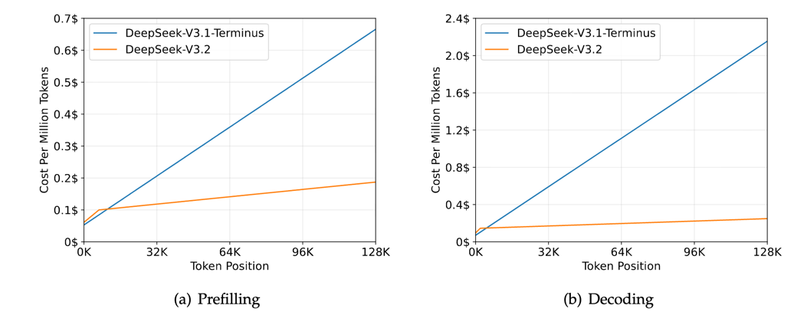
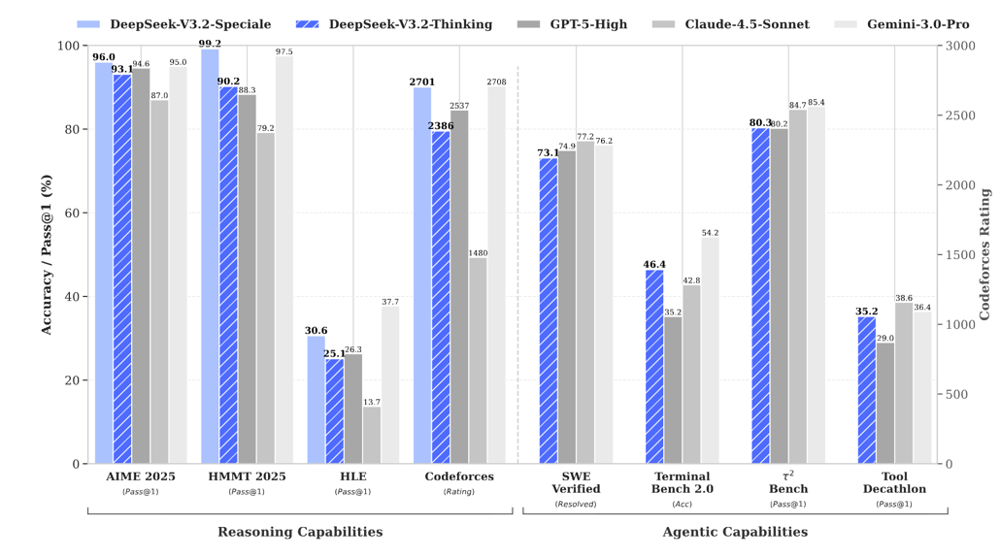

---

## Slide 14

### 讲解

**既然 SSM 引入了选择性机制，使 $A_t, B_t$ 随时间变化，那么如何解决无法并行训练的问题？**
答案是：**并行关联扫描（Parallel Associative Scan）**。

虽然循环递归公式 $h_t = A_t h_{t-1} + B_t x_t$ 看起来是串行的，但在数学上，这个状态更新关系满足**结合律（Associativity）**：
$$h_t = \left( \prod_{i=1}^t A_i \right) h_0 + \sum_{i=1}^t \left( \prod_{j=i+1}^t A_j \right) B_i x_i$$
这种形式的累加在并行计算中被称为 Prefix Sums（前缀和）。通过类似于 GPU 二叉树求和的 **Associative Scan（关联扫描）** 算法，我们可以将原本需要 $O(n)$ 串行时间步的递归计算，并行化切分为仅需要 **$O(\log n)$ 并行时间步**的算法。这让 Mamba 能够像 Transformer 一样完全吃满 GPU 的多卡并行算力，彻底解决了训练慢的工程硬伤。

### 补充图片

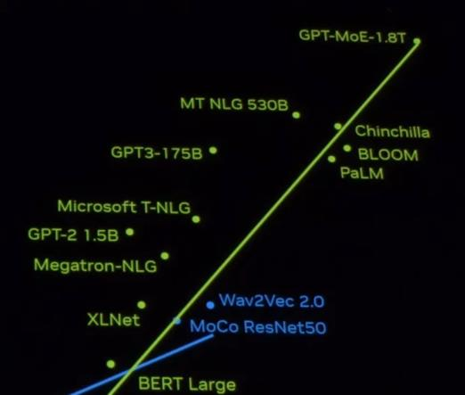

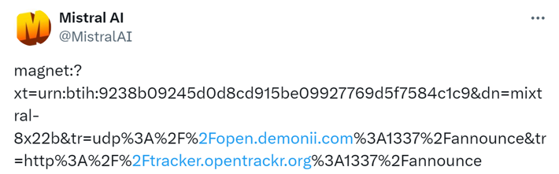
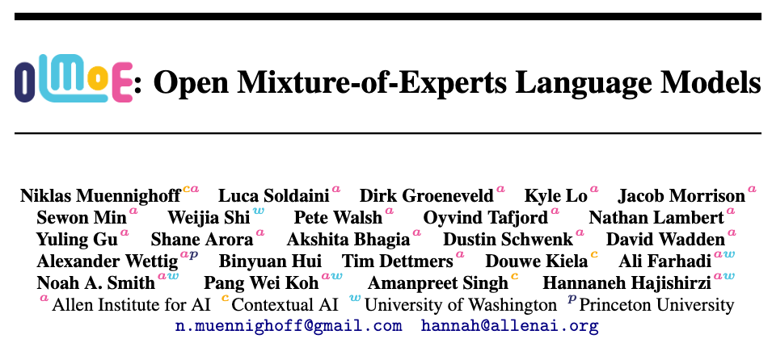
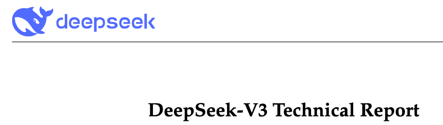

---

## Slide 15

### 讲解

本页对比了 **Mamba 与标准注意力在模型效果（Quality）上的表现**。

图表中展示了在经典的 WikiText、CommonGen 等常识推理和问答基准测试上，不同参数规模（从 100M 到 3B）的 Mamba 与标准 Transformer 的性能对比。

令人振奋的是，Mamba 彻底抹平了此前线性注意力所面临的精度鸿沟。在相同的模型参数和训练 Token 数下，Mamba 的语言建模性能不仅远超此前的线性注意力模型，甚至能够在所有核心评测上**完全打平甚至微幅超越同等规模的标准 Transformer**（如 LLaMA 架构）。这用无可辩驳的数据证明了选择性 SSM 是完全具备与注意力机制一较高下的序列建模引擎。

### 补充图片

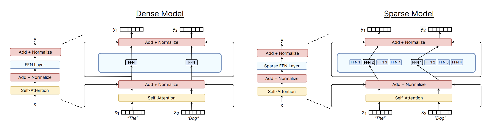

---

## Slide 16

### 讲解

**除了精度打平外，Mamba 的计算效率（Compute Efficiency）优势有多大？**
本页直观地展示了随着上下文长度（Context Length）拉长，Mamba 与标准自注意力的实际耗时增长对比。

在标准的二次方自注意力机制下，当上下文长度超出数万 Token 后，由于矩阵尺寸过大和 KV Cache 带宽限制，前向传播时间呈现极其陡峭的二次抛物线增长。而 Mamba 的计算时间与序列长度完全呈**完美的线性对齐增长**。在极长序列下，Mamba 不仅能够实现成倍的训练加速，更能省去海量的 KV Cache 临时显存，实现了算力与容量的巨大物理红利。

### 补充图片

---

## Slide 17

### 讲解

尽管 Mamba 具有线性复杂度和优秀的长文本效率，但它在处理“针尖对麦芒”的极端联想记忆或需要精确跨度匹配的任务（例如“大海捞针” Needle-in-a-Haystack 评测）时，依然会出现由于信息被持续线性压缩而带来的轻微丢失。

为了解决这一问题，目前最受推崇的工业界实践是 **混合架构（Hybrid Models）**。
混合架构不把鸡蛋放进一个篮子里：它交替堆叠自注意力层和 SSM/Mamba 层。例如，我们可以每 4 层设置 1 个能够完全保留全局上下文交互的全局自注意力层，而其余的 3 层则采用 Mamba 层。这使得我们既能够通过全局注意力捕获绝对无损的长程精确依赖，又可以通过 Mamba 层大幅释放 KV Cache 的存储瓶颈，实现真正的“两全其美”。

### 补充图片

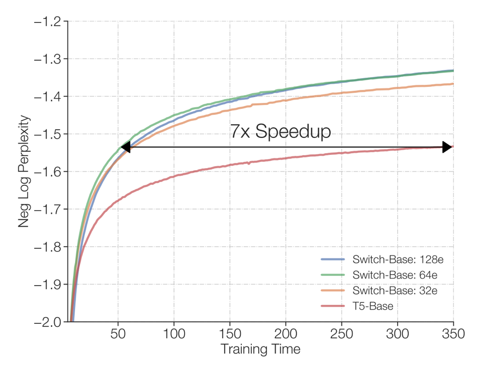
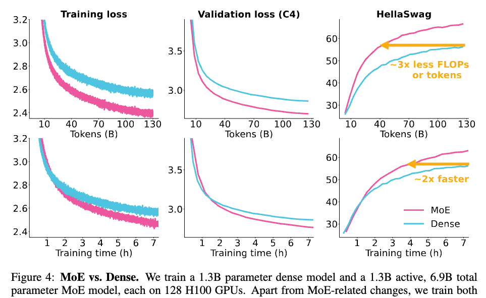

---

## Slide 18

### 讲解

本页对当前**工业界主流的混合架构模型（Hybrid Models Survey）**进行了汇总：

在 2024-2025 年发布的前沿大模型中，混合架构正在掀起新的浪潮：
- **AI21 Jamba**：交替混合了 Mamba 层、Attention 层以及 MoE 模块。
- **Falcon 3 (SSM+Attention)**：最新版本的 Falcon 引入了 SSM 子层，实现了更低的生成耗时。
- **Gemma 3**：谷歌同样在其最新大模型中采用了基于 SSM 配合滑动窗口注意力（SWA）的混合方案。
- **Qwen 3.5 (Hybrid)**：阿里的 Qwen 3.5 系列也大规模引入了这类混合设计。

这些模型的成功探索表明，自注意力机制虽然强大，但它在未来很可能不再是独占鳌头的唯一选择，而是与以 Mamba 为代表的选择性线性状态空间层交错配合，共同构建起下一代高能效大模型的基石。

### 补充图片

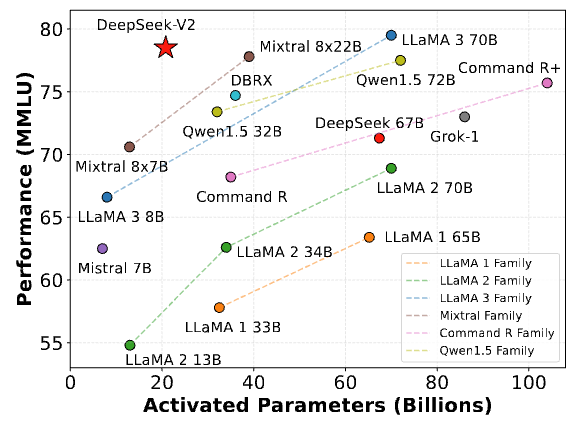

# Part 2: 混合专家模型（MoE）基础

## Slide 19

### 讲解

从第 19 页起，我们进入本讲最核心的第二大主题：**混合专家模型（MoE, Mixture of Experts）**。

在深度学习的常规思维中，如果我们要提升模型的表征能力，就需要增大模型的参数量。然而，在传统的**稠密模型（Dense Models）**中，每一个 Token 的前向传播都必须经过模型的所有参数。这意味着，模型参数量翻倍，前向传播的计算开销（FLOPs）和训练/推理的成本也将翻倍。这使得万亿（Trillion）参数级别的稠密模型成为了普通企业和研究机构不可企及的吞吐灾难。

**混合专家模型（MoE）则彻底颠覆了这一规则**。MoE 引入了**条件计算（Conditional Computation）**和**稀疏激活（Sparse Activation）**的理念：
模型虽然拥有数千亿甚至数万亿的总参数量，但在每次前向传播时，根据输入 Token 的内容，**只有一小部分特定的参数（称为“专家” Expert）会被激活和参与计算**。

这使得我们能够：**在大幅扩展模型知识容量和模型精度的同时，保持与小尺寸稠密模型完全相同的实际计算开销（Active Parameters / Compute Budget）**。

### 补充图片

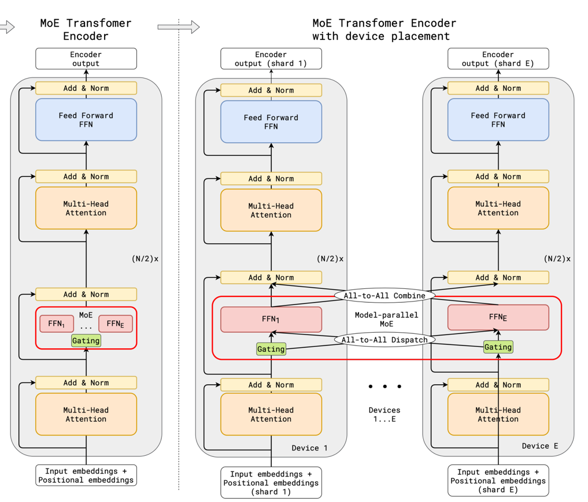

---

## Slide 20

### 讲解

混合专家模型的思想起源很早，但在现代深度学习大模型中的复兴，则要归功于 Noam Shazeer 等人在 2017 年发表的里程碑论文 *"Outrageously Large Neural Networks: The Sparsely-Gated Mixture-of-Experts Layer"*。

在这篇论文中，作者首次成功在 LSTM 等循环网络中嵌入了稀疏门控 MoE 层。当时取得的惊人成果是：构建了一个包含 **137B（1370亿）**总参数量的 MoE 模型，而其前向传播计算量仅与一个普通的 **8B 稠密模型**相当。

这篇论文奠定了现代 MoE 的核心工作方式：通过一个可训练的稀疏门控网络（Sparse Gating Network）来决定每个 Token 应当被路由（Route）给哪一个或哪几个专家线性层，从而在算法和系统上实现了初期的并行条件计算。

### 补充图片

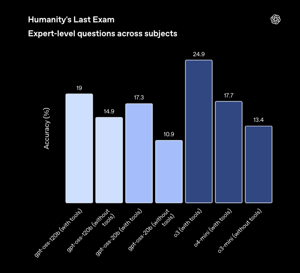

---

## Slide 21

### 讲解

本页回顾了**近年来 MoE 发展的简要历史（A Brief History）**。
虽然 2017 年的论文奠定了理论基础，但受限于当时的硬件调度能力和模型架构，MoE 沉寂了一段时间。直到 Transformer 时代的到来和超大规模集群训练的成熟，MoE 迎来了一次集中的大爆发：

1. **Switch Transformer [Fedus et al. 2022]**：谷歌提出了将 Top-k 路由简化为极致的 Top-1 路由（即每个 Token 仅选择一个专家），首次在理论和工程上证明了将模型参数量推向**万亿级（Trillion-parameter）**的物理可行性。
2. **ST-MoE [Zoph et al. 2022]**：深入探讨了 MoE 预训练和下游微调过程中的极度不稳定性，提出了许多至关重要的稳定化工程策略。
3. **Mixtral 8x7B [Mistral AI 2024]**：Mistral AI 推出的 Mixtral 8x7B 模型彻底将 MoE 带入了开源社区的黄金时代。Mixtral 拥有约 47B 的总参数量，但每个 Token 仅激活 2 个专家（约 13B 激活参数），其下游评测性能全面打平甚至击败了 70B 稠密模型，展示了极佳的生成速度和效率。

### 补充图片

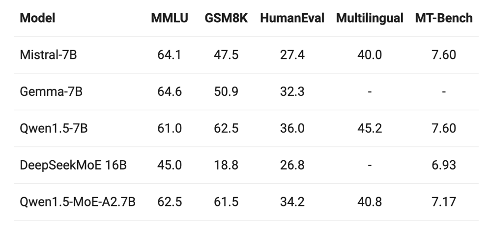

---

## Slide 22

### 讲解

除了欧美开源社区，以 **DeepSeek（深度求索）**等团队为代表的中国大模型研发力量在 MoE 的演进中也扮演了极其重要的领导者角色。

在本页引用的 DeepSeek 早期论文中，研究人员对 MoE 进行了极其深入细致的消融与理论探索。实验表明，通过合理设计专家粒度（Fine-grained Experts）以及引入共享专家（Shared Experts），MoE 能够在几乎不增加通信成本的情况下，大幅降低模型困惑度（Perplexity），并在多语言建模和推理任务中展现出比传统 Mixtral 更高的参数利用率。这为后续万亿参数巨作 DeepSeek-V3 的诞生埋下了坚实的理论伏笔。

### 补充图片

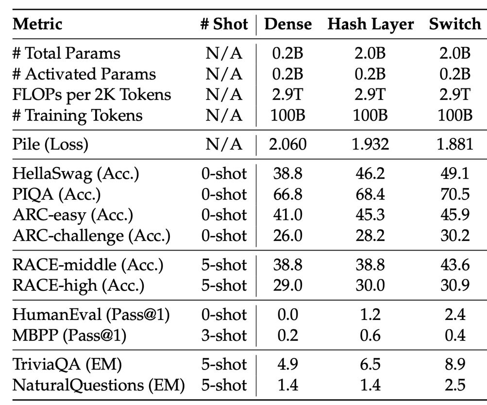

---

## Slide 23

### 讲解

这一页展示了 **DeepSeek-V3 这一当前顶尖 MoE 模型**的真实评测结果。

DeepSeek-V3 拥有高达 671B 的总参数量，但每个 Token 只激活其中的 37B 参数。从评测对比中可以清晰地看到：无论是在数学推理（MATH）、代码生成（HumanEval）、科学问答（MMLU）等前沿评测集上，DeepSeek-V3 都展现出了极其恐怖的统治力，不仅全面超越了 LLaMA-3.1 405B 等超大型稠密模型，其训练所耗费的计算资源（GPU-hours）却仅仅是同等水平稠密模型的几分之一。这充分印证了 MoE 架构在绝对效能上的代际降维打击能力。

### 补充图片

---

## Slide 24

### 讲解

既然 MoE 的性价比如此惊人，**为什么在此前很长一段时间里，它没有在工业界被大面积普及呢？**
主要症结在于**基础设施复杂度与训练极度不稳定**。

本页引用了 Zoph (2022) 和 Fedus (2022) 的研究。开发 MoE 需要解决以下令人头疼的工程难题：
1. **显存存储与调度**：虽然计算量只与激活参数量相当，但整整几千亿甚至上万亿的参数必须原封不动地装进显存中。这需要极其复杂的专家并行（Expert Parallelism）框架，在多卡甚至多机之间实时分发、切分和调度权重。
2. **负载均衡瓶颈**：如果在训练中，路由器过于偏爱某几个特定专家（导致它们“爆满”），而其余专家门可罗雀，那么爆满的 GPU 将成为整个集群训练的短板，导致严重的“短板效应”和算力闲置。
3. **启发式损失的妥协**：为了让路由器平均分配数据，必须引入许多黑盒的辅助负载均衡损失（Auxiliary balancing losses），这使得模型收敛轨迹极其脆弱，极易出现后期 Loss Spikes。

### 补充图片

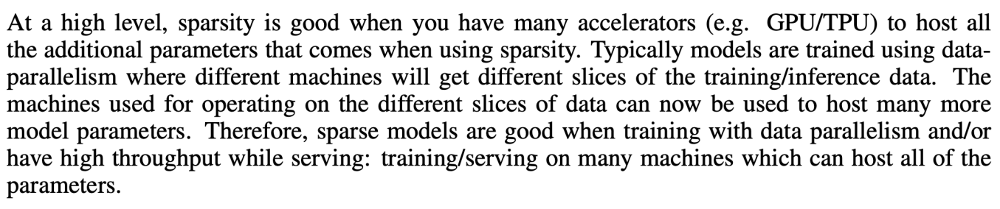

---

## Slide 25

### 讲解

**在经典的 Transformer 中，MoE 层到底是如何嵌入和组织的？**

在绝大多数主流 MoE 模型中，模型并没有将所有算子都变为稀疏的，而是采取了**局部替换（MLP replacement）**的方案：
- **保留稠密注意力层**：所有的自注意力子层（Self-Attention）依然是稠密（Dense）的，所有 Token 都会经过注意力进行全局交互。
- **替换前馈网络**：将传统的 FFN（或 MLP）层替换为 MoE 模块。

如图所示，在一个 MoE 块中，输入首先通过一个路由模块（Router/Gate），路由模块输出每个 Token 发送给每个专家的概率权重。随后，Token 被分流发送给它所选中的专家 FFN。各专家的输出结果乘以相应的路由权重后，最后进行残差累加。

- **不常见的探索**：尽管有一些工作尝试对自注意力层也进行 MoE 切分（如 ModuleFormer、JetMoE 等），但由于注意力层中的 Key/Value 矩阵切分会极大破坏 GQA 等推理优化特征，这类设计目前在工业界很少被采用。

### 补充图片

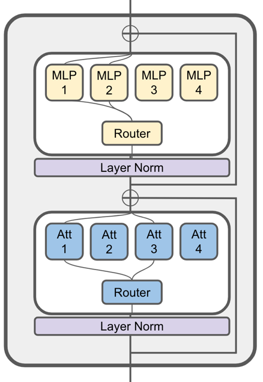

---

## Slide 26

### 讲解

本页是 **MoE 基本结构的过渡总结**。如果要从头设计或改进一个 MoE 模型，我们应当关注以下三个最核心的变量：
1. **路由函数（Routing function）**：决定 Token 应当分流给哪些专家（如 Top-k，硬哈希等）。
2. **专家尺寸与布局（Expert sizes & layout）**：专家的总个数、单个专家的参数量以及是否包含常驻的“共享专家”。
3. **训练目标与辅助优化（Training objectives）**：如何通过损失设计克服负载不均和不稳定性。

接下来的内容将围绕这三个核心变量展开深入的剖析。

# Part 3: MoE 路由机制

## Slide 27

### 讲解

路由机制（Routing Mechanism）是混合专家模型（MoE）的神经中枢。路由算法决定了每个 Token 应当被分流给哪一个专家，直接决定了模型的表达能力与系统运算效率。

在设计路由算法时，研究者们探索了多种模式：
1. **Token 选择专家（Token Choice）**：这是最直观也最主流的方式。每个 Token 独立计算它对所有专家的亲和度，并挑选最合适的 Top-k 个专家。
2. **专家选择 Token（Expert Choice）**：反其道而行之，由每个专家去设定其能够容纳的 Token 上限（Capacity），并在整个序列中挑选亲和度最高的 Token。这种方式天然消除了负载不均，但对于需要流式自回归解码的推理任务极其不友好。
3. **全局规划路由（Global Routing）**：将分流任务视为一个全局优化分配问题进行求解。

---

## Slide 28

### 讲解

在当前的工业界大模型中，几乎 100% 的 MoE 都采用了 **Token 选择专家（Token Choice Top-K）** 的路由模式。

这主要是因为 Token Choice 拥有极佳的自回归兼容性——我们在自回归解码生成下一个 Token 时，无须知道后续还有哪些 Token，就可以直接根据当前这一步计算出的注意力向量，独立且快速地做出专家路由决策。这种局域性（Locality）对于超低延迟的在线推理服务（Online serving）是不可或缺的。

### 补充图片

---

## Slide 29

### 讲解

本页展示了在 Token Choice 下，**不同主流模型的 Top-k 选择差异**：

- **Top-1 路由**（每个 Token 仅去往 1 个专家，速度最快，但精度损耗大）：
  - **Switch Transformer**
  - **LLaMA-4 Maverick** (1 routed + 1 shared)
- **Top-2 路由**（目前最经典、最平衡的选择）：
  - **GShard**
  - **Grok-1**
  - **Mixtral 8x7B**
- **Top-4 及以上路由**（追求更高精度和细粒度专家交互）：
  - **DBRX** (Top-4)
  - **Qwen-2.5-MoE** (Top-4 routed + 4 shared)
  - **DeepSeek-V3** (Top-8 routed + 1 shared)

除了可训练的 Top-k 路由外，早期谷歌也在 Switch Transformer 中对比过硬编码的**哈希路由（Hashing）**作为 Baseline。虽然哈希路由无须学习且能天然实现负载均衡，但由于其路由逻辑完全随机、缺乏内容自适应性，最终的语言建模性能显著差于可学习的门控。

### 补充图片

---

## Slide 30

### 讲解

本页回顾了**其它非主流的路由方式**。
- **强化学习路由（RL-based Routing）**：早在 2013 年 Bengio 等人就尝试过用 REINFORCE 算法来优化非连续的专家离散路由决策。虽然这在数学上是最直接的形式，但在神经网络训练中，强化学习的梯度方差（Gradient variance）过大，且收敛极其缓慢，当前大模型中几乎不可见。
- **线性规划路由（Linear Assignment）**：Clark 等人在 2022 年将路由问题建模为一个经典的二分图最佳匹配（Maximum bipartite matching）或运输问题（Optimal transport），利用线性规划求解器在 batch 级别实现完美的负载均衡分流。然而，这种方法的求解算法复杂度太高，会对 GPU 的训练吞吐量造成严重的计算阻塞。

### 补充图片

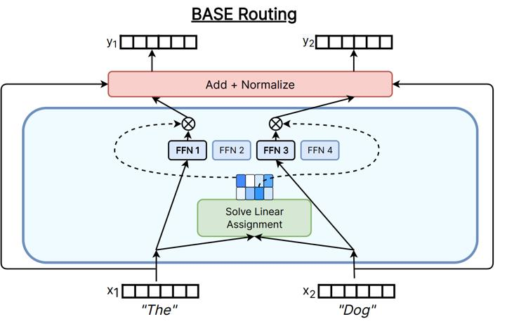

---

## Slide 31

### 讲解

**Token Choice Top-K 路由在数学上是如何实现的？**
其基本流程如下：
对于输入 Token 向量 $x \in \mathbb{R}^{d_{\text{model}}}$，我们首先乘以一个门控投影矩阵 $W_g \in \mathbb{R}^{d_{\text{model}} \times E}$（其中 $E$ 是专家总数），得到它对所有专家的分数向量，随后应用 Softmax 归一化，得到概率分布 $s(x)$：
$$s(x) = \text{softmax}(xW_g)$$

然后，我们挑选出概率最大的前 $K$ 个指数索引，组成集合 $\mathcal{K} = \text{TopK}(s(x), K)$。
在最终输出时，我们将这 $K$ 个被选中专家的计算结果与其归一化后的门控权重进行加权求和，得到最终的 MoE 层输出：
$$G(x) = \sum_{j \in \mathcal{K}} g_j(x) E_j(x)$$

> [!IMPORTANT]
> **关于门控权重 $g_j(x)$ 的计算差异**：
> 在经典的 Top-K 路由中，有两派计算门控权重的方法：
> 1. **全专家归一化**（如早期 DeepSeek-V1/V2，以及 Grok 和 Qwen）：直接取原始 $s(x)$ 中的数值：$g_j(x) = s_j(x)$。
> 2. **Top-K 重新 Softmax**（如 Mixtral、DBRX 和 DeepSeek-V3）：在筛选出 Top-K 专家后，仅对这 $K$ 个被选中的分数重新进行一次 Softmax 归一化，以提高路由权重的对比度和数值稳定性。

### 补充图片

---

## Slide 32

### 讲解

近年来，以 DeepSeek 为代表的团队提出了一种极具创新的变体：**共享专家与细粒度专家（Shared Experts & Fine-grained Experts）**。
这一想法最早起源于微软的 DeepSpeed-MoE。

在传统的 Mixtral 架构中，假设我们有 8 个专家，每个专家的维度很大。
而 DeepSeek 提出两个核心改动：
1. **细粒度专家（Fine-grained Experts）**：我们将原本一个超大尺寸的专家，切分成多个体积更小、更精细的小专家。例如，将 8 个大专家切成 64 个小专家。这允许 Token 在更精细的特征空间中进行组合。
2. **共享专家（Shared Experts）**：强行抽出一个或几个小专家，规定它们**永远常驻激活（Always on）**。即所有 Token 都必须无条件地进入共享专家进行计算，而剩下的路由专家则通过 Top-k 进行动态分流。

**这一设计的直觉是什么？**
共享专家负责提取句子中通用的底层常识和语法共性特征，扮演“通才”；而动态路由的专家则专注于提取高度特异化的垂直领域知识，扮演“专才”。这种分工协作极大减少了不同专家之间的知识冗余，提升了参数效率。

### 补充图片

---

## Slide 33

### 讲解

本页展示了 DeepSeek 论文中关于**共享专家与细粒度专家的消融实验（Ablations）数据**。

结果表明，在固定激活参数量和总计算开销的前提下：
- 随着我们把专家切得越来越细（例如从小专家数 $N_{\text{shared}} = 2$ 且小专家总数增加），模型的训练 Loss 和下游任务 Perplexity 呈现出非常稳定的单调下降。
- 引入共享专家（图中黄色曲线）能够非常有效地缓解路由时的信息泄露，相比无共享专家的传统 MoE，收敛效果有了质的改善。

### 补充图片

---

## Slide 34

### 讲解

然而，大模型领域的结论往往具有实验局限性。来自 Allen Institute for AI 的 **OLMoE (2024)** 团队在一项更大规模、更彻底的科学消融中得到了不尽相同的结论。

如图所示，OLMoE 的实验表明：
- **细粒度专家（Fine-grained experts）确实能带来极其稳定的精度提升**。
- **但是，共享专家（Shared experts）在此次大规模消融中几乎没有表现出任何实质性的精度增益**。

这提示我们：在不同的预训练语料规模和基础架构下，共享专家的实际作用依然存在争议。在具体做模型开发时，应当根据实际的硬件拓扑和计算吞吐进行消融决定。

### 补充图片

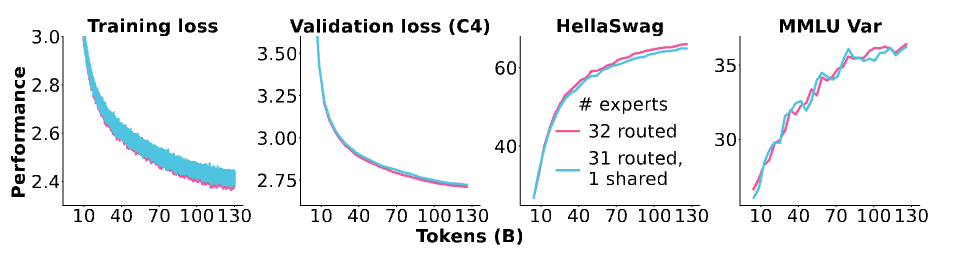
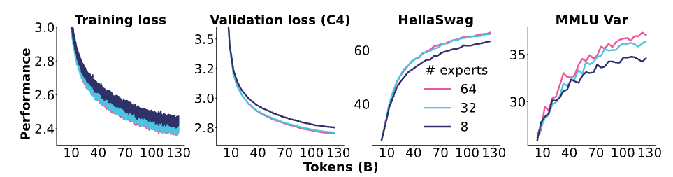

---

## Slide 35

### 讲解

本页给出了近年来**主流 MoE 模型的专家路由配置对照表**，是极佳的架构设计参考手册：

| 模型 | 总路由专家 | 激活路由专家 | 共享专家数 | 专家粒度 / 替换比例 |
| :--- | :---: | :---: | :---: | :---: |
| **GShard** | 2048 | 2 | 0 | 1 |
| **Switch Transformer** | 64 | 1 | 0 | 1 |
| **ST-MoE** | 64 | 2 | 0 | 1 |
| **Mixtral 8x7B** | 8 | 2 | 0 | 1 |
| **DBRX** | 16 | 4 | 0 | 1 |
| **Grok-1** | 8 | 2 | 0 | 1 |
| **DeepSeek-V1** | 64 | 6 | 2 | 1/4 细粒度 |
| **Qwen-1.5-MoE** | 60 | 4 | 4 | 1/8 细粒度 |
| **DeepSeek-V3** | 256 | 8 | 1 | 1/14 细粒度 |
| **OLMoE** | 64 | 8 | 0 | 1/8 细粒度 |
| **MiniMax** | 32 | 2 | 0 | ~1/4 细粒度 |
| **LLaMA-4 Maverick** | 128 | 1 | 1 | 1/2 细粒度 |

我们可以清晰地看到技术路线的演进趋势：早期模型（如 GShard、Switch）尝试了极其庞大的专家总数但粒度较粗；中期（Mixtral、DBRX）回归到了较少的专家数配合 Top-2/4；而最新一代顶尖模型（如 DeepSeek-V3、Qwen）则融合了“超多细粒度专家 + 常驻共享专家”的模式，在保持稀疏激活度的同时，极大地压榨出了参数里的每一滴性能。

# Part 4: MoE 训练策略、系统设计与稳定性

## Slide 36

### 讲解

混合专家模型（MoE）在理论上很完美，但在训练阶段却面临着一个巨大的数学挑战：**稀疏门控决策是不可微的（Non-differentiable）**。

因为像 $\text{TopK}$ 这样的操作是一个离散的“选择”过程（选择第 $i$ 个，不选择第 $j$ 个），其导数要么为 0，要么无定义。这意味着我们无法直接使用标准的梯度下降（SGD）来学习如何路由 Token。

为了解决这个问题，研究者们提出了三类解决方案：
1. **强化学习（RL）**：通过 REINFORCE 算法学习离散的门控策略。
2. **随机近似与摄动（Stochastic Perturbations）**：在路由计算前引入随机噪声，使期望意义下的门控变得可微。
3. **启发式负载均衡损失（Heuristic Balancing Losses）**：在目标函数中额外加入一项可微的“负载偏差惩罚”，目前这是工业界最通用的策略。

---

## Slide 37

### 讲解

**利用强化学习（RL）训练 MoE 路由器。**
在早期的探索中（如 Clark 等人 2020 年的工作），研究者将路由选择视为一个强化学习环境，利用 REINFORCE 算法：如果 Token 被送去 Expert $i$ 且最终损失（Loss）降低了，就给予该路由决策一个正向奖励（Reward）。

虽然强化学习在理论上是处理离散决策的“正确答案”，但在真实的大模型预训练中，它极难落地：
- **梯度方差极大**：强化学习的估算梯度极其不稳定，导致路由器参数在训练初期剧烈震荡。
- **复杂度与效率低**：在每一层都运行一遍 RL 采样，会增加大量的训练时间开销。因此，RL 目前在主流 MoE 预训练中几乎被弃用。

### 补充图片

---

## Slide 38

### 讲解

Noam Shazeer 在其 2017 年的奠基性工作中引入了**随机近似与高斯噪声摄动（Stochastic Approximations）**。
其做法是：在计算 Softmax 之前，向每个专家的路由分数中添加一个服从正态分布的随机噪声 $\epsilon$：
$$H(x)_i = (xW_g)_i + \epsilon \cdot \text{softplus}(xW_{\text{noise}})_i, \quad \epsilon \sim \mathcal{N}(0, 1)$$
然后再应用 Top-k 和 Softmax 归一化。

这一做法带来了两个巨大的工程红利：
1. **探索性（Exploration）**：在训练初期，随机噪声强迫 Token 去探索不同的专家，防止路由器过早收敛到某种局部最优的单一选择。
2. **平滑梯度**：在数学期望意义上，加入连续噪声后，Top-k 门控概率的期望值对输入 $x$ 的导数变得平滑且可微。这使得模型能极其顺畅地使用标准梯度下降来更新路由矩阵。

### 补充图片

---

## Slide 39

### 讲解

本页讨论了 Fedus 等人在 2022 年（Switch Transformer 论文）中提出的一种随机变体——**随机抖动（Stochastic Jitter）**。
其做法是对输入特征 $x$ 进行微小的乘性均匀分布随机摄动，以增强专家的鲁棒性，防止模型对某些特定特征过拟合。

不过，Zoph 等人在 2022 年关于 ST-MoE 的大规模消融中发现，这种随机抖动虽然在小模型上有轻微帮助，但在超大模型预训练时，反而会由于引入过多的随机噪声而干扰优化器的收敛路径。因此，在后来的 ST-MoE 及 Mixtral 中，这一机制被移除，证明了在预训练中，简洁稳定的确定性门控依然是首选。

### 补充图片

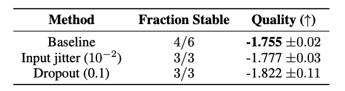

---

## Slide 40

### 讲解

为了让模型在训练中自发地均匀使用所有专家，目前大模型的标准解法是引入 **启发式负载均衡损失（Heuristic Balancing Losses / Auxiliary Loss）**。
如果没有任何约束，路由器会陷入“马太效应”：某几个专家由于训练得早、性能好，会被分流给越来越多的 Token，而其余的专家则会被完全边缘化。这会导致计算资源的极大浪费。

在 Switch Transformer 中，作者引入了以下极其优雅的可微辅助损失公式：
$$\mathcal{L}_{\text{aux}} = \alpha \cdot E \cdot \sum_{i=1}^E f_i \cdot P_i$$
其中：
- $E$ 是专家总数。
- $f_i = \frac{1}{T} \sum_{t=1}^T 1[\text{expert } i \text{ chosen by token } t]$，表示在这个 Batch（总共 $T$ 个 Token）中，被路由分发给专家 $i$ 的 Token **实际占比**。这是一个不可微的离散计数。
- $P_i = \frac{1}{T} \sum_{t=1}^T s_i(x_t)$，表示在该 Batch 中，路由器预测将 Token 分发给专家 $i$ 的**概率均值**。这是一个完全可微的连续变量。

**这个公式的精妙之处在于**：将不可微的实际分流比例 $f_i$ 作为常数权重，与可微的概率均值 $P_i$ 进行相乘累加。由于 $P_i$ 的导数可求，当模型最小化这一辅助损失时，会自发地将分配概率往均匀分布（即 $1/E$）的方向拉，从而强力引导路由器平均分配任务。

### 补充图片

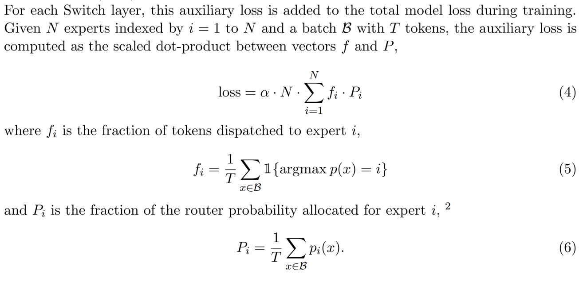

---

## Slide 41

### 讲解

在大规模分布式多机训练中，均衡不仅要在“专家层”实现，还要在“物理卡层”实现。本页展示了 **DeepSeek-V1/V2** 采用的升级版辅助损失：

1. **专家级负载均衡（Per-expert balancing）**：与 Switch Transformer 一致，确保所有专家得到的 Token 数大致均等。
2. **设备级负载均衡（Per-device balancing）**：由于专家被切分并部署在不同的物理 GPU（Device）上，必须确保每个 GPU 接收到的总数据量保持均衡，以最大化多卡并行时的互联带宽效率，防止某些卡由于等待数据而产生严重的同步气泡（Sync bubbles）。

### 补充图片

---

## Slide 42

### 讲解

尽管辅助均衡损失（Auxiliary Loss）很有用，但它存在一个根本性的缺陷：**它在强行扭曲模型的学习规律**。如果模型认为某个 Token 去 Expert 1 效果最好，但为了“吃大锅饭”均衡负载，辅助损失强行将其拉去 Expert 2，这必然会导致模型整体精度的受损。

为了解决这一痛点，DeepSeek-V3 提出了一种极具工程智慧的方案：**无辅助损失负载均衡（Auxiliary-loss-free Load Balancing）**。
其核心思想是：在训练时，不再在 Loss 函数中加入硬性的惩罚项，而是**在推理和门控计算时引入一个可动态学习的专家偏置偏置项（Bias term） $b_i$**：
$$s_i(x) = \text{softmax}(xW_g + b_i)$$

在训练的每一个 step，我们在后台动态监控每个专家的真实负载：
- 如果发现 Expert $i$ 过于拥挤（Token 过载），我们就微幅调小其偏置 $b_i$，降低它后续被选中的概率。
- 如果发现 Expert $i$ 门可罗雀（Token 过少），我们就微幅调大 $b_i$，吸引更多 Token 流向它。

这种“在线反馈控制”可以在反向传播中实现完全无损的自然收敛，模型参数不需要为了强求均衡而牺牲特征表达，是 MoE 路由技术的一大突破。

### 补充图片

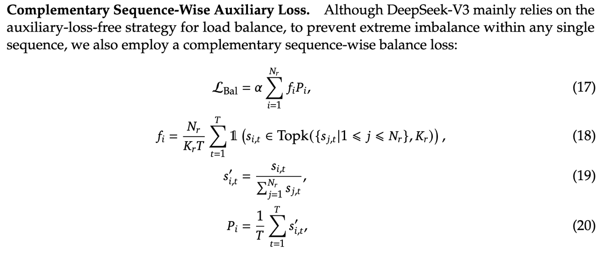

---

## Slide 43

### 讲解

本页展示了**移除负载均衡损失后模型性能的变化**。

实验曲线表明，如果不使用任何均衡手段（即辅助损失设为 0，且无动态偏置），模型在预训练后期的困惑度（Perplexity）会出现明显的劣化，因为此时模型已经退化为了少数几个专家的稠密模型。而使用 DeepSeek-V3 的无损动态偏置方案，模型不仅实现了完美的物理负载均衡，其最终收敛的 Loss 显著低于使用传统强行惩罚辅助损失的模型。

### 补充图片

---

## Slide 44

### 讲解

接下来进入 **MoE 训练与推理的系统与硬件层面（Systems side）**。
MoE 的稀疏性质，使其具有非常天然的并行扩展空间：
在传统的稠密多卡训练中，我们常用张量并行（Tensor Parallelism）切分矩阵。而在 MoE 中，由于每个专家都是一个独立的 FFN 块，我们可以采用 **专家并行（Expert Parallelism）**：
将不同的专家直接分配到不同的 GPU 设备上。例如，GPU 0 负责运行 Expert 1 & 2，GPU 1 负责运行 Expert 3 & 4。

这样，Token 在经过自注意力层计算后，路由器会通过极其高效的 **All-to-All** 网络通信，将 Token 跨卡发送到它们指定的专家所在的 GPU 上。计算完成后，再通过 All-to-All 重新打包回传。这种设计能够极大地减少显存占用，使千亿级参数量的模型得以在常规集群上跑起来。

### 补充图片

---

## Slide 45

### 讲解

虽然专家并行在逻辑上可行，但在底层算子（GPU Kernel）实现上遇到了极大的挑战。

传统的 PyTorch 算子假设输入向量的维度是完全对齐和规则的。然而，在 MoE 中，由于不同专家分到的 Token 数量在每一个 Batch 中都在动态波动，这会导致输入的矩阵呈现出非常不规则的稀疏性。如果使用传统的稠密矩阵乘法，会导致大量无意义的零填充（Padding）和计算闲置。

为了解决这一痛点，斯坦福大学和 MegaBlocks 团队开发了专门针对 MoE 的 **Block-sparse Matrix Multiplication（分块稀疏矩阵乘法 / dMoE）**算子。
MegaBlocks 抛弃了传统硬性对齐的思路，利用自定义的 GPU CUDA 核函数，直接在内存中以非规则分块的形式计算动态流向的 Token 矩阵乘法。这彻底消除了零填充的额外开销，为 Mixtral 等主流开源 MoE 模型的极速训练和推理提供了核心算子支撑。

### 补充图片

---

## Slide 46

### 讲解

为了进一步降低专家并行多卡通信时的巨大带宽瓶颈，近年来研究者们也对架构进行了一些有针对性的微调。

例如，在 NVIDIA 的 **Nemotron 3** 等模型中，设计者在路由分流前和分流后引入了**低秩投影（Down-projection）**。
具体而言：Token 在被跨卡发送前，先通过一个极窄的线性投影层将特征维度从 $d_{\text{model}}$ 压缩到一个很小的 latent 维度。跨卡传输这个压缩后的向量，计算完成后，再在目标设备上进行解压投影。这大幅降低了多机互联（如 InfiniBand）上的 All-to-All 通信带宽开销，使集群训练的整体利用率得到了显著提升。

### 补充图片

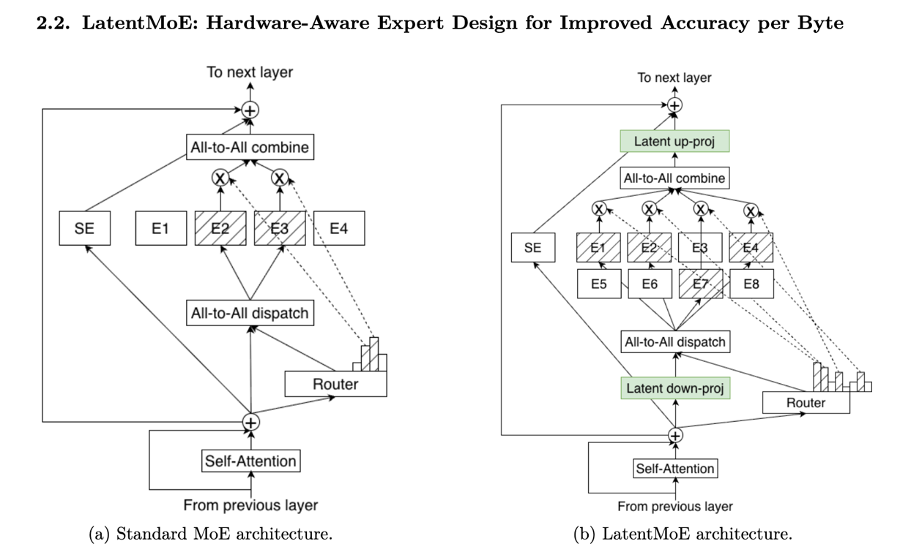

---

## Slide 47

### 讲解

这里探讨一个非常有趣且致命的系统副作用：**Token 丢弃与随机性（Stochasticity & Token Dropping）**。

为了防止某个专家因为分流数据过多而导致 GPU 显存溢出，大多数系统框架会设置一个硬性的**专家容量上限（Capacity Factor）**。一旦分配给某个专家的 Token 数超出了这个上限，多出来的 Token 会被**直接无情丢弃（Dropped）**，不经过 FFN 计算，直接通过残差传给下一层。

这引入了一个非常荒谬的非决定性问题：由于容量上限是**在整个 Batch 级别（多个用户的 query 合并在一起）计算的**，这意味着：**你输入的 Query 所产生的生成结果，居然会受到同 batch 下其它毫不相关的用户的 Query 长度和内容的影响**！如果别人的 Query 导致某个专家爆满，你的 Token 就会被无端丢弃，导致模型输出质量下降。这种不确定性在生产部署中是极其难以忍受的。因此，最新一代模型（如 DeepSeek-V3）通过高度优化的显存管理，基本实现了完全无 Token 丢弃的 MoE 运行。

### 补充图片

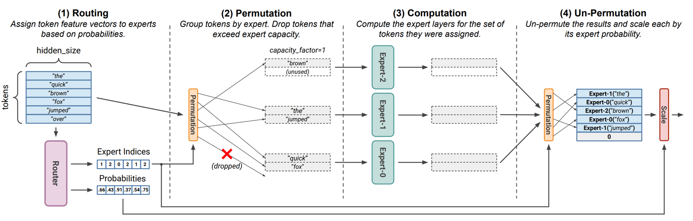

---

## Slide 48

### 讲解

在稳定性方面，**MoE 比稠密模型更容易出现数值溢出。**
主要因为门控的 Softmax 概率在训练过程中极易失控。

Zoph 等人在 2022 年（ST-MoE 论文）中给出的黄金解决方案是：
1. **强行在 Float32 精度下运行路由计算**。即便整个模型使用的是 FP16 或 BF16 混合精度训练，路由器的投影和 Softmax 这一小部分计算也必须无条件在单精度 Float32 下进行，以保证分母的数值安全性。
2. **引入路由器 z-loss**：类似于输出层的 z-loss，惩罚过大的路由 logits，防止门控权重出现极大极小的极端两极分化。

### 补充图片

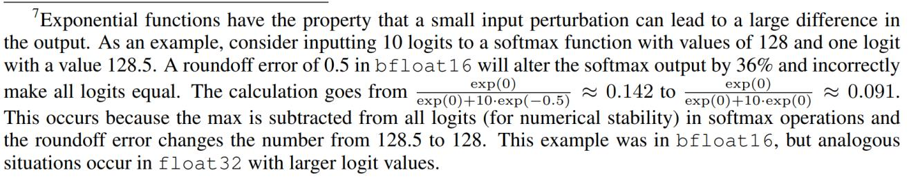

---

## Slide 49

### 讲解

本页展示了在训练 MoE 时，**移除路由器 z-loss 后的后果**。

实验结果表明，在没有 z-loss 保护的情况下，随着模型规模增加，路由器参数会在训练的中后期突然爆发数值溢出，导致整个模型的 Loss 瞬间冲上 NaN。而在加入这一简单的辅助稳定约束后，模型可以平稳地跑完整个万亿 Token 的预训练流程，验证了稳定性小 Trick 往往决定了工程的成败。

### 补充图片

---

## Slide 50

### 讲解

MoE 在训练上的另一个隐形痛点是：**下游指令微调（SFT / Fine-tuning）时的极度易过拟合**。

由于 MoE 模型通常拥有几百亿的总参数量，而在微调阶段（SFT），可用的高质量微调样本（如对话、指令数据）往往只有几千到几十万条。因为数据量太小而模型体量太大，MoE 极其容易在极短的微调步数内就产生严重的过拟合。

- **Zoph 等人的经典解法**：在微调时，**冻结（Freeze）所有 MoE 层的专家矩阵，仅微调非 MoE 的 MLP 层和注意力层**，或者只在 MoE 门控上加极大的 Dropout。
- **现代大厂的暴力解法**：如 DeepSeek，干脆不使用冻结，而是直接准备极其庞大、多样的高质量微调数据集（如 1.4 Million 以上的混合 SFT 数据），用绝对的数据规模压制过拟合风险。

### 补充图片

---

## Slide 51

### 讲解

在大模型预训练的后期，我们是否一定要从零（From scratch）去初始化一个庞大的 MoE？
研究者们提出了一种名为 **Upcycling（上行循环 / 密集模型升级）** 的高性价比方案。

其基本操作为：
1. 先从零训练一个参数量较小、容易收敛的标准**稠密模型（Dense Model）**。
2. 训练完毕后，我们将稠密模型中的 MLP 层的权重直接复制多分，初始化为 MoE 块中的多个专家。
3. 随后，我们在其上叠加密度路由层，并使用额外的预训练数据（通常为原先的 10%-20% Token）进行持续预训练（Continued Pre-training）。

这种方式能够极大节省前期的训练算力，是很多中小团队构建高性能 MoE 的捷径。

### 补充图片

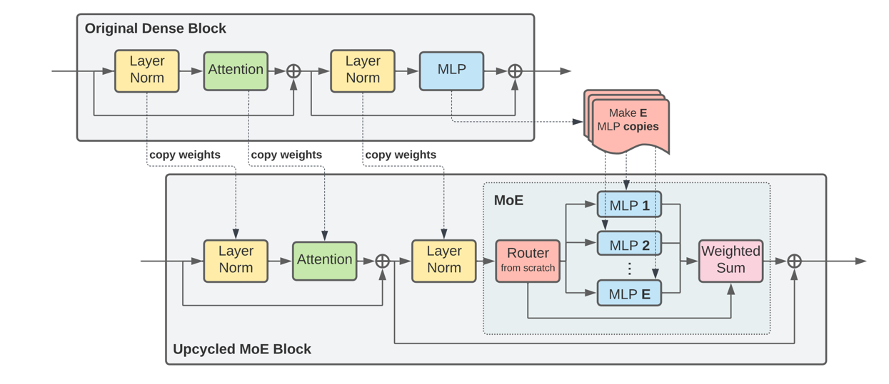

---

## Slide 52

### 讲解

本页给出了一个经典的 **Upcycling 落地案例：MiniCPM-MoE**。

设计团队首先训练了一个高性能的 MiniCPM 稠密底座模型，随后通过 Upcycling 初始化了 8 个细粒度专家，并在约 520B 的 Token 上进行了持续微调训练。实验数据表明，升级后的 MiniCPM-MoE 在保持超低推理开销（每个 Token 仅激活约 4B 参数）的同时，其最终基准测试指标显著超越了原有的稠密模型，展示了 Upcycling 方案的高效性。

### 补充图片

---

## Slide 53

### 讲解

另一个极其著名的 Upcycling 成功范例是阿里的 **Qwen-MoE**。

Qwen-MoE 直接从预训练好的 Qwen-1.8B 稠密模型升级初始化而来，扩展为了包含 60 个细粒度专家和 4 个常驻共享专家的 MoE 结构（Top-4 路由）。这也是开源社区中首批被完全确认并公开发布的、使用 Upcycling 技术在极低算力下获得商业级成功的代表作。

### 补充图片

# Part 5: DeepSeek MoE 架构演进、MLA 机制与总结

## Slide 54

### 讲解

混合专家模型（MoE）演进史上的集大成者，莫过于 **DeepSeek MoE** 系列。这一节我们将深入剖析从 V1 到 V3 版本的架构上演变路线图。

首先来看 **DeepSeek-MoE V1**（16B 总参数，每个 Token 仅激活 2.8B）：
- **基础路由方式**：标准的 Top-k 门控路由。
- **专家布局**：引入了 **2 个固定常驻的共享专家（Shared Experts）** 以及 **64 个细粒度路由专家（Fine-grained routed experts）**，每个路由专家的尺寸是传统大专家的 $\frac{1}{4}$。
- **负载均衡**：采用基于 Switch Transformer 的传统辅助负载均衡损失，同时针对设备（Device）和专家（Expert）施加双重惩罚，在小参数规模下实现了优于传统门控的收敛效率。

### 补充图片

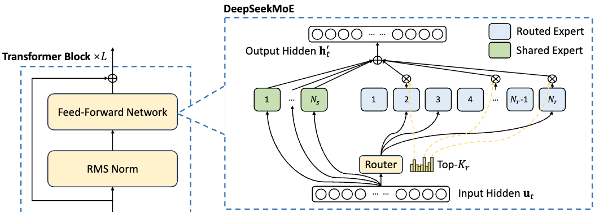
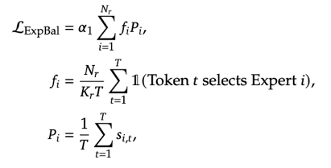

---

## Slide 55

### 讲解

随后发布的 **DeepSeek-MoE V2**（236B 总参数，每个 Token 仅激活 21B）在 V1 的基础上做出了重要革新：
- **专家扩展**：保留了 2 个共享专家，但将路由专家总数暴增到 **160 个**，专家粒度进一步细化到传统专家的 $\frac{1}{10}$，每个 Token 动态激活其中的 6 个专家。
- **设备级 Top-M 路由**：在大规模多机训练中，传统的 Token Choice 可能会把 Token 分流给分布在不同节点的多个不同专家，引发恐怖的跨机器 All-to-All 网络通信开销。V2 引入了 Top-M 设备路由：每个 Token 在选择专家前，**首先挑选出最多 M 个物理 GPU 节点，随后只能在这些节点内选择专家**。这极大地约束了多机互联的带宽瓶颈。
- **通信均衡损失（Communication Balancing Loss）**：显式地对跨卡通信的不均匀程度进行惩罚，确保集群带宽被跑满。

### 补充图片

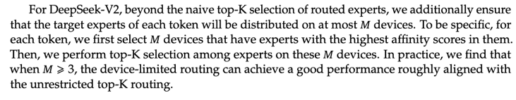

---

## Slide 56

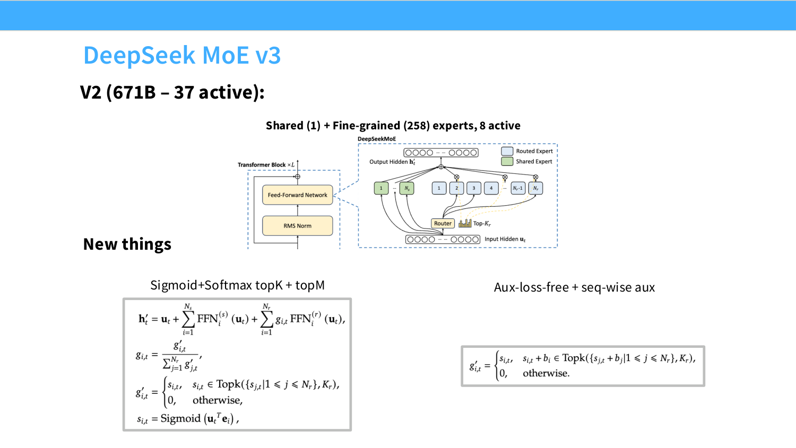

### 讲解

2024 年末轰动整个 AI 界的 **DeepSeek-V3**（671B 总参数，每个 Token 仅激活 37B，共有 256 个路由专家，动态激活 8 个，外加 1 个共享专家）代表了当前 MoE 架构的巅峰：
- **无辅助损失负载均衡（Aux-loss-free balancing）**：彻底抛弃了在 Loss 函数中强行加塞惩罚项的做法，全面改用在路由 Softmax 中引入动态可学习专家偏置的闭环反馈控制，实现了完全无精度损失的物理负载均衡。
- **序列级负载平衡（Seq-wise aux loss）**：在 SFT/推理等长序列批处理中，为了防止同一序列中的 Token 堆积在某些专家上而引起流水线气泡，在序列级别实施微弱的辅助控制。
- **Sigmoid + Softmax TopK 路由**：采用全新的门控激活机制，配合节点级 Top-M 路由，实现了目前百卡至万卡集群上最高的通信/计算吞吐效率。

### 补充图片

---

## Slide 57

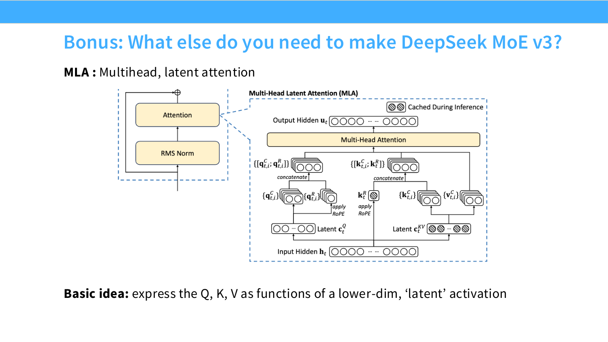

### 讲解

**彩蛋与延伸：除了 MoE，构建 DeepSeek-V3 还缺什么？**
答案是：**MLA (Multi-head Latent Attention，多头潜变量注意力)**。

在之前的课中我们学到，为了加速推理，大模型会使用 GQA 减少 KV Cache 的开销。但 GQA 依然需要为每个 Key 和 Value 头缓存一个与序列长度成正比的向量。
DeepSeek-V3 彻底推翻了这一做法，设计了 MLA。其核心思想是：利用**低秩投影（Low-rank Projection）**，将 Key 和 Value 的向量压缩进一个非常窄的共享“隐空间”（Latent Space）向量 $c_t^{\text{KV}}$ 中：
$$c_t^{\text{KV}} = \text{DownProj}(h_t)$$
在自回归生成时，我们**只需要在 KV Cache 中缓存这一极窄的隐表征 $c_t^{\text{KV}}$ 即可**。其维度非常小，能比 GQA 额外节省数倍的显存！
在计算注意力时，我们再通过矩阵乘法，动态地从隐表征中解压恢复出每个头对应的 Key 和 Value 特征。这使得推理带宽瓶颈被彻底解决。

### 补充图片

---

## Slide 58

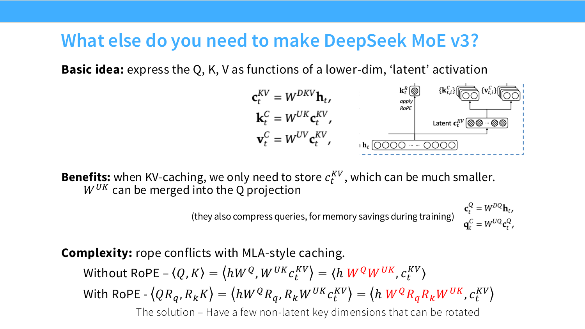

### 讲解

**MLA 如何与旋转位置编码（RoPE）进行兼容？**

在数学推导上，如果直接在低秩压缩后的特征上做矩阵乘法，由于解压投影矩阵 $W_{\text{UK}}$ 可以直接与 Query 的解压投影矩阵进行算子融合：
$$q_t^T k_s = \left( h_t W_Q \right)^T \left( W_{\text{UK}} c_s^{\text{KV}} \right) = h_t^T \left( W_Q W_{\text{UK}} \right) c_s^{\text{KV}}$$
我们根本不需要在显存中展开 Key 矩阵，可以直接进行相乘。

然而，一旦引入了位置编码（RoPE），旋转矩阵 $R_{i-j}$ 是与位置索引强绑定的，它无法穿透并移出投影矩阵 $W_{\text{UK}}$：
$$q_t^T R_{t-s} k_s \neq h_t^T R_{t-s} (W_Q W_{\text{UK}}) c_s^{\text{KV}}$$
这导致位置旋转操作会强行打断 MLA 的算子融合，逼迫推理引擎在显存中解压出完整的 Key 矩阵，功亏一篑。

**DeepSeek 的天才解决方案是：解耦位置编码（Decoupled RoPE）**。
MLA 将 Key 和 Value 拆分成两个并行通道：
1. **潜变量通道（Latent channel）**：完全不加任何位置编码，这部分通过低秩压缩，在推理时实现完美的低访存算子融合。
2. **位置通道（Position channel）**：使用极窄的几个专用维度，专门在其上施加 RoPE 旋转编码。
在计算自注意力时，将这两部分计算出来的注意力得分直接相加。这一巧妙的解耦设计完美实现了“既享受 RoPE 的长文本外推，又享受低秩压缩的极速访存”。

---

## Slide 59

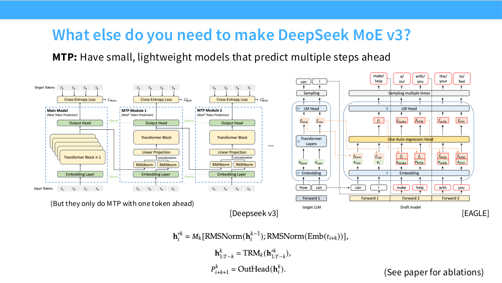

### 讲解

**另一个助力 DeepSeek-V3 推理的黑科技：MTP (Multi-Token Prediction，多 Token 预测)**。

在标准的自回归生成中，模型每次只能串行生成一个 Token。而在 MTP 架构中，模型被设计为**在同一个前向传播步骤中，同时预测未来连续的多个 Token**（例如预测 $x_{t+1}$ 和 $x_{t+2}$）。

如图所示，MTP 通过引入轻量级的预测头（Prediction Heads）和自适应的跨度表征共享，能够在不显著增加模型体积的前提下，为自回归生成提供极佳的推测解码（Speculative Decoding）支持。在线上推理服务中，这能带来接近 2 倍的实际生成速度提升。

### 补充图片

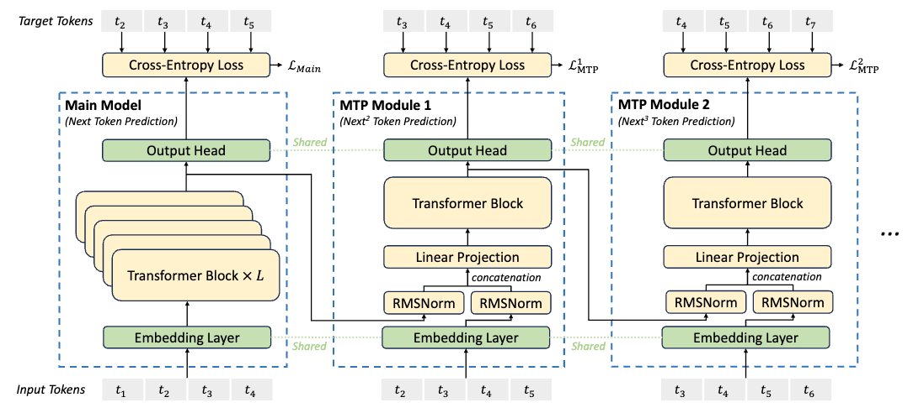

---

## Slide 60

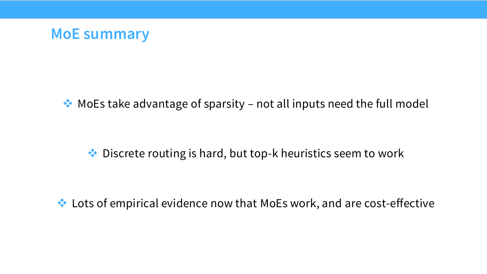

### 讲解

本页是 **MoE 及整个第四讲的总结**：

1. **MoE 充分压榨了稀疏性红利**：通过条件计算，使得模型能够拥有千亿至万亿级的海量知识库，同时在运行时只激活其中一小部分参数，完美突破了稠密模型算力与规模同等膨胀的死结。
2. **启发式路由是当前最优解**：虽然 RL 路由和全局规划在理论上很有吸引力，但在实际工程中，基于 $\text{Top-K}$ 的 Token Choice Heuristics 配合诸如无辅助负载均衡、细粒度与共享专家等架构创新，已被证明是极易收敛且最易获得极佳加速的方案。
3. **大量的实证证据表明 MoE 具有无与伦比的性价比**：无论是在预训练计算开销（FLOPs）、下游任务评测表现还是线上推理的部署成本上，MoE 都已展示出对稠密模型的代际替代趋势。掌握 MoE 的基本原理与优化细节，是构建新一代顶尖语言模型从业者的核心竞争力。

