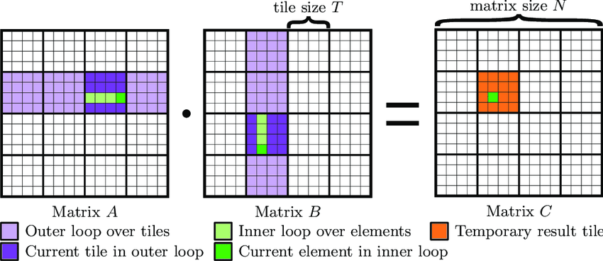

# Lecture 6: GPU Kernels & Triton (GPU 内核与 Triton 编程) 深度笔记

本笔记基于斯坦福 CS336 (Language Modeling from Scratch) 第六讲的课堂内容整理，深入剖析大模型系统优化中至关重要的 **GPU 编程与 Triton 内核开发**。内容涵盖 GPU 硬件架构与执行模型（线程束、占用率、银行冲突、内存合并与波次量化）、基准测试与性能分析（Benchmarking & Profiling）、编译优化（算子融合）、Triton 编程框架与 PTX 汇编分析，并以 GeLU（逐元素操作）、Softmax（行内规约）、Row Sum（超大行规约）以及 Tiled MatMul + ReLU（二维分块与内核融合）为例，展示如何从零构建高性能 GPU 计算内核。

> **课程信息**：CS336 · Spring 2026 · 主题：GPU Programming, Benchmarking, Profiling & Triton Kernels

---

# Part 1: GPU Hardware & Programming Model (GPU 硬件架构与编程模型)

## Slide 1: Announcements & Recap (课程安排与回顾)

### 讲解

上节课我们探讨了 GPU 和大规模并行计算系统的宏观架构。这节课我们的目标是深入底层：**学会如何对代码进行基准测试和性能分析（Benchmarking & Profiling），并掌握使用 Triton 编写自定义计算内核的能力。**

了解系统性能需要打通以下链路：
1. **编程模型（Programming Model）**：PyTorch -> Triton -> CUDA -> PTX 汇编，这为我们提供了开发内核并确保计算正确性的抽象手段。
2. **硬件特性（Hardware Details）**：SM 数量、线程束（Warp）、占用率（Occupancy）、共享内存银行冲突（Bank Conflict）以及内存合并（Coalescing）等。只有理解硬件物理机制，才能真正优化出逼物理极限的性能。

---

## Slide 2: GPU Hardware Specs (A100, H100, B200 硬件规格比较)


| 硬件指标 | A100 | H100 | B200 |
|---|---|---|---|
| **SM 数量 (Streaming Multiprocessors)** | 108 | 132 | 148 |
| **每个 SM 的寄存器大小 (Registers)** | 256 KB | 256 KB | 256 KB |
| **每个 SM 的 L1 缓存 + 共享内存** | 192 KB | 256 KB | 256 KB |
| **L2 缓存总大小** | 40 MB | 50 MB | 96 - 126 MB |
| **显存大小 (HBM)** | 80 GB | 80 GB | 192 GB |
| **寄存器带宽 (Register Bandwidth)** | ~116 TB/s | ~401 TB/s | ~447 TB/s |
| **L1 缓存 + 共享内存带宽** | ~19 TB/s | ~33 TB/s | ~19 TB/s |
| **L2 缓存带宽** | ~5-8 TB/s | ~12 TB/s | ~9 TB/s |
| **显存带宽 (HBM Bandwidth)** | 2 TB/s | 3.35 TB/s | 8 TB/s |

*注：NVIDIA B200 芯片中还新增了特殊的**张量显存（TMEM, Tensor Memory）**，专门用于加速 Tensor Core，它位于寄存器和共享内存之间，对普通程序员不可见。*

---

## Slide 3: CUDA Programming Model (CUDA 网格、线程块与线程层次)


### 讲解

为了让程序员控制数十万个计算单元，CUDA 建立了三级计算抽象：
- **线程 (Thread)**：执行代码的最基本单位。对于逐元素操作（如 GeLU），每个线程处理一个数据元素是最自然的映射（例如 $`f(i)`$ 对于 $`i=0,\dots,N-1`$）。
- **线程块 (Thread Block / CTA, Concurrent Thread Array)**：一组协同运行的线程集合。
  - **重要特性**：属于同一个线程块的线程可以共享同一块**高速共享内存（Shared Memory / L1 缓存）**，并在此进行快速通信和数据同步。
  - **硬件映射**：每个线程块在调度时必须被完整分配到**同一个 SM** 上执行。
- **网格 (Grid)**：由多个独立的线程块组成的集合，代表整个计算任务。

在 H100 和 B200 中，CUDA 还引入了**线程块群（Thread Block Cluster）**的概念，允许不同线程块之间通过分布式共享内存（Distributed Shared Memory）进行跨 SM 的高速数据交换。

---

## Slide 4: GPU Execution Details: Warps & Control Divergence (线程束 warp 与控制分歧)

### 讲解

虽然线程块是程序员眼中的逻辑管理单位，但 GPU 硬件在 SM 内部真正的基本调度单位是**线程束（Warp）**。
- **线程束 (Warp)**：固定由 **32 个线程**组成。例如，若一个线程块包含 64 个线程，硬件会将其划分为 2 个 Warps。
  ```math
  | T_0, T_1, \dots, T_{31} | \quad | T_{32}, T_{33}, \dots, T_{63} |
  ```
- **单指令多线程（SIMT）**：一个 Warp 内的 32 个线程必须在同一时间执行完全相同的硬件指令。
- **控制分歧 (Control Divergence)**：如果 Warp 内部遇到了条件分支语句（如 `if-else`），且部分线程走 `if` 另一部分走 `else`，硬件将不得不**串行化**执行这两个分支：
  - 步骤 1：屏蔽走 `else` 的线程，仅让走 `if` 的线程执行。
  - 步骤 2：屏蔽走 `if` 的线程，让走 `else` 的线程执行。
  - **后果**：这会导致严重的计算单元空转，因此应尽量避免在计算密集的 GPU 代码中使用基于不同线程索引的复杂条件分支。

---

## Slide 5: Warp Occupancy (线程束占用率计算)

### 讲解

每个 GPU 的 SM 包含的计算硬件资源（寄存器、共享内存、并发线程束上限）是固定的。**占用率（Occupancy）**定义为：SM 上当前处于活跃状态的线程束数量占该 SM 支持的最大并发线程束数量的比例。

#### **占用率估算实例**
- **硬件指标**：假设单 SM 最大支持寄存器数为 $`65,536`$（$`64\text{ KB}`$，每条寄存器 32-bit），单 SM 最大支持活跃线程束为 $`64`$ 个（即 $`2048`$ 个线程）。
- **任务超参数**：我们编写了一个内核，设置每个线程块包含 $`128`$ 个线程，而由于代码逻辑较复杂，编译器分配给每个线程需要消耗 $`160`$ 个寄存器。
- **计算过程**：
  1. 每个线程块需要的总寄存器数：
     ```math
     \text{Registers per block} = 128 \text{ 线程} \times 160 = 20,480 \text{ 个}
     ```
  2. 单个 SM 最多能够容纳的线程块数量（受限于寄存器总量限制）：
     ```math
     \text{Max blocks per SM} = \lfloor 65536 / 20480 \rfloor = 3 \text{ 个线程块}
     ```
  3. 此时 SM 上运行的活跃线程数和线程束数：
     ```math
     \text{Active threads} = 3 \text{ 块} \times 128 = 384 \text{ 线程} \implies \text{Active warps} = 384 / 32 = 12 \text{ 个 Warps}
     ```
  4. 最终的 SM 线程束占用率（Warp Occupancy）：
     ```math
     \text{Occupancy} = 12 / 64 = 18.75\%
     ```

*注：低占用率并不一定代表性能差。通过**线程粗化（Thread Coarsening）**——即每个线程依次处理多个元素，虽然降低了占用率，但每个线程的计算效率和指令级并行度（ILP）可能更高，这也是性能调优时的重要权衡点。*

---

## Slide 6: Bank Conflicts & Memory Coalescing (SRAM 共享内存银行冲突与 HBM 内存合并)

### 讲解

#### **1. 共享内存银行冲突 (Bank Conflicts)**
GPU 内部的共享内存（Shared Memory）是以极高带宽运作的 SRAM，为了实现并发访问，它被均匀分划为 **32 个独立的 Banks**，每个 Bank 宽 4 字节（对应 FP32 的大小）：
```math
\text{Banks: } B_0, B_1, B_2, \dots, B_{31}
```
- **理想情况**：当一个 Warp 内的 32 个线程在同一时钟周期发起访存，且各自访问的地址正好映射到 32 个**不同**的 Banks 时，访存可在 1 周期内并发完成。
- **银行冲突**：如果多于 1 个线程试图同时访问同一个 Bank 中的不同内存地址，这些访问将被迫**串行化**（Serialized），即发生银行冲突（如 2-way、32-way 冲突）。
- **解决方案**：在访问矩阵数据时，常使用 **Scribbling / Swizzling（地址变换，例如行列索引做 XOR）**重新组织共享内存中数据的排布，从而避开周期性的银行冲突。

#### **2. 全局显存合并访问 (Memory Coalescing)**
当 GPU 线程从全局显存（HBM）存取数据时，如果一个 Warp 内相邻的线程所访问的内存地址在物理上是连续的（如 $`T_0`$ 读 `A[0]`，$`T_1`$ 读 `A[1]`），硬件会将这 32 次请求合并为一次 128 字节大小的 Cache Line 事务。
- **最佳状态**：完全合并（Fully Coalesced），1 次 HBM 事务满足整个 Warp。
- **最差状态**：非合并连续访问，可能需要发起 32 次独立的硬件请求，访存带宽将雪崩式下降。

---

## Slide 7: Block Occupancy & Wave Quantization (线程块占用率与波次量化问题)


### 讲解

除了 SM 内部的 Warp 占用率，在 GPU 整体调度中，线程块被分配到各 SM 上执行时，是以“波次”（Waves）的形式进行的。
- **波次量化问题 (Wave Quantization / Tail Effect)**：
  - 假设我们在一块拥有 $`148`$ 个 SM 的 B200 GPU 上进行运算。
  - 如果我们的 Grid 中包含 $`160`$ 个线程块。
  - 第一波（First Wave）：硬件在 $`148`$ 个 SM 上并发拉起前 $`148`$ 个线程块进行计算。
  - 第二波（Second Wave）：剩下的 $`12`$ 个线程块被分配到其中 $`12`$ 个 SM 上运行，而剩下的 $`136`$ 个 SM 将会处于**完全闲置（Idle）**状态！
  - **调优策略**：在设置 Grid 大小时，应尽量让总线程块数量能够整除 GPU 的 SM 数量（或者是其整数倍），以避免最后一波尾部效应造成的计算资源浪费。

---

# Part 2: Benchmarking & Profiling (性能测试与性能分析)

## Slide 8: Benchmarking Principles (基准测试原理与自定义 CUDA 计时)

### 讲解

性能调优的一般步骤为：**基准测试与分析 -> 瓶颈定位 -> 代码修改 -> 重新基准测试**。

由于 GPU 的异步执行机制，直接在 CPU 端使用 `time.time()` 进行计时，仅能测量到任务的发射（Launch）耗时，而非真实计算耗时。
为了捕获真实的稳态运行表现，我们需要：
1. 进行多次**预热（Warmup Runs）**，排除内核编译与初始化的延迟。
2. 在核心代码执行前、后，插入 **CUDA 事件（CUDA Events）**。
3. 显式调用 `torch.cuda.synchronize()` 阻塞 CPU，等待 GPU 计算全部落盘后再进行时间核算。

#### **Python 计时实现**
```python
def benchmark(run: Callable, num_warmups: int = 1, num_trials: int = 3) -> float:
    # 1. 预热，捕获稳态表现
    for _ in range(num_warmups):
        run()
    torch.cuda.synchronize()

    times: list[float] = []
    # 2. 多次测试，消除方差
    for trial in range(num_trials):
        start_event = torch.cuda.Event(enable_timing=True)
        end_event = torch.cuda.Event(enable_timing=True)

        start_event.record()  # 记录开始
        run()                 # 执行 GPU 运算
        end_event.record()    # 记录结束

        torch.cuda.synchronize() # 强制同步，保证 end_event 已写入
        times.append(start_event.elapsed_time(end_event)) # 单位为毫秒

    return sum(times) / len(times)
```

---

## Slide 9: Profiling with PyTorch (PyTorch Profiler 与 Nsight 分析)

### 讲解

当我们知道一段代码运行缓慢后，需要通过 **Profiler** 定位耗时模块。
PyTorch 提供了 `torch.profiler` 接口，能够方便地追踪 GPU 执行的每个具体算子名称：

```python
def profile(run: Callable, num_warmups: int = 1):
    # 预热
    for _ in range(num_warmups):
        run()
    torch.cuda.synchronize()

    # 启动 Profiler 捕获 CUDA 活动
    with torch.profiler.profile(
        activities=[ProfilerActivity.CUDA],
        experimental_config=torch._C._profiler._ExperimentalConfig(verbose=True)
    ) as prof:
        run()
        torch.cuda.synchronize()

    table = prof.key_averages().table(sort_by="cuda_time_total", max_name_column_width=100, row_limit=10)
    return table
```

#### **解读底层内核名称**
通过分析生成的 Profile Table，我们可以读取到底层被调用的 CUDA/Triton 内核物理全称，例如：
`cutlass3x_sm100_simt_sgemm_f32_f32_f32_f32_f32_64x64x16_1x1x1_3_nnn_align1_bi...`
- `cutlass`：表明使用的是 NVIDIA 官方的高性能线性代数模板库 CUTLASS。
- `sm100`：映射了当前的 GPU 硬件微架构（此处为 Blackwell，即 B200 芯片）。
- `f32`：处理的数据格式为 Single Precision (float32)。
- `64x64x16`：对应 GEMM 的三维分块大小（BLOCK_M, BLOCK_N, BLOCK_K）。

---

## Slide 10: Naive vs Built-in vs Compiled GeLU (从 GeLU 实例理解算子融合)

### 讲解

#### **GeLU 激活函数的三种 PyTorch 实现**
1. **Naive Scratch 版本**：基于公式在 Python 中直接写出，包含多个独立的 Elementwise 操作：
   ```python
   def naive_gelu(x: torch.Tensor):
       return 0.5 * x * (1 + torch.tanh(0.79788456 * (x + 0.044715 * x * x * x)))
   ```
2. **Built-in 版本**：PyTorch C++ 内部高度优化的内置函数：
   ```python
   def builtin_gelu(x: torch.Tensor):
       return torch.nn.functional.gelu(x, approximate="tanh")
   ```
3. **Compiled 版本**：利用 PyTorch 2.0+ 编译器 `torch.compile` 对 naive 函数进行即时（JIT）编译：
   ```python
   compiled_gelu = torch.compile(naive_gelu)
   ```

#### **性能对比与瓶颈分析**
在 $`16384 \times 16384`$ 维度的张量上进行基准测试，会发现 **Built-in 和 Compiled 版本比 Naive 版本速度快数倍**！

分析 Profiler 结果我们可以得出根本原因：
- **Naive 实现（未融合）**：每一项小运算（加法、三次方、tanh 等）都是独立的 PyTorch 内核。运行每一项小运算时，GPU 都需要从全局显存（HBM）中读取张量，运算后写回 HBM，这会产生频繁的 HBM 访存操作。前面已经计算过，Elementwise 运算是极度内存受限的，频繁读写 HBM 造成了巨大的带宽浪费。
- **Built-in / Compiled 实现（算子融合 - Kernel Fusion）**：编译器将整个 GeLU 的复杂公式打包成了**单个计算内核（Fused Kernel）**。GPU 只需要将原始输入读取到核心寄存器，在核心内部连续进行所有的乘、加、指数、除法计算，然后将最终结果写回 HBM。全程只需要 1 次读和 1 次写，访存带宽开销降到了最低。
- `torch.compile` 底层正是使用了 **Triton** 作为自动生成融合内核的编译器。

---

# Part 3: Triton Programming & Elementwise Kernels (Triton 编程基础与逐元素内核)

## Slide 11: Triton Programming Model (Triton 线程块级别的抽象)

### 讲解

**Triton** 是 OpenAI 开发的高性能并行计算编程框架。相比于传统的 CUDA 编程，Triton 引入了极具变革性的抽象：

| 维度 | CUDA (NVIDIA) | Triton (OpenAI) |
|---|---|---|
| **基本抽象单元** | **线程 (Thread)** 级别。需要显式管理每个线程的 ID、共享内存分配、线程同步与线程束掩码（Warp Sync）。 | **线程块 (Thread Block)** 级别。程序员定义整个线程块的数据存取与分块代数计算，具体的线程分工和硬件同步由 Triton 编译器自动处理。 |
| **编程难度** | 极高，容易因 shared memory 同步不当导致数据竞争（Race Condition）或死锁。 | 较低，通过简单的 Python API 编写类似 PyTorch 的块级操作。 |
| **执行模式** | 在共享内存中进行极细粒度同步。 | 核心哲学：读取整块数据到本地存储 -> 进行融合计算 -> 写回全局显存。 |

---

## Slide 12: Triton GeLU Implementation (Triton 编写 GeLU 内核)

### 讲解

以下是使用 Triton 实现 GeLU 计算的完整 Python 代码。每个程序实例（Program ID）对应处理一个数据块（Block）：

```python
import triton
import triton.language as tl

@triton.jit
def triton_gelu_kernel(x_ptr, y_ptr, num_elements, BLOCK_SIZE: tl.constexpr):
    # 1. 获取当前线程块的逻辑 ID
    pid = tl.program_id(axis=0)
    
    # 2. 计算当前块负责的数据起始索引
    start = pid * BLOCK_SIZE
    
    # 3. 构造该块处理的数据偏移量指针矩阵
    offsets = start + tl.arange(0, BLOCK_SIZE)
    
    # 4. 边界保护掩码，防止数组越界访问
    mask = offsets < num_elements
    
    # 5. 从全局显存加载数据到 SM 寄存器中
    x = tl.load(x_ptr + offsets, mask=mask)
    
    # 6. 核心计算 (在寄存器中高效融合进行)
    # 因为 Triton 语言中不直接包含 tl.tanh，我们利用指数定义重写：
    # tanh(a) = (exp(2a) - 1) / (exp(2a) + 1)
    a = 0.79788456 * (x + 0.044715 * x * x * x)
    exp_val = tl.exp(2 * a)
    tanh_val = (exp_val - 1) / (exp_val + 1)
    y = 0.5 * x * (1 + tanh_val)
    
    # 7. 将最终计算好的融合结果存回全局显存
    tl.store(y_ptr + offsets, y, mask=mask)


def triton_gelu(x: torch.Tensor):
    assert x.is_cuda and x.is_contiguous()
    y = torch.empty_like(x)
    num_elements = x.numel()
    
    # 配置计算网格 (划分出 num_blocks 个线程块)
    BLOCK_SIZE = 1024
    num_blocks = triton.cdiv(num_elements, BLOCK_SIZE)
    
    # 启动 Triton 内核
    kernel = triton_gelu_kernel[(num_blocks,)](
        x, y, num_elements, BLOCK_SIZE=BLOCK_SIZE
    )
    return y
```

---

## Slide 13: Triton Compilation to PTX (Triton 编译产物 PTX 汇编代码分析)

### 讲解

Triton 将 Python 代码编译成中间语言，并最终生成 NVIDIA GPU 专用的硬件级汇编语言 —— **PTX (Parallel Thread Execution)**。

可以通过打开生成的汇编日志（[triton_gelu-ptx.txt](file:///Users/bruis/Documents/Obsidian%20Vault/CS336/Lecture_06/var/triton_gelu-ptx.txt)）来洞悉底层的真实指令流：
- **全局读取与写入**：汇编中会出现类似的全局搬运指令：
  - `ld.global.v4.b32`：以向量形式（1 周期并行载入多个 32-bit 元素）从 HBM 载入数据到寄存器。
  - `st.global.v4.b32`：将计算完的向量数据存回 HBM。
- **硬件寄存器映射**：
  - `%f*` 代表单精度浮点数寄存器，所有的 GeLU 数学指令均在寄存器层并发进行。
  - `%ctaid.x`：硬件级 Block 索引（即 `program_id(0)`）。
  - `%tid.x`：硬件级 Thread 索引。
- **线程粗化 (Thread Coarsening)**：Triton 编译器在最终生成硬件代码时，会自动进行线程合并。例如，每个线程同时串行处理 8 个相邻的元素，以减少内核循环开销并提升指令级并行度（ILP）。

---

# Part 4: Row-wise Reduction Kernels (行规约内核实现：Softmax)

## Slide 14: Softmax Bottlenecks (Softmax 行规约的内存瓶颈)

### 讲解

在自注意力机制中，Softmax 会对特征矩阵的每一行做规约操作：
```math
y_{ij} = \frac{e^{x_{ij} - \max_k x_{ik}}}{\sum_k e^{x_{ik} - \max_k x_{ik}}}
```

#### **朴素 Softmax（多内核未融合）的 HBM 读写开销分析**
设矩阵形状为 $`M \times N`$（$`M`$ 行，$`N`$ 列）：
1. **第一步（求最大值）**：需要从 HBM 读取整个矩阵（$`MN`$ 次 reads），在行内算最大值，写入行最大值向量（$`M`$ 次 writes）。
2. **第二步（减最大值）**：再次读取矩阵（$`MN`$ 次 reads）和行最大值向量（$`M`$ 次 reads），做减法，写入中间矩阵（$`MN`$ 次 writes）。
3. **第三步（指数化）**：读取中间矩阵（$`MN`$ 次 reads），计算 $`e^x`$，写入分子矩阵（$`MN`$ 次 writes）。
4. **第四步（累加求和）**：读取分子矩阵（$`MN`$ 次 reads），行内累加，写入分母向量（$`M`$ 次 writes）。
5. **第五步（除法归一）**：读取分子矩阵（$`MN`$ 次 reads）和分母向量（$`M`$ 次 reads），计算除法，写回输出（$`MN`$ 次 writes）。

- **总 HBM 读写开销**：
  - **总读取量**：$`5MN + 2M`$ 字节
  - **总写入量**：$`3MN + 2M`$ 字节
- **瓶颈所在**：Softmax 的每一步都是内存受限任务。如果不进行算子融合，大部分训练时间都将浪费在显存与 SM 的往返拷贝上。
- **优化设想**：如果能实现 **Fused Softmax**，整个操作只需要把矩阵的每一行从 HBM 载入 1 次，在 SM 内部的高速缓存/寄存器中一口气算出最大值、指数、累加和以及归一化结果，然后写回 HBM。此时**读取仅需 $`1MN`$ 次，写入仅需 $`1MN`$ 次**，性能理论上能提升数倍。

---

## Slide 15: Triton Fused Softmax Kernel (Triton 融合 Softmax 编程实现)


### 讲解

在 [Triton fused softmax tutorial](https://triton-lang.org/main/getting-started/tutorials/02-fused-softmax.html) 中，我们利用 Triton 的优势实现了上述构想。这里由于每一行的数据大小（列数 $`N`$）可以被放进单块共享内存（例如 $`N \le 1024`$），我们将**每一行映射为一个线程块（Grid 大小为 $`M`$）**：

```python
@triton.jit
def triton_softmax_kernel(x_ptr, y_ptr, x_row_stride, y_row_stride, num_cols, BLOCK_SIZE: tl.constexpr):
    # 确保当前列数不超过线程块最大容量
    assert num_cols <= BLOCK_SIZE

    # 1. 每一个 block 负责独立处理矩阵的一行
    row_idx = tl.program_id(0)
    col_offsets = tl.arange(0, BLOCK_SIZE)

    # 2. 计算当前行在 HBM 中的物理首地址指针并载入
    x_start_ptr = x_ptr + row_idx * x_row_stride
    x_ptrs = x_start_ptr + col_offsets
    
    # 若超出列数，使用 -inf 填充，使得 exp(-inf) = 0 不影响 softmax 结果
    x_row = tl.load(x_ptrs, mask=col_offsets < num_cols, other=float("-inf"))

    # 3. 寄存器内极速完成三步规约运算 (算子融合)
    x_row = x_row - tl.max(x_row, axis=0) # 减最大值防溢出
    numerator = tl.exp(x_row)             # 指数化
    denominator = tl.sum(numerator, axis=0) # 行内累加求和
    y_row = numerator / denominator       # 除法归一

    # 4. 将规约结果存回全局显存 (仅 1 次写回)
    y_start_ptr = y_ptr + row_idx * y_row_stride
    y_ptrs = y_start_ptr + col_offsets
    tl.store(y_ptrs, y_row, mask=col_offsets < num_cols)
```

---

# Part 5: Advanced Reduction: Row Sum (超大行规约内核：超块规约)

## Slide 16: Handling Row Exceeding Block Size (当整行超出线程块大小时的规约策略)

### 讲解

在 Fused Softmax 示例中，我们假定了一个大前提：**矩阵的列数 $`N`$ 足够小，导致整行能够完整装进一个线程块（Block）中。**

但在处理超长上下文或者大词汇表时，矩阵的列数可能极大（例如 $`N=16384`$ 甚至更大）。此时：
1. 共享内存大小（单 SM $`256\text{ KB}`$ 限制）无法一次性吃下整行。
2. 线程块的最大线程数限制（如 $`1024`$ 线程限制）使得无法进行一次性对齐。

#### **超大行分块规约策略 (Baby Tiling)**
为了解决这个问题，我们需要在行规约中引入分块迭代：
- **分块迭代 (Loop over Tiles)**：在同一个线程块内，用一个循环遍历一行的各个子区间（Tiles），每次加载 `BLOCK_SIZE` 大小的切片。
- **线程局部累加 (Thread Local Accumulation)**：每个线程在循环中自己累加自己负责的各个切片元素，更新到本地的局部累加器（`acc`）中。
- **块内最终规约 (Block-level Reduction)**：当循环结束后，整个 Block 的全部线程之间利用共享内存或 Warp Shuffle，进行最后的合并累加，将局部累加器的结果凝聚为最终的行标量，最后由主线程写入输出通道。

---

## Slide 17: Triton Row Sum Implementation (Triton 编写 Row Sum 内核)


### 讲解

下面的 Triton 内核实现了一个超大矩阵的行求和（Row Sum）运算。其展现了如何在 Triton 中使用循环机制来处理大维度行规约：

```python
@triton.jit
def row_sum_kernel(x_ptr, out_ptr, N, BLOCK_SIZE: tl.constexpr):
    # 每一个线程块对应处理矩阵的一行
    row = tl.program_id(0)

    # 1. 在每个线程的本地分配一个初始化为 0.0 的累加器
    acc = tl.zeros([BLOCK_SIZE], dtype=tl.float32)

    # 2. 在行内以 BLOCK_SIZE 为跨度进行切片循环迭代
    for start in range(0, N, BLOCK_SIZE):
        cols = start + tl.arange(0, BLOCK_SIZE)
        mask = cols < N
        
        # 载入当前切片 (如果越界，填充为 0.0)
        x = tl.load(x_ptr + row * N + cols, mask=mask, other=0.0)
        
        # 累加到线程局部存储中
        acc += x

    # 3. 将整个线程块内各线程的 acc 值通过 tl.sum 完成跨线程规约，合并为标量
    result = tl.sum(acc, axis=0)

    # 4. 由主线程写回该行的输出结果
    tl.store(out_ptr + row, result)


def triton_row_sum(x: torch.Tensor, BLOCK_SIZE: int = 1024) -> torch.Tensor:
    M, N = x.shape
    y = torch.empty(M, device=x.device, dtype=x.dtype)
    
    # 每一个 Block 负责处理一行，Grid 大小为 M
    row_sum_kernel[(M,)](x, y, N, BLOCK_SIZE=BLOCK_SIZE)
    return y
```

---

# Part 6: Tiled Matrix Multiplication (分块矩阵乘法与内核融合)

## Slide 18: Naive GEMM Bottlenecks (朴素 GEMM 的 HBM 读写瓶颈)

### 讲解

矩阵乘法（$`C = A B`$）是深度学习的核心支柱。在没有优化前，假设我们需要计算输出矩阵 $`C`$ 的每个元素。

#### **朴素矩阵乘法的执行模式**
对于任意的行 $`m`$ 和列 $`n`$，计算 $`C[m, n]`$：
- 对于 $`k = 0 \dots K-1`$：
  - 从 HBM 中读取 $`A[m, k]`$。
  - 从 HBM 中读取 $`B[k, n]`$。
  - 乘法累加：$`C[m, n] \mathrel{+}= A[m, k] \times B[k, n]`$。
- **显存访存量**：总共需要进行 $`M \times K \times N`$ 次读取以及 $`M \times N`$ 次写入。
- **算术强度**：
  ```math
  \text{AI} = \frac{\text{FLOPs}}{\text{Bytes}} \approx \frac{2MKN}{2 \times (MKN + MN)} \approx O(1) \text{ FLOP/Byte}
  ```
- 尽管这是一个巨大的乘法，但这种朴素算法让其算术强度退化到 $`O(1)`$，成为严重的**内存受限**任务，性能低下。
- **根本原因**：数据复用率（Data Reuse）太低。比如在计算相邻的 $`C[4, 0]`$ 和 $`C[4, 1]`$ 时，都需要用到 $`A`$ 矩阵的第 4 行元素（$`A_4`$ 系列），但朴素算法却从 HBM 中重复读取了这些元素。

---

## Slide 19: Shared Memory & Tiled GEMM (共享内存与分块 GEMM)



### 讲解

为了提高数据复用，必须利用**分块（Tiling）**机制，将数据预先搬运到高速共享内存中：
- **理想化方法**：将完整的 $`A`$ 和 $`B`$ 全部读入共享内存。读取次数降为 $`MK + KN`$。算术强度拉升到 $`O(N)`$。但遗憾的是，大矩阵的大小往往远超单 SM 共享内存的容量（仅数百 KB）。
- **实际分块（Tiling）策略**：
  - 将输出矩阵 $`C`$ 划分成大小为 `BLOCK_M` $`\times`$ `BLOCK_N` 的独立**输出分块（Output Tiles）**。每一个线程块（Thread Block）负责计算一个 Output Tile。
  - 在当前线程块内部，通过迭代循环，每次沿着 $`K`$ 维度载入 $`A`$ 的一个 Tile（`BLOCK_M` $`\times`$ `BLOCK_K`）和 $`B`$ 的一个 Tile（`BLOCK_K` $`\times`$ `BLOCK_N`）到共享内存中。
  - 在 SM 的寄存器/共享内存中执行分块乘法，并逐步累加到局部输出矩阵中。
  - 迭代完成后，将该 Tile 结果一次性写回 HBM。
  - **优势**：此时算术强度正比于 $`\text{O(tile\_size)}`$。只要分块大小设置得当，访存时间将被完全掩盖，使硬件性能逼物理算力天花板。
  - **算子融合（Kernel Fusion）红利**：在矩阵乘法写回 HBM 之前，可以直接在寄存器中顺便执行激活函数（例如 ReLU）。这相当于将激活函数（Elementwise，极度内存受限）无缝融入到 MatMul（计算受限）内核中，**直接消除了激活层的所有 HBM 读写延迟**。

---

## Slide 20: Triton MatMul + ReLU Kernel (Triton 编写 MatMul+ReLU 融合内核)

### 讲解

下面是使用 Triton 编写的一个完整的 **MatMul + ReLU 融合内核**。其核心逻辑是通过计算偏移量（Offsets）和步长（Strides）来实现二维空间分块访问：

```python
@triton.jit
def matmul_relu_kernel(
    a_ptr, b_ptr, c_ptr,    # 计算 c = a @ b
    M, N, K,                # 矩阵维度: a (M x K), b (K x N), c (M x N)
    stride_am, stride_ak,   # 用于定位矩阵 a 的步长 (Strides)
    stride_bk, stride_bn,   # 用于定位矩阵 b 的步长
    stride_cm, stride_cn,   # 用于定位矩阵 c 的步长
    BLOCK_M: tl.constexpr,
    BLOCK_N: tl.constexpr,
    BLOCK_K: tl.constexpr,
):
    # 1. 定位当前线程块负责计算输出矩阵 C 的哪一个 (m, n) 分块 (Tile)
    pid_m = tl.program_id(0)
    pid_n = tl.program_id(1)

    # 2. 构造分块内各元素对应的行列局部索引向量
    indices_m = pid_m * BLOCK_M + tl.arange(0, BLOCK_M)  # 局部行索引 [BLOCK_M]
    indices_n = pid_n * BLOCK_N + tl.arange(0, BLOCK_N)  # 局部列索引 [BLOCK_N]
    indices_k = tl.arange(0, BLOCK_K)                    # 局部相乘累加索引 [BLOCK_K]

    # 3. 构造指针矩阵：在二维空间中指向矩阵 a 和 b 的初始分块位置
    # 利用 indices_m[:, None] 和 indices_k[None, :] 广播出 [BLOCK_M, BLOCK_K] 的二维指针
    a_ptrs = a_ptr + indices_m[:, None] * stride_am + indices_k[None, :] * stride_ak
    b_ptrs = b_ptr + indices_k[:, None] * stride_bk + indices_n[None, :] * stride_bn

    # 4. 初始化累加器矩阵，尺寸为 [BLOCK_M, BLOCK_N]，在寄存器中存储浮点数
    acc = tl.zeros([BLOCK_M, BLOCK_N], dtype=tl.float32)

    # 5. 沿着维度 K 以 BLOCK_K 为步长做分块迭代
    for k in range(0, K, BLOCK_K):
        # 边界掩码：矩阵行/列不得越界且 K 维度累加进度 k + indices_k 不得越界
        a = tl.load(a_ptrs, mask=(indices_m[:, None] < M) & (indices_k[None, :] + k < K), other=0.0)
        b = tl.load(b_ptrs, mask=(indices_k[:, None] + k < K) & (indices_n[None, :] < N), other=0.0)
        
        # 块级矩阵点积乘加运算
        acc += tl.dot(a, b)
        
        # 将指针矩阵向 K 维度推进一个分块
        a_ptrs += BLOCK_K * stride_ak
        b_ptrs += BLOCK_K * stride_bk

    # 6. 【算子融合】在寄存器级别直接执行 ReLU 激活函数，完全无须访问 HBM
    acc = tl.maximum(acc, 0.0)

    # 7. 计算输出分块物理地址并将结果写入全局显存 (HBM)
    c_ptrs = c_ptr + indices_m[:, None] * stride_cm + indices_n[None, :] * stride_cn
    tl.store(c_ptrs, acc, mask=(indices_m[:, None] < M) & (indices_n[None, :] < N))
```
