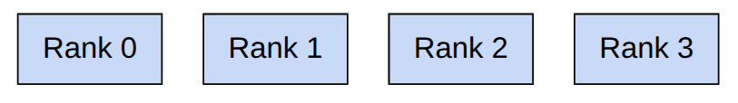

# Lecture 7: Parallelism & Distributed Training (分布式训练与并行计算) 深度笔记

本笔记基于斯坦福 CS336 (Language Modeling from Scratch) 第七讲的课堂内容整理，深入剖析大模型系统优化中至关重要的 **跨 GPU/多节点分布式训练与并行计算**。内容涵盖分布式硬件层级与互连技术（PCIe、NVLink、Infiniband、RDMA 与 NCCL）、分布式通信原语（Broadcast、Scatter、Gather、Reduce、All-Gather、Reduce-Scatter、All-Reduce 与 All-to-All）、通信带宽测试基准，以及数据并行（DDP）、张量并行（Tensor Parallelism / Megatron-LM）和流水线并行（Pipeline Parallelism）的经典原理与 PyTorch 底层代码实现。

> **课程信息**：CS336 · Spring 2026 · 主题：Parallelism (Data, Tensor & Pipeline Parallelism) & Distributed Communication

---

# Part 1: Hierarchical Hardware & Interconnects (分布式计算层级与硬件互连)

## Slide 1: Unifying Theme (数据传输瓶颈与多级分布式结构)


### 讲解

上节课我们探讨了单个 GPU 内部的并行计算与优化（如算子融合、共享内存分块等）。但这门课的终极目标是训练百亿、千亿甚至万亿参数规模的大模型。当面对如此庞大的模型时，我们不得不面临两个核心诉求：
1. **模型容量超出单卡上限**：模型的参数、优化器状态、梯度以及前向传播激活值所占的显存远远超过了单张 GPU 的最大容量（例如单卡 80GB）。
2. **算力效率需要水平扩展**：我们需要使用成百上千张 GPU 协同工作，提供海量的 FLOPs 算力来大幅缩短训练周期。

#### **分布式架构的核心矛盾**
无论是单卡内部，还是多卡、多节点之间，整个并行计算系统都遵循一个统一的主题：**计算单元（ALU/Tensor Core）的运行速度极快，而输入/输出（数据搬运）的传输带宽极慢。**
因此，分布式训练的本质是**精心编排计算与通信，以最大程度地规写和掩盖跨器件的数据传输瓶颈。**

#### **GPU 分布式层级结构**
从物理位置和互连媒介来看，分布式系统具有明显的金字塔层次（从最快到最慢）：
1. **单卡内部寄存器与共享内存（Registers / L1 Cache）**：带宽可达数十 TB/s 级别，极速，但容量仅为数百 KB。
2. **单卡 HBM 显存**：带宽可达数 TB/s（如 B200 显存带宽为 8 TB/s），容量为数十至上百 GB。
3. **单节点多卡互连（NVLink/NVSwitch）**：在同一个物理节点内部，GPU 之间通过高速 NVLink 总线互连（如 B200 NVLink 5.0 可达双向 1.8 TB/s 带宽），容量由 8 张卡共享。
4. **多节点跨网络互连（Infiniband / RDMA 级以太网）**：节点之间通过光纤网络交换机连接，带宽通常为数十至上百 GB/s（如单端口 400 Gbps Infiniband 约为 50 GB/s）。这是整个分布式系统中最慢的通道，也是分布式系统的终极瓶颈。

在单卡优化中，我们通过**算子融合（Kernel Fusion）和分块（Tiling）**来减少 HBM 访问；而在多卡优化中，我们必须通过**合理的分片（Sharding）和副本复制（Replication）**来尽量规写跨卡、跨网络节点的通信带宽开销。

---

## Slide 2: Distributed Communication Hardware (分布式互连硬件规格)

### 讲解

在分布式计算中，节点内部与节点之间的物理连接介质直接决定了分布式算法的设计上限。

#### **1. 节点内多卡互连**
- **PCIe 总线（经典家用/旧式服务器）**：在普通的 PC 或是低端服务器中，多张 GPU 通过主板上的 PCIe 插槽与 CPU 相连并互相通信。即使是目前最先进的 PCIe 7.0 (16 通道)，其理论最大带宽也仅为约 $`242 \text{ GB/s}`$。并且所有跨卡通信都需要经过 PCIe 控制器甚至 CPU 内存的中转，效率极低。
- **NVLink & NVSwitch（现代数据中心）**：NVIDIA 专门为 GPU 跨卡点对点通信设计的高速总线。在典型的 8 卡物理节点（Node）内，所有 GPU 均通过 NVLink 直接连接到板载的 NVSwitch 芯片。B200 GPU 配备的 NVLink 5.0 能够提供高达双向 **$`1.8 \text{ TB/s}`$** 的物理带宽，这让 节点内的跨卡访存速度开始逼近单卡显存速度，极大解放了多卡协同的屏障。

#### **2. 跨节点网络互连**
- **以太网 (Standard Ethernet)**：在普通局域网或云环境中，不同服务器之间通过标准的 TCP/IP 以太网进行通信。其带宽通常仅为数 Gbps（约数百 MB/s），延迟极高，完全无法支撑大模型的并行训练。
- **无限带宽技术 (Infiniband / IB 网卡)**：专为高性能计算（HPC）设计的网络互连技术。每个节点插有专用的 IB 网卡（HCA），通过高规格的 Infiniband 交换机和光纤互连，单端口带宽可达 $`400 \text{ Gbps}`$（约 $`50 \text{ GB/s}`$）或更高，并具有微秒级的极低延迟。
- **现代集群拓扑**：
  - **8卡节点**：节点内部 8 张 GPU 通过 NVLink 满速互连。
  - **Pod 级集群**：通常将 256 个节点（2048 张 GPU）作为一个物理 Pod，节点间全部插满 Infiniband 网卡，通过 IB 交换机网络建立极高速的网络互连（可达 $`50 \text{ GB/s}`$ 带宽）。
  - **集群/数据中心级**：多个 Pod 之间通过更高层级的以太网交换机连接，这部分通信最慢。

---

## Slide 3: Remote Direct Memory Access (RDMA 显存直接读取技术)

### 讲解

在传统的 TCP/IP 网络传输中，数据要从一台主机的显存发送到另一台主机的显存，需要经历极为繁琐的 CPU 中转（CPU 绕行痛点）：
1. 显存数据复制到系统 CPU 内存空间。
2. 操作系统 kernel 申请 socket 缓冲区，并在 CPU 中构建 TCP 包头。
3. 将数据复制到网卡的环形缓冲区（Ring Buffer）。
4. 网卡将数据发送出网线。
- 这一过程会消耗大量的 CPU 算力，引入多次内存拷贝，并带来巨大的延迟。

#### **RDMA (Remote Direct Memory Access)**
**RDMA（远程直接内存访问）**允许一块网卡直接绕过 CPU，直接读取或写入远程节点 GPU 显存中的数据：
- **流程简化**：源 GPU 显存 -> 源网卡（通过 PCIe） -> 物理网络 -> 目标网卡 -> 目标 GPU 显存（通过 PCIe）。整个过程完全不需要双方 CPU 的任何干预与拷贝，极大地降低了通信延迟并榨干了物理网络带宽。

#### **RoCE (RDMA over Converged Ethernet)**
尽管 Infiniband 性能优异，但其硬件和交换机极其昂贵，且具有强烈的生态垄断性。
- **RoCE** 是一种允许在标准的以太网物理架构上运行 RDMA 协议的技术（利用无损以太网的优先级流量控制 PFC 等机制）。
- 它在物理上继承了以太网成本低、易于扩展的优势，在逻辑上又实现了类似 Infiniband 的免 CPU 直接访存。例如 Meta 建设的数十万卡 Grok 训练集群，便大规模采用了 RoCE 以太网技术来替代传统的 Infiniband 网络。

---

## Slide 4: NCCL - NVIDIA Collective Communication Library (NVIDIA 集合通信库)

### 讲解

大模型训练中的通信请求并不是散乱的点对点收发，而是具有高度结构化的多卡规约模式（如“所有卡求梯度均值”）。NVIDIA 推出了 **NCCL（NVIDIA Collective Communication Library）** 集合通信库，它是现代深度学习分布式框架（如 PyTorch Distributed）在 GPU 平台上的核心支撑。

#### **NCCL 的核心工作机制**
1. **自动硬件拓扑检测**：
   NCCL 在初始化时会动态检测当前集群的底层连接细节——例如当前 Node 内有几张卡，各卡是通过 NVLink 还是 PCIe 桥接连接；跨 Node 的网卡走的是哪条 IB 链路。
2. **通信路径自适应优化**：
   根据检测到的物理拓扑，NCCL 会自动构建出最优的逻辑通信拓扑。例如，在节点内部使用高速 NVLink **环形（Ring）拓扑**或**树形（Tree）拓扑**，而在跨节点通信时自动路由到对应的 Infiniband 网卡上。
3. **GPU Kernel 执行通信**：
   NCCL 的通信操作并不是由 CPU 线程驱动的，而是直接在 GPU 上启动特殊的 NCCL 通信 CUDA Kernels。这些 Kernels 跑在专用的 GPU 硬件流水线上，直接操作 GPU 寄存器将数据通过 NVLink 发送出去，实现通信与计算在硬件层面的极致重叠。

---

# Part 2: Collective Operations (分布式通信原语)

## Slide 5: Ranks & World Size (分布式编程基本概念)



### 讲解

在进行分布式编程时，我们通常使用 **SPMD（Single Program, Multiple Data）** 模式，即在所有的 GPU 卡上跑完全相同的 Python 脚本代码，但每张卡由于拥有不同的身份标识，会分配处理不同的数据切片。

这里有两个最基础的逻辑定义：
- **Rank**：分配给特定计算设备/GPU 的唯一逻辑编号（从 0 开始的整数）。在一个包含 4 张 GPU 的任务中，各卡的逻辑 Ranks 分别为 `0`、`1`、`2`、`3`。
- **World Size**：当前分布式计算任务所使用的总物理设备/GPU 的数量。在上述例子中，`World Size = 4`。

集合通信（Collective Operation）是指在一个由多张 GPU 组成的通信组（Process Group / Communicator）内，全体成员以高度协同的确定性步骤进行数据收发。这比程序员自己手写繁琐的 `send` 和 `recv` 点对点接口要更加稳定，且 NCCL 内部对集合原语进行了极致的硬件级网络优化。

---

## Slide 6: Basic Collective Operations (Broadcast, Scatter, Gather & Reduce 基础通信原语)

### 讲解

我们首先来看集合通信中的四类基础原语，它们是构建更复杂分布式模式的基石。在以下示意中，我们假设 `World Size = 4`，源数据最初位于 `Rank 0`：

#### **1. Broadcast (广播)**
- **行为**：将 `Rank 0` 上的一份张量数据复制并发射到所有的 Ranks 上。
- **数据结构演变**：
  - **输入**：`Rank 0` 持有数据 `[A]`。
  - **输出**：`Rank 0, 1, 2, 3` 均持有数据 `[A]`。
- **典型应用**：在训练开始或加载 Checkpoint 时，由 `Rank 0` 加载模型权重，然后通过 Broadcast 将权重分发同步到所有其他卡上。

#### **2. Scatter (散播)**
- **行为**：将 `Rank 0` 上的一个大张量沿着指定维度（通常是 Batch 维度或 Feature 维度）均匀切分为 $`W`$ 份（$`W = \text{World Size}`$），然后将第 $`i`$ 份分发给 `Rank i`。
- **数据结构演变**：
  - **输入**：`Rank 0` 持有大张量 `[A, B, C, D]`。
  - **输出**：`Rank 0` 得到 `[A]`；`Rank 1` 得到 `[B]`；`Rank 2` 得到 `[C]`；`Rank 3` 得到 `[D]`。
- **作用**：常作为分布式切片加载的中间过渡步骤。

#### **3. Gather (收集)**
- **行为**：与 Scatter 互为逆操作。将所有 Ranks 上的局部小张量按顺序拼接收集到 `Rank 0` 上，组成一个完整的大张量。
- **数据结构演变**：
  - **输入**：`Rank 0` 持有 `[A]`；`Rank 1` 持有 `[B]`；`Rank 2` 持有 `[C]`；`Rank 3` 持有 `[D]`。
  - **输出**：`Rank 0` 收集到完整大张量 `[A, B, C, D]`，其余 Ranks 无输出或保留原局部值。

#### **4. Reduce (规约)**
- **行为**：将所有 Ranks 上的局部张量进行某种结合律/交换律数学操作（例如 `SUM` 求和、`MIN` 极小值、`MAX` 极大值），并将最终合并出来的单一规约结果保存在 `Rank 0` 上。
- **数据结构演变**：
  - **输入**：`Rank 0` 持有 `[0]`；`Rank 1` 持有 `[1]`；`Rank 2` 持有 `[2]`；`Rank 3` 持有 `[3]`。
  - **输出**（以 `SUM` 规约为例）：`Rank 0` 得到合并值 `[6]`（即 $`0 + 1 + 2 + 3`$）。

---

## Slide 7: Workhorse Collective Operations (All-Gather, Reduce-Scatter & All-Reduce)

### 讲解

在大模型预训练的实际分布式实现中，上面仅有 `Rank 0` 获得结果的原语并不够用，因为所有卡在计算后都需要最新的全局参数来进行下一步迭代。为此我们引入三类工业界最核心的“工作马”（Workhorse）原语：

#### **1. All-Gather (全收集)**
- **行为**：对所有 Ranks 执行 Gather 收集操作，并且**将收集到的完整拼接大张量分发到所有的 Ranks 上**。
- **数据结构演变**：
  - **输入**：`Rank 0: [A]`，`Rank 1: [B]`，`Rank 2: [C]`，`Rank 3: [D]`。
  - **输出**：所有 Ranks 均持有完整的拼接大张量 `[A, B, C, D]`。
- **应用场景**：在 Fully Sharded Data Parallel (FSDP / ZeRO-3) 或者是张量并行中，前向传播时各卡只持有参数的分片，需要发起 All-Gather 拼接出完整的权重来进行矩阵乘法。

#### **2. Reduce-Scatter (规约散播)**
- **行为**：对所有 Ranks 上的数据先进行全局规约操作（如 `SUM`），然后将规约后的完整大张量均匀切成 $`W`$ 份，第 $`i`$ 份分发给 `Rank i`。
- **数据结构演变**：
  - **输入**：每一张卡都拥有一个包含 4 个元素的向量：
    - `Rank 0: [0, 1, 2, 3]`
    - `Rank 1: [1, 2, 3, 4]`
    - `Rank 2: [2, 3, 4, 5]`
    - `Rank 3: [3, 4, 5, 6]`
  - **输出**（以 `SUM` 为例）：先做行级对应累加，得到 `[6, 10, 14, 18]`，再散播：
    - `Rank 0` 得到 `[6]`（第 0 维规约结果：$`0 + 1 + 2 + 3`$）
    - `Rank 1` 得到 `[10]`（第 1 维规约结果：$`1 + 2 + 3 + 4`$）
    - `Rank 2` 得到 `[14]`（第 2 维规约结果：$`2 + 3 + 4 + 5`$）
    - `Rank 3` 得到 `[18]`（第 3 维规约结果：$`3 + 4 + 5 + 6`$）
- **应用场景**：反向传播结束后，reduce-scatter会对所有rank上的梯度做对应位置的跨rank规约，然后规约后梯度分片分发给各个rank。每张卡保留自己负责的参数**==分片==**对应的、已经跨rank规约后的梯度。

#### **3. All-Reduce (全规约)**
- **行为**：对所有 Ranks 上的数据执行全局规约（如 `SUM`），并将最终的合并规约结果分发给所有的 Ranks。
- **爱因斯坦等价关系**：
  ```math
  \text{All-Reduce} \equiv \text{Reduce-Scatter} + \text{All-Gather}
  ```
- **数据结构演变**：
  - **输入**：同 Reduce-Scatter。
  - **输出**：所有 Ranks 均持有最终累加出的全局张量 `[6, 10, 14, 18]`。
- **应用场景**：经典数据并行（DDP）中，反向传播计算出梯度后，各卡发起 All-Reduce 同步全网梯度，以确保更新后的模型参数完全一致。

---

## Slide 8: All-to-All Operation (All-to-All 原语与混合专家模型数据路由)

### 讲解

`All-to-all` 是分布式计算中最通用、也是最复杂的通信原语。

#### **All-to-All 行为**
在 `All-to-all` 中，每个 Rank 都将自己的输入张量切分成 $`W`$ 份（$`W = \text{World Size}`$），并且将第 $`j`$ 份数据定向发送给 `Rank j`。相应地，每个 Rank 也会从其他所有 Ranks 接收一份对应的切片并进行拼接。

- **数据结构演变**（可看作是一个跨设备的**矩阵转置**操作）：
  - **输入**：
    - `Rank 0` 准备发送的切片：`[0, 1, 2, 3]`（分别发往 Rank 0, 1, 2, 3）
    - `Rank 1` 准备发送的切片：`[4, 5, 6, 7]`（分别发往 Rank 0, 1, 2, 3）
    - `Rank 2` 准备发送的切片：`[8, 9, 10, 11]`（分别发往 Rank 0, 1, 2, 3）
    - `Rank 3` 准备发送的切片：`[12, 13, 14, 15]`（分别发往 Rank 0, 1, 2, 3）
  - **输出**：
    - `Rank 0` 接收到：`[0, 4, 8, 12]`（来自 Rank 0, 1, 2, 3 的第 0 份数据）
    - `Rank 1` 接收到：`[1, 5, 9, 13]`（来自 Rank 0, 1, 2, 3 的第 1 份数据）
    - `Rank 2` 接收到：`[2, 6, 10, 14]`（来自 Rank 0, 1, 2, 3 的第 2 份数据）
    - `Rank 3` 接收到：`[3, 7, 11, 15]`（来自 Rank 0, 1, 2, 3 的第 3 份数据）

#### **大模型中的核心用例：混合专家模型 (MoE)**
在 MoE 模型（如 DeepSeek、Mixtral）中：
- 我们的 $`W`$ 张 GPU 分别托管不同的神经网络专家（例如 `Rank 0` 托管专家 A，`Rank 1` 托管专家 B）。
- 输入的批量 Token 在经过门控路由（Router）计算后，不同的 Tokens 被路由到不同的专家。
- 为了将各个 Token 准确送到负责它的专家所在的 GPU 上去计算，我们必须在正向传播中发起一次 `All-to-all` 通信，把 Token 路由发射到各卡；在计算完毕后，再次发起一次 `All-to-all` 将专家输出的数据收集回原始 Rank 拼接。
- *注：为了达到最高性能，我们一般希望专家的负载尽可能均衡（Balanced Splits），以防某些专家卡发生计算和通信长尾效应。*

---

# Part 3: Benchmarking NCCL (NCCL 通信带宽测试)

## Slide 9: Benchmarking All-Reduce (All-Reduce 带宽计算公式与环形 Ring 拓扑分析)

### 讲解

在评估分布式系统的性能时，我们不仅要测量通信的绝对耗时，更要核算网络互连的**有效通信带宽（Effective Bandwidth）**。我们以 All-Reduce 原语在多卡下的基准测试为例进行推演。

#### **1. 环形通信拓扑 (Ring All-Reduce) 机制**
当 $`W`$ 张卡（World Size $`= W`$）通过 Ring 拓扑进行 All-Reduce（传输数据大小为 $`S`$ 字节）时：
- 为了避免网络拥堵，大张量被均分成 $`W`$ 份。
- **第一阶段（Reduce-Scatter）**：每个进程与相邻进程进行数据环形传递与规约累加。共需进行 $`W-1`$ 步数据传递，每步传递大小为 $`\frac{S}{W}`$ 字节。
- **第二阶段（All-Gather）**：将规约好的全局结果再次环形广播到所有节点。同样需要 $`W-1`$ 步传递，每步大小为 $`\frac{S}{W}`$ 字节。
- **总物理传输量**：
  ```math
  \text{Physical Sent Bytes} = 2 \times (W - 1) \times \frac{S}{W} \text{ 字节}
  ```

#### **2. 有效通信带宽计算公式**
如果在基准测试中，我们记录一次 All-Reduce 运算的稳态平均耗时为 $`T`$（秒）：
- 在逻辑层面上，我们相当于在卡间移动了 $`2 \times S \times (W - 1)`$ 字节的数据。为了归一化到分布式总传输时间，我们定义分布式总耗时为 $`W \times T`$。
- 由此推导出有效通信带宽的评估公式（参考 [NVIDIA NCCL Performance Documentation](https://github.com/NVIDIA/nccl-tests/blob/master/doc/PERFORMANCE.md#allreduce)）：
  ```math
  \text{Effective Bandwidth} = \frac{2 \times (W - 1) \times S}{W \times T} \approx \frac{2S}{T} \quad (\text{当 } W \text{ 较大时})
  ```
- **关键结论**：这个公式计算出的有效带宽**与参与计算的 GPU 节点数 $`W`$ 无关**，仅取决于卡间最底层的单链路物理带宽。因此它可以非常公平地衡量网络性能是否达标。

---

## Slide 10: Benchmarking Reduce-Scatter (Reduce-Scatter 带宽测试与对比)

### 讲解

与 All-Reduce 相对，我们也可以直接测试 `Reduce-Scatter` 接口的带宽。

#### **1. 物理传输量计算**
对于 Reduce-Scatter 原语，输入张量大小为 $`S`$ 字节，输出分片大小为 $`\frac{S}{W}`$ 字节：
- 在环形算法中，它仅包含 All-Reduce 的前半部分。
- 故其一共仅需要运行 $`W-1`$ 步数据传递，每步大小为 $`\frac{S}{W}`$ 字节。
- **总物理传输量**：
  ```math
  \text{Physical Sent Bytes}_{\text{Reduce-Scatter}} = (W - 1) \times \frac{S}{W} \text{ 字节}
  ```

#### **2. 有效通信带宽计算公式**
若实测运行时间为 $`T`$（秒）：
- 根据标准，有效通信带宽计算如下：
  ```math
  \text{Effective Bandwidth}_{\text{Reduce-Scatter}} = \frac{(W - 1) \times S}{W \times T} \approx \frac{S}{T} \quad (\text{当 } W \text{ 较大时})
  ```
- 结合 Slide 9 的结论，由于 All-Reduce 移动了 2 倍于 Reduce-Scatter 的数据，但同时也花费了大约 2 倍的物理传输时间，所以二者核算出来的**有效物理带宽（Bandwidth）应该非常接近**。这有助于我们在调优分布式通信链路时进行交叉校验。

---

# Part 4: Data Parallelism & DDP (数据并行与 DDP)

## Slide 11: Data Parallelism Concept (数据并行基本概念与批次划分)


### 讲解

当我们在分布式集群上训练模型时，最经典、也是最简单易用的并行策略是**数据并行（Data Parallelism）**。

#### **数据并行的基本原理**
- **模型复制**：在每一个 Rank/GPU 上，都完整保留一份模型参数（Parameters）的副本。
- **数据切片**：将整个训练大 Batch 数据沿着批次维度（Batch Dimension）均匀切分为 $`W`$ 份（$`W = \text{World Size}`$）。
- **并行前向**：每一个 Rank 独自拿到自己的数据分片，独立执行前向传播计算，产生自己的 Loss。由于各卡上的输入数据不同，各卡算出的 Loss 通常是不一样的。
- **梯度同步（核心步骤）**：在反向传播计算梯度时，各卡在计算局部梯度的同时，必须发起一次 **All-Reduce** 操作，将所有卡上的梯度值进行求和并取平均（`ReduceOp.AVG`）。
- **参数同步更新**：由于所有 Rank 都获得了完全一致的平均梯度，当调用 `optimizer.step()` 时，各卡本地的模型参数将保持同步更新，并确保在下一个迭代步骤开始时，各卡参数依然完全一致。

---

## Slide 12: DDP Implementation (DDP 核心逻辑 PyTorch 底层实现)

### 讲解

以下展示了一个最基础的分布式数据并行（DDP）训练单步迭代的简化实现代码。它清晰呈现了如何在反向传播后通过 `dist.all_reduce` 同步梯度：

```python
def data_parallelism_main(rank: int, world_size: int, data: torch.Tensor, num_layers: int, num_steps: int):
    # 1. 初始化分布式环境进程组 (NCCL / Gloo)
    setup(rank, world_size)

    # 2. 为当前 Rank 划分对应的数据切片 (数据并行 Batch 拆分)
    batch_size = data.size(0)
    num_dim = data.size(1)
    local_batch_size = int_divide(batch_size, world_size)
    
    start_index = rank * local_batch_size
    end_index = start_index + local_batch_size
    # 提取当前 Rank 的局部微批次并移动到对应的 GPU 上
    local_data = data[start_index:end_index].to(cuda_if_available(rank))

    # 3. 创建 MLP 参数 (每一张卡都拥有完全相同的模型参数)
    params = [get_init_params(num_dim, num_dim, rank) for layer in range(num_layers)]
    optimizer = torch.optim.AdamW(params, lr=1e-3)

    for step in range(num_steps):
        # Forward pass (局部前向计算)
        x = local_data
        for param in params:
            x = x @ param
            x = F.gelu(x)
        loss = x.square().mean()

        # Backward pass (局部反向传播，计算出局部梯度 params.grad)
        loss.backward()

        # 4. 【核心步骤：梯度同步】
        # 调用 dist.all_reduce 将各卡算出的局部梯度进行累加求平均
        for param in params:
            dist.all_reduce(tensor=param.grad, op=dist.ReduceOp.AVG, async_op=False)

        # 5. 更新参数 (由于梯度一致，各卡的更新结果完全保持一致)
        optimizer.step()
        optimizer.zero_grad(set_to_none=True)

    cleanup()
```
*注：在真实生产环境的 PyTorch DDP 中，为了提高 MFU，梯度同步是通过**通信与计算重叠（Overlap）**实现的：当反向传播计算出最后一层的梯度时，DDP 会立刻异步拉起该层梯度的 all-reduce，同时 CPU 继续计算前几层的梯度，从而用计算时间掩盖网络通信时间。*

---

# Part 5: Tensor Parallelism (张量并行/宽度拆分)

## Slide 13: Tensor Parallelism Concept (张量并行基本概念：按宽度维度切片)


### 讲解

当模型参数非常庞大（如超过 20B），以至于单张 GPU 的显存甚至装不下一个完整的模型权重时，数据并行便不再适用。此时，我们必须将模型的单层权重分割到不同的 GPU 上，这种方法称为**张量并行（Tensor Parallelism / 模型并行）**。

#### **张量并行的核心理念**
- **宽度维切片 (Width Sharding)**：我们将神经网络层（如线性矩阵乘法 $`Y = X W`$）沿着权重矩阵的行（Row）或列（Column）方向切开，分配到不同的 GPU 上去计算。
- **按列拆分 (Column-Parallel)**：
  - 将权重 $`W \in \mathbb{R}^{D \times D}`$ 按列切分成两半：$`W = [W_0 \mid W_1]`$。
  - `Rank 0` 持有 $`W_0`$，`Rank 1` 持有 $`W_1`$。
  - 前向计算时，两张卡各自计算：$`Y_0 = X W_0`$ 与 $`Y_1 = X W_1`$。
  - 随后通过一次 **All-Gather** 原语，将两张卡上的 $`Y_0`$ 和 $`Y_1`$ 拼接，恢复出完整的激活输出 $`Y = [Y_0 \mid Y_1]`$。
- **开销权衡**：
  - **优势**：成功降低了单卡对于权重参数 $`W`$ 及其优化器状态的显存占用（降低为原来的 $`\frac{1}{W}`$）。
  - **劣势**：前向和反向传播的每一层都包含一次跨卡通信（All-Gather）。因为激活值传输非常频繁，张量并行对卡间带宽要求极高，**通常只能在节点内部通过极高速的 NVLink 总线运行**，无法跨慢速网络节点扩展。

---

## Slide 14: Tensor Parallelism Implementation (Megatron-LM 风格张量并行代码实现)

### 讲解

以下代码演示了一个简单的多层 MLP 张量并行前向传播底层实现。它展示了如何分配参数分片以及如何在每一层计算后通过 `dist.all_gather` 拼接激活值：

```python
def tensor_parallelism_main(rank: int, world_size: int, data: torch.Tensor, num_layers: int):
    setup(rank, world_size)

    # 所有 Rank 均获得完整的 Batch 数据 (batch_size x num_dim)
    data = data.to(cuda_if_available(rank))
    batch_size = data.size(0)
    num_dim = data.size(1)
    
    # 1. 沿着特征维度进行切分 (列并行切分)
    local_num_dim = int_divide(num_dim, world_size)

    # 2. 每一张 GPU 仅初始化和存储 1/world_size 大小的参数分片
    # params 物理尺寸为: [num_dim, local_num_dim]
    params = [get_init_params(num_dim, local_num_dim, rank) for layer in range(num_layers)]

    x = data
    for layer in range(num_layers):
        # 3. 各卡独立进行局部矩阵乘法，得到尺寸为 (batch_size x local_num_dim) 的局部激活值
        x = x @ params[layer]
        x = F.gelu(x)

        # 4. 【核心步骤：激活值全收集拼接】
        # 分配收集目标列表容器
        activations = [torch.empty(batch_size, local_num_dim, device=cuda_if_available(rank)) for _ in range(world_size)]
        
        # 调用 dist.all_gather 将所有卡上的局部激活值收集拼接到每一张卡上
        dist.all_gather(tensor_list=activations, tensor=x, async_op=False)

        # 5. 在维度 1 拼接，得到完整的下一层输入张量 (batch_size x num_dim)
        x = torch.cat(activations, dim=1)

    print(f"[tensor_parallelism] Rank {rank}: forward pass produced activations {summarize_tensor(x)}")
    cleanup()
```

---

# Part 6: Pipeline Parallelism (流水线并行/深度拆分)

## Slide 15: Pipeline Parallelism Concept (流水线并行基本概念与 Pipeline 气泡问题)


### 讲解

如果我们的模型非常深（拥有许多层 Layer），除了张量并行之外，另一种在显存上拆分模型的策略是**流水线并行（Pipeline Parallelism）**。

#### **流水线并行的原理**
- **深度维拆分 (Depth Sharding)**：我们将模型的 Layer 沿着深度维度按区间切开，分配给不同的 GPU。
- **示例（8层模型拆到2张卡上）**：
  - `Rank 0` 负责前向计算第 0 - 3 层，并保存这部分的参数。
  - `Rank 1` 负责前向计算第 4 - 7 层，并保存这部分的参数。
- **传输模式**：前向传播时，数据从 `Rank 0` 输入，计算完前 4 层后，将中间激活值（Activations）通过网络发送给 `Rank 1`。`Rank 1` 接收后继续计算剩下的 4 层并计算 Loss。
- **网络友好性**：相比张量并行，流水线并行每一层之间仅需传输一维的激活值向量（数据量小），且通信仅发生在相邻 Rank 之间。因此它**对网络带宽要求很低，非常适合跨节点物理链路运行**。

#### **致命缺陷：流水线气泡 (Pipeline Bubble)**
- 如果我们直接将整个大 Batch 送入流水线，在前向传播时：
  - `Rank 0` 计算时，`Rank 1` 处于完全空闲状态（等待数据）。
  - 数据传给 `Rank 1` 后，`Rank 1` 开始计算，此时 `Rank 0` 变为空闲状态（等待反向梯度）。
- 这种严重的硬件空转占比被称为**流水线气泡（Bubble）**。为了减少气泡，工业界引入了**微批次（Micro-batches）**划分技术。

---

## Slide 16: Micro-batches & Bubble Minimization (微批次技术减少流水线气泡)

### 讲解

#### **微批次 (Micro-batches) 的原理**
- 我们将一个逻辑上的大 Batch 进一步切分为多个更小的 **Micro-batches**（例如将 Batch Size 128 切分为 4 个大小为 32 的 Micro-batches）。
- `Rank 0` 拿到第一个 Micro-batch，计算完其对应的层数后，立刻将结果发送给 `Rank 1`。
- 此时，`Rank 0` 不需要停下来等待，而是立刻接着前向计算第二个 Micro-batch。同时，`Rank 1` 接收到第一个 Micro-batch 数据开始计算。
- **效果**：通过让不同的 Micro-batches 在不同的 GPU 阶段之间交错流动，大大减少了硬件的空闲时间（气泡占比），显著提升了整体的 MFU。

---

## Slide 17: Pipeline Parallelism Implementation (流水线并行前向底层实现)

### 讲解

以下代码展示了一个简化的流水线并行前向传播实现，其中包含了 Micro-batches 划分以及相邻进程点对点通信（`dist.send` 与 `dist.recv`）的核心逻辑：

```python
def pipeline_parallelism_main(rank: int, world_size: int, data: torch.Tensor, num_layers: int, num_micro_batches: int):
    setup(rank, world_size)

    # 获取输入维度
    data = data.to(cuda_if_available(rank))
    batch_size = data.size(0)
    num_dim = data.size(1)

    # 1. 沿着深度方向切分模型层数
    local_num_layers = int_divide(num_layers, world_size)
    # 当前 Rank 初始化自己负责的那部分 Layer 参数
    local_params = [get_init_params(num_dim, num_dim, rank) for layer in range(local_num_layers)]

    # 2. 将全局大 Batch 切分为 num_micro_batches 个子批次
    micro_batch_size = int_divide(batch_size, num_micro_batches)
    
    if rank == 0:
        # Rank 0 负责从原始数据中切分 Micro-batches
        micro_batches = data.chunk(chunks=num_micro_batches, dim=0)
    else:
        # 其他 Rank 分配用于接收上游激活值的空张量容器
        micro_batches = [torch.empty(micro_batch_size, num_dim, device=cuda_if_available(rank)) for _ in range(num_micro_batches)]

    # 3. 流水线交错执行循环
    for x in micro_batches:
        # 如果不是第一级流水线，需要从上一级 Rank 接收激活值
        if rank - 1 >= 0:
            dist.recv(tensor=x, src=rank - 1)

        # 运行当前 Rank 负责的局部层前向传播
        for param in local_params:
            x = x @ param
            x = F.gelu(x)

        # 如果不是最后一级流水线，将计算出的激活值发送给下一级 Rank
        if rank + 1 < world_size:
            print(f"[pipeline_parallelism] Rank {rank}: sending {summarize_tensor(x)} to rank {rank + 1}")
            dist.send(tensor=x, dst=rank + 1)

    cleanup()
```
*注：此代码为演示流水线并行的基础数据流，并未实现更高级的“1F1B（1 Forward, 1 Backward）”交错调度策略，这也是为进一步减少激活值缓存显存占用而在工业界广泛采用的流水线设计。*
