# Lecture 8: Parallelism Basics (并行计算基础) 深度笔记

本笔记基于斯坦福 CS336 (Language Modeling from Scratch) 第八讲的课堂内容整理。本讲深入大模型系统优化的核心挑战——**多卡与多节点的分布式训练并行范式**。本笔记对全部 73 页 PPT/PDF 进行了逐页、高精度的中文深度解构，力求打通系统设计（硬件连接、拓扑结构）与算法工程（数据并行、ZeRO 分片、流水线并行、张量并行、序列并行、专家并行及混合 3D 并行）之间的底层逻辑。

> **课程信息**：CS336 · Spring 2026 · 主题：Parallelism Basics (并行计算基础)

---

# Part 1: Basics of Networking for LLMs (LLM 网络基础与网络硬件)

## Slide 1

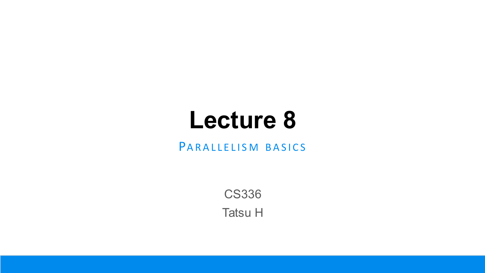

### 讲解
本讲是斯坦福 CS336 课程的第八讲，主题为 **Parallelism Basics**（并行计算基础），由 Tatsu Hashimoto 教授主讲。

前两讲（Lecture 5 & 6）我们主要关注**单张 GPU 内部的计算与内存层级的优化**，深入探讨了 GPU 的硬件微架构（SM、Warp 调度、寄存器文件、共享内存）以及如何编写高效的单卡融合内核（如 FlashAttention 和 Triton 编程）。然而，当模型规模越过单卡物理极限时，我们必须解决**如何将模型和数据分布在成百上千张 GPU 及多台物理服务器上进行高效协同**这一难题。本讲将系统性地建立起关于分布式并行的“心智模型”与工程直觉。

---

## Slide 2

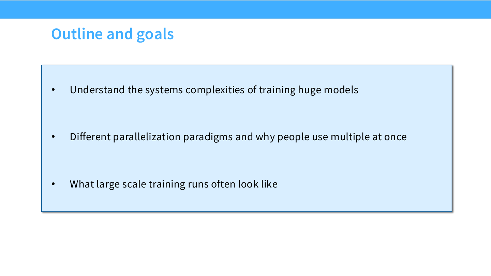

### 讲解
本页展示了本讲的**大纲与学习目标**：
1. **理解训练巨型模型的系统复杂性**：我们将不再孤立地看一张 GPU，而是将整个数据中心视作一个整体，分析计算、内存和通信之间的复杂相互作用。
2. **掌握不同的并行化范式及混合使用（3D 并行）**：包括数据并行（DDP、ZeRO 1-3）、模型并行（流水线并行、张量并行、序列并行）和专家并行（MoE），并理解为什么在超大规模训练中，必须同时混合使用多种并行策略。
3. **建立真实大规模预训练工程图景**：剖析工业界前沿大模型实际的并行配置设计与集群运行状态。

---

## Slide 3

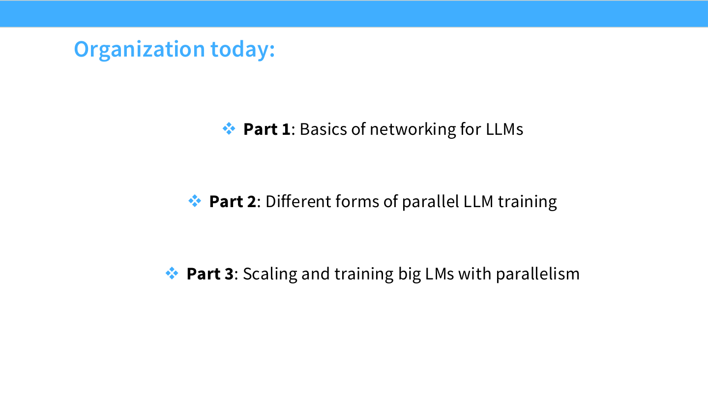

### 讲解
今天讲座的内容被划分为三个逻辑部分：
- **Part 1：大模型网络互连基础（Basics of networking for LLMs）**：介绍物理硬件连接、GPU 与 TPU 的网络设计差异以及分布式编程的集合通信原语。
- **Part 2：经典大模型并行化原语（Standard LLM parallelization primitives）**：深入公式和算法细节，推导各类并行机制的显存与通信开销。
- **Part 3：混合并行规模化（Scaling and training big LMs with parallelism）**：探讨 3D/4D 混合并行的工程设计法则，以及前沿模型（DeepSeek V3、Llama 3 405B 等）的实际落地案例。

---

## Slide 4

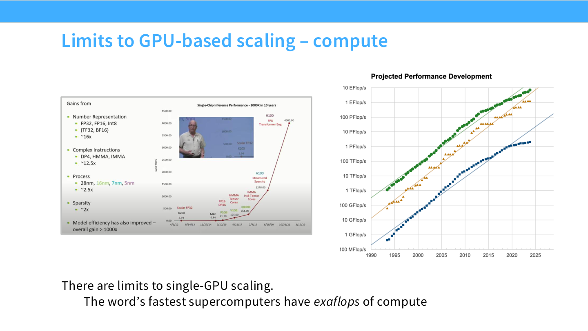

### 讲解
**单卡算力扩展的物理限制 —— 计算天花板**：

在大模型时代，单张 GPU 芯片的扩展已经撞上了坚硬的物理墙。
- **Dennard Scaling 的失效**：晶体管尺寸虽然在缩小，但由于漏电流和量子隧穿效应，电压无法按比例下降，功耗密度剧增。这导致单芯片的频率被死死限制在 2-3 GHz 左右。
- **功耗与散热极限**：单张 Hopper GPU 的功耗已达 700W，Blackwell 甚至突破 1000W。单芯片能堆叠的 SM 核心数量存在明显的物理天花板。
因此，为了支撑大模型所需的艾级浮点运算（Exaflops）计算量，我们必须将数以万计的 GPU 组合在一起，进行横向算力扩展。

---

## Slide 5

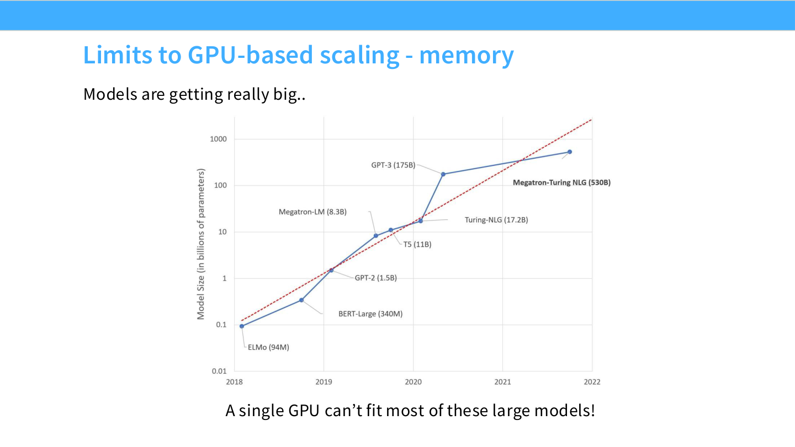

### 讲解
**单卡算力扩展的物理限制 —— 显存天花板**：

除了计算受限，显存容量是另一个更致命的硬瓶颈。
- 大模型参数量正以惊人的速度膨胀（从 GPT-2 的 1.5B 到 GPT-3 的 175B，再到万亿级 MoE）。
- 单张 GPU 搭载的 HBM（高带宽显存）容量由于堆叠工艺和硅片面积限制，增长极其缓慢（A100 为 80GB，H100 为 80GB，B200 为 192GB）。
- 绝大多数大型模型**在物理上根本无法塞入单张 GPU 的显存中**，这逼迫我们必须在显存层面对模型参数进行物理割裂和分布式存储。

---

## Slide 6

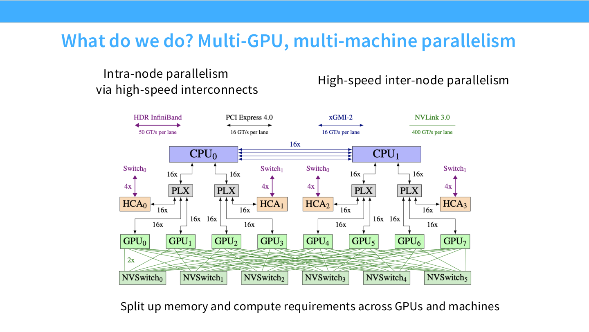

### 讲解
**多 GPU、多机器并行的多层级物理网络**：

为了越过单卡的算力与显存天花板，我们构建了多级网络互连的并行系统，各层级的带宽与延迟存在数量级差异：
- **节点内并行（Intra-node Parallelism）**：单台服务器内通常插有 8 张 GPU，它们之间通过高速、私有的物理总线（如 NVIDIA NVLink，带宽高达数 TB/s）实现显存的直接、极低延迟互访。
- **节点间并行（Inter-node Parallelism）**：不同的物理服务器之间，通过光纤网络交换机连接（如网卡 PCIe -> HCA 网卡 -> Infiniband 光纤线，带宽一般为数十 GB/s）。
在分布式系统设计中，核心金律是：**将计算与数据分发在不同层级的硬件上，以最大化利用节点内的高速 NVLink 带宽，尽量减少跨节点的慢速网络通信。**

---

## Slide 7

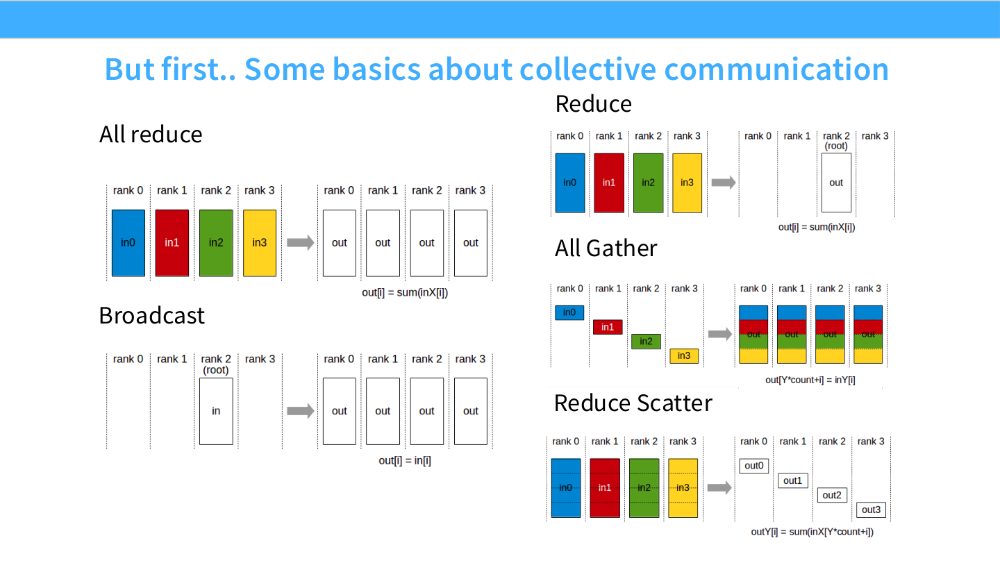

### 讲解
**集合通信原语（Collective Communication）概念**：

在分布式编程的 SPMD（单程序多数据）模型下，集合通信定义了多个计算节点（Ranks）之间进行协同同步的标准模式。
- **Broadcast（广播）**：由源节点将相同的张量数据拷贝并分发到所有参与节点。常用于训练初始化时由主节点分发模型权重。
- **Scatter（散播）**：将源节点上的大张量沿着某个维度均匀切片，按顺序分发给各个节点。
- **Gather（收集）**：与 Scatter 相反，将所有节点上的局部小张量按 Rank 顺序拼接收集回主节点。
- **Reduce（规约）**：对所有节点上的数据执行结合律/交换律操作（如 `SUM` 求和、`MIN` 极小值、`MAX` 极大值），最终计算结果保存在主节点上。

---

## Slide 8

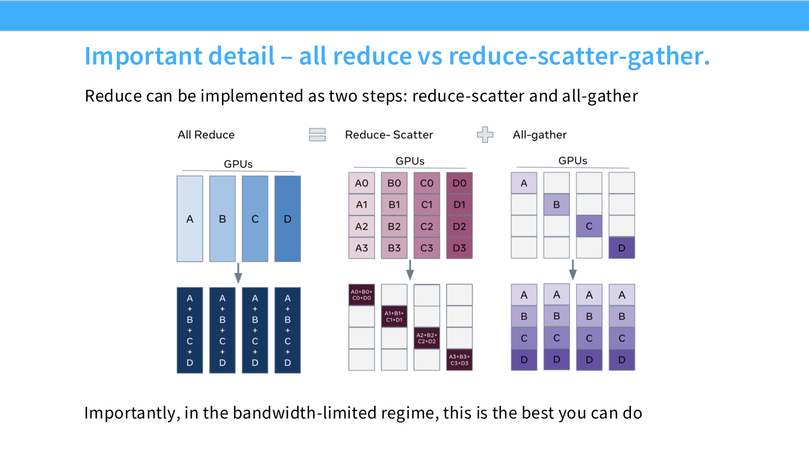

### 讲解
**核心原语：All-Gather, Reduce-Scatter 与 All-Reduce**：

在深度学习预训练中，我们更常用以下进阶集合通信原语：
- **All-Gather（全收集）**：每个节点都贡献一个局部小张量，所有节点最终都获得拼接后的全量大张量。
- **Reduce-Scatter（规约散播）**：对所有节点上的数据进行行级规约（如求和），然后将规约后的完整张量均匀切片分发给各个节点。
- **All-Reduce（全规约）**：规约所有节点的数据，且让所有节点都获得全量规约结果。
- **物理等价性**：在物理传输上，`All-Reduce` 等价于先运行一次 `Reduce-Scatter` 接着进行一次 `All-Gather`。在带宽受限的情况下，这一拆解并不会带来额外的网络数据传输量，反而为 ZeRO 等分片优化提供了重要的通信插拔点。

---

## Slide 9

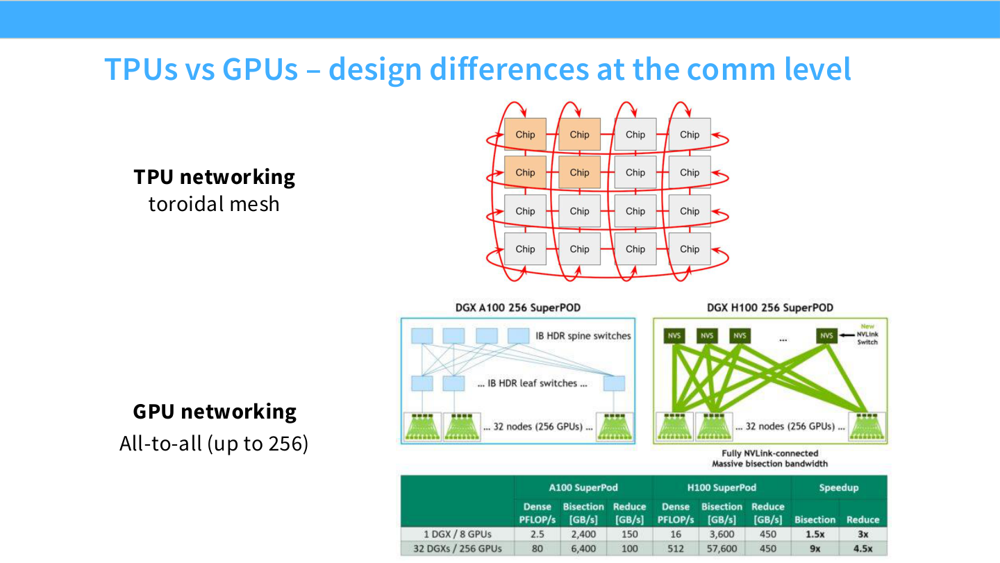

### 讲解
**TPU 与 GPU 在通信互连网络层面的设计差异**：
- **TPU 架构（环形拓扑 Mesh）**：TPU 将网卡控制器直接集成在芯片内部，通过特殊的 ICI（芯片间互连）接口，直接将物理上相邻的芯片连接成三维或多维的环形网格（Toroidal Mesh）。这种结构在处理结构化、确定性的多维张量切片传输时速度极快且硬件成本低，但网络布线繁琐且缺乏路由弹性。
- **GPU 架构（交换机拓扑 Switch）**：NVIDIA GPU 在节点内使用专用的 NVSwitch 芯片，在节点间通过外部的高性能 Infiniband 交换机或 RoCE 以太网交换机连接。这种基于 Switch 的全连接结构非常适合不规则、高动态的网络通信（如 MoE 模型中的 Token 专家分发）。

---

## Slide 10

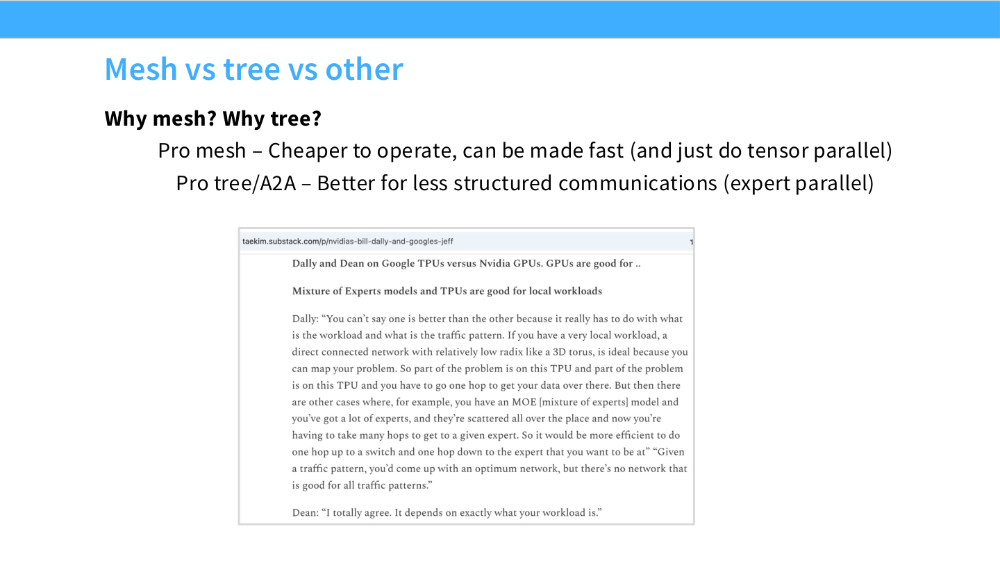

### 讲解
**环形网络（Mesh）与树形交换网络（Tree/Switch）的深度博弈**：
- **Mesh 环形网络**：通过将计算单元直接进行“手拉手”式的邻近物理连接，规写了高昂的外部中央交换机成本，且十分利于扩展。但它的灵活性较差，当发生非对称通信（如 MoE 路由）时，数据需要在多级跳（Hops）的网格中穿梭，容易引发严重的链路拥堵。
- **Tree/Switch 树形交换网络**：所有节点均连接到交换机上，允许任意节点之间以几乎相同的带宽和延迟直接对话。这对于大规模稀疏专家模型（MoE）中的 Expert Parallelism 极其有利，因为 Token 的派发和回收本质上是一个巨大的、动态的 `All-to-all` 随机转置操作，必须依靠交换机的路由吞吐能力。

---

## Slide 11

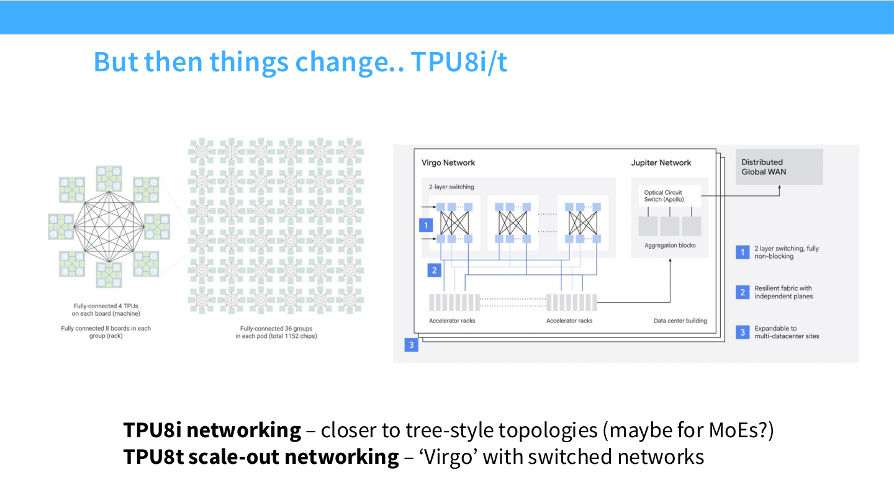

### 讲解
**TPU 网络设计的演进趋势**：

随着大模型和 MoE 架构的发展，TPU 的网络互连架构也在发生改变：
- **TPU v8i**：在其设计中逐步引入了更接近树形（Tree-style）的互连拓扑，旨在大幅优化稀疏 MoE 并行下的 Token 派发通信延迟。
- **TPU v8t**：引入了名为 **'Virgo'** 的光交换网络（Switched Optical Network），支持高度动态和弹性扩展的连接路由，在大规模数据中心水平扩展上开始对标 NVIDIA 的交换机集群。

---

## Slide 12

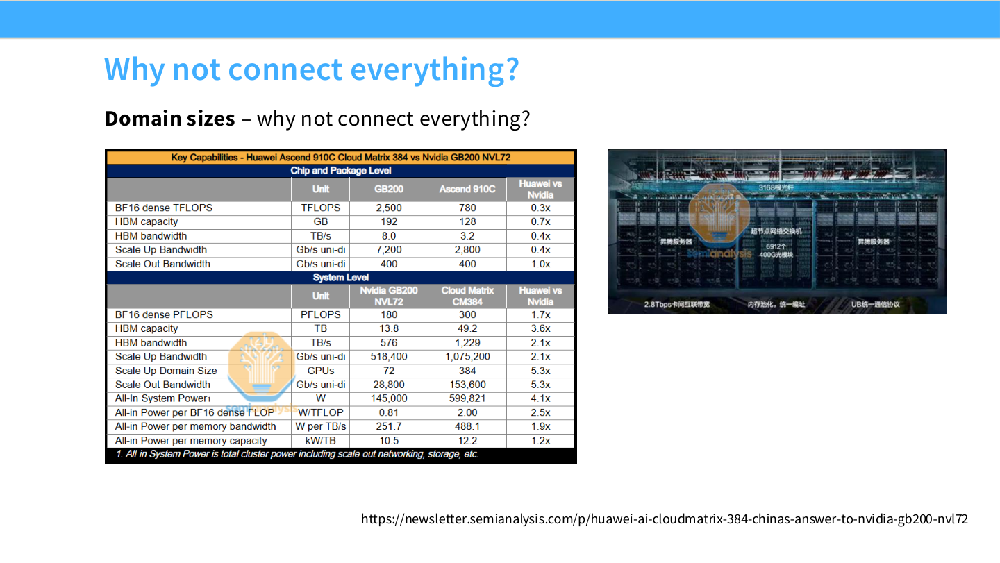

### 讲解
**物理互连域的瓶颈 —— 为什么我们不能直接连起一切？**

NVLink 的带宽（TB/s）是网卡（GB/s）的百倍以上，那为什么不构建一个包含 1024 甚至上万个 GPU 的单 NVLink 物理域呢？
- **物理规律限制**：NVLink 是一种超高密度的并行差分信号总线。信号在铜线中的传输距离通常被限制在数米之内，再长就会发生严重的信号衰减与电磁干扰。
- **复杂度爆炸**：让 $`N`$ 张卡全连接，需要的物理接口数和交换矩阵复杂度呈 $`N^2`$ 平方级爆炸。
目前，NVIDIA 的 **GB200 NVL72**（通过铜排无缝连接 72 张 GPU）已代表了单机柜物理 NVLink 共享域的极限。华为尝试过使用 CloudMatrix 架构构建 384 节点的更大互连域，这需要在高速交换芯片与物理布线上克服极大的工程极限。

---

## Slide 13

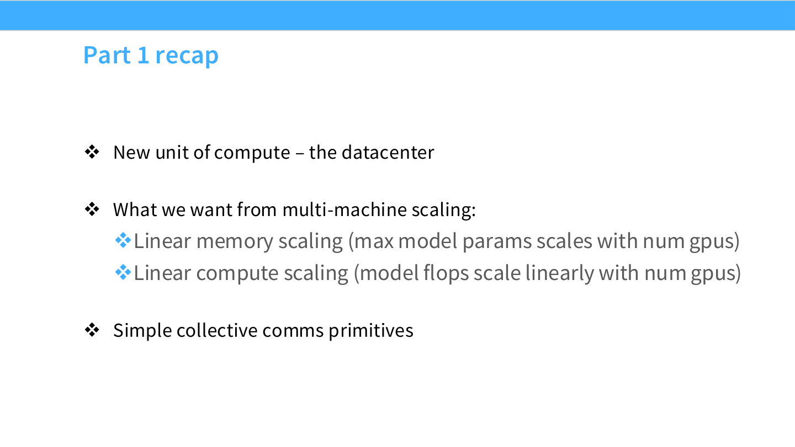

### 讲解
**Part 1 总结：多机水平扩展的成功标志**：

在超大规模分布式训练中，数据中心已成为新型的基本算力单元。我们对水平扩展有两大硬性期待：
1. **线性显存扩展（Linear Memory Scaling）**：当我们使用 $`M`$ 张 GPU 时，系统所能支撑的最大训练参数容量也应当能够线性提升 $`M`$ 倍。
2. **线性计算扩展（Linear Compute Scaling）**：当我们使用 $`M`$ 张 GPU 时，系统的总算力吞吐率（FLOPS）也应当能够实现 $`M`$ 倍的线性提升，即模型的算力利用率（MFU）保持在高位不崩塌。

---

# Part 2: Standard LLM Parallelization Primitives (经典模型并行与数据并行策略)

## Slide 14

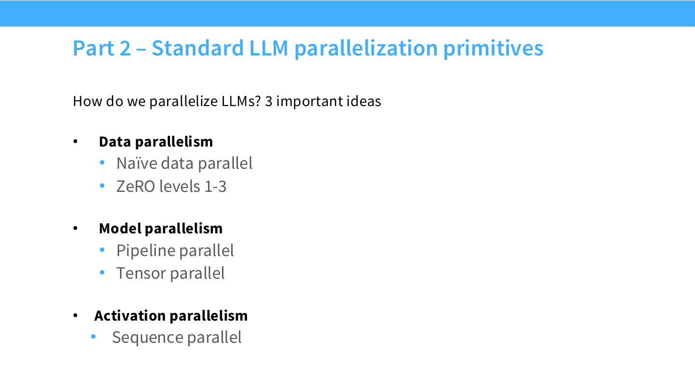

### 讲解
从本页开始进入 Part 2，我们将对现代大模型分布式训练中被奉为基石的几大并行技术进行深度推导。它们包括：
- **数据并行（Data Parallelism, DP）**：包括 Naive DDP 与 ZeRO 1-3 分片技术。
- **模型并行（Model Parallelism, MP）**：包括流水线并行（PP）与张量并行（TP/SP）。
- **专家并行（Expert Parallelism, EP）**：针对 MoE 架构。

---

## Slide 15

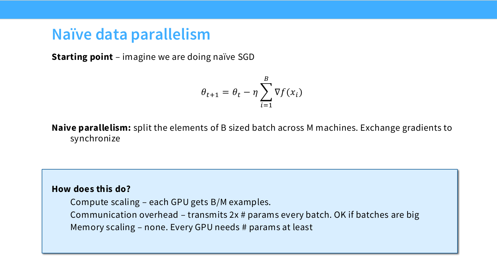

### 讲解
**朴素数据并行（Naive Data Parallelism）**：

数据并行是大模型并行化最经典、最直观的起点。其本质是小批量随机梯度下降（SGD）在空间维度的切分：
```math
\theta_{t+1} = \theta_t - \eta \sum_{i=1}^B \nabla f(x_i)
```
- **原理**：在 $`M`$ 台 GPU 设备上完全复制多份一模一样的模型权重 $`\theta_t`$。
- **数据流**：将当前训练批次的大 Batch $`B`$ 均匀切割成 $`M`$ 份，分发给各卡独立进行前向传播与反向传播。
- **同步**：各卡计算完局部梯度后，发起全局 **All-Reduce**（计算均值 `dist.ReduceOp.AVG`），保证所有设备获得一致的最终梯度，同步调用 `optimizer.step()` 更新后，各卡的权重在下一个迭代前依然保持完全同步。

---

## Slide 16

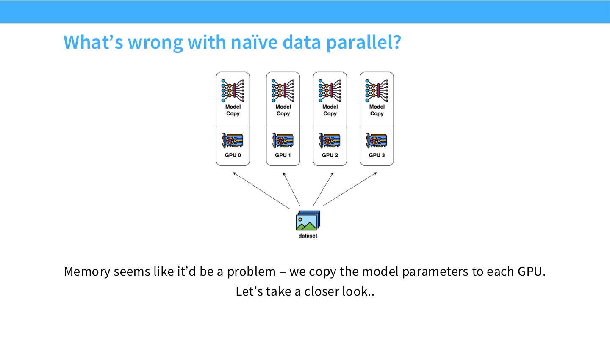

### 讲解
**朴素数据并行在超大模型下的灾难性缺陷**：
朴素数据并行（DDP）的最大瓶颈在于**显存冗余（Memory Redundancy）**。
在 DDP 框架下，每一个 GPU 节点都必须硬性塞入全量的参数、梯度以及优化器状态副本。
- 这意味着，单张卡必须有足够的物理显存来装下整个模型的全部训练状态。
- 如果模型规模庞大（如一个 175B 的模型），单卡连模型参数都装不下，数据并行在计算第一步就会因显存溢出（OOM）直接崩溃。

---

## Slide 17

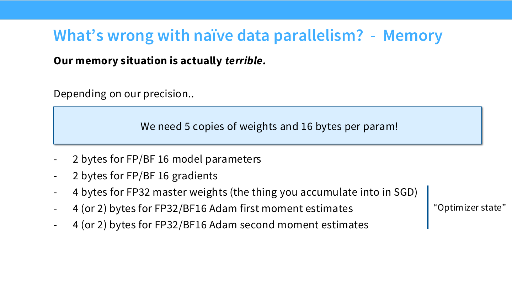

### 讲解
**训练状态的显存开销精确拆解**：

在混合精度训练（Mixed Precision Training）下，一个模型参数在不考虑前向激活值显存的情况下，需要消耗 **$`16`$ 字节**的物理显存：
- **模型参数 (Parameters)**：以 BF16 / FP16 精度存储，占用 **$`2`$ 字节**。
- **梯度 (Gradients)**：以 BF16 / FP16 精度存储，占用 **$`2`$ 字节**。
- **优化器状态 (Optimizer States, 以 FP32 Adam 为例)**：
  - 用于更新的高精度参数副本（Master Weights）：FP32 存储，占用 **$`4`$ 字节**。
  - 一阶动量（Adam First Moment）：FP32 存储，占用 **$`4`$ 字节**。
  - 二阶动量（Adam Second Moment）：FP32 存储，占用 **$`4`$ 字节**。
  - 优化器状态小计：$`12`$ 字节。
```math
\text{Total Memory per parameter} = 2 \text{ (参数)} + 2 \text{ (梯度)} + 12 \text{ (优化器)} = 16 \text{ 字节}
```
这也是为什么对于一个 70B 模型，基础显存消耗即达 $`70 \times 10^9 \times 16 \text{ B} = 1120 \text{ GB}`$，必须寻找显存去冗余方案。

---

## Slide 18

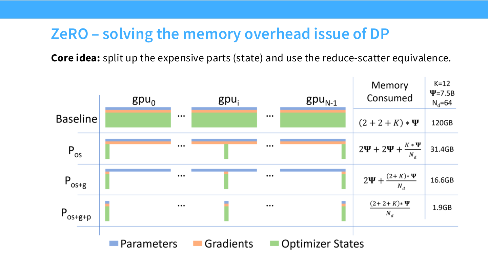

### 讲解
**ZeRO 优化器（零冗余数据并行）的设计思想**：

微软提出的 **ZeRO**（Zero Redundancy Optimizer）系列方案给出了一个极富创意的洞察：
- 既然在 $`N_{\text{gpu}}`$ 张 GPU 上数据并行的 $`16`$ 字节显存是完全重复的，我们完全可以**将这些训练状态切片（Shard），让各卡分工存储，消除冗余**。
- 借助集合通信中“全规约等价于规约散播加全收集”的物理性质，我们在前向和反向传播的进程中，实时向其他卡“借阅”数据并立即释放。
- 这使我们能保留数据并行计算高效、无气泡的优势，同时拥有极高的参数扩展极限。

---

## Slide 19

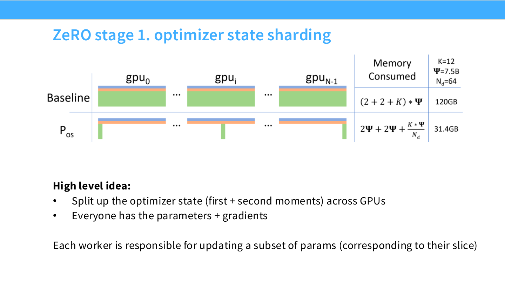

### 讲解
**ZeRO Stage 1 —— 优化器状态分片 (Optimizer State Sharding)**：
- **原理**：在 $`16`$ 字节的显存开销中，FP32 Adam 优化器状态占用了高达 $`12`$ 字节（占比 $`75\%`$）。在 Stage 1 中，我们在每张 GPU 上仍然保留完整的参数（BF16, 2B）和梯度（BF16, 2B）副本，但我们将优化器状态在整个 GPU 组内进行切片分摊。
- **执行**：每一张 GPU 仅需保存并更新其中 $`\frac{1}{N_{\text{gpu}}}`$ 的优化器状态切片，仅对这部分参数切片执行 Adam 计算。

---

## Slide 20

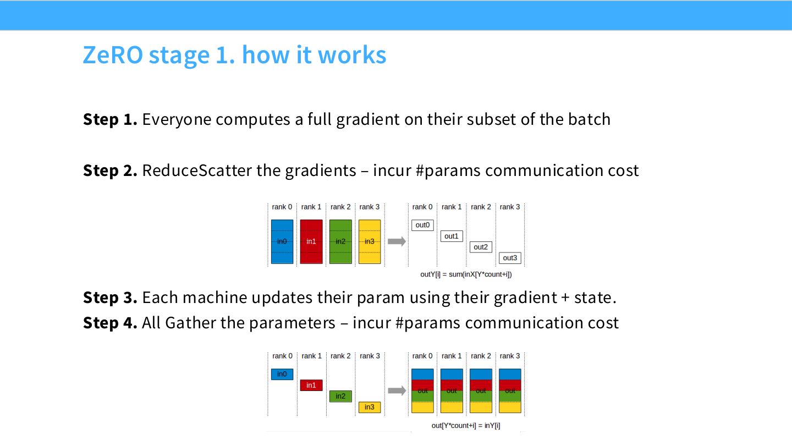

### 讲解
**ZeRO Stage 1 的执行步骤**：
- **前向传播与反向传播**：所有 Rank 都在自己的局部 Batch 副本上计算前向和反向传播，产生全量梯度的 BF16 副本。
- **梯度同步**：各卡之间对梯度执行一次 **Reduce-Scatter**。规约求和之后，每个 Rank 上只保留自己负责的那 $`\frac{1}{N_{\text{gpu}}}`$ 切片的平均梯度，其余梯度的显存立刻被释放（通信成本：$`1 \times \#\text{params}`$ 的数据传输量）。
- **参数更新**：每张卡利用局部的梯度切片，结合本地对应的优化器状态切片，更新自己分管的 $`\frac{1}{N_{\text{gpu}}}`$ 参数切片。
- **参数同步**：所有卡发起一次 **All-Gather**，拼接并收集来自所有设备的更新后参数切片，恢复全量 BF16 参数（通信成本：$`1 \times \#\text{params}`$）。

---

## Slide 21

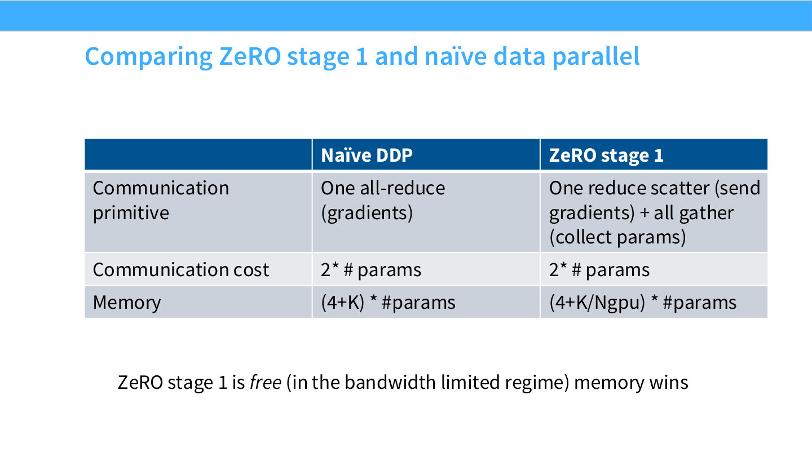

### 讲解
**DDP 与 ZeRO Stage 1 深度对比表**：

| 对比维度 | Naive DDP | ZeRO Stage 1 |
|---|---|---|
| **通信原语** | 1 次 All-Reduce (同步梯度) | 1 次 Reduce-Scatter (梯度) + 1 次 All-Gather (参数) |
| **单步通信数据量** | $`2 \times \#\text{params}`$ | $`2 \times \#\text{params}`$ |
| **单卡静态显存占用** | $`(4 + K) \times \#\text{params}`$ 字节 | $`\left(4 + \frac{K}{N_{\text{gpu}}}\right) \times \#\text{params}`$ 字节 |

*注：其中 $`K`$ 是梯度与优化器状态的总大小（14 字节）。*
**划时代结论**：在网络带宽吃满的带宽受限机制（Bandwidth Limited Regime）下，ZeRO Stage 1 的通信开销与 DDP **完全一样**！这意味着我们以**零额外网络开销为代价**，实现了显存占用的巨大下滑，堪称系统优化的免费午餐。

---

## Slide 22

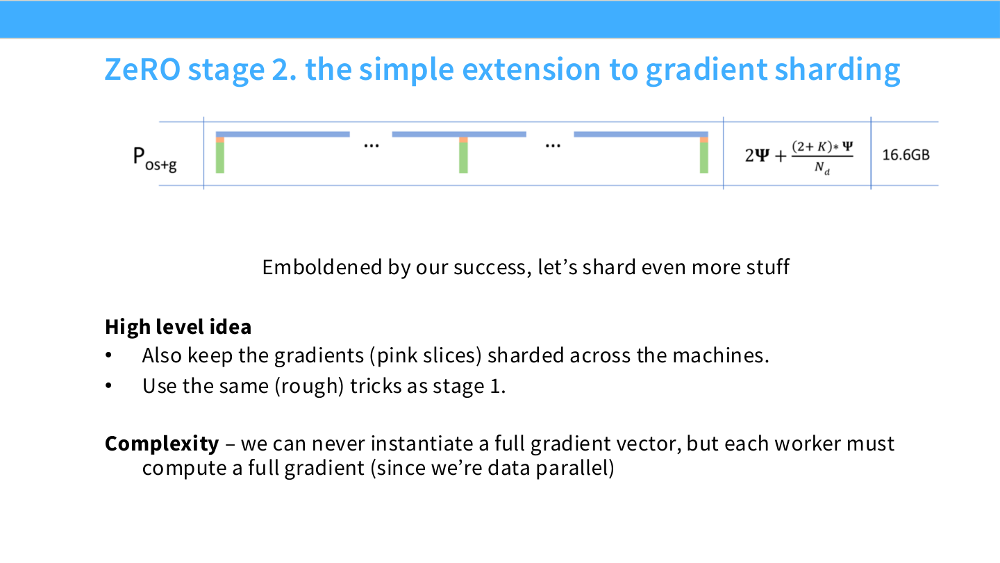

### 讲解
**ZeRO Stage 2 —— 梯度分片 (Gradient Sharding)**：
在 Stage 1 成功后，我们顺理成章地对剩余的冗余项下手：
- **核心思想**：不仅对优化器状态进行分片，对反向传播产生的 $`2`$ 字节梯度也进行切片分摊（每张卡只保留 $`\frac{1}{N_{\text{gpu}}}`$ 梯度的最终版本）。
- **系统复杂性**：在反向传播中，由于我们不能一次性在卡上申请保存完整的梯度大张量（这会耗尽显存），我们必须设计一个**随算随收、即时规约并释放**的控制流。

---

## Slide 23

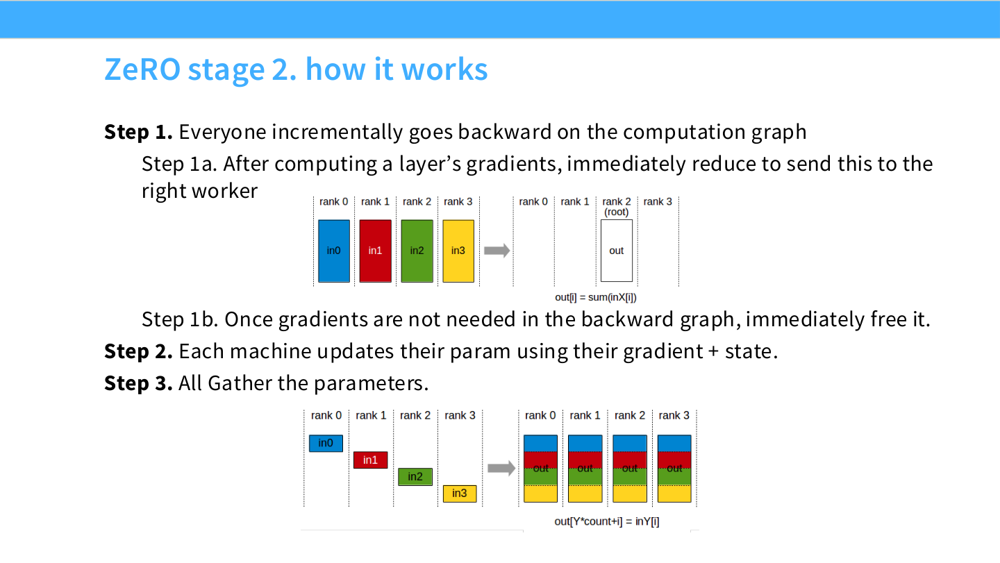

### 讲解
**ZeRO Stage 2 的具体执行步骤（增量规约与释放）**：
- **步骤 1**：在反向传播执行时，一旦某一层（Layer $`L`$）计算出其参数梯度：
  - 触发异步的 Reduce-Scatter，将该层的局部梯度发送给负责该层梯度切片的目标 GPU。
  - 规约完成后，本地的这部分层梯度显存**立刻被释放**，无须保留在显存中直到反向全部结束。
- **步骤 2**：各 Rank 使用分管的梯度切片，结合本地优化器状态切片，更新自己分管的参数。
- **步骤 3**：通过 All-Gather 同步更新后的参数。整个过程的通信数据量依然保持在稳定的 $`2 \times \#\text{params}`$。

---

## Slide 24

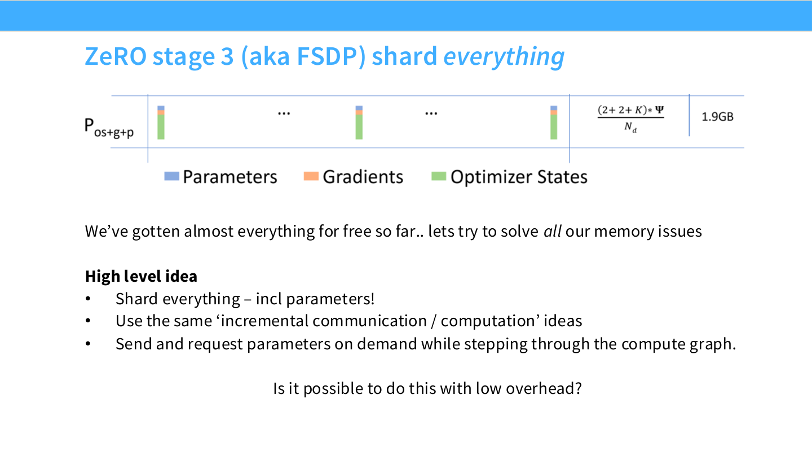

### 讲解
**ZeRO Stage 3 (FSDP) —— 参数全分片 (Fully Sharded Data Parallel)**：
- **核心思想**：不仅分片优化器和梯度，将 $`2`$ 字节的模型参数（Parameters）本身也在所有 GPU 上进行分片。
- **运行模式**：没有一张 GPU 拥有完整的模型参数。在前向和反向传播的每一步计算中，我们必须通过实时通信来拼接当前层所需的参数，计算完该层后**立刻释放**。
- **硬性挑战**：这种高频的实时参数收发会带来极大的网络压力，通信开销会增加多少？

---

## Slide 25

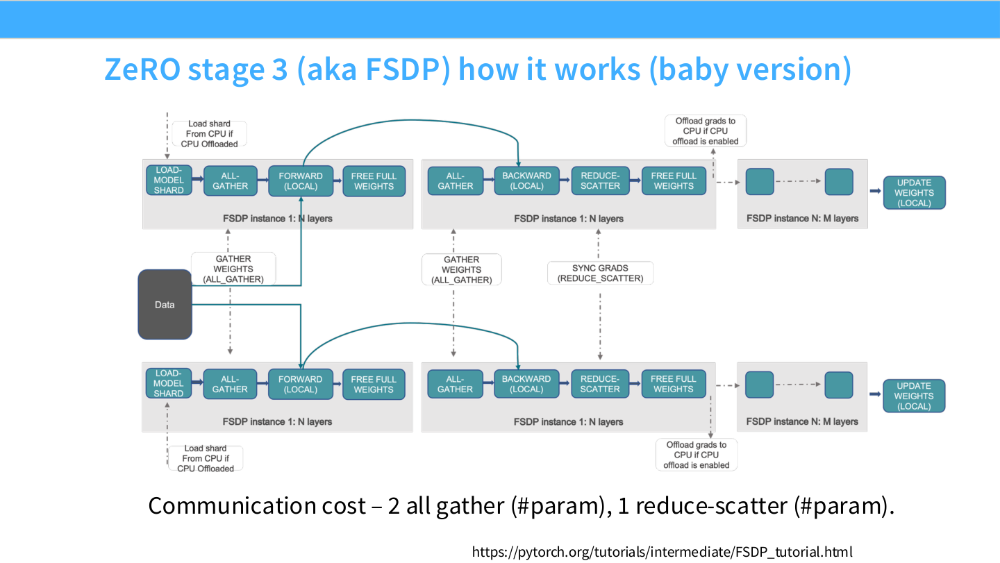

### 讲解
**ZeRO Stage 3 (FSDP) 的通信开销计算**：
我们分析 FSDP 计算单层 Layer $`L`$ 时所需的网络通信步骤：
1. **前向传播**：发起 1 次 All-Gather，收集 Layer $`L`$ 的全量参数，前向计算完毕，**立刻释放**收集的完整参数（通信量：$`1\times\#\text{params}`$）。
2. **反向传播**：再次发起 1 次 All-Gather，收集 Layer $`L`$ 的全量参数以计算梯度，计算完后**立刻释放**（通信量：$`1\times\#\text{params}`$）。
3. **梯度规约**：对 Layer $`L`$ 的梯度发起 1 次 Reduce-Scatter，规约并仅保留本地对应的梯度切片，释放其余梯度显存（通信量：$`1\times\#\text{params}`$）。
- **总计通信成本**：
  ```math
  \text{FSDP Communication Cost} = 3 \times \#\text{params}
  ```
- 尽管显存占用下降到了 $`\frac{1}{N_{\text{gpu}}}`$，但通信数据量相比 DDP 增加了 1.5 倍。

---

## Slide 26

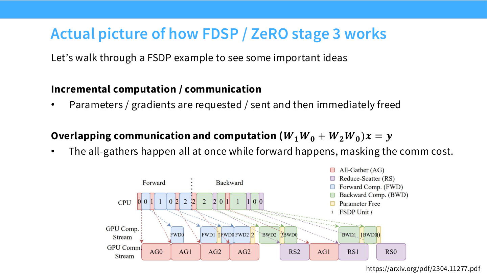

### 讲解
**FSDP 性能掩盖的关键 —— 通信与计算的高效重叠 (Overlap)**：
虽然 1.5 倍的通信开销在可接受范围内，但如果每次计算都必须等网络 All-Gather 传输完毕，GPU 核心会面临极长的停顿等待（OOM 虽免，但 MFU 会极低）。
- **优化机制**：采用双缓冲区（Double Buffering）机制。当前向传播正在计算当前 Layer 1 的矩阵乘法时，后台通信线程已经在全速异步发起下一层 Layer 2 参数的 All-Gather 传输。
- 通过计算与通信在物理时间线上的重叠，FSDP 成功将参数传输的延迟掩盖掉，达到了高算力利用率。
  参考：[FSDP Tutorial](https://pytorch.org/tutorials/intermediate/FSDP_tutorial.html) 及 [PyTorch FSDP Paper](https://arxiv.org/pdf/2304.11277.pdf)

---

## Slide 27

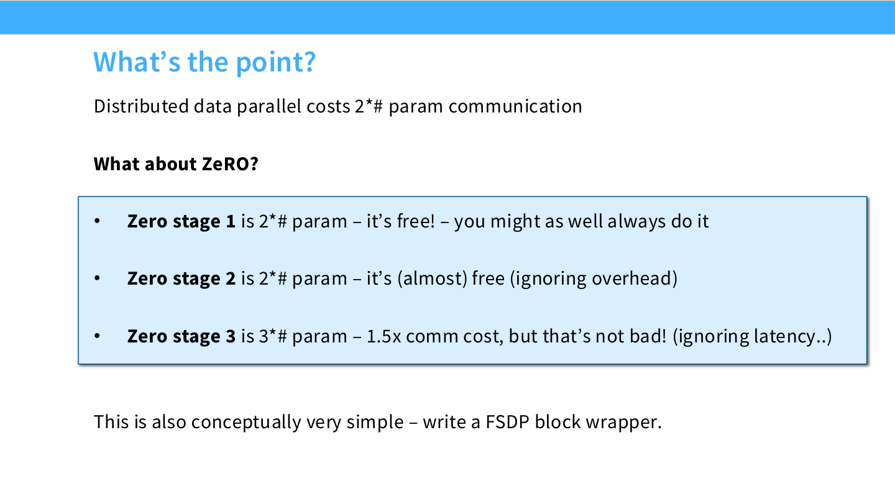

### 讲解
**分布式数据并行与 ZeRO 各阶段特性对比要点**：
- Naive DDP：梯度同步需 2x params 通信，无显存优化。
- **ZeRO Stage 1**：通信量保持 2x params。优化器分片，**在带宽有限场景下完全免费，应始终默认开启。**
- **ZeRO Stage 2**：通信量 2x params。优化器+梯度分片，同样性价比极高。
- **ZeRO Stage 3 (FSDP)**：通信量 3x params。参数全部完全分片。它彻底解决了大模型参数量 OOM 的困境。在 PyTorch 中使用 FSDP 非常便利，通常只需写一个 FSDP 块包装器（FSDP Block Wrapper）即可快速集成。

---

## Slide 28

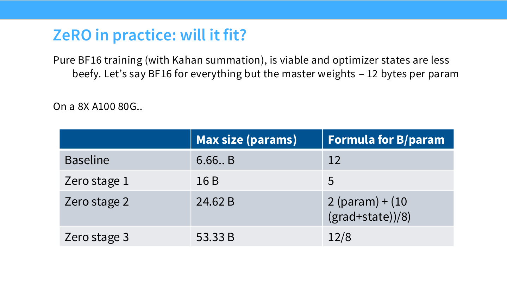

### 讲解
**ZeRO 在实践中的最大模型参数容量对比（在 8x A100 80GB 上）**：
我们设定在单节点 8 张 A100 (80GB) 的物理环境下进行纯 BF16 混合精度训练（12 字节/参数）：

| 训练阶段 | 静态模型最大参数容量 | 单参数显存公式 |
|---|---|---|
| **Baseline (DDP)** | **$`6.66 \text{ B}`$** | $`12 \times N`$ |
| **ZeRO Stage 1** | **$`16 \text{ B}`$** | $`(2 \text{ (参数)} + 2 \text{ (梯度)} + 12/8 \text{ (状态分片)}) \times N = 5.5 \times N`$ |
| **ZeRO Stage 2** | **$`24.62 \text{ B}`$** | $`(2 \text{ (参数)} + (2 + 12)/8) \times N = 3.25 \times N`$ |
| **ZeRO Stage 3 (FSDP)** | **$`53.33 \text{ B}`$** | $`12 / 8 \text{ (全部切片)} \times N = 1.5 \times N`$ |

*注：此处计算同样未扣除动态激活值显存。*
可以看到，从 baseline 的 6.6B 扩展到 53B，ZeRO 成功在不改变物理硬件的情况下，实现了近 8 倍的模型容量跃升。

---

## Slide 29

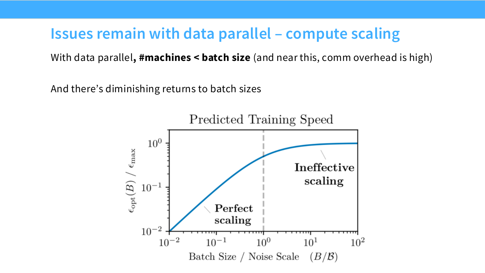

### 讲解
**数据并行的最终计算边界**：
数据并行虽然易用，但存在两大计算物理瓶颈：
- **全局批次划分上限**：分布式卡数 $`M`$ 不能超过全局 Batch Size $`B`$（每张卡至少要分到一个样本，即 Micro-batch $`\ge 1`$）。
- **通信比极速恶化**：当卡数 $`M`$ 逼近 $`B`$ 时，单卡上的前向计算时间变得极短。计算时间无法再有效覆盖 $`2\times\#\text{params}`$ 的 All-Reduce 梯度通信耗时，导致 MFU 急剧崩塌。
- **Batch Size 的收益递减**：为了强行增加 DP 度而一味调大总 Batch Size 会破坏模型的收敛效率（Token 效率变差）。

---

## Slide 30

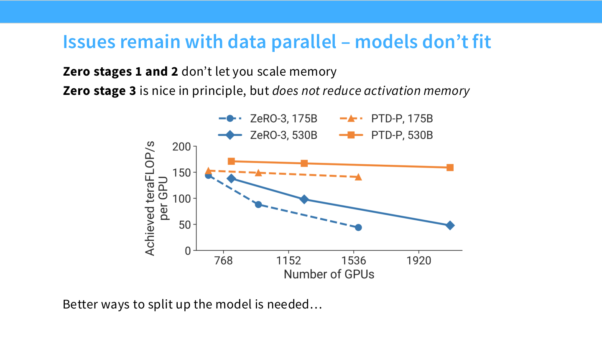

### 讲解
**数据并行的显存终极痛点 —— 动态激活值 OOM**：
- 静态的 ZeRO 阶段 1-2 无法降低模型参数本身占用的显存。
- 即使我们采用了极端的 ZeRO-3，它也**只分片了静态的训练状态（参数、梯度、优化器），完全没有触及随着 Batch Size 和序列长度线性甚至平方级增长的动态前向激活值（Activations）。**
在长序列训练中，激活值会瞬间挤爆显存导致 OOM。因此，我们必须从参数分割入手，切分模型本身——这便是模型并行（Model Parallelism）。

---

## Slide 31

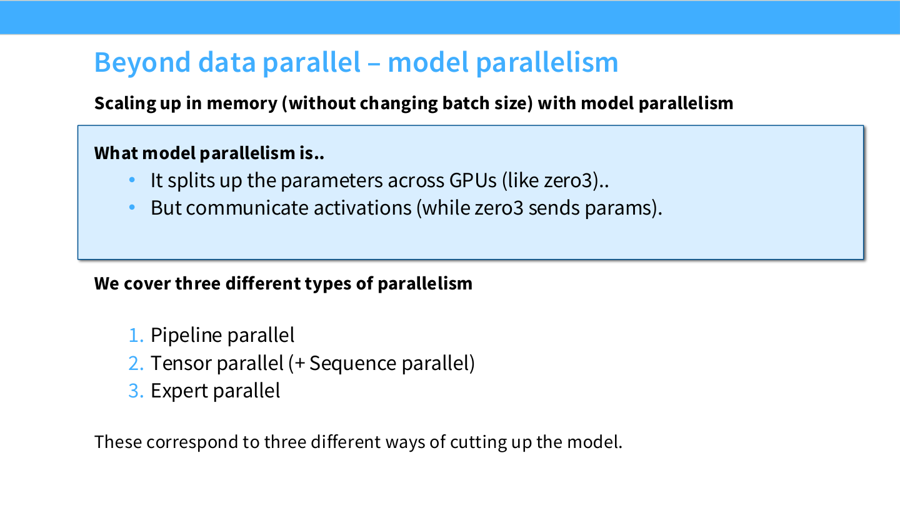

### 讲解
**超越数据并行 —— 模型并行（Model Parallelism）的理念**：

与 FSDP/ZeRO-3 在运行时到处发送和重组参数的做法相反，模型并行采取了不同的逻辑：
- **核心逻辑**：将模型的权重参数物理切割并固定存放在不同的 GPU 上。在前向和反向传播中，**权重本身保持静止不动，不同 GPU 之间仅通过网络传输前向计算出的激活值（Activations）以及反向传播的梯度。**
模型并行包含三种主流的空间割裂轴线：
1. **流水线并行 (Pipeline Parallel, PP)**：沿着模型的**深度（Depth，层间）**进行切分。
2. **张量并行 (Tensor Parallel, TP)**：沿着模型的**宽度（Width，层内矩阵）**进行切分。
3. **专家并行 (Expert Parallel, EP)**：MoE 专属，按专家分块。

---

## Slide 32

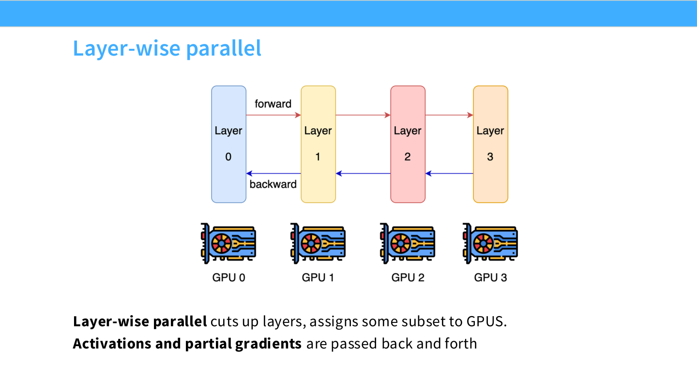

### 讲解
**朴素层级并行（Layer-wise Parallelism）**：
模型并行的最简单尝试是按层切分。比如，若我们有 $`4`$ 张 GPU，直接将一个 4 层的 MLP 均匀分摊，每张卡只保留其中 1 层的权重。
- **计算逻辑**：
  - `Rank 0` 读取输入，计算完 Layer 0，将激活值（Activations）发给 `Rank 1`。
  - `Rank 1` 接收后计算 Layer 1，发给 `Rank 2`，以此类推。
  - 反向传播时，偏导梯度以完全相反的方向在卡间顺序流转。
这一简单的做法虽分摊了模型参数，但我们在下一页会看到其计算效率极其低效。

---

## Slide 33

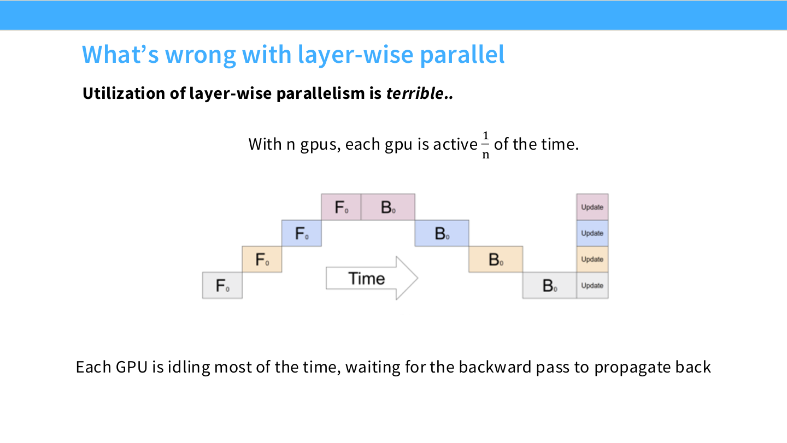

### 讲解
**层级并行的硬伤 —— 严重的流水线气泡（Bubble）**：
层级并行的数据流动是强依赖、单线串行的。
- 在前向传播中，当 `Rank 0` 正在计算 Layer 0 时，由于后面的设备没有数据，它们必须在显存中完全闲置等待；同理，反向传播中前面的设备也要空闲等待。
- **硬件空转占比**：在包含 $`n`$ 张 GPU 的层级并行中，**任意时刻仅有 $`\frac{1}{n}`$ 的算力资源被激活利用**，其余 $`\frac{n-1}{n}`$ 昂贵的 GPU 核心处于绝对空转状态。这种因数据依赖引发的闲置损耗被称为“流水线气泡”。

---

## Slide 34

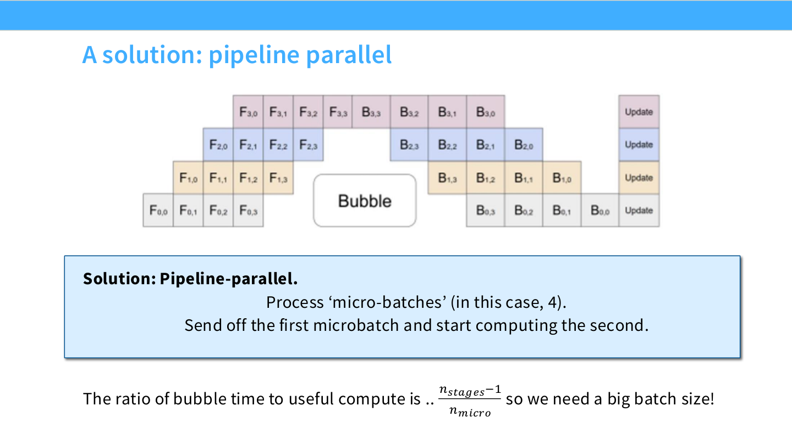

### 讲解
**流水线并行（Pipeline Parallelism）与微批次（Micro-batches）平抑气泡**：
为了解决气泡导致的灾难性闲置，我们引入流水线并行（PP）设计：
- **微批次重组**：我们将一个大 Batch 拆分为多个独立的微批次（Micro-batches，例如 4 个微批次）。
- **计算交错**：当 `Rank 0` 算完第一个微批次并发送给 `Rank 1` 后，它不闲着，而是立刻接着计算第二个微批次。
- **气泡率计算**：
  若流水线包含 $`N_{\text{stages}}`$ 个阶段，微批次数量为 $`N_{\text{micro}}`$，则气泡时间占有效计算时间的比例为：
  ```math
  \text{Bubble Ratio} = \frac{N_{\text{stages}} - 1}{N_{\text{micro}}}
  ```
- **推论**：为了将气泡占比压在低位，我们必须设置较大的 $`N_{\text{micro}}`$，因此**流水线并行高度依赖大 Batch 训练**。

---

## Slide 35

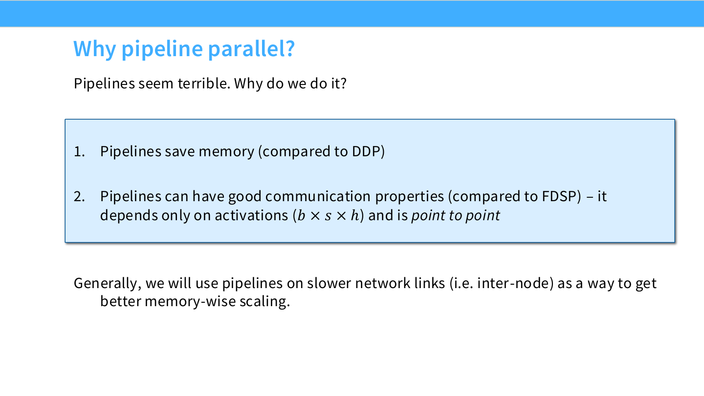

### 讲解
**既然 PP 存在气泡，且调度复杂，我们为什么依然需要它？**
主要由于其无可替代的**显存节省与通信友好特性**：
1. **显存分摊**：PP 将模型沿深度拆开，极大平抑了单台机器在参数和前向激活缓存上的最高显存水位。
2. **跨节点带宽极度宽容**：
   在流水线接口处，两台机器之间只需传输边界层的激活值张量（物理大小仅为 $`b \times s \times h`$，即批次 $`\times`$ 序列长度 $`\times`$ 隐藏维度），相比 ZeRO-3 在算子级频繁全网广播参数的量级，PP 的通信量极小。
   更重要的是，PP 通信是**点对点（P2P）**的，仅发生于网络上相邻的网卡之间。因此，**流水线并行是对网络性能最宽容的并行策略，通常用于连接不同服务器机架或跨网络的慢速 inter-node 链路。**

---

## Slide 36

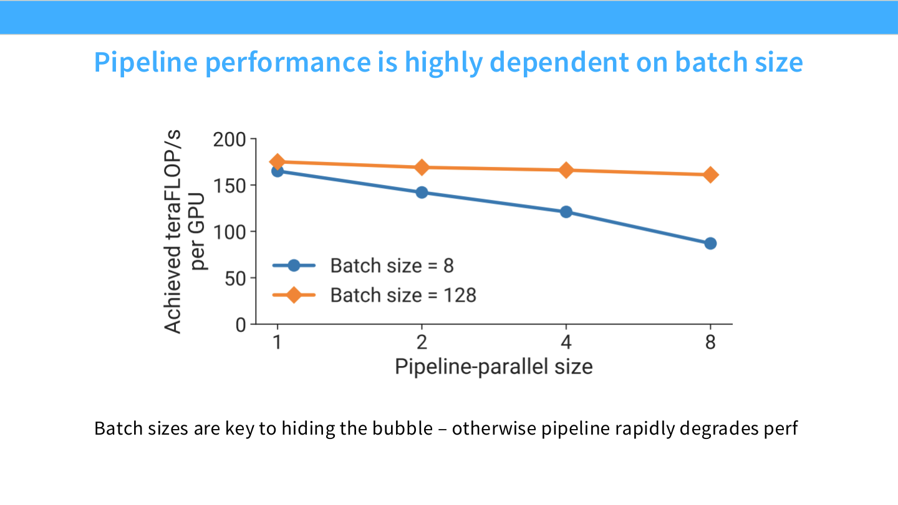

### 讲解
**流水线并行性能对全局 Batch Size 的强依赖性**：
如前文公式所揭示，PP 的算力利用率高度受限于 Micro-batches 的数量。
- 在大模型训练中，如果我们因为某些训练策略或微调需要被迫降低训练的 Batch Size，会直接导致 Micro-batches 骤减，流水线气泡占比瞬间扩大，硬件吞吐效率急剧退化。
- 这是大模型系统工程师必须解决的调度博弈：小批次下 PP 极难维持高效率。

---

## Slide 37

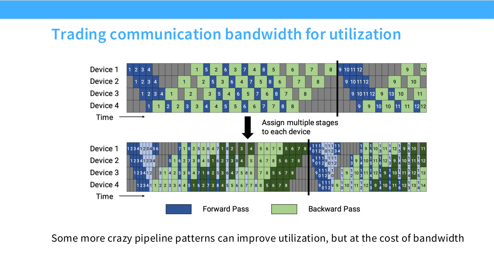

### 讲解
**更复杂的流水线调度模式：1F1B 与交错执行**：
为了进一步平抑气泡，工业界提出了多种非对称的复杂流水线前向/反向调度算法：
- **1F1B（1 Forward, 1 Backward）**：在流水线稳定后，每个设备交替执行一个微批次的前向计算与一个微批次的反向计算。这成功将最大激活值显存控制在一个微批次量级。
- **交错 PP 调度**：通过将设备虚拟化为多个阶段段落，允许前向和反向计算在更细颗粒度上交织，能将气泡比例进一步减少，但代价是带来了更繁琐的代码控制与网络同步复杂度。

---

## Slide 38

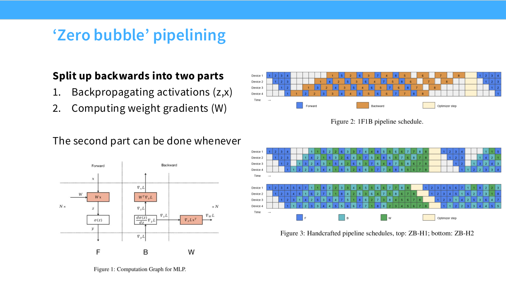

### 讲解
**零气泡流水线并行 (Zero-Bubble Pipelining) 的数学解耦**：
近年的学术前沿（如 [Zero-Bubble PP]）提出了一种能将气泡占比压减至接近零的新方法。
- **核心逻辑**：反向传播（Backward）包含两个完全独立的数学计算：
  1. **计算针对输入的梯度（$`\text{d}x`$）**：必须按计算图顺序向上一层回传，以维持流水线链条。
  2. **计算针对权重参数的梯度（$`\text{d}W`$）**：这是本层参数更新所需的，它不处于反向传播的延迟关键路径上。
- **调度重组**：通过将 $`\text{d}W`$ 计算从 $`\text{d}x`$ 路径中剥离出来，安排在 GPU 的任何流水线气泡空闲时段（Bubble Slots）插空计算，从而几乎填平了所有的空转时间，大幅拉升了系统的整体 MFU。

---

## Slide 39

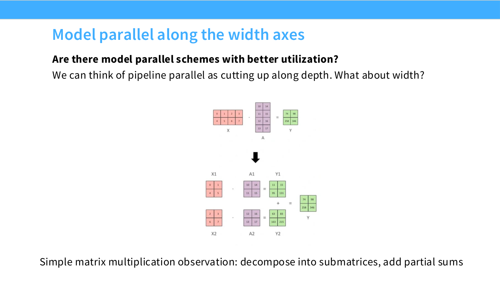

### 讲解
**宽度切分 —— 张量并行（Tensor Parallelism）**：
流水线并行是沿着模型的“深度”（Depth）拆分。而张量并行则是沿着模型层内大矩阵乘法的“宽度”（Width）进行物理拆分。
其底层逻辑是简单的矩阵乘法分配律：
```math
\begin{bmatrix} A_1 & A_2 \end{bmatrix} \begin{bmatrix} B_1 \\ B_2 \end{bmatrix} = A_1 B_1 + A_2 B_2
```
通过将隐藏权重分割到不同的 GPU，并在运算后对局部 partial sums 发起求和，实现了在矩阵乘法内部的多卡并行。

---

## Slide 40

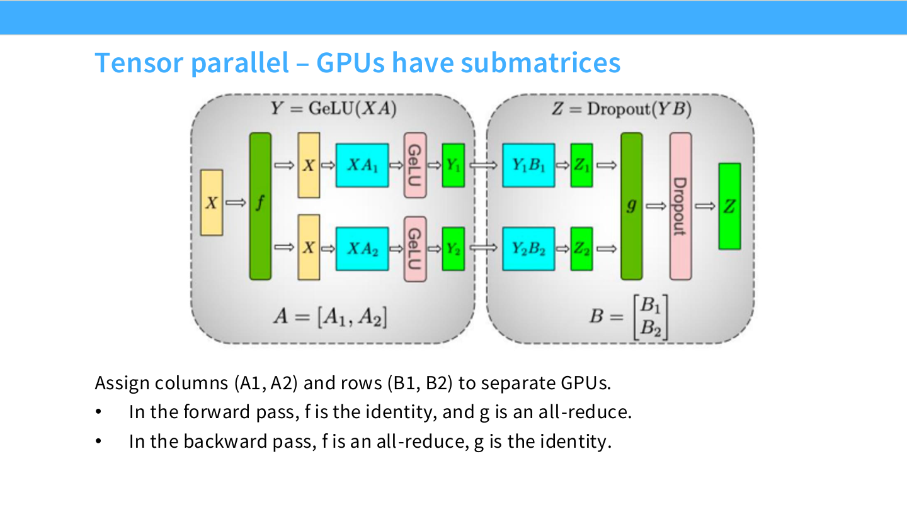

### 讲解
**张量并行的通信机制：列并行与行并行**：
在 Tensor Parallel 中，主要由两种经典的 Sharding 方式交替运行：
- **列并行（Column-parallel Linear）**：将权重矩阵 $`W`$ 按列切开：$`W = [W_1 \mid W_2]`$。
  - **前向**：各卡计算 $`Y_i = X W_i`$。由于是列切片，前向传播中**无需通信**，只需在层末尾通过一次 **All-Gather** 将各卡输出拼接恢复。
  - **反向**：在反向传播中，局部偏导梯度合并则需要发起一次 **All-Reduce**。
- **行并行（Row-parallel Linear）**：将权重矩阵 $`W`$ 按行切开：$`W = \begin{bmatrix} W_1 \\ W_2 \end{bmatrix}`$。
  - **前向**：各卡计算 $`Y_i = X_i W_i`$，最终的完整输出为各卡 partial sums 的累加：$`Y = X_1 W_1 + X_2 W_2`$。因此前向层末尾必须进行一次 **All-Reduce (SUM)** 同步。
  - **反向**：反向传播时，数据传递方向相反，无需额外通信。

---

## Slide 41

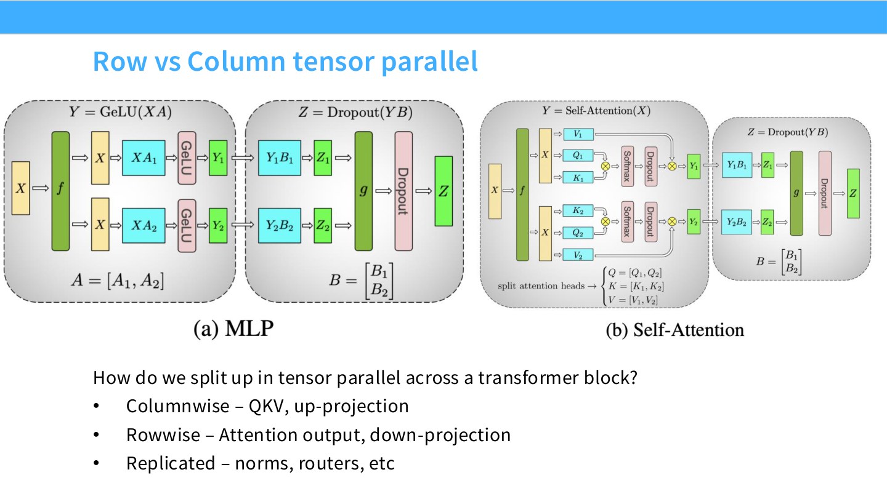

### 讲解
**在 Transformer Block 内部构建张量并行 (Megatron-LM 经典设计)**：
为了最小化多卡同步通信次数，Megatron-LM 提出了极其巧妙的自注意力层（MHA）与 MLP 层组合切片方案：
- **自注意力机制 (Attention Block)**：
  - **QKV 投影投影层**：采用**列并行（Column-parallel）**切片。各 GPU 本地仅存储一部分注意力头的参数，独立计算各头的激活值。
  - **线性输出投影层（O Dense）**：采用**行并行（Row-parallel）**切片。各卡对本地注意力的输出执行乘法，并在最末端进行 1 次 **All-Reduce** 同步。这巧妙地将 QKV 的 All-Gather 和 Dense 的输入 All-Gather 完全合并或省去，在一个 Attention 块内只需要 1 次通信同步。
- **MLP Block**：
  - **Up-projection（门控/第一层）**：列并行。
  - **Down-projection（输出/第二层）**：行并行，末端进行 1 次 **All-Reduce**。
- **其余部分（如 LayerNorm、Router 等）**：在各卡上完全**复制（Replicated）**并重复计算，以规写高频通信。

---

## Slide 42

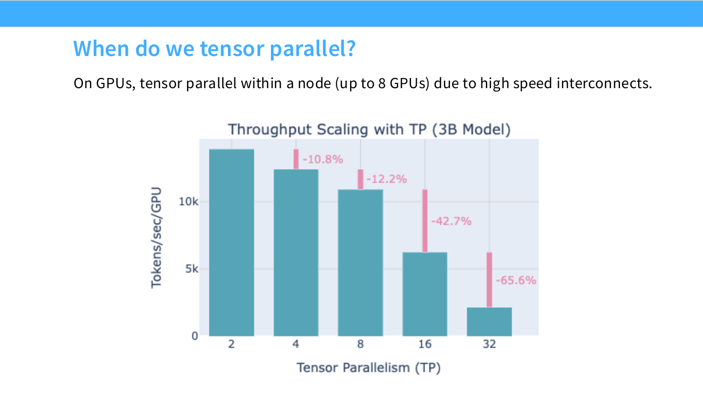

### 讲解
**张量并行的物理硬件局限**：
- 张量并行的通信颗粒度极细，发生在算子内部。前向和反向的每一次矩阵乘法，都需要发起全局的 All-Reduce 或 All-Gather 同步。
- 如果将张量并行扩展到普通的跨服务器网络（以太网或 Infiniband），网络延迟会瞬间拖垮 GPU 算力。
- **硬性准则**：在工程实践中，张量并行（TP）度**绝不能超过物理节点内的 GPU 卡数（通常 $`\le 8`$）**。只有在节点内通过双向 $`1.8 \text{ TB/s}`$ 带宽的 NVLink 高速总线直连时，才能有效承受 TP 极高频的同步通信负载。

---

## Slide 43

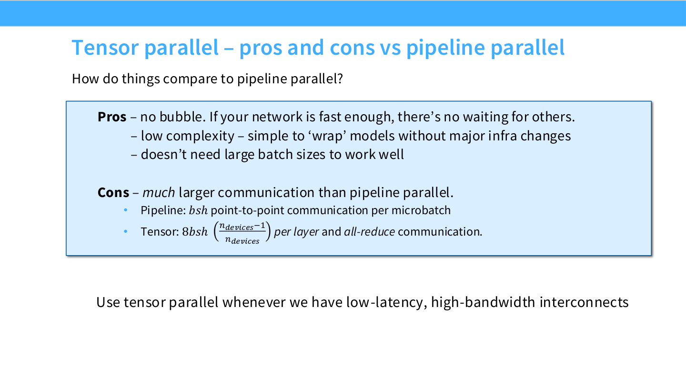

### 讲解
**张量并行与流水线并行的优劣全方位对比**：
- **张量并行 (TP)**：
  - **优点**：完全无流水线气泡，所有 GPU 并发吞吐；系统复杂度低，仅需算子级 sharding，易于 wrap 代码；在小 Batch（如单条样本在线推理）下表现优异。
  - **缺点**：通信频率极高，每层都有 $`b \times s \times h`$ 量级的 All-Reduce 全局通信，只能在极高速的 NVLink 下存活。
- **流水线并行 (PP)**：
  - **优点**：通信频率极低，仅在阶段边缘传输少量的边界激活值（P2P 点对点通信），网络带宽门槛低，极利于跨节点扩展。
  - **缺点**：引入流水线气泡，需要大批次 Micro-batch 才能维持利用率；调度复杂。

---

## Slide 44

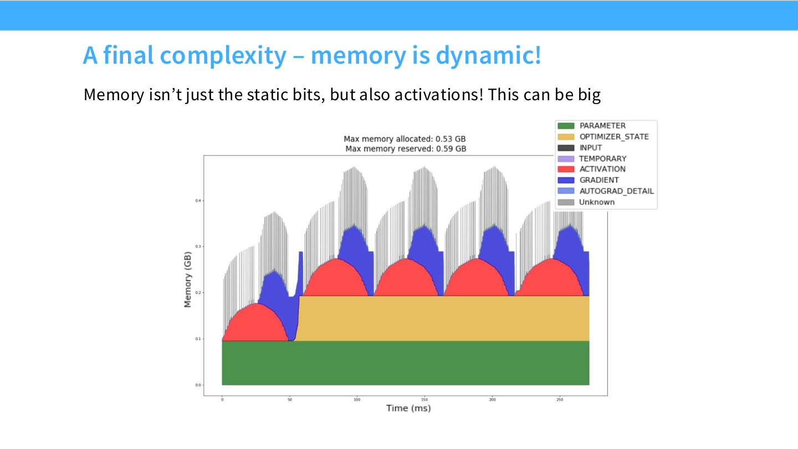

### 讲解
**大模型训练的隐形显存刺客 —— 前向激活值 (Activations)**：
在大模型分布式系统设计中，除了参数、梯度和优化器状态这三个“静态”显存大头外，还有一个极易引发 OOM 的隐形刺客 —— **前向激活值显存（Activation Memory）**。
前向传播产生的中间激活值必须在显存中保留，直到反向传播对应层计算梯度时被消耗。当模型的 Batch Size、序列长度（Sequence Length）以及隐藏维度增加时，激活值显存会呈线性甚至平方级发生爆炸。

---

## Slide 45

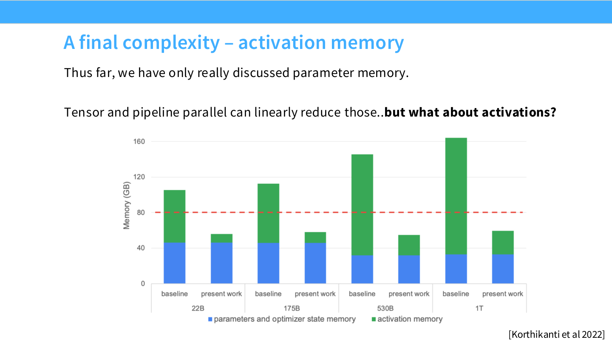

### 讲解
**大模型激活值显存消耗的定量公式推导**：

根据 [Korthikanti et al. 2022] 论文的严密推导，我们来核算单层 Transformer（未做任何重计算，使用常规注意力）的激活值显存。
设 Batch size 为 $`b`$，序列长度为 $`s`$，隐藏层维度为 $`h`$，多头注意力头数为 $`a`$：
- **自注意力部分（MHA）**：
  - 各个线性投影层及注意力权重矩阵的保存，总共需要消耗：
    ```math
    \text{Memory}_{\text{attn}} = 11 bsh + 5 b s^2 a \text{ 字节}
    ```
- **MLP 部分**：
  - 各个激活函数、门控投影层的保存，消耗：
    ```math
    \text{Memory}_{\text{MLP}} = 19 bsh \text{ 字节}
    ```
- **两部分总和**：
  ```math
  \text{Total Activations per layer} = 30 bsh + 5 b s^2 a \text{ 字节}
  ```
其中，含有 $`s^2`$ 强相关项（$`5 b s^2 a`$）来自 Softmax 后的 Attention 权重和 Dropout 掩码。在 FlashAttention 出现后，这一项可以通过片上重计算直接被完全消除（Drop off）。但剩下的 $`30 bsh`$ 项依然巨大。

---

## Slide 46

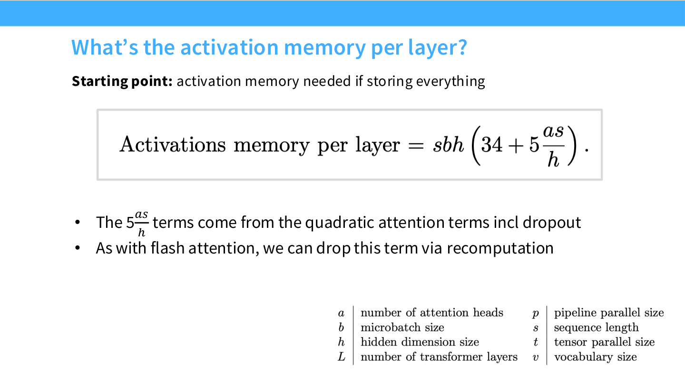

### 讲解
**为什么张量并行无法完全消除激活值显存？**
当我们对一个 Transformer 层应用张量并行（切分度为 $`t`$）时，我们确实将主要矩阵乘法产生的激活值也均分了。
但是，在 Transformer 层内部，还存在大量**非矩阵乘法的 pointwise 逐元素算子**（例如 LayerNorm、Dropout 等）。
这些 pointwise 算子所需的激活值（总计约为 $`10 bsh`$）在张量并行中**无法被分片，依然需要在每张 GPU 上完整保留一份**：
- **输入 LayerNorm**：$`4 bsh`$ 字节。
- **Attention Dropout**：$`2 bsh`$ 字节。
- **MLP LayerNorm**：$`4 bsh`$ 字节。
随着模型规模增加，这些无法被分片的 $`10bsh`$ 激活值将在卡数增多时成为系统瓶颈，导致无法实现真正的显存线性扩展。

---

## Slide 47

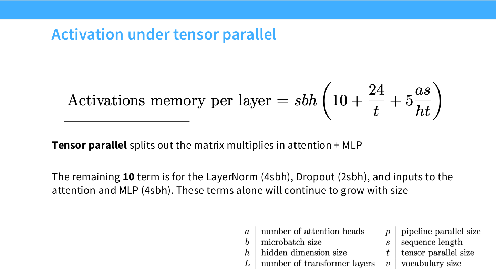

### 讲解
**让激活值显存重归线性 —— 序列并行（Sequence Parallelism）**：
- **核心洞察**：既然这些 pointwise 算子（如 LayerNorm, Dropout）是沿着序列长度维度 $`s`$ 独立运行的，我们为什么不**沿着序列长度轴（Sequence Dimension）把激活值也切开**分给不同的 GPU 呢？
- **机制流程**：
  - 在进入 LayerNorm 和 Dropout 时，将激活值沿序列长度拆分（每张卡只负责 $`\frac{s}{t}`$ 长度）。
  - 在进入矩阵乘法（需要完整特征）之前，通过 **All-Gather** 原语重组激活值进行计算。
  - 在矩阵乘法输出端，直接通过 **Reduce-Scatter** 获得局部的序列切片，直接进行局部的 Dropout 和 LayerNorm 计算。
  - 这一机制巧妙地将大模型的激活值内存消耗也完全降低为了 $`\frac{1}{t}`$。

---

## Slide 48

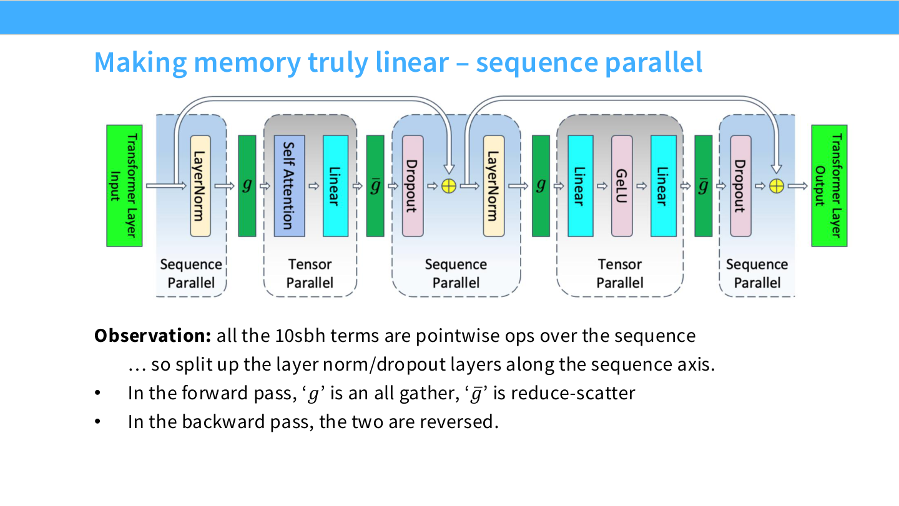

### 讲解
**序列并行与张量并行的通信交换逻辑**：
在反向传播和前向传播时，序列并行（SP）与张量并行（TP）在通信层面上是完全对称的：
- **前向传播**：在进入自注意力算子前，调用一次 **All-Gather**（将序列切片重新拼回完整序列）；在算子输出端，调用一次 **Reduce-Scatter**（直接把输出按序列切片散播开）。
- **反向传播**：这两个通信操作的物理方向转换正好完全反转。
这一机制使得 pointwise 层的激活显存也可以完美分摊，达到了真正的多机显存线性扩展。

---

## Slide 49

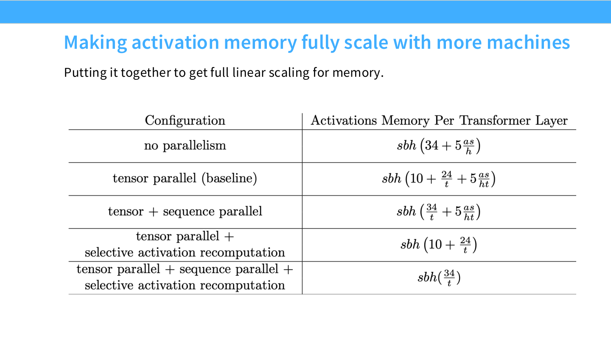

### 讲解
**专家并行（Expert Parallelism, EP）原理**：
在混合专家模型（MoE）中，MLP 层被替换为了多个并行的“专家”（Experts）：
- **sharding 策略**：我们不把专家的大矩阵像 TP 一样切开，而是**把不同的专家完整地存放在不同的 GPU 上**（例如 `Rank 0` 负责专家 1，`Rank 1` 负责专家 2）。
- **激活值路由**：输入 Token 经过门控计算后，通过 `All-to-all` 原语将 Token 的隐藏状态定向发送给对应专家所在的 GPU。专家在本地计算完毕后，再次通过 `All-to-all` 发送回原始设备进行拼接。
- **特点**：专家并行比张量并行具有更高的计算效率，因为它不需要切分矩阵，避免了高频的小矩阵运算退化；但其瓶颈转移到了 `All-to-all` 通信网络上。

---

## Slide 50

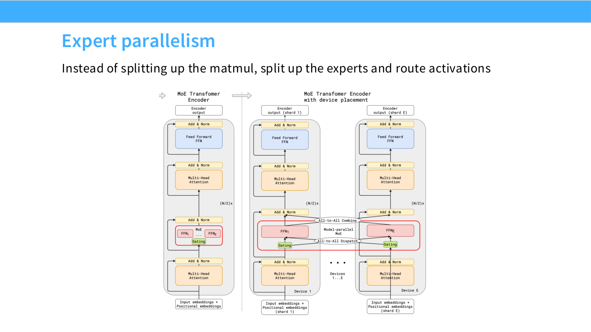

### 讲解
**专家并行（EP）的性能优势与挑战**：
- **相较于张量并行的优势**：在 TP 中，如果我们将矩阵切得太小，GPU 的 Tensor Core 会因为输入矩阵过窄而无法吃满（计算效率下降）。而 EP 使得每个专家依然可以处理整块 Token 矩阵，矩阵乘法吞吐效率极高。
- **挑战**：它非常依赖底层高吞吐的 All-to-all 通信。如果卡间连接（如跨节点 Infiniband 交换机）带宽不足，路由发送 Token 的时间会彻底拖垮训练速度。

---

## Slide 51

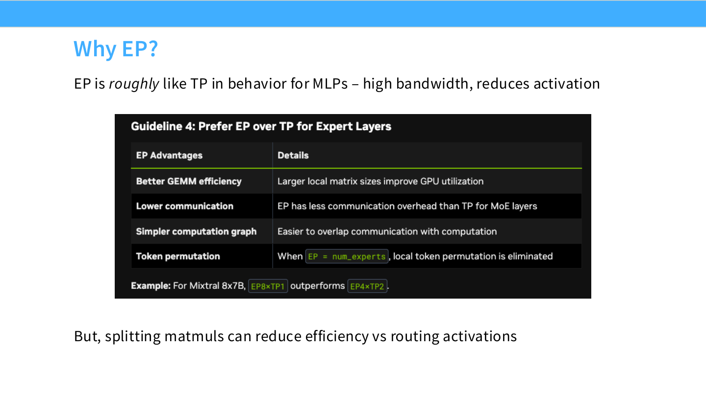

### 讲解
**混合并行下的专家分配复杂性**：
在大型 MoE 模型的混合并行（DP + TP + PP + EP）中，专家并行的设备数（EP 大小）通常会受到很多系统性约束：
- 专家并行必须在数据并行（DP）的域内进行嵌套（即专家数通常等于或小于数据并行的副本数，$`\text{EP} \le \text{DP}`$）。
- 此外，张量并行（TP）和数据并行（DP）之间的切分如果规划不当，可能会引发严重的通信冲突和负载不均，降低整体的利用率。

---

## Slide 52

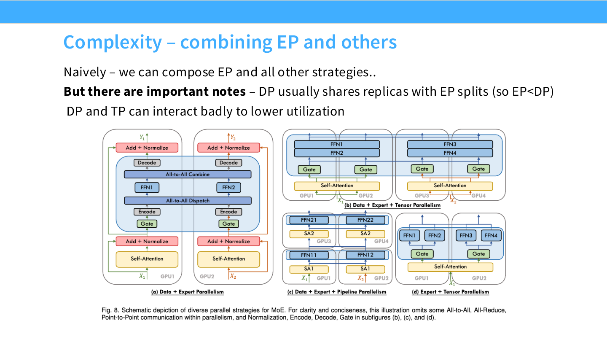

### 讲解
**自注意力与专家并行的物理接耦设计**：
在 MoE 模型中，自注意力机制（MHA）是密集（Dense）计算的，而后面的 MLP 是稀疏（Sparse / MoE）计算的。这导致了并行度设计上的天然冲突：
- 对于**自注意力块**：因为所有 Token 都要参与计算，为了并开显存，我们需要设置较大的张量并行（TP）或上下文并行（CP）。
- 对于 **MLP/专家块**：为了让专家的矩阵乘法保持高算力利用率，我们更倾向于降低 TP，转而使用专家并行（EP）。
- **解决方案**：现代分布式框架（如 Megatron-Core MoE 模块）支持对 Attention 和 MLP **使用完全不同的并行通信域**（如 TP/CP 用于 Attention，而 EP 用于 MLP），实现极致的异构并行调优。

---

## Slide 53

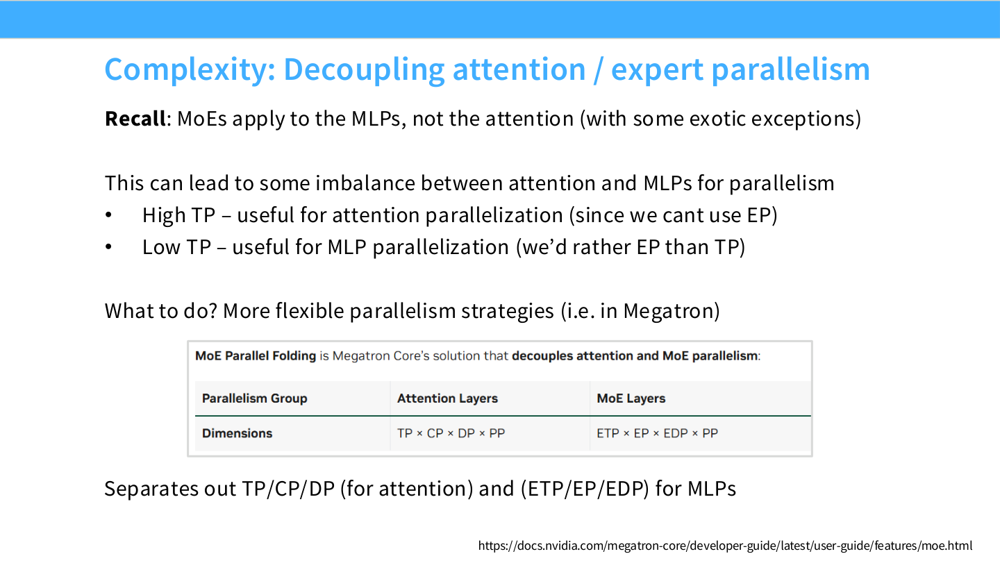

### 讲解
**上下文并行 / 环形注意力 (Context Parallelism / Ring Attention)**：
随着大模型上下文窗口（Context Window）迈入百万、千万级别：
- 流水线和张量并行在处理单条超长 Sequence 时也会显存溢出。
- **上下文并行 (CP)**：我们将单条 Sequence 沿着长度轴（Sequence Dimension）进行物理拆分，分发到不同的 GPU 上。在计算 Attention 矩阵时，数据通过环形传递（Ring-passing）的方式在相邻 GPU 间流转，异步累加 Softmax 分母与值，实现了超长文本的无缝训练。

---

## Slide 54

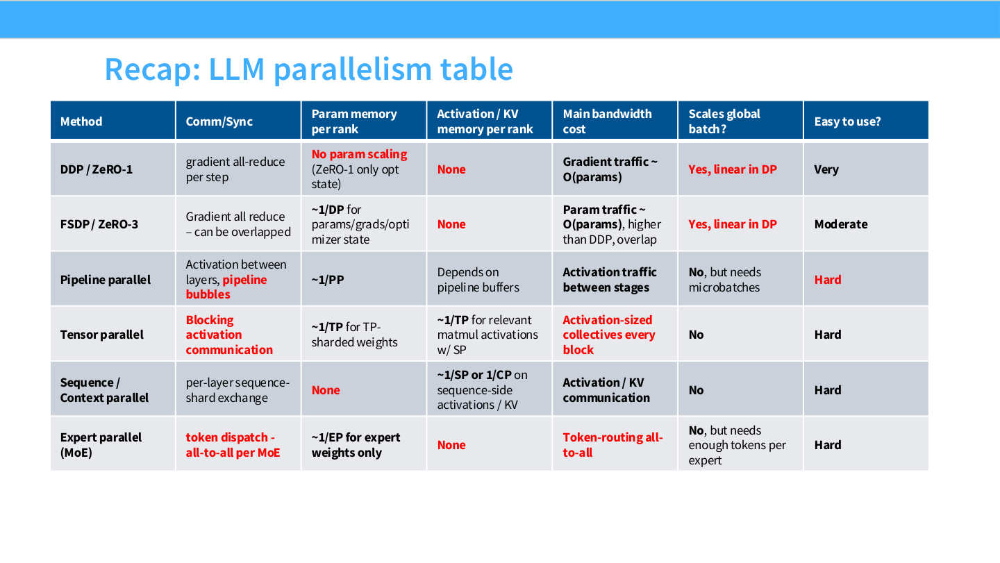

### 讲解
**终极总结 —— 经典并行技术大比拼**：

本页提供了一张极其硬核的并行机制对比大表，汇总了主流策略在同步、显存、带宽和易用性上的权衡：

- **DDP / ZeRO-1**：
  - **同步方式**：异步梯度 All-Reduce（每一步结束时）。
  - **显存分摊**：参数和激活值无缩减（ZeRO-1 仅分片优化器状态）。
  - **通信带宽成本**：梯度传输，与模型参数量呈正比（$`O(\text{params})`$）。最易使用。
- **FSDP / ZeRO-3**：
  - **同步方式**：前向/反向算子级即时 All-Gather 与梯度 Reduce-Scatter（可完美重叠）。
  - **显存分摊**：参数、梯度与优化器状态实现 $`\approx \frac{1}{\text{DP}}`$ 显存缩减。
  - **通信成本**：高达 $`3 \times \#\text{params}`$ 的数据量。中等使用门槛。
- **Pipeline Parallel (PP)**：
  - **同步方式**：跨阶段边界层激活值的点对点（P2P）通信。
  - **显存分摊**：参数分摊至 $`\approx \frac{1}{\text{PP}}`$。激活值取决于 micro-batches 缓存区大小。
  - **通信成本**：仅限边界的激活值数据包（网络友好）。极难编写和调试。
- **Tensor Parallel (TP)**：
  - **同步方式**：算子内部高频、同步阻塞式的 All-Reduce/All-Gather。
  - **显存分摊**：参数分摊为 $`\approx \frac{1}{\text{TP}}`$。结合序列并行 (SP) 可将相关激活值分摊为 $`\approx \frac{1}{\text{TP}}`$。
  - **通信成本**：每一层的高频全局 All-Reduce。极度依赖节点内 NVLink 硬件。极难使用。
- **Sequence / Context Parallel (SP/CP)**：
  - **同步方式**：逐层 pointwise 算子前后进行序列切片 exchange 通信。
  - **显存分摊**：参数无分摊，激活值分摊为 $`\approx \frac{1}{\text{SP}}`$ 或 $`\frac{1}{\text{CP}}`$。
  - **通信成本**：激活值维度的 All-Gather / Reduce-Scatter。极难使用。
- **Expert Parallel (EP / MoE)**：
  - **同步方式**：Token 专家路由派发，包含高频的全局 `All-to-all` 通信。
  - **显存分摊**：仅分摊专家层的参数（$`\approx \frac{1}{\text{EP}}`$）。
  - **通信成本**：极度依赖网络交换机对 `All-to-all` 路由的吞吐性能。极难使用。

---

## Slide 55

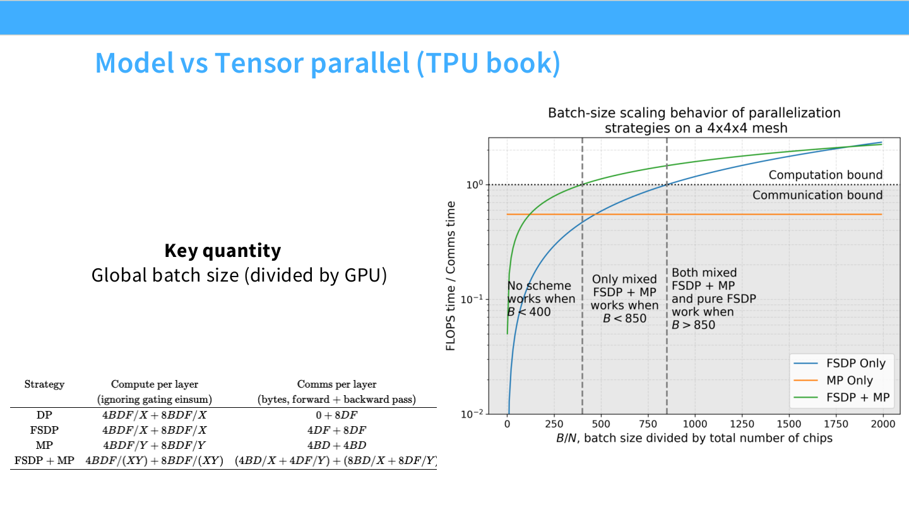

### 讲解
**模型并行与数据并行的硬件边界约束 (TPU Book 核心视角)**：
在规划分布式策略时，我们必须将全局批次大小（Global Batch Size）与各并行的设备维度进行绑定。
- 全局批次大小必须能被数据并行（DP）和流水线并行（PP）的超参数整除。
- 此外，我们需要在“让计算单元饱和（Tensor Parallel）”与“让设备间传输最小（Data Parallel）”之间寻找物理最优解。

---

# Part 3: Advanced Parallelism & Case Studies (高级混合并行与大模型工程案例)

## Slide 56

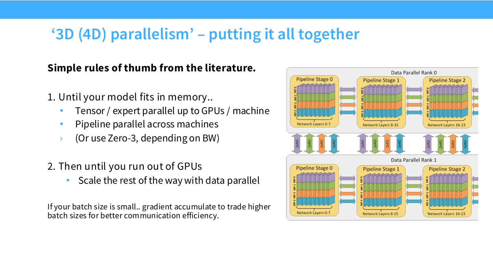

### 讲解
**3D/4D 混合并行（3D Parallelism）工程法则**：

当面临百亿、千亿级别的具体模型训练任务时，系统工程师需要遵循以下两步走的混合金律：
1. **显存物理容纳优先**：
   - 首先利用**节点内部**极高速的 NVLink 带宽配置 **Tensor Parallel (TP)** 和 **Expert Parallel (EP)**。
   - 如果显存依然装不下，利用低带宽、P2P 特性的 **Pipeline Parallel (PP)** 跨越物理服务器机架进行深度切分。
   - （或者在大带宽跨节点网络下，部署 FSDP/ZeRO-3 以替代 PP，取决于集群网卡性能）。
2. **算力效率的水平扩展**：
   - 当模型通过 TP 和 PP 已经能够稳定塞入显存且没有 OOM 隐患后，剩下的物理 GPU 预算全部分配给 **Data Parallel (DP / ZeRO-1)**，用以水平扩展训练的总吞吐量。
   - **调优**：如果 Batch Size 较小，可结合**梯度累加（Gradient Accumulation）**技术，用吞吐时间换取通信隐藏效率。

---

## Slide 57

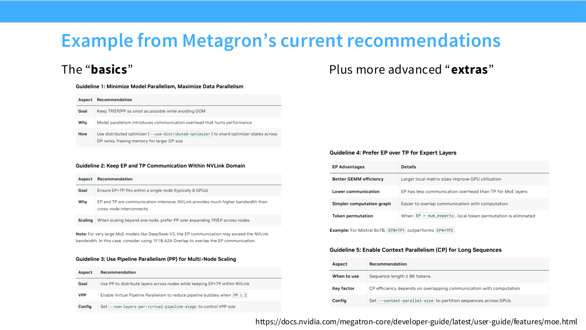

### 讲解
**现代大模型混合并行的前沿设计框架 (Megatron-Core 推荐方案)**：
现代前沿的混合并行已经不再是简单的 3D 并行，而是融合了：
- 节点内：Tensor Parallel (TP) + Sequence Parallel (SP) + Expert Parallel (EP)
- 节点间：Context Parallel (CP) + Pipeline Parallel (PP) + Data Parallel (DP)
- 这些维度的正交排列组合需要通过复杂的通信域划分，以防各集合原语在网络线缆中发生物理碰撞。

---

## Slide 58

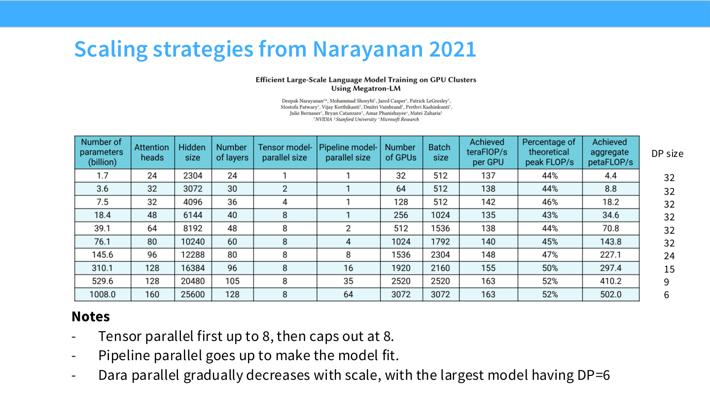

### 讲解
**Narayanan 2021 经典扩展实验曲线分析**：

Narayanan 在其 2021 年的研究中给出了大模型扩展时 3D 并行强度的分配曲线：
- **TP 强度的物理封顶**：在所有配置下，张量并行度（TP）均被优先、并且最大限制为 **8**（即紧紧锁死在单节点的 8 张卡内）。超出 8 会引入跨节点 TP 导致性能崩溃。
- **PP 强度的线性提升**：随着模型参数量翻倍，流水线并行度（PP）被逐渐调高，用以分摊超深的 Transformer 层数。
- **DP 强度的动态缩减**：在总设备数固定时，随着 TP 和 PP 的乘积变大，数据并行度（DP）会被迫逐渐缩小。在超大规模训练中，DP 会降到极低位。

---

## Slide 59

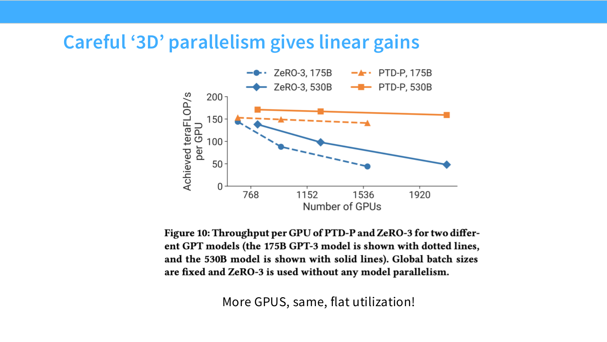

### 讲解
**3D 混合并行下的算力利用率（MFU）稳定性**：
- 实验证实，只要我们严密遵循“节点内 TP/EP，节点间 PP，外层 DP 扩展”的分层网络映射逻辑，整个集群在横向扩展时的算力吞吐利用率（MFU）可以保持高度的扁平与稳定。
- 如图所示，在 GPU 数量呈数倍扩展时，通过精准微调 3D 混合维度的占比，系统的实际 FLOPS 吞吐能够实现极其平稳的近线性扩展。

---

## Slide 60

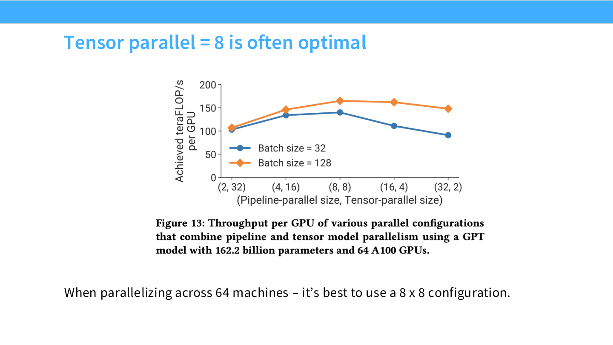

### 讲解
**为什么 TP=8 往往是大模型配置的最优解？**
- 无论是 A100 还是 H100，标准的 HGX 物理机机箱内部固定安装 8 张 GPU，8 张卡之间全部插满高速全连接的 NVSwitch。
- 一旦我们将 TP 设为 8，意味着张量并行的所有高频 All-Reduce 都被完美锁在单机箱（Node）的 NVLink 内部，绝不外溢到外部网络。
- 例如，当我们拥有 64 台物理机（512 张 GPU）时，最稳妥的方案是采用 $`8 \times 8`$ 拓扑配置：TP 设为 8（占满单节点内 8 张卡），PP 和 DP 则在节点之间进行剩下的 64 倍物理扩展。

---

## Slide 61

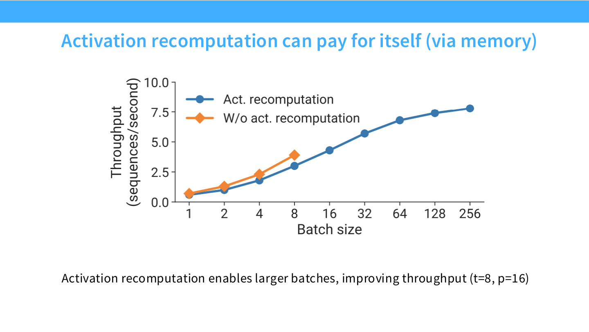

### 讲解
**激活值重计算（Activation Recomputation）的额外吞吐红利**：
- 前文分析过，动态激活值会大量占用显存。
- **重计算策略**：在正向传播时只在特定检查点（Checkpoints）保留激活值，其余激活值丢弃，在反向传播时实时重新计算。
- 这虽然引入了约 $`33\%`$ 额外的计算 FLOPs，但它极大地清理了显存水位。这允许系统工程师使用**大得多的 Batch Size** 进行训练，进而使矩阵乘法更容易吃满 Tensor Core 算力，**最终得到的稳态训练吞吐量反而可能大幅超越不进行重计算的版本**。

---

## Slide 62

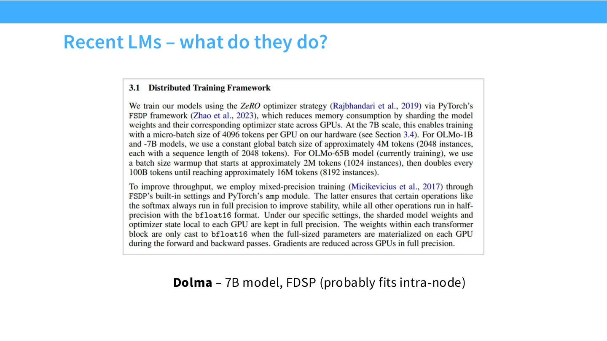

### 讲解
**业界预训练案例研究 1 —— Dolma 7B**：
- **Dolma 7B 大模型**：作为一个相对小巧的模型，在分布式预训练时仅采用了 **FSDP (ZeRO-3)** 并行机制。
- **考量分析**：由于 7B 模型在混合精度下的静态训练状态仅为约 $`14\text{ GB}`$ 左右，完全可以无压力放进单张 A100 (80GB) 内。因此无须引入流水线（PP）或张量并行（TP）带来的复杂代码切片和通信损耗，仅依靠 FSDP 即可在单节点内部实现极致的吞吐同步。

---

## Slide 63

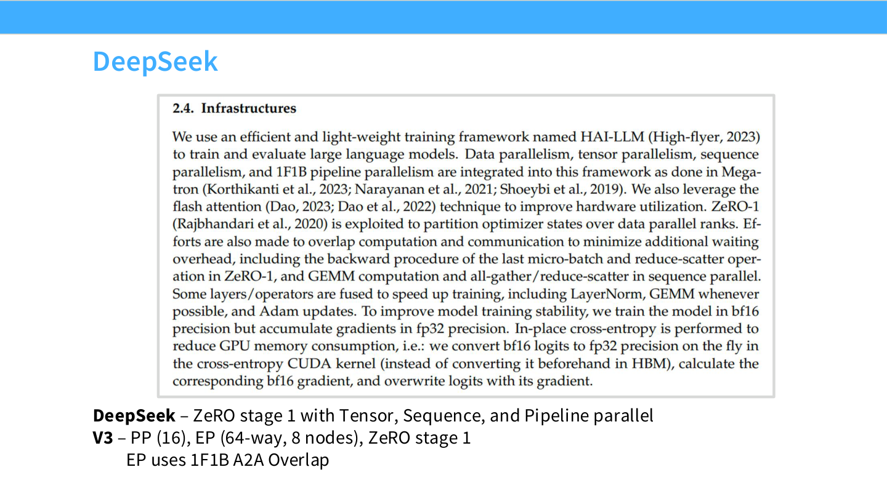

### 讲解
**业界预训练案例研究 2 —— DeepSeek V3**：

DeepSeek V3 作为一个包含大量专家的巨大稀疏 MoE 模型，其并行设计堪称系统工程的杰作：
- **并行配置**：采用了 **ZeRO-1 + TP (1) + PP (16) + EP (64)** 的高难度组合。
- **TP=1 的精妙选择**：为了完全避免张量并行在节点间高频同步导致的带宽灾难，DeepSeek 故意将 TP 设为 1（即 Attention 块完全不切分，在单卡内部跑完）。
- **EP=64 专家路由**：为了分摊 256B 的专家参数，EP 设为 64，将专家均匀分在 8 个物理节点上。节点间通过极强的高吞吐 `All-to-all` 交换网络进行 Token 路由，并配合 1F1B 双向重叠（Overlap）调度，成功掩盖了通信延迟。

---

## Slide 64

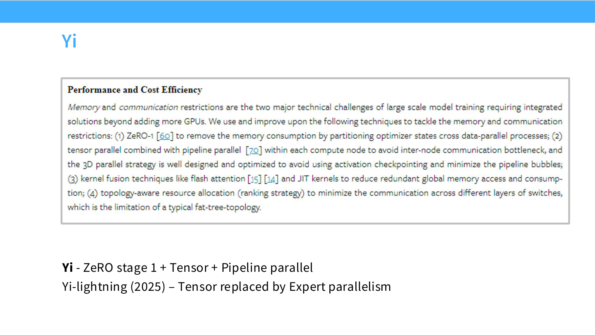

### 讲解
**业界预训练案例研究 3 —— Yi-Lightning**：
- 零一万物开发的 **Yi-Lightning (2025)** 大模型同样采用了类似的分布式优化方案。
- 在大模型架构演进中，Yi-Lightning 逐步在计算密集的 MLP 阶段**完全用专家并行（EP）替代了传统的张量并行（TP）**，并结合 ZeRO-1 和流水线并行（PP），最大化提升了稀疏专家的激活和吞吐效率。

---

## Slide 65

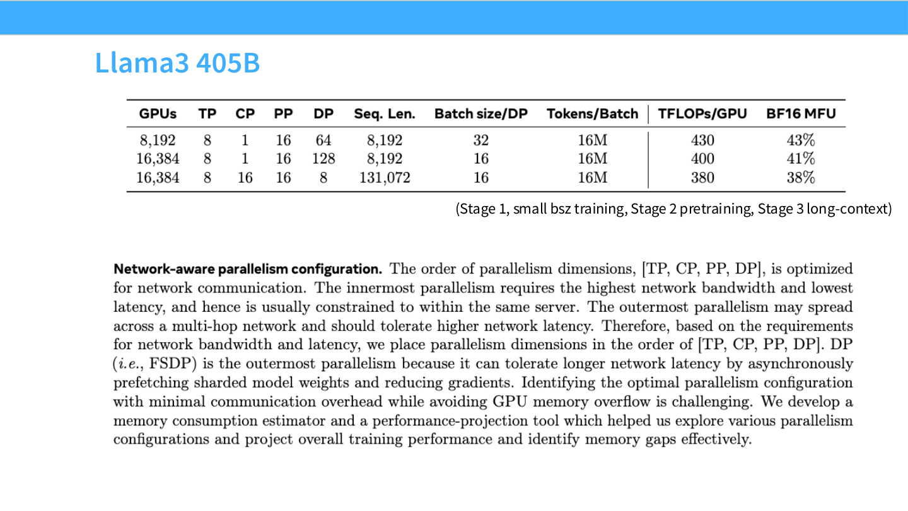

### 讲解
**业界预训练案例研究 4 —— Llama 3 405B（第一阶段：小 Batch 启动）**：

Meta 在 1.6 万张 H100 上训练的 405B 稠密模型，其预训练过程被划分为三个演进阶段：
- **第一阶段（小 Batch 启动）**：
  - 训练初期，为了保证数值收敛稳定性，采用了较小的全局批次（Global Batch Size）。
  - 由于批次小，流水线的微批次数量 $`N_{\text{micro}}`$ 不足，导致 PP 的气泡占比扩大。为了在此阶段维持较高的 MFU，Meta 极度依赖单节点内高效的 **TP=8**（利用 NVLink）与 **ZeRO-1** 的组合。

---

## Slide 66

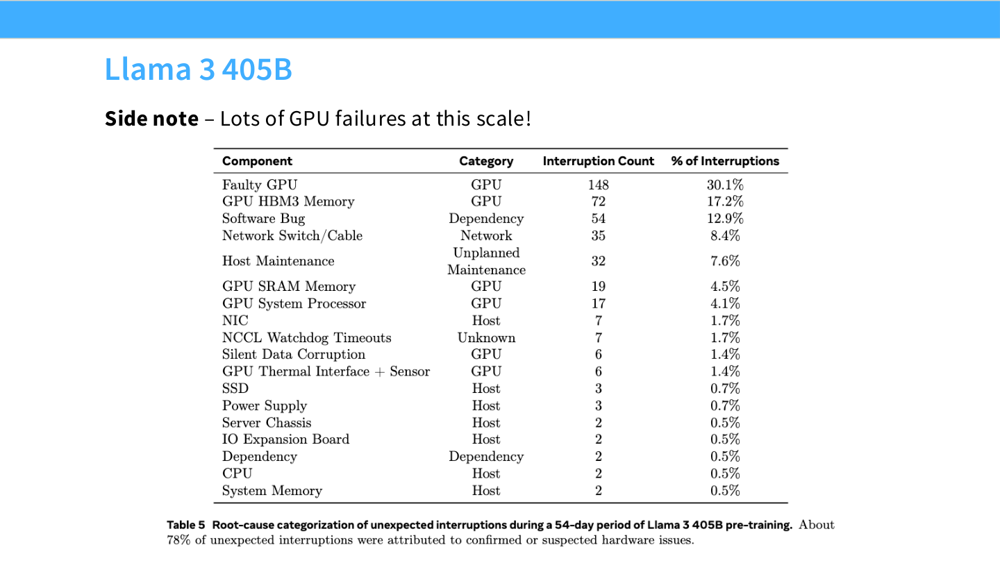

### 讲解
**Llama 3 405B（第二与第三阶段及硬件失效挑战）**：
- **第二与第三阶段（大 Batch 与长上下文扩展）**：
  - 随着 Batch Size 逐步扩大，流水线气泡占比被自然掩盖，PP 利用率恢复，系统进入满载状态。
  - **长文本阶段（CP 引入）**：在最末期拓展到长 context 训练时，进一步引入了 **Context Parallelism (CP = 1)**，在长度方向进行序列切片以防 KV 缓存溢出。
- **大集群痛点：极高频的硬件失效**：
  - 在 1.6 万张 H100 组成的长周期预训练中，平均**每数小时就会发生一次硬件损坏（如 GPU 损坏、HBM 故障或 IB 光纤断裂）**。系统工程的重中之重变成了自动化故障检测、快速 Checkpoint 恢复与网络路由重构。

---

## Slide 67

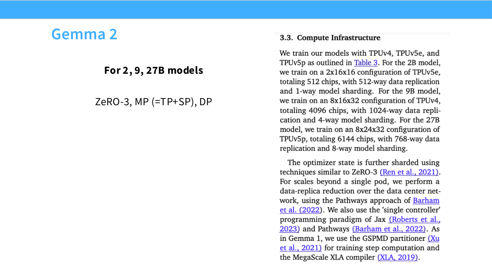

### 讲解
**业界预训练案例研究 5 —— Gemma 2**：
- Google 官方推出的开源模型 **Gemma 2（包含 2B, 9B, 27B）**。
- 由于是开源生态对标，在预训练中，Google 组合采用了 **ZeRO-3 (FSDP)**、结合了序列并行与张量并行的 **MP (= TP + SP)** 混合方案，并在水平外围搭配常规数据并行（DP），以支撑庞大训练吞吐。

---

## Slide 68

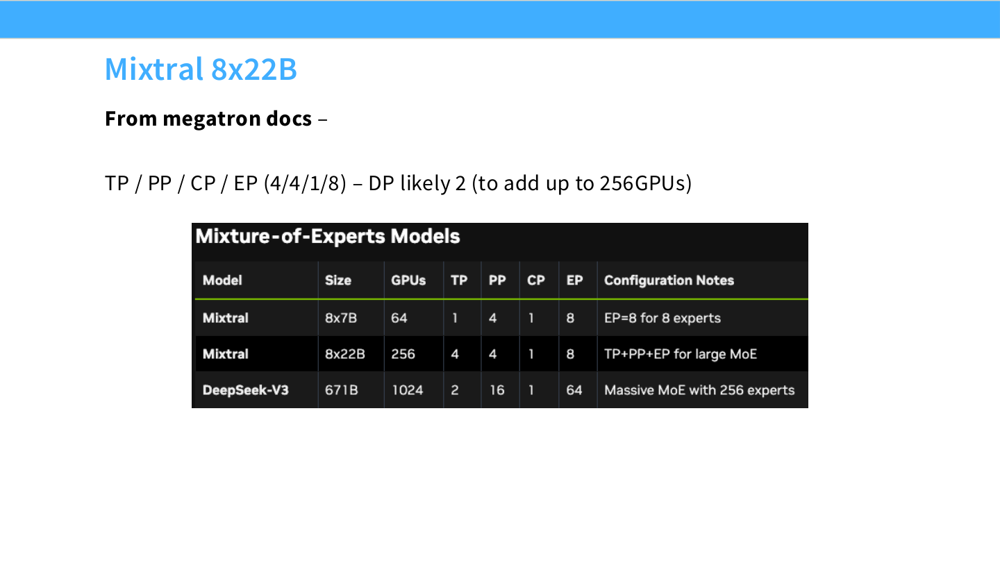

### 讲解
**业界预训练案例研究 6 —— Mixtral 8x22B (Megatron 框架配置)**：
在 Megatron-LM 官方技术报告中，Mixtral 8x22B 的典型并行配置如下：
- **TP / PP / CP / EP 分别为：4 / 4 / 1 / 8**
- **计算逻辑**：
  - 专家并行度为 8（在 8 个进程上分摊专家）。
  - 张量并行设为 4，流水线并行设为 4。
  - 为了凑满总共 256 张 GPU 的集群，数据并行度（DP）相应配置为 2（$`4 \times 4 \times 1 \times 8 \times 2 = 256`$）。

---

## Slide 69

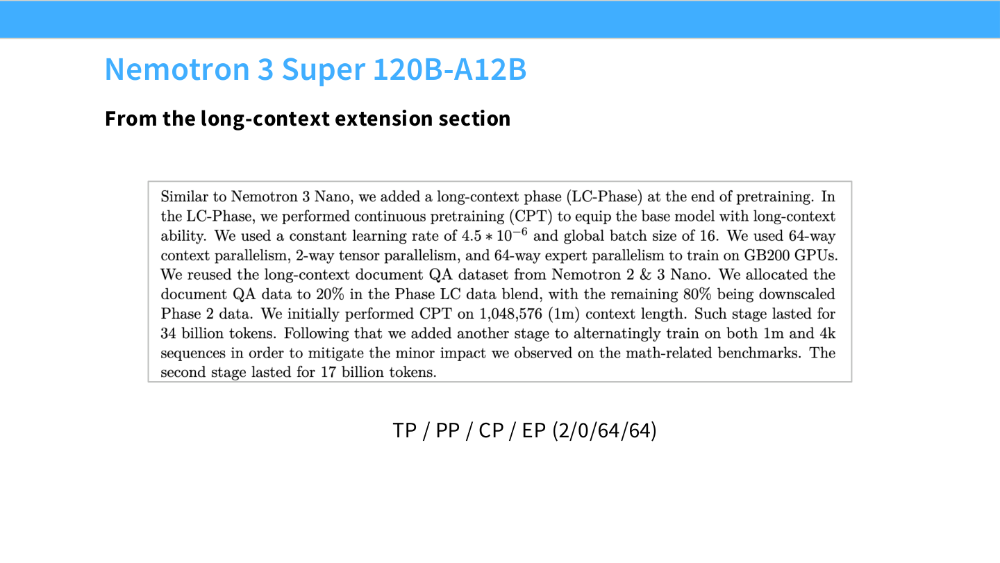

### 讲解
**业界预训练案例研究 7 —— Nemotron 3 Super 120B-A12B**：
NVIDIA 训练的 **Nemotron 3 Super** 采用了极致长文本并行配置：
- **TP / PP / CP / EP 分别为：2 / 0 / 64 / 64**
- **特点分析**：
  - 流水线并行（PP）被设为 0（不启用），以规写微批次气泡限制。
  - 核心亮点是**上下文并行（CP）设为 64**，配合专家并行（EP）设为 64。这表明在处理极长 Sequence 的 MoE 模型训练时，CP 序列切片和 EP 专家路由是整个分布式计算最核心的性能调节阀。

---

## Slide 70

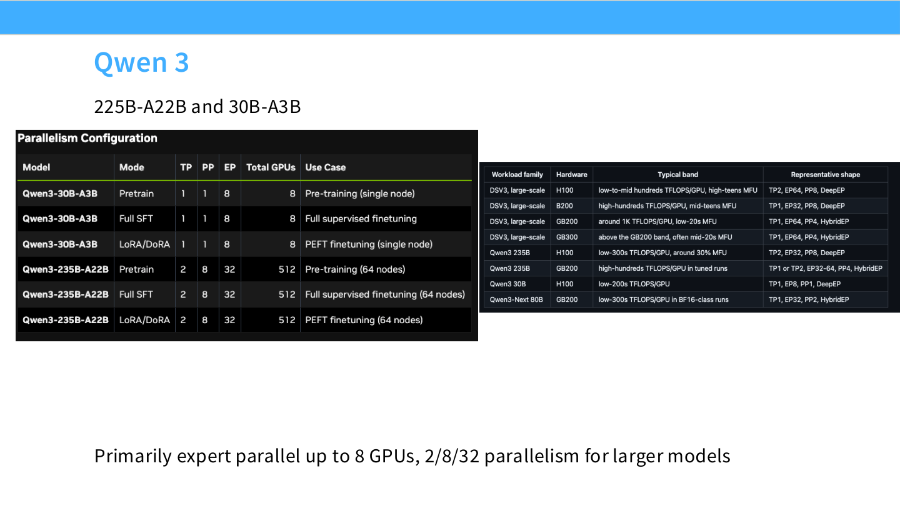

### 讲解
**业界预训练案例研究 8 —— Qwen 3 (千问 3 大模型)**：
- 阿里巴巴团队开发的 **Qwen 3** 系列大模型在并行设计上同样处于前沿。
- 在中等规模上，主要采用专家并行（EP）来把不同的专家锁在单节点内部以维持计算效率。
- 在超大规模参数版本上，则采用 **2 (TP) / 8 (EP) / 32 (PP)** 的混合三维并行配置，通过多级的异构切分，榨干集群中数千张 GPU 的物理带宽。

---

## Slide 71

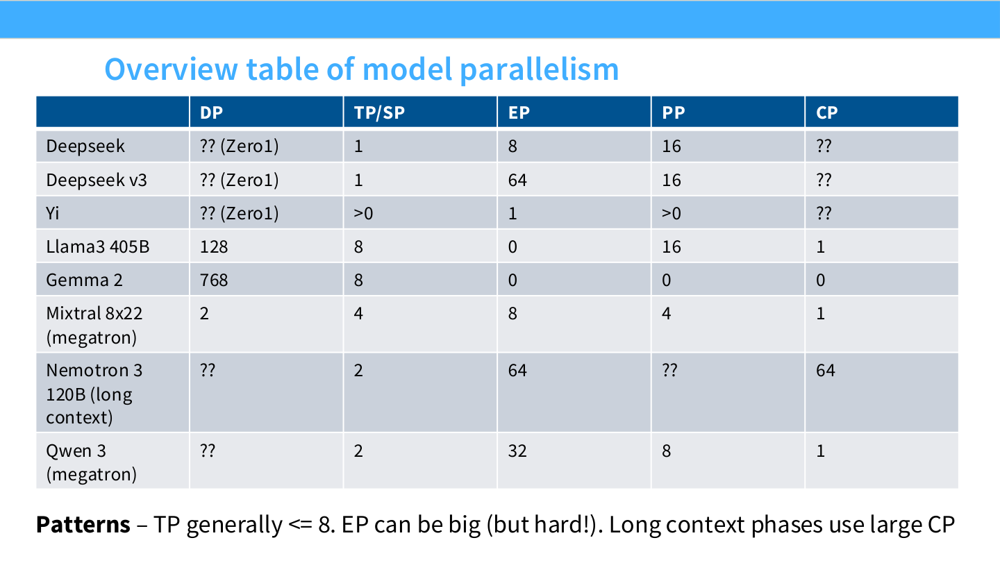

### 讲解
**全网大模型并行配置一览大表**：

本表汇总了业界几款前沿大语言模型在实际生产环境下的分布式并行切分超参数配置：

| 模型名称 | 数据并行 (DP / ZeRO) | 张量并行 (TP/SP) | 专家并行 (EP) | 流水线并行 (PP) | 上下文并行 (CP) |
|---|---|---|---|---|---|
| **DeepSeek V3** | ZeRO-1 | $`1`$ (无 TP) | $`64`$ (跨 8 节点) | $`16`$ | 未公开 |
| **Yi-Lightning** | ZeRO-1 | $`>0`$ | $`1`$ (EP 代 TP) | $`>0`$ | 未公开 |
| **Llama 3 405B** | $`128`$ (DDP) | $`8`$ | $`0`$ (稠密模型) | $`16`$ | $`1`$ (长上下文阶段增高) |
| **Gemma 2** | $`768`$ | $`8`$ | $`0`$ | $`0`$ | $`0`$ |
| **Mixtral 8x22B** | $`2`$ | $`4`$ | $`8`$ | $`4`$ | $`1`$ |
| **Nemotron 3 120B** | 未公开 | $`2`$ | $`64`$ | $`0`$ | $`64`$ (极致长文本) |
| **Qwen 3** | 未公开 | $`2`$ | $`32`$ | $`8`$ | $`1`$ |

**总结性工程规律**：
- **TP 限制在节点内 (TP $`\le 8`$)**：绝大多数模型都会将 TP 限制在 8 以内，以防极其高频的 All-Reduce 通信溢出到外部网络。
- **EP 往往配置较大**：由于专家并行不需要在矩阵乘法内部做切片，因此可以扩展至更大设备数，但极度依赖高速的 `All-to-all` 交换机网络。
- **长文本预训练首选 CP**：在处理超长文本时，上下文并行（CP）会被调得极高以分摊 KV 缓存空间。

---

## Slide 72

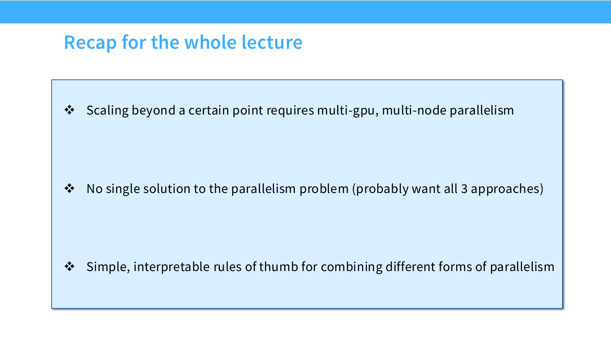

### 讲解
**全课总结与回顾 (Recap for the whole lecture)**：
1. **单芯片时代终结，分布式为王**：当大模型的参数容量越过物理临界值后，单机单卡已无法承载。利用多 GPU、多节点的网络进行水平扩展是唯一的工程出路。
2. **混合并行正交设计**：没有任何单一的并行策略可以完美解决大模型的效率和显存瓶颈。实际大模型预训练必须将数据并行、流水线并行、张量并行、序列并行和专家并行，因地制宜地融合成 **3D/4D 混合并行架构**。
3. **物理瓶颈是唯一的航标**：系统工程师必须以内存带宽和计算受限（Memory-bound vs Compute-bound）为指引，熟练运用“优先节点内 TP/EP，外围 PP/DP”的设计律法，在硬件物理极限的边缘榨干大模型预训练的每一步算力。
