# Lecture 10: 语言模型推理优化 (Inference) 深度笔记

本笔记基于斯坦福 CS336 (Language Modeling from Scratch) 第十讲的课堂内容整理。在完成大语言模型（LLM）的预训练与系统扩展后，本讲将焦点转向模型落地的核心关卡——**推理 (Inference)**。推理与训练在计算特征上有着本质区别，如何突破显存带宽瓶颈、最大化硬件吞吐量，是本讲探讨的核心主题。

> **课程信息**：CS336 · Spring 2026 · 主题：Inference

---

# Part 1: 理解推理工作负载与性能指标

## Slide 1: 推理的广泛应用与效率痛点

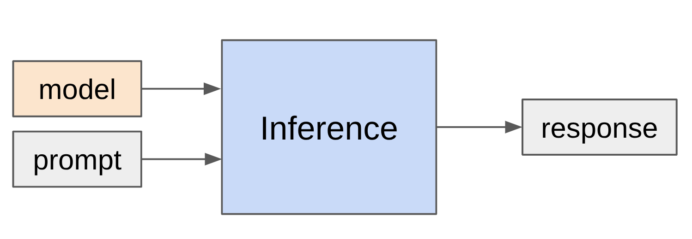

### 1. 为什么推理效率极其重要？
- **训练是一次性的，推理是重复无限次的**：训练成本只在研发阶段发生一次，而推理成本伴随着每一次用户请求、代理（Agent）调用、强化学习（RL）策略采样不断累积。
- **产业现状**：OpenAI 每天处理大约 **8.6万亿** 个 Token；作为对比，目前最前沿的开源模型 DeepSeek-V4 的预训练语料总量为 32万亿 个 Token。这意味着，推理端消耗的算力正在以惊人的速度追赶并超越训练端。
- **智能体（Agent）的爆发**：智能体在处理一个用户请求时，内部可能会自我调用、编写并执行代码、生成上百步 trace，从而导致生成的 Token 数量指数级膨胀。**Generated Tokens = Compute Spent**，每一次生成都是真金白银的算力损耗。

---

### 2. 推理服务化生态
目前业界主流的开源推理引擎主要包括：
- **vLLM**（Berkeley 团队）：首创 PagedAttention（分页注意力），是目前最流行的通用高吞吐推理引擎。
- **SGLang**（Berkeley 团队）：首创 RadixAttention，特别针对多轮对话、智能体（Scaffolds）中的共享前缀进行了极致优化。
- **TensorRT-LLM**（NVIDIA 官方）：针对 NVIDIA GPU 架构进行深度优化的闭源底层库。
- **llama.cpp**：纯 C/C++ 实现，支持 CPU 推理与轻量化量化，适合在个人电脑、手机等本地端侧（On-device）运行。

---

### 3. 三大核心推理指标
在评估推理性能时，我们需要区分以下三个维度：

| 指标 | 全称 | 定义与场景 |
|:---|:---|:---|
| **TTFT** | Time-To-First-Token | 用户发出请求到模型吐出第一个字符的时间延迟。对交互式聊天至关重要，主要受 **Prefill（预填充）** 阶段的速度决定。 |
| **Latency** | Latency (s/token) | 生成阶段每产生一个 Token 所需要的时间。决定了用户阅读时的流畅感。 |
| **Throughput** | Throughput (tokens/s) | 整个推理系统在单位时间内服务所有并发用户所能吐出的 Token 总数。对离线批处理（Batch Processing）最重要。 |

---

# Part 2: 算术强度 (Arithmetic Intensity) 与显存带宽瓶颈

大语言模型推理面临的最核心物理限制是 **显存带宽瓶颈（Memory Bandwidth Bound）**。

---

## Slide 2: 算术强度与硬件瓶颈模型

### 1. 矩阵乘法的算术强度推导
算术强度（Arithmetic Intensity）的定义为：**硬件执行的浮点运算数 (FLOPs) 与从外部存储（如 HBM 显存）传输的字节数 (Bytes) 之比**。

我们以矩阵乘法 $Y = X \cdot W$ 为例，其中激活值 $X \in \mathbb{R}^{B \times D}$，权重矩阵 $W \in \mathbb{R}^{D \times F}$。在混合精度（BF16/FP16，每个数值占 2 字节）下进行计算：
1. 从 HBM 读取激活值 $X$：$2 \cdot B \cdot D$ 字节。
2. 从 HBM 读取权重 $W$：$2 \cdot D \cdot F$ 字节。
3. 执行矩阵乘法（一次乘加算 2 FLOPs）：$2 \cdot B \cdot D \cdot F$ FLOPs。
4. 将结果 $Y \in \mathbb{R}^{B \times F}$ 写回 HBM：$2 \cdot B \cdot F$ 字节。

$$\text{Arithmetic Intensity} = \frac{2 B D F}{2 B D + 2 D F + 2 B F} = \frac{B D F}{B D + D F + B F}$$
假设模型隐藏维度 $D$ 和前馈维度 $F$ 远远大于 Batch Size $B$（即 $B \ll D, F$），我们取极限：
$$\lim_{D, F \to \infty} \frac{B D F}{B D + D F + B F} = B$$
- **核心结论**：矩阵乘法的计算算术强度**本质上等于 Batch Size $B$**。

---

### 2. 硬件瓶颈分水岭：Roofline 模型
我们以 NVIDIA H100 GPU 为例：
- 半精度计算性能：$\text{Peak FLOPs} = 989 \times 10^{12} \text{ FLOP/s}$ (989 TFLOPs)。
- 显存带宽：$\text{Memory Bandwidth} = 3.35 \times 10^{12} \text{ Bytes/s}$ (3.35 TB/s)。
- **硬件临界算术强度 (Accelerator Intensity)**：
  $$\text{Threshold} = \frac{\text{Peak FLOPs}}{\text{Memory Bandwidth}} = \frac{989 \text{ TFLOPs}}{3.35 \text{ TB/s}} \approx 295 \text{ FLOP/Byte}$$
- **判定法则**：
  - 如果计算的算术强度 $> 295$：属于 **计算受限 (Compute-bound)**，GPU 的 Tensor Core 全速运转，效率极高。
  - 如果计算的算术强度 $< 295$：属于 **内存受限 (Memory-bound)**，计算单元大部分时间在闲置等待数据从显存搬运过来。
  - 由于矩阵乘法的算术强度约等于 $B$，这意味着：**只有当并发 Batch Size $B > 295$ 时，模型计算才能进入计算受限的黄金区间；而单用户推理（$B = 1$）是极端的内存受限任务，算术强度仅为 1，GPU 的算力被极度浪费。**

---

## Slide 3: 推理两阶段的算术强度计算

大模型推理包含两个阶段：**预填充 (Prefill)** 与 **生成 (Generation)**。我们假设输入提示词长度为 $S$，正在生成的 Token 数量为 $T$。

```
                    【Prefill 阶段 (T = S)】
                    一次性并行编码所有输入
                    (计算强度为 S/2，易进入 Compute-bound)
                             │
                             ▼
                    【Generation 阶段 (T = 1)】
                    单步自回归循环生成，每次只输入 1 个 Token
                    (注意力计算强度 < 1，极度 Memory-bound)
```

---

### 1. MLP（前馈网络）层
在经典的门控前馈网络（如 SwiGLU）中，包含三个大矩阵：$W_{\text{up}}, W_{\text{gate}}, W_{\text{down}}$。
- **FLOPs 消耗**：$6 \cdot B \cdot T \cdot D \cdot F$。
- **显存传输**：读取激活值和写回结果共 $4 B T D + 4 B T F$，读取三个大权重矩阵共 $6 D F$。
- **算术强度**：在 $B \cdot T \ll D, F$ 时，算术强度退化为 $B \cdot T$。
  - **Prefill (T = S)**：输入 Token 数量大，易进入计算受限。
  - **Generation (T = 1)**：算术强度为 $B$。只有通过拼命加大并发 Batch Size $B$，才能让 FFN 层摆脱显存瓶颈。

---

### 2. Attention（自注意力）层
在自注意力层中，需要将 Query 向量与整个历史的 KV Cache（包含以前生成的 $S$ 个 Token）进行点积。
- **FLOPs 消耗**：$4 \cdot B \cdot S \cdot T \cdot D$。
- **显存传输**：读取 $Q, K, V$ 共 $2 B T D + 4 B S D$，写回 $Y$ 共 $2 B T D$（注意：每一层都需要将之前的所有 KV 向量从 HBM 读取到片上）。
- **算术强度**：
  $$\text{Attention Intensity} = \frac{S \cdot T}{S + T}$$
- **两阶段对比**：
  - **Prefill (T = S)**：算术强度为 $S / 2$。当提示词长度 $S$ 很大时，注意力计算是计算受限的。
  - **Generation (T = 1)**：算术强度为 $\frac{S}{S + 1} < 1$。
- **致命发现**：**生成阶段 Attention 的算术强度上限为 1，且与 Batch Size $B$ 完全无关！** 这是因为虽然 Batch 变大，但每个 Batch 都有自己独立的 KV 向量需要从显存读取，读取开销与 Batch 同步线性放大，无法通过 Batching 来均摊注意力机制的读写成本。

---

## Slide 4: 延迟与吞吐量的抉择 (以 Llama 2 13B 为例)

我们通过具体公式估算 Llama 2 13B（参数大小约 26GB）在一块 H100 GPU 上的表现。

- **Latency（延迟，单步生成耗时）**：
  $$\text{Latency} = \frac{\text{Parameter Size} + \text{KV Cache Size}}{\text{Memory Bandwidth}}$$
- **Throughput（系统吞吐量）**：
  $$\text{Throughput} = \frac{B}{\text{Latency}}$$

---

### 1. Batch Size $B$ 对性能的影响

从下表中可以看出明显的**延迟-吞吐折中**：

| Batch Size ($B$) | 显存占用 | Latency (ms/token) | Throughput (tokens/s) | 硬件表现评述 |
|:---|:---|:---|:---|:---|
| **$B = 1$** | ~26 GB | ~8 ms | ~125 | **极低延迟，极低吞吐**：显存里几乎全是参数，读写极快，但 GPU 算力严重闲置。 |
| **$B = 64$** | ~29 GB | ~9 ms | ~7110 | **黄金平衡**：由于读取 26GB 参数的开销被 64 个并发均摊，系统吞吐量暴增 56 倍，而延迟仅微幅上涨 12.5%。 |
| **$B = 256$** | ~39 GB | ~12 ms | ~21330 | **显存溢出**：虽然吞吐量更高，但大 Batch 下的 KV Cache 膨胀到了 13GB，超出了单卡 80GB 的承受极限（考虑系统开销和非线性碎片），直接 OOM。 |

---

# Part 3: 优化 KV Cache (降低显存占用)

由于推理是显存带宽受限的，且 KV Cache 的显存占用随 Batch Size $B$ 和上下文长度 $S$ 线性暴增，业界提出了各种**降低 KV Cache 大小**的架构创新。

---

## Slide 5: 三大注意力架构演进


### 1. 从 MHA 到 MQA 再到 GQA
- **MHA (Multi-Head Attention)**：每个 Query 头对应一组独立的 Key 和 Value 头（$K = N$）。KV Cache 极其庞大。
- **MQA (Multi-Query Attention)**：所有 Query 头共享同一组 Key 和 Value 头（$K = 1$）。KV Cache 骤降为 $1/N$，但由于参数表达力损失过大，容易降低模型精度。
- **GQA (Grouped-Query Attention)**：折中方案。将 Query 头进行分组，每一组内共享一组 KV 头（$K$ 介于 $1$ 到 $N$ 之间）。
  - **效果**：不仅保持了几乎与 MHA 相同的语言模型准确率，还能让 KV Cache 尺寸缩小为原来的 $1/8$ 或 $1/5$，大幅拉高了系统的最大并发 Batch Size 与生成吞吐量。

### 补充图片

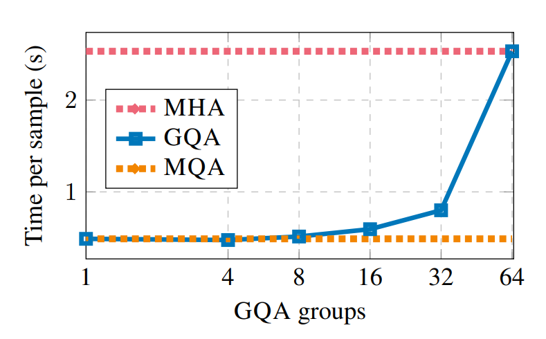
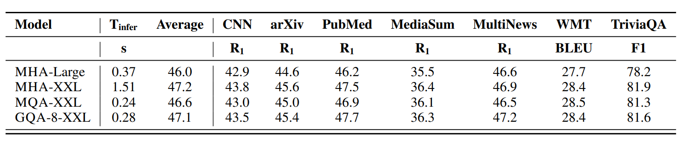

---

### 2. MLA (Multi-head Latent Attention, 多头潜在注意力)
由 DeepSeek 团队提出，是目前最极致的 KV 缓存压缩方案。


- **核心思想：低秩投影压缩**
  在传统的 Attention 中，每一层都需要在显存中存储很大的 $N \times H$ 维度的 KV 特征。MLA 引入了一个压缩瓶颈层，首先将隐藏状态压缩为一个 $C$ 维的潜在向量（Latent Vector）$c$（DeepSeek 中将 16384 维度压缩到仅 $C = 512$ 维度）。
  - 在推理生成时，**显存中只存储压缩后的 512 维向量**。
  - 在计算注意力时，临时在 GPU 算片上用投影矩阵将潜在特征 $c$ 还原（Up-project）为 Key 和 Value。
  - **与 RoPE 的兼容性**：由于旋转位置编码（RoPE）会破坏乘法的结合律（使得位置信息无法在压缩空间中保留），MLA 额外保留了 64 维度的向量专门应用 RoPE，因此最终存储的 KV Cache 只有 $512 + 64 = 576$ 维度，开销远低于传统的 GQA。

### 补充图片


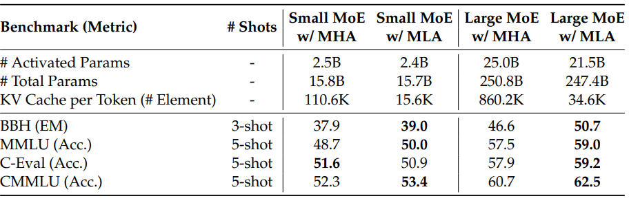

---

### 3. CLA (Cross-Layer Attention, 跨层注意力)
- 思想类似于 GQA 对“头”的共享，CLA 提倡在**相邻的多个 Layer 之间共享 KV Cache**。
- 例如，偶数层直接复用奇数层的 Key 和 Value，从而将显存中的 KV Cache 尺寸直接砍掉一半，显着优化了模型精度的帕累托前沿（Pareto Frontier）。

### 补充图片


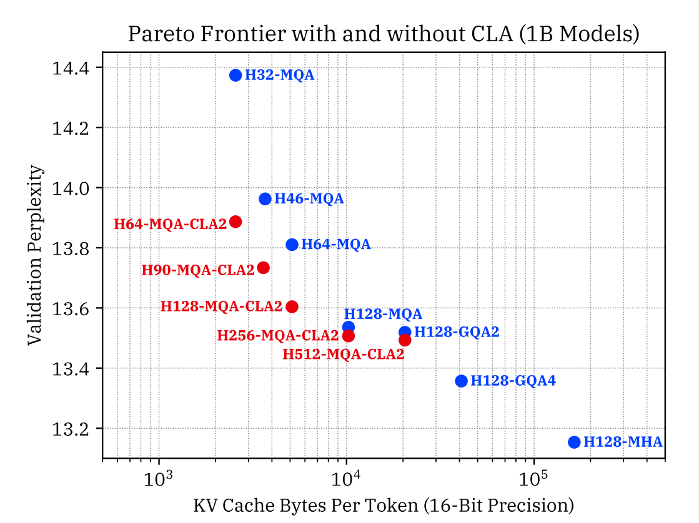

---

## Slide 6: 滑动窗口与稀疏注意力

---

### 1. 局部/滑动窗口注意力 (Sliding Window Attention)
- **原理**：模型只对当前 Token 之前固定长度为 $W$ 的局部窗口内的 Token 计算注意力。


- **优势**：KV Cache 的最大尺寸被锁死在 $W$，**与自回归生成的长上下文序列长度完全脱耦**。
- **劣势**：模型丧失了对远距离历史的直接建模能力。
- **折中**：通常采用“混合层（Hybrid Layers）”架构，即让绝大多数层使用低开销的滑动窗口注意力，每隔几层放置一个全局自注意力层。

---

### 2. DeepSeek-V4 中的稀疏注意力
在最新的超长上下文（支持 1M 长度）模型中，DeepSeek 引入了混合稀疏注意力机制：

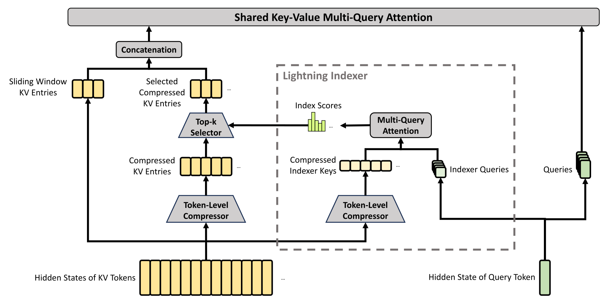

- **CSA (Compressed Sparse Attention)**：每隔 $m$ 个 Token 将特征聚类压缩为 1 个 Token 表达。
- **DSA (DeepSeek Sparse Attention)**：通过路由门控只选择前 $k$ 个最重要的 KV 块进行计算。
- **HCA (Heavily Compressed Attention)**：应用极高倍率的重压缩，极大削减了超长上下文下的访存压力。

---

# Part 4: 降精度与模型压缩 (Quantization, Pruning)

除了改变模型架构，我们还可以通过压缩参数大小来突破显存限制。

---

## Slide 7: 量化 (Quantization)

量化指的是将模型权重和激活值从高精度的浮点数（如 BF16，2字节）转换为低精度的数据格式（如 FP8、INT8 或 INT4，分别占 1字节、1字节和 0.5字节）。

### 1. 线性量化数学原理
将浮点数 $x$ 映射到低精度整数 $x_{\text{quant}}$ 的公式为：
$$x_{\text{quant}} = \text{round}\left( \frac{x}{\text{scale}} \right) + \text{zero\_point}$$
反量化（Dequantize，在计算矩阵乘法前还原为浮点数）公式为：
$$x_{\text{approx}} = (x_{\text{quant}} - \text{zero\_point}) \times \text{scale}$$

---

### 2. 量化方案分类
- **量化感知训练 (Quantization-Aware Training, QAT)**：
  在训练前向传播中加入模拟量化误差，让参数在训练阶段主动去“适应”低精度。精度高，但训练开销巨大。
- **后训练量化 (Post-Training Quantization, PTQ)**：
  在模型预训练完成后直接进行量化，成本极低。
  - **GPTQ**：利用海森矩阵（Hessian Matrix）的信息，动态微调剩余未量化的参数权重，以补偿量化带来的精度失真。

---

### 3. 激活值敏感量化 (Activation-Aware Quantization, AWQ)
- **核心洞察**：模型参数对量化误差的敏感度极度不均。通常只有 0.1% 至 1% 的显著通道（Salient Channels，对应激活值极大的通道）对保留模型精度起决定性作用。

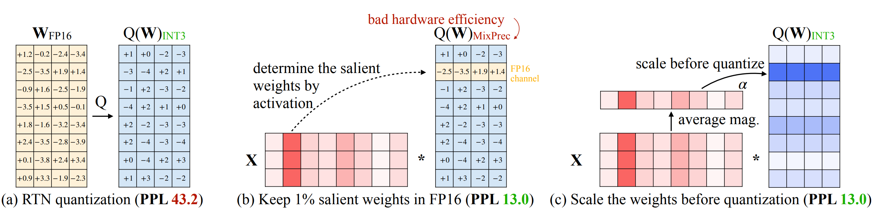

- **AWQ 策略**：不盲目追求均匀低精度，而是根据校准数据集上的激活值大小，挑选出这 1% 极其关键的参数通道保持 FP16 高精度，其余 99% 的参数全部压入 INT3/INT4。该方案实现了 4倍 显存削减，且几乎做到了无损精度。

---

## Slide 8: 模型剪枝与知识蒸馏

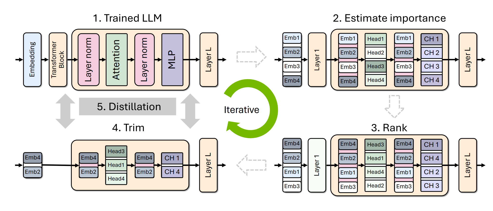

### 讲解
**剪枝（Pruning）** 是指直接在已有的庞大模型中，将贡献度低的部分（整层 Layer、整组 Attention Head、或隐藏层维度）强行“裁掉”，从而获得一个物理尺寸更小的轻量化模型。

NVIDIA (2024) 提出的**剪枝与蒸馏闭环流程**：
1. **重要性评估**：在少量校准数据集上，评估每个结构件（层、头）对最终损失的影响。
2. **结构裁剪**：直接将排序垫底的层强行剔除，粗暴拼装成一个小模型。
3. **蒸馏修复 (Distillation)**：将原先的大模型作为教师模型（Teacher），小模型作为学生模型（Student），通过知识蒸馏损失强行让小模型去拟合大模型的 Logits 输出，快速修复因裁剪带来的精度跌落。

### 补充图片

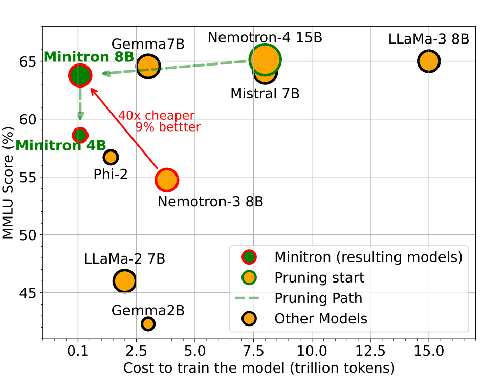

---

# Part 5: 无损加速：投机采样 (Speculative Sampling)

投机采样（也称投机解码 Speculative Decoding）利用了 Prefill 阶段并行验证与 Generation 阶段串行生成的非对称特征，实现**不伤及任何精度的 100% 无损加速**。

---

## Slide 9: Speculative Decoding 原理与数学证明

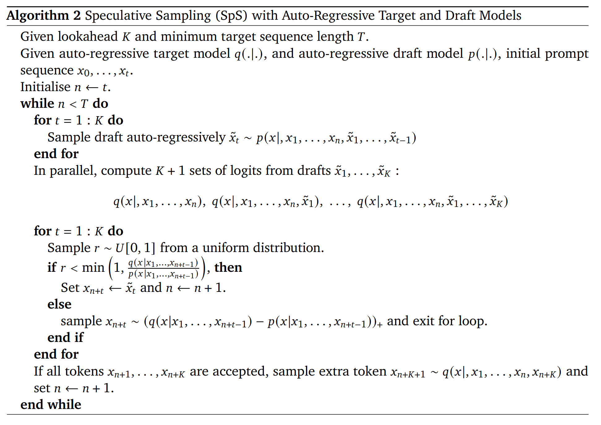

### 1. 核心流程
1. **草稿阶段**：使用一个极快的小模型（Draft Model，如 8B）自回归地向前“猜测”生成 $K$ 个 Token。这一步非常快，因为小模型参数少。
2. **验证阶段**：将大模型（Target Model，如 70B）在 Prefill 状态下一次性接收这 $K$ 个草稿 Token，并行计算所有位置的真实条件概率。
3. **接受/拒绝决策**：大模型根据概率分布，决定接受前几个草稿 Token。一旦某一步被拒绝，后续的草稿全部作废，大模型吐出一个修正的 Token，重新开始下一轮投机。

---

### 2. 保证精确采样的数学证明 (Modified Rejection Sampling)
投机采样最惊艳的性质是：**其生成结果在数学概率分布上，与直接使用大模型一步步慢速生成的分布完全一致（无损）**。

#### 证明示例：设词表只有两个词 $\{A, B\}$
- 大模型（目标）真实分布为：$[q(A), q(B)]$
- 小模型（草稿）猜测分布为：$[p(A), p(B)]$
- 假设小模型在 $A$ 上过拟合，在 $B$ 上欠拟合，即：
  $$p(A) > q(A) \quad \text{且} \quad p(B) < q(B)$$
- **修改版拒绝采样规则**：
  - 如果小模型采样了 $A$：以概率 $\frac{q(A)}{p(A)}$ 接受它。
  - 如果小模型采样了 $B$：由于 $\frac{q(B)}{p(B)} > 1$，以概率 $1$ 接受它。
  - 如果被拒绝，则从**残留分布**（Residual Distribution）中重新采样：
    $$\text{Residual} = \max(0, q - p) = [0, q(B) - p(B)]$$

#### 计算最终采样概率：
- **采样到 $A$ 的概率**：
  由于残差分布在 $A$ 上的值为 0（因为被拒绝后绝对不会重采样出 $A$）：
  $$P(\text{sample } A) = p(A) \cdot \frac{q(A)}{p(A)} + 0 = q(A)$$
- **采样到 $B$ 的概率**：
  $$P(\text{sample } B) = p(B) \cdot 1 + p(A) \cdot \left(1 - \frac{q(A)}{p(A)}\right) \cdot 1 = p(B) + p(A) - q(A)$$
  因为 $p(A) + p(B) = q(A) + q(B) = 1$，所以 $p(B) + p(A) - q(A) = q(B)$。
- **数学期望完全吻合！** 证明投机采样是大模型的等价映射。

### 补充图片


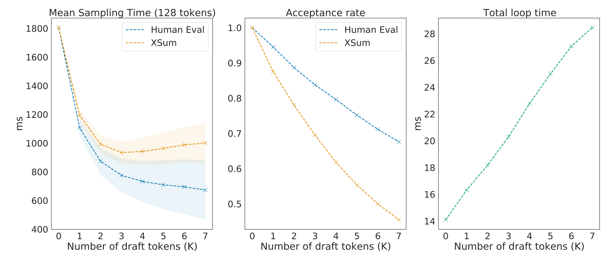

---

### 3. 草稿模型的进阶变体
- **Medusa (美杜莎)**：不需要额外维护一个小模型。而是直接在大模型最后一层挂载多个并行的预测头（Heads），分别去猜测 $+1, +2, +3$ 步的 Token。
- **EAGLE**：小模型在猜测时，直接融入大模型前一步提取的顶层高级特征特征向量，使草稿的猜测准确率大幅飙升。


---

# Part 6: 动态工作负载与系统级调度 (Continuous Batching, PagedAttention)

在实际云端部署中，多用户请求的到来时间、输入长度、生成长度全部是不可预测的。

---

## Slide 10: 连续批处理 (Continuous Batching)

### 1. 传统静态批处理 (Static Batching)
- 请求 A 需要生成 3 个 Token，请求 B 需要生成 9 个 Token。
- 传统批处理必须强行补零填充（Padding），且必须等到**所有请求全部完成生成（即直到最长的 9 个 Token 生成完）**，才能将整个 Batch 释放，这造成了极大的算力浪费与首字延迟。

---

### 2. 连续批处理 (Iteration-Level Scheduling)
由 Orca 系统引入：
- 不在“请求级”做调度，而是把时间切碎在**迭代级（每个 Token 生成迭代）**做调度。
- 每一步自回归迭代结束后，系统会检查是否有新请求到达，或旧请求是否已触发 `[EOS]` 提前结束。
- 结束的请求立即被移出 Batch，新到的请求（Prefill 阶段）立即被缝合进当前的 Batch 一起参与下一步迭代。

---

### 3. 选择性批处理 (Selective Batching)
- **痛点**：多请求长度极度参差（Ragged Array），无法凑成完美的 $B \times S \times H$ 张量。
- **对策**：
  - 在计算 **非注意力层**（如大矩阵相乘的 FFN、RMSNorm）时，将所有序列的 Token 展平并排成一个超长的 1D 向量：$\sum_{i} S_i \times H$，直接进行单次大矩阵乘，压榨 GPU 算力。
  - 只在计算 **Attention** 时，根据位置偏置信息，将各个请求剥离开来独立计算。

---

## Slide 11: 分页注意力 (PagedAttention)

随着上下文变长，KV Cache 对显存的蚕食达到了惊人的地步。vLLM 引入了操作系统“虚拟内存”的思想开发了 PagedAttention。

---

### 1. 传统分配方案的痛点：显存碎片化
在旧版引擎中，当用户请求到达时，系统必须为该请求开辟一块**连续的物理显存空间**，其大小必须预先按照模型支持的最大上限（如 2048 长度）进行足额分配：

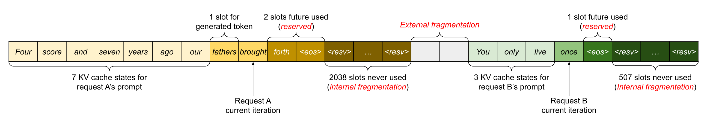

这导致了极其严重的显存浪费：
- **内部碎片 (Internal Fragmentation)**：用户可能只生成了 10 个 Token 就主动断开连接，剩下的 2038 个 Token 空间的显存只能一直空置，无法挪作他用。
- **外部碎片 (External Fragmentation)**：由于连续空间要求，显存中存在大量无法拼接的小碎块显存，导致新请求明明有总容量却无法排队进入。

---

### 2. PagedAttention 分页映射机制
- **基本原理**：将每条序列的 KV Cache 划分为若干个**固定大小的块（Blocks）**，每个 Block 通常包含 16 个 Token 的 KV 向量。
- **物理与逻辑解耦**：
  - 逻辑上，一条序列的 KV Cache 是连续的。
  - 物理上，这些 Block **散落在显存的任意非连续位置**。
  - 系统维护一个页表（Page Table），建立逻辑 Block 到物理块的映射关系。


---

### 3. 写时复制 (Copy-On-Write) 与共享 KV Cache
在智能体、Prompt-Tuning 或多路采样（Sampling）场景中，数个请求会完全共享同一个前缀（如长系统提示词 System Prompt，或 Program Synthesis 中的前缀代码）：


- PagedAttention 允许多个并发请求的页表**直接指向物理显存中的同一个前缀 Block**，省去了重复拷贝的开销。
- 只有当某个请求在生成阶段吐出个性化 Token 时，才会触发操作系统的**写时复制（Copy-On-Write）**机制，为该请求开辟专属的物理块进行写入，从而实现了近乎极致的显存共享与复用。


---

# Part 7: 总结

大语言模型推理优化是一场关于**显存带宽**与**动态调度**的严酷战争。我们可以将本讲涉及的加速武器总结如下：

```
                              大模型推理加速矩阵
     ┌────────────────────────────────┬────────────────────────────────┐
     │         损失模型架构 (Lossy)    │        无损机制与系统 (Lossless)│
     ├────────────────────────────────┼────────────────────────────────┤
     │                                │                                │
     │  1. 缩减 KV 缓存:              │  1. 投机解码 (Speculative)     │
     │     - GQA (共享 KV 组)          │     - 草稿模型自回归推理       │
     │     - MLA (低秩潜在压缩)         │     - 目标模型并行秒级校验     │
     │     - CLA (跨层共享)            │                                │
     │                                │  2. 连续批处理 (Orca)          │
     │  2. 模型量化:                  │     - 迭代级调度避免补零等待   │
     │     - AWQ (保留 1% 极强通道)    │                                │
     │     - GPTQ (海森误差补偿)       │  3. 分页内存 (PagedAttention)  │
     │                                │     - 虚拟内存分页打碎显存块   │
     │  3. 结构化剪枝与蒸馏           │     - 写时复制多请求前缀复用   │
     │                                │                                │
     └────────────────────────────────┴────────────────────────────────┘
```
> [!TIP]
> **推理设计的黄金路线选择：**
> 如果您要从零构建一个新的大模型，为了极致的推理效率，应当**从头设计支持 GQA 或 MLA 的注意力层**（因为这具有最大的 KV Cache 降维红利）；而在现成模型（Pre-trained）的生产线部署上，选用 **vLLM（PagedAttention + 连续批处理）** 配合 **AWQ 量化** 以及 **EAGLE 投机解码**，是目前工业界性价比最高、延迟最低的标配加速秘诀。
