# Lecture 11: Scaling – Case Study and Details (规模化——案例研究与细节) 深度笔记

本笔记基于斯坦福 CS336 (Language Modeling from Scratch) 第十一讲的课堂内容整理。在完成大语言模型的架构设计与分布式训练基础后，本讲将深入探讨大模型在预训练阶段的**规模化规律（Scaling Laws）**与超参数调优的最佳实践。我们将系统分析工业界典型的开源规模化方案（如 MiniCPM, DeepSeek, LLaMA 3, Hunyuan），剖析优化器规模化（包括新型矩阵值优化器 Muon），并对**极大更新参数化（muP / Maximal Update Parametrization）**进行完整的数学公式推导。

> **课程信息**：CS336 · Spring 2026 · 主题：Scaling – Case Study and Details

---

# Part 1: 工业界大模型预训练规模化方案与案例

在大模型开发中，如何最有效地分配计算资源、选择模型大小（Model Size $N$）与训练数据量（Data Size $D$）是决定成败的第一步。本部分将分析工业界多个代表性开源大模型的 Scaling 方案。

---

## Slide 1

### 讲解

本讲是斯坦福 CS336 课程的第十一讲，主题为 **Scaling – Case Study and Details（语言模型规模化：案例研究与工程细节）**。

在前面的课程中，我们已经学习了 Scaling Laws 的基础理论（如 OpenAI Kaplan 2020 论文和 DeepMind Chinchilla 2022 论文）。然而，当把这些理论应用到实际的大规模预训练中时，你会遇到大量的工程难题：如何稳定地在不同宽度和深度的网络之间传递超参数？如何便宜地拟合 Scaling Law 曲线？本节课将带我们走通各大主流厂商的真实实践。

---

## Slide 2

### 讲解

本页明确了本节课的研究动机（Motivation today）：
1. **寻找规模化与超参数调优的最佳实践**：如何在大模型训练中进行超参数（Learning Rate, Batch Size）的跨尺度传递？
2. **验证 Chinchilla 方案的实际有效性**：在实际工程中，Chinchilla 的 20 Tokens/Parameter 的配比真的是黄金律条吗？
3. **节约规模化拟合的算力**：如何避免为了拟合 Scaling Laws 而进行昂贵的从头训练（Scratch runs）？
4. **探寻结构与参数化方案**：我们是否可以通过选择特殊的架构或参数化方法（如 muP），使得超参数能够天然、稳定地在模型缩放时保持一致？

---

## Slide 3

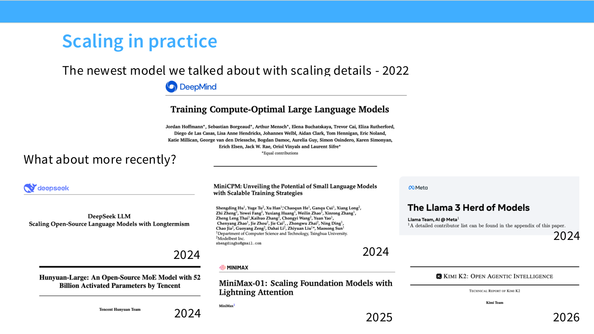

### 讲解

本页展示了 **Scaling in practice（现实中的规模化演进时间线）**。
虽然大模型规模化规律在 2020-2022 年（Kaplan 与 Chinchilla 时代）奠定了理论基础，但自 2024 年至 2026 年，工业界爆发了大量极具代表性的、包含详细 Scaling 细节披露的开源和技术报告。主讲人指出，我们将重点解构以下几个包含精细 Scaling 配方的大模型：
- **MiniCPM** (2024)：来自清华与面壁智能，小模型高性能 scaling 的代表。
- **DeepSeek** (2024)：披露了极多 LR 与 Batch 拟合曲线的杰作。
- **StepFun, Qwen 2.5/3, Kimi K2, LLaMA 3, Minimax-01** (2024-2026)：展示了多维度的缩放细节。

---

## Slide 4

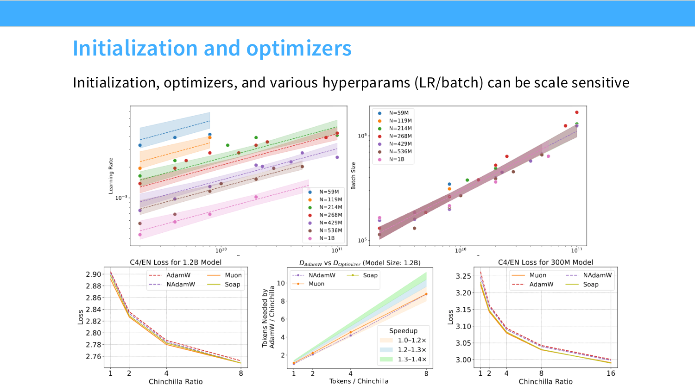

### 讲解

本页指出了大模型规模化调优的**核心挑战**：
- 很多关键超参数——如**初始化权重分布**、**优化器选择**、**学习率（LR）**以及**批大小（Batch Size）**——都是**尺度敏感（Scale-sensitive）**的。
- 换句话说，你在一个小模型（如 100M）上调好的最优学习率或批大小，如果直接套用到 7B 甚至 70B 的模型上，极易导致模型不收敛、梯度爆炸或性能大幅落后于最优解。理解这些超参数如何随规模变化是工程落地的关键。

---

## Slide 5

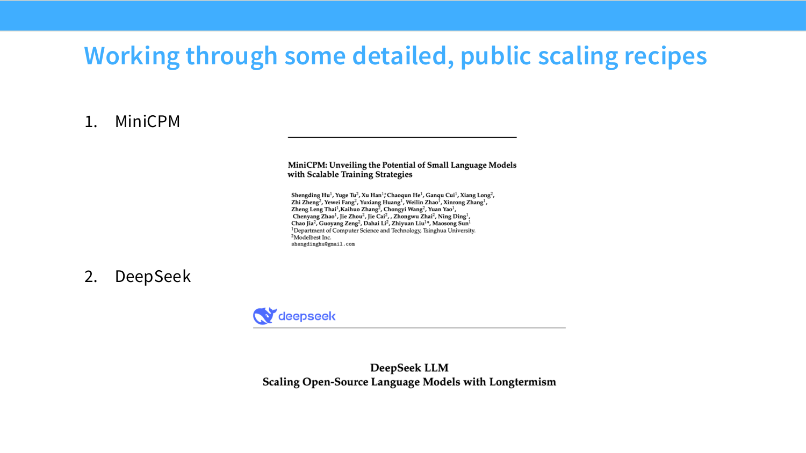

### 讲解

为了深入理解，我们将重点解剖两套公开细节最详实、在工程上极具启发性的预训练 Scaling 秘籍：
1. **MiniCPM 方案**：主要依靠 **muP（极大更新参数化）** 稳定超参数，并配合 **WSD 学习率调度** 降低 Scaling 实验的成本。
2. **DeepSeek 方案**：直接在多尺度上运行细致的网格搜索（Grid Search），直接拟合 LR 和 Batch Size 随 compute 变化的幂律公式。

---

## Slide 6

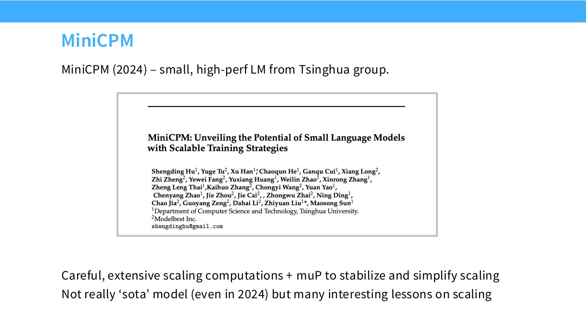

### 讲解

本页介绍案例一：**MiniCPM (2024)**。
MiniCPM 是面壁智能团队开发的一系列 1B-2.4B 参数规模的高性能端侧大模型。
- 该模型的特点在于其开发团队并没有盲目增加训练 Token，而是进行了极其精细的预先 Scaling Laws 计算。
- 他们成功地将 **muP（Maximal Update Parametrization）** 引入预训练，实现了在极小尺度上调参、在大尺度上免调参直接套用，并总结出了许多关于大模型规模化上限的宝贵经验。

---

## Slide 7

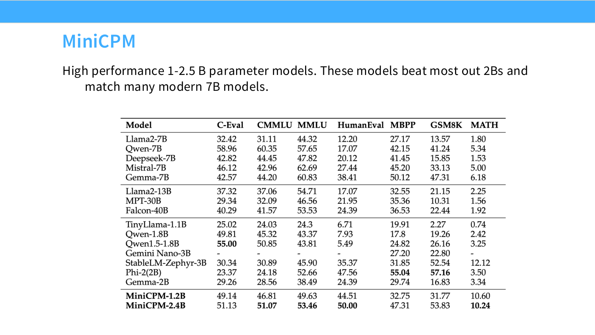

### 讲解

本页总结了 MiniCPM 取得的优异战绩：
通过科学的 Scaling 指导，MiniCPM 以 1.2B 和 2.4B 的小巧身材，在多项中英文 Benchmarks 上击败了市面上绝大多数 2B 级模型，甚至在逻辑和代码能力上打平了当时很多经典的 7B 大模型。这证明了：**精细的超参数和数据量规模化调优，能够让小模型爆发出超越其参数极限的能量。**

---

## Slide 8

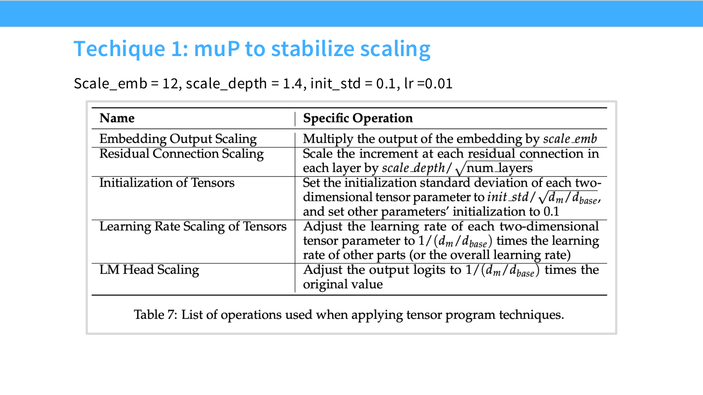

### 讲解

本页介绍了 MiniCPM 引入的第一项核心技术：**muP (Maximal Update Parametrization) 稳定超参数**。
- 清华团队在小尺度模型上搜索出了如下黄金超参数：
  - `scale_emb = 12`
  - `scale_depth = 1.4`
  - `init_std = 0.1`
  - `lr = 0.01` (在标准参数化下，如此高的学习率会导致大模型瞬间崩溃)
- **muP 的魔力**：通过在数学上重新调整不同神经元扇入/扇出维度的权重缩放和 LR 缩放，muP 确保了**当模型宽度膨胀时，上述最优超参数可以一字不差地直接套用到大模型上**，无需重新进行任何 LR 搜索。

---

## Slide 9

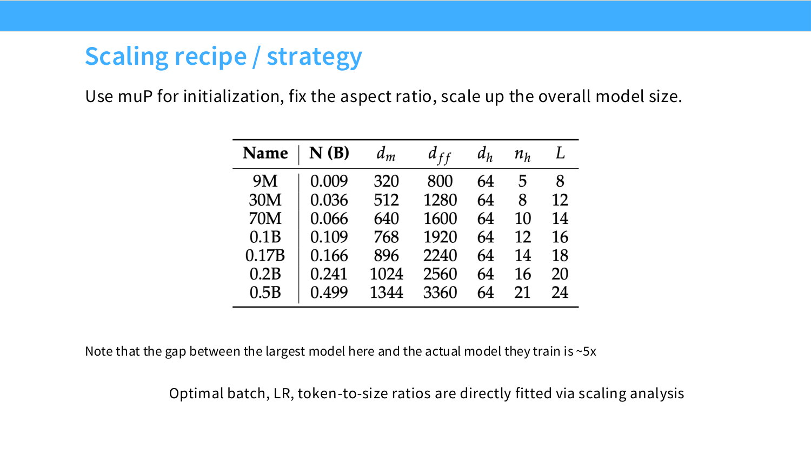

### 讲解

本页展示了 MiniCPM 的整体 Scaling 战略路线图：
- 团队在极小模型（9M, 30M, 170M 等）上应用 muP 调整好初始化，固定长宽比（Aspect Ratio），然后逐步扩增模型大小。
- **巨大的 Scaling 跨度**：他们用于拟合 Scaling Laws 的最大模型与最终实际训练的 2.4B 模型之间存在 **~5x 的规模鸿沟**。但在 muP 的护航下，超参数顺利传递，最终的 2.4B 模型一次收敛成功，没有发生任何不稳定。
- 他们通过这套小规模实验，成功拟合出了最优 Batch Size、最优 Learning Rate 以及最优的 Token-to-Model size 比例。

---

## Slide 10

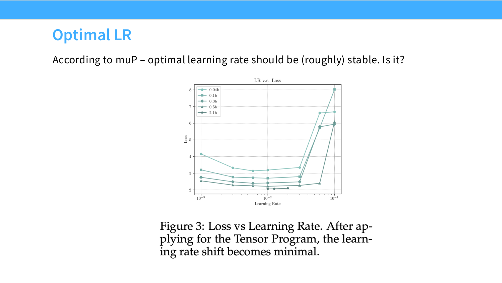

### 讲解

本页针对 **最优学习率（Optimal LR）** 进行了探讨。
- 根据 muP 的数学理论，当模型宽度（Hidden Dimension $d_{model}$）无限变宽时，最优的学习率应当是**恒定不变的（roughly stable）**。
- 清华团队通过实验画出的多条不同宽度（Width）模型在不同学习率下的 Loss 曲线验证了这一点：所有宽度的模型，其 Loss 的最低点（最优 LR）几乎完美对齐在 `0.01` 左右。

---

## Slide 11

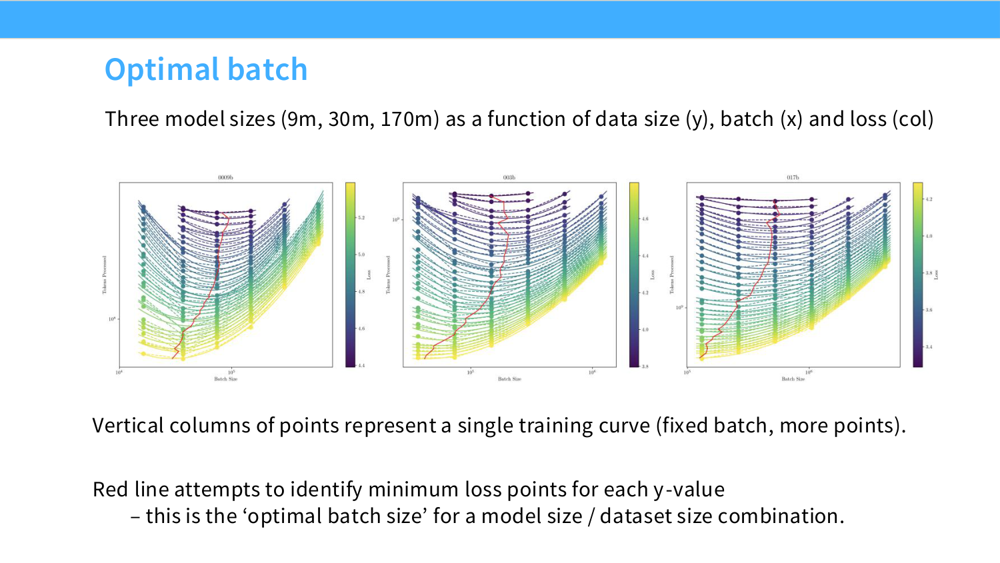

### 讲解

本页展示了关于 **最优批大小（Optimal Batch Size）** 随模型与数据量变化的实验数据。
- 团队在三种小模型（9M, 30M, 170M）上进行了密集的网格实验。横轴是训练 Batch Size，纵轴是数据量大小（Tokens $y$），颜色深浅代表 Loss 强弱。
- **红色曲线**标出了在给定的数据量和模型大小下，能取得最低 Loss 的 Batch Size。
- **结论**：最优批大小并非一成不变，而是随着训练进程（数据量增加）和模型大小的变大，呈现规律性的右移（膨胀）。

---

## Slide 12

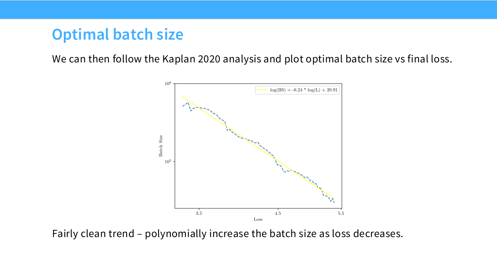

### 讲解

本页对上述最优批大小的趋势进行了数学归纳（沿袭 OpenAI Kaplan 2020 的分析思路）：
- 将最优 Batch Size 随最终 Loss 降低的关系绘制出来，可以得到一条非常清晰的**幂律幂函数趋势**。
- **核心规律**：**随着模型性能提升（Loss 降低），最优批大小呈现多项式级别的增长。**
  - 在训练初期（Loss 较高时），使用较小的 Batch 即可快速收敛并节省计算；
  - 到了训练中后期（Loss 降低），必须同步扩大 Batch Size，才能确保梯度更新的有效性。

---

## Slide 13

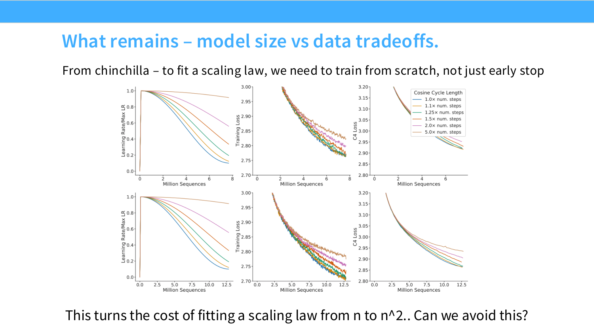

### 讲解

本页提出了 Chinchilla 实验在实际操作中的**致命痛点**：
- **传统的 Chinchilla 拟合法**：
  要精确拟合一条 Iso-FLOP 曲线，你必须让每一个实验模型都**完整跑完整个训练周期**。因为如果在中途提早停机（Early stopping），此时模型的 Loss 尚未在当前学习率调度（如 Cosine Decay 的末尾）下充分降温，其表现无法代表最终状态。
- **算力成本灾难**：
  这导致拟合 Scaling Laws 的算力成本从 $O(N)$ 飙升到了 $O(N^2)$。很多资源受限的团队根本跑不起这么多完整的预训练。
- **追问**：我们能否找到一种方法，避免每次都跑完 Cosine 降温，实现“便宜”的 Scaling 拟合？

---

## Slide 14

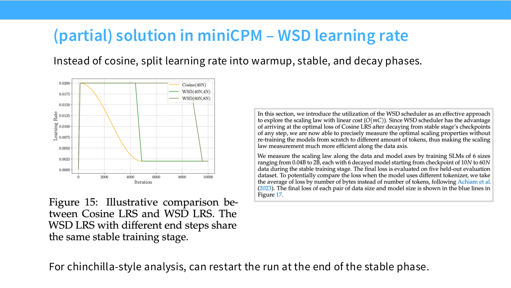

### 讲解

本页给出了 MiniCPM 团队提出的巧妙解决方案——**WSD (Warmup-Stable-Decay) 学习率调度**。
WSD 调度摒弃了传统的 Cosine 曲线，将整个训练周期的学习率划分为三个截然不同的阶段：
1. **Warmup 阶段**：LR 从零线性上升到最大值。
2. **Stable 阶段**：LR 维持在最大值（或缓慢的微弱下降），模型在此阶段进行长期的特征积累。
3. **Decay 阶段**：在需要评估或结束训练时，LR 在极短的 Token 区间内（通常仅占总 Token 的 10% 左右）急速下坠至零，促使 Loss 进行最终的爆发式崩塌。
- **Chinchilla 的救星**：如果我们要评估在不同 Token 数量下的表现，我们**不需要重新训练**。只需在 Stable 阶段的任意时间点 $T$ **创建分支（Fork）**，并在此分支后接一个短促的 Decay 阶段即可。这让 Scaling Law 的拟合变得极其廉价。

---

## Slide 15

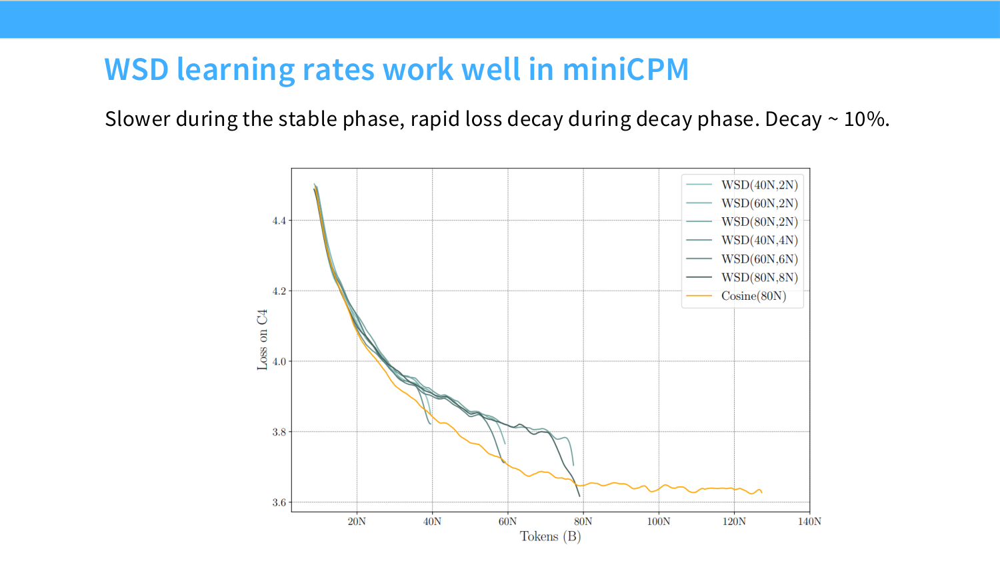

### 讲解

本页展示了 WSD 调度在 MiniCPM 中的真实 Loss 曲线：
- 在长达 90% 的 Stable 阶段，Loss 维持着平缓的下降；
- 一旦进入最后的 10% Decay 阶段（图中陡峭的垂直下坠曲线），LR 骤降，Loss 瞬间完成约 10% 的额外暴跌，完美达到了甚至超越了传统 Cosine 曲线的收敛深度。

---

## Slide 16

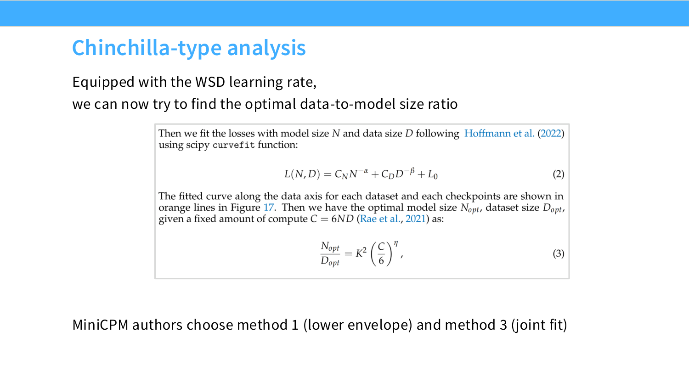

### 讲解

本页讲述了有了 WSD 调度的保驾护航后，如何高效跑完 Chinchilla 拟合流程。
MiniCPM 团队采用了两种经典方法：
- **Method 1（下包络线法 / Lower Envelope）**：在不同 FLOPs 预算下，绘制多条不同模型大小的 WSD 曲线，取它们的下边缘切线作为最优配比。
- **Method 3（联合参数拟合法 / Joint Fit）**：将 Loss 直接拟合为参数量 $N$ 和数据量 $D$ 的非线性二元函数。

---

## Slide 17

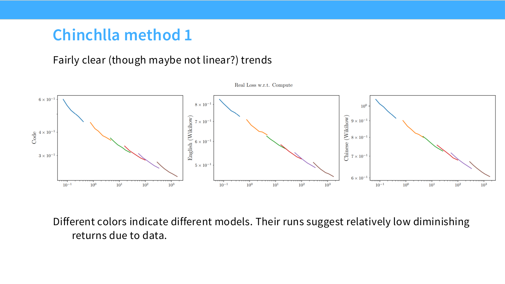

### 讲解

本页展示了 MiniCPM 团队使用 **Method 1** 拟合出的曲线：
- 不同的颜色代表不同的参数模型。
- 切点清晰地勾画出了计算资源最优分配的轨迹。从数据可以看出，即使在数据量极大时，模型表现也几乎没有表现出严重的边际收益递减（Diminishing returns），这坚定了他们对端侧小模型进行“超额训练（Over-training）”的信心。

---

## Slide 18

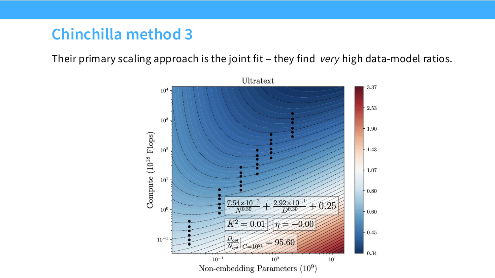

### 讲解

本页展示了 **Method 3 (联合拟合)** 的公式拟合结果。
通过在大规模实验数据上运行非线性最小二乘拟合，MiniCPM 团队得出了其独有的 Scaling 常数。他们的数据表明，为了在小尺度下压榨极致性能，**最优的数据参数比（Data-to-Model Ratio）显著高于 Chinchilla 原始论文推荐的 20:1**，这直接启发了后来的 LLaMA 等模型使用数万亿 Token 训练小模型的做法。

---

## Slide 19

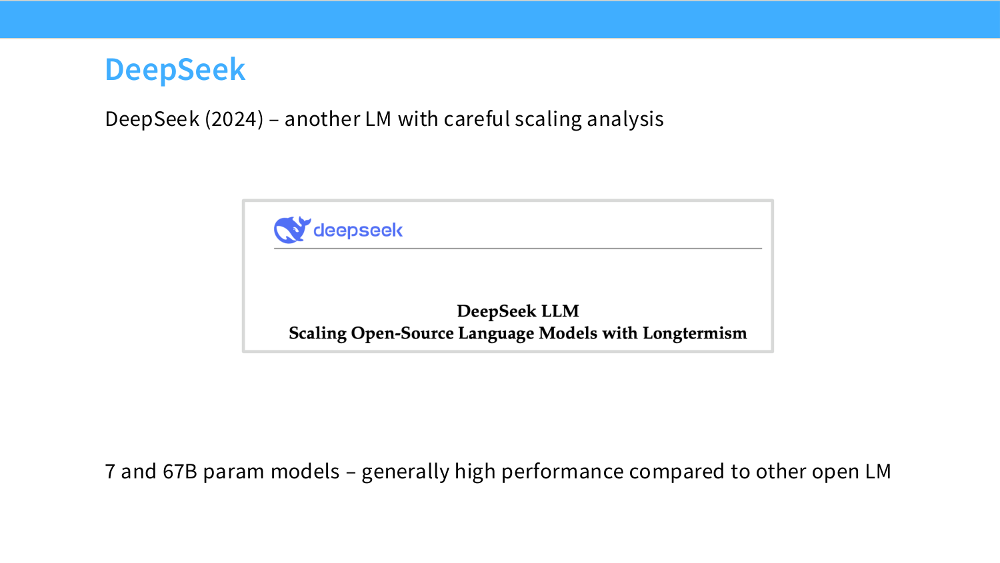

### 讲解

本页介绍案例二：**DeepSeek (2024)**。
幻灯片指出，DeepSeek 在其第一代和第二代大模型（如 DeepSeek-V1 7B/67B）的预训练技术报告中，同样展示了极其严谨的 Scaling Laws 拟合过程。
DeepSeek 的整体性能在开源界名列前茅，其底层的规模化调优功不可没。

---

## Slide 20

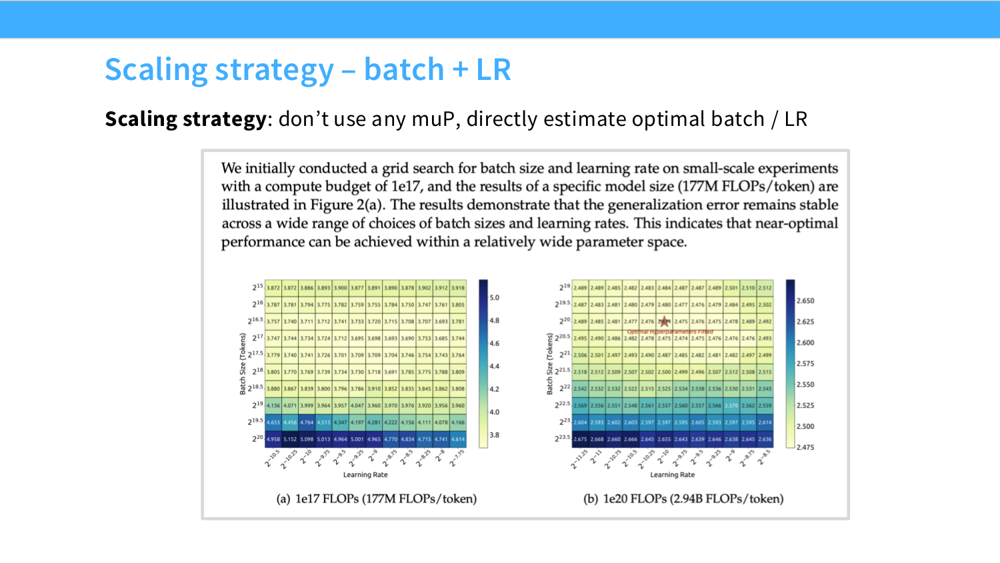

### 讲解

本页展示了 DeepSeek 的 Scaling 策略选择：
- **不使用 muP**：DeepSeek 团队并没有采用 muP 参数化，而是选择了一条更直接的道路——**在大规模网格实验中直接通过经验公式去拟合最优 Batch Size 和最优学习率（LR）**。

---

## Slide 21

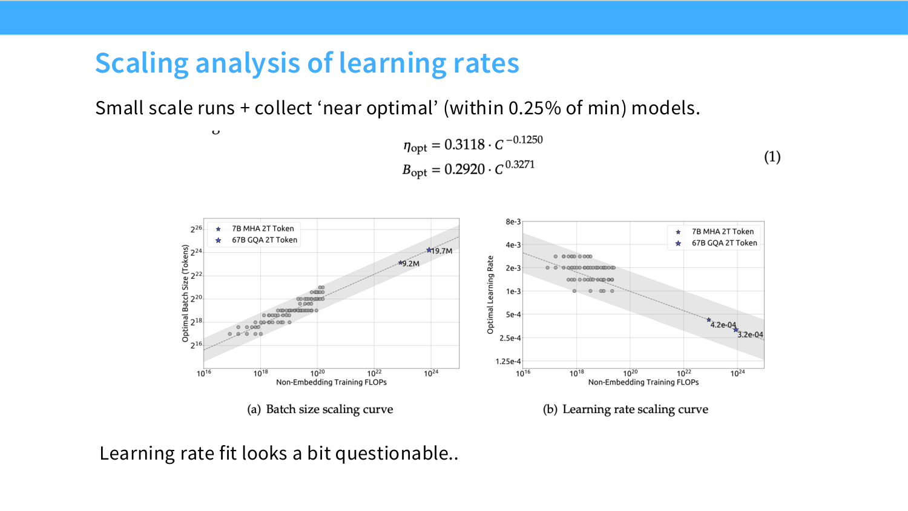

### 讲解

本页披露了 DeepSeek 拟合学习率的实验过程。
- 团队在小尺度上运行大量的网格搜索，收集所有“接近最优”（即 Loss 处于最低点 0.25% 误差范围内）的 LR 样本点。
- 随后尝试用幂律函数去拟合最优 LR 随参数量 $N$ 的变化：
  $$\eta^{opt} \propto N^{-\alpha}$$
- **主讲人冷思考**：
  DeepSeek 给出的 LR 拟合曲线在数学上其实“略显牵强”（looks a bit questionable）。因为在小尺度下，最优 LR 的盆地非常宽，存在很多噪声。如果在预训练中改用 WSD 调度，LR 随尺度的漂移可能更加复杂。

---

## Slide 22

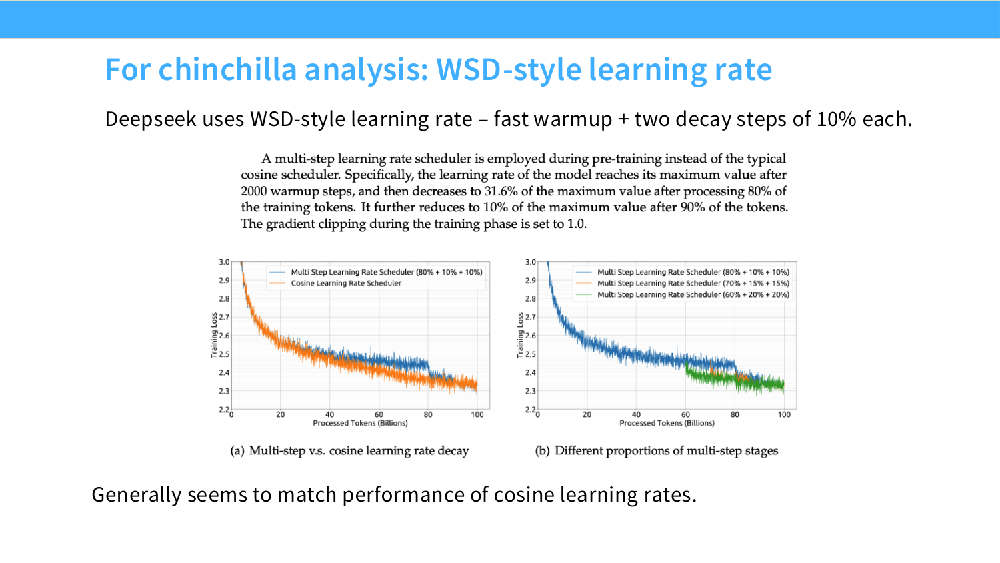

### 讲解

本页提到，DeepSeek 在进行 Chinchilla 联合拟合时，同样采用了 **WSD-style 学习率调度**。
- 其具体设计为：快速 Warmup $\to$ 长期的 Stable 平台期 $\to$ 两个台阶式的 10% 急速衰减阶段。
- 实验表明，这种分段式 LR 在收敛性能上完全打平了经典的 Cosine 曲线，且为他们节约了大量的 Scaling 探索算力。

---

## Slide 23

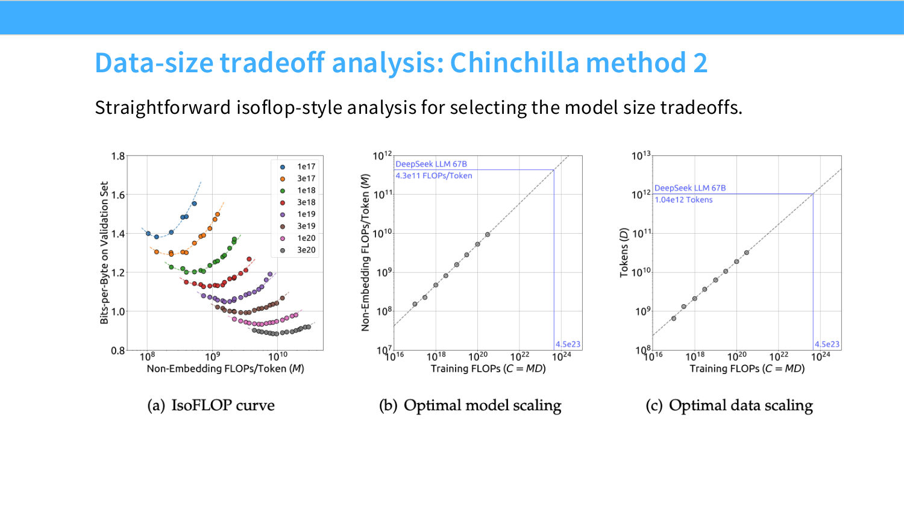

### 讲解

本页解析了 DeepSeek 采用的 **Chinchilla Method 2 (Iso-FLOP 拟合)**：
- 通过设定不同的 FLOPs 预算，绘制多条以模型大小 $N$ 为自变量的 Loss 抛物线，求解每条抛物线的顶点，从而推导出在特定算力预算下，模型大小与数据量的最优分割点。

---

## Slide 24

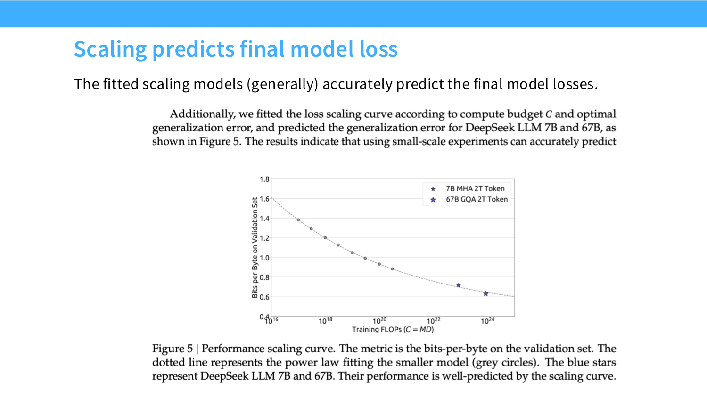

### 讲解

本页展示了 DeepSeek 最终的 Scaling Laws 预测精确度。
- 图中实线是 Scaling Laws 预测的 Loss 收敛轨迹，散点是 7B 和 67B 真实预训练过程中的实际 Loss。
- **结论**：在科学的拟合下，Scaling Laws 几乎完美预测了最终几十万张卡训练时的 Loss 走向，没有发生任何偏离。

---

## Slide 25

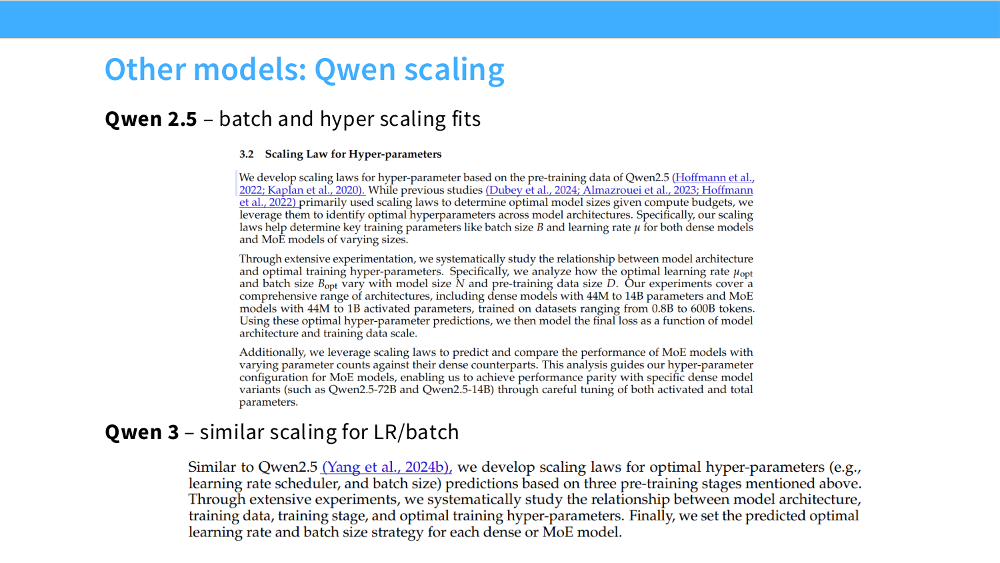

### 讲解

本页横向总结了其他主流开源大模型的 Scaling 做法：
- **Qwen 2.5 & 3**：同样在大规模网格中拟合了 LR 与 Batch Size 的随规模变化曲线，但在技术报告中只披露了结论，对具体拟合细节语焉不详。

---

## Slide 26

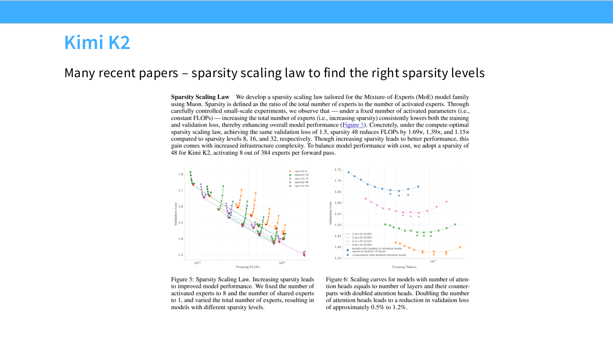

### 讲解

本页介绍月之暗面 **Kimi K2** 的 Scaling 做法：
- Kimi K2 作为混合专家架构（MoE）的代表，其 Scaling Laws 的核心在于探索**稀疏性规模化规律（Sparsity Scaling Laws）**。
- 他们致力于研究：在固定激活参数量（Active Parameters）的前提下，如何通过扩大总参数量（Total Parameters）与 Expert 数量来优化 Loss 的下降曲线。

---

## Slide 27

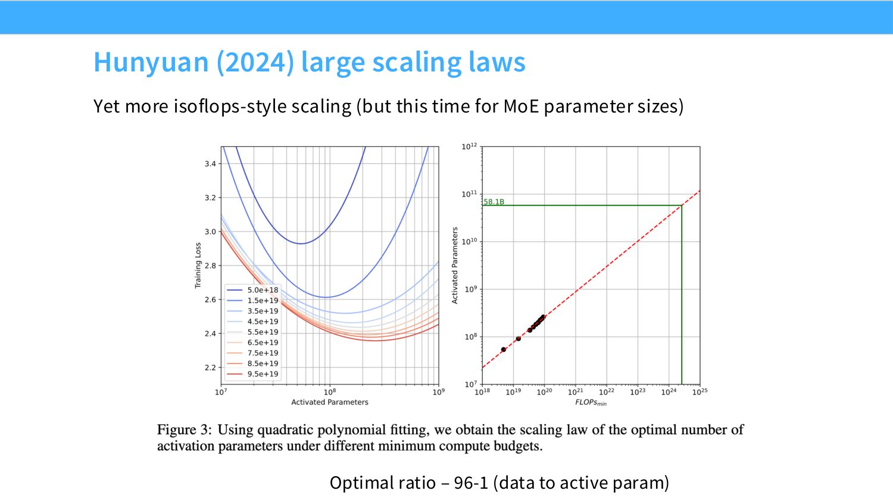

### 讲解

本页展示了腾讯 **混元（Hunyuan 2024）** 的大规模 MoE 规模化规律实验：
- 混元团队在 MoE 架构上运行了 Iso-FLOP 分析。
- **黄金结论**：在 MoE 预训练中，**数据量与激活参数量的最优配比大约为 96:1**。这一比例远超 Dense 模型的 Chinchilla 极限，证明了 MoE 在处理海量数据时具有极高的参数效率。

---

## Slide 28

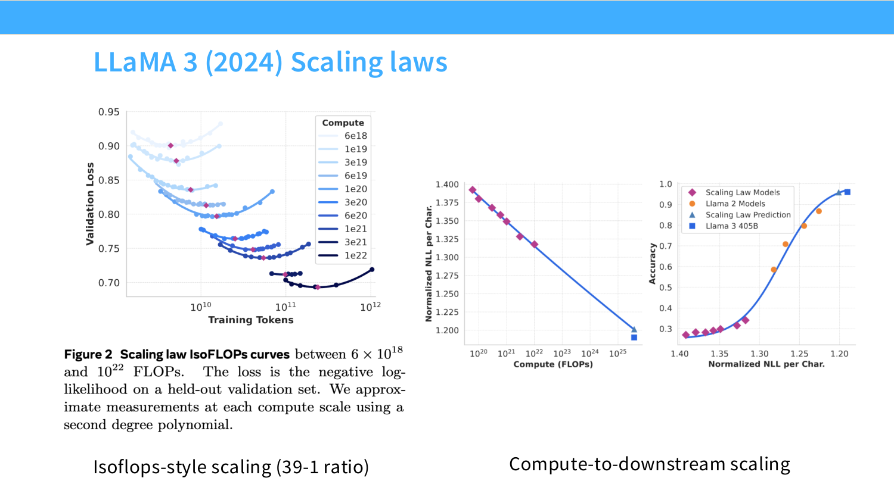

### 讲解

本页展示了 **LLaMA 3 (2024)** 的规模化策略：
- Meta 团队在 LLaMA 3 技术报告中指出，他们同样采用了 Iso-FLOP 拟合，并最终选定了 **39:1 的数据参数比**（例如 8B 模型训练了高达 15T 的 Tokens，这属于极度严重的“超额训练”）。
- **下游缩放预测（Compute-to-downstream scaling）**：
  LLaMA 3 最重要的贡献之一是，不仅预测了 Pre-training Loss 的降低，还成功拟合出了一套公式，用 Pre-training Loss 去预测模型在下游任务（如 GSM8K、MMLU）上的**最终正确率得分**。

---

## Slide 29

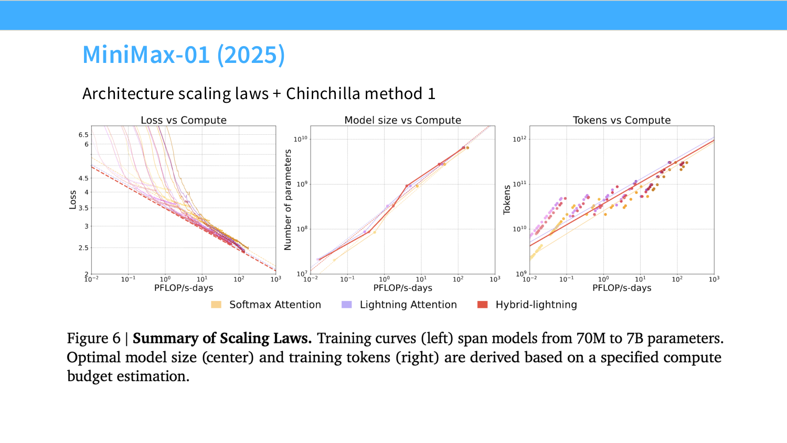

### 讲解

本页介绍了 **MiniMax-01 (2025)** 的做法：
- MiniMax 团队通过 Chinchilla Method 1，深入研究了不同注意力和 FFN 变体架构在缩放时的 Scaling 表现，利用数据直接指导架构的选型决策。

---

## Slide 30

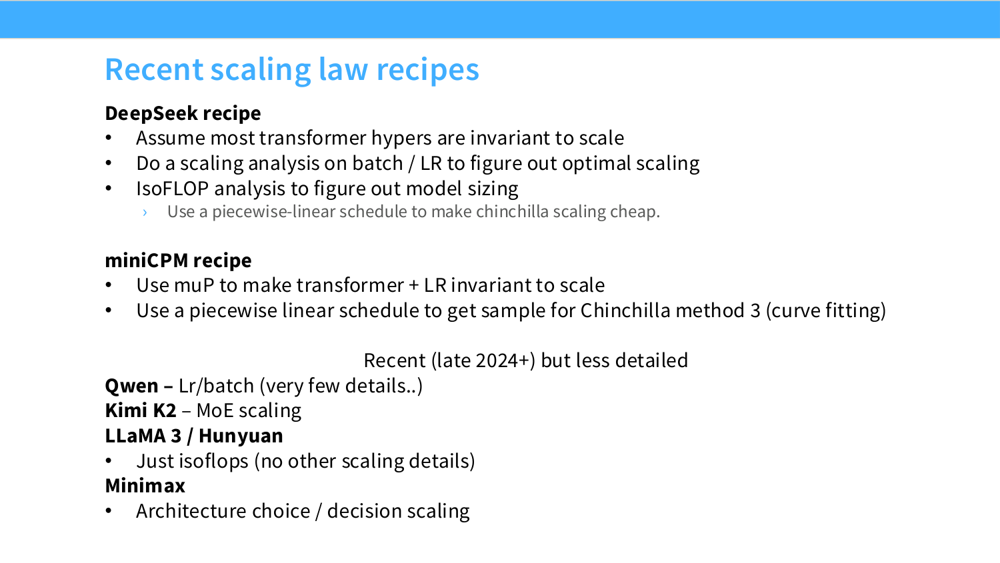

### 讲解

本页对**本章所有大模型的规模化配方进行了阶段性大汇总**：
- **DeepSeek 路线**：假定大部分架构超参不变，在小尺度上用网格搜索直接对 LR/Batch 拟合幂律公式，配合 WSD 调度降低拟合算力。
- **MiniCPM 路线**：使用 muP 消除 LR 随宽度变化的漂移，配合 WSD 调度在 Method 3 下进行联合拟合。
- **Qwen, Kimi K2, Hunyuan, LLaMA 3, Minimax**：展示了从 Iso-FLOP 走向 MoE 稀疏缩放、架构决策缩放与下游任务得分预测的演进特征。

---

# Part 2: 优化器规模化与新型优化器 Muon

超参数的缩放不仅与模型架构相关，更与优化器的动力学行为紧密相连。本部分将探讨优化器随规模变化的敏感性，以及近期备受关注的正交化矩阵值优化器 Muon。

---

## Slide 31

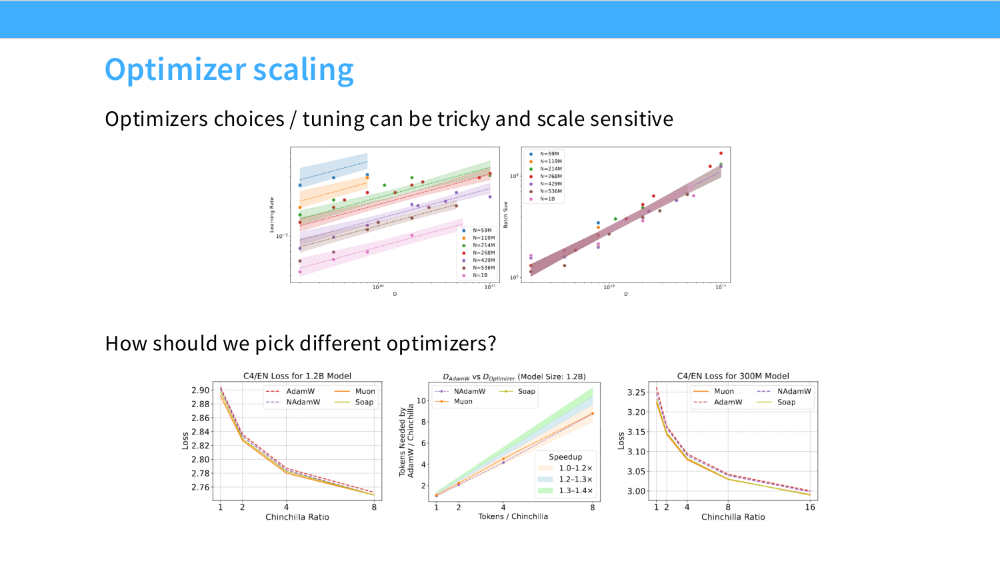

### 讲解

现在进入第二部分：**优化器缩放（Optimizer scaling）**。
在 LLM 预训练中，即使你固定了模型结构和数据，如果更换了优化器（如从 Adam 换到 SGD 或 Lion），其超参数的缩放规律也会发生剧烈的漂移。本章我们将探讨如何科学地对优化器运行规模化预测。

---

## Slide 32

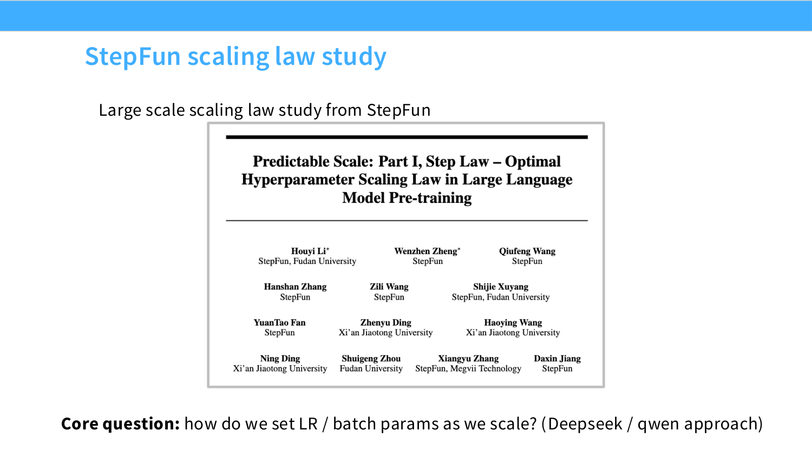

### 讲解

本页介绍了来自 **StepFun（阶跃星辰 2024）** 的大规模优化器规模化研究：
- StepFun 团队运行了一次极其昂贵且系统性的实验，旨在系统解答一个工程痛点：当模型规模扩展时，我们到底该如何同步调整学习率（LR）与批大小（Batch Size）的缩放斜率？

---

## Slide 33

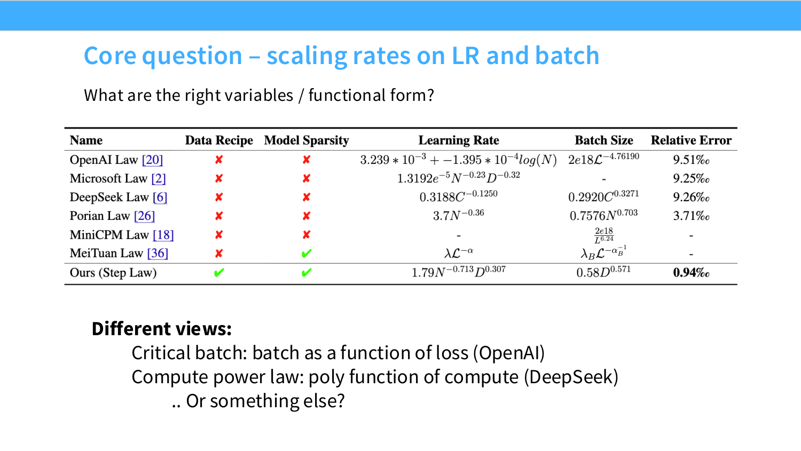

### 讲解

本页指出了在拟合 LR 与 Batch 缩放时，行业存在的**学派分歧（Different views）**：
- **临界批大小理论（Critical Batch Size - OpenAI）**：
  认为最优 Batch Size 应该被建模为当前 Loss 的函数。Loss 越低，临界 Batch 越大。
- **计算幂律理论（Compute Power Law - DeepSeek）**：
  认为最优 Batch Size 和 LR 应该直接被建模为总计算量（Compute $C$）的幂律函数。
- **StepFun 的目标**：通过大规模网格搜索，验证哪种函数形式在实际工程中具有最好的拟合鲁棒性。

---

## Slide 34

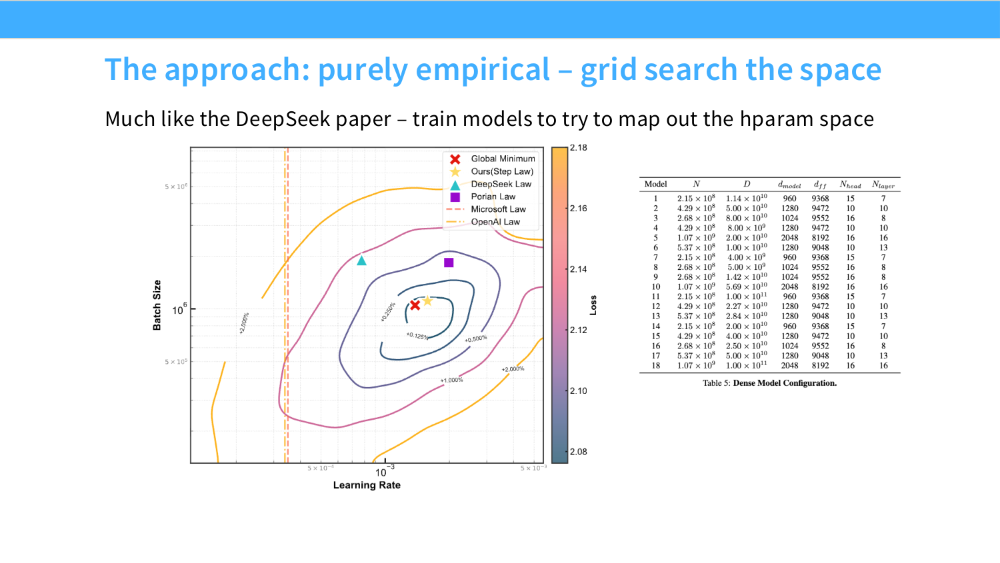

### 讲解

本页展示了 StepFun 的实验思路：
- 采用与 DeepSeek 类似的纯 empirical（经验性）路线：在小尺度模型上，对 Batch Size 和 Learning Rate 两个维度进行极其密集的网格扫参（Grid Search），绘制出完整的 Loss 等高线图。

---

## Slide 35

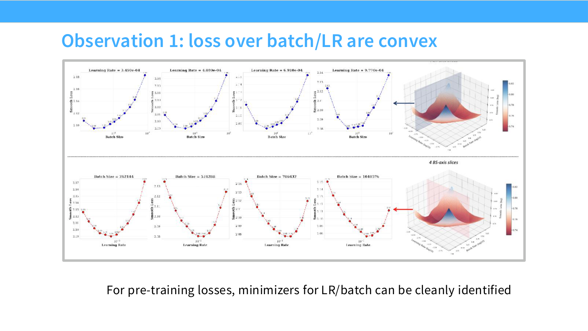

### 讲解

本页展示了 StepFun 的第一项核心发现：**Loss 随批大小和学习率的变化在对数空间呈完美的凸性（Convexity）**。
- **直觉**：等高线图呈现出非常漂亮的椭圆形同心圆。这意味着在任何尺度下，最优的 LR 和 Batch Size 都是**唯一确定且极易识别的最小值点**，这保证了拟合外推的科学性。

---

## Slide 36

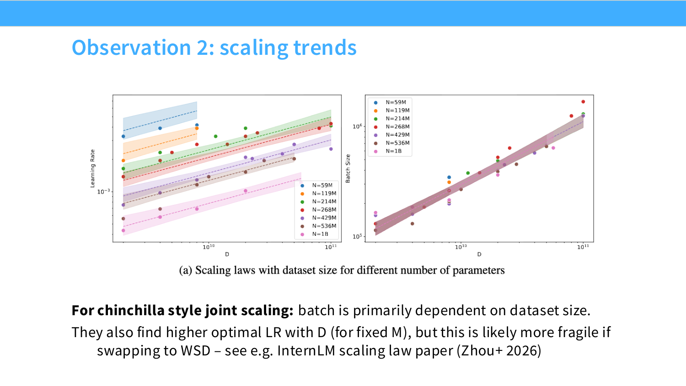

### 讲解

本页展示了 StepFun 的第二项核心发现（Observation 2）：
- **批大小决定论**：在联合 Scaling 分析中，**最优批大小（Optimal Batch Size）几乎完全取决于数据集的大小（Dataset Size $D$）**，而对模型参数量 $N$ 的敏感度相对较低。
- **LR 漂移问题**：他们发现随着训练进行，最优学习率会发生微幅漂移。但主讲人指出，如果使用 WSD 调度并参考 InternLM 的最新研究（Zhou et al., 2026），这种 LR 的细微调整可以被很好地规范化。

---

## Slide 37

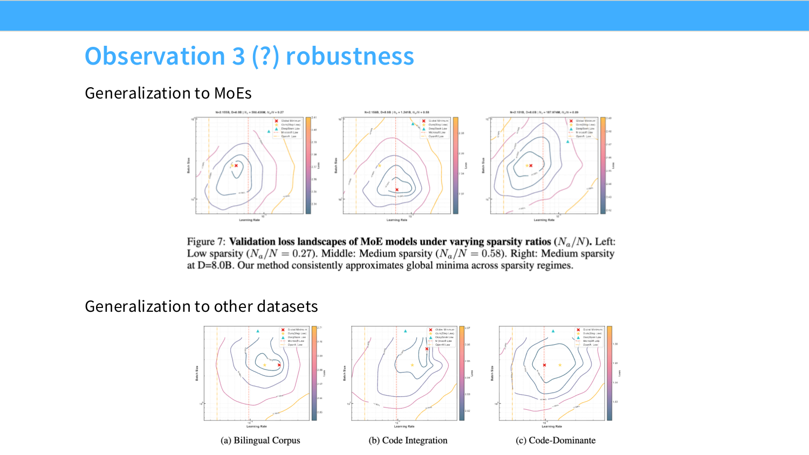

### 讲解

本页探讨了 StepFun 拟合公式的**鲁棒性与泛化性（Robustness）**：
- 实验证实，在 Dense 模型上拟合出来的 Batch/LR 缩放规律，可以直接无缝**泛化到 MoE 架构模型**以及**不同的预训练数据集**上。这说明优化器的动力学行为具有很强的底层通用性。

---

## Slide 38

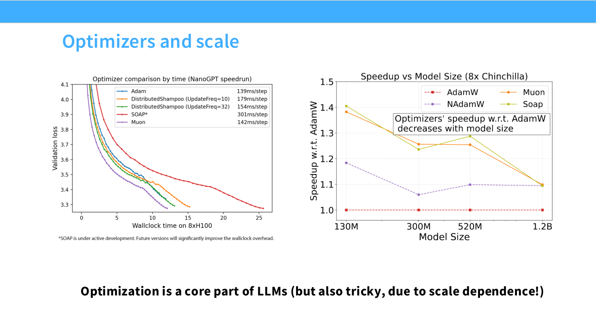

### 讲解

本页重申：大模型的优化器在宏观上决定了参数更新的方向和收敛质量，但其高度的尺度敏感性使得任何优化器的改进都必须伴随着严谨的 Scaling Laws 校验。

---

## Slide 39

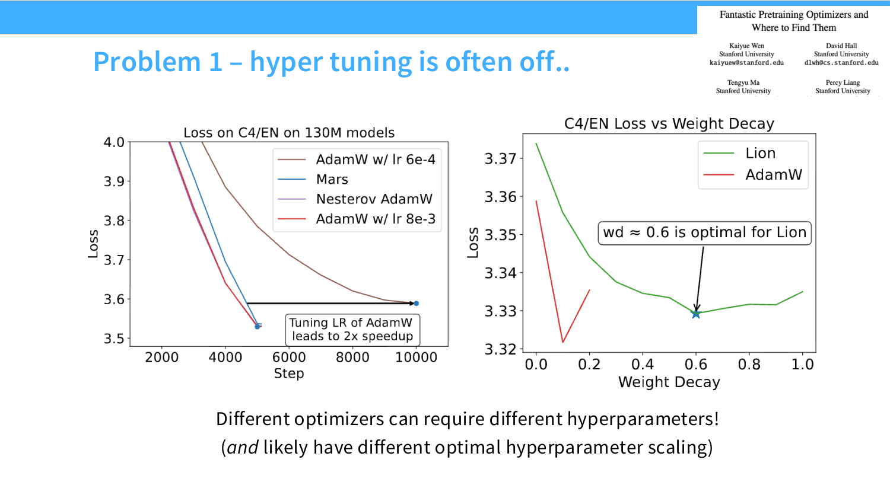

### 讲解

本页指出了优化器规模化研究中的**大坑 1：超参失准（Hyper tuning is off）**。
- **警告**：许多算法论文在宣传自己的“新优化器”（如 AdamW 变体）表现胜过 Adam 时，往往只在小模型上进行了一组固定 LR 下的对比。
- **事实**：不同优化器（如 Adam, Lion, Muon）的最优超参数空间是完全不同的。如果不针对每个优化器分别跑完完整的 Scaling 寻优，其对比结论是完全不公正且具有误导性的。

---

## Slide 40

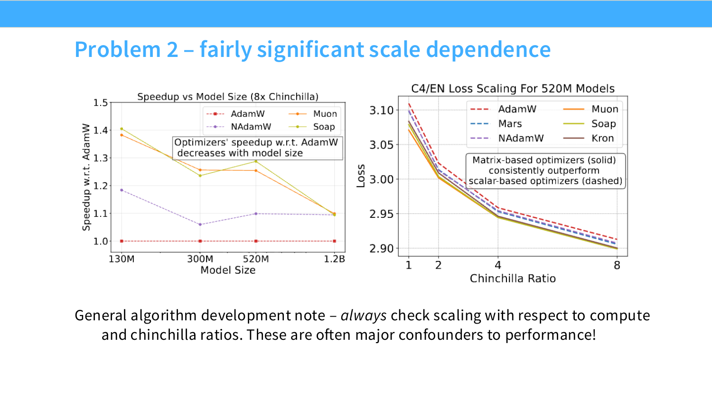

### 讲解

本页指出**大坑 2：明显的尺度依赖性（Significant scale dependence）**。
- **工程训诫**：在研发任何新型优化算法时，**必须以“固定 Compute 预算”和“Chinchilla 最优数据比”为前提绘制 Scaling Laws 曲线**。
- 很多算法在 10M 尺度上看起来效果惊艳，但当参数量缩放到 1B 以上时，其性能优势会迅速收窄甚至反输给经典的 AdamW。

---

## Slide 41

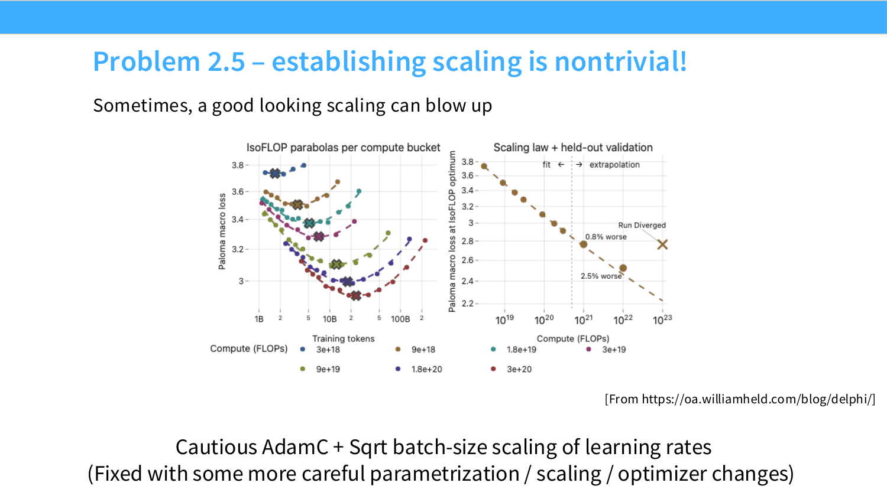

### 讲解

本页展示了优化器在实际缩放中可能遇到的**灾难性发散案例**：
引自 William Held 的 Delphi 博客文章。
- 当团队尝试在较大模型上使用 “Cautious AdamC 优化器 + 批大小平方根缩放学习率” 时，训练在后期发生了突发性的 Loss 暴涨和发散。
- 这证明了，没有经过 muP 等理论严格约束的参数化外推，在越过临界规模后随时可能诱发底层的数值崩溃，必须引入更严谨的参数化调整。

---

## Slide 42

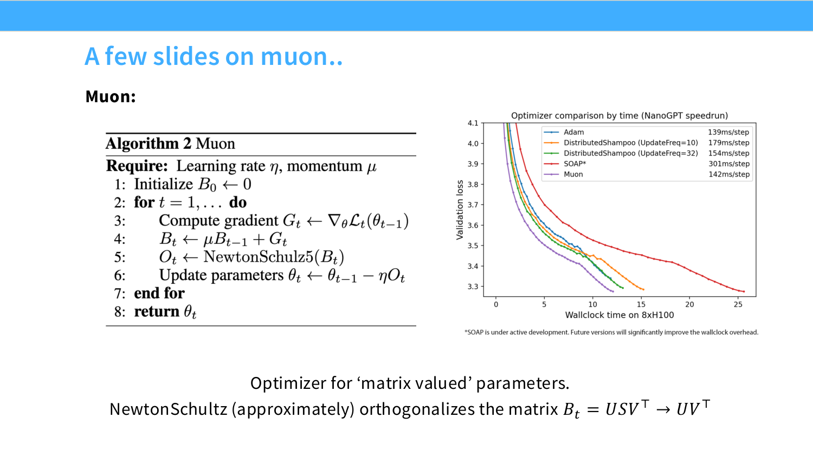

### 讲解

本页介绍近期在学术界和工业界（如 Kimi K2）引起轰动的新型优化器——**Muon（μ-on）**。
- **设计哲学**：
  Muon 是一种专门针对**“矩阵值（Matrix-valued）参数”**（如 MLP 中的二维权重矩阵、Attention 投影矩阵）设计的正交化优化器。
- **数学原理**：
  Muon 的核心在于利用 **Newton-Schulz 迭代**，将每次的梯度更新矩阵 $B_t$ 进行**近似正交化（Approximate Orthogonalization）**：
  $$B_t = U S V^T \to U V^T$$
  通过将奇异值全部归一化为 1，Muon 强制每一次参数更新都在几何上表现为纯粹的正交旋转。
- **好处**：这极大地避免了梯度在特定方向上的过载或欠更新，能显著加速网络在初期的表征学习速度。

---

## Slide 43

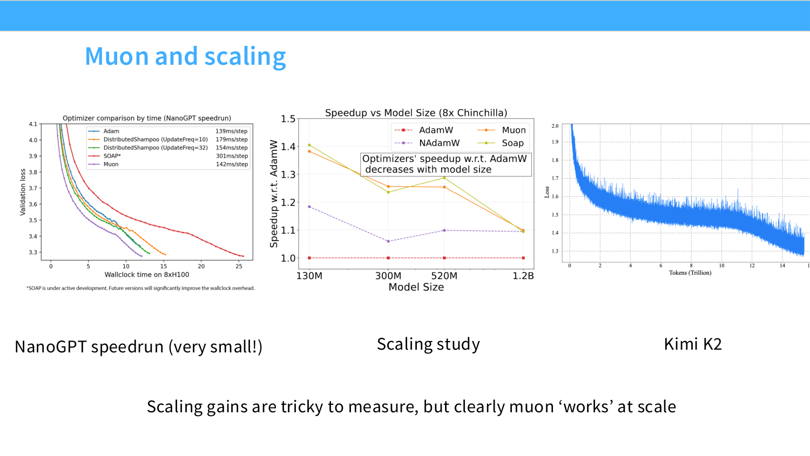

### 讲解

本页展示了 Muon 的实战与缩放表现：
- 在极小尺度的 `nanoGPT` 速度竞赛中，Muon 表现出了惊人的收敛速度，将达到特定 Loss 的步数削减了 30% 以上。
- **工业界落地**：月之暗面团队在 **Kimi K2** 的大规模 MoE 预训练中证实，Muon 在数万亿 Token 和千亿参数规模下同样能够稳定运行并带来真刀真枪的收敛加速。

---

# Part 3: 极大更新参数化（muP / Maximal Update Parametrization）深度推导

要实现超参数在模型尺度（特别是宽度）上的无损传递，必须借助 muP 的数学框架。本部分将完成 muP 在初始化和梯度更新阶段的完整数学证明。

---

## Slide 44

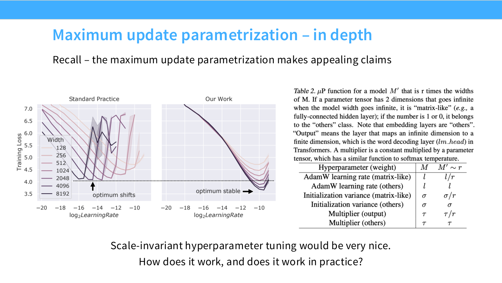

### 讲解

现在进入第三部分：**muP (Maximum Update Parametrization) 深度解析**。
在前面的 Slide 8 中，我们见识到了 MiniCPM 应用 muP 取得的工程便利。本章我们将进入纯数学视角，推导 muP 的底层定理：
**为什么修改初始化权重和学习率的缩放因子，就能让模型宽度的变化不影响梯度的动力学行为？**

---

## Slide 45

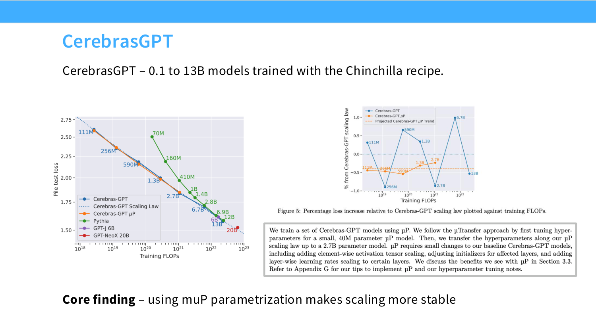

### 讲解

本页指出了 muP 的历史验证案例——**CerebrasGPT**。
Cerebras 团队曾发布了从 100M 到 13B 的 CerebrasGPT 系列模型，这套模型完全基于 muP 进行超参外推和 Chinchilla 训练，用无可辩驳的数据向工业界证实了 muP 在模型变宽变大时极佳的数值稳定性和免调参特性。

---

## Slide 46

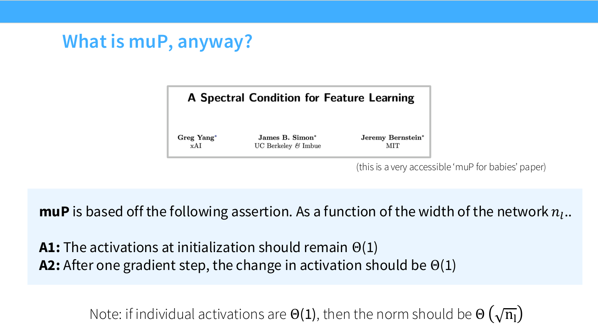

### 讲解

本页阐明了 muP 的**两大数学基石假设（Condition A1 & A2）**。
假设网络的第 $l$ 层宽度为 $n_l$。当 $n_l \to \infty$ 时，muP 要求：
- **假设 1 (A1 - 初始化控制)**：
  在网络初始化时，每一层的激活值（Activations）的幅值必须保持在常数阶：
  $$h^l = \Theta(1)$$
- **假设 2 (A2 - 更新控制)**：
  在运行一步梯度更新后，激活值的**变化量**也必须保持在常数阶：
  $$\Delta h^l = \Theta(1)$$
> **👨‍🏫 小白导读**：
> 在大宽度的网络中，如果初始化激活值太大，会导致前向传播数值溢出（$\infty$）；如果一步更新后变化量太大，会导致网络迅速崩坏并发生梯度爆炸。muP 的本质，就是通过精细控制权重和 LR，让这两个量在宽度 $n_l$ 趋于无穷大时，既不发散（不为 $\infty$）也不消失（不为 $0$），永远稳定在 $\Theta(1)$。
> *注：若单个神经元激活值为 $\Theta(1)$，则整个包含 $n_l$ 维的激活向量的 $L_2$ 范数应满足 $\|h^l\|_2 = \Theta(\sqrt{n_l})$。*

---

## Slide 47

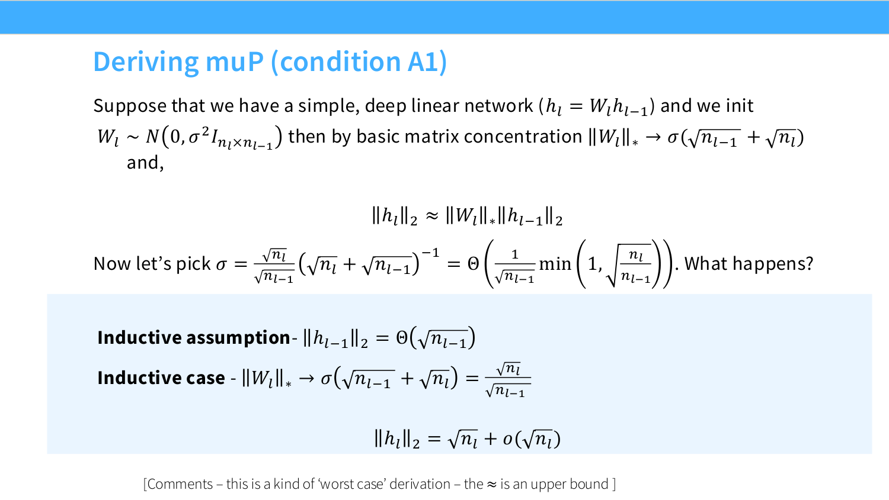

### 讲解

本页推导了满足 **条件 A1（初始化条件）** 的权重缩放公式：
- 设一个简单的深度线性网络：
  $$h^l = W^l h^{l-1}$$
  其中权重 $W^l \in \mathbb{R}^{n_l \times n_{l-1}}$ 在初始化时采自正态分布：
  $$W^l_{i,j} \sim \mathcal{N}(0, \sigma^2)$$
- 根据经典随机矩阵理论（Matrix Concentration）：
  当维度很大时，随机矩阵 $W^l$ 的谱范数（Spectral Norm，即最大奇异值）收敛于：
  $$\|W^l\|_* \to \sigma \left( \sqrt{n_{l-1}} + \sqrt{n_l} \right)$$
- 激活值范数的传递公式为：
  $$\|h^l\|_2 \approx \|W^l\|_* \|h^{l-1}\|_2$$
- 假设前一层满足 $\|h^{l-1}\|_2 = \Theta(\sqrt{n_{l-1}})$（归纳法假设）。
- 为了让当前层 $\|h^l\|_2 = \Theta(\sqrt{n_l})$，我们需要令 $\|W^l\|_* = \Theta\left(\frac{\sqrt{n_l}}{\sqrt{n_{l-1}}}\right)$。
- 将随机矩阵谱范数代入，求解出 $\sigma$ 的缩放因子：
  $$\sigma \left( \sqrt{n_{l-1}} + \sqrt{n_l} \right) \sim \Theta\left(\frac{\sqrt{n_l}}{\sqrt{n_{l-1}}}\right)$$
  当 $n_l, n_{l-1} \to \infty$ 时，得到最优初始化方差标准差 $\sigma$：
  $$\sigma = \Theta\left( \frac{1}{\sqrt{n_{l-1}}} \min\left(1, \frac{\sqrt{n_l}}{\sqrt{n_{l-1}}}\right) \right)$$
- **结论**：这就是 muP 的初始化方差设计。

---

## Slide 48

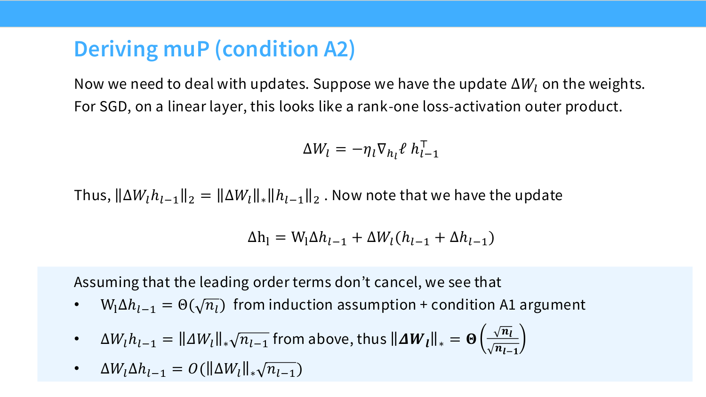

### 讲解

本页开始推导满足 **条件 A2（一步更新条件）** 的参数关系。
- 设权重的一次更新量为 $\Delta W^l$。在标准 SGD 优化器下，对于线性层，梯度是损失 $\ell$ 对激活值的偏导与输入的外积（Rank-one outer product）：
  $$\Delta W^l = -\eta_l \nabla_{W^l} \ell = -\eta_l \nabla_{h^l} \ell (h^{l-1})^T$$
- 更新后的激活值变化量为：
  $$\Delta h^l = W^l \Delta h^{l-1} + \Delta W^l (h^{l-1} + \Delta h^{l-1})$$
- 根据归纳假设及条件 A1：
  - 第一项 $W^l \Delta h^{l-1} = \Theta(\sqrt{n_l})$。
  - 为了让第二项中的 $\Delta W^l h^{l-1}$ 的大小也稳定在 $\Theta(\sqrt{n_l})$，由于 $\|h^{l-1}\|_2 = \Theta(\sqrt{n_{l-1}})$，我们要求 $\Delta W^l$ 的谱范数满足：
    $$\|\Delta W^l\|_* = \Theta\left( \frac{\sqrt{n_l}}{\sqrt{n_{l-1}}} \right)$$

---

## Slide 49

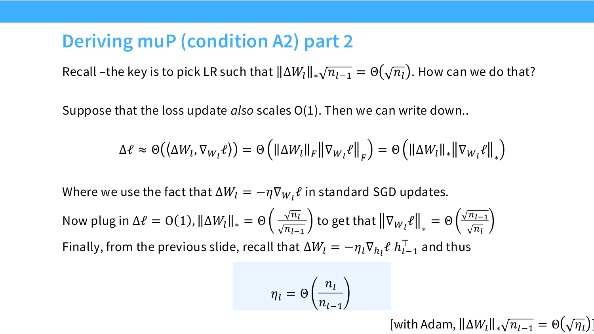

### 讲解

本页继续推导满足上述 $\|\Delta W^l\|_*$ 条件的学习率缩放公式：
- 假设一步更新后，损失函数的变化量为常数阶：$\Delta \ell = \Theta(1)$。
- 根据一阶泰勒展开，损失的变化量可以写为更新量与梯度的内积：
  $$\Delta \ell \approx \Theta\left( \langle \Delta W^l, \nabla_{W^l} \ell \rangle \right)$$
- 利用矩阵范数不等式关系，将其写为谱范数（Spectral Norm）与核范数（Nuclear Norm）乘积的形式：
  $$\Delta \ell = \Theta\left( \|\Delta W^l\|_* \|\nabla_{W^l} \ell\|_* \right)$$
- 代入标准 SGD 更新公式 $\Delta W^l = -\eta_l \nabla_{W^l} \ell$，以及前一页求解出的 $\|\Delta W^l\|_* = \Theta\left(\frac{\sqrt{n_l}}{\sqrt{n_{l-1}}}\right)$：
  解得梯度核范数的大小必须满足：
  $$\|\nabla_{W^l} \ell\|_* = \Theta\left( \frac{\sqrt{n_{l-1}}}{\sqrt{n_l}} \right)$$
- 再次代入更新量公式 $\|\Delta W^l\|_* = \eta_l \|\nabla_{W^l} \ell\|_*$：
  $$\Theta\left(\frac{\sqrt{n_l}}{\sqrt{n_{l-1}}}\right) = \eta_l \cdot \Theta\left( \frac{\sqrt{n_{l-1}}}{\sqrt{n_l}} \right)$$
- **最终求解出学习率 $\eta_l$ 的缩放率**：
  $$\eta_l = \Theta\left( \frac{n_l}{n_{l-1}} \right)$$
- **针对 Adam 优化器的修正**：
  在 Adam 优化器中，由于梯度被二阶矩进行了归一化（除以了标准差），更新量的大小直接正比于学习率，与梯度的原始幅值无关：$\|\Delta W^l\|_* \sqrt{n_{l-1}} = \Theta(\eta_l)$。
  因此，在 Adam 优化器下，为了保持更新常数阶，学习率必须缩放为：
  $$\eta_l^{Adam} = \Theta\left( \frac{1}{n_{l-1}} \right)$$

---

## Slide 50

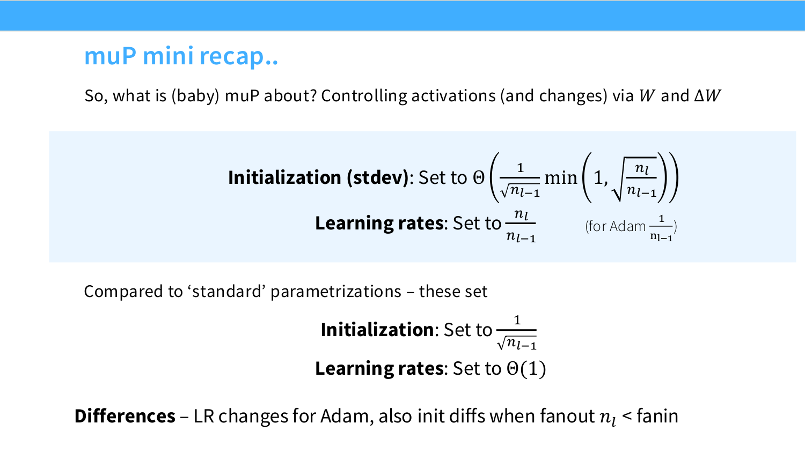

### 讲解

本页是 **muP 与标准参数化（Standard Parametrization, SP）的对比小结**：
- **初始化标准差（init std）**：
  - **标准参数化 (SP)**：固定设为 $\Theta\left(\frac{1}{\sqrt{n_{l-1}}}\right)$。
  - **muP 参数化**：设为 $\Theta\left(\frac{1}{\sqrt{n_{l-1}}} \min\left(1, \frac{\sqrt{n_l}}{\sqrt{n_{l-1}}}\right)\right)$。
- **学习率（Learning Rate）**：
  - **标准参数化 (SP)**：所有层统一设为常数 $\Theta(1)$。
  - **muP 参数化**：
    - 对于 SGD，每层 LR 设为 $\Theta\left(\frac{n_l}{n_{l-1}}\right)$。
    - 对于 Adam，每层 LR 设为 $\Theta\left(\frac{1}{n_{l-1}}\right)$（与前一层宽度成反比）。

---

## Slide 51

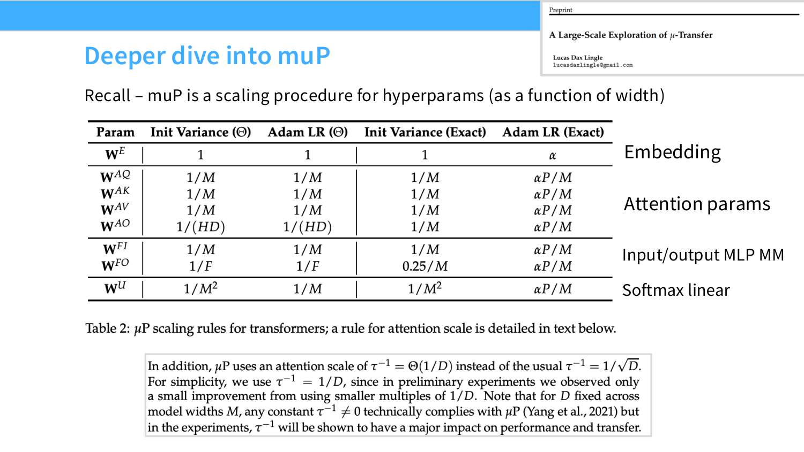

### 讲解

本页指出，上面推导的是最基础的 MLP 线性层。在真实的 Transformer 中，muP 的规则需要细化到每个具体的矩阵变换中：
- **Embedding 层**
- **Attention 投影矩阵（Q, K, V, Out）**
- **FFN 线性层**
- **最终的 Softmax 分类线性层**
不同层由于其“扇入”和“扇出”的神经元对应着不同的维度（如 $d_{model}$ 或 $d_{ff}$ 或 $V_{vocab}$），其标准差和 LR 需要根据上述规则进行精确的定制化缩放。

---

## Slide 52

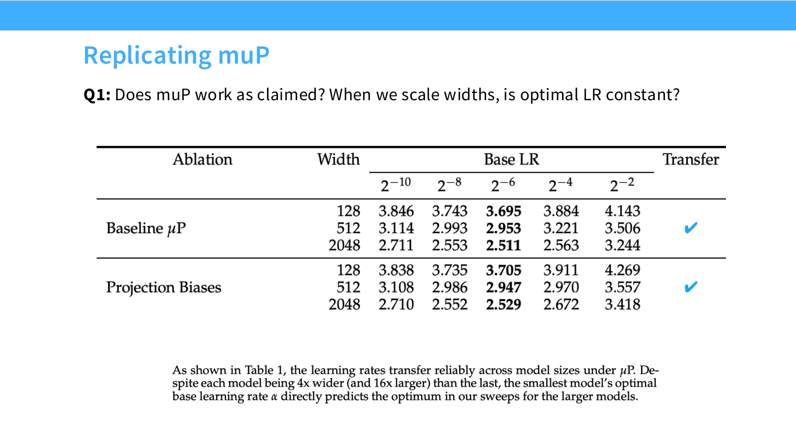

### 讲解

本页提出了实践检验问题（Replicating muP）：
- muP 的理论宣称如此完美，那么在实际的大模型训练中，当我们成倍地扩大网络宽度时，最优的 LR 真的能够保持一条平平的直线，不需要任何微调吗？

---

## Slide 53

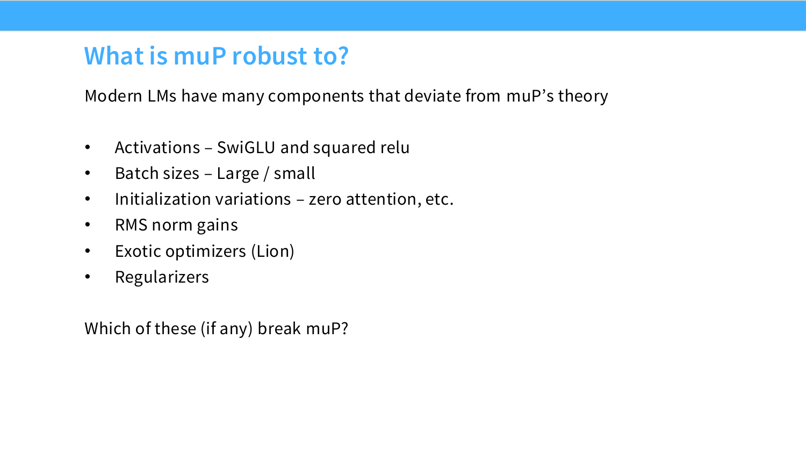

### 讲解

为了回答这个问题，我们需要研究 **muP 对现代 Transformer 中各种新组件的健壮性（Robustness）**。
现代大模型（2024-2026）早已偏离了随机矩阵理论最初假设的“纯线性网络”或“简单 ReLU 网络”。我们引入了：
- 激活函数（SwiGLU, Squared ReLU）
- 批大小（Large / Small Batch）
- 初始化变体（如将 Attention 输出层零初始化）
- RMSNorm
- 新优化器（Lion）
- 正则项（Weight Decay）
这些复杂的“非线性”因素，哪些会破坏 muP 的数学缩放有效性？

---

## Slide 54

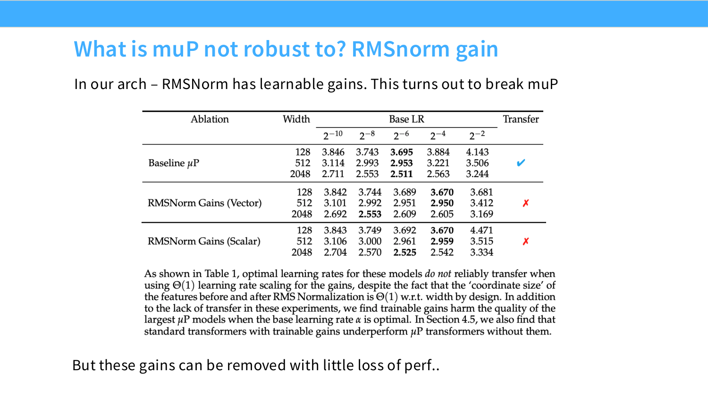

### 讲解

本页展示了第一个不健壮因素：**带可学习增益的 RMSNorm（RMSNorm Gains）**。
- **原因**：
  在标准的 RMSNorm 中，有一个可学习的仿射增益向量 $\gamma$。如果我们将这个 $\gamma$ 初始化为 1 并允许其在训练中更新，它会在网络极宽时破坏 muP 控制激活值 $\|\Delta h^l\|_2 = \Theta(1)$ 的数学纽带。
- **工程解决办法**：
  直接移除 RMSNorm 中可学习的 Gain（即令 $\gamma$ 固定为常数 1，不参与反向传播）。实验证明，在大规模预训练中，去掉 RMSNorm 的 gain 对最终的模型性能几乎没有任何负面损害，却能完美恢复 muP 的超参稳定度。

---

## Slide 55

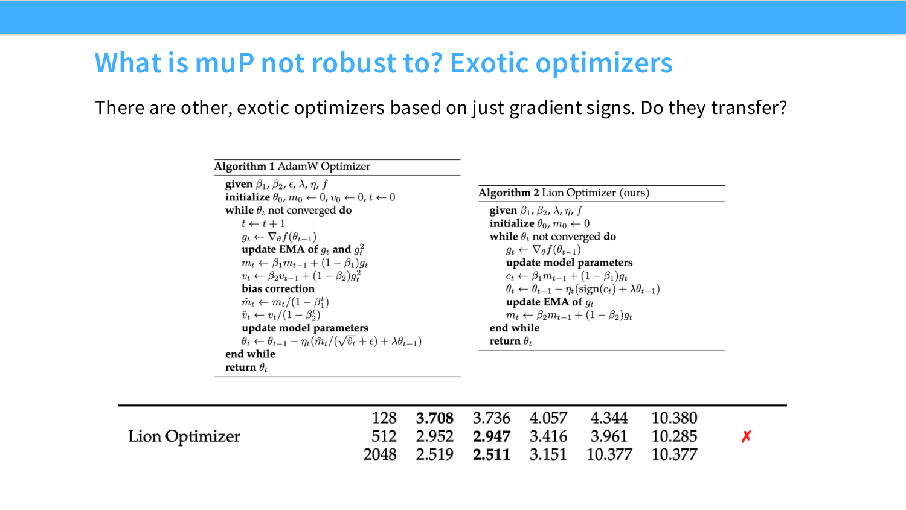

### 讲解

本页探讨了新型优化器（如 Lion, SignSGD）对 muP 的健壮性影响：
- 结论是，这类纯粹基于“梯度符号（Gradient signs）”更新的优化器，其动力学行为与 Adam 类似，更新幅值主要受 LR 约束。只要针对符号传播重新推导分母常数，其 muP 规则依然能够成功传递。

---

## Slide 56

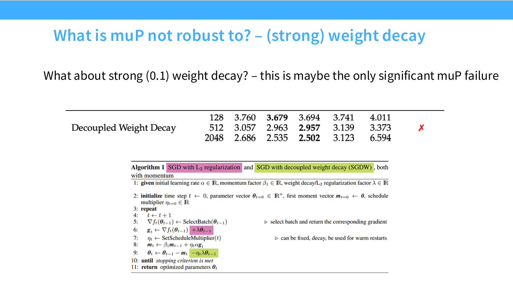

### 讲解

本页指出了 **muP 在实际应用中面临的唯一重大失效大坑——强权重衰减（Strong Weight Decay）**。
- **失效原理**：
  在许多大模型训练中，会设置非常强的权重衰减参数（如 `weight_decay = 0.1`）。强 Weight Decay 会在每一步更新中强行压低权重的范数。
  这会导致权重的演进不再仅仅由梯度（$\Delta W$）主导，而是受到了一个非线性的强行收缩力。这直接破坏了归一化假设条件 A2，导致在极宽的网络下，模型最优 LR 发生向下漂移。

---

## Slide 57

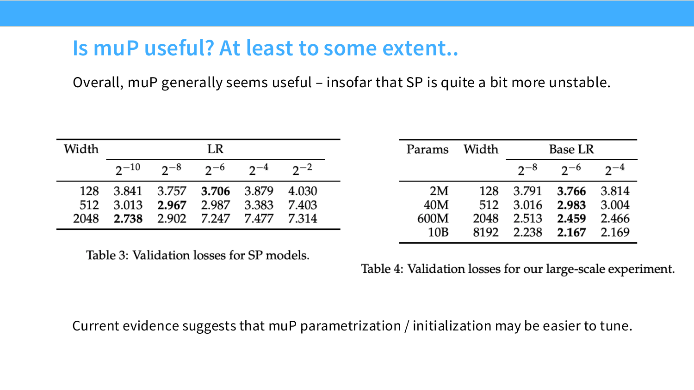

### 讲解

本页对 muP 的价值做出了客观的行业评估：
- **依然极具实用价值**：
  虽然强权重衰减会导致局部偏差，但相比极度不稳定、随宽度变大极易梯度爆炸的标准参数化（SP），muP 参数化提供了高出几个量级的数值稳定护栏。它在 CerebrasGPT、MiniCPM 上的成功证明了其作为规模化基础工具的无可替代性。

---

## Slide 58

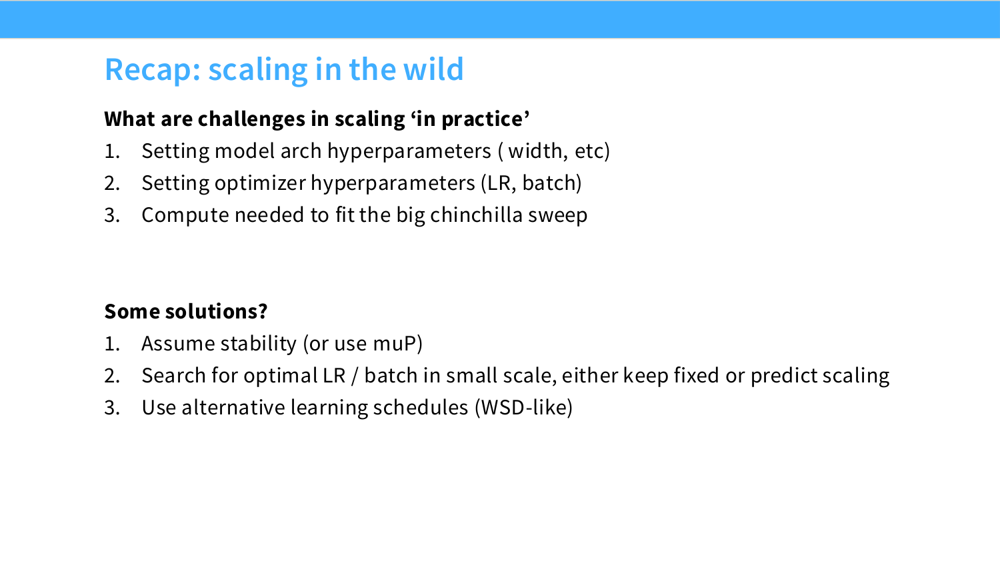

### 讲解

本页是本堂课关于 **大模型预训练规模化在实践中的挑战与方案的终极复习（Recap）**：
- **三大挑战**：
  1. **架构选择**：网络拓扑比例（长宽比）如何设计？
  2. **超参对齐**：如何科学设定随规模变化的 LR 与 Batch Size？
  3. **计算成本**：如何降低拟合 Scaling Laws 本身的 $O(N^2)$ 算力消耗？
- **三大解决方案**：
  1. **理论护航**：通过引入 **muP（极大更新参数化）** 确保不同宽度模型下 LR 恒定，提升训练稳定性。
  2. **经验外推**：在小尺度网格实验中识别 Loss 对数空间的凸性，拟合最优 LR 和 Batch Size 的幂律外推公式。
  3. **低成本调度**：采用 **WSD (Warmup-Stable-Decay) 学习率曲线**，通过 Stable 阶段的任意分支 Fork 实现廉价的 Token 尺度评测，替代高成本的 Cosine Chinchilla 实验。
