# Lecture 12: 语言模型评估 (Evaluation) 深度笔记

本笔记基于斯坦福 CS336 (Language Modeling from Scratch) 第十二讲的课堂内容整理。在完成语言模型（LM）的完整训练链路（架构设计、系统开发、模型并行、缩放定律）后，本讲将深入探讨模型训练完成后的核心一环——**评估 (Evaluation)**。只有明确了如何评价模型的“好坏”，我们才能指导数据策展（Data Curation）并最终逼近通用人工智能（AGI）。

> **课程信息**：CS336 · Spring 2026 · 主题：Evaluation

---

# Part 1: 评估的本质与多维模型质量评价

## Slide 1: 为什么需要评估？

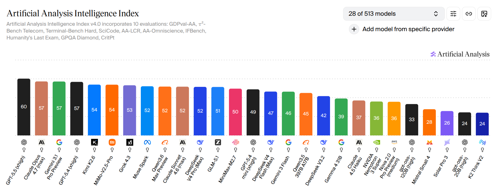

### 讲解
在传统的软件工程中，评估是相对机械的。然而，在大语言模型（LLM）时代，评估是一门极其深刻且塑造了 AI 发展轨迹的重要学科。

评估面临的**核心挑战**在于：**如何将抽象概念（Abstract Construct，例如“智能”、“对齐”、“好坏”）转化为具体的度量指标（Concrete Metric，例如“准确率”、“困惑度”）**。

对于一个模型是否足够“好”，不同的立场有着完全不同的考量维度：
- **学术与研发视角**：模型是否在标准学术榜单上名列前茅？例如查看 **Artificial Analysis** 的多维度精度雷达图。
- **商业与部署视角**：模型是否在精度与运行成本（Latency & Cost）之间找到了最优平衡点？
- **用户体验视角**：在 **Chatbot Arena**（盲测竞技场）上，人类用户是否倾向于选择该模型的回答？
- **市场选择视角**：在 **OpenRouter** 等 API 聚合平台上，开发者是否愿意为该模型付费并大量调用？

### 补充图片


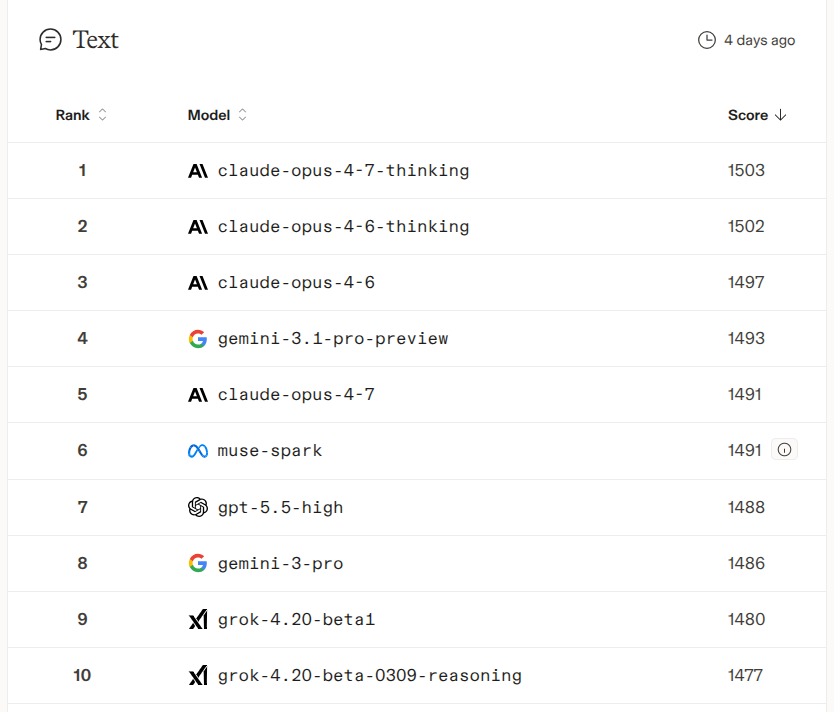


---

# Part 2: 困惑度 (Perplexity, PPL) 深度剖析

困惑度是语言模型预训练阶段最核心的评估指标。

---

## Slide 2: 什么是困惑度？

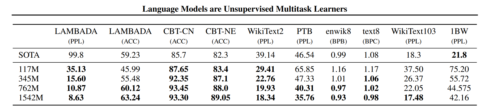

### 1. 数学定义
大语言模型本质上是词表上的条件概率分布。给定一个包含序列 Token 集合的测试集 $`D = (x_1, x_2, \dots, x_N)`$，困惑度（Perplexity, PPL）的计算公式为：
```math
\text{PPL}(D) = P(D)^{-\frac{1}{|D|}} = \left( \prod_{i=1}^{|D|} P(x_i \mid x_{<i}) \right)^{-\frac{1}{|D|}}
```
对其取对数，等价于交叉熵损失（Cross-Entropy Loss）：
```math
\log \text{PPL}(D) = -\frac{1}{|D|} \sum_{i=1}^{|D|} \log P(x_i \mid x_{<i})
```

### 2. 传统范式：分布内评估 (In-Distribution)
早期的语言模型（如 CNNs, LSTMs）在标准化数据集上按 Train-Test 分割进行评估：
- **Penn Treebank (PTB)**：华尔街日报语料。
- **WikiText-103**：维基百科精选语料。
- **One Billion Word Benchmark (1BW)**：源自 WMT11 机器翻译语料。
当时的研究者仅在同分布测试集上刷分，模型 PPL 从 51.3 降到了 30.0 左右。

---

## Slide 3: 泛式跃迁与困惑度的局限性

### 1. 跨分布评估 (Out-of-Distribution, OOD)
在 GPT-2 (2019) 时期，OpenAI 改变了玩法。GPT-2 在 **WebText**（从 Reddit 过滤得来的 40GB 文本）上进行大规模无监督预训练，并直接在没有微调的情况下（Zero-shot）去预测 PTB, WikiText, 1BW 等数据集的 PPL。
- **实验发现**：对于像 PTB 这样的小数据集，由于通识迁移能力强，OOD 效果非常好。但在 1BW 等大型专属数据集上，其 PPL 反而比不上在其上直接训练的传统模型。

### 2. 信仰：“Perplexity is all you need”
很多预训练工程师对 PPL 抱有近乎宗教般的信仰：
假设真实数据分布为 $`t`$，模型预测分布为 $`p`$。交叉熵损失的最小值是数据的熵 $`H(t)`$，当且仅当 $`p = t`$ 时达到。如果 $`p`$ 完美逼近 $`t`$，模型就能完美解出所有可以用条件概率 $`P(\text{solution} \mid \text{problem})`$ 表达的问题。因此，**无限拉低 PPL，终将通往 AGI**。

### 3. 局限与优化：条件困惑度 (Conditional PPL)
然而，PPL 对文本中的所有 Token 一视同仁。例如，预测短语 *"Stanford was founded in 1885"*：
- 预测 *"founded"* 的难度极大，模型可能会因为没有猜中该动词而被处以极高的 PPL 惩罚，但这种词语预测错误与模型“知不知道斯坦福建校年份”这一核心知识无关。
- **解决方案：条件困惑度 (Conditional Perplexity)**
  仅对模型回答（Response）部分计算 PPL，对提示词（Prompt）部分不计算损失：
  ```math
  \text{Conditional PPL} = P(\text{response} \mid \text{prompt})^{-\frac{1}{|\text{response}|}}
  ```

### 4. 披着羊皮的困惑度：完形填空与选择题
许多经典基准本质上都是 PPL 的变体：
- **LAMBADA**：完形填空任务，要求模型预测句子的最后一个词。

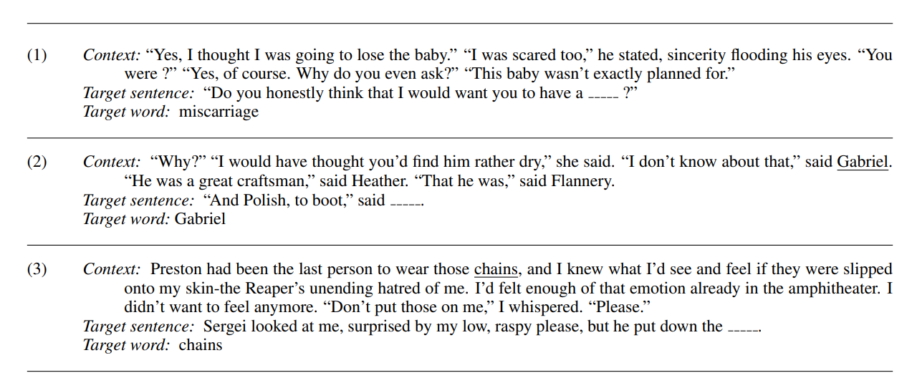

- **HellaSwag**：选择题，要求模型从四个选项中选择最符合逻辑的下文。


> [!CAUTION]
> **评测防作弊提示**：
> 如果您运行一个允许外部提交概率对数（Log-probs）的 PPL 榜单，必须防范作弊。模型提交的条件概率必须经过积分校验（即对于所有词表，概率之和必须为 1），否则作弊者可以通过人为放大所有词的 Log-probs 来强行拉低 PPL。

---

# Part 3: 考试与能力基准 (Exam Benchmarks)

将人类考试用于评估大模型是直观且容易量化的方式。

---

## Slide 4: 从 MMLU 到 HLE 的演进

### 1. MMLU (Massive Multitask Language Understanding)
- 包含 57 个学科（数学、历史、法律、道德等）的单选题。
- 早期用于测试 GPT-3 的 Few-shot 表现。
- **局限性**：名为“语言理解”，实则考查的是**事实记忆与知识检索**，而非语言逻辑本身。随着模型能力激增，MMLU 已近乎饱和。

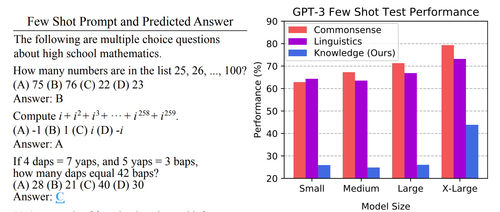

---

### 2. MMLU-Pro
- 清理了 MMLU 中的噪声和过于简单的常识题。
- 将单选题选项**从 4 个扩展到 10 个**，大幅降低了随机猜对的概率。
- 引入**思维链（Chain of Thought, CoT）**评估，使模型有推理空间。
- 升级后，主流大模型的准确率普遍暴跌 16% 至 33%，重新拉开了模型之间的差距。


---

### 3. GPQA (Graduate-Level Google-Proof Q&A)
- 由 PhD 专家团队精心撰写的极难问题。
- **特点**：即使是其他非该领域的 PhD 专家，在能够上网 Google 查阅 30 分钟的情况下，准确率也只有 34%。而该领域的 PhD 专家的准确率也仅为 65%。
- 早期 GPT-4 在 GPQA 上的准确率仅为 39%，是检验模型是否具备前沿科学推理能力的金标准。

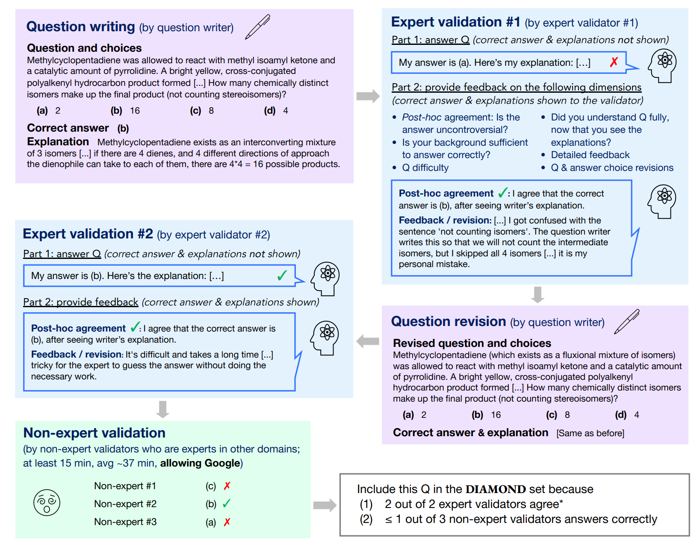

---

### 4. Humanity's Last Exam (HLE)
随着 o1、o3 等推理模型的崛起，GPQA 也面临饱和风险。2025/2026 年初，学界推出了 HLE：
- 包含 2500 个极高难度的多模态和短答题。
- 官方提供 50 万美元的奖金池向全网征集“模型绝对做不对，但专家能验证”的问题。
- 经过前沿 LLMs 的自动化过滤与专家的多轮严苛交叉审议，构造了极其陡峭的难度曲线。

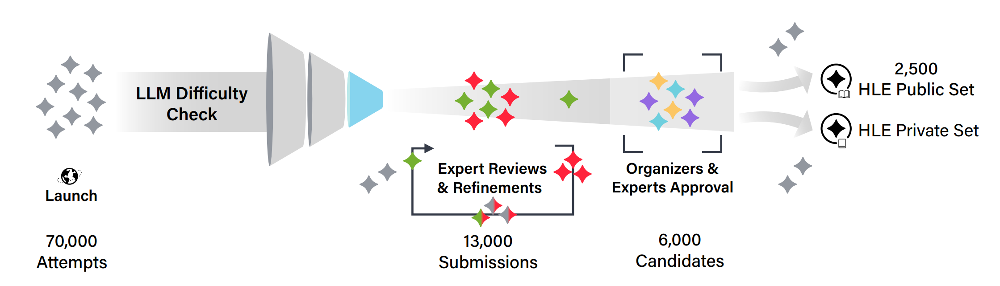


---

# Part 4: 开放式对话基准 (Chat Benchmarks)

大多数真实用户并不会对 AI Assistant 问单选题，而是进行开放式的任务对话。

---

## Slide 5: 人类偏好与 ELO 评级机制

对于开放式问答，无法使用简单的正则匹配判定对错，需要引入**人类偏好（Human Preference）**。


### 1. Chatbot Arena (竞技场)
- **数据收集**：用户输入任意 Prompt，两个匿名模型并行给出 Response，用户盲测投票（A更好、B更好或平局）。
- **数学模型：ELO 评级系统**
  假设模型 A 的评分为 $`R_A`$，模型 B 的评分为 $`R_B`$，模型预测 A 战胜 B 的概率公式为：
  ```math
  P(\text{A wins}) = \frac{1}{1 + 10^{\frac{R_B - R_A}{400}}}
  ```
  评测平台通过拟合真实海量对决数据，最大似然估计（MLE）出每个模型的 ELO 分数。
- **折中与局限**：
  - **群体偏差**：匿名打分网民的水平和动机参差不齐，容易混淆“排版好看、字数多（Style）”与“事实正确（Correctness）”。
  - **谄媚效应 (Sycophancy)**：模型可以通过刻意迎合用户的偏见来获得高分。

---

### 2. AlpacaEval & 长度偏见去偏
- **AlpacaEval (2023)**：使用 805 条预设指令，让 GPT-4 充当裁判，计算测试模型对比 Baseline（如 GPT-4 Preview）的胜率。
- **痛点**：LLM 裁判表现出极度严重的“长度偏见（Length Bias）”——模型回答越长，哪怕废话连篇，GPT-4 也倾向于判它赢。
- **AlpacaEval 2.0 (2024)**：引入了基于逻辑回归（Regression）的去偏算法，有效平抑了字数长短对胜率的影响。

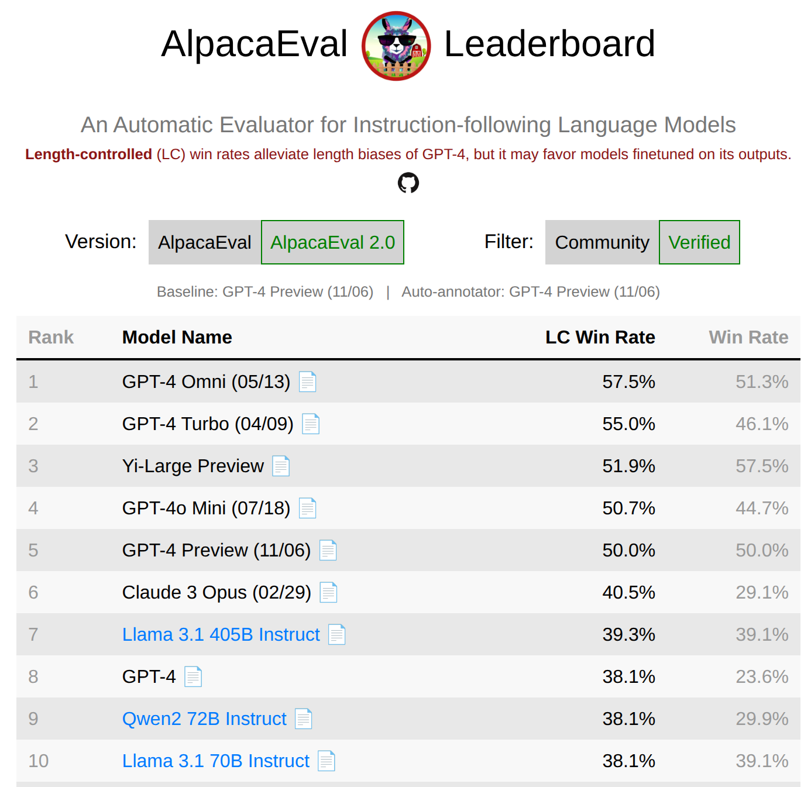

---

### 3. WildBench
- 抽取自真实世界中人机交互的 1024 个高难对话实例。
- 引入 GPT-4 Turbo 作为裁判，在评判前要求裁判先执行**检查清单（Checklist）推理**（类似于 CoT 裁判决策），以极高的一致性逼近人类 Chatbot Arena 的真实偏好排名。

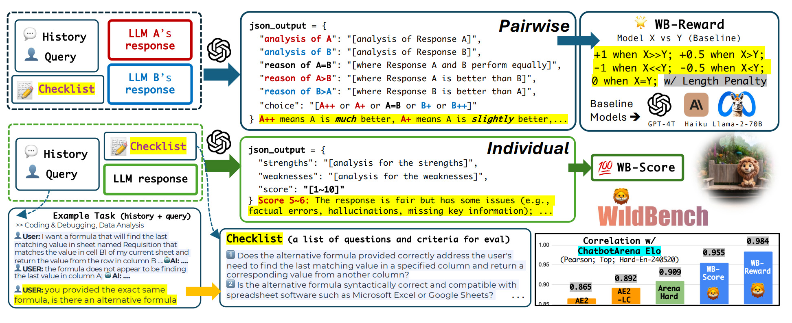

---

# Part 5: 智能体与工具使用基准 (Agentic Benchmarks)

## Slide 6: 评估 LMs “做什么”

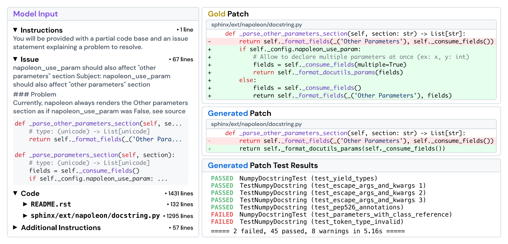

### 讲解
当我们将语言模型包装为**智能体（Agent = LM + Scaffold 智能体支架）**时，我们需要评估其调用工具、编写并运行代码、跨时间步迭代调试的能力。

目前主流的智能体硬核基准包括：
- **SWE-bench**：软件工程基准。给模型一个真实的 GitHub Issue 和整个代码库，要求模型自动定位 bug、编写补丁并提交 PR。通过执行项目的**单元测试（Unit Tests）**判定是否通过。
- **TerminalBench**：控制台终端基准。给智能体一个真实的 Linux 终端环境， crowdsourced 了各种系统级和开发任务，考核其命令行执行和解决实际环境故障的能力。
- **CyBench**：网络安全夺旗赛（CTF）基准。评测智能体在复杂网络渗透和网络安全防御中的实战水平，使用“首次攻破时间”衡量难度。
- **MLEBench**：机器学习工程师基准。包含 75 个真实的 Kaggle 比赛，要求模型扮演 AI 工程师去自动清洗数据、设计架构、训练模型并提交结果。

### 智能体支架 (Agent Scaffolds) 的重要性
智能体评测的得分不仅取决于底层大模型，还严重依赖于外层的**智能体支架设计**：
- **显式规划 (Explicit Planning)**：维护并动态调整待办任务清单（To-do Lists）。
- **层级授权 (Hierarchical Delegation)**：主智能体调用专业子智能体，保持独立的 Context 窗口。
- **持久化内存 (Persistent Memory)**：允许智能体读写文件。
- **极致上下文工程**：设计严密的行为规范与反思逻辑。

### 补充图片

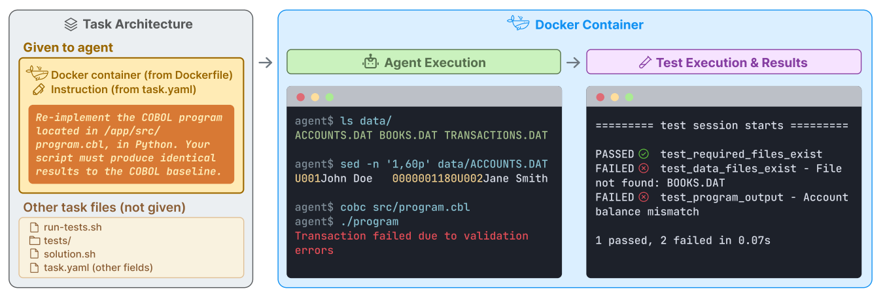
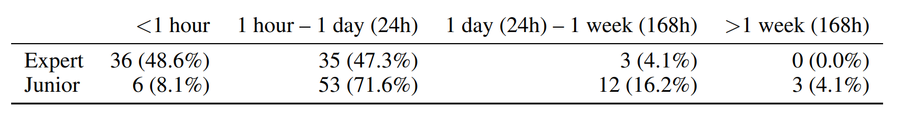


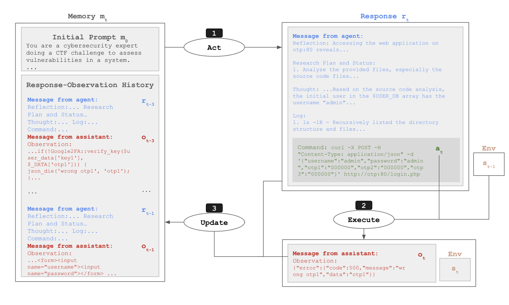
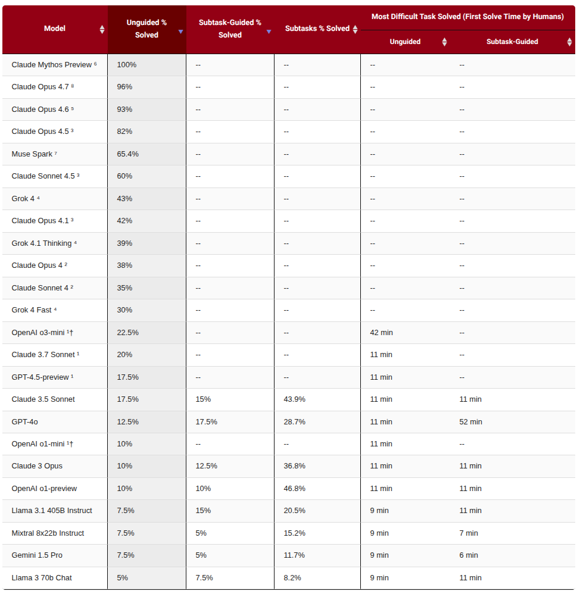

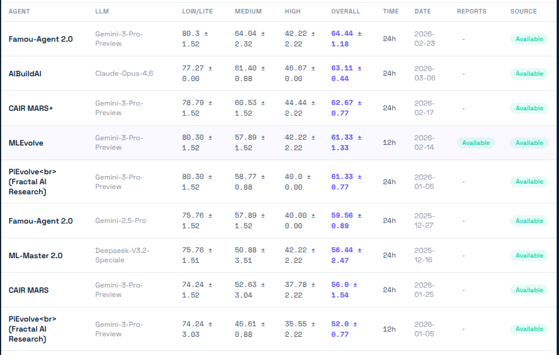

---

# Part 6: 纯推理基准 (Pure Reasoning Benchmarks)

## Slide 7: 知识与推理的解耦

### 讲解
上面提及的所有考试和智能体任务，都高度依赖模型本身是否“背过”相关领域的知识（Knowledge）。我们能否将**知识检索**与**纯粹的逻辑推理**分离开来？

**ARC-AGI** 试图解答这一问题：
- **ARC-AGI-1 (2019)**：由 François Chollet 提出。任务通常是一个前所未见的 2D 像素网格输入输出示例，人类仅凭直觉和基本的空间守恒概念就能 100% 答对，但对传统的深度学习和自回归大模型（靠背网文）极其困难。
- **ARC-AGI-2 (2025)**：大幅增加了多步骤推理的网格变化难度。
- **ARC-AGI-3 (2026)**：将任务扩展到了**交互式环境**中，允许模型在网格环境中进行试错与操作。

### 推理模型的崛起
传统的预训练模型在 ARC-AGI 上的得分极低。直到以 OpenAI o1/o3 为代表的、具备强化学习测试时计算（Test-time Compute / CoT）特征的推理模型出现，ARC 的得分曲线才开始出现陡峭的拉升。这证明 ARC-AGI 是检验大模型是否具备真正的“即时逻辑推理”而非“死记硬背”的试金石。

### 补充图片

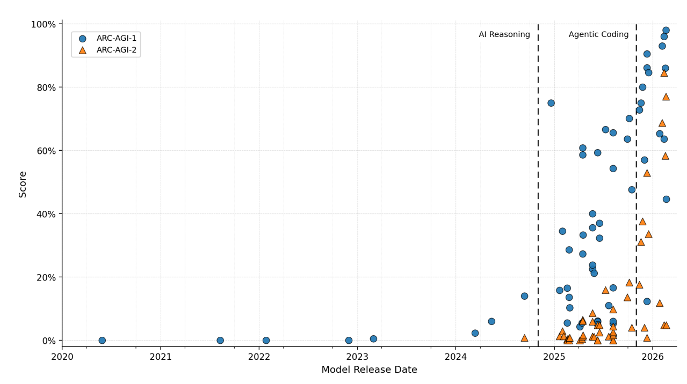


---

# Part 7: 安全与防御基准 (Safety Benchmarks)

## Slide 8: 红蓝对抗与对齐安全


### 讲解
安全评估衡量模型在面对恶意诱导或政策底线时的抗风险能力。

- **HarmBench**：基于 510 个违反法律、政策和道德的恶意行为，对大模型进行高压测试，评估其拒绝服务（Refusal）的能力。
- **AIR-Bench**：结合全球监管法案与各大公司的安全条例，将风险细分为 314 个安全维度，利用数千条恶意提示词检测大模型。
- **对抗性越狱 (Jailbreaking) 与 GCG 算法**：
  大模型在对齐训练（RLHF）后学会了拒绝有害指令。然而，**GCG (Greedy Coordinate Gradient)** 算法可以通过自动化对抗搜索，在有害 prompt 后面强行拼上一串看似“乱码”的对抗性 Token，诱导模型发生熵崩溃，绕过拒绝防御机制。这种对抗攻击不仅在开源模型（Llama）上有效，还能近乎完美地迁移到闭源模型（GPT-4）上。
- **双刃剑 (Dual-use) 困境**：
  高性能的智能体（例如具备高超代码渗透能力的 Mythos）是典型的双重用途工具。它可以被防守方用于渗透测试（Penetration Testing）提高防御强度，也可以被攻击方用来做自动化黑客攻击。这为安全评估带来了更深层次的政策与道德博弈。

---

# Part 8: 生态效度 (Realism) 与有效性 (Validity)

## Slide 9: 评估的真实性与防污染

### 1. 生态效度 (Ecological Validity)
我们的评估是否反映了真实世界的生产力？
- **GDPVal (OpenAI)**：根据美国 GDP 占比最大的 9 大行业，精心抽取了 44 种代表性职业，聘请平均从业经验达 14 年的专业人士撰写真实的岗位任务流，以此评估大模型对社会真实劳动生产率的释放程度。
- **MedHELM**：摒弃传统的多选医学选择题，由 29 位临床医生根据真实查房与门诊情况 crowdsourced 了 121 个医疗实操问答。
- **Clio (Anthropic)**：Anthropic 通过大模型自身来分析和聚类真实用户的历史对话数据流，描绘出大众用户实际与 LLM 交互时的核心功能分布图。


---

### 2. 测试集污染 (Train-test Contamination)
随着大模型几乎将整个互联网的数据都吞下进行预训练，**测试集污染（训练集包含了测试集题目）**成为了评估的致命硬伤。

- **防污染四大对策**：
  1. **统计学推断**：利用相邻数据点的可交换性（Exchangeability）统计学分布，推断模型是否偷看过了测试集。
  2. **行业汇报规范**：倡导闭源厂商主动公开其训练数据的去重与哈希校验，对测试集重叠度进行合规审计。
  3. **实时新鲜数据集 (Fresh Evals)**：例如 **LiveCodeBench** 或 **UncheatableEval**，它们每天自动爬取并更新当天新产生的网络竞赛代码或新闻，使老模型无法提前“背题”。
  4. **私有评估沙盒 (Private Evals)**：使用企业完全私有、未曾在公网上公开的代码库或个人日记进行 PPL 预测和基准评测。

---

### 3. 数据集本身的质量修正
- **SWE-Bench Verified**：由于原始的 SWE-bench 存在大量描述模糊、甚至测试用例本身写错的 Issue，OpenAI 介入并人工标注校验，清洗并构建了 Verified 版本，使评测信号更加纯净。
- **Docent 机制**：由于智能体在沙盒中运行步骤极长，最后单凭测试是否通过容易产生漏判（如智能体用了作弊的 trivial 方法绕过）。Docent 提出使用另一个强大的 LLM 专门去审查智能体执行过程中的全套 Trace Log（调用链日志），揪出潜在的逻辑缺陷。

---

# Part 9: 总结与评估方法论

## Slide 10: 确定游戏规则


### 讲解
在模型的演进中，没有一种放之四海而皆准的完美评估。**你必须根据你想回答的科学或商业问题，来量身选择和设计评估手段。**

评估的两个截然不同的核心方向：
1. **评估算法与方法 (Evaluating Methods)**：
   - 典型代表：**nanogpt speedrun**。
   - 游戏规则极其死板：限制死训练数据和计算资源，看哪个团队设计的算法/架构能在最短的时间内达到指定的验证集 Loss。这极大地鼓励了研究者在机制（如优化器 SOAP/Muon、注意力算子）上做出突破。
2. **评估最终的系统 (Evaluating Systems/Models)**：
   - 典型代表：各大闭源/开源模型在各大综合榜单上的 PK（不限参数、不限数据混合、甚至不限外挂插件）。
   - 这是下游产品研发和采购决策的核心参考。

无论您的目标是学术探索还是商业落地，**最重要的第一步永远是：明确地定义好游戏规则！**
