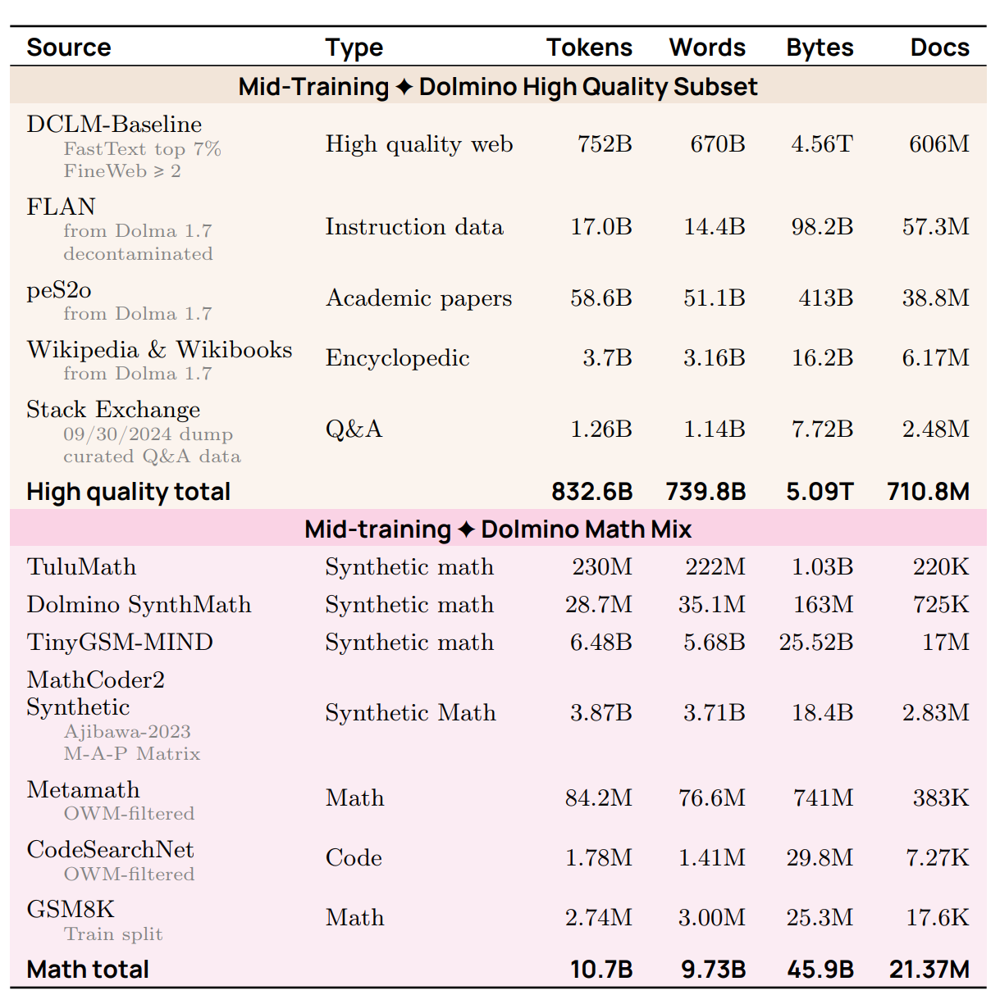
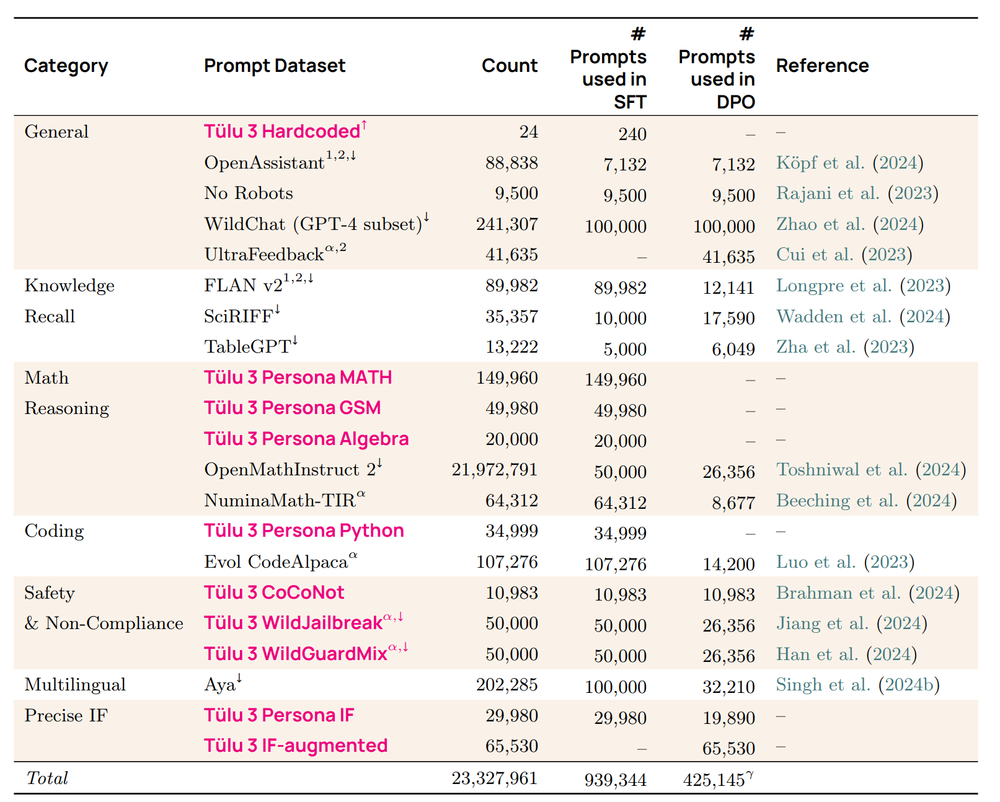
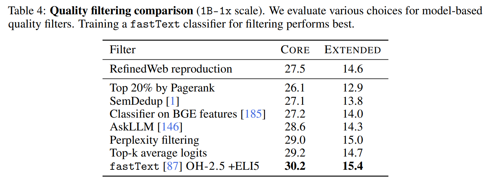
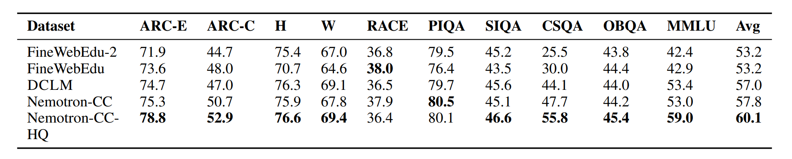
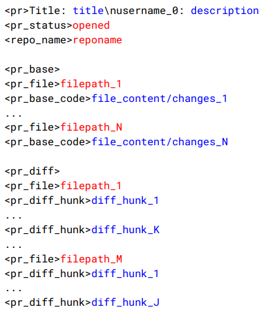
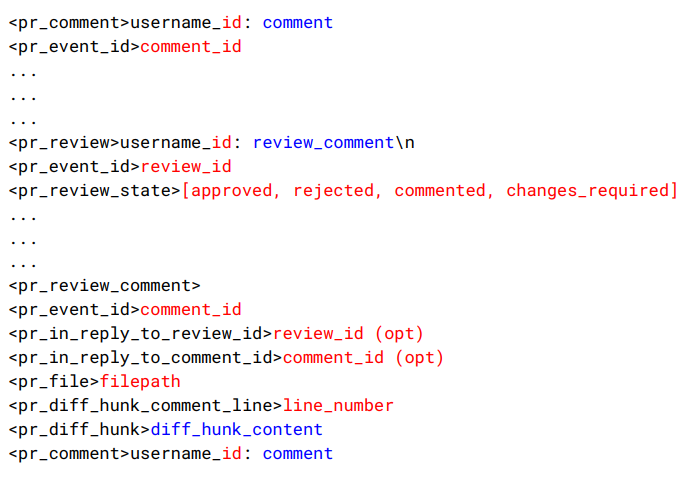
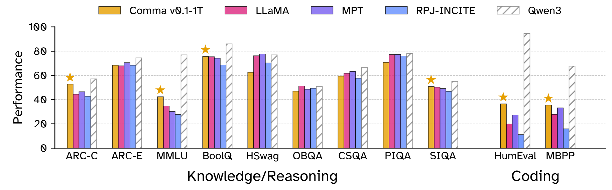

# Lecture 13: Data I (数据第一部分) 深度笔记

本笔记基于斯坦福 CS336 (Language Modeling from Scratch) 第十三讲的课堂内容整理，核心讨论大语言模型训练中“数据（Data）”这一最为关键的要素。本节课详细探讨了数据的来源与合规性（网页爬取与版权争议）、主流预训练数据源（Common Crawl, Wikipedia, GitHub, arXiv）、预训练数据集的演进历史（从早期 BERT/GPT-2 时代到现代百亿/万亿 Token 级别的数据清洗与过滤），以及代码数据集和完全许可数据集的探索。

> **课程信息**：CS336 · Spring 2026 · 主题：Data I (数据第一部分)

---

## Part 1: Motivation & Stages of Training (动机与训练阶段划分)

在训练语言模型时，**数据（Data）**是决定模型性能最核心的要素。

### 1. 行业保密性（Secrecy of Data）
在大模型研发中，企业往往对数据配方极其保密，原因在于：
1. **竞争优势（Competitive dynamics）**：模型架构（如 Llama 3 采用常规 Transformer 架构）和训练流程通常是公开或半公开的，但具体的数据配方、清洗流程、配比等是各家的核心护城河。
2. **版权与法律风险（Copyright liability）**：过度透露数据来源容易招致版权诉讼（例如 NYT 诉 OpenAI）。

### 2. 训练阶段的演进（Stages of Training）
语言模型的训练一般分为以下三个阶段：
1. **预训练（Pre-training）**：使用海量、相对低质的无监督文本（如网页抓取）进行训练，让模型获得基础的语言理解与世界知识。
2. **中期训练（Mid-training）**：在高质量数据（如学术文献、高质量代码、精心挑选的特定领域数据）上进行持续预训练，以显著提升模型的特定能力。
3. **后期训练（Post-training）**：包含指令微调（Instruction Tuning）和人类反馈强化学习（RLHF），使用极少量、极高质量的对话数据使模型符合人类偏好。

整体趋势是：**从海量低质数据走向少量高质数据**。

以 AI2 研发的 **OLMo 2** 模型为例：
- **Pre-training**：使用的大规模语料库（Dolma 2 / Web 数据）：
  
- **Mid-training**：使用了多阶段高质量配比数据（Dolmino 数据集）：
  
- **Post-training**：使用 Tulu 3 框架进行指令微调和偏好对齐：
  

---

## Part 2: Origin of Data & Licensing (数据的来源、限制与版权许可)

### 1. 数据的源头：网页爬取（Web Crawling）
“语言模型是在整个互联网上训练的”这一说法并不准确。更准确地说是**公开的万维网（Public Web）**。即使如此，我们也无法获取全部的网页数据，面临着以下限制：

- **动态内容与应用（Dynamic Content）**：许多现代网站都是动态应用（如 Discord, Wandb），URL 不变，需要模拟用户点击或提交表单才能呈现数据，爬虫难以抓取。
- **身份验证与付费墙（Authentication & Paywalls）**：如 Facebook, X, LinkedIn 以及纽约时报等网站，内容处于“围墙花园（Walled Gardens）”内，需要登录或付费订阅。
- **技术限制（Technical Restrictions）**：
  - `robots.txt` 协议：网站主动声明哪些路径不允许被爬虫访问（例如 [NYTimes robots.txt](https://www.nytimes.com/robots.txt)）。
  - Cloudflare 等防爬墙防护（如验证码 CAPTCHA 拦截）。
  - IP 封禁与国家/地区限制。
  - 严格的速率限制（Rate Limits）。
- **法律限制（Legal Restrictions）**：网站的服务条款（Terms of Service, ToS）可能明文禁止使用自动化爬虫，或者开发者可能并没有复制/传播该网页的版权许可。

#### **同意度的下降（Decline of Consent）**
研究表明（如 [Decline of Consent 论文](https://arxiv.org/abs/2407.14933)），随着 AI 训练需求的爆发，主流网页数据源对于 AI 爬虫的限制（通过 robots.txt 和 ToS）在近年来急剧增加。

当爬虫行为不规范时，会对网站服务器造成巨大负载甚至宕机（如 Anthropic 爬虫事件）：

- **影子图书馆（Shadow Libraries）**：如 Library Genesis (LibGen)、Z-Library、Anna's Archive 和 Sci-Hub。虽然在技术上属于 Web 的一部分，并且包含了海量书籍和学术论文，但从法律角度来看，这属于数字盗版和版权侵权。目前，关于 AI 在这些数据上训练是否合规仍存在巨大争议。

---

### 2. 知识产权与版权法（Copyright Law）
#### **版权法基础**
版权法旨在**激励知识产权的创造**。
在美国，最核心的是《1976年版权法案》。版权保护适用于“固定在任何有形表达媒介中的原创作品”。
- **版权保护的是表达，而非思想**（例如，不能为快速排序算法申请版权，但可以为具体的代码实现申请版权）。
- **门槛极低**：作品一经“固定”即自动获得版权，无需向版权局注册登记（但如果起诉他人侵权，则需要先登记，费用为 65 美元）。
- **期限长**：版权保护通常持续 75 年（或作者终身加 70 年），过期后进入公有领域（Public Domain，如莎士比亚、贝多芬的作品）。

**结论**：*互联网上的几乎所有内容都受到版权保护*。

#### **如何合法利用版权作品**
1. **获得许可（Licenses）**：
   - 授权合约：如 Creative Commons（知识共享许可，广泛用于 Wikipedia、YouTube 的 CC 视频等）。
   - 商业采购许可：如 Google 与 Reddit 达成内容许可协议，OpenAI 与 Shutterstock 达成图像许可，OpenAI 与 StackExchange 合作。
2. **合理使用原则（Fair Use - Section 107）**：
   司法判定是否属于合理使用会考量四个要素：
   1. **使用目的与性质**：是否具有教育意义而非单纯商业化？是否具有**变革性（Transformative）**？
   2. **版权作品的性质**：是事实性/非原创内容，还是高度创意的文学作品？
   3. **使用的数量与比例**：是使用了片段（Snippet），还是复制了整个作品？
   4. **对原作品市场价值的影响**：是否替代了原作品的销售？

#### **经典 AI 版权诉讼案**
- **The New York Times v. OpenAI (2023)**：纽约时报起诉 OpenAI 训练数据未经授权使用其文章，且模型能够近乎一字不差地输出其付费内容。
- **Authors v. Anthropic (2024)**：作家起诉 Anthropic 训练数据包含侵权图书。2025 年简易判决认为**模型训练属于 Transformative（合理使用）**，但在训练前**非法下载和存储盗版图书（Pirating）的行为属于侵权**。最终 Anthropic 支付了 15 亿美元进行和解。
- **Authors v. Meta (2025)**：联邦法官裁定 Meta 训练图书属于合理使用，但关于非法获取书籍源文件的争议仍在继续。

---

## Part 3: Primary Sources of Data (预训练数据的主要来源)

### 1. Common Crawl (通用网页抓取)
[Common Crawl](https://commoncrawl.org/) 是一个成立于 2007 年的非营利组织，每隔一个月运行一次网页爬虫。

> **👨‍🏫 小白导读**：你可以把它想象成一辆“互联网免费扫街车”，它每个月都会在全网漫游，把网页打包存下来，免费提供给全世界的研究员使用。目前它是几乎所有大模型（如 GPT-3, Llama）最核心的“原材料基地”。

- 规模：包含了数百亿级网页，单个快照（如 April 2026 Crawl）包含 21.9 亿网页，大小达 372.2 TB。
- 架构：使用 Apache Nutch 爬虫框架。通过数百个种子 URL 开始，下载网页后提取超链接加入队列，并遵守礼貌原则（Robots.txt，避免把别人网站挤瘫痪）。
- **数据格式（关键概念）**：
  - **WARC**：存储网页的**原始面貌**（包含完整的 HTTP 响应和所有的 HTML 标签代码，就像你右键点击“查看网页源代码”看到的一样）。
  - **WET**：只包含提取出的**纯文字**（把网页排版和代码都扔了，只留文字。这是一个会丢失排版信息的过程）。
- **HTML 转文本的痛点**：因为直接让大模型看带代码的 HTML 噪音太大，必须转成纯文本（使用工具如 trafilatura, resiliparse）。但这个转换过程极其关键，不同的转换工具对文本提取的完整度有很大差异（比如有的工具会把网页侧边栏的无关广告和正文混在一起），这会直接影响最终训练出来的模型有多聪明。
  

### 2. Wikipedia (维基百科)
- 优点：高质量、多语言、信息丰富。
- 限制：维基百科不允许包含原创研究（No original thought），内容必须基于可信来源的显著报道（Notability）。
- 提取方式：维基百科定期提供官方打包的 Dump 数据文件，无需进行网页爬取。
- **潜在风险：数据毒化攻击（Data Poisoning Attacks）**
  研究（如 [Swinin+ 2023](https://arxiv.org/pdf/2302.10149)）表明，由于任何人都可以编辑 Wikipedia，攻击者可以在官方定期 Dump 之前，恶意修改条目以注入毒化数据（例如让模型对特定词汇产生负面情感倾向），并在 Dump 完成后迅速撤销修改以规避管理员发现。

### 3. GitHub (代码数据)
- 作用：除了用于代码生成、补全任务，代码中的逻辑结构和注释也有利于培养模型的推理能力。
- 来源：通过 Git 协议批量克隆公共仓库（需过滤保留宽松的 MIT、Apache 许可协议），或通过 GitHub Archive 收集 Issue、PR 和评论。
- [Software Heritage](https://www.softwareheritage.org/)：成立于 2016 年的非营利组织，致力于保存全球的开源代码，涵盖 GitHub, GitLab 等多个平台。

### 4. arXiv (学术文献)
- 来源：免费开放的学术预印本网站，提供 PDF 与 LaTeX 源码。
- 许可：部分使用 Creative Commons，元数据（标题、摘要）使用 CC0。可以通过 Amazon S3 批量下载。

---

## Part 4: Evolution & Filtering of Pre-training Datasets (预训练数据的发展史与“淘金”技术)

> **👨‍🏫 给非专业同学的通俗解释**：
> 互联网上的数据就像是**一座巨大的垃圾山，里面混杂着金子（高质量知识）**。直接把整个垃圾山原封不动喂给 AI，它会学坏或者变笨（比如学会满嘴脏话、或者只会重复无意义的乱码）。
> 所以，AI 科学家们过去几年的核心工作，就是发明各种**“淘金工具（数据清洗技术）”**，把垃圾扔掉，把金子提纯。
> 这个过程经历了几个时代的发展：从早期的“手工挑选”，到中期的“机器粗筛”，再到现在的“用 AI 魔法打败魔法（用聪明的 AI 去筛选和改写数据）”。

下面我们像看故事一样，梳理一下历史上著名数据集的发展历程（这也是 AI 越来越聪明的秘诀）：

### 时代一：早期探索，挑选现成的“精装书” (2018-2019)
早期的模型（比如早期的 BERT 或 GPT）体量不大，吃不下整个互联网，所以科学家只挑最干净、最现成的数据。
* **BERT Data (2018)**：主要使用了 **维基百科 (Wikipedia)** 和 **BooksCorpus**（一个包含大量在 Smashwords 平台上免费自出版的电子书数据库）。**关键点**：它强调让模型读“完整的长文章”而不是“孤立的单句”，这帮助模型第一次很好地学会了上下文连贯性。
* **GPT-2 的 WebText (2019)**：互联网太乱了怎么办？OpenAI 想了个聪明的办法——**借用人类的智慧**。他们跑到 Reddit（类似美国的贴吧），专门收集那些**被网友点赞数（Karma）大于等于 3 的帖子**里面附带的网页链接。这就相当于让人类网友当了免费的质检员，过滤掉了没人看的纯垃圾网页，最后攒了 40GB 优质数据。

### 时代二：开始向“通用网页（Common Crawl）”进军，发明过滤筛子 (2019-2021)
随着模型胃口变大，现成的书和网友推荐的网页不够吃了，科学家只能硬着头皮去处理 Common Crawl 这个“终极垃圾山”。
* **CCNet (2019)**：发明了基于“维基百科风格”的过滤法。他们训练了一个语言模型，用来给随机网页打分：**“这个网页读起来像不像维基百科？”**。像的留下，不像的丢掉。这就把很多口水话和乱码去除了。
* **T5 模型的 C4 数据集 (2019)**：Google 的研究员采用了一堆**“硬性死规定（手工规则/Heuristics）”**来粗暴过滤网页。
  * 比如：一句话必须以标点符号结尾；一页必须有至少 3 句话。
  * 甚至：把包含各种“脏话词库”、“Lorem ipsum（排版用的占位假文）”，甚至包含太多大括号 `{`（这通常代表是代码而不是自然语言）的网页全删了。
  * **局限性**：这种一刀切的方法容易误杀好人。比如 C4 数据集最后基本只剩下了新闻、博客等格式极其规整的内容，缺乏多样性。
  
* **GPT-3 Dataset (2020)**：用更高级的分类器对 Common Crawl 进行打分，并引入了**模糊去重（Fuzzy Deduplication）**。去重极其重要，因为互联网上有很多被疯狂复制粘贴的废话，如果不去重，AI 就会变成一个只会机械复读的“复读机”。

### 时代三：海纳百川的“大杂烩”与极致清洗 (2021-2023)
大家发现，要想让大模型“琴棋书画样样精通”（写代码、做数学、写邮件），就必须喂给它各行各业的顶尖数据。
* **The Pile (2021)**：这是一个由开源社区志愿者“用爱发电”搞出来的传奇大杂烩数据集。它精心挑选了 22 个高质量来源：
  * **PubMed & arXiv**：教模型读顶尖的医学和理科科研论文。
  * **GitHub**：教模型写代码。
  * **Enron 电子邮件**：美国安然公司破产案被法院公开的 50 万封真实高管邮件！这成了教模型“如何像人类高管一样进行商务沟通”的绝佳素材。
  * **StackExchange**：像知乎或百度知道一样的专业问答网站。这种 Q&A（问答）格式简直是天然的指令微调（Instruction Tuning）教科书，AI 看了就知道人类提问后应该怎么回答。
  * **图书库**：Project Gutenberg（古腾堡计划，收录版权过期的世界名著）和 Books3（一个包含了近 20 万本书的“影子图书馆”，后来因版权纠纷被告下架）。
  
* **Gopher 的 MassiveText (2021)**：DeepMind 团队发现，如果用机器模型去过滤数据，容易产生偏见（比如机器可能会把黑人英语或者方言误判为低质文本）。于是他们坚持用极其复杂的**纯手工规则**来精修数据，并用 Google 安全搜索过滤有毒内容。
* **LLaMA Data (2023)**：Meta 把前人的好方法融合。比如对学术论文去除 LaTeX 代码注释，对 StackExchange 问答按点赞数排序等，打包成了 1.2 万亿 Token 的庞大数据集。
* **RefinedWeb (2023) & FineWeb (2024)**：提出了一个震撼的观点——**“不需要到处找高质量书本，只要把网页清洗得足够干净，纯网页也能练出神级模型”**。比如 FineWeb 不仅做了极致的去重，还把网页中的个人隐私信息（PII，如邮箱、IP 地址）全部脱敏屏蔽，最终留下了 15 万亿 Token 的干净网页。

### 时代四：用 AI 教 AI，迈向自动化精洗与改写 (2024-至今)
现在，垃圾山里能直接用的金子快被挖光了，简单的筛子不够用了。最新的潮流是：让聪明的 AI 亲自下场“炼金”。
* **Dolma (2024)**：一套标准化的现代流水线：先分类语言 -> 启发式规则过滤 -> 毒性分类器 -> Bloom Filter 深度去重。
  
* **DCLM (DataComp-LM) (2024)**：提出用**极其强大的大模型分类器**来当裁判。他们把 Reddit 上“像对5岁小孩解释一样（ELI5）”的优质回答作为满分标准，对几百万亿的网页进行打分过滤。这个“挑剔的 AI 裁判”选出来的数据，训练效果远超以前的手工死规则。
  
  
* **Nemotron-CC (2024)**：**这是目前的最新理念——不仅要过滤，还要“模型改写（LM Rephrasing）”。**
  * 科学家心疼地发现，如果标准太严格，90% 的网页都被扔了，太浪费数据了。
  * 于是，他们用一个超级聪明的 AI 老师（Nemotron-340B）给网页打“教育价值分”。
  * **变废为宝**：对于那些有干货但是写得烂的网页，不直接扔掉，而是让 AI 把它**润色、改写**成高质量的文章！
  * **锦上添花**：对于写得好的网页，让 AI 针对它生成问答题。这相当于人为把粗糙的铁矿石直接炼成了极品宝剑。
  

---

## Part 5: Code Datasets & Fully Licensed Datasets (代码与完全许可数据集)

### 1. 代码数据集
代码数据集专门针对模型的代码能力和一般推理能力。
- **The Stack v1** (BigCode 2022)：从 GitHub 克隆了 1.37 亿个仓库，利用 `go-license-detector` 精准识别开源许可证，只保留宽松许可证（MIT, Apache 等），再通过 MinHash 进行精确与模糊去重，清洗出 3.1 TB 代码数据。
- **The Stack v2** (BigCode 2024)：
  - 数据源更加丰富：不仅包含 GitHub 仓库代码，还整合了 Software Heritage、GitHub Archive 里的 Issue 和 PR（拉取请求）对话，甚至各技术文档网站（PyPI, npm, devdocs.io）的数据。
  - **将代码与底层中间语言（LLVM）配对**：这是一个非常巧妙的跨语言教学法。对于一些很少见的“小众编程语言”（比如 Nim 语言），大模型见得少，很难学好。科学家就把小众语言的源码，跟它编译后生成的“通用底层中间语言（LLVM）”配对起来喂给模型，帮助 AI 触类旁通理解它的底层逻辑。
  - **PR（Pull Request）序列化教学**：将开源社区的 PR 讨论元数据、代码变更差异（diff）、以及代码前后的上下文，全部打包成一段连续的文本教给 AI。**这就好比给 AI 看了顶级程序员审阅代码、讨论架构、修复 Bug 的全过程录像**，对提升 AI 的实际编程能力有极大帮助。

  
  

---

### 2. 完全许可数据集：CommonPile
如前所述，几乎所有互联网公开网页都拥有版权保护。目前利用版权作品进行模型训练虽被大部分法院认定为“合理使用”，但其法律基础尚未完全落石。

#### **CommonPile**
CommonPile（2025）是一个包含 8TB 数据的实验性语料库，它**只收集明确获得 permissive license（宽松开源许可）的数据**。

- **许可洗白问题（License Laundering）**：
  在实际收集时，经常会出现一些受到严格版权保护的内容被第三方不经授权上传并标记为宽松许可证（如 Creative Commons），如何自动识别此类数据洗白（Laundering）是核心挑战。
- **合成数据风险**：
  若在 CommonPile 中混入由其他未授权大模型（如 GPT-4）生成的合成数据，其是否具有法律追责性依然是一个灰色地带。
- **实验结论**：
  只用完全宽松许可的数据进行训练，模型的表现能够达到不错的水准，但在绝对表现上依然难以匹敌那些拥有数十万亿未授权通用 Token 喂养的商业大模型：
  
  

---

## Part 6: Summary (总结)

1. **数据并非凭空而来**：大模型所用的语料要经历“在线服务 -> 原始抓取 -> 提取转换 -> 启发式/模型过滤 -> 模糊去重 -> 脱敏安全审查”等极其复杂的处理链路，需要大量的工程实践和微调。
2. **数据是核心壁垒**：模型架构日益趋同，算力可以花钱购买，但独家的**高质量数据配方与清洗逻辑**是区分各家大模型真实能力（特别是长尾分布和专业推理）的决定性基石。
3. **法律与道德约束收紧**：在 decline of consent（robots.txt 拒绝率上升）和诉讼和解大潮下，合规、安全地获取、采购和生成数据将成为大模型时代下半场竞争的关键。
