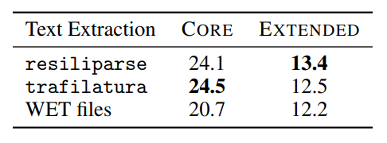
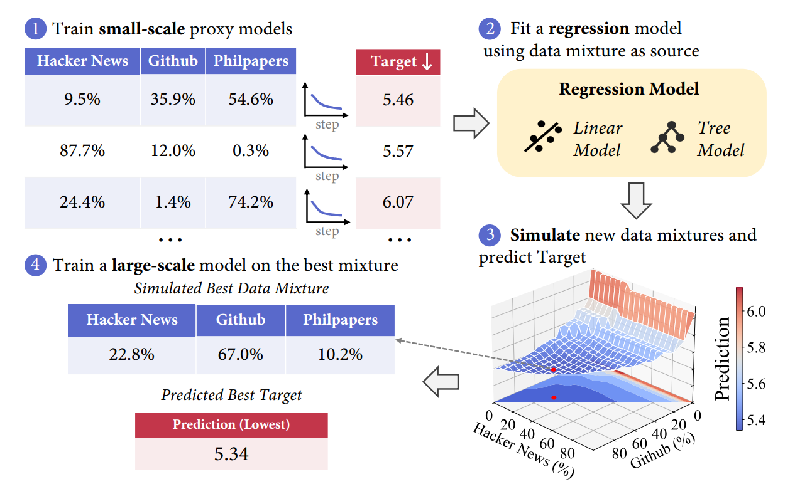
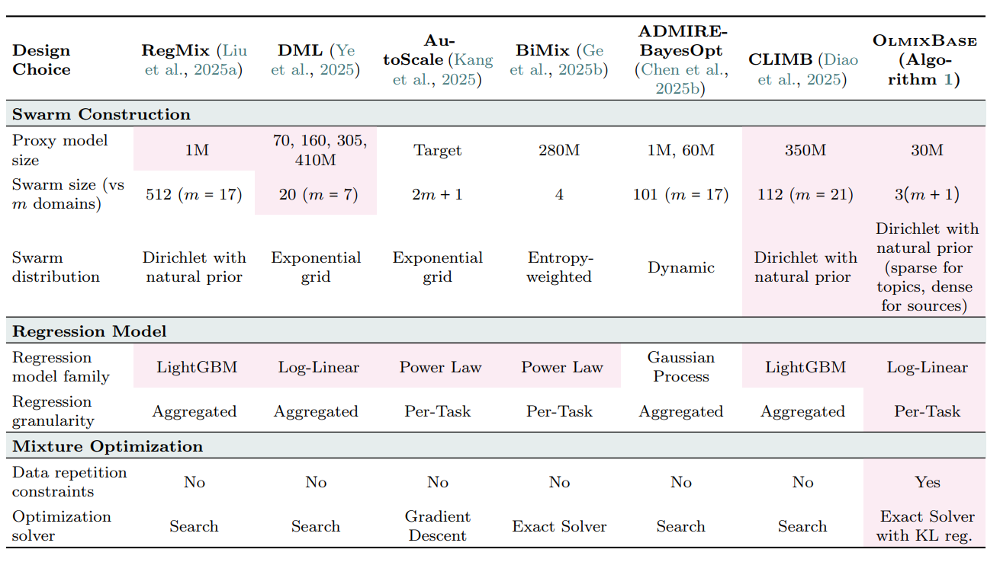
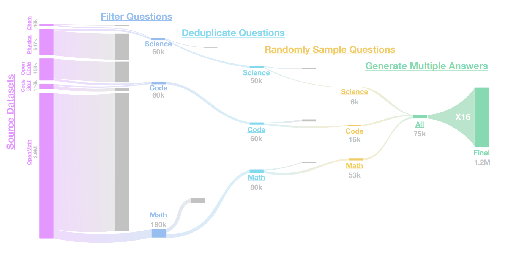
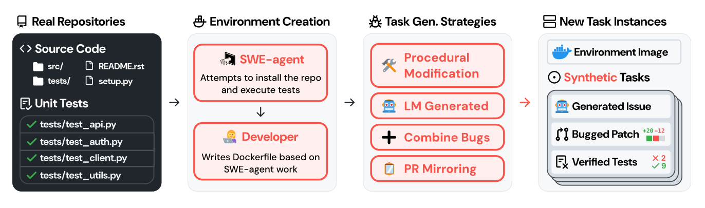
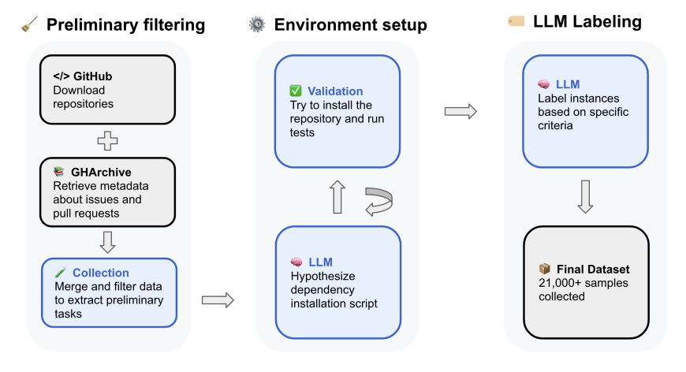

# Lecture 14: Data II (数据第二部分) 深度笔记

本笔记基于斯坦福 CS336 (Language Modeling from Scratch) 第十四讲的课堂内容整理。上一讲我们讨论了数据的来源、获取（网页抓取）以及版权与合规性；本节课将聚焦于**数据流水线（Data Pipeline）的四大核心步骤：转换（Transformation）、过滤（Filtering）、去重（Deduplication）和数据混合（Data Mixing）**，并进一步探讨**后期训练数据（Post-training Data）与合成数据（Synthetic Data）**的策展与应用。

> **课程信息**：CS336 · Spring 2026 · 主题：Data II (数据第二部分)

---

## Part 1: Data Pipeline - Transformation (数据清洗与转换)

原始数据并不会以规整的纯文本（Text）形式存在。它们通常是 HTML 网页、学术论文的 PDF（如 arXiv）或包含各种层级目录的代码仓库。在将它们输入给语言模型之前，必须将其转换为纯文本。

### 1. HTML 到文本（HTML to Text）
这是最常见的数据转换任务。
- **核心任务**：移除网页中的模板和噪点（Boilerplate），如导航栏（Navigation）、页脚、侧边广告等，并提取出核心的正文内容（Main Content）。
- **遇到的挑战**：
  - **表格与多媒体**：网页中的表格、图片说明和嵌入式内容该如何线性化（Linearize）成一段连贯的文本？
  - **信息丢失**：HTML 到文本的转换本质上是**有损的（Lossy）**，在去除标签的同时，许多结构化信息（如标题层级、字体粗细、段落分区）也会丢失。
- **常用工具（基于规则/启发式）**：`trafilatura`、`resiliparse`、`jusText`、`lynx` 等。
- **转换质量的重要性**：根据 [DCLM 2024](https://arxiv.org/abs/2406.11794) 的研究，数据提取转换的精确度对模型后续的预训练困惑度（Perplexity）有决定性影响。下图对比了不同 HTML 提取工具的有效性：



### 2. PDF 到文本（以 FinePDFs 为例）
PDF 是互联网上高质量学术和技术文献的主要载体，但 PDF 的格式极其混乱，直接提取文本极易产生乱码或段落拼接错误。
Hugging Face 团队在 [FinePDFs 博客](https://huggingface.co/spaces/HuggingFaceFW/FinePDFsBlog)中分享了他们的 PDF 数据处理方案：


- **重新抓取截断的 PDF**：Common Crawl 对单文件大小有硬性限制，这导致很多大体积的 PDF 被截断。FinePDFs 的第一步是识别并重新完整抓取这些 PDF。
- **OCR 识别与提取**：使用视觉语言模型（VLM）进行光学字符识别（如 RomOCR）或使用专业的 PDF 解析工具（如 Docling）。这些工具不仅要识别文字，还必须运行得足够快以处理海量数据。
- **深度清理与过滤**：PDF 转换后会存在大量的页眉、页脚、公式乱码和重复图表说明，需要设计大量的规则和模型进行清理。
- **痛点**：即便使用最先进的方案，转换后依然会丢失大量的排版、布局与视觉空间信息。

---

## Part 2: Data Pipeline - Filtering (数据过滤与质量控制)

### 1. 过滤算法的通用框架
数据过滤的核心算法任务是：给定一些**目标数据（Target Data）$T$**（即我们希望模型学到的“高质量、理想数据样例”）和大量的**原始数据（Raw Data） $R$**，从中找出与 $T$ 最相似的一个子集 $T'$。


- **核心应用场景**：
  1. **语言识别（Language Identification）**：例如，过滤出纯英文网页。
  2. **质量过滤（Quality Filtering）**：筛选高信息密度、表达流畅的内容，剔除垃圾网页。
  3. **毒性过滤（Toxicity Filtering）**：剔除暴力、色情、仇恨言论等有害内容。
- **对过滤算法的期望（Desiderata）**：
  - **泛化能力**：算法不仅要精确匹配 $T$，还要能从 $T$ 的特征中泛化，选出与 $T$ 语义相近但内容不同的 $T'$。
  - **极快的速度**：原始数据 $R$ 的体量往往在 PB 级别，过滤模型必须轻量、高效，能在大规模集群上并行处理。
  - **参考资料**：更多数据选择方法可参阅 [数据选择调查论文](https://arxiv.org/abs/2402.16827)。

- **分类器的两大基本范式**：
  1. **生成式模型评分（如 KenLM）**：在目标数据 $T$ 上训练一个 $N$-gram 语言模型，对原始网页 $x$ 计算困惑度或概率：
     $$\text{score}(x) = p_T(x)$$
  2. **判别式分类器评分（如 fastText）**：利用浅层神经网络或线性模型，预测样本属于目标数据集的概率：
     $$\text{score}(x) = p(T \mid x)$$
  
  **使用方法**：通常设定一个阈值（Threshold），仅保留 $\text{score}(x) \ge \text{threshold}$ 的网页，或根据分数进行随机采样。

### 2. 主流模型的过滤策略
历史上，关于是否在预训练中采用模型进行过滤，存在两种流派：
* **无模型过滤派（仅使用规则/Heuristics）**：如 C4、Gopher、RefinedWeb、FineWeb、Dolma。他们担忧模型过滤会引入算法偏见，或误杀具有潜在价值的边缘数据。
* **模型过滤派（目前已成为行业主流趋势）**：如 GPT-3、LLaMA、DCLM。

#### **A. 语言识别 (Language Identification)**
* **fastText**：Meta 开源的高效多语言分类器（支持 176 种语言），训练数据来自 Wikipedia、Tatoeba（翻译网站）和 SETimes（新闻网）。
* **Dolma 做法**：仅保留满足 $p(\text{English}) \ge 0.5$ 的网页。

#### **B. 数学文本过滤 (OpenMathText)**
* **目标**：从 Common Crawl 中筛选出大规模的高质量数学相关文本。
* **过滤手段**：
  1. **规则过滤**：提取包含 LaTeX 数学命令的网页。
  2. **KenLM 模型评分**：在 ProofPile（高质量数学文献库）上训练 KenLM 模型，仅保留 Perplexity < 15000 的网页。
  3. **fastText 二分类模型**：训练 fastText 区分数学与非数学网页，若预测属于数学的概率 $\ge 0.17$，或者不包含数学但质量评分 $\ge 0.8$，则予以保留。
* **效果**：用清洗出的 14.7B Token 训练的 1.4B 模型，性能超越了在 20 倍未清洗数据上训练的模型。

#### **C. GPT-3 的分类器过滤**
* **正样本 $T$**：Wikipedia, WebText2, Books1, Books2。
* **负样本**：原始 Common Crawl。
* **方法**：使用单词特征训练一个 Spark 逻辑回归（Logistic Regression）分类器。为了防止模型过度拟合特定主题，GPT-3 没有采用硬阈值截断，而是使用 Pareto 分布进行了**随机保留（Stochastic Keeping）**：
  ```python
  def keep_document(score: float) -> bool:
      # score 为分类器输出的高质量概率
      return np.random.pareto(9) > 1 - score
  ```

#### **D. LLaMA / RedPajama**
* **正样本 $T$**：Wikipedia 页面中引用的外部网页（被 Wikipedia 引用说明其内容具有一定的事实可信度）。
* **负样本**：随机 Common Crawl 网页。
* **方法**：训练二分类器，仅保留分类为正样本的网页。

#### **E. phi-1 的教育价值过滤 (Educational Value)**
* **哲学**：用极高质量的“教科书级数据（Textbooks）”来训练小模型（1.5B 参数）。
* **方法**：
  1. 原始数据 $R$ 为 The Stack 的 Python 代码子集。
  2. 使用 GPT-4 对其中的 100K 样本进行打分，提示词为：*“评估该代码段对于一个旨在学习基本编程概念的学生的教育价值（educational value）”*。获得高质量正样本 $T$。
  3. 使用预训练的代码生成模型的输出嵌入（Output Embedding）作为特征，训练一个轻量级的**随机森林分类器（Random Forest Classifier）**。
  4. 使用该随机森林分类器在整个 $R$ 上进行预测，仅保留分类为正的样本。
* **效果对比**：
  - 在未过滤的 The Stack 子集上训练，1.3B 模型在 HumanEval 上准确率为 **12.19%**（训练了 96K 步）。
  - 在过滤后的高质量教科书数据集上训练，准确率暴涨至 **17.68%**（仅训练了 36K 步）。

#### **F. 毒性过滤 (Toxicity Filtering in Dolma)**
* **训练数据**：Jigsaw 有毒评论数据集，包含维基百科讨论页中被人工标注为 `{toxic, severe_toxic, obscene, threat, insult, identity_hate}` 的评论。
* 训练毒性分类器，将高毒性的网页直接剔除。

### 3. 过滤的规模效应（Scale-Dependent Effects）
研究表明，数据的过滤阈值与模型的训练预算（Compute Budget）密切相关。**并不存在一个单一的最优过滤阈值。**

- **训练时间短 / 算力低**：模型无法看太多 Token，此时应该使用**高阈值**，只喂给模型最优质的黄金数据。
- **训练时间长 / 算力高**：优质数据会被模型很快“吃完”，此时为了防止模型对干净数据反复迭代导致过拟合，需要**降低阈值**，引入更多低质量但规模更大的数据。


---

## Part 3: Data Pipeline - Deduplication (数据去重)

### 1. 为什么要进行数据去重？
预训练语料中存在大量重复数据：
- **精确重复（Exact Duplicates）**：镜像网站（Mirror Sites）、GitHub 的 Fork 分支等。
- **近似重复（Near Duplicates）**：仅有少量 Token 不同的文本（如带不同版本号的 MIT 许可证、模板生成的商品描述、不同的空格与换行符）。

> **💡 典型案例**：在 C4 数据集中，下面这段废话被重复了 **61,036** 次：
> *“by combining fantastic ideas, interesting arrangements, and follow the current trends in the field of that make you more inspired and give artistic touches. We’d be honored if you can apply some or all of these design in your wedding. believe me, brilliant ideas would be perfect if it can be applied in real and make the people around you amazed!”*

#### **去重的好处**：
1. **提升训练效率**：去除多余的 Token，把有限的算力用在学习新知识上。
2. **缓解记忆与版权争议**：模型不易死记硬背特定的受版权保护段落或用户隐私数据（PII）。

### 2. 精确去重（Exact Deduplication）
精确去重是指对整段字符串计算哈希，将具有完全相同哈希的项去除。

```python
import itertools
import mmh3

# 原始数据项
items = ["Hello!", "hello", "hello there", "hello", "hi", "bye"]

# 计算 MurmurHash 并排序分组
hash_items = itertools.groupby(sorted(items, key=mmh3.hash), key=mmh3.hash)

# 每一组仅保留第一个元素，实现去重
deduped_items = [next(group) for h, group in hash_items]
# 结果: ['Hello!', 'hello', 'hello there', 'hi', 'bye']
```

- **优点**：简单，并行性极佳（适合 MapReduce 架构），精度高。
- **缺点**：对近似重复（如大小写、标点差异）无能为力。
- **C4 做法**：如果任意一个包含 3 个句子的片段（3-sentence span）在其他地方精确出现过，就将该段删除。
  > **⚠️ 警告**：直接在文档中间挖掉一个 3 句段落，会导致文档上下文断联、逻辑崩塌，进而损害模型长文本的学习。

### 3. 近似去重（Fuzzy Deduplication）

#### **A. 杰卡德相似度 (Jaccard Similarity)**
评估两个集合 $A$ 和 $B$ 相似度的经典指标：
$$\text{Jaccard}(A, B) = \frac{|A \cap B|}{|A \cup B|}$$
当两个文档的词袋（或 $N$-gram）集合的 Jaccard 相似度高于设定的阈值时，我们定义它们为**近似重复**。

#### **B. MinHash 算法**
在海量网页下，两两计算 Jaccard 相似度的复杂度是 $O(N^2)$，这在工程上是不可接受的。我们需要一种在 $O(N)$ 线性时间内匹配近似网页的算法。

**MinHash 核心原理**：设计一个随机哈希函数 $h$，使得两个集合的哈希值碰撞概率**恰好等于**它们的 Jaccard 相似度：
$$\Pr[h(A) = h(B)] = \text{Jaccard}(A, B)$$
- **哈希函数设计**：
  对于集合 $S$，我们用不同的随机种子生成哈希函数，并取其中的最小值：
  ```python
  def minhash(S: set[str], seed: int) -> int:
      return min(mmh3.hash(x, seed) for x in S)
  ```
- **特征矩阵表示**：
  哈希函数相当于对所有词项（Items）做了一次随机置换（Permutation），集合中哈希值最小的词项排在最前。如果两个集合的 Jaccard 相似度高，置换后它们的首位元素相同的概率也大。

#### **C. 局部敏感哈希 (Locality Sensitive Hashing, LSH)**
我们拥有了 MinHash 来估算 Jaccard 相似度，但为了找到高相似度样本，我们依然需要进行判定。LSH 的目的是：**只对那些极有可能相似的网页计算 MinHash，过滤掉绝对不相似的网页**。

- **LSH 的分桶与“与-或（And-Or）”结构**：
  1. 生成 $n$ 个不同的 MinHash 函数（例如 $n = 12$）。
  2. 将这 $n$ 个哈希值分为 $b$ 个带（Bands），每个带包含 $r$ 个哈希值（即 $n = b \times r$，如 $b = 3, r = 4$）。
  3. **碰撞判定**：当且仅当两个文档在**某一个特定的带（Band）**上，其所包含的 **$r$ 个哈希值全部一致**时，这两个文档才会被分入同一个桶（Bucket）并被判定为相似候选。

$$\text{Band 内部完全匹配的概率} = s^r \quad (\text{其中 } s = \text{Jaccard 相似度})$$
$$\text{至少有一个 Band 匹配（碰撞）的概率} = 1 - (1 - s^r)^b$$

- **S 曲线（S-curve）阈值控制**：
  这种“与-或”结构会产生一个极其陡峭的“S 曲线”。通过调整 $b$ 和 $r$，我们可以灵活控制相交点（阈值）的位置。
  - **增加 $r$**：要求带内匹配的哈希数量变多，曲线向右移动（匹配门槛变高，更难发生碰撞）。
  - **增加 $b$**：允许匹配的带的数量变多，曲线向左移动（匹配门槛变低，更容易碰撞）。

- **相变临界阈值公式**：
  $$\text{threshold} \approx \left(\frac{1}{b}\right)^{\frac{1}{r}}$$
  当 $s > \text{threshold}$ 时，碰撞概率迅速逼近 1；当 $s < \text{threshold}$ 时，碰撞概率迅速降为 0。

> **💡 行业实践案例**：
> 在经典的去重论文中，参数设置为 $n = 9000$ 个哈希函数，划分为 $b = 20$ 个带，每个带 $r = 450$ 个哈希值。
> 其临界相变阈值为：
> $$\text{threshold} = \left(\frac{1}{20}\right)^{\frac{1}{450}} \approx 0.9933$$
> 只要两个网页的相似度达到 $99.3\%$，它们就会以极高概率（$1 - (1 - \frac{1}{20})^{20} \approx 64\%$）被筛出来并去重。

---

## Part 4: Data Pipeline - Data Mixing (数据配比/混合)

大语言模型是由许多不同的数据源（Wikipedia、Common Crawl、GitHub 代码、学术论文等）混合训练而成的。**数据配比决定了模型的最终“人格”与各项能力的强弱**。


### 1. 传统基线方法
- **直觉经验派（Vibes）**：根据研究员的经验和直觉强行指定比例（早期非常常见）。
- **均匀采样（Uniform Sampling）**：给每个数据源相同的权重：
  $$p(s) \propto 1$$
- **等比例混合（Proportional Mixing）**：按照数据源本身的 Token 规模大小分配权重（大水漫灌）：
  $$p(s) \propto \text{num\_tokens}(s)$$

### 2. 核心瓶颈：小数据源的过拟合（Epoching Constraints）
高品质的数据源（如 Wikipedia、教科书）往往体积很小，而低品质的 Common Crawl 规模极其庞大。如果我们想让模型多学高质量数据（调高其权重 $p(s)$），会导致模型在小语料上被训练很多个轮次（Epochs）。

> **💡 极端计算案例**：
> 假设低质量数据有 10T Token，高质量数据仅有 10B Token（相差 1000 倍）。
> 我们采用 naive 配比，让它们各占 $50\%$ 的训练权重。
> 模型总训练量为 1T Token。此时：
> - 低质量数据消耗：$500\text{B} / 10\text{T} = 0.05$ 轮（完全没有过拟合风险）。
> - 高质量数据消耗：$500\text{B} / 10\text{B} = 50$ 轮！
> **过高的训练轮数（Epochs）会导致模型在高质量数据上严重过拟合，死记硬背细节，丧失泛化能力。**

#### **UniMax 策略**
为了解决这一问题，DeepMind 提出了 UniMax 方案：
- 尽可能均匀地对各个源进行采样。
- 对每个数据源设置一个**最大训练轮数上限 $C$**（即同一个 Token 被看过的次数不能超过 $C$）。
- 当某个小数据源达到上限 $C$ 时，将其从采样池中剔除，剩余的算力分摊给其他未饱和的数据源。

### 3. 现代方法：基于回归的混合 (Regression-Based Mixing)
代表性方法为 **RegMix** 与 **OLMix**：



1. **小规模实验**：定义一个配比空间的分布（如狄利克雷分布 Dirichlet Distribution），采样几十种不同的数据配比配方，用它们分别训练一批极小参数的模型（如 1M-10M 参数）。
2. **拟合回归模型**：收集这些小模型在下游评估任务上的表现，使用回归模型（如线性回归、梯度提升树 GBDT）拟合从“数据配比 $p$”到“下游指标/Loss”的映射关系。
3. **寻找最优解**：通过回归模型预测并优化，找出最优的数据配比配方。



#### **不可忽视的尺度效应：模拟迭代（Simulated Epoching）**
我们希望从小模型实验上得到的“最优配比”能够直接迁移给大模型。但这里存在一个关键的**尺度相关效应**：
- 在小模型（训练 Token 少，如 10B）实验中，高权重配比不会导致高质量小语料过拟合。
- 但在大模型（训练 Token 多，如 1T）上运行相同配比时，小语料就会发生 50 次 Epoching 导致崩溃。

**解决方案：模拟迭代（Simulated Epoching）**
在运行小模型实验时，**等比例缩放（下采样）所有数据源的实际大小**：
$$\text{ratio} = \frac{\text{Small Run Tokens}}{\text{Large Run Tokens}}$$
$$\text{downsampled\_source\_size} = \text{original\_size} \times \text{ratio}$$
在小模型实验中，小语料在极低的 Token 下就会提早触发 Epoching，让小模型暴露过拟合的劣势。这样，回归模型学出来的最优配比就会自然向大模型对齐，避免在大模型训练中出现过拟合。

---

## Part 5: Post-Training & Synthetic Data (后期训练与合成数据)

在预训练阶段结束后，我们需要教模型学会如何对话、如何使用工具。现代大模型极其依赖**合成数据（Synthetic Data）**。

### 1. 合成数据通用配方
1. **定义环境（Environments）**：如物理沙盒、代码执行环境、编译器。
2. **定义任务/提示词（Tasks/Prompts）**：设计各种各样的用户提问模板。
3. **强模型生成（Teacher Rollout）**：让当前最先进的大模型（如 Qwen3-Coder, GPT-4）扮演老师，为任务生成详细的解答、思路和代码。

### 2. 经典合成数据集与流水线

#### **A. OpenThoughts (思维链数据)**
- **数据量**：使用 QwQ-32B 强推理模型作为 Teacher，生成了 1.2M 思考轨迹数据。
- **任务来源**：融合了 27 个真实和合成数据源（包括 StackExchange、NuminaMath 数学库、化学问答等）。


- **核心结论**：
  1. **多路采样**：针对每一个问题生成 16 个不同的回答（Sampling paths）并保留，对模型训练极有帮助。
  2. **老师并非越强越好**：在生成数据时，专注于推理的 QwQ-32B 产出的思维链，比体量更大但通用性强的 DeepSeek-R1 更适合作为微调教师。
  3. **源的质量重于数量**：精简、高质的垂直数据源（如 OpenMath-2-Math）效果显著优于庞大杂乱的通用数据源。



#### **B. SWE-smith (软件工程合成 Bug 库)**
- 针对真实的代码仓库，用模型自动生成引入了特定 bug 的任务，共在 128 个 GitHub 仓库中伪造了 50K 个软件修复任务。



#### **C. SWE-Zero 与 SWE-Hero**
软件工程（SWE）任务的微调极难处理，核心痛点在于：**为几万个复杂的真实代码仓库搭建运行和测试环境（Docker 镜像）是一场可怕的工程噩梦。**
- **SWE-Zero 核心观察**：极其强大的模型（拥有良好的“代码语义世界模型”）在没有测试和运行反馈的辅助下，也能正确修复大量 Bug。


- **SWE-Zero**：利用强模型（Qwen3-Coder-480B）蒸馏出 300K 个**无需在环境中实际执行**的 Agent 解决轨迹（包含 150K 个 GitHub PR 记录）。为了防止 Agent 在轨迹中通过 `git checkout` 或 `git commit` 直接作弊获取正确答案，必须清理其运行元数据。
- **SWE-Hero**：筛选出 13K 个**必须依赖运行反馈（Execution Feedback）**才能闭环解决的复杂交互式开发轨迹。


- **SWE-rebench**：包含从 3.4K 个 GitHub 仓库中抽取的 21K 个交互式 Python 软件开发任务，使用 Qwen 2.5-72B-Instruct 自动配置环境并检验 PR 质量。



- **SWE-ZERO-12M-trajectories**：将 SWE-Zero 方案扩大到 12M 个 Agent 运行轨迹，使用的是非常轻量的 mini-coder-1.7b 模型和 mini-swe-agent 框架进行自主生成。

---

## Part 6: Summary (总结)

1. **转换（Transformation）**：HTML、PDF、LaTeX 源码等向纯文本的抽取转换是有损的，抽取工具的质量是数据流的第一关。
2. **过滤（Filtering）**：模型级过滤（如 fastText、教育价值分类器）正逐渐替代传统的手工规则限制。过滤阈值需要随着算力和参数规模的增大而调低。
3. **去重（Deduplication）**：近似去重是解决复读机记忆的关键。MinHash 和 LSH 能够在 $O(N)$ 时间内完成海量数据的相似度分桶。
4. **混合（Mixing）**：数据配比直接决定模型下游能力。可以通过小模型 RegMix 实验来寻找最优解，但必须使用“模拟迭代”防止小模型实验避开大模型预训练的过拟合惩罚。
5. **后期合成（Post-Training Synthetic Data）**：从 OpenThoughts 到 SWE-Zero，利用大模型的推理世界模型低成本、大规模生成长思维链与复杂的软件交互开发轨迹，是未来提升 AI 专业场景解决能力的主要路径。
