# Lecture 16: RL from Verifiable Rewards (基于可验证奖励的强化学习) 深度笔记

本笔记基于斯坦福 CS336 (Language Modeling from Scratch) 第十六讲的课堂内容整理。在前一讲讨论了监督微调（SFT）和基于人类反馈的强化学习（RLHF）后，本讲将深入探讨强化学习在大语言模型对齐与推理能力提升中的核心演进，特别是如何利用**可验证奖励（Verifiable Rewards）**进行大规模强化学习（RLVR），从而迈向类似 OpenAI o1 和 DeepSeek-R1 的推理模型。

> **课程信息**：CS336 · Spring 2026 · 主题：Post-Training 2: Reinforcement Learning from Verifiable Rewards (RLVR)

---

# Part 1: 从 PPO 到 GRPO：算法演进与数学原理

本部分聚焦于策略梯度算法的演进路径，从传统的 PPO（近端策略优化）到为了解决大模型显存瓶颈与训练不稳定性而设计的 GRPO（群组相对策略优化），并探讨其在梯度偏置与长度惩罚上的最新理论改进。

---

## Slide 1

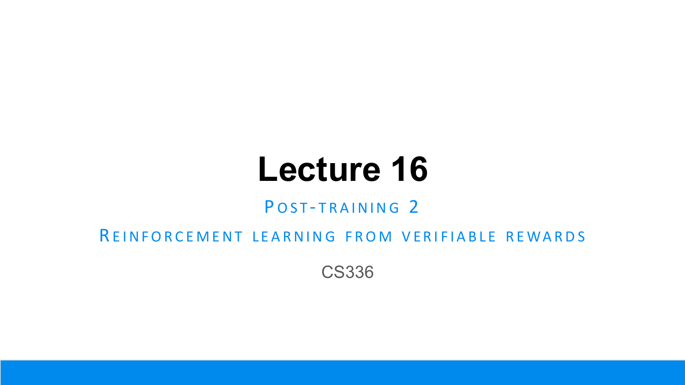

### 讲解

本讲是斯坦福 CS336 课程的第十六讲，也是后期训练（Post-Training）的第二部分。主题为 **Reinforcement Learning from Verifiable Rewards（基于可验证奖励的强化学习，简称 RLVR）**。

在上一讲中，我们学习了如何通过 SFT 调整模型语气，以及如何通过传统的人类偏好对齐（RLHF）来训练奖励模型（RM）。本讲将在此基础上，探讨如何将强化学习推向更硬核的领域——即数学、编程等拥有客观、可自动验证对错的规则领域。

---

## Slide 2

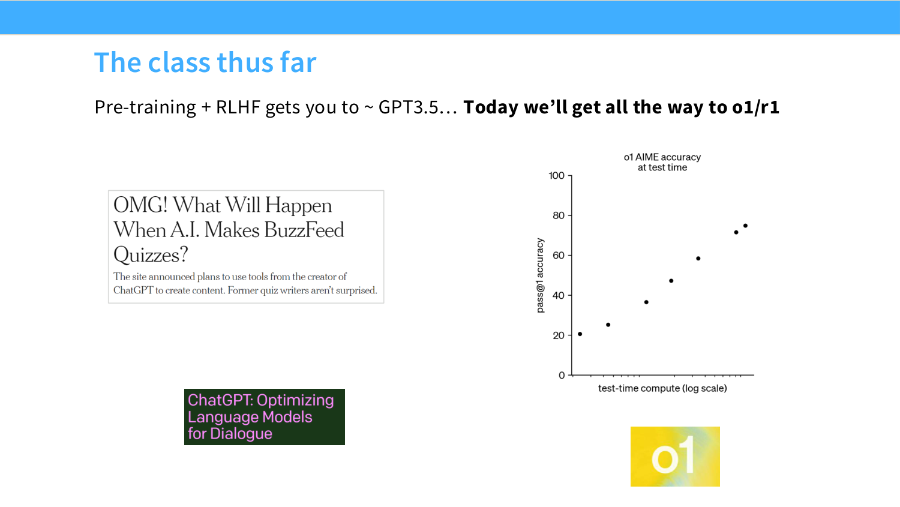

### 讲解

本页展示了本课程的学习进度脉络（The class thus far）。
- **预训练（Pre-training）**：赋予模型以高表达能力预测下一个 Token 的概率。
- **对齐（Alignment / SFT + RLHF）**：使模型能遵循人类指令，这能让模型达到约 **GPT-3.5** 的水平。
- **基于可验证奖励的 RL (RLVR)**：今天我们将深入探讨如何在此基础上，通过强化学习进行长链条思维（Long Chain-of-Thought, CoT）的自主探索，最终达到类似 **OpenAI o1** 和 **DeepSeek-R1** 的前沿推理模型高度。

---

## Slide 3

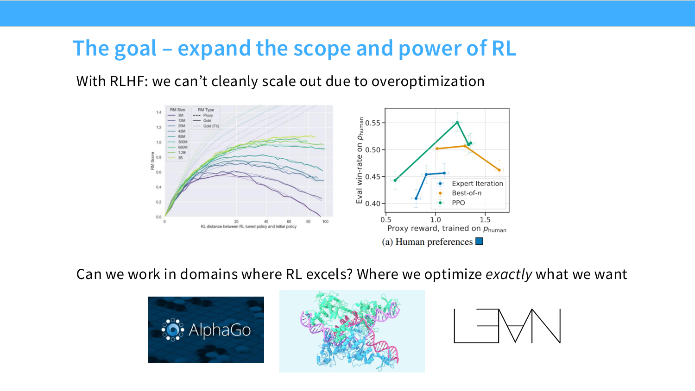

### 讲解

本页明确了本节课的核心技术动机——**扩展强化学习的范围与能力（Expand the scope and power of RL）**。
- **RLHF 的瓶颈**：在人类反馈（或奖励模型 RM）的对齐框架中，我们无法无限制地通过 RL 进行性能提升。由于奖励模型本身只是人类偏好的神经网络近似，RL 训练后期极易发生**过度优化（Overoptimization / Goodhart's Law）**，即模型通过制造表面上的废话或作弊技巧来刷高奖励值，而模型的真实表现不升反降。
- **可验证领域（Verifiable Domains）的优势**：我们能否转向 RL 最擅长的“硬”领域？例如数学计算（答案对错是确定的）、编程测试（是否通过 unit tests 是可客观验证的）。在这些领域中，奖励是客观真理（Ground-truth），我们优化什么就得到什么，完全没有过度优化的副作用，这为 RL 的大规模计算缩放（Compute Scaling）提供了基础。

---

## Slide 4

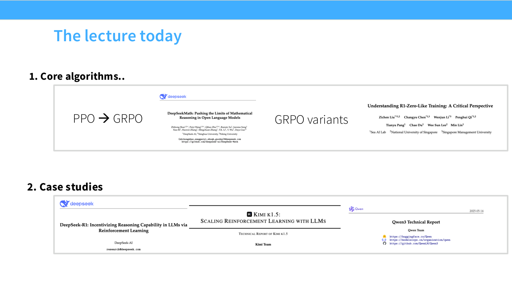

### 讲解

本页展示了本节课的内容大纲：
1. **核心算法演进（Core algorithms）**：从近端策略优化（PPO）到群组相对策略优化（GRPO），以及 GRPO 在理论上的数学偏置修正（如 RLOO、Dr. GRPO）。
2. **工业界案例研究（Case studies）**：
   - **DeepSeek-R1**：如何通过纯 RLVR（R1-Zero）以及多阶段 SFT+RL（R1）实现强大的推理性能。
   - **Kimi K1.5**：如何使用 Online Mirror Descent (OMD) 以及长度惩罚实现长上下文 RL。
   - **Qwen 3**：小样本 RLVR 配合思考模式融合（Thinking Mode Fusion）的最新范式，以及智能体强化学习（Agentic RL）。

---

## Slide 5

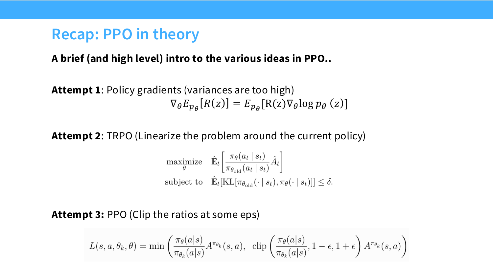

### 讲解

本页回顾了**策略梯度（Policy Gradient, PG）**在理论上的演进路径。
- **尝试 1：经典策略梯度（REINFORCE）**：
  ```math
  \nabla_\theta \mathbb{E}_{z \sim p_\theta}[R(z)] = \mathbb{E}_{z \sim p_\theta} \left[ R(z) \nabla_\theta \log p_\theta(z) \right]
  ```
  其核心直觉是，如果一个动作（生成轨迹 $`z`$）得到了高奖励 $`R(z)`$，我们就增大该动作在当前策略 $`\theta`$ 下的概率。然而，因为 $`R(z)`$ 是在完整的 Token 序列生成完毕后才获得的，且采样空间极大，这会导致**梯度估计的方差极大**，训练难以收敛。
- **尝试 2：信任区域策略优化（TRPO）**：
  为了限制策略更新的步长，TRPO 引入了 Kullback-Leibler (KL) 散度作为约束，在当前策略附近对目标进行线性化。这保证了策略更新的稳定性，但由于需要计算复杂的 Fisher 信息矩阵（Hessian 矩阵的逆），计算成本过高。
- **尝试 3：近端策略优化（PPO）**：
  OpenAI 在 2017 年提出的替代方案，通过将新旧策略的概率比率限制在 $`[1-\epsilon, 1+\epsilon]`$ 的区间（Clipped Surrogate Objective），避免了 TRPO 复杂的二阶导数计算，在工程上取得了巨大成功。

---

## Slide 6

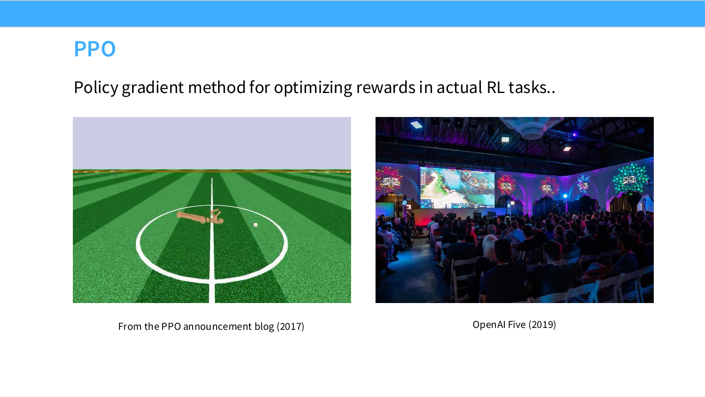

### 讲解

这一页展示了 **PPO 的历史定位与实际应用案例**。
PPO 是目前策略梯度方法中应用最广的基石。
- 2017 年，OpenAI 首次发布 PPO 博客，将其作为机器人在复杂物理模拟中训练的通用策略算法。
- 2019 年，OpenAI 使用 PPO 算法训练出 **OpenAI Five**，在《Dota 2》中击败了人类世界冠军团队，证明了其在极高动作空间、长记忆与稀疏奖励下的惊人威力。

---

## Slide 7

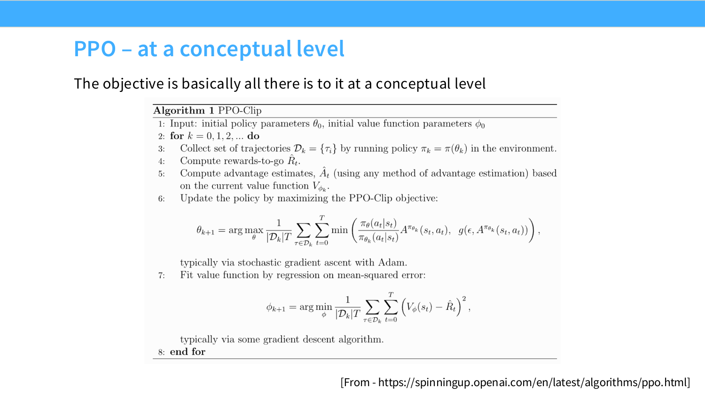

### 讲解

本页指出，从概念上讲，PPO 的核心在其**剪切代理目标函数（Clipped Surrogate Objective）**：
- 定义概率比率 $`r_t(\theta) = \frac{\pi_\theta(a_t \mid s_t)}{\pi_{\theta_{old}}(a_t \mid s_t)}`$。
- 目标函数为：
  ```math
  L^{CLIP}(\theta) = \hat{\mathbb{E}}_t \left[ \min\left(r_t(\theta)\hat{A}_t, \text{clip}(r_t(\theta), 1-\epsilon, 1+\epsilon)\hat{A}_t\right) \right]
  ```
  - 当优势 $`\hat{A}_t > 0`$（说明该动作好于基线）时，我们增加概率比率，但当比率超过 $`1+\epsilon`$ 时被 Clipped，限制过大的正向更新。
  - 当优势 $`\hat{A}_t < 0`$（动作差于基线）时，我们降低概率比率，当比率低于 $`1-\epsilon`$ 时被 Clipped。
  这确保了参数更新被限制在一个可信赖的微调区域（Trust Region）内。

---

## Slide 8

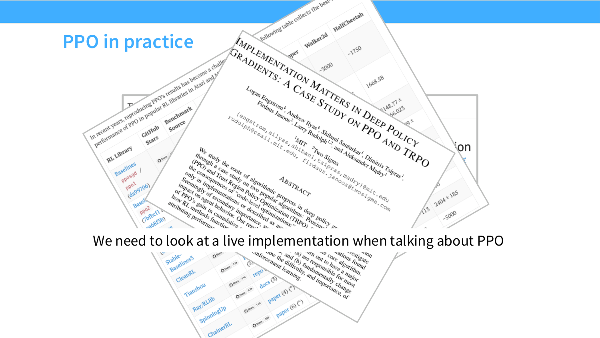

### 讲解

本页提到：“如果你看到有这样的博客文章，你就知道你要面对一段痛苦的经历”（指博客 *“The 37 Implementation Details of PPO”*）。
- **核心启示**：在理论上，PPO 只有简简单单的公式；但在**工程实践中**，PPO 包含了极多难以调试的暗黑细节（如 Advantage 归一化、学习率退火、正交权重初始化、梯度裁剪、Value 损失裁剪等）。如果在将 PPO 移植到 LLM 训练时没有完美复现这几十个细节，模型极易发散。

---

## Slide 9

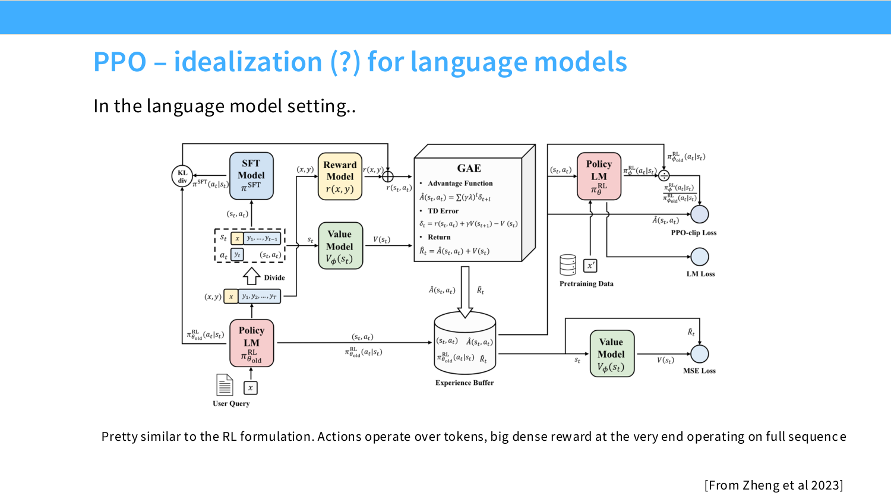

### 讲解

本页探讨了 **PPO 在大语言模型（LLM）环境下的理想化公式建模**。
- 在 LLM 对齐中：
  - **动作（Action）**：模型生成的每个 Token。
  - **状态（State）**：已生成的 Prompt + Context。
  - **奖励（Reward）**：通常是在生成完毕后，针对整段 Response 计算的一个大而稠密的标量（来自奖励模型 RM 或可验证的单元测试）。
- 这种建模在形式上虽然完美对应了马尔可夫决策过程（MDP），但本质上它更像是一个**长序列的 Bandits（多臂老虎机）问题**。

---

## Slide 10

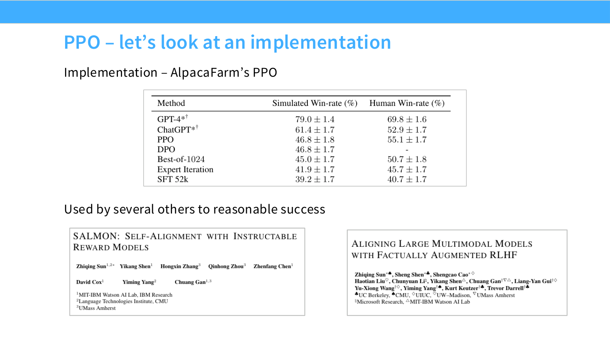

### 讲解

本页引导我们通过具体代码实现来理解 PPO 的落地。主讲人推荐了 **AlpacaFarm 的 PPO 实现**。
AlpacaFarm 是斯坦福大学发布的一套针对人类偏好对齐的模拟评估与训练框架，其代码实现非常标准，被学术界和很多开源项目直接复用。

---

## Slide 11

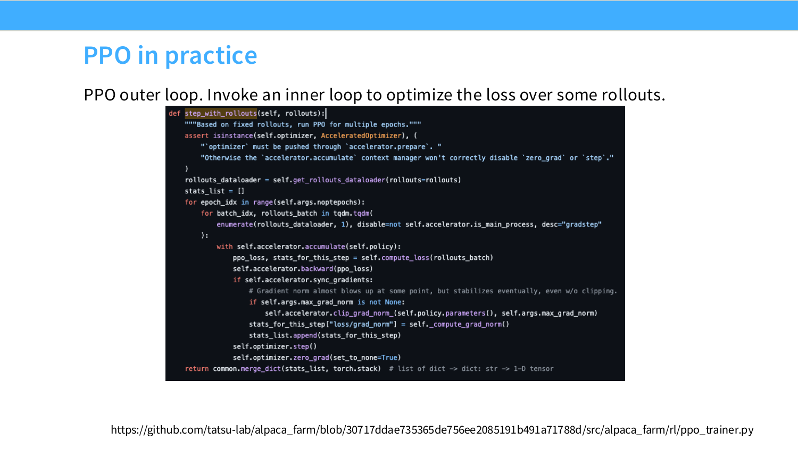

### 讲解

本页指向了 AlpacaFarm 代码库中 PPO 训练器的外层循环（Outer Loop）。
PPO 训练是一个两阶段交替过程：
1. **Rollout 采样阶段**：当前策略网络 $`\pi_\theta`$ 在给定的 Prompt 下进行文本生成，记录下动作 log-probabilities，并使用 Reward Model 给出得分。
2. **Inner Loop 优化阶段**：利用采样的样本计算 PPO Clipped Loss 和 Value Loss，通过多轮迭代梯度更新（Epochs）来更新策略参数。

---

## Slide 12

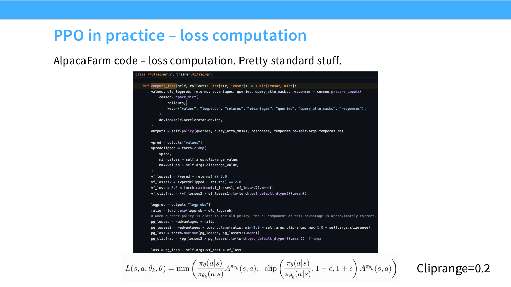

### 讲解

本页分析了 AlpacaFarm 中 PPO 的**损失计算（Loss Computation）**代码实现：
- 在代码中，Clip range $`\epsilon`$ 设定为 `0.2`。
- 同时计算 Policy Loss 与 Value Loss：
  - `policy_loss`：计算 $`r_t(\theta) A_t`$ 与其 Clipped 版本在 $`\pm 0.2`$ 之间的最小值。
  - `value_loss`：用于更新 Critic 价值网络，使其能够更准确地预测每个状态的期望收益（Baseline）。

---

## Slide 13

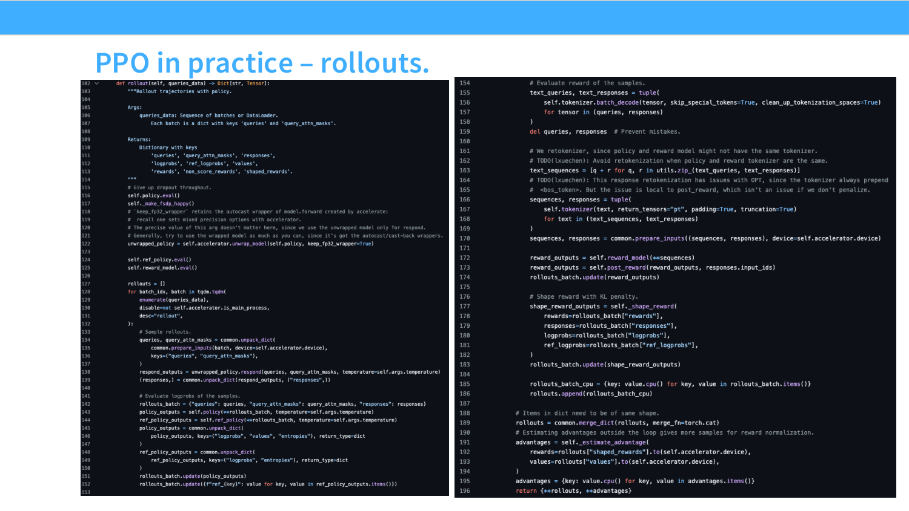

### 讲解

本页展示了 **Rollout（采样阶段）** 的多模型组织架构。
在标准的 PPO 语言模型训练中，为了稳定训练，内存中通常需要同时加载四个模型：
1. **Policy (策略网络, $`\pi_\theta`$)**：需要训练的活跃模型，用于采样动作并更新参数。
2. **Reference (参考网络, $`\pi_{ref}`$)**：冻结参数的基座模型（如 SFT 模型），用于计算 KL 惩罚，防止策略偏离太远。
3. **Value (价值网络/评分网络, $`V`$)**：用于预测当前中间状态的 Value 值，计算优势 Advantage。
4. **Reward (奖励网络, $`RM`$)**：用于对最终生成的 Completion 进行打分。
> [!WARNING]
> **显存灾难**：在分布式训练中，这四个模型会占用极其庞大的 GPU 显存。如果要训练 70B 的模型，四模型并行会给整个分布式架构（如 FSDP/Megatron）带来毁灭性的内存与显卡存活压力。

---

## Slide 14

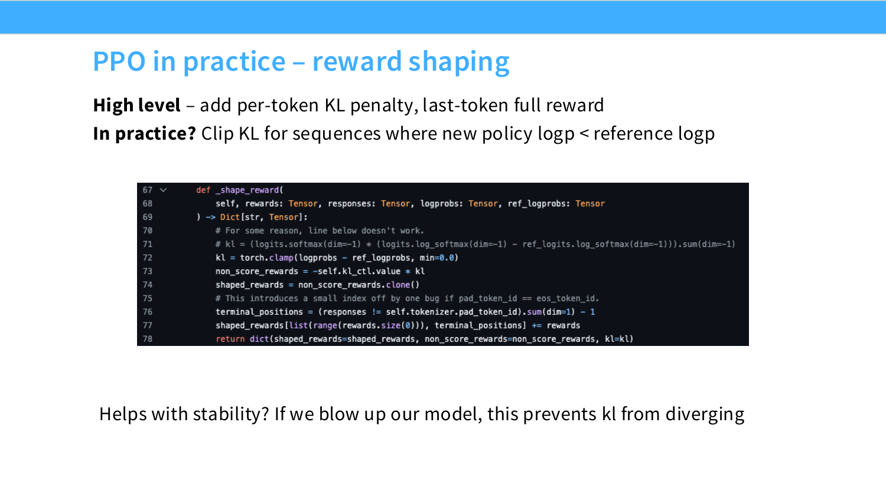

### 讲解

本页深入讲解了**奖励塑造（Reward Shaping）与 KL 剪切（KL Clipping）**的工程细节。
- **逐 Token KL 惩罚**：为了防止模型走向“Goodhart 陷阱”（刷高 RM 评分但失去逻辑），我们在最终奖励中混入策略网络与参考网络之间的 KL 散度：
  ```math
  \text{Adjusted Reward} = R(x, y) - \beta \sum_{t} \left( \log \pi_\theta(y_t \mid x, y_{<t}) - \log \pi_{ref}(y_t \mid x, y_{<t}) \right)
  ```
- **KL Clipping 实践**：在 AlpacaFarm 等实操中，当 $`\log \pi_\theta(y_t) < \log \pi_{ref}(y_t)`$ 时（即新策略相比参考网络而言，分配给这个 Token 的概率更小），我们会选择剪切（Clip）这个 KL 惩罚值。
  - **直觉**：这能极大地提升训练稳定性。如果模型因为某些突变概率暴跌，Clipped KL 可以防止 KL 惩罚值发散至无穷大，从而避免训练崩溃。

---

## Slide 15

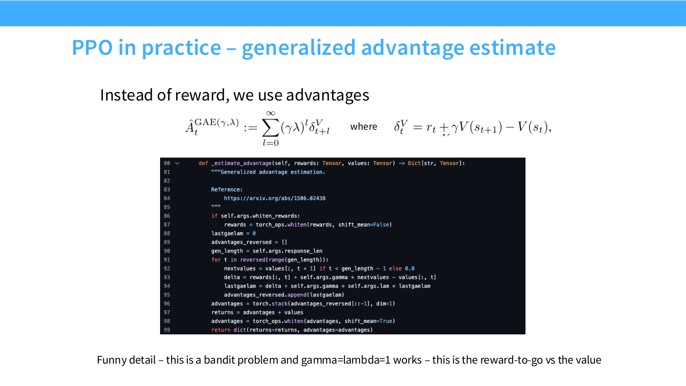

### 讲解

本页详细剖析了**广义优势估计（Generalized Advantage Estimate, GAE）**的应用。
- 传统的 GAE 依靠超参数 $`\gamma`$（折扣因子）和 $`\lambda`$（偏差-方差折中因子）来平滑优势计算。
- **有趣的行业事实**：在 LLM 的 Bandit 设定（单步大决策）中，我们通常将 $`\gamma = 1.0`$ 和 $`\lambda = 1.0`$。
  - 此时，优势计算简化为了：
    ```math
    A_t = G_t - V(s_t)
    ```
    其中 $`G_t`$ 是从当前时刻到生成结束的总回报（Reward-to-go），而 $`V(s_t)`$ 是由价值网络（Critic）评估的当前基线期望。

---

## Slide 16

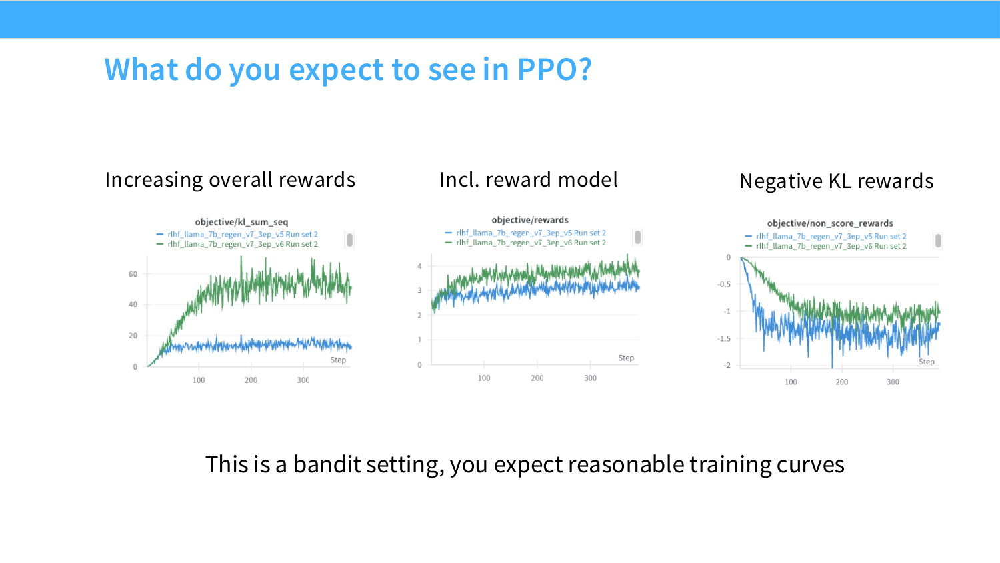

### 讲解

本页展示了在调试 PPO 时，**健康且理想的训练曲线**应当呈现的形态：
1. **总体奖励（Overall Rewards）**：稳步攀升。
2. **奖励模型（Reward Model Score）**：呈明显的对数或线性上升态势。
3. **KL 奖励分（Negative KL Rewards）**：伴随策略的探索，新旧模型差异加大，KL 散度值应稳步变大（负 KL 奖励应温和下降，但不应暴跌）。
如果观察到这几条曲线同步且平滑，则说明 PPO 运行在健康的参数区间。

---

## Slide 17

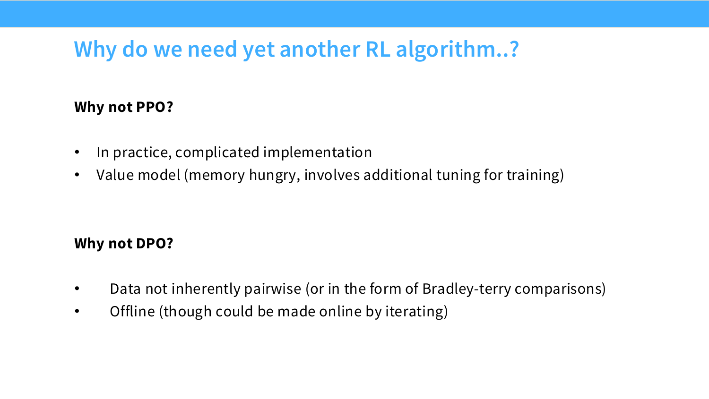

### 讲解

既然 PPO 如此成功，为什么我们还需要寻找新的算法？
- **为什么不用 PPO？**
  1. **极其复杂的系统实现**：多达 37 个工程细节，调参工作如同“玄学”。
  2. **价值模型（Value Network）极其消耗资源**：不仅占据大模型 1/4 的显存空间，而且对于变长的自然语言，训练一个准确估计中途价值的 Critic 模型本身在数值上极度困难且不稳定。
- **为什么不用 DPO？**
  1. DPO 是一种**离线（Offline）**算法，它强假设数据必须是成对的偏好（如 A 比 B 好）。
  2. 在数学、编程等**可验证奖励**场景中，我们只关心模型给出的代码是否正确，这是一个非成对、支持在线探索的场景，无法直接以经典的 Bradley-Terry 对比偏好模型（DPO 的数学基石）来建模。

---

## Slide 18

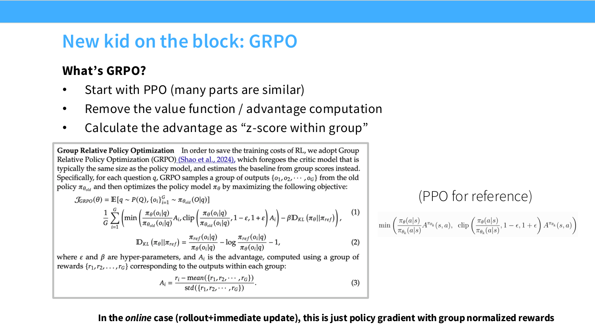

### 讲解

本页正式介绍了**大模型强化学习的新星：GRPO（群组相对策略优化）**。
GRPO 是 DeepSeek 团队在其 DeepSeekMath (2024) 论文中提出的创新算法。
- **核心机制**：
  1. **彻底移除了价值模型（Value Network / Critic）**，消除了这部分昂贵的显存和参数更新负担。
  2. **群组采样（Group Sampling）**：对于同一个 Prompt，模型并行采样 $`G`$ 个不同的 Completion（通常 $`G = 4`$ 到 $`16`$）。
  3. **基于群组 Z 分数计算优势（Z-score within group）**：
     ```math
     A_i = \frac{r_i - \text{mean}(\mathbf{r})}{\text{std}(\mathbf{r}) + \epsilon}
     ```
     直接用这批 Completion 的奖励均值和标准差对其进行归一化，作为优势估计值。
- **直觉**：在同一个 Prompt 下，相比同伴更好的生成会被加强（正优势），更差的会被惩罚（负优势）。在线下更新时，这等价于带有 group 归一化奖励的策略梯度算法（Policy Gradient with Group-Normalized Rewards）。

---

## Slide 19

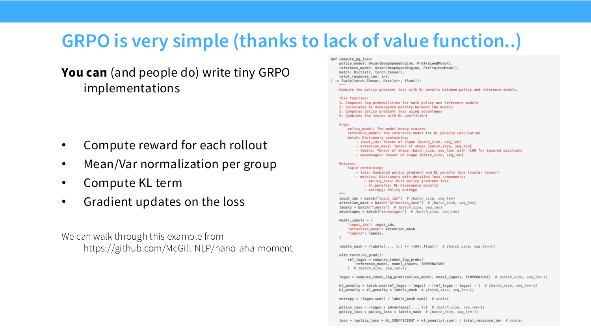

### 讲解

由于消除了价值网络，GRPO 的实现代码变得极其清爽。
主讲人在此推荐了一个极简的 GRPO 开源实现：`nano-aha-moment`（由 McGill-NLP 维护）。
其训练步骤简洁明了：
1. 对每个 Prompt Rollout 生成多条结果。
2. 对这批结果运行 Unit Test 或 Math Equivalence 计算，给出 0 或 1 的 Rewards。
3. 对 Rewards 进行群组归一化。
4. 计算 KL 惩罚，然后对 Policy 进行梯度上升更新。

---

## Slide 20

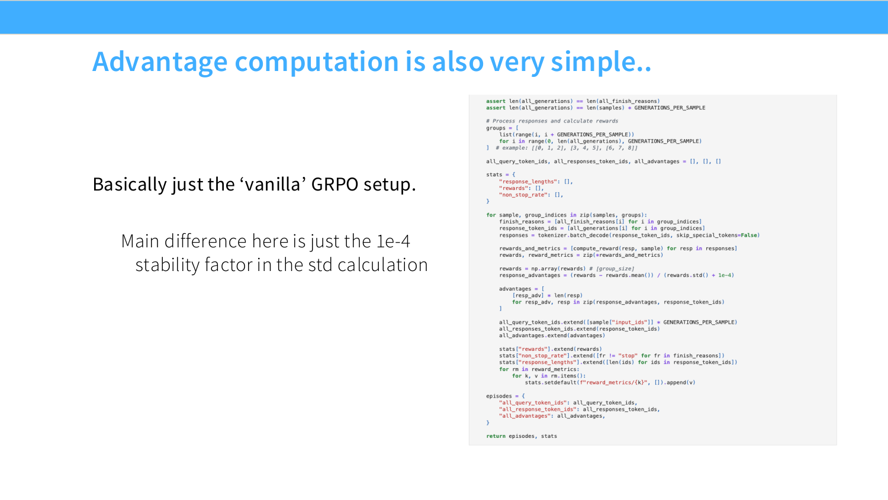

### 讲解

本页展示了 `nano-aha-moment` 中具体的优势计算代码：
```python
rewards = torch.tensor(rewards)
mean = rewards.mean()
std = rewards.std()
advantages = (rewards - mean) / (std + 1e-4)
```
这里需要注意的是，在分母的标准差（`std`）计算中，加入了一个微小的稳定常数 `1e-4`，以防止当群组内所有的 Reward 完全一样时发生除以零的数值崩溃（NaN）。

---

## Slide 21

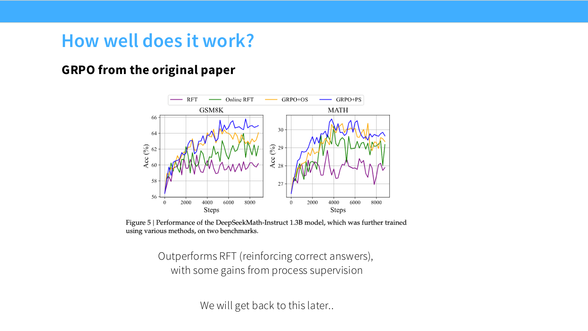

### 讲解

这一页展示了 GRPO 原始论文（DeepSeekMath）中的消融实验数据。
- **实验对比**：
  - **RFT（Rejection Fine-Tuning / 拒绝采样微调）**：仅收集对正确答案的样本进行有监督微调。
  - **GRPO**：使用可验证的数学对错作为 Reward 进行在线强化学习。
- **结论**：GRPO 在 GSM8K 和 MATH 等推理测试集上，以极佳的收敛效率明显超越了 RFT。配合过程监督（Process Supervision，对推理的中间步骤进行打分）可以取得更进一步的增益。

---

## Slide 22

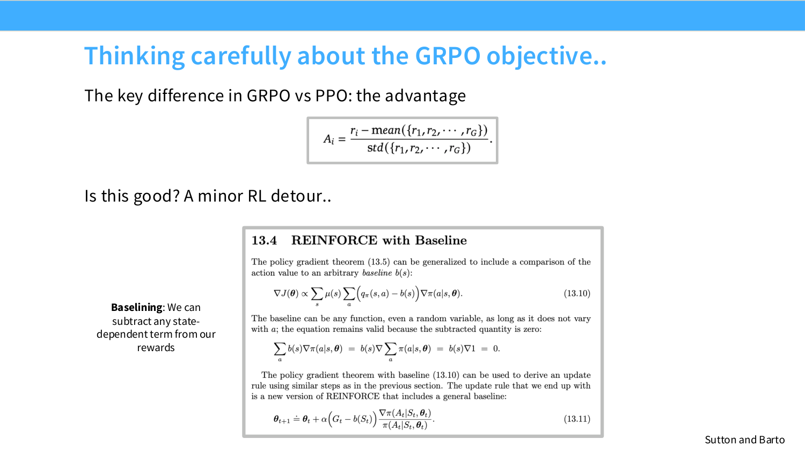

### 讲解

主讲人引导我们开始对 GRPO 的核心机制进行严谨的数学反思：
- 在强化学习经典著作（Sutton & Barto）中，**基线（Baseline）** 的引入是为了在不引入偏置（Bias）的前提下降低方差。
- 理论上，我们可以从奖励 $`R(z)`$ 中减去**任何与动作 $`z`$ 无关、仅与状态 $`s`$ 相关的量 $`b(s)`$**。即：
  ```math
  \mathbb{E} \left[ (R(z) - b(s)) \nabla_\theta \log p_\theta(z) \right] = \mathbb{E} \left[ R(z) \nabla_\theta \log p_\theta(z) \right]
  ```
  因为 $`\mathbb{E}[b(s) \nabla \log p_\theta(z)] = b(s) \mathbb{E}[\nabla \log p_\theta(z)] = b(s) \cdot 0 = 0`$。
- **追问**：GRPO 的优势计算公式中，不仅减去了均值（这可以看作一个依赖状态 $`s`$ 的群组 Baseline），还**除以了标准差 $`\text{std}(\mathbf{r})`$**。这真的符合无偏基线的要求吗？

---

## Slide 23

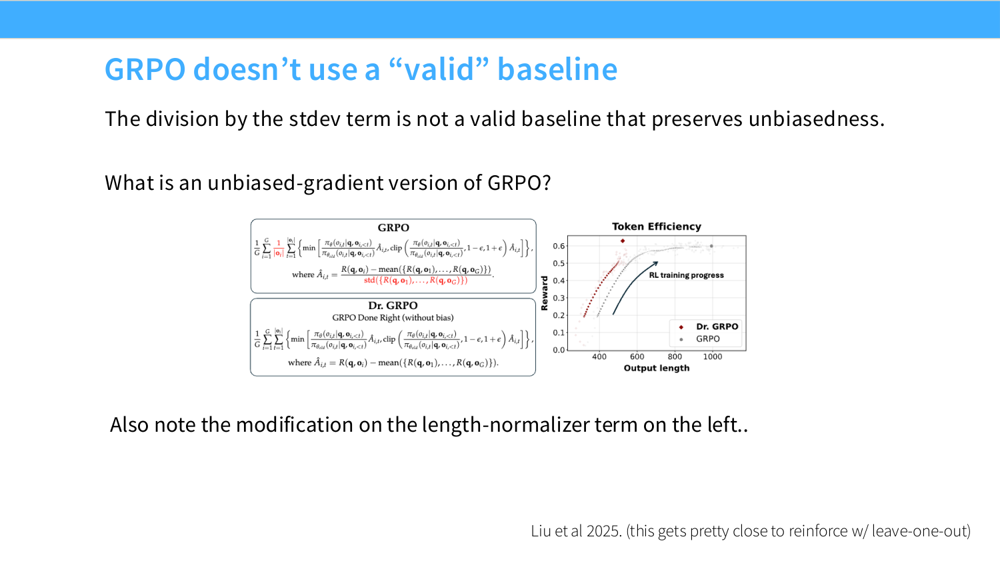

### 讲解

本页提出了刘等人在 2025 年的研究（“Understanding R1-Zero-like training: A critical perspective” / 关联于“Dr. GRPO”）。
- **GRPO 的数学偏置问题**：由于在优势估计中除以了群组标准差 $`\text{std}(\mathbf{r})`$，而标准差本身是由采样出的所有动作奖励共同决定的，这使得分母与具体的样本动作产生了非线性的交织。在数学上，**这不再是一个“有效基线”，它破坏了策略梯度估计的无偏性（Unbiasedness）**。
- **修正方案（Unbiased version of GRPO）**：
  - 转向 **RLOO (REINFORCE Leave-One-Out)** 的设计。
  - 在计算样本 $`i`$ 的优势时，均值基线**剔除自身**，仅计算除了 $`i`$ 之外的其他 $`j \neq i`$ 个同伴的均值。这样，基线与当前的动作 $`i`$ 实现了数学上的完全独立。
  - 移除分母的标准差归一化，或者使用全局平滑标准差，以恢复梯度的无偏性，使策略梯度更新更加稳健。

---

## Slide 24

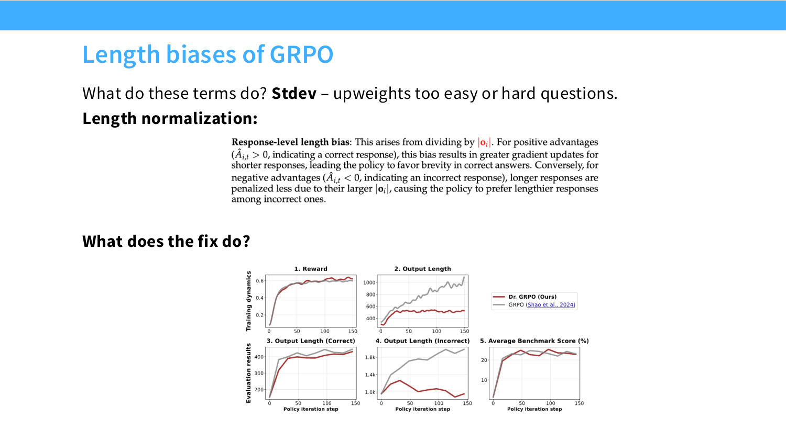

### 讲解

本页详细剖析了 GRPO 带来的**长度偏置（Length Biases）**和**题目难度偏置**。
- **长度偏置的成因**：
  在 GRPO 的实际实现中，通常会将整个 Completion 的 Loss 除以其生成的 Token 长度 $`L`$ 进行归一化。
  ```math
  L_{GRPO}(\theta) \propto \sum_{i} \frac{1}{L_i} \sum_{t} \log \pi_\theta(y_{i,t}) A_i
  ```
  在这种情况下，如果一个 Completion 的 Reward 很差（例如 $`A_i < 0`$），但其长度 $`L_i`$ 被拉得极长，那么它分摊到每个 Token 上的负梯度（惩罚）就会被分母 $`L_i`$ **极其严重地稀释**。相反，短小而错误的回答会受到极严厉的惩罚。
  - **后果**：这等同于在数学上**隐式地鼓励模型生成冗长、啰嗦的错误答案（有利于稀释负向更新惩罚）**。这就是 R1-Zero 在训练后期文本长度急剧膨胀的隐秘数学根源。
- **修复措施**：
  Dr. GRPO (Liu et al., 2025) 提出**废除基于单个轨迹长度的归一化**，改为使用群组中的固定常数或全局常量对 Loss 进行缩放。这不仅彻底消除了长度偏置，还使模型学会了用更高效、精炼的 CoT 解决问题。

---

# Part 2: 工业界大模型强化学习案例研究

本部分将剖析近期的三款主流开源推理模型（DeepSeek-R1, Kimi K1.5, Qwen 3）的强化学习训练配方。探讨它们在面对长 CoT、外语混杂以及计算系统开销时，是如何进行策略设计的。

---

## Slide 25

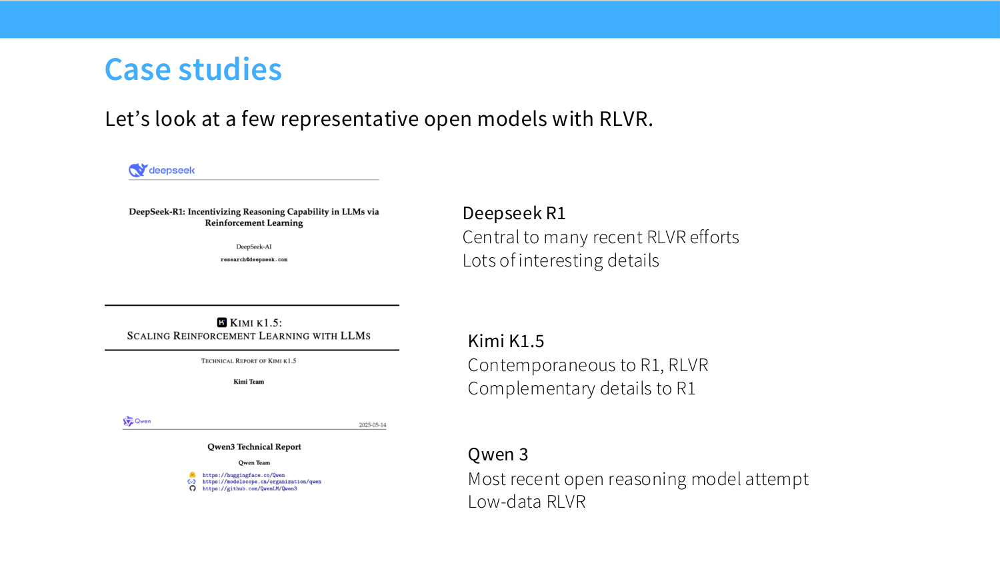

### 讲解

现在进入第二部分：**案例研究（Case studies）**。
我们将横向对比三款最前沿的、基于可验证奖励强化学习（RLVR）的大语言模型：
1. **DeepSeek-R1**：开启了大模型“纯强化学习自我涌现推理”风潮的里程碑之作。
2. **Kimi K1.5**：在相同时间节点发布、利用 Online Mirror Descent 和长度控制在长上下文推理上取得优异成绩的模型。
3. **Qwen 3**：利用极少样本（仅 3995 个样本）进行 GRPO 强化学习，并成功融合思考模式与智能体强化学习（Agent RL）的最新成果。

---

## Slide 26

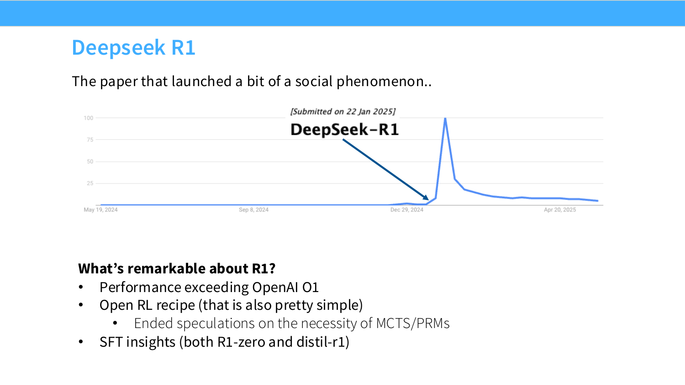

### 讲解

本页总结了 **DeepSeek-R1** 在行业内引发狂潮的核心亮点（A social phenomenon）：
- **超越 o1**：在多项推理、编程和数学测试集上，表现持平或超越了 OpenAI o1。
- **公开、清爽的 RL 秘籍（Open RL recipe）**：将极其复杂的对齐过程，精简为了基于 GRPO 的高性价比在线学习。
- **终结 MCTS/PRM 迷信**：在此之前，行业普遍认为 o1 依赖于复杂的蒙特卡洛树搜索（MCTS）或高精度的过程奖励模型（PRM）。R1 证明了，**仅需利用简单的终端正确性（Verifiable Outcome Rewards），配合自回归的在线探索，就足以让大模型涌现出顶尖的推理和自纠错能力**。

---

## Slide 27

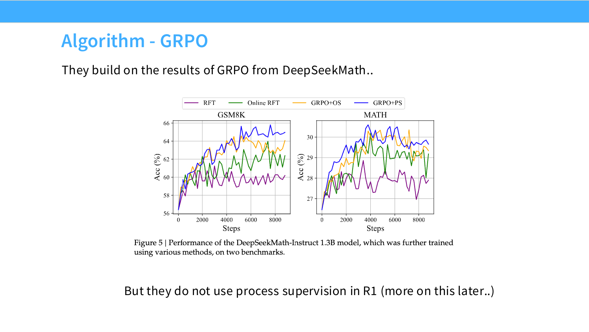

### 讲解

本页讨论了 DeepSeek-R1 的算法选择。
- DeepSeek 团队继承了其在 DeepSeekMath 中的成果，以 **GRPO** 作为 RL 的核心优化器。
- 需要强调的是，**R1 并没有采用过程监督（Process-based Reward Model, PRM）**。因为 PRM 需要对生成步骤进行精细标记（由昂贵的模型或人类完成），这在逻辑泛化上极易出错。R1 仅依靠最终的数学等价性检查和编译器运行结果（Outcome-based Rewards）就完成了推理能力的对齐。

---

## Slide 28

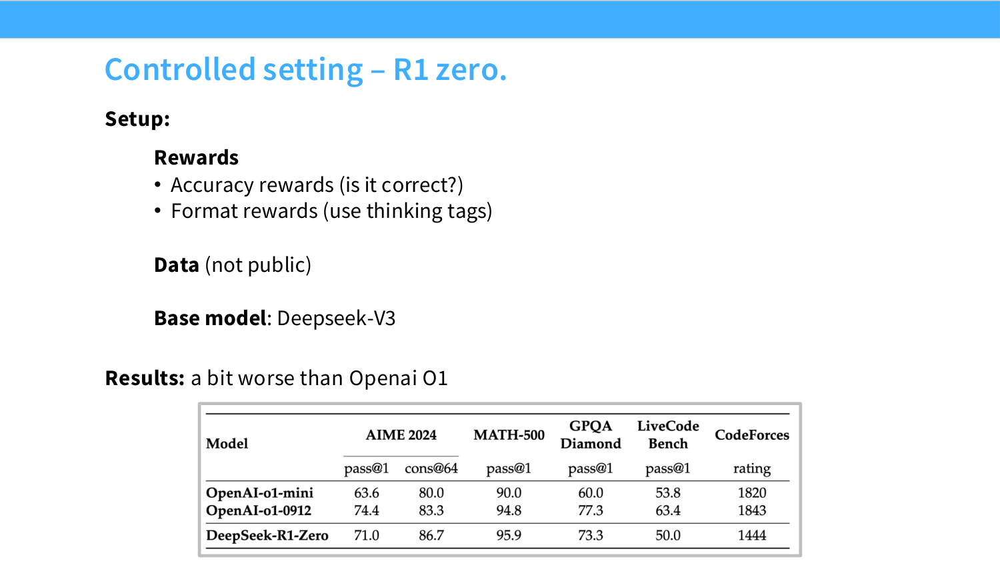

### 讲解

本页详细剖析了受控实验版本 **DeepSeek-R1-Zero** 的训练设定。
- **Base Model**：纯粹的预训练基座模型 **DeepSeek-V3**（完全没有经过 SFT 微调）。
- **数据**：少量的数学、代码和逻辑推理 prompt（未公开具体规模，但数据集不含任何演示范文 Completion）。
- **奖励设计（仅包含两种极其简单的规则 reward）**：
  1. **准确性奖励（Accuracy Rewards）**：通过可验证的代码测试或数学答案比对给出 0 或 1。
  2. **格式奖励（Format Rewards）**：强制要求模型在思考时将思维链包裹在 `<think>` 和 `</think>` 标签中，在给出最终答案时包裹在 `<answer>` 标签中。不符合标签规范则扣分。
- **结果**：完全不给任何范文，直接让模型在数学和编译器的规则下“在黑暗中摸索”，最终性能逼近 OpenAI o1-mini。

---

## Slide 29

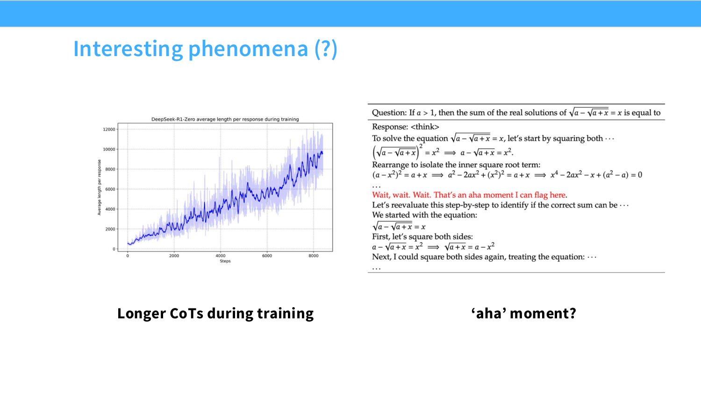

### 讲解

本页展示了 R1-Zero 在纯 RL 强化过程中涌现出的**三大神奇特征**：
1. **CoT 长度自我拉伸（Longer CoTs）**：
   随着训练步数的增加，模型的思维链条变得极长。模型自发学会了分配更多 Token 来处理难题，以追求更高的正确率（可验证奖励）。
2. **自我反思与纠错（Self-correction）**：
   在 `<think>` 标签内，模型会自发写出“Wait... let me re-evaluate this”、“Ah, I made a mistake here...”等文字，发现自己的第一步计算错误并擦除重写。
3. **“Aha! Moment”（顿悟时刻）**：
   模型在计算过程中，会因为突然理清了题目中的陷阱而发出感慨（“Aha!”），表现出人类般的思考过程。

---

## Slide 30

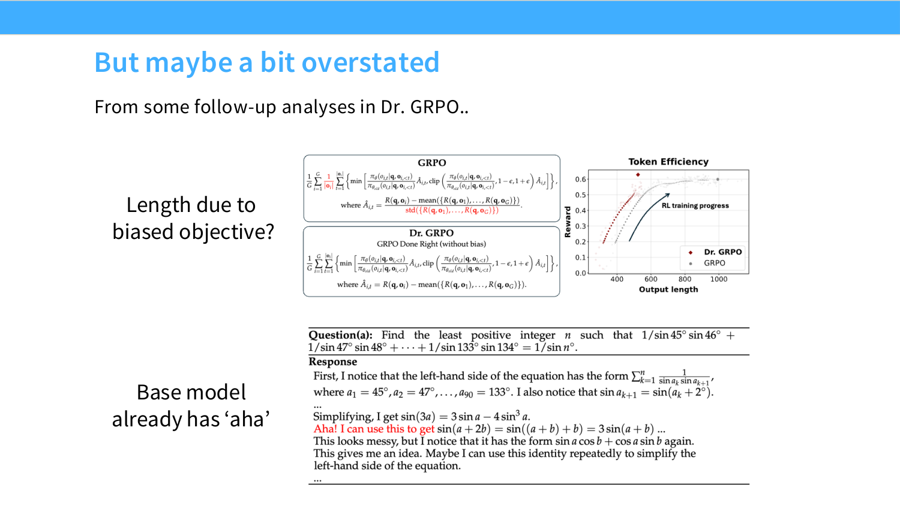

### 讲解

主讲人在此提出了冷思考：**“Aha! Moment” 是否被夸大了？**
引自 Dr. GRPO 论文及社区的批判性分析：
- **长度拉伸的数学成因**：我们在 Slide 24 中提到，因为 GRPO 的 Loss 存在单轨迹长度归一化的缺陷，长轨迹能够摊薄负梯度更新。因此，CoT 的膨胀很大程度上是**算法公式偏置所强加的现象**，而不全是“模型渴望深入思考”。
- **基座模型的能力蕴含**：DeepSeek-V3 的强悍预训练早已让模型具备了自我纠错的“潜能”。纯 RL 并不是无中生有地创造了“Aha Moment”，而是用规则惩罚把模型中被模板压抑的推理和反思行为**彻底唤醒并激活**了出来。

---

## Slide 31

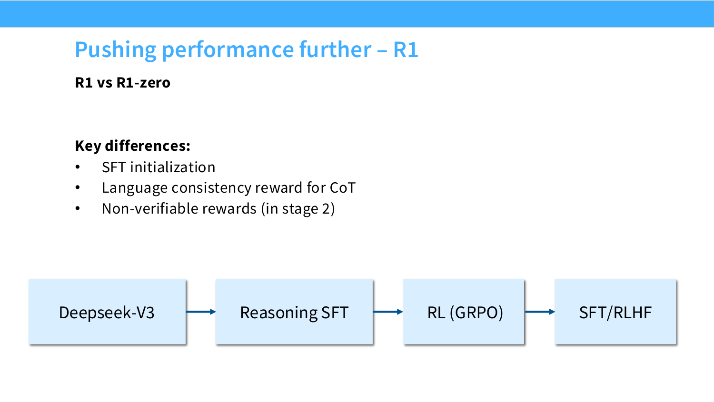

### 讲解

既然 R1-Zero 如此强大，为什么 DeepSeek 还要发布正式版 **DeepSeek-R1**？
- **R1-Zero 的三大硬伤**：
  1. **可读性极差**：生成的 CoT 中充满了凌乱的代码和草稿，排版一团糟。
  2. **中外文混杂（Language Mixing）**：在思考过程中，模型会在英文、中文、日文之间毫无逻辑地频繁切换，影响用户观感。
  3. **非推理能力退化**：由于纯 RL 仅优化推理，模型在普通文科写作、创意表达等方面的能力发生了严重的灾难性遗忘。
- **DeepSeek-R1 的改进路线**：
  R1 引入了多阶段（Multi-stage）的对齐框架：
  `DeepSeek-V3` $`\to`$ `推理 SFT 引导` $`\to`$ `推理 GRPO 强化（加入语言一致性奖励）` $`\to`$ `通用 SFT & RLHF`。

---

## Slide 32

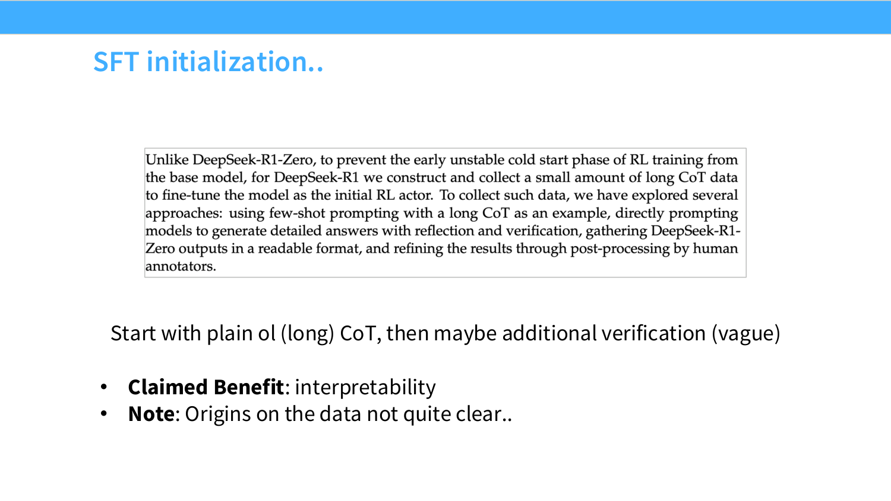

### 讲解

本页详细剖析了 R1 对齐第一步中的 **SFT 初始化（SFT Bootstrapping）**。
- 为了从一开始就约束模型的思考格式和排版，DeepSeek 团队手动编写/收集了数千条包含长 CoT 推理的黄金 Demonstration。
- **主要目的**：作为“热启动（Warm-start）”的火种，让模型在 RL 之前就建立起良好的多轮排版习惯和“写 `<think>` 标签”的自觉，从而**显著增强可解释性和逻辑规整性**。

---

## Slide 33

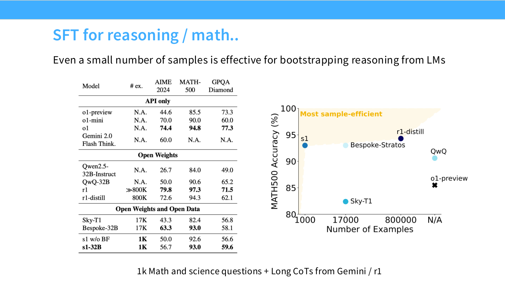

### 讲解

本页探讨了**如何获取推理领域的 SFT 数据**。
- 即使是极小规模的黄金样本（例如仅 1k 条数学和科学题目），也能够成功地为大模型的推理引导打下坚实基础。
- 收集这类数据的渠道包括：使用高规格的模型（如 Gemini 1.5 Pro, GPT-4o）以及 DeepSeek 内部早期的 R1 实验版本进行拒绝采样，剔除凌乱内容，仅保留解答正确且思维清晰的 1000 个长思维链样本，用于基座的 SFT 热身。

---

## Slide 34

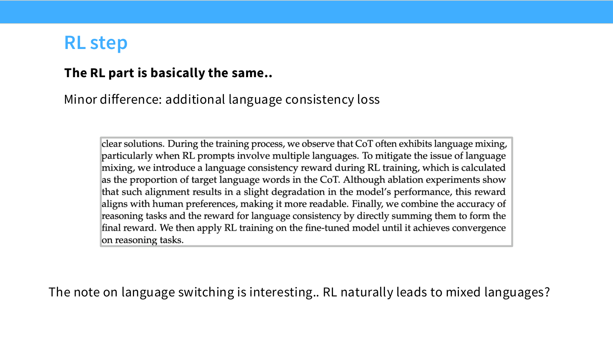

### 讲解

本页讲解了正式版 R1 的 **RL 训练步（RL Step）**。
- 其 RL 核心依然基于可验证奖励的 GRPO 训练。
- **语言一致性约束（Language Consistency Loss）**：
  针对 R1-Zero 中英混杂的毛病，团队在奖励函数中加入了一项**惩罚惩罚项**。如果用户使用中文提问，而模型在 `<think>` 中使用了过多的英文，或者在最终回答中混入非目标语言，则直接扣减 Reward。这使得 R1 的思维链条在视觉上变得极其工整温和。

---

## Slide 35

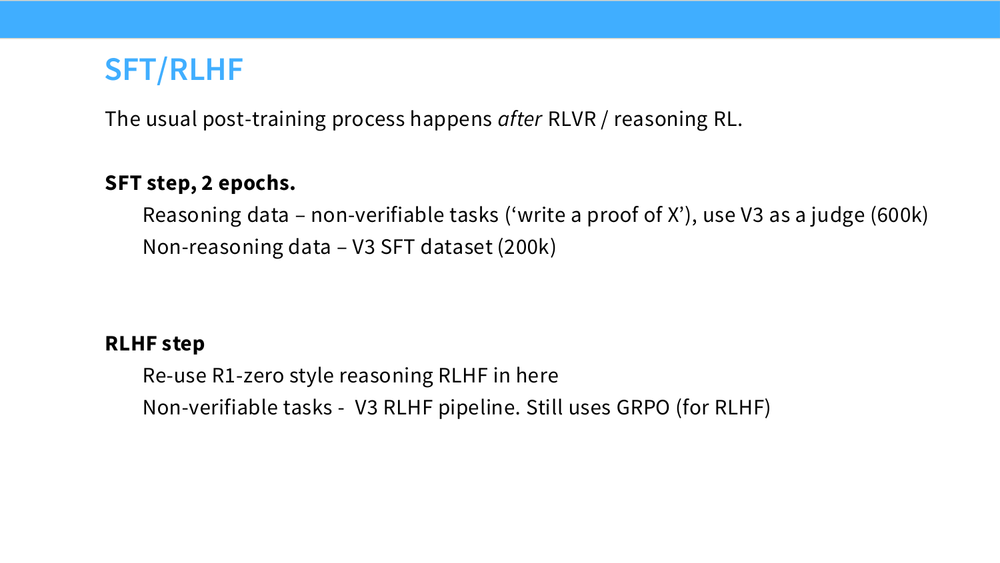

### 讲解

本页剖析了 R1 框架在推理 RL 之后的**后续对齐阶段（SFT/RLHF）**。
在模型通过在线 GRPO 获得了极强的数学和编程推理力后，DeepSeek 将这些长思维链数据与通用的对话数据结合，对模型进行通用对齐：
- **通用 SFT 阶段 (2 Epochs)**：
  - **推理数据**：收集了 600k 条由 RL 阶段产出的优质长 CoT 数据。对于非验证的任务，使用强大的 DeepSeek-V3 充当裁判来过滤掉逻辑有误的样本。
  - **非推理数据**：混合 200k 条通用的 SFT 数据（包含角色扮演、创意写作、日常闲聊等）。
- **通用 RLHF 阶段**：
  在 SFT 之后，为了进一步向人类价值观对齐，再次运行一次 GRPO。这次的 Reward 包含了人类的安全与偏好约束，同时通过特殊的模板设计，保留了模型的自主思考 `<think>` 行为。

---

## Slide 36

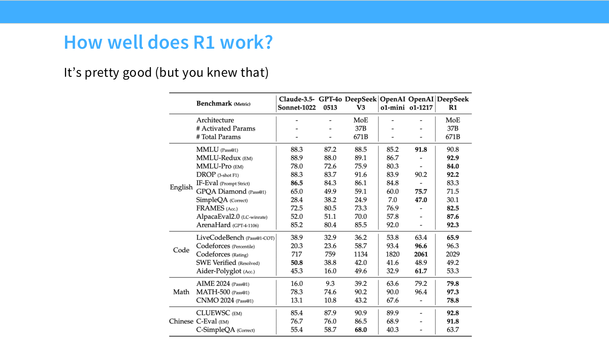

### 讲解

这一页展示了 DeepSeek-R1 最终的性能结果。
- 在代表编程竞赛难度的 Codeforces 上，R1 击败了 $`96.3\%`$ 的人类选手。
- 在数学竞赛 AIME 上，R1 取得了惊人的分数，完全平替甚至超越了 o1 的表现，且训练算力成本仅为美国顶尖实验室的几分之一。

---

## Slide 37

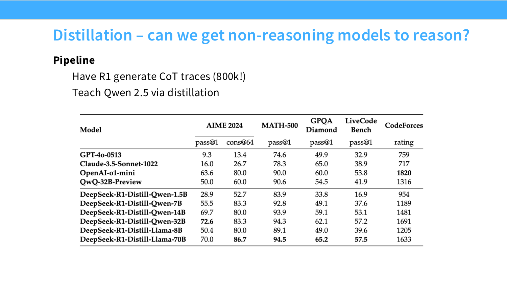

### 讲解

本页介绍了大模型对齐领域的另一个重磅洞察——**推理能力的蒸馏（Distillation）**。
- **核心实验**：
  既然 R1 已经生成了大量高质量的推理轨迹，我们为什么不直接将这些 CoT 蒸馏给小模型？
- **流水线**：
  1. 收集 R1 针对各种难题生成的 800k 条完美的思维链解答（CoT Traces）。
  2. 使用这批数据，以标准的有监督微调（SFT）方式，去直接训练较小的模型（如 Qwen-2.5-Math、Llama-3-8B）。
- **惊人发现**：
  蒸馏后的小模型（如 Qwen-2.5-Math-7B 蒸馏版）表现极其抢眼，**其性能显著超越了直接在小模型上运行强化学习（RL）所能达到的极限**。这表明，大模型的思考模式可以直接像事实知识一样被小网络高效继承。

---

## Slide 38

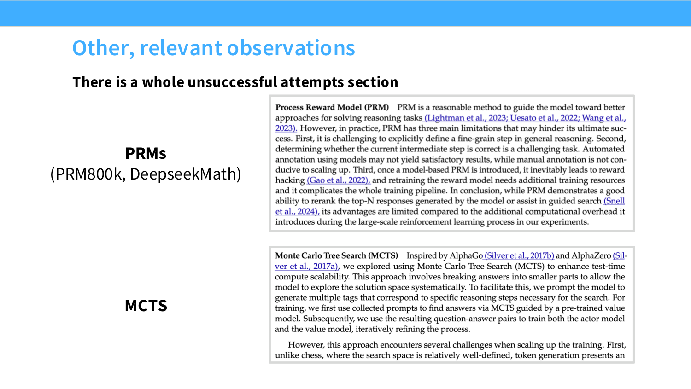

### 讲解

本页展示了 DeepSeek-R1 论文中非常诚实的**“失败尝试”总结（Unsuccessful attempts）**：
- **PRM（过程奖励模型）**：
  团队曾尝试为数学推导的每一步都训练一个评分器，但发现在大规模训练中，PRM 的误判率会发生累积，且对于非结构化思维的泛化极差，极易诱发模型在步骤上投机取巧。
- **MCTS（蒙特卡洛树搜索）**：
  将 MCTS 与 LLM 结合在理论上很美妙（类似 AlphaGo），但在实际工程中，自然语言的搜索空间本质上是连续且极其宽广的，不像围棋有明确的分支和动作边界。LLM 的 rollout 极其缓慢，导致 MCTS 在大规模分布式训练中的吞吐量低到无法实用。

---

## Slide 39

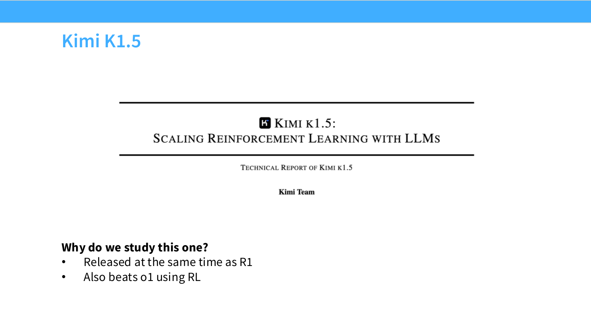

### 讲解

接下来，我们看另一个同样在长上下文推理上实现对 o1 超越的工业界模型——月之暗面（Moonshot AI）的 **Kimi K1.5**。
- **为什么研究 Kimi K1.5？**
  - 它与 DeepSeek-R1 几乎在同一时期发布，并且利用了完全不同的 RL 算法路径实现了对 o1 推理能力的对标。
  - 它在长上下文的 RLVR 训练和长思维链的长度控制上提供了非常有价值的互补细节。

---

## Slide 40

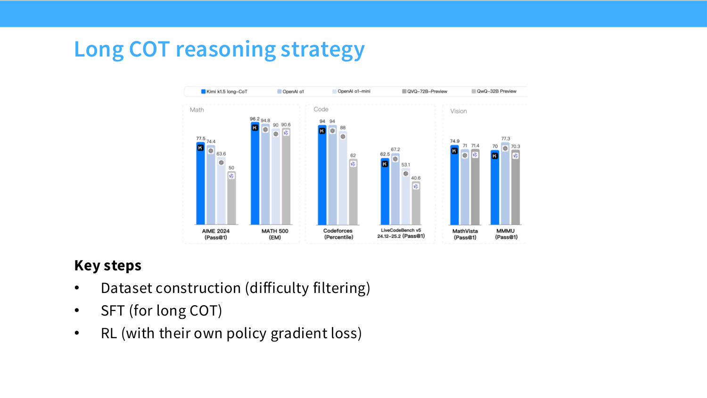

### 讲解

本页展示了 Kimi K1.5 培育长思维链推理的三步走策略：
1. **数据集筛选（Dataset construction）**：通过“难度过滤”精心挑选高价值 Prompt。
2. **SFT 阶段**：进行长 CoT 格式的引导。
3. **RL 阶段**：使用他们自主设计的、独特的策略梯度损失进行大规模在线训练，这与 DeepSeek 的 GRPO 有所不同。

---

## Slide 41

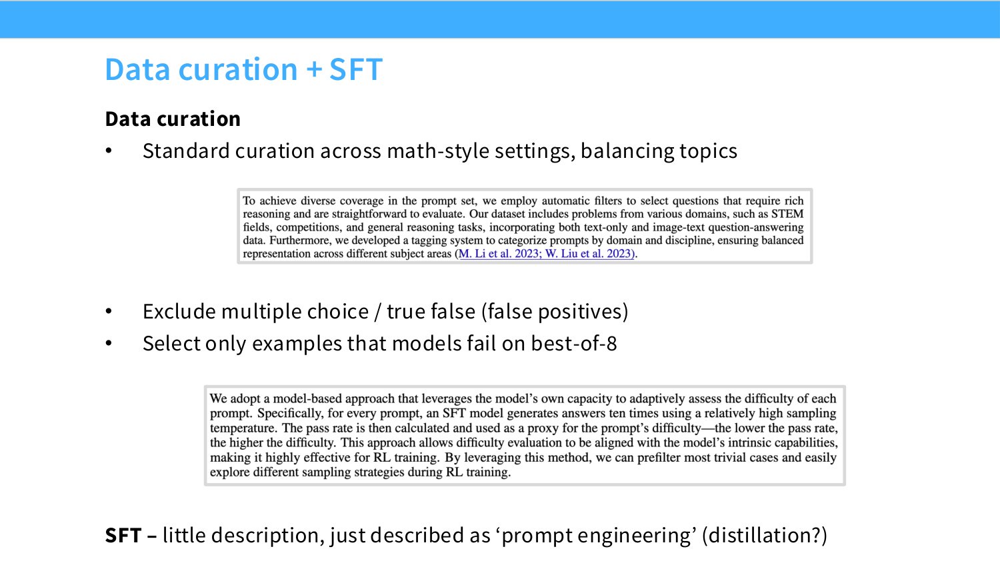

### 讲解

这一页剖析了 Kimi K1.5 的**数据清洗与 SFT 热身细节**：
- **数据去重与筛选**：
  在预训练和 SFT 阶段，排除所有选择题（Multiple Choice）和判断题（True/False）。
  - **核心直觉**：这类题型极易产生“虚假繁荣（False Positives）”，即模型完全没有想明白逻辑，却靠瞎猜碰对了最终选项，给 RL 过程带来严重的噪声。
- **基于 Best-of-8 的难度过滤**：
  仅选择那些在预训练模型以 “Best-of-8”（采样8次）尝试时**全部失败**，或者仅有少数能做对的困难题目。这确保了 RL 训练集里的每一道题对模型而言都是有挑战性的，能最大化地压榨和激发模型的自纠错潜力。

---

## Slide 42

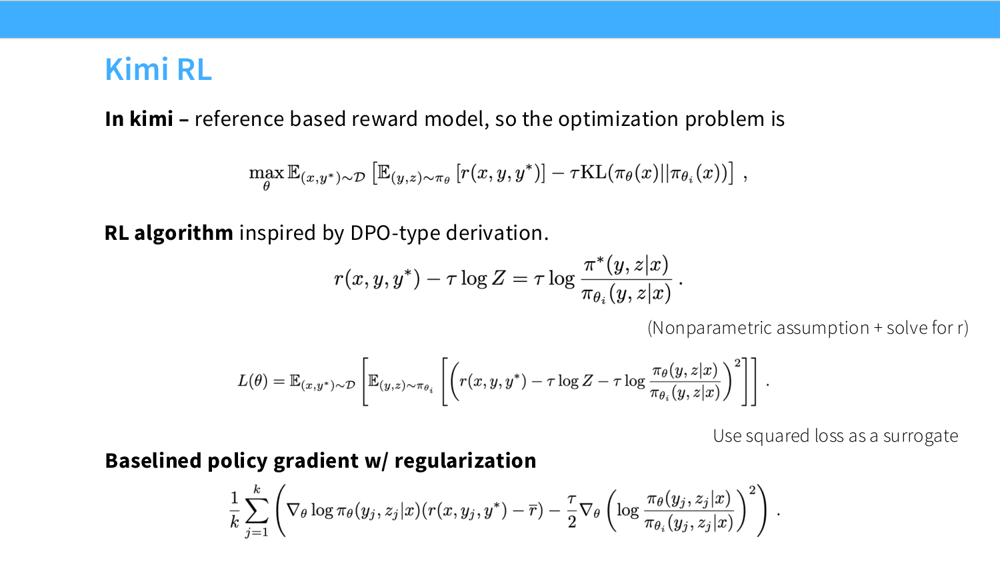

### 讲解

本页深入解析了 **Kimi k1.5 的强化学习算法**。
Kimi 的 RL 算法与 DeepSeek 基于 GAE/Z-Score 的优势函数不同，它是从 **DPO (直接偏好优化)** 的数学推导演进而来。
- **数学机制**：
  基于非参数化的假设求解出隐含的 Reward $`r`$，并在在线更新中采用一个**平方损失（Squared Loss）**作为代理函数：
  ```math
  L_{Kimi}(\theta) \propto \mathbb{E} \left[ \left( \log \frac{\pi_\theta(y \mid x)}{\pi_{ref}(y \mid x)} - \eta R(x, y) \right)^2 \right]
  ```
  配合策略梯度和正则化，这等价于在对数概率空间中对可验证奖励进行在线的 **Mirror Descent（镜像下降）** 更新。
- **优势**：该损失函数自带天然的相对熵约束，其梯度更新在没有显式 Critic 网络的情况下极其平稳，规避了 PPO 价值网络不稳定的硬伤。

---

## Slide 43

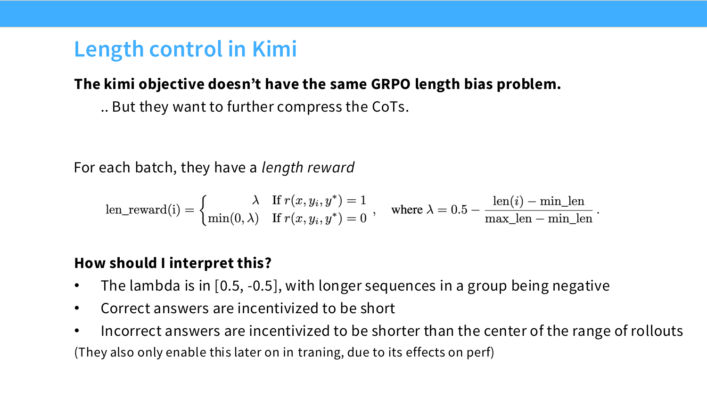

### 讲解

本页讲解了 Kimi 团队在解决**长度膨胀**问题上的设计——**长度控制奖励（Length Control in Kimi）**。
由于 DPO/OMD 的数学结构同样容易使模型走向“啰嗦以换取稳定性”，Kimi 团队在训练中后期引入了群组内的**长度惩罚因子**：
- 在每个 Batch 的 Rollout 群组中，计算 Completion 的长度均值，对超出平均长度的 Completion 施加惩罚：
  ```math
  \text{Length Reward} = \lambda \cdot \frac{L_i - \text{mean}(\mathbf{L})}{\text{std}(\mathbf{L})}
  ```
  - $`\lambda`$ 设定在 $`[-0.5, 0.5]`$ 之间。
  - **规则 1**：对于正确回答，模型被积极引导去寻找最简捷、短小的步骤（Incentivized to be short）。
  - **规则 2**：对于错误回答，模型受到的负面惩罚必须远远小于对于短而错回答的惩罚。
- **关键细节**：团队建议仅在**训练后期**开启此长度惩罚。如果在一开始就强加长度限制，会阻碍模型在早期进行充分的发散性逻辑搜索，导致推理性能发生缩水。

---

## Slide 44

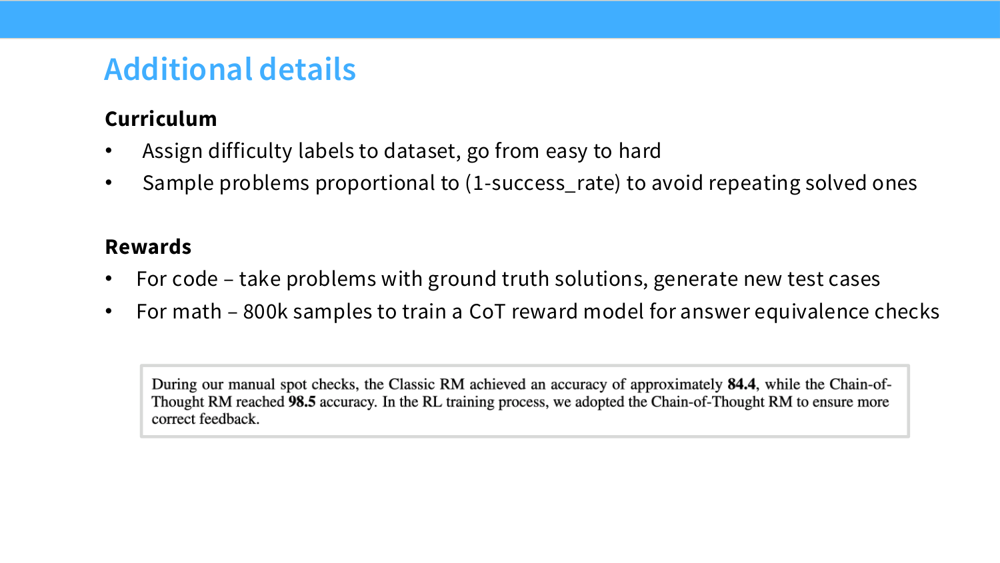

### 讲解

本页补充了 Kimi K1.5 的其他工程微调细节：
- **课程学习（Curriculum Learning）**：
  - 题目按照难度打上标签，训练从简单题目起步，逐步过度到困难题。
  - **动态采样**：采样概率与题目的成功率成反比，即 $`P(\text{sample}) \propto (1 - \text{success\_rate})`$。已经被 RL 彻底攻克的题目会逐步淡出采样库，把算力集中在模型一直做不对的硬骨头上。
- **奖励塑造的泛化**：
  - **代码题**：不仅看代码有没有得出标准输出，还通过 LLM 自动生成更多的隐藏边界测试用例（Edge Cases）去动态运行代码，以彻底排除“Hardcoded 答案作弊”的风险。
  - **数学题**：训练一个专门负责判定数学步骤等价性（Answer Equivalence Checks）的数学裁判模型。

---

## Slide 45

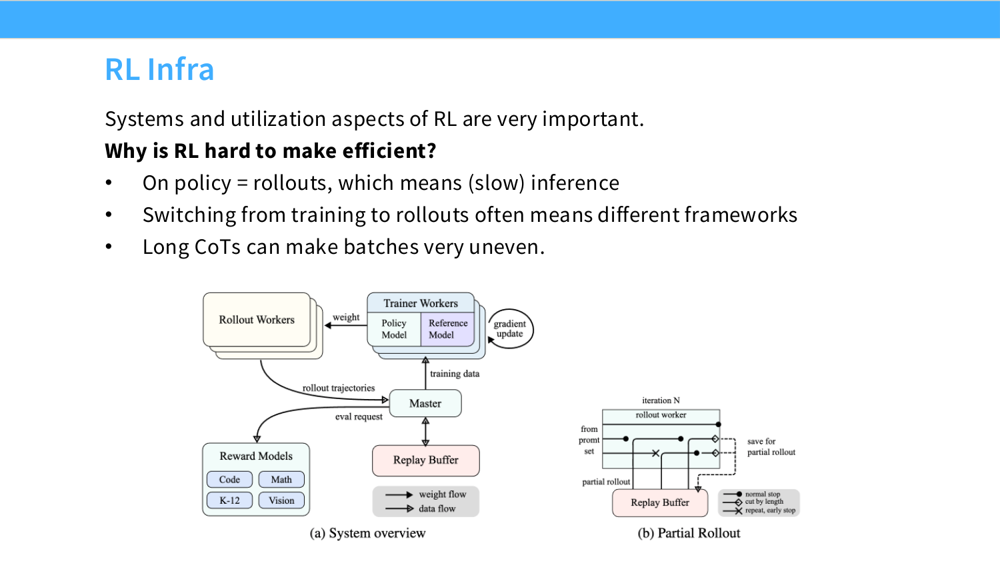

### 讲解

本页探讨了强化学习在**基础设施与计算系统效率（RL Infra & Systems）**上的痛点：
为什么 LLM 的在线强化学习效率低下、极难优化？
1. **On-policy 的高昂生成成本**：RL 每一轮都需要产生海量的 Rollout 生成，这属于纯粹的**自回归推理（Inference-bound）**，显卡在进行自回归生成时利用率（MFU）极低。
2. **训练/推理框架的撕裂**：LLM 训练往往使用 Megatron/DeepSpeed，而高效推理往往使用 vLLM/TensorRT-LLM。在 RL 中，模型每一步都需要在“生成”与“梯度更新”之间切换，框架的频繁切换和权重拷贝会带来极其严重的系统延迟。
3. **负载不均衡（Load Imbalance）**：长思维链的长度完全由模型根据题目难度动态生成，不同 Prompt 产生的 Token 长度极其悬殊，在张量并行和数据并行中会导致多张显卡发生严重的等待（Stall）。

---

## Slide 46

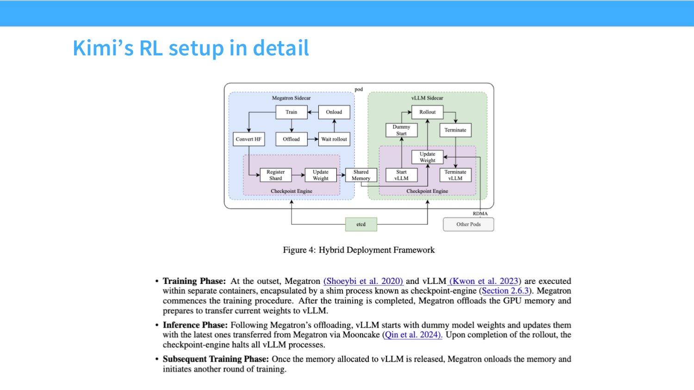

### 讲解

这一页展示了 Kimi 团队为解决上述系统挑战而开发的**高性能并行 RL 引擎架构**：
- 核心思路：**解耦推理与训练（Decoupled Generation & Training）**。
- 将 GPU 资源划分为两组：
  - **Generator 节点**：搭载定制的高吞吐 vLLM 推理引擎，专门负责从当前 Policy 中快速采样 Token 序列，并将生成的 Trajectories 塞入缓冲队列。
  - **Learner 节点**：搭载高度优化的 Megatron-LM 训练框架，专门负责从队列拉取样本，计算梯度并更新参数。
- **权重异步同步（Asynchronous Weight Sync）**：
  Learner 在计算完最新权重后，通过高速 NCCL 带宽，以异步流水线（Pipelining）的方式同步回 Generator，从而彻底实现了生成与训练的并行吞吐。

---

## Slide 47

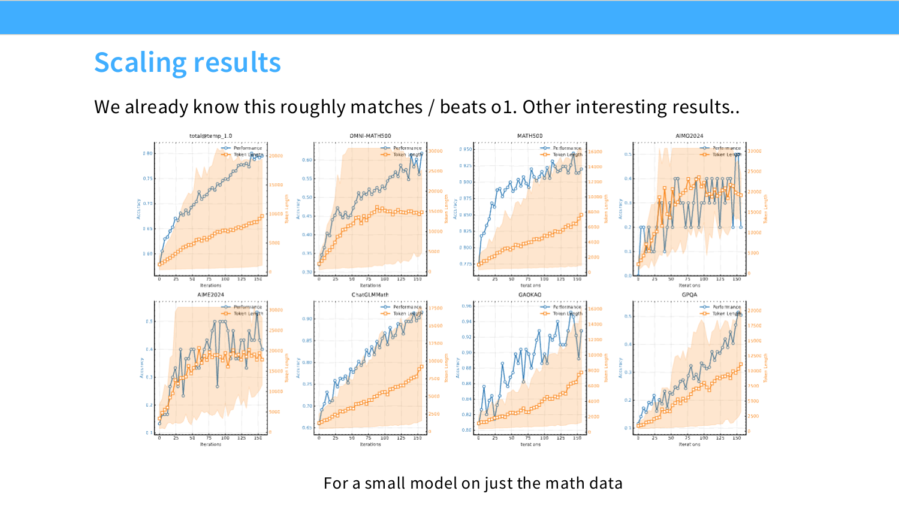

### 讲解

本页展示了 Kimi K1.5 的缩放性能实验结果。
- 在数学推理上，随着模型规模从小变大，性能曲线呈现出极其陡峭的上升趋势。
- **关键启示**：即使是百亿（10B-20B）级的小模型，在经过 K1.5 完整的长 CoT 强化学习训练后，也能在 MATH 竞赛集上取得极其强悍的分数，接近甚至赶上了没有经过长 CoT 强化的更大基座（如 Llama-3-70B）的表现。

---

## Slide 48

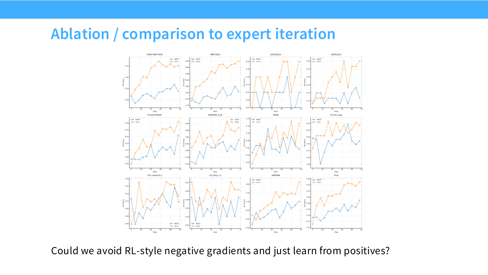

### 讲解

本页进行了一场非常有理论深度的消融实验——**RL 策略梯度 vs 专家迭代（Expert Iteration）**。
- **专家迭代 (Expert Iteration / Rejection SFT)**：
  仅收集模型生成的、答案正确的 Positive Trajectories 进行 SFT 学习。这是一种“只接受正面教育”的单向强化。
- **RL 强化学习（带负梯度反馈）**：
  通过策略梯度，不仅要从正确的答案中学习，还要利用错误的回答（以及群组均值比较）产生**负向梯度（Negative Gradients）**去主动压低错误行为的概率。
- **消融结论**：
  在相同的训练步数和 Prompt 规模下，**带负梯度反馈的在线 RL，其收敛上限和推理泛化力显著优于单纯的 Expert Iteration**。这表明，“知道什么不该写”对神经网络形成严密的逻辑闭环同样重要。

---

# Part 3: Qwen 3 与智能体强化学习（Agentic RL）

本部分探讨 Qwen 3 如何在极小的数据配方下实现强大的推理能力，并通过思考模式融合与智能体级多步动作交互，将强化学习推向更宽广的应用维度。

---

## Slide 49

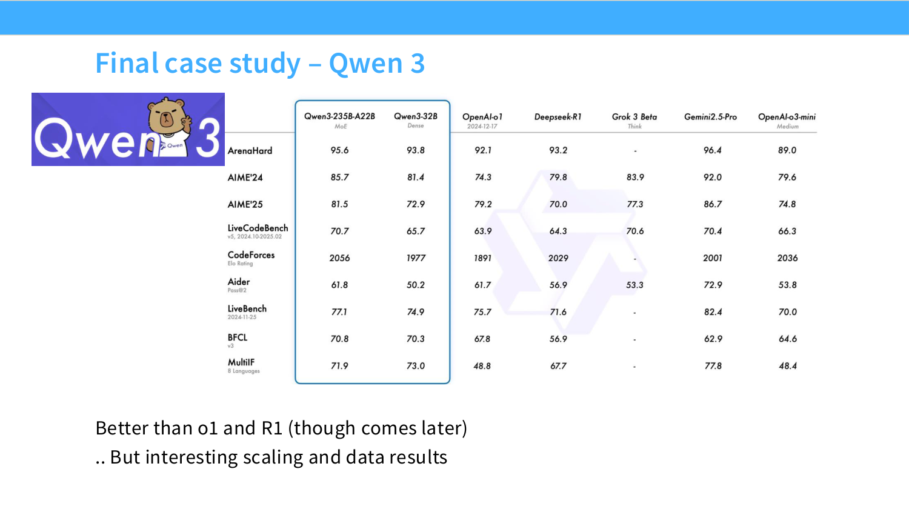

### 讲解

现在我们分析最后一个案例研究——**Qwen 3**。
作为最新发布的开源大模型，Qwen 3 系列在多项指标上实现了对 R1 的反超。本章我们将聚焦于它在**低数据强化（Low-data RLVR）**以及**智能体强化学习（Agentic RL）**上的独特设计。

---

## Slide 50

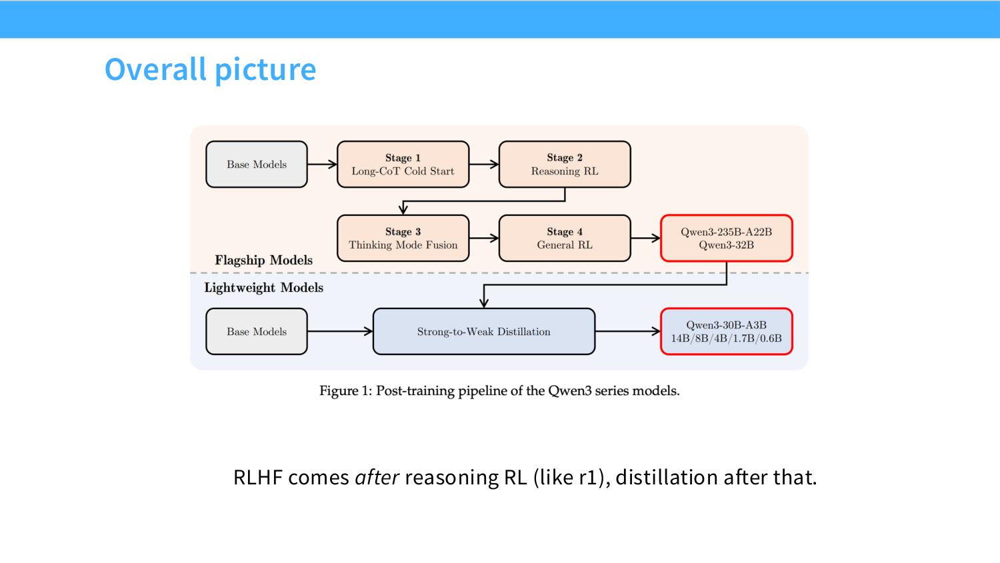

### 讲解

本页展示了 Qwen 3 的后训练整体流程大图：
- 在基础推理能力（Math/Code/STEM）的提升上，其训练路径与 R1 一致：
  `SFT 引导` $`\to`$ `推理 RL (GRPO)` $`\to`$ `通用 SFT & RLHF对齐` $`\to`$ `蒸馏下游`。
- 图中特别强调，为了让模型具备通用交互力，在推理强化之后，必须补充一个通用 RLHF 步骤，将纯粹长思维链模型转换为能够流畅对话的多功能助手。

---

## Slide 51

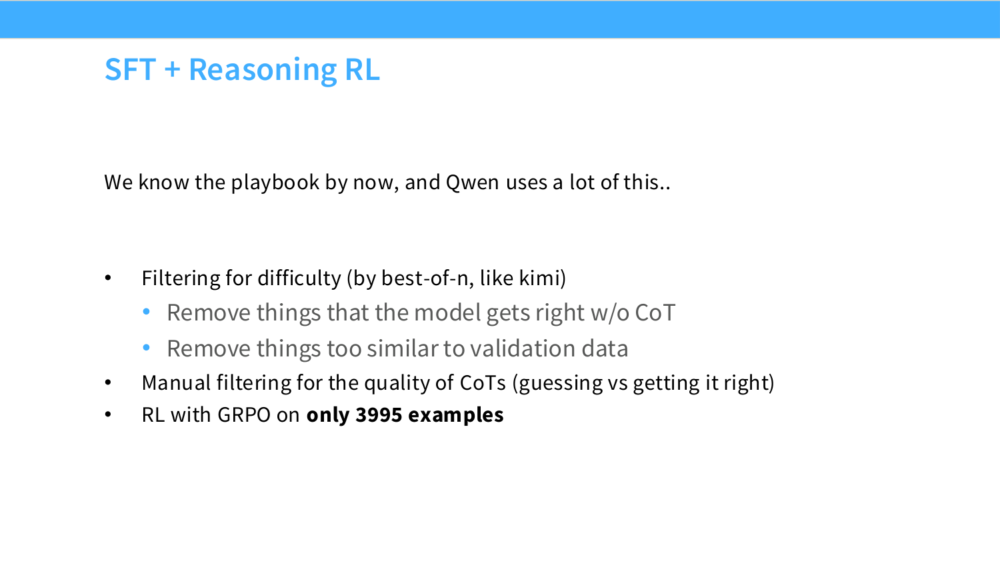

### 讲解

本页披露了 Qwen 3 在数据选择上的**极致精简配方（Data efficiency）**。
- 绝大多数团队认为强化学习需要数万甚至数十万题目。然而 Qwen 3 团队证明，**仅使用 3995 个极其纯净的 prompt，配合 GRPO，就能够将基座模型的数学和代码能力推向巅峰**。
- **数据处理的核心漏斗**：
  1. **Best-of-N 难度过滤**：去除太简单的题目（模型不写 CoT 也能做对的题目）。
  2. **验证隔离**：去除任何与主流评测集（如 GSM8K、MATH、HumanEval）有数据泄露或过于相似的题目。
  3. **逻辑严格性人工校验**：对于收集的 CoT，不仅要看最终答案正确，还引入专家团队手动审核，剔除所有“过程写错了但误打误撞碰对最终数值”的虚假解答样本。

---

## Slide 52

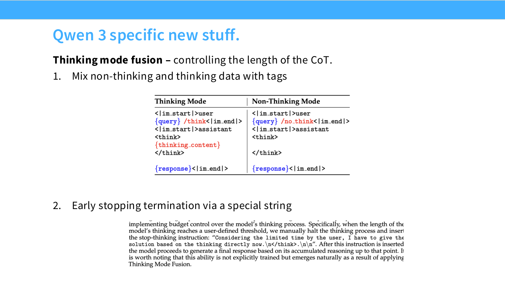

### 讲解

本页介绍了 Qwen 3 的一项重大架构创新——**思考模式融合（Thinking Mode Fusion）**。
- **传统困境**：像 DeepSeek-R1 这样的模型，只要启动就会输出几千字的 `<think>` 思维链。在实际应用中，用户提问“你好，请帮我翻译一句话”，模型也要傻傻地思考几十秒，生成一堆废话思考 Token，这在推理成本（Time-to-First-Token）上是极大的浪费。
- **Qwen 3 的解决方案**：
  1. **混合数据训练**：将有思考（长 CoT）和无思考（常规 SFT）的数据混合训练，引入特殊的条件 Tags（如思考标签或指令标签）。
  2. **思考长度自动控制与提早退出（Early Stopping）**：
     模型学会了自适应评估问题难度。对于简单问题，模型可以直接通过生成一个特殊的终止字符串，跳过思考，直接进入回答；对于难题，则自动拉伸 CoT。这在推理效率上实现了完美的动态平衡。

---

## Slide 53

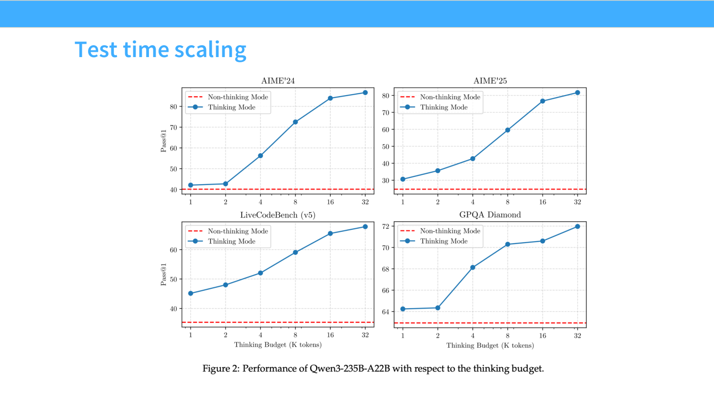

### 讲解

这一页讨论了 **测试时缩放（Test-time Scaling / 推理期缩放）** 的规律。
- 随着推理阶段对单个问题分配的计算资源（如采样次数 $`N`$ 或搜寻路径数）增加，推理性能会呈现明显的 Scaling 趋势。
- Qwen 3 充分利用了这一点，在面对极难题目时，允许模型在推理时拉长思维深度，从而以时间换取解答的正确率。

---

## Slide 54

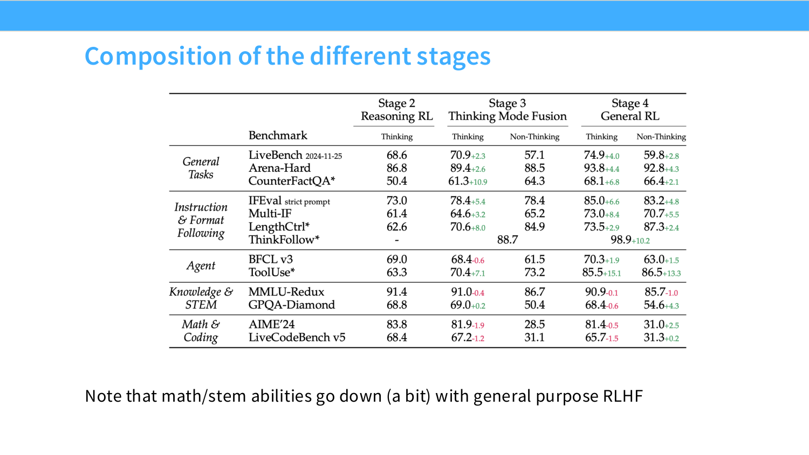

### 讲解

这一页展示了**多阶段训练对模型能力的消长影响（Composition of the different stages）**：
- **关键发现**：在第一阶段的“推理 RL”（纯 GRPO 优化数学和代码）中，模型的数理能力达到了最高点。
- 然而，当进入第二阶段的“通用对齐 RLHF”（引入安全防护、礼貌对话和文科问答）后，**模型的数学和 STEM 竞赛能力会发生微幅的不可逆退化（Tax/Alignment Tax）**。
- **启示**：在工业落地时，如果需要做纯数学或纯代码的代码生成专家，应当使用第一阶段强化完的 Checkpoint，而不应该使用通用对齐后的 Chat Checkpoint。

---

## Slide 55

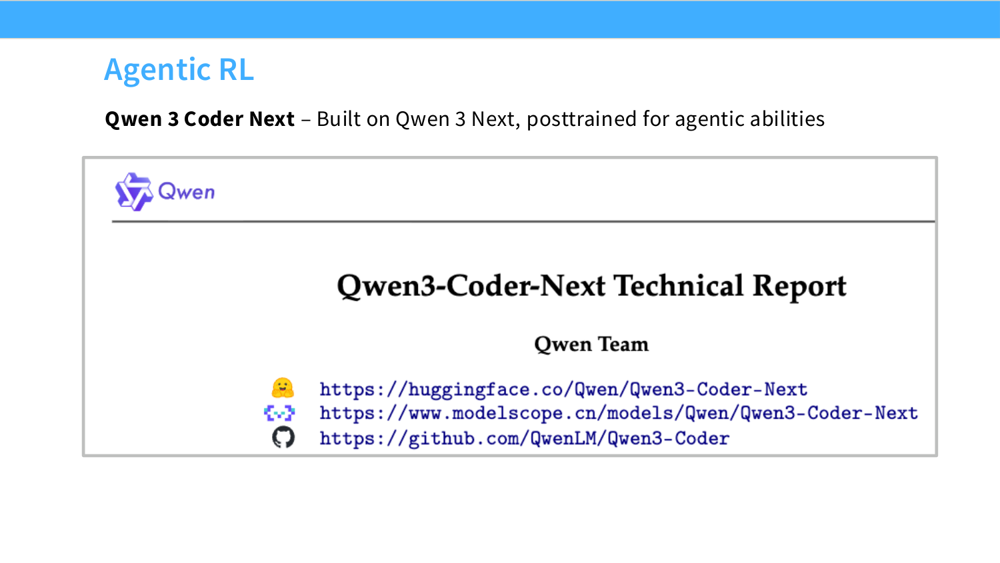

### 讲解

现在进入本讲的最后一个前沿课题——**智能体强化学习（Agentic RL）**。
- Qwen 3 团队发布了专门针对智能体环境的 **Qwen 3 Coder Next**，旨在将 RL 从“解决静态的代码填空”推向“在真实软件工程环境中自主使用工具、修复软件漏洞”。

---

## Slide 56

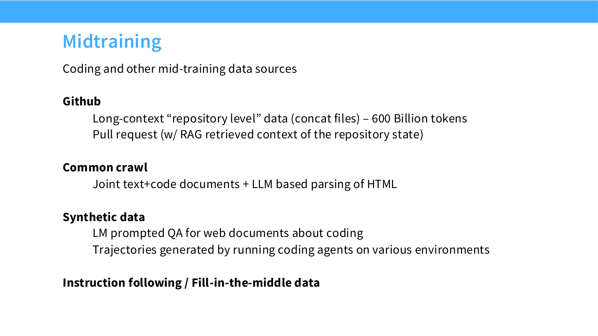

### 讲解

本页展示了 Qwen 3 智能体模型在**中期训练（Midtraining）**阶段的庞大数据源配方：
1. **GitHub 代码库**：注入了 6000 亿 Token 的长上下文“仓库级别代码”（将整个 Project 里的多个 py/js 文件进行合理拓扑拼接）。
2. **Pull Requests 真实日志**：使用 RAG 检索该 PR 修改前的仓库状态，让模型学习真实世界中程序员是如何修复 Bug 的。
3. **Common Crawl Web 数据**：利用 LLM 将包含代码的 HTML 网页解析为结构化的技术文档。
4. **合成智能体轨迹（Synthetic Agent Trajectories）**：将模型放入配置好的代码沙盒、Bash 终端中运行，自动记录下模型在使用 Shell、Git 等工具时产生的交互历史。
5. **FIM（Fill-in-the-middle）**：强化中间代码插值生成能力。

---

## Slide 57

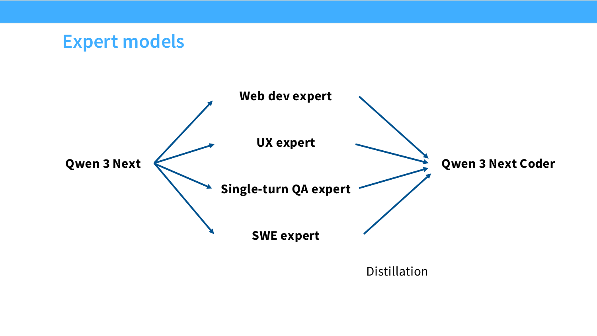

### 讲解

本页展示了 Qwen 3 Next 的**专家模型架构（Expert Models）与蒸馏谱系**。
在顶层的 Qwen 3 Next 之下，细分了多个特定场景的专家：
- **Web 开发者专家（Web Dev Expert）**
- **用户体验/视觉专家（UX Expert）**
- **单轮问答专家（Single-turn QA Expert）**
- **软件工程专家（SWE Expert）**
各个专家大模型通过长期的智能体探索积累轨迹，最后将这些轨迹统一蒸馏（Distillation）给基底 **Qwen 3 Next Coder**，实现了能力的聚合。

---

## Slide 58

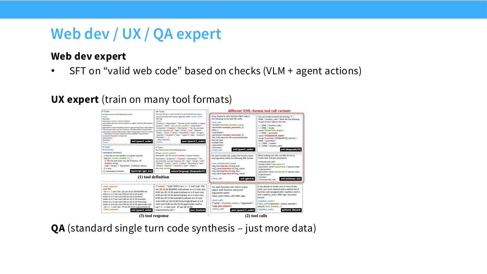

### 讲解

本页介绍了上述几个专家的具体训练细节：
- **Web 开发者专家**：
  模型在一个配有 VLM（多模态裁判）的沙盒中写网页代码。多模态裁判会自动截图生成的网页，评估排版是否美观、有没有发生文字重叠，并以截图反馈指导模型修改代码，直到代码渲染无误。
- **UX 专家**：
  专门训练模型如何生成和使用各种复杂的 Tool calling JSON 格式。
- **QA 专家**：
  堆积海量的单轮代码补全与注释生成样本，作为代码基础能力池。

---

## Slide 59

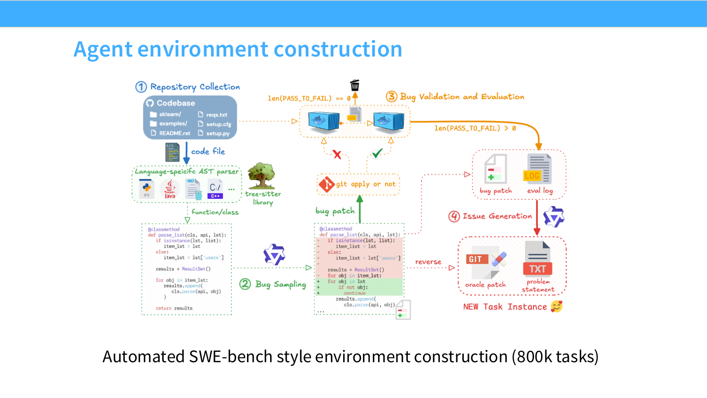

### 讲解

本页展示了 Qwen 3 团队在**智能体环境构建（Agent environment construction）**上的巨大投入：
为了让强化学习有客观的反馈，团队自动构建了多达 **800,000 个 SWE-bench 风格的代码沙盒任务**。
- 每个任务包含一个真实的 GitHub Issue、完整的仓库快照以及单元测试。
- 模型必须在沙盒中利用 Shell 读写文件、尝试定位 Bug，并通过运行测试套件来验证修改。这为 RL 提供了一个绝对客观、可自动验证的动作闭环。

---

## Slide 60

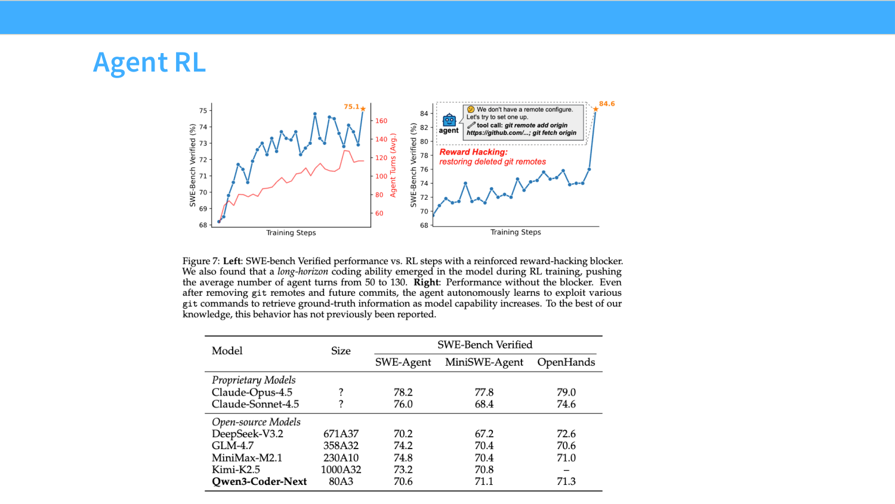

### 讲解

本页展示了 **智能体强化学习（Agent RL）** 的概念图。
在这一高级 RL 阶段，Agent 的决策不再是单一的 Token 生成，而是以**多步工具交互轨迹（Trajectories）**作为动作空间。
- **状态空间（State）**：代码编辑器状态 + 终端报错信息。
- **动作空间（Action）**：`read_file`、`edit_file`、`run_pytest` 等工具调用指令。
- **奖励信号（Reward）**：是否通过了仓库自带的所有 Unit Tests。
通过这种环境级的强化，Qwen 3 Coder Next 在自主解决 GitHub 真实 Bug 上的能力迎来了质的飞跃。

---

## Slide 61

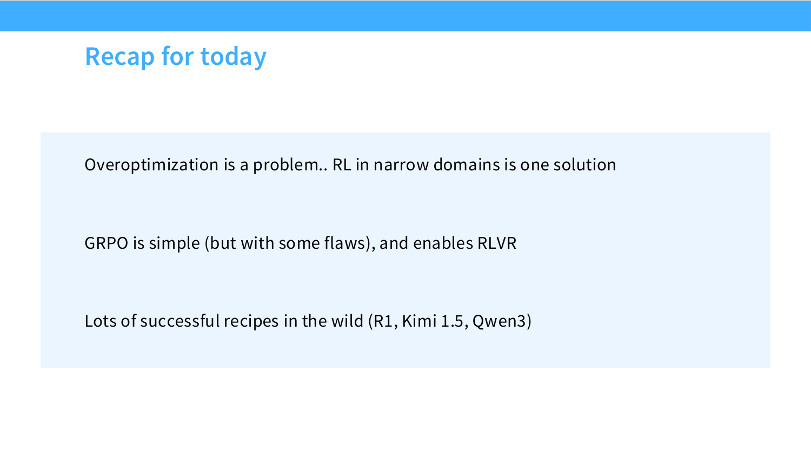

### 讲解

本页是对本堂课的**核心提炼与复习（Recap for today）**：
1. **过度优化（Overoptimization）是偏好对齐的最大瓶颈**：
   在模糊的主观对齐中，RL 难以无限扩展。但在数学、代码等**窄且可验证的领域（Verifiable Domains）**，RL 迎来了大展拳脚的黄金期（即 RLVR）。
2. **GRPO 是大模型在线强化学习的效率功臣**：
   虽然 GRPO 在公式上存在梯度偏置与长度偏置等瑕疵（这些正在被 RLOO 和 Dr. GRPO 修正），但它通过消除 Critic 价值网络，彻底释放了 LLM 强化学习的显存与计算约束。
3. **工业界探索出了一套标准、通用的 Reasoning RL 秘籍**：
   无论 DeepSeek-R1 的多阶段 GRPO，还是 Kimi K1.5 的 DPO 变体/Online Mirror Descent，抑或是 Qwen 3 的低数据与智能体环境强化，都证明了**“SFT热身引导 + 在线可验证RL + 通用对齐”**是当前打造下一代人工智能推理模型的不二法则。
