# Lecture 17: 多模态模型 (Multimodal Models) 深度笔记

本笔记基于斯坦福 CS336 (Language Modeling from Scratch) 第十七讲的课堂内容整理。在学习了纯文本语言模型（Text-to-Text）的构建与优化后，本讲将视野拓宽至**多模态模型 (Multimodal Models)**，探讨如何让 Transformer 理解和生成非文本模态（如图像、视频、音频等），最终迈向“全能模型 (Omni Model)”的终极目标。

> **课程信息**：CS336 · Spring 2026 · 主题：Multimodal Models

---

# Part 1: 多模态模型概览与核心挑战

## Slide 1: 走进多模态世界

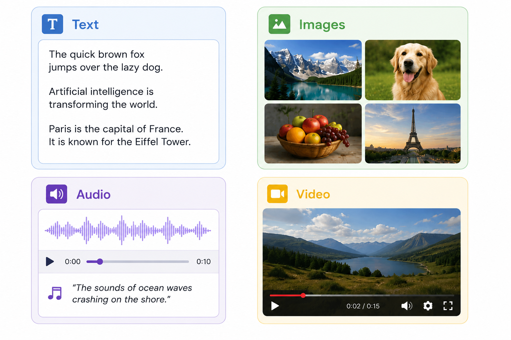

### 讲解

在先前的课程中，我们构建的语言模型（LLM）的本质都是 **文本输入 $`\Rightarrow`$ 文本输出 (Text-to-Text)**。然而，人类所处的世界是高度多模态的，包含视觉（图像、视频）、听觉（语音、音乐、环境音）以及结构化数据（3D点云、动作轨迹等）。

多模态研究的终极目标是构建 **全能模型 (Omni Model)**：
- **多模态理解 (Understanding)**：可以输入任意模态的组合（例如，文本 + 图像 + 音频）。
- **多模态生成 (Generation)**：可以输出任意模态的组合（例如，生成带配乐的视频，或生成图文并茂的排版页面）。

### 为什么选择 Transformer 进行多模态融合？

目前行业达成的共识是：**Transformer 表现极其优异，因此我们必须在多模态中继续使用它**。
Transformer 接收并处理的是 **Token 序列**，每个 Token 代表某种语义单位（Semantic Unit）。
- 对于**文本**，我们使用 BPE 等分词器将字符串转换为离散的 Token 索引（即整数）。
- 对于**非文本模态**（如图像、音频），如何将它们高效地转化为 Transformer 能“读懂”的 Token（离散或连续的向量空间），是多模态领域的首要核心挑战。

为了探讨这一挑战，本讲重点围绕两个核心问题展开：
1. **如何输入非文本数据？**（例如：如何让模型看懂图像并进行多轮问答？）
2. **如何输出非文本数据？**（例如：如何实现原生图像生成或音频生成？）

---

# Part 2: 图像编码器 (Vision Encoders)

将图像转化为 Token 序列的第一步是使用图像编码器。本节介绍多模态领域的两个里程碑式视觉预训练模型：**CLIP** 与 **SigLIP**。

---

## Slide 2: CLIP (Contrastive Language-Image Pretraining)

CLIP 是 OpenAI 于 2021 年提出的经典工作，它通过大规模的对比学习将图像和文本映射到同一个共享特征空间中。

> **论文链接**：[Learning Transferable Visual Models From Natural Language Supervision](https://arxiv.org/abs/2103.00020)

### 1. 核心背景
在 CLIP 之前，计算机视觉模型（如 ResNet）主要依赖人工精细标注的数据集（如 ImageNet 上的 1000 分类标签）。这种方法的局限性在于：
- **标注昂贵且难以扩展**。
- **分类器是静态且受限的**（无法识别标签集之外的类别，缺乏零样本泛化能力）。

CLIP 提出了一个核心问题：**能否直接利用互联网上天然存在的海量“图像-文本对”（Image-Caption Pairs）来训练通用的视觉模型？**

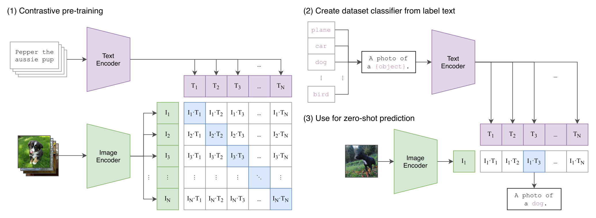

---

### 2. 训练方法
CLIP 采用 **双塔架构**，包含一个图像编码器（Image Encoder）和一个文本编码器（Text Encoder）：
- 输入一个 Batch，包含 $`N`$ 个 `(image, text)` 样本对。
- 图像编码器将每个图像映射为特征向量：$`I_1, I_2, \dots, I_N`$。
- 文本编码器将每个文本映射为特征向量：$`T_1, T_2, \dots, T_N`$。
- **对比损失函数 (Contrastive Loss)** 的目标是：
  - 最大化匹配对 `(I_i, T_i)` 的余弦相似度（即对角线元素）。
  - 最小化所有不匹配对 `(I_i, T_j) (i \neq j)` 的余弦相似度（即非对角线元素）。

#### CLIP 对比损失函数伪代码实现：

```python
# numpy style pseudocode
import numpy as np

# image_encoder - ResNet or Vision Transformer
# text_encoder - CBOW or Transformer
# I[n, d] - normalized image representations
# T[n, d] - normalized text representations
# t - learnable temperature parameter

# 1. 提取规范化特征
I_e = image_encoder(images) # [N, d]
T_e = text_encoder(texts)   # [N, d]

# 2. 特征归一化
I_e = I_e / np.linalg.norm(I_e, axis=-1, keepdims=True)
T_e = T_e / np.linalg.norm(T_e, axis=-1, keepdims=True)

# 3. 计算余弦相似度矩阵
# logits 形状为 [N, N]
logits = np.dot(I_e, T_e.T) * np.exp(t)

# 4. 对比损失计算：同时计算行方向和列方向的交叉熵
labels = np.arange(N)
loss_i = cross_entropy(logits, labels, axis=0) # 图像视角分类
loss_t = cross_entropy(logits, labels, axis=1) # 文本视角分类
loss = (loss_i + loss_t) / 2
```


---

### 3. 数据集与预处理
- **数据量**：CLIP 在包含 **4亿个 (图像, 文本)** 配对的内部数据集上进行了训练。OpenAI 并未开源该数据集，但后来学术界通过 **OpenCLIP** 使用开放的 **LAION-5B** 数据集（使用 CLIP 过滤后的版本）复现并超越了 CLIP 的性能。
- **图像预处理**（[参考 CLIP 官方源码](https://github.com/openai/CLIP/blob/main/clip/clip.py#L79)）：
  - 图像分辨率各异，CLIP 首先使用双三次插值（Bicubic Interpolation）进行缩放，使短边达到 336 像素。
  - 随后进行中心裁剪（Center Crop），裁剪出固定尺寸的 $`336 \times 336`$ 区域。

---

### 4. 模型架构细节
- **视觉编码器 (Vision Encoder)**：探索了 ResNet 和 **Vision Transformer (ViT)**。
  - 对于 ViT，将图像划分为 $`14 \times 14`$ 的 Patch。
  - **Attention Pooling (注意力池化)**：将全局平均激活值作为 Query，与所有 Patch 的激活值（作为 Key 和 Value）进行多头自注意力计算，提取出最终的全局图像表征向量。
  - 性能最佳的变体是 **ViT-L/14@336px**（Large 级别，输入分辨率 $`336 \times 336`$）。
- **文本编码器 (Text Encoder)**：使用了一个修改版的 GPT-2 Transformer（63M 参数，12 层，隐藏维度 512，8 头）。
  - 在序列开头放置 `[BOS]`，末尾放置 `[EOS]`。
  - 提取最高层在 `[EOS]` 位置的激活值作为最终的文本全局向量。

---

### 5. 关键消融实验：对比生成式与对比式效率
在训练 CLIP 时，OpenAI 尝试过不使用对比学习，而是直接让模型“看着图像生成其对应的文本标题”（Predictive 预测/生成式）。

从下图可以看出，**对比式排名（Contrastive）的计算效率比直接预测文本高出多达三个数量级**：

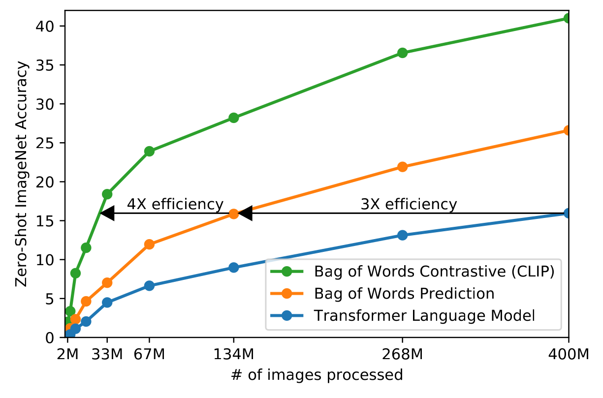

- **核心结论**：直接预测文本中每个精确词语（Generative）需要的计算量极大，而对比学习只需要模型捕捉图像与对应文本的宏观语义相关性（Semantics），这对于分类任务来说更加高产且经济。

- **局限性**：
  - 图像特征主要捕捉文本所描述的**宏观语义**（如“一只狗”），而对于极其微小的几何空间细节、目标计数或超高分辨率文字（OCR）的表征能力较弱。
  - CLIP 的 Softmax 对比损失需要计算全 Batch（可达 32768）的相似度矩阵，这在大规模分布式训练时带来了极高的跨卡通信与内存开销。

---

## Slide 3: SigLIP (Sigmoid Loss for Language Image Pre-Training)

SigLIP 是 Google 于 2023 年提出的一种改进型图像-文本预训练方法。其核心变化在于**将对比损失由 Softmax 替换为 Sigmoid**。

> **论文链接**：[Sigmoid Loss for Language Image Pre-Training](https://arxiv.org/abs/2303.15343)

### 1. 损失函数重构：Softmax vs Sigmoid
- **CLIP (Softmax)**：是一个多分类问题。对于每一个文本 $`T_i`$，模型要在整个 Batch 的 $`N`$ 个图像中进行多分类选择，找出唯一的匹配图像 $`I_i`$：
  ```math
  \mathcal{L}_{\text{softmax}} = -\sum_{i} \log \frac{e^{\text{sim}(I_i, T_i) \cdot \tau}}{\sum_{j} e^{\text{sim}(I_i, T_j) \cdot \tau}}
  ```
- **SigLIP (Sigmoid)**：将问题拆解为多个独立的二分类任务。对于 Batch 中的每一对 `(Image_i, Text_j)`：
  - 如果 $`i = j`$，则它是一个**正样本**（标签 $`y_{ij} = 1`$）。
  - 如果 $`i \neq j`$，则它是一个**负样本**（标签 $`y_{ij} = -1`$）。
  - 模型使用 Sigmoid 计算每对相似度的概率，独立计算二元交叉熵（BCE）：
    ```math
    \mathcal{L}_{\text{sigmoid}} = -\sum_{i, j} \log \sigma\left( y_{ij} \cdot \left(\text{sim}(I_i, T_j) \cdot t + b\right) \right)
    ```
    其中 $`t`$ 是可学习的缩放因子，$`b`$ 是可学习的偏置。

```python
# SigLIP 损失计算伪代码
# x 是图像特征 [N, d], y 是文本特征 [M, d]
# t 是缩放因子, b 是偏置

# 1. 计算成对点积相似度
# logits 形状为 [N, M]
logits = np.dot(x, y.T) * t + b

# 2. 构造对角线为1, 其余为-1的标签矩阵
# labels 形状为 [N, M]
labels = 2 * np.eye(N) - 1

# 3. 独立计算每个位置的 Sigmoid 损失
loss = -np.mean(np.log(sigmoid(labels * logits)))
```

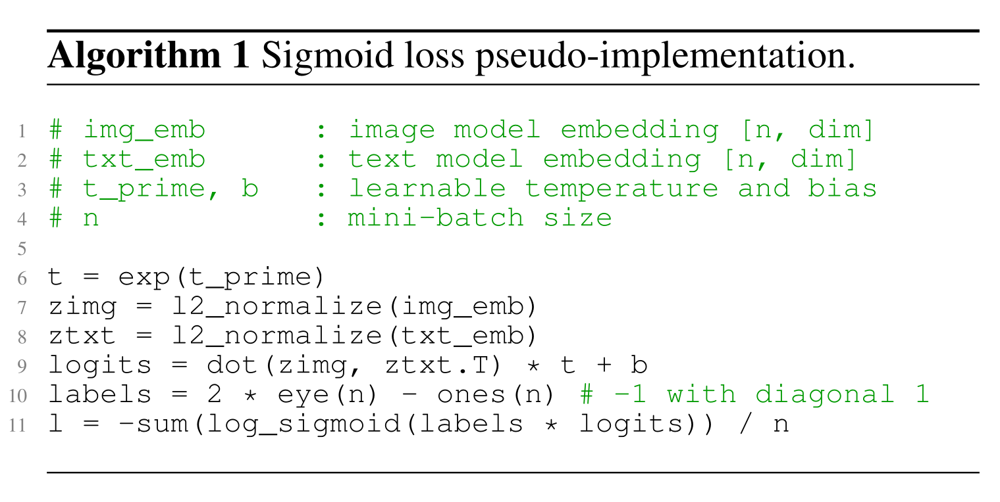

---

### 2. SigLIP 的三大优势
1. **解耦 Batch Size**：
   在 CLIP 中，损失函数的 Softmax 分母依赖于 Batch 中的全体样本，这使得 Batch Size 无法独立于损失计算之外。而在 SigLIP 中，每个图像-文本对的损失是独立计算的，这意味着**可以随意切片计算或支持任意巨大的 Batch Size**，甚至去掉了对极高并行通信的强依赖。
2. **极佳的低 Batch 性能与高扩展性**：
   SigLIP 在较小 Batch 规模下（<16K）的表现显著优于 CLIP，并且可以稳定扩展到高达 100万 的极巨型 Batch，而不会出现数值崩坏。通常 32K 左右的 Batch 就可以达到极佳效果。
3. **更高的计算与训练效率**：
   - **数据源**：使用 Google Scrape 的 **WebLI 数据集**，包含数十亿级别的噪声图文对。使用 OCR 提取图像中的文本，并过滤保留 10% 的高质数据，支持 100 种语言。
   - **效率对比**：
     - CLIP：在 256 个 TPUv3 上训练 10 天。
     - SigLIP：仅在 32 个 TPUv4（算力低于 TPUv3 集群）上训练 5 天即可达到甚至超越 CLIP 的效果。

---

# Part 3: 视觉-语言模型 (VLMs) 注入方案

有了 CLIP 或 SigLIP 提供的强大图像编码器，我们该如何把图像的特征注入到大语言模型（LLM）中，使 LLM 能够接收图像作为上下文进行多轮对话？

目前主流的设计模式是：**Vision Encoder + Projector (投影映射器) + LLM Decoder**。

---

## Slide 4: LLaVA (Large Language and Vision Assistant)

LLaVA 是 2023 年开源多模态领域的奠基工作之一，它探索了如何使用简单的线性层将视觉表征直接“对齐”到大语言模型的输入空间中。

> **论文链接**：[Visual Instruction Tuning](https://arxiv.org/abs/2304.08485)

### 1. 模型架构与数据流


- **Vision Encoder**：使用 CLIP (ViT-L/14) 提取图像特征，将 $`336 \times 336`$ 图像编码为一组 Patch 特征向量。
- **Projector**：使用一个简单的**线性投影矩阵 $`W`$**。由于 CLIP 产生的视觉向量维度与大语言模型的 Word Embedding 维度不同，投影矩阵 $`W`$ 将视觉特征向量线性映射到与文本特征相同的维度空间中。
- **Text Decoder**：使用 **Vicuna**（一个基于 LLaMA-1 在 ShareGPT 对话数据上微调而来的开源大模型）。

---

### 2. 视觉指令微调数据生成 (Visual Instruction Tuning Data)
LLaVA 成功的一大秘诀在于数据构建：
- 传统的多模态数据集（如 MS COCO）只包含简单的图像标注或物体边界框（Bounding Boxes）。如果直接用来训练，模型只会说简短的短语，无法进行复杂的逻辑推理和长文问答。
- **构建方法**：将 COCO 图像的文字描述（Captions）和检测到的物体边界框数据作为纯文本输入给 GPT-4，提示 GPT-4 充当“见证人”，生成三种高质对话数据：
  1. **多轮问答对话 (Conversations)**
  2. **细节描述 (Detailed Descriptions)**
  3. **复杂推理问题 (Complex Reasoning)**
- 最终构建出包含 **15.8万** 个样本的多模态指令跟随数据集。

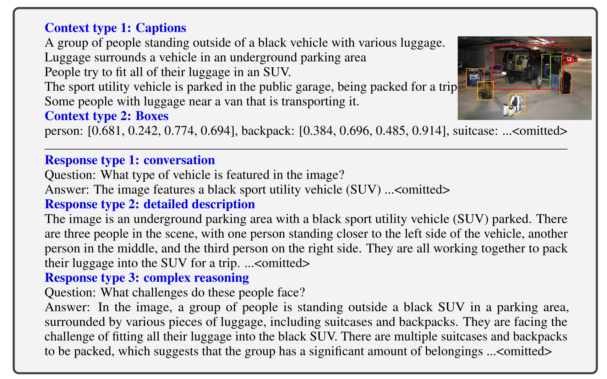

---

### 3. 两阶段训练策略
- **第一阶段：特征对齐预训练 (Feature Alignment)**：
  - 目的是让线性投影层 $`W`$ 学会将视觉空间映射到文本空间中。
  - **冻结** 视觉编码器和语言模型，**只训练投影矩阵 $`W`$**。
- **第二阶段：端到端视觉指令微调 (Visual Instruction Tuning)**：
  - 提升模型的指令跟随与交互能力。
  - 保持视觉编码器冻结，**共同训练投影矩阵 $`W`$ 和语言模型 (Vicuna)**。


---

## Slide 5: LLaVA OneVision

LLaVA OneVision 是 LLaVA 团队在 2024 年推出的最新一代多模态基础模型，重点改进了对**多图输入、视频处理以及超高分辨率（如 OCR）**的支持。

> **论文链接**：[LLaVA-NeXT-Image: Stronger LLMs Seen to be Different](https://arxiv.org/pdf/2408.03326)

### 1. 架构升级
- **视觉编码器**：换成了更强大的 **SigLIP**，并且同时使用最后两层（倒数第二层和最后一层）的特征，以同时保留低级几何细节和高级抽象语义。
- **投影器**：由原本的单线性层升级为 **两层 MLP (多层感知机)**。
- **语言模型**：采用强大的 **Qwen2-72B**。


---

### 2. 高分辨率解决方案：AnyRes 算法
传统的图像编码器（如 CLIP / SigLIP）会将输入强制缩放并裁剪为 $`336 \times 336`$，这在面对高清收据、文档或图表时，会导致文字变模糊、关键信息丢失。

LLaVA OneVision 引入了 **AnyRes**（在 LLaVA 1.5 中首次提出）来动态适应各种分辨率：


- **工作原理**：
  - 给定一张高分辨率图像，AnyRes 会将其划分为 $`a \times b`$ 个网格小块（Patches），每个小块的大小正好匹配视觉编码器（如 $`336 \times 336`$）。
  - 每个小块独立输入视觉编码器提取特征。
  - 另外，将原图整体缩放到 $`336 \times 336`$，作为一个“全局缩略图”同样进行编码，提供大尺度的上下文信息。
  - 将所有小块的特征向量与全局特征向量拼接，送入大模型。
  - 如果拼接后的 Token 数量实在太多，会使用双线性插值（Bilinear Interpolation）进行下采样。

---

### 3. 多模态输入统一 (Single-Image, Multi-Image, Video)
LLaVA OneVision 在单个框架内优雅地统一了三种形态的输入，其核心思想是**维持总 Token 数量在合理区间内**：

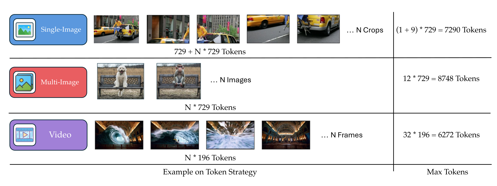

- **单图 (Single Image)**：启用 AnyRes 算法以超高分辨率输入，提取大量 Token 保证视觉细节。
- **多图 (Multi-Image)**：降至基础分辨率（如不切块的 $`336 \times 336`$）处理每张图像，防止上下文过载。
- **视频 (Video)**：将视频帧视为多图，采用更低的分辨率对每一帧进行编码（低帧率采样），最后将所有帧的特征拼接为序列。

---

### 4. 训练与数据策略
- **循序渐进的训练哲学**：从易到难、从低分辨率到高分辨率、从单图到多图再到视频。
- **数据配方**：极其注重合成的高质量任务数据，将不同的单图能力（如图表 OCR、多图对比推理、视觉提示定位）在多模态之间进行**能力迁移 (Modalities Capability Transfer)**。例如：
  - 在单图上学习图表 OCR $`\Rightarrow`$ 泛化到多图对比。
  - 在单图上学习视觉提示（如在图上画圈 circle 标记） $`\Rightarrow`$ 泛化到视频中的目标追踪。

---

## Slide 6: Qwen-VL

Qwen-VL 是阿里巴巴团队于 2023 年开源的视觉-语言模型，在结构和多模态指令方面做出了非常有特色的改进。

> **论文链接**：[Qwen-VL: A Versatile Vision-Language Model for Understanding, Localization, Text Reading, and Beyond](https://arxiv.org/abs/2308.12966)

### 1. 架构变体：交叉注意力适配器 (Cross-Attention Adapter)
与 LLaVA 使用 MLP 投影不同，Qwen-VL 采用了 **交叉注意力 (Cross-Attention) 适配器**：

- **视觉编码器**：使用 OpenCLIP 的 **ViT-bigC** 提取图像特征（产生的 Patch Token 数量很大）。
- **Adapter 机制**：
  - 定义了 $`256`$ 个可学习的查询向量（Queries），作为 Cross-Attention 层的输入。
  - 视觉编码器的特征输出作为 Key 和 Value。
  - 通过交叉注意力层，无论原图提取了多少视觉 Token，最后都**被压缩并映射到固定长度的 256 个 Token**。
  - 在交叉注意力中融入了 **2D 绝对位置编码**，这能极好地帮助模型感知物体的空间几何位置。
- **特殊 Token**：
  - 引入了 `` 和 `</img>` 标签包裹视觉 Token。
  - 引入了 `<box>` 和 `</box>` 专门用来包裹边界框（Bounding Box）坐标，引入了 `<ref>` 用于目标检测指代消解。

---

### 2. 训练的三阶段演进


1. **第一阶段：多模态大规模预训练**：
   - 目标：特征对齐。
   - 使用海量弱标注网络图文对，**冻结 LLM，只训练 Vision Encoder 和 Adapter**。
2. **第二阶段：多任务预训练 (Multi-task Pretraining)**：
   - 提升多模态基础能力，如 OCR、目标定位、多语言问答。
   - 提高图像分辨率（从 224 提升到 448），**训练所有参数**（包括 LLM 内部）。
3. **第三阶段：指令微调 (Instruction Tuning)**：
   - 提高模型的对话与交互流畅度。
   - **冻结视觉编码器**，只训练 LLM 和 Adapter。

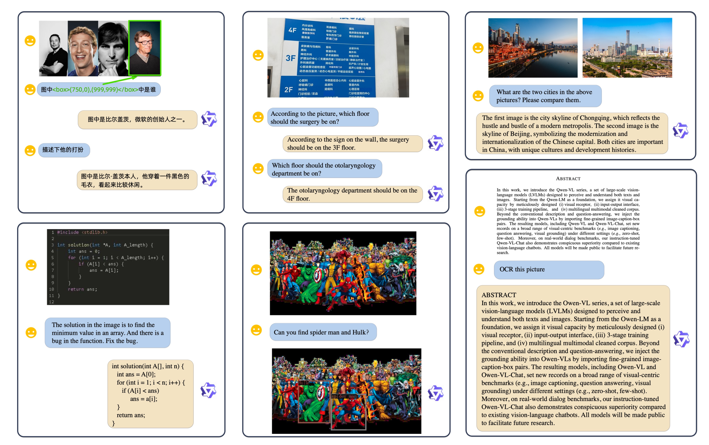

---

## Slide 7: Qwen2-VL

Qwen2-VL 是 2024 年底发布的新一代架构，做出了两项关键突破：**动态分辨率压缩**与 **多模态旋转位置编码 (MRoPE)**。

> **论文链接**：[Qwen2-VL: To See the World More Clearly](https://arxiv.org/abs/2409.12191)

### 1. 动态分辨率 (Naive Dynamic Resolution)
- 许多图像本身很小（如表情包），若强制拉伸到高分辨率，既增加开销又失真；而大图（如报纸）需要高分辨率。
- **Qwen2-VL 的解决方案**：视觉编码器（675M ViT）在原生分辨率下对图像进行 Patch 切分。
- **Token 压缩**：提取特征后，在空间中将每 $`2 \times 2`$ 个相邻的视觉 Token 压缩为一个 Token。即对于一个 $`224 \times 224`$ 的小区域，原先会产生大量的 Patch Token，现在被极度压缩，使得最终在保证分辨率细节的前提下，减少了 75% 的视觉 Token 数量。
- **视频输入**：视频同样按 2 帧/秒进行动态采样，最大支持 16384 个视觉 Token。


---

### 2. 多模态旋转位置编码 (Multimodal Rotary Position Embedding, MRoPE)
在处理多模态长文本时，文本只有一维（时间线），而图像在空间上是二维的（宽、高），视频在时空上是三维的（时间、宽、高）。

传统的 1D 旋转位置编码（RoPE）无法合理表达空间几何位置。Qwen2-VL 引入了 **MRoPE** 将位置信息解耦：

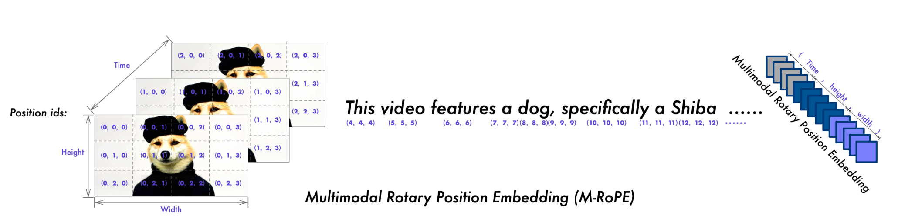

- **工作原理**：
  - 将隐藏层特征向量通道分成三部分。
  - 分别应用时间轴（Temporal）、宽度轴（Width）和高度轴（Height）的 RoPE 旋转：
    - 对于文本：时空三个轴的位置索引都设为相同（退化为普通 1D RoPE）。
    - 对于图像：时间轴设为常量，在宽度和高度轴上应用对应的二维旋转，使模型能天然编码图像的 2D 坐标亲和性。
    - 对于视频：在三个通道上应用时空 3D 旋转。

---

## Slide 8: Qwen3-VL

Qwen3-VL 是于 2025 年末发布的最新旗舰级多模态模型，它将上下文窗口提升至 256K，并引入了全新的融合架构设计。

> **论文链接**：[Qwen3-VL: Scaling Up Multimodal Foundation Models](https://arxiv.org/abs/2511.21631)

### 1. 架构与机制三大升级
1. **更强大的基础**：
   - LLM 部分全面升级为 Qwen-3 系列（包含密集模型和高达 235B 的混合专家 MoE 模型），支持原生 **256K 超长上下文**。
   - 视觉编码器升级为 **SigLIP-2**。
2. **交织多模态旋转位置编码 (Interleaved MRoPE)**：
   - 在 Qwen2-VL 的 MRoPE 中，各个坐标轴（时间、高、宽）的特征通常是按区域分块排列的（例如前三分之一表示时间，中间表示宽度，最后表示高度）。
   - Qwen3-VL 发现这会造成不同频段的失衡。于是改为**交织排列**：在通道维度上，交错布置三轴的低频与高频旋转：`[t, w, h, t, w, h, ...]`。这种交织设计显著增强了长视频和高分辨率图像的表征稳定性。
   - 在视频中，直接增加显式的**视频时间戳 Token**（而不是隐式地塞在位置编码里），极好地提升了视频定位（Temporal Grounding）任务的精度。
3. **DeepStack 适配器（跨层融合架构）**：
   - 传统的 VLM 只有最底层接收视觉 Token，视觉信息必须随着 LLM 堆叠层一层层往上传播，容易出现信息流失。
   - Qwen3-VL 摒弃了单投影层，采用 **DeepStack 适配器**，将视觉表征直接**注入到 LLM 的多个中间层**（Cross-Layer Fusion），实现多层次特征的深度融合。


---

### 2. 训练优化：开根号归一化损失 (Square-Root-Normalized Loss)
- **痛点**：视频数据的帧数很多，一个短视频可能会产生数千个 Token，而一条文本指令可能只有几十个 Token。在大规模多模态联合训练中，视频样本在 Batch 里的 Loss 权重会严重“淹没”文本 Loss，导致 LLM 的基础文本表达能力退化。
- **解决方案**：引入按 Token 数量开根号的损失权重机制，平衡不同模态样本对梯度的贡献，确保文本和多模态在联合预训练和微调中能够和谐共存、训练稳定。

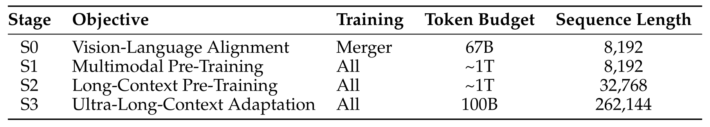

---

# Part 4: 迈向全能多模态 (Towards Omni Models)

上面讲的所有视觉-语言模型（LLaVA, Qwen-VL）都遵循 **VLM 经典模版**：图像编码器（CLIP/SigLIP）将图片转成连续向量，送入 LLM 进行文本理解。

但这存在一个**致命缺点**：**模型只能理解图像，无法生成图像**（图像生成必须依赖另一个独立的扩散模型 Diffusion Model）。

---

## Slide 9: Chameleon

Meta 于 2024 年提出的 **Chameleon** 是构建真正统一的“全能模型”的标杆性工作。其设计核心在于：**将所有模态都彻底映射为离散 Token，像预测文本下一个词一样预测图像 Token**。

> **论文链接**：[Chameleon: Mixed-Modal Early-Fusion Foundation Models](https://arxiv.org/pdf/2405.09818)

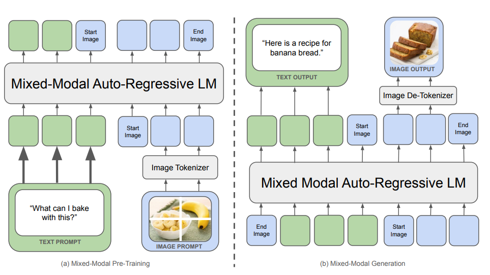

### 1. 核心图像分词器：VQ-VAE
Chameleon 首先需要将连续的图像像素离散化，变成像单词一样的“图像词汇”。它采用了 **VQ-VAE (Vector Quantized Variational Autoencoder)** 架构：

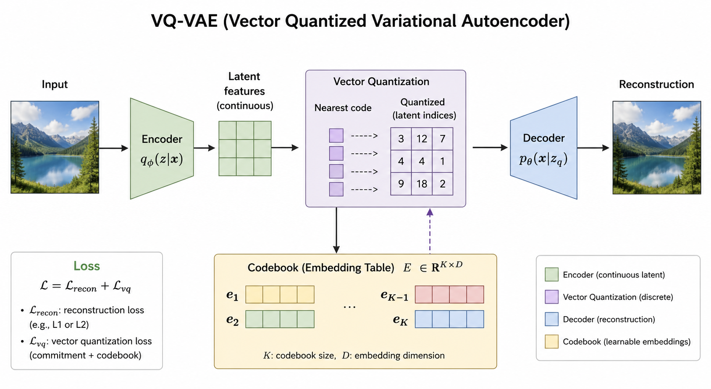

- **编码与量化 (Quantization)**：
  - 给定一个 $`512 \times 512`$ 分辨率的 RGB 图像。
  - 通过 VQ-VAE 编码器下采样为 $`32 \times 32`$ 的潜特征网格（共 1024 个位置）。
  - 在每个位置上，计算特征向量与预先训练好的 **8192 大小的离散码本 (Codebook)** 中所有向量的距离。
  - 将每个特征向量“量化”为最近的码本向量索引（即 0-8191 之间的一个整数）。
  - 这样，**一张 $`512 \times 512`$ 的图片就变成了一个固定包含 1024 个离散 Token 的序列**。
- **解码 (Decoding)**：
  - 输入 1024 个离散 Token 索引，VQ-VAE 解码器能将其还原重建为 $`512 \times 512`$ 的原始像素图像。
- Chameleon 还通过构建一个包含文本和图像 Token 的统一 BPE 分词器，将文本词表与图像的 8192 个 Token 合并。

---

### 2. 统一的自回归训练与稳定性技巧
Chameleon 将图文混排文本（Interleaved Data）输入一个标准的 Decoder-only Transformer 中，损失函数仅仅是**下一个 Token 预测的交叉熵损失 (Next-Token Prediction)**。

- **优势**：极其高雅、简单，可以无缝支持图像、文本的任意交织生成与理解。

- **痛点：训练极其不稳定**
  - 文本 Token 包含极高的语义，信息熵较低（分布集中在特定词汇上）。
  - 图像 Token 是局部几何像素的表达，信息熵极高（每个 Token 的预测分布非常发散）。
  - 在大规模混合训练中，不同模态特征交织，极易引发参数范数（Norm Growth）无限膨胀、Logits 漂移，进而导致训练崩溃崩溃（Loss 爆纳米/发散）。

- **稳定收敛的两大补丁**：
  1. **QK-Norm**：在自注意力层计算 Softmax 之前，对 Query 和 Key 特征向量强行进行 LayerNorm 归一化。
  2. **z-loss 正则化**：在交叉熵损失中加入一项对于 Logits 大小的惩罚项（即对 $`\log \sum e^{z_i}`$ 进行惩罚），将 Logits 的绝对数值控制在适中范围内，有效控制 Logit 漂移。

---

# Part 5: 总结

通过对多模态模型前沿路线的学习，我们可以梳理出以下三条演进路线与方法论总结：

| 维度 | 代表架构 / 技术 | 核心特征与折中 |
|:---|:---|:---|
| **视觉编码器** | CLIP, SigLIP, SigLIP-2 | - **CLIP** 使用全局 Softmax 对比损失，通信和显存开销大。<br>- **SigLIP** 使用 Sigmoid 二分类损失，解耦 Batch Size，吞吐量和训练效率极佳。 |
| **视觉注入方案 (VLMs)** | LLaVA, LLaVA OneVision, Qwen-VL/2/3 | - 采用 **VLM 三件套** (Encoder + Projector + LM)。<br>- **AnyRes** 动态切网格片应对超高分辨率需求。<br>- 从 1D RoPE 演进到 **MRoPE / 交织 MRoPE** 以天然适配图像 2D 和视频 3D 几何特征。<br>- **DeepStack 跨层融合** 代替底部单一注入。 |
| **离散全能模型 (Omni)** | Chameleon (VQ-VAE) | - 将所有非文本模态通过 **VQ-VAE 码本** 离散化为 Token。<br>- 仅用最纯粹的**自回归自监督**完成多模态的双向理解与生成。<br>- 受限于信息离散化的精度损失（如文字细节丢失），目前其感知和细粒度能力略逊于 VLM 模板，但在全能生成上展示了无与伦比的优雅性。 |

> [!TIP]
> **多模态工程的一大金科玉律：**
> 在大规模混合训练中，多模态（尤其是视频和长图像）的信息密度通常远低于精炼的文本。为了防止大语言模型本身强大的文本表达与推理能力被大量的时空视觉 Token 所稀释，必须在**数据配方（Data Curation）**上进行精细的上/下采样，并在**损失函数计算（如开根号归一化损失）**上进行科学的模态权重平衡。这是前沿多模态大模型能够收敛和保持高水准的核心秘密。
